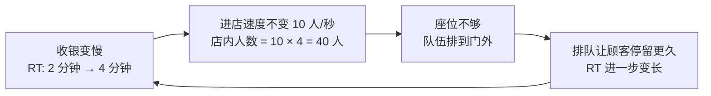
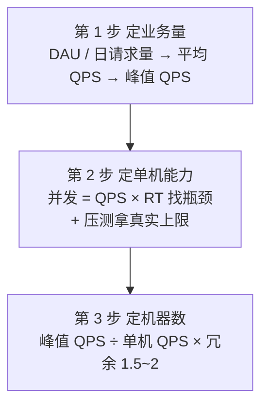

# 阶段零 · 小点 3：后端核心指标速览

> 所属：阶段零 起点盘点与补课
> 定位：补齐「服务端通用心智」的**词汇**。QPS / TPS / RT / 并发数这些指标是**与语言无关**的——不管你是写 NestJS 还是 Spring，面试被问「这个系统能抗多少 QPS」、上线前被问「要开几台机器」，靠的都是这套语言。本小点只做「认识指标 + 利特尔定律 + 一次最简算」，让后续阶段提到这些词时不再迷路；**完整的容量规划、压测方法与全链路压测在阶段六 06（容量规划与压测）展开，本小点不重复。**

## 快速入门

> 本节为「概念速览」：先看几个后端同学常挂在嘴边的指标，再用一个你天天见的生活场景——**奶茶店**——把它们全部串起来，最后认识它们和你前端已有心智的对应关系。

### 本讲核心关键词速查

| 指标 | 一句话大白话 | 和你已有的对应 |
|-|-|-|
| QPS（每秒请求数） | 系统每秒能处理多少个请求 | 类比 CDN / 网关的每秒命中量 |
| TPS（每秒事务数） | 每秒完成多少个事先定义好的业务事务 | 先说明口径，例如“成功创建订单数/秒” |
| RT（响应时间） | 一个请求从发出到返回花了多久 | 类比前端的接口耗时 / LCP |
| 并发数（在途请求） | 同一时刻尚未完成的请求有多少 | 类比浏览器里同时 pending 的网络请求；HTTP/2/3 下不能再用固定“6 个连接”概括 |
| 吞吐量 | 单位时间处理的总量（QPS/TPS 都是它） | 类比 Node 事件循环的每秒处理能力 |
| TP99（99th Percentile） | 99% 的请求 RT 都小于这个值——分位数指标，专门看长尾 | 类比前端「P75 / P95 性能基线」 |

### 本讲在解决什么问题

- **问题**：产品经理问你「这系统能扛多少并发？上线要开几台机器？」，你答不上来——这不是 Java 或 Spring 的问题，是「服务端通用心智」的缺口。这套能力与语言无关，是你最先能「复用」的部分。
- **你需要明确的点**：后端容量估算的本质是「**业务量 → 指标 → 资源**」的一条换算链——在同一观测边界和稳定窗口内，用利特尔定律（平均在途数 = 平均到达率 × 平均停留时间）把“每秒多少请求”换算成“同时有多少请求尚未完成”，再结合压测瓶颈估算机器数。

### 最简可运行示例（照抄能算）

先别管公式原理，对着下面的数字算一遍，十秒钟跑通这条换算链：

```text
场景：接口 RT 200ms，目标扛住 5000 QPS。
① 并发需求 = 5000 × 0.2s = 1000    （同时有 1000 个请求在跑）
② 单机乐观能力 = 200 线程 ÷ 0.2s ≈ 1000 QPS   （乐观上界）
③ 机器数 = 5000 ÷ 1000 × 1.5 冗余 ≈ 8 台
```

> 算完你会立刻发现两句话：**在途并发可以由吞吐与 RT 推算，不该拍脑袋**；**相同到达率下 RT 翻倍，平均在途数也会翻倍**。这并不自动等于机器数翻倍：最终瓶颈可能是 CPU、数据库连接、下游配额或线程，仍要靠压测确认。

### 关键指标说明（奶茶店版）

后端指标听着陌生，换成开奶茶店就全懂了——这套类比全篇都在用：

| 指标 | 单位 | 奶茶店版本 |
|-|-|-|
| QPS | req/s | 每秒走进店里的顾客数 |
| RT | ms / s | 每位顾客从进店到拿到奶茶离开的时长 |
| 并发数 | 个 | 同一时刻在店里的顾客数 |
| TP99 | ms | 99% 的顾客都等得起的时长 |

### 常用约定 / 数字速查

- **峰值系数（无真实曲线时的教学估值）**：有明显晚高峰的 C 端可先试算 **8~10**，较均匀的 B 端可先试算 **3~5**；上线前必须用历史小时 / 分钟曲线替换。
- **冗余系数（试算起点）**：可先用 **1.5~2**，再按故障容忍目标、扩容耗时和突发流量校准，不能代替 N+1 验证。
- 单机 QPS 的最终数字以**压测**为准，理论估算只是乐观上界（压测怎么做见阶段六 06）。

## 精简大纲

1. 四大核心指标：QPS / TPS / RT / 并发数
2. 利特尔定律：并发数 = QPS × RT（本小点最重要的公式）
3. 业务量反推：DAU / PV → 平均 QPS → 峰值 QPS
4. 一句话容量观：从峰值 QPS 到机器数（完整版见阶段六 06）

## 学习内容详情

### 1. 四大核心指标

> 先讲一个贯穿全篇的故事。**故事：你是奶茶店老板。** 高峰期客人一波接一波进门，合伙人问了你三个问题：「一分钟进多少客人？」「每个客人从排队到拿到奶茶要多久？」「店里同时有多少人？」——这三个问题的答案，就是后端指标的「奶茶店版」：

| 后端指标 | 奶茶店版 | 回答的问题 |
|-|-|-|
| QPS | 每秒进店的顾客数 | 生意多火爆 |
| RT | 顾客从进店到拿到奶茶的时长 | 顾客等得久不久 |
| 并发数 | 同一时刻在店的顾客数 | 店里挤不挤 |

- **QPS（Queries Per Second，每秒查询数）**：系统每秒能处理的请求数。互联网语境下常把 QPS 当作「每秒请求数」的通用说法（RPS，Requests Per Second），两者混用但含义一致。
- **TPS（Transactions Per Second，每秒事务数）**：每秒完成多少个**已明确口径**的事务。例如可把“一次成功下单”定义为一个业务事务，它可能由一次或多次 HTTP 调用、多个数据库事务以及异步消息共同完成。数据库 TPS 则是数据库提交事务的速率，两者不能混用。容量沟通前必须先说清统计对象、成功条件与时间窗口。
- **RT（Response Time，响应时间）**：从请求发出到响应返回的时间。**一定配百分位看**：TP50（中位数）、TP95、TP99、TP999。TP99 = 100ms 表示「99% 的请求在 100ms 内返回」，剩下 1% 是长尾——长尾往往才是用户真正骂的慢。
- **并发数（在途请求数）**：某一时刻正在处理中的请求总数。**注意**：它不是一个「指标」，而是 QPS 与 RT 的乘积（见第 2 节）——这也是为什么有人把系统压崩时看起来「每秒也没多少请求」，因为 RT 被拖长、在途请求在暴涨。

```text
// 记住这三组单位：
QPS 单位：req/s（每秒多少个）
RT  单位：ms / s（每个花多久）
并发  单位：个（同时多少个在跑）
```

### 2. 利特尔定律：并发数 = QPS × RT ⭐

这是本小点（乃至整个容量估算）最重要的公式，来自排队论（Little's Law）。它适用于到达率和完成率长期平衡、没有持续积压的稳定观测窗口，而且三个量必须使用**同一边界、同一请求集合和一致的时间口径**：

```text
在途并发数 = QPS × RT

推导：
QPS = 并发数 ÷ RT
RT  = 并发数 ÷ QPS
```

**理解（奶茶店版）**：系统就像一个奶茶店，QPS 是“每秒进多少位客人”，RT 是“每位客人从进店到离开待多久”，并发数是“店里同时有几个人”。生意火爆、顾客停留变久，店里自然就挤。若队伍仍在无限增长，就不是稳定窗口，不能拿一个瞬时公式假装系统已经达到平衡。

**口算练习**：

| 场景 | 计算 | 结果 |
|-|-|-|
| RT 200ms，QPS 5000 | 5000 × 0.2s | 并发 1000 |
| RT 100ms，扛 1000 并发 | 1000 × 0.1s | QPS 10000 |
| QPS 800，并发 400 | 400 ÷ 800 | RT 0.5s（500ms）|

**工程含义**：

- **RT 涨一倍，并发需求翻倍（雪崩的微观机制）**：故事版——假设每秒进店 10 人、每位顾客停留 2 分钟，店里始终约 20 人。突然收银机扫码卡了，每位顾客从 2 分钟变 4 分钟：进店速度没变，但店里开始积压、从 20 人涨向 40 人——座位不够、队伍排到门外；排队的顾客停留更久，停留更久店里更挤……这就是「雪崩」的微观正反馈：



> 换成后端：RT 从 100ms 涨到 200ms，同样 5000 QPS 所需的并发数从 500 涨到 1000——线程池/连接池不够就排队，排队又拉长 RT。**容量估算的核心目标之一，就是不让这条循环转起来。**

- **为什么较少的平台线程也能承载很多在途请求**：先把两类“并发”分开：
  - **逻辑在途请求数**仍是到达率 × 端到端 RT。1000 个请求都在等数据库时，它们仍然是 1000 个未完成请求，不会从容量账本里消失。
  - **平台线程占用数**取决于执行模型。Node 通过事件循环和非阻塞回调，让少量线程在 I/O 等待期间处理别的任务；Java 虚拟线程保留“一请求一线程”的同步写法，但阻塞时通常会卸载承载它的平台线程。
  - 二者都没有消除 CPU、数据库连接、内存和下游配额的约束。区别主要在于“等待期间占不占昂贵的平台线程”，而不是把端到端 RT 从 Little 定律里删掉。虚拟线程的完整边界见阶段一第 7 讲。

### 3. 业务量反推：从 DAU 到峰值 QPS

先看估算三步法的全景，下一节就是它的最后一步：



拿不到真实压测数据时，先用量级估算确定「系统该按什么量级设计」：

```text
平均 QPS = 日总请求量 ÷ 86400（一天秒数）
峰值 QPS ≈ 平均 QPS × 峰值系数（一般 4~10 倍）

// 换算起点常来自业务口径：
// DAU（Daily Active Users, 日活）× 人均请求数 = 日总请求量
// PV（Page View）/ UV（Unique Visitor）是 C 端产品口径，与 DAU 配合使用
```

| 业务规模 | 日总请求量 | 平均 QPS | 峰值 QPS（按 5 倍估）| 量级判断 |
|-|-|-|-|-|
| 小型内部系统 | 10 万 | ~1.2 | ~6 | 单机绰绰有余 |
| 中型业务 | 1000 万 | ~116 | ~580 | 需要多机 + 缓存 |
| 大型业务 | 1 亿 | ~1157 | ~5800 | 需要缓存 + 集群 + 限流降级 |

**细化峰值系数**：没有历史数据时，可以用 3~10 倍做量级敏感性分析，但它不是行业常数。更可靠的做法是按历史分钟 / 小时分布计算峰值，并叠加活动、重试风暴与增长预期；只按“最高小时流量 ÷ 3600”仍会抹平小时内尖峰。

### 4. 一句话容量观：从峰值 QPS 到机器数

```text
所需机器数 = 峰值 QPS ÷ 单机 QPS × 冗余系数（建议 1.5~2 倍）

冗余系数说明：
× 1.5~2  ≈ 预留故障转移（挂一台不垮）+ 突发流量缓冲
```

- **单机 QPS 从哪来**：先理论粗估（单机 QPS ≈ 可用并发 ÷ RT，只是乐观上界），再**压测实测**。逐级加压，观察吞吐是否继续增长、RT / 错误率是否越过 SLO，以及 CPU、GC、线程、连接池和下游是否饱和；容量点由这些约束共同决定，不能固定写成“CPU 到 80%”。**估算定数量级，压测定最终数字。**
- **容量不是越多越好**：机器多了成本高、运维重；机器少了高峰期 RT 雪崩。正确姿势是「按峰值 + 冗余」配好，再靠弹性伸缩应对突发。
- 压测怎么做、看什么数、全链路压测怎么不污染生产——**完整教程在阶段六 06（容量规划与压测），本小点保证的是「算链上的每一个词你都会」**。

## 坑点提醒

- **QPS 不是并发数**：并发数 = QPS × RT。RT 100ms、QPS 1000 时，同一时刻在途请求只有 100 个——「每秒 1000 个」和「同时在跑 100 个」是两个概念，混了容量就算错。
- **别拿平均 RT 当真相**：平均 RT 会掩盖长尾。100ms 的均值可能是 50ms 的 90% 请求 + 550ms 的 10% 慢请求算出来的——要看 TP99 / TP999。
- **别拿平均 QPS 当峰值**：一天 86400 秒，日请求量除以 86400 得到的是「平均」，峰值通常是平均的 4~10 倍（业务有明显波峰波谷时更高）。
- **理论估算只是乐观上界**：8 核 16G + RT 20ms 不能直接推出一个通用单机 QPS。真实能力必须压测实测，并同时看吞吐拐点、RT / 错误率 SLO、CPU、GC、连接池和下游限制。
- **容量不是越多越好**：机器多成本高运维重；正确姿势是「按峰值 + 冗余」配好，突发靠弹性伸缩——想不加机器，就压低真实到达 DB 层的 QPS（限流、缓存、削峰）。

## 本节自检

- [ ] 能用「奶茶店」三句话解释 QPS / RT / 并发数（每秒进店 / 停留时长 / 在店人数）
- [ ] 能口算：RT 200ms 的接口，想扛 5000 QPS 需要多少并发？（1000）
- [ ] 能反推：日均 100 万请求的业务，峰值 QPS 大概是什么量级？（~580 起）
- [ ] 能说出「雪崩」的微观机制（RT↑ → 并发需求↑ → 排队 → RT 再↑）
- [ ] 知道 TP99 是什么、为什么比平均 RT 重要
- [ ] 知道「估算定数量级、压测定最终数字」——压测方法论完整版在阶段六 06

## 本节配套思考题

1. 接口 RT 平均 250ms、TP99 800ms，目标峰值 2000 QPS，估算需要多少并发，并说明为什么平均 RT 在这里不够用。
2. 日活 50 万、人均每天触发 20 次请求，业务有典型晚高峰，估算峰值 QPS 与大致需要的服务实例数（假设压测单机 1000 QPS）。

> 参考思路：① 用平均 RT 估平均在途数：`2000 × 0.25 = 500`；不能把 TP99 直接代入 Little 定律冒充平均值，但它提示长尾请求会占用更多资源，还应结合延迟分布估算高分位压力并治理长尾。② `50 万 × 20 ÷ 86400 ≈ 116` 平均 QPS；若暂按 8 倍试算，峰值约 926 QPS，`926 ÷ 1000 × 1.5 ≈ 1.39`，向上取整为 2 台。是否需要 3 台以上取决于单实例故障后的容量、可用区策略和扩容时间，不能只靠固定系数决定。

## 常见面试题

### Q1：QPS、RT、并发数三者是什么关系？

**答**：**标准结论**：利特尔定律（Little's Law）——**并发数 = QPS × RT**，三者知二推一。例如 RT 200ms 扛 5000 QPS，在途并发就是 1000。

**原理层**：它来自排队论，在到达率与完成率长期平衡的稳定窗口成立。系统像流水线（或奶茶店），到达率是每秒进入多少件、平均停留时间是每件在线上待多久、平均在途数是线上同时有多少件；三者必须取自同一观测边界。

**工程层**：两个关键推论——
- ① **RT 与容量强耦合**：RT 翻倍，同样 QPS 所需的并发资源翻倍，线程/连接池不够就排队，排队又拉长 RT，这就是雪崩的微观正反馈；
- ② **反向定位**：线上「吞吐没涨但 RT 飙了」，用并发 = QPS × RT 反推在途请求是否暴涨，能快速判断是「量真大了」还是「某层在排队」。

> 容量估算到机器数、压测做方法的完整版在[阶段六 06（容量规划与压测）](../06-阶段六-架构设计与服务端思维/06-容量规划与压测.md)。
