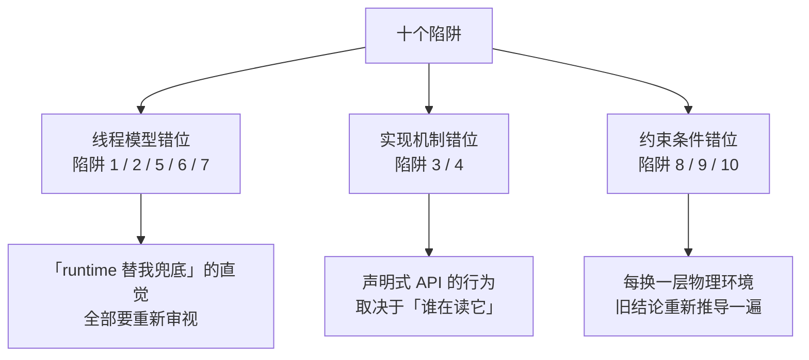

# 阶段零 · 小点 4：迁移心智陷阱清单

> 所属：阶段零 起点盘点与补课
> 定位：把散落在各阶段文档里的「直觉迁移陷阱」集中成一份**随时可回查的清单**。前端 / Node / Go 的经验能让你 90% 的概念秒懂，但剩下 10% 的实现差异会决定你写的是「能跑的代码」还是「正确的代码」——这份清单就是那 10% 的地图。**建议：每进入一个新阶段，回来快速过一遍与本阶段相关的陷阱条目。**

## 快速入门

> 本节为「陷阱速览」：先用一张表看清十个陷阱的全貌与危险等级，细节留在正文逐条展开。

### 本讲核心关键词速查

| # | 陷阱 | 你的旧直觉 | Java 的真相 | 危险等级 |
|-|-|-|-|-|
| 1 | Promise → CompletableFuture | 「回调总在统一的微任务队列」 | 非 Async 回调可能由完成任务或注册回调的线程执行；Async 方法还受执行器影响 | 🔴 会咬人 |
| 2 | goroutine → 平台线程 | 「开线程很便宜」 | 平台线程由 OS 调度且栈大小可配置，数量成本远高于虚拟线程 | 🔴 会咬人 |
| 3 | EventEmitter → Spring 事件 | 「emit 就是异步广播」 | Spring 应用事件默认同步；是否参与事务取决于发布位置与监听器类型 | 🔴 会咬人 |
| 4 | TS 装饰器 → Java 注解 | 「装饰器本身有逻辑」 | 注解只是元数据标记，行为由代理/处理器实现 → 自调用失效 | 🔴 会咬人 |
| 5 | 事件循环 → 多线程 | 「没有并行线程就不用管共享状态」 | Node 也有异步交错；Java 服务还常有多个平台线程真正并行 | 🔴 会咬人 |
| 6 | volatile ≠ 锁 | 「加 volatile 就线程安全了」 | 只保证可见性与有序性，不保证原子性 | 🔴 会咬人 |
| 7 | ThreadLocal + 线程池 | 「每个请求天然独立」 | 线程复用会串号：数据污染比泄漏更致命 | 🔴 会咬人 |
| 8 | 响应式优先 | 「异步/响应式 = 高性能」 | 阻塞式 MVC + 虚拟线程与 WebFlux 各有适用条件，不能按“先进程度”选择 | 🟡 选型盲区 |
| 9 | UUID 主键 | 「随手 UUID 当 ID」 | InnoDB 下页分裂 + 索引膨胀，主键要趋势递增 | 🟡 选型盲区 |
| 10 | 强一致执念 | 「数据必须时刻一致」 | 分区故障下按具体操作权衡一致性与可用性；最终一致也要有收敛机制 | 🟡 选型盲区 |

### 本讲在解决什么问题

- **问题**：你的旧经验让 90% 的概念秒懂，但剩下 10% 的实现差异，会写出「看似对、跑起来错」的代码——而且编译不报错、单测大概率也测不到，只在并发、事务、线上流量下才炸。比如「事件循环里随便用全局变量」到了 Java 是多线程竞态，「emit 完就返回」到了 Spring 是同步调用。
- **你需要明确的点**：迁移学习最大的风险不是「学不会」，而是「以为自己会」——旧心智的 90% 是加速器，10% 是地雷；这份清单就是排雷图。

### 最简可运行示例

十个陷阱里最有代表性的一对——Promise 回调进入 JavaScript 微任务队列，而 `CompletableFuture` 的回调线程取决于完成时机、方法是否带 `Async` 以及执行器：

```java
// ❌ 直觉写法：不指定执行器，IO 阻塞会饿死公共池
CompletableFuture.supplyAsync(() -> httpClient.call());

// ✅ 阻塞 IO 任务可显式使用每任务一个虚拟线程的执行器
try (var pool = Executors.newVirtualThreadPerTaskExecutor()) {
    CompletableFuture.supplyAsync(() -> httpClient.call(), pool);
}
```

> 同样的直觉，在 JS 里是对的，在 Java 里是雷。本清单全部 10 条都是同一个模式：**旧直觉 → Java 的真相 → 正确姿势**——先认识雷，再排雷。

### 使用这份清单的正确姿势

1. **不是背，是对照**：写代码/做设计时，遇到对应场景回来查一条。
2. **每条三问**：我的旧直觉是什么？为什么在 Java 里不成立？正确姿势是什么？
3. **阶段联动**：陷阱 1/2/6/7 在阶段一展开，陷阱 3/4 在阶段二展开，陷阱 8/9/10 在阶段三、四、六展开——学到对应阶段时回看，理解会立体一层。

### 约定与等级说明

- **🔴 会咬人**：写错了编译能过、单测大概率测不到，一上线就咬人（并发与框架语义层）。
- **🟡 选型盲区**：不是语法错，是选型错——方向偏了，代码写得越漂亮偏得越远（架构与数据层）。
- 每条陷阱固定四段式：**旧直觉 → Java 的真相 → 正确姿势（含代码）→ 出处**（指向展开该陷阱的阶段文档）。

## 精简大纲

1. 会直接咬人的七个陷阱（并发与框架语义层）
2. 选型层面的三个盲区（架构与数据层）
3. 陷阱背后的统一规律：三组「心智错位」

## 学习内容详情

### 陷阱一：把 Promise 的微任务语义套到 CompletableFuture 🔴

**旧直觉**：JavaScript 的 `.then` 回调会在当前调用栈结束后进入微任务队列；在通常的浏览器主线程或 Node 事件循环代码中，开发者不直接选择某个工作线程来执行它。

**Java 的真相**：
- `thenApply` 等非 Async 延续没有“统一微任务线程”承诺：可能由完成前一阶段的线程执行；若前一阶段已完成，也可能由注册回调的调用线程执行。
- `supplyAsync` 不显式指定执行器时通常使用 `ForkJoinPool.commonPool()`（并行度不足等特殊环境可能采用替代线程）。把大量长时间阻塞 IO 放进去，会挤占并行流和其他共用任务的执行资源。

**正确姿势**：

```java
// ❌ 直觉写法：不指定执行器，IO 阻塞会饿死公共池
CompletableFuture.supplyAsync(() -> httpClient.call());

// ✅ 阻塞 IO 任务可显式使用每任务一个虚拟线程的执行器
try (var pool = Executors.newVirtualThreadPerTaskExecutor()) {
    CompletableFuture.supplyAsync(() -> httpClient.call(), pool);
}
```

**出处**：阶段一第 7 讲（并发编程）、第 11 讲（现有知识映射）。

### 陷阱二：把 goroutine 的成本模型套到平台线程 🔴

**旧直觉**：Go 里常能创建大量 goroutine，于是容易把它的成本模型直接套到 Java 平台线程上。

**Java 的真相**：
- 每个平台线程通常对应一个 OS 线程，并有可配置的本地栈和内核调度成本；具体栈大小不是固定 1 MB，也不要把“可创建数量”写成统一硬上限。大量短任务通常需要复用平台线程池。
- 虚拟线程（JDK 21 起正式可用）由 JVM 调度，适合“一任务一虚拟线程”。在 JDK 能识别的阻塞操作上，虚拟线程通常会卸载出承载线程；native / foreign 调用等边界仍可能占住承载线程，详见阶段一第 7 讲。
- 连带心智更新：**虚拟线程不要池化**——用平台线程的「复用」心智去管理它是反模式，它是一次性资源。

**正确姿势**：阻塞 I/O 型、彼此独立的任务可优先评估 `Executors.newVirtualThreadPerTaskExecutor()`；CPU 密集任务通常使用有界平台线程池，大小从可用处理器数量附近开始压测。虚拟线程不做池化，但仍要用连接池、信号量等限制数据库连接和下游配额等稀缺资源。

**出处**：阶段一第 7 讲、阶段零小点 1。

### 陷阱三：把 EventEmitter 的语义套到 Spring 事件 🔴

**旧直觉**：`bus.emit("order.paid", order)` 是进程内广播——发布者发完就走，订阅者各自处理，互不拖累。

**Java 的真相**：默认事件广播器下，`ApplicationEventPublisher.publishEvent` 会在发布线程同步调用普通监听器；如果发布动作发生在事务内，普通同步监听器才会处在该调用链与事务上下文中。一个监听器抛出未处理异常，可能使发布调用失败。这不是“性能差异”，而是执行与失败语义不同：
- 要异步：`@Async` + `@EnableAsync`（还要给异步配置专用执行器）。
- 要“事务提交成功后再触发”：`@TransactionalEventListener(phase = AFTER_COMMIT)`。默认没有事务时它不会执行（除非开启 `fallbackExecution`）；提交后的监听器若还要可靠写库或跨进程发消息，需要新的事务或 Outbox，而不是把“收到回调”等同于“可靠投递”。

**正确姿势**：用 Spring 事件前先问两个问题——「监听器要不要参与发布者的事务？」「监听器失败要不要影响主流程？」答案决定用 `@EventListener`（同步、同事务）还是 `@TransactionalEventListener`（事务边界后）还是 `@Async`（异步）。

**出处**：阶段一第 11 讲、阶段二第 1 讲。

### 陷阱四：把 TS 装饰器当 Java 注解 🔴

**旧直觉**：TS 装饰器（配合 reflect-metadata）声明即生效，`@Injectable()` 挂上就是可注入。

**Java 的真相**：注解（Annotation）**本身只是元数据标记，没有任何逻辑**——行为全部来自「读注解的框架代码」：Spring 的 AOP 会为 Bean 生成**代理对象**，把 `@Transactional` 的逻辑织入代理层。由此推导出著名的失效场景：

```java
public void methodA() {
    this.methodB();   // ❌ this 是原始对象, 调用绕过代理 → @Transactional 形同虚设
}

@Transactional
public void methodB() { /* 写库 */ }
```

同类高频边界还有：方法可见性与代理类型 / 配置不匹配、异常被捕获后未继续抛出或标记回滚、受检异常未配置回滚规则、事务方法内换线程执行数据库操作（事务上下文默认绑定在线程）。业务方法保持 `public` 是最容易理解和移植的约定，但不要把所有代理实现机械概括成“非 public 一律失效”。

**正确姿势**：记住推导心法——Spring 常见的 `@Transactional` 由代理拦截调用，事务资源默认绑定当前线程。未经过代理时，不会创建该注解声明的新事务；切换线程时，原事务上下文不会自动传播。内部调用需要独立事务语义时，通常优先拆分到另一个 Bean，并用测试验证真实边界。

**出处**：阶段二第 1 讲（五大失效场景）、阶段一第 3 讲（动态代理）。

### 陷阱五：用单线程心智对待共享状态 🔴

**旧直觉**：Node 主事件循环通常一次执行一段 JavaScript，于是全局变量、单例缓存、模块级状态似乎不需要并发设计。

**Java 的真相**：Node 代码在多个 `await` 之间也可能发生逻辑交错，使用 Worker Threads 或多进程时还会增加并发边界；Java Web 服务则通常由多个线程真正并行处理请求。默认 singleton Bean 的可变字段因此可能被多个请求并发访问：

```java
private int count = 0;                    // singleton Bean 的字段
public void hit() { count++; }            // 两个请求并发调用 → 丢更新
```

**正确姿势**：把「这段代码会不会被并发访问？」当成后端默认要过的一道安检——共享可变状态要么消灭（不可变对象 / record），要么显式同步（`AtomicInteger` / `ConcurrentHashMap` / 锁），要么线程私有（`ThreadLocal`，配合陷阱七的清理纪律）。Go 经验（「别以共享内存来通信」）在这里有迁移价值，但 Java 的 JMM 是显式规范，需要系统学（阶段一第 5 讲）。

**出处**：阶段一第 5、7 讲。

### 陷阱六：以为 volatile 能当锁用 🔴

**旧直觉**（Go/前端共同盲区）：「加个 volatile / atomic 关键字就线程安全了」——很多从没深究过语义的开发者的模糊认知。

**Java 的真相**：`volatile` 恰好做两件事、坚决不做第三件：
- ✅ **可见性**：写立即对其他线程可见（不走 CPU 缓存）
- ✅ **有序性**：禁止指令重排跨过它
- ❌ **原子性**：`volatile int i; i++` 照样丢更新——「读→改→写」三步之间随时被插队

```java
volatile int counter = 0;
// 两个线程各执行 10000 次 counter++，结果可能小于 20000；具体结果不确定
```

**正确姿势**：状态标志位（一写多读）用 volatile；计数/累加用 `AtomicInteger`（CAS）或 `LongAdder`（高并发计数）；复合状态用锁或不可变替换。配套高危知识点：DCL 单例少了 volatile 会偶发拿到半成品对象——编译不报错、单测抓不到、上线偶发 NPE。

**出处**：阶段一第 5 讲（JMM）。

### 陷阱七：ThreadLocal 用完不还，请求之间串号 🔴

**旧直觉**：前端每个请求天然独立，从来没有「上一个请求的数据串到下一个请求」这种事。

**Java 的真相**：线程池的线程是**复用的**——Tomcat 工作线程处理完请求 A 并不销毁，转头就处理请求 B。`ThreadLocal` 变量挂在**线程**上而不是请求上：

```java
// 请求 A: CTX.set(currentUser) ... 异常路径没走 remove()
// 同一线程处理请求 B: CTX.get() → 拿到的是 A 的用户!
```

后果不只是内存泄漏（value 被线程强引用吊着），更致命的是**数据污染**：MDC 的 TraceID 串进下一个请求的日志、用户上下文串号——这类事故排查起来极难，因为它「偶发且无法稳定复现」。

**正确姿势**：铁律 `try { ... } finally { threadLocal.remove(); }`；新代码优先用 Java 25 的 `ScopedValue`（不可变 + 作用域结束自动清理，从机制上消灭「忘 remove」）。

**出处**：阶段一第 5 讲。

### 陷阱八：以为「响应式 = 高性能 = 必须学」🟡

**旧直觉**：前端社区推崇异步非阻塞（RxJS、async/await 全家桶），看到 WebFlux/Reactor 自然觉得「这是更先进的方向，早晚要学」。

**Java 的真相**：对以阻塞式数据库 / HTTP 调用为主、希望保持顺序式代码的业务服务，Web MVC + 虚拟线程通常值得先评估；虚拟线程提升的是等待型并发，不会让 CPU 密集计算或下游连接池凭空变快。WebFlux 更适合需要端到端非阻塞、流式处理或背压的链路。若在事件循环线程直接调用同步 ORM，会阻塞该线程并显著削弱 WebFlux 的并发优势；可以隔离到专用调度器，但这会增加切换与运维复杂度，并非“整套框架立即失效”。

**正确姿势**：先问是否需要背压 / 流式管道，再看依赖是否支持非阻塞调用和团队能否维护响应式链路；否则优先评估 MVC + 虚拟线程。即便使用虚拟线程，也要限制数据库连接、第三方接口等稀缺资源的并发量，并识别 native 调用等承载线程占用边界。

**出处**：阶段二第 4 讲（WebFlux 与响应式选型）。

### 陷阱九：随手拿 UUID 当数据库主键 🟡

**旧直觉**：前端生成 ID 首选 UUID（`crypto.randomUUID()`），全局唯一、不依赖服务端、天然安全。

**Java 后端的真相**：MySQL InnoDB 是**聚簇索引**——数据按主键物理组织，UUID 的随机性意味着每次插入都落在一个随机页，导致**页分裂 + 缓存命中率低 + 索引体积膨胀**（UUID 36 字符 vs bigint 8 字节）。写入量大的表上，这是实打实的性能税。

**正确姿势**：主键用**趋势递增**的整数类 ID——雪花算法（Snowflake：时间戳 + 机器 ID + 序列号，本地生成不依赖中心服务）或号段模式（Leaf）。UUID 留给「对外暴露的业务标识」（且建议用有序变体 UUIDv7）。雪花算法的坑是**时钟回拨**（NTP 校时可能导致重复 ID）——知道这个边界即可。

**出处**：阶段四第 3 讲（分布式核心理论）、阶段三第 1 讲。

### 陷阱十：迷信强一致，忽视最终一致 🟡

**旧直觉**：数据必须时刻一致，不一致就是 bug——单机单库时代的朴素直觉。

**故事：你给朋友微信转账 100 元。** 你的银行（A 行）扣款成功了，朋友的银行（B 行）却迟迟没显示到账。如果你是用户，你能容忍「钱已扣、没到账」这个窗口持续多久？几秒？几分钟？还是「第二天一早对账发现已补齐」也能接受？——**「不一致窗口能容忍多久」，就是分布式一致性设计的全部问题**。

**分布式下的真相**：A 行和 B 行是两个独立系统，中间隔着网络。网络分区无法靠设计永久消除；当分区发生时，一次具体操作必须在“拒绝 / 延迟部分请求以维持一致性”和“继续响应但允许暂时读到旧值或产生待收敛状态”之间取舍。这个选择应按数据和操作逐项决定，不能给整个系统贴一个笼统的 CP 或 AP 标签。允许短暂不一致的流程，还必须用重试、幂等、补偿与对账保证最终收敛。上面转账故事里，四个高频方案各自长这样：

| 方案 | 在转账故事里长什么样 | 一句话原理 |
|-|-|-|
| 本地消息表 | A 行扣款时，在本地库写一张「待发通知表」；后台任务不停把表里的记录发给 B 行，B 行确认成功才标记已发 | 「扣款」和「记录该通知」进同一个本地事务，重试有据可依 |
| 事务消息 | MQ 协调本地事务结果与消息提交，并在结果不明确时回查；消息仍可能重复，消费端必须幂等 | MQ 承担事务状态检查与消息重投的一部分可靠性职责 |
| Saga | B 行入账失败后，A 行执行「冲正」，把 100 元退回你的账户 | 一长串操作，失败就一步步倒着补偿 |
| 对账兜底 | 每天凌晨两家银行对账，发现 A 扣了 B 没到，自动补 | 所有方案之外的最后一层保险 |

**正确姿势**：跨服务的一致性问题先问业务不变式、失败时能否补偿，以及不一致窗口能容忍多久。可补偿且允许延迟收敛时，本地消息表 / Outbox、事务消息或 Saga 往往更合适；确实要求跨资源同步原子性的操作才评估分布式事务，并接受可用性、耦合与运维成本。金融系统内部也会同时使用强一致账本和最终一致通知，不能只按行业名称选型。

**出处**：阶段四第 3 讲、阶段三第 2 讲。

### 统一规律：三组「心智错位」

十个陷阱背后其实是三组结构性的心智错位——理解了组，就能预判没列进清单的新陷阱：



1. **线程模型错位**（陷阱 1/2/5/6/7）：Node 常把调度藏进 runtime，Java 则让线程、执行器和内存可见性更显式。生活版：从一个话务员按队列切换任务，迁移到多个客服同时接电话；共享记录若没有规则，就可能发生覆盖。类比边界是：Node 的异步任务也会交错，并非天然没有竞态。
2. **实现机制错位**（陷阱 3/4）：TS 装饰器与 Java 注解「形似神不似」——声明式 API 的行为取决于「谁在读它」，Spring 的答案是代理，于是「调用路径是否经过代理」成为一切框架语义的分水岭。生活版：你以为贴个标签（注解）标签自己会干活，实际标签只是标记，干活的是「读标签的人」（框架代理）——标签贴的位置没人读到（自调用），就没人干活。
3. **约束条件错位**（陷阱 8/9/10）：单机直觉在分布式/存储场景失效——网络会断（CAP）、磁盘按页组织（聚簇索引）、物理资源有限（同步阻塞的代价）。生活版：单机像在自家客厅（东西随手放都找得到），分布式像跨城搬家（包裹可能丢在路上、搬家公司也会放假），存储像仓库（货架按编码顺序摆放，乱贴编号翻找就慢）。每换一层物理环境，旧结论都要重新推导一遍。

## 坑点提醒

- **这份清单是排雷图不是免修卡**：每条陷阱的完整原理都在对应阶段展开，清单只保证你「踩之前知道这里有雷」。
- **别矫枉过正**：看到 CompletableFuture 就恐慌、看到共享变量就上锁——理解边界后按场景选型，而不是把每个陷阱当成禁令。
- **清单会过期**：随 JDK 版本演进（如 JEP 491 后 synchronized 块不再 pin 虚拟线程），个别结论会更新——以对应阶段的正文为准。

## 本节自检

- [ ] 能脱稿说出十大陷阱中至少七个的「旧直觉 → Java 真相 → 正确姿势」
- [ ] 能解释三组「心智错位」分别对应哪几个陷阱，并各举一个生活化例子
- [ ] 写 CompletableFuture 时会条件反射地指定执行器；写 ThreadLocal 时会条件反射地 finally remove
- [ ] 能向一个前端背景的同事讲清楚 `@Transactional` 自调用为什么失效（讲不清 = 陷阱四还没过）

## 本节配套思考题

1. 把十个陷阱按「编译期能发现 / 单测能发现 / 只能线上发现」分三类——分布情况说明迁移陷阱的什么本质？（提示：能在哪一层拦截，决定了防御手段的成本）
2. 陷阱四（注解与代理）和陷阱三（事件与事务）其实是同一个底层机制的两种表现——这个机制是什么？还能推出哪些还没列出的失效场景？
3. 你过去在前端/Node 项目里有没有一次「直觉迁移成功」的经历？和这十个陷阱对照，成功的条件是什么？

## 常见面试题

### Q1：为什么说 CAP 里的 P 不是可选项？强一致和最终一致怎么选？

**答**：**标准结论**：网络分区无法被永久排除；分区发生时，一类具体读写操作要么拒绝 / 延迟部分请求以维持一致性，要么继续响应但接受旧读或待收敛状态。不同数据和操作可以作不同选择；采用最终一致时，还必须明确重试、幂等、冲突解决、补偿与对账机制。

**原理层**：CAP 的 C/A 取舍只在网络分区下讨论，而且要落到某类读写操作。最终一致也不等于“网络恢复后自然一致”；系统必须有可验证的重试、幂等、冲突解决或补偿机制，才能保证状态收敛。

**工程层**：选型同时看不变式、可补偿性、不一致窗口和故障模型。允许延迟收敛时可优先评估 Outbox / 本地消息表、事务消息或 Saga；确需跨资源同步原子性时再评估 Seata 等方案。涉及资金、库存等关键数据时，无论采用哪种协调方式，都应补上审计与对账。

### Q2：本地消息表和事务消息（MQ）有什么区别？怎么选？

**答**：**标准结论**：两者都试图原子地留下“业务已完成、后续消息必须处理”的证据，但可靠性职责不同。本地消息表让业务数据和待发记录进入同一数据库事务，再由发布器重试；事务消息由支持该协议的 MQ 协调半消息、本地事务结果与状态回查。二者都可能重复投递，都要求消费幂等和失败告警。

**原理层**：核心思想都是把「业务操作」和「记录该做的事」放进同一个事务，让「忘记做」成为不可能；差异只是「记录与重试的载体」是本地表还是 MQ。

**工程层**：已有支持事务消息的 MQ、能治理回查与运维复杂度时可以选事务消息；希望协议简单、业务库可直接审计时可选本地消息表 / Outbox。两者都要监控积压、设置重试与死信 / 人工处置路径，并让消费端幂等；关键链路再用对账兜底。

### Q3：WebFlux（响应式）比 Spring MVC 更先进吗？该什么时候用？

**答**：**标准结论**：没有谁“更先进”。阻塞调用占主导、希望保持顺序式代码时，优先评估 Web MVC + 虚拟线程；需要端到端非阻塞、流式处理和背压时，WebFlux 更合适。二者都受 CPU、数据库连接和下游容量约束。

**原理层**：响应式通过少量事件循环线程与非阻塞 API 处理大量等待；虚拟线程通过廉价线程保留阻塞式编程模型。WebFlux 链路若直接在事件循环线程调用同步 ORM，会阻塞事件循环；隔离阻塞调用虽可缓解，但会引入额外线程切换和容量治理。

**工程层**：选型先问「要不要背压 / 流式管道」，再问「团队是否接受全链路响应式纪律」，两个都不是就留在 WebMVC——把 WebFlux 当特定场景的专项工具，而不是「更先进的默认选择」。
