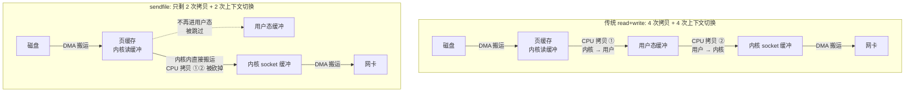
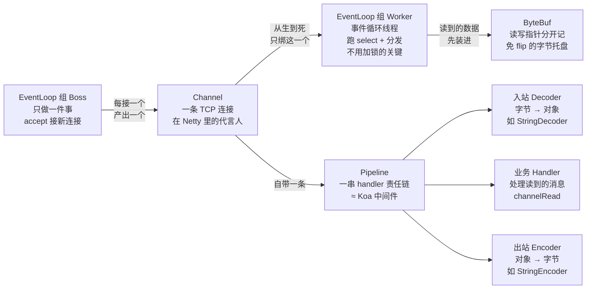

# 阶段一 · 小点 9：IO 与 NIO

> 所属：阶段一 Java 语言深化与 JVM 体系
> 定位：理解 NodeJS 事件循环与 Java NIO 的异同，为 WebFlux（阶段二第 4 讲）和 RPC 框架（阶段四第 5 讲）打基础。这一讲的关键不是「会写 NIO 代码」（业务层极少直接写），而是**看懂线程模型图**——出连接数 / 直接内存问题时能推理到这一层。

## 快速入门

> 本节为「IO 模型速览」：先认识几种 IO 模型的长什么样、为什么一个够一个不够；「零拷贝、Netty 三件套」留在正文提高部分。

### 本讲关键词与概念速查

| 关键词 | 最低解释与典型用途 | 使用边界 |
|-|-|-|
| 字节流 / 字符流 | `InputStream` / `OutputStream` 处理原始字节；`Reader` / `Writer` 处理按字符集编解码的文本 | 图片、压缩包等不是文本，不能交给字符流；文本必须明确字符集 |
| 缓冲 / try-with-resources | `BufferedReader` / `BufferedWriter` 减少底层读写调用；`try (...)` 在成功或异常时都关闭资源 | 缓冲不改变编码；关闭顺序和异常处理仍要按业务需求设计 |
| `Charset` / UTF-8 | 在字节与字符之间明确用 `StandardCharsets.UTF_8` 编解码 | 不要依赖操作系统默认字符集；编码不一致会乱码或出现替换字符 |
| IO / BIO | 程序读写设备；BIO 的调用线程会等待操作完成 | 平台线程一连接一阻塞时，连接数会受线程资源限制 |
| NIO / `Selector` | 非阻塞 Channel 配合选择器处理就绪事件 | 一个或少量事件循环可管理很多连接，但仍要按事件循环和线程模型分工 |
| 多路复用 | 内核通知一组连接中哪些已经就绪 | `select`、`poll`、`epoll` 是不同平台机制，不能混为同一实现 |
| 零拷贝 / `transferTo` | 减少数据在用户态和内核态之间的复制 | 是否走 `sendfile` 取决于平台、文件和目标通道 |
| Netty / `Channel` / `ByteBuf` | 基于 NIO 的网络框架、连接抽象与缓冲区 | 业务层通常使用框架 API，不直接手写 `Selector` 循环 |

### 本讲在解决什么问题

- **问题**：先把文件的「字节如何变文本、资源何时关闭」做对；再看服务器同时处理很多网络连接时，为什么「一个连接一个线程」会耗尽平台线程，以及 NIO 如何用就绪事件减少等待线程。
- **你需要明确的点**：**BIO 是一对一**（一个线程等一个连接，阻塞），**NIO 是一对多**（一个线程用 Selector 管多个连接，谁就绪处理谁）。这就是为什么高并发网络要用 NIO / Netty。

### 最简可运行示例（先走通文件 IO，再进 NIO）

```java
import java.io.BufferedReader;
import java.io.IOException;
import java.nio.charset.StandardCharsets;
import java.nio.file.Files;
import java.nio.file.Path;

public class FileIoDemo {
    public static void main(String[] args) throws IOException {
        // 前置：项目根目录有 UTF-8 编码的 notes.txt，第一行例如“你好，Java IO”。
        Path path = Path.of("notes.txt");

        // Reader = 字节按 UTF-8 解码成字符；try-with-resources 保证异常时也关闭文件句柄。
        try (BufferedReader reader = Files.newBufferedReader(path, StandardCharsets.UTF_8)) {
            System.out.println(reader.readLine());
        }

        // 原始文件字节可用字节 API 读取；只有“文本”才按同一 Charset 转成 String。
        byte[] bytes = Files.readAllBytes(path); // 只适合能整体装入内存的小文件
        System.out.println(new String(bytes, StandardCharsets.UTF_8));
    }
}
```

> **文件 IO 最低路径**：二进制内容使用 `InputStream` / `OutputStream` 或 `Files.readAllBytes` 等字节 API；文本用 `Reader` / `Writer`，并在读写两端明确同一个 `Charset`（默认选 UTF-8）。`BufferedReader` / `BufferedWriter` 在小块频繁读写时减少底层调用；`try-with-resources` 在正常返回和抛异常时都关闭文件。把 UTF-8 文件交给默认字符集或其他编码解码，可能得到乱码或 `�`；“加缓冲”无法修复编码不匹配。

接下来才进入网络 NIO：

```java
// NIO 多路复用的骨架: 一个线程监听多个连接的就绪事件
import java.nio.channels.*;
import java.net.*;
import java.nio.*;

public class NioDemo {
    public static void main(String[] args) throws Exception {
        Selector selector = Selector.open();                 // 多路复用器
        ServerSocketChannel server = ServerSocketChannel.open();
        server.bind(new InetSocketAddress(8080));
        server.configureBlocking(false);                     // 关键: 非阻塞
        server.register(selector, SelectionKey.OP_ACCEPT);   // 只关心"有新连接"事件

        while (true) {
            selector.select();                               // 阻塞等, 有事件才继续
            for (var key : selector.selectedKeys()) {
                if (key.isAcceptable()) {
                    var conn = server.accept();              // 接受新连接
                    conn.configureBlocking(false);
                    conn.register(selector, SelectionKey.OP_READ);   // 该连接关心"可读"
                }
            }
            selector.selectedKeys().clear();
        }
    }
}
```

> 代码备注（逐行解释）：
> - `Selector.open()`：一个「多路复用器」，能同时管理多个 Channel 就绪事件。
> - `configureBlocking(false)`：**非阻塞**——读写不挂线程，没数据就立刻返回。
> - `register(selector, OP_ACCEPT/OP_READ)`：把连接「注册」到 Selector，声明我只关心「可接受/可读」事件。
> - `selector.select()`：阻塞等待，**只要有任一注册的事件就绪就返回**——一个线程就能管理成千上万个连接。
> - 对比 BIO：传统 BIO 常让一个平台线程等待一个连接；NIO 可让少量事件循环管理许多就绪连接。实际还要按 CPU 核数、事件负载和业务处理方式分配事件循环。

### 常用约定 / 命名提示

- **业务层几乎不直接写 NIO**：NIO/Netty 是框架层的事，你更可能是「用 Spring WebFlux / Netty」的人——看懂模型即可，别手撸 Selector。
- **零拷贝的价值**：`transferTo` 在合适的平台、文件与目标通道组合下可能使用高效的零拷贝路径（例如 `sendfile`），但 Java API 不保证具体系统调用；数据是否进入用户态须以实际实现和压测为准。
- **虚拟线程时代**：同步 BIO 写法 + 虚拟线程对多数业务已够用，不用为了「性能」硬上 NIO。

## 精简大纲

1. 文件 IO 最低路径：字节 / 字符 / 缓冲 / 资源关闭 / Charset
2. BIO / NIO / AIO 三代模型
3. 多路复用：select / poll / epoll
4. 零拷贝：sendfile / mmap
5. Netty 三件套：EventLoop / Channel / ByteBuf

## 学习内容详情

### 1. 文件 IO：先分清字节、字符与资源生命周期

- **字节是底层事实**：文件、网络最终都是字节；`InputStream` / `OutputStream` 适合图片、压缩包、协议帧等原始数据。只有确认内容是文本，才用 `Reader` / `Writer` 把字节按指定 `Charset` 解码/编码；`Files.readAllBytes` 是小文件的便利 API，大文件应流式/分块处理。
- **UTF-8 是契约，不是猜测**：生产配置、文件生成方与读取方应共同声明 UTF-8；不要用无参 `FileReader` / `FileWriter` 或 `new String(bytes)` 偷用平台默认字符集。乱码先核对“写入时编码、读取时编码、文件实际字节”三者是否一致。
- **缓冲与关闭各司其职**：`BufferedReader` / `BufferedWriter` 减少小块读取/写入的底层调用；它们不负责选择编码。文件、socket、channel 都应放进 `try-with-resources`，防止异常路径遗留句柄。

> **前端对照**：浏览器/Node 中 `Buffer` 是原始字节；`buffer.toString("utf8")` 才是解码。把一段 UTF-8 字节按另一种编码转字符串，和 Java 乱码是同一类契约错误。

### 2. 网络 IO：BIO / NIO / AIO 三代模型

| 模型 | 一句话 | 线程与连接的关系 |
|-|-|-|
| BIO（Blocking IO） | 一连接一线程，读写阻塞 | 连接数 = 线程数，连接多则线程爆炸 |
| NIO（Non-blocking IO） | 多路复用，少量线程管理大量连接 | 一个 Selector 可管成千上万连接 |
| AIO（Async IO） | 内核完成 IO 后回调通知 | Windows 的 IOCP（完成端口异步 IO 机制）比较完整，Linux 落地有限 |

> ⏸️ **短期可以不学**：AIO（异步 IO）——Linux 上的 AIO 落地不完善（生产主流仍是 epoll 多路复用），Netty 也未主推，绝大多数业务开发接触不到。**何时回来学**：深入 Netty 的 io_uring（Linux 新一代异步 IO 接口）移植，或面试被追问「Java 为什么没普及 AIO」时。**面试最低要求**：能说「Java AIO 在 Linux 支持有限、生产主流是 NIO 多路复用；虚拟线程出现后连同步 BIO 写法都复活了」即可。

#### 2.1 BIO 的困境（代码看到痛处）

```java
import java.io.*;
import java.net.*;

public class BioServer {
    public static void main(String[] args) throws IOException {
        var server = new ServerSocket(8080);
        while (true) {
            Socket client = server.accept();      // 阻塞点①: 没有新连接就干等
            // 每个连接必须开一个线程 —— 因为 read 也会阻塞, 会把 accept 卡死
            new Thread(() -> {
                try (client;
                     var in = new BufferedReader(new InputStreamReader(client.getInputStream()));
                     var out = new PrintWriter(client.getOutputStream(), true)) {
                    String line;
                    while ((line = in.readLine()) != null) {   // 阻塞点②: 没数据就挂在这
                        out.println("echo: " + line);
                    }
                } catch (IOException ignored) {}
            }).start();                              // 1 万个连接 = 1 万个线程 ≈ 1万MB 栈内存
        }
    }
}
```

> **银行类比（生活版）**：BIO 服务器 = 一家「来一个客户就开一个新窗口、雇一个新柜员」的银行——1 万个客户就得开 1 万个窗口、雇 1 万个柜员，而窗口数有硬上限（线程是重资源），更糟的是大多数窗口其实在干等（连接建了但一直没数据）。
>
> **换成 Java**：NIO 是「一个叫号屏 + 少量柜员」——叫号屏（Selector）盯着所有客户，谁的号亮了（事件就绪）哪个柜员去办，来一万个客户也不用开一万个窗口。上面代码里 `1 万个连接 = 1 万个线程 ≈ 1 万 MB 栈内存` 正是这种模式的落点：线程数与连接数一比一，连接一多就撑爆。

> **痛点本质**：阻塞的是**线程**，而平台线程通常对应内核调度实体，栈大小还受 `-Xss` 与平台配置影响。常见缓解方向是让等待线程更轻量（虚拟线程），或让少量事件循环管理多个连接（NIO）；具体选择还要看下游资源与业务处理方式。

> ⏸️ **短期可以不学**：手写 BIO 服务器（上面的 `BioServer`）只是「看清痛处」的教学演示——“每连接一个平台线程”会受线程资源约束；同步 BIO 配合虚拟线程也可服务许多 IO 密集场景，不必专门手写。**何时回来学**：不需要专门学，理解「连接等待如何占用执行资源」即可。**面试最低要求**：能说「传统 BIO 的等待会占用平台线程；NIO 多路复用与虚拟线程分别从减少等待线程、降低线程成本两个方向缓解它」即可。

### 3. 多路复用：select / poll / epoll

> 🧩 **前置 30 秒：fd（文件描述符）**——操作系统给每个打开的东西（文件、网络连接）发的一个整数编号牌，后续读写都凭号取件。Java 的 Channel、Node 的 socket、Linux 的一切 IO，底层挂的都是这张号牌。下文 select/epoll 管理的就是一堆 fd（细节在本讲下文的对比表展开）。

- **多路复用（Multiplexing）**：把「一堆连接谁就绪了」的询问交给内核，线程只处理「就绪的连接」——NodeJS 的事件循环（libuv）在 Linux 上就是构建于 epoll 之上，机制同源。

```java
import java.io.IOException;
import java.net.InetSocketAddress;
import java.nio.ByteBuffer;
import java.nio.channels.*;
import java.util.Iterator;

public class NioEchoServer {
    public static void main(String[] args) throws IOException {
        var selector = Selector.open();                       // 多路复用器(底层 Linux=epoll)
        var server = ServerSocketChannel.open();
        server.bind(new InetSocketAddress(8080));
        server.configureBlocking(false);                      // 非阻塞: 所有调用立即返回
        server.register(selector, SelectionKey.OP_ACCEPT);    // 把"关心 ACCEPT 事件"登记到 selector

        while (true) {
            selector.select();                                // 阻塞到"至少一个事件就绪"(只等一次)
            Iterator<SelectionKey> it = selector.selectedKeys().iterator();
            while (it.hasNext()) {
                SelectionKey key = it.next();
                it.remove();                                  // 必须手动移除, 否则下轮重复处理
                if (key.isAcceptable()) {                     // 新连接
                    SocketChannel ch = server.accept();
                    ch.configureBlocking(false);
                    ch.register(selector, SelectionKey.OP_READ);   // 登记读事件 —— 一个线程管 N 个连接
                } else if (key.isReadable()) {                // 某连接有数据可读
                    SocketChannel ch = (SocketChannel) key.channel();
                    ByteBuffer buf = ByteBuffer.allocate(256);
                    int n = ch.read(buf);
                    if (n == -1) { ch.close(); continue; }    // 对端关闭
                    buf.flip();                               // 写转读模式: limit=position, position=0
                    ch.write(buf);                            // echo 回去
                }
            }
        }
    }
}
```

> **对比上面 BIO 版**：单线程处理所有连接——`select()` 一次醒来，返回的只有就绪的连接（epoll 的功劳），没有线程在无谓地等。这种「一个线程盯一堆连接、事件来了分发给 handler」的编排模式叫 **Reactor（反应器）模式**——事件像反应堆里的变化，谁来谁处理。Tomcat NIO / Netty / Redis 的事件模型全部是这个循环的工程化强化版，Netty 是 Reactor 的工业级实现（自检里要画的「BIO 与 NIO 线程模型对比图」，NIO 那半画的就是它）。

#### 3.1 select / poll / epoll 对比

**奶茶店类比（生活版）**：select/poll = 每轮把全店客人的名单抄给店员（所有 fd 全量拷进内核），店员挨个去问「你的奶茶好了吗」（线性扫描），好了才告诉你；客人一多这一轮就特别久，而且名单每轮都要重抄一遍。epoll = 客人进门先取号登记（fd 注册一次），出餐时叫号屏只显示「奶茶好了」的号，店员只看叫号屏就行（只返回就绪的）。

**换成 Java**：select/poll 每次调用全量拷 fd + 线性扫描；epoll 注册一次，fd 就绪时内核把它挂进就绪列表，`epoll_wait` 只把就绪的返回给应用。不要把它背成“整个网络处理恒为 O(1)”：注册、内存管理与处理 k 个就绪事件仍有成本；学习重点是它避免了每轮对全部 n 个 fd 的用户态传递与线性扫描。底层具体用什么数据结构（红黑树、链表）不重要——记住「**登记本 + 叫号屏**」这个分工就够了：


| 维度 | select / poll | epoll（Linux） |
|-|-|-|
| fd 传递 | 每次调用全量拷进内核 | 注册一次，内核维护红黑树 |
| 就绪检测 | 内核线性扫描全部 fd | 事件回调填就绪链表，只返回就绪的 |
| 等待路径 | 每轮随被检查 fd 数增长 | 返回就绪事件；处理 k 个就绪事件至少是 O(k)，但避免全量扫描 |
| 连接数上限 | select 有 FD_SETSIZE 限制 | 无硬上限（受内存约束） |

- macOS 用 kqueue（macOS 的 epoll 等价物）、Windows 用 IOCP（完成端口异步 IO 机制，前面 AIO 表格已提过）——Netty 这类跨平台框架的存在意义就是抹平这层差异。

### 4. 零拷贝

> 🧩 **前置 30 秒：用户态 / 内核态**——CPU 分两种权限模式：内核态 = 操作系统内核的后厨（能直接碰磁盘、网卡），用户态 = 你的应用程序（不能直接碰硬件，必须托内核代办）。每次 App 要 IO 都得「点菜 → 后厨做好 → 端出来」，权限模式来回切换（上下文切换）本身就有成本。「拷贝发生在哪」说的就是数据在这两个地盘之间搬了几趟（细节在本讲下文的对比图展开）。

- **零拷贝（Zero-Copy）**：让文件数据从磁盘直达网卡、不经过用户态——传统路径要 4 次拷贝 + 4 次上下文切换，`sendfile` 把中间两次砍掉。
- **两个地基概念**：**页缓存（page cache）**——内核管的一块磁盘数据缓存，读过的磁盘数据先落在内存里，下次直接读内存，不用再碰磁盘；**DMA（Direct Memory Access）**——网卡/磁盘自带的「搬运引擎」，搬数据不占 CPU，CPU 只需发一个搬运指令。所以数「拷贝次数」时，DMA 那几趟不算 CPU 拷贝。

```java
import java.io.FileInputStream;
import java.io.IOException;
import java.net.InetSocketAddress;
import java.nio.channels.FileChannel;
import java.nio.channels.ServerSocketChannel;
import java.nio.channels.SocketChannel;

public class ZeroCopySend {
    public static void main(String[] args) throws IOException {
        var server = ServerSocketChannel.open();
        server.bind(new InetSocketAddress(9090));
        try (SocketChannel socket = server.accept();   // SocketChannel 实现了 WritableByteChannel
             FileChannel file = new FileInputStream("big-file.bin").getChannel()) {
            // API 允许平台采用高效的零拷贝路径（例如 sendfile），但不保证具体系统调用。
            // 目标通道本次没有进展时不能死循环；非阻塞场景通常应等待 OP_WRITE 后重试。
            long sent = 0, total = file.size();
            while (sent < total) {
                long count = file.transferTo(sent, total - sent, socket); // 目标是 WritableByteChannel，不是 OutputStream
                if (count == 0) {
                    throw new IOException("channel made no progress; retry after OP_WRITE in non-blocking code");
                }
                sent += count;
            }
        }
    }
}
```



> 看图对比：传统路径的「CPU 拷贝 ①」（内核 → 用户）和「CPU 拷贝 ②」（用户 → socket 缓冲）在 sendfile 路径里全被砍掉——数据全程没出内核，用户态零参与，上下文切换也从 4 次降到 2 次。这就是「零拷贝」真正的含义：不是零次拷贝，而是零次用户态拷贝。

> 注：`transferTo` 的第三个参数是 `WritableByteChannel`——`SocketChannel` 正是它的实现（把 `OutputStream` 传进去连编译都过不了）。认知重点：**Kafka 的高吞吐 = 顺序写磁盘 + sendfile 零拷贝发送**（阶段三第 5 讲回收此伏笔）。

- **mmap（内存映射文件）**：把文件直接映射进进程的内存地址空间，之后读写文件就像读写数组——省掉「内核 → 用户」那趟拷贝，适合随机读改写（RocksDB 这类存储引擎爱用）；sendfile 适合整块转发（Kafka / Nginx 爱用）。两者对比的展开见思考题 3 与面试题 Q3。

### 5. Netty 三件套

- **Netty**：对 NIO 的工程化封装（事件循环、内存池、编解码与协议分帧）——常见于 Netty 服务端及 gRPC-Java 的 Netty transport 等场景。它**不是** Java Elasticsearch REST 客户端的通信底座：官方 Java API Client 通过 HTTP 传输，默认使用基于 Apache HttpClient 5 的 `Rest5Client`。业务开发通常消费框架/客户端 API，但连接数、直接内存与协议边界问题仍要能推理到这一层。两个经典痛点拆开看：

**① 粘包 / 拆包（场景故事）**：你连发三条消息「你好」「在吗」「吃了吗」，对方一次 `read` 却读到「你好在吗吃了吗」——TCP 是**字节流**、没有消息边界（Node 的 `data` 事件拿到的同样是 chunk，只是框架替你处理了）。反过来，消息到了半截也可能一次只读到「你」「好在吗吃」这种半个消息。解法三选一：定长消息、分隔符（如换行）、或头部带长度字段——Netty 的 `LengthFieldBasedFrameDecoder` / `DelimiterBasedFrameDecoder` 就是干这个的，把字节流按「边界」切回完整消息。

**② 空轮询 bug（Linux epoll 的已知缺陷）**：epoll 偶发「没事件也立即返回」，让 `select()` 空转（spurious wakeup）疯狂烧 CPU。Netty 用自旋计数检测：连续空转超过阈值（默认 512 次）就判定「这个 Selector 中招了」，重建一个新 Selector，把旧注册全部迁移过去（换 selector 规避）。

```java
import io.netty.bootstrap.ServerBootstrap;
import io.netty.channel.*;
import io.netty.channel.nio.NioEventLoopGroup;
import io.netty.channel.socket.SocketChannel;
import io.netty.channel.socket.nio.NioSocketChannel;
import io.netty.handler.codec.LineBasedFrameDecoder;
import io.netty.handler.codec.string.StringDecoder;
import io.netty.handler.codec.string.StringEncoder;
import io.netty.util.CharsetUtil;

public class NettyEchoServer {
    public static void main(String[] args) throws Exception {
        // EventLoopGroup: 一组线程各自持有 Selector; 连接绑定到固定 EventLoop → 无锁
        var boss = new NioEventLoopGroup(1);      // 只管 accept(类似 NioEchoServer 的主循环)
        var workers = new NioEventLoopGroup();    // 管已建立连接的读写(默认 2×CPU 核)

        try {
            var b = new ServerBootstrap();
            b.group(boss, workers)
             .channel(NioServerSocketChannel.class)
             .childHandler(new ChannelInitializer<SocketChannel>() {
                 @Override
                 protected void initChannel(SocketChannel ch) {
                     ch.pipeline()                 // pipeline: 一串 handler 的责任链(≈ Express/Koa 中间件)
                      .addLast(new LineBasedFrameDecoder(1024)) // 先按换行分帧：客户端每条消息须以 \n 结束
                      .addLast(new StringDecoder(CharsetUtil.UTF_8)) // 入站：完整字节帧 → UTF-8 String
                      .addLast(new StringEncoder(CharsetUtil.UTF_8)) // 出站：String → UTF-8 字节
                      .addLast(new ChannelInboundHandlerAdapter() {
                          @Override
                          public void channelRead(ChannelHandlerContext ctx, Object msg) {
                              ctx.writeAndFlush(msg);   // echo: 写回并立即发送, 会沿出站方向过 Encoder
                          }
                      });
                 }
             });
            ChannelFuture f = b.bind(8080).sync();   // 启动完成前阻塞等待
            f.channel().closeFuture().sync();        // 保持服务运行
        } finally {
            boss.shutdownGracefully();
            workers.shutdownGracefully();
        }
    }
}
```

**四件套关系图**（配合上面 NettyEchoServer 代码读——EventLoop 是干活的线程循环、Channel 是连接的化身、数据在 Channel 自带的 Pipeline 里流过一串 handler、运输的载体是 ByteBuf，白话都写在节点里）：



- **EventLoop（事件循环线程，类比 Node 的事件循环，但 Netty 开了多条）**：一条跑「等事件就绪 + 分发处理」的循环线程——与 Node 单线程事件循环的差异：Netty 是**多 EventLoop 并行**，但每个 EventLoop 内部仍是单线程循环。
    - **免锁的关键（绑定）**：一个连接从生到死**只归属一个 EventLoop**，同一连接的所有事件永远串行在同一条线程里——handler 天然不用加锁（呼应思考题 2 的提示）。
    - **代码对应**：上面代码里 `NioEventLoopGroup` 就是「一组 EventLoop」——`boss` 组只管 accept，`workers` 组管已建立连接的读写。
- **Channel（连接抽象 = 一条 TCP 连接在 Netty 里的代言人）**：里面装着三样东西——fd（对应底层那条连接）、读写操作（connect / read / write 等）、pipeline。
- **ByteBuf（字节容器 = 数据在管道里流通时装的托盘）**：读写指针分离，不再需要 `flip()` 手动切模式。
    - **对比 ByteBuffer 的 flip**：`ByteBuffer` 读写共用一根 position，换方向前必须 `flip()`——忘调是经典事故（上面 NIO 示例里 flip 那行就是）；ByteBuf 用 `readIndex` / `writeIndex` 两个指针分开记「读到哪 / 写到哪」，消灭了这个心智负担。
    - **支持池化**：用完归还复用，减少分配与 GC 压力（池化的内部实现，见下方 ⏸️ 框，现在可跳过）。

> ⏸️ **短期可以不学**：ByteBuf 内存池的内部实现（`PooledByteBuf` 的 arena / chunk / page 分级、线程本地缓存与分配器调优参数）——业务层只消费框架 API，不碰分配器。**何时回来学**：排查「直接内存被 Netty 撑爆」，或面试 Netty 方向时。**面试最低要求**：能说「ByteBuf 区分堆内/直接内存、读写指针分离免去 flip，池化是为了减少分配与 GC 压力」即可。

- **分帧与字符集是两件事**：`StringDecoder` 只把已有字节帧按字符集解码，不能解决 TCP 粘包/拆包；示例先用 `LineBasedFrameDecoder` 定义“换行是一条消息”的边界。`StringDecoder` / `StringEncoder` 的无参构造使用**平台默认字符集**，中文等文本协议应显式传 `CharsetUtil.UTF_8`。

## 坑点提醒

- `ByteBuffer` 忘 `flip()`：写出全空或读到脏数据——翻转前 limit 还是旧容量位。
- NIO 不等于异步：`select()` 仍然是阻塞等待，只是等待的粒度从「单个连接」变成「一批事件」。
- 虚拟线程时代 BIO 写法复活了：`同步 BIO 代码 + 虚拟线程` 对多数业务已够用（阶段一第 7 讲）——NIO 的手工 Selector 代码几乎不该再手写。
- Netty 的堆外直接内存（off-heap / Direct Memory，白话：绕开 JVM 堆、直接开在系统内存里的缓冲区）不计入 Java 堆；其释放既可能依赖对象可达性/清理器，也可能依赖 Netty `ByteBuf` 的引用计数。它不会在普通堆曲线中完整呈现，引用计数漏 `release()` 时不能指望 GC 及时兜底——所以必须上保险：
    - **好处（为什么用它）**：网络读写免去「堆内 → 堆外」那趟拷贝，数据直接在内核 / 网卡之间搬。
    - **坏处（为什么是坑）**：泄漏或峰值失控时，可能表现成「堆很健康但进程因 native 内存不足而失败」。
    - **兜底手段**：按 JDK/部署环境评估 `-XX:MaxDirectMemorySize`，监控 native 内存，并在 Netty 中启用泄漏检测、保证 `ByteBuf` 所有权和 `release()` 配对。

## 本节自检

- [ ] 能区分字节流与字符流，并说明为什么文本读写要在两端显式约定 UTF-8
- [ ] 能画出 BIO 与 NIO（Reactor）的线程模型对比图，说清「谁在阻塞、阻塞多久」
- [ ] 能解释 epoll 相对 select 的两个核心优势，并说出 NodeJS 事件循环与它的关系
- [ ] 能描述零拷贝省掉了哪几次拷贝，举出两个使用它的中间件
- [ ] 能说清 Netty 的 EventLoop / Channel / ByteBuf 各自解决什么问题
- [ ] 场景：聊天服务有十万空闲长连接，但每条消息处理很短。能判断为何不能简单采用“一个平台线程守一个连接”，并核对 NIO 方案是否把就绪通知、事件循环和业务处理线程分开考虑。

> 核对要点：空闲连接会长期占用平台线程和栈；选择器只负责发现就绪事件，事件循环应避免阻塞，耗时业务需交给合适的执行器或分片处理。

## 本节配套思考题

1. 一个 UTF-8 的 `notes.txt` 在某台机器读成乱码：你如何依次核对文件实际字节、写入端编码、读取端 `Charset`？为什么 `BufferedReader` 不能单独修复问题？
2. BIO + 虚拟线程（`Executors.newVirtualThreadPerTaskExecutor()` 里跑 accept 循环）和 NIO Selector，各自适合什么规模 / 什么维护成本偏好的团队？
3. 为什么 Netty 把「一个连接固定绑定一个 EventLoop」而不是让任意 EventLoop 处理任意连接的事件？（提示：pipeline 里的 handler 是否需要加锁？）
4. `mmap` 与 `sendfile` 都是零拷贝路径，为什么消息队列类中间件（Kafka）偏爱 sendfile，而 RocksDB 这类存储引擎偏爱 mmap？

## 常见面试题

### Q1：NIO 的三大组件是什么？为什么一个线程能管理成千上万个连接？

**答**：**标准结论**：三大组件是 Channel（通道）、Buffer（缓冲区）、Selector（多路复用器）。一个线程能管成千上万连接，是因为阻塞的粒度从「等单个连接的数据」变成「等一批连接里任何一个有事件」，事件就绪才派线程处理。

**原理层**：
- **Channel（通道）**：连接的抽象——文件、网络都抽象成通道。
- **Buffer（缓冲区）**：读写数据的载体，读写要 `flip()` 切换模式。
- **Selector（多路复用器，核心）**：一个线程把多个 Channel 注册到 Selector 上，`select()` 阻塞等待内核通知「哪些连接就绪」，然后只处理就绪的连接。
- **对比 BIO**：传统 BIO 常是一连接一平台线程；NIO 让少量事件循环管理多连接，但事件循环和业务处理仍要按负载设计。

**工程层**：
- **三个高频坑**：`selectedKeys()` 处理完要 clear、`flip()` 忘了切换读写模式、非阻塞通道没配好。
- **你很少手写它**：Tomcat NIO / Netty / WebFlux 都是它的工程化封装，但「连接数问题、直接内存问题」都要能推理到这一层。

### Q2：select、poll、epoll 有什么区别？为什么 epoll 更适合大量连接？

**答**：**标准结论**：三者都是 I/O 多路复用（I/O Multiplexing）的实现——把「一堆 fd 谁就绪了」的询问交给内核。epoll 通过「注册一次 + 返回就绪事件」避免 select/poll 的每轮全量传递与线性扫描，更适合大量空闲连接；不应把它概括成“整个处理过程恒为 O(1)”。

**原理层**：
- **select / poll**：每次调用都要把全部 fd 从用户态拷进内核、内核线性扫描一遍，复杂度 O(n)；select 还有 FD_SETSIZE（1024）上限。
- **epoll（Linux）**：fd **注册一次**进内核；fd 就绪时内核把就绪项挂进**就绪链表**；`epoll_wait` 返回就绪项——不需要每轮全量扫描和重复传递。处理 k 个就绪项仍有至少 O(k) 的工作。
- **面试加分结构**：能说出「红黑树管注册 + 就绪链表收事件」这个双结构。

**工程层**：
- **谁在用**：NodeJS 的 libuv、Redis、Tomcat NIO 在 Linux 上都构建于 epoll。
- **跨平台差异**：macOS 用 kqueue、Windows 用 IOCP——由 Netty 这类框架抹平。

### Q3：什么是零拷贝？它省掉了哪几次拷贝？sendfile 和 mmap 有什么区别？

**答**：**标准结论**：零拷贝（Zero-Copy）= 数据从磁盘到网卡的过程中尽量减少「内核态 ↔ 用户态」之间的拷贝；它**不是「零次拷贝」**，而是**零次用户态拷贝**——DMA 拷贝仍在（但那几趟不算 CPU 拷贝）。

**原理层**：
- **传统 read + write 路径**：磁盘 → 内核读缓冲 → 用户缓冲 → 内核 socket 缓冲 → 网卡，共 **4 次拷贝 + 4 次上下文切换**。
- **`sendfile`**：让数据在内核内直接走「磁盘 → 页缓存 → socket 缓冲 → 网卡」，**砍掉两次用户态参与的拷贝**，上下文切换也减少。
- **`mmap`**：把文件映射进用户地址空间，用户态能直接读写内核页缓存，**省掉一次「内核 → 用户」的拷贝**，适合随机读改写（如 RocksDB 存储引擎）。
- **两者怎么选**：sendfile 适合「整块转发」——Kafka 发消息、Nginx 发静态文件都是这条路。
- **工程误区**：零拷贝不是「零次拷贝」——省的是用户态参与和上下文切换。

**工程层**：Java 侧用 `FileChannel.transferTo()`，底层即 sendfile；注意第三个参数是 `WritableByteChannel`（`SocketChannel` 是它的实现），不是 `OutputStream`。

### Q4：直接内存（堆外内存）和堆内存有什么区别？为什么要用直接内存？

**答**：**标准结论**：堆内存由 JVM 管理、受 GC 支配；直接内存（Direct Memory / off-heap，白话：绕开 JVM 堆、直接开在系统内存里的缓冲区）是 `ByteBuffer.allocateDirect` 分配的本机内存，不走堆、不受 GC 管理（由 `Cleaner` 配合回收）。**一句话动机：网络读写免去「堆内 → 堆外」的一次拷贝。**

**原理层**：
- **分配与归属**：`allocateDirect()` 开在**本机内存**，不进 JVM 堆，不受 GC 管理。
- **为什么省拷贝**：数据直接在系统内存和内核 / 网卡之间搬——NIO 读写要求数据在直接缓冲区时效率最高。
- **与堆内存的核心差别**：堆内受 GC 支配、堆满就触发 GC；直接内存不吃堆的额度，也不被 GC 扫描，回收靠 `Cleaner` 配合。

**工程层**：**优势**——
- **免一次拷贝**：网络读写时数据直接在系统内存和内核 / 网卡之间搬，NIO 读写要求数据在直接缓冲区时效率最高。
- **不受堆大小限制**：大对象不触发频繁 Full GC。

**代价与坑**——
- **不受 GC 管**：泄漏时表现成「堆很健康但进程 OOM 被杀」（native 内存吃光）。
- **要限顶与监控**：配 `-XX:MaxDirectMemorySize` 限制并监控。
- **分配 / 释放成本高**：比堆内贵，要池化复用。

**排查落点**：Netty 的 ByteBuf 区分 heap / direct 两种、默认走池化 direct——这也是 Netty 连接数问题的排查重点：直接内存暴涨，先看是不是缓冲泄漏。
