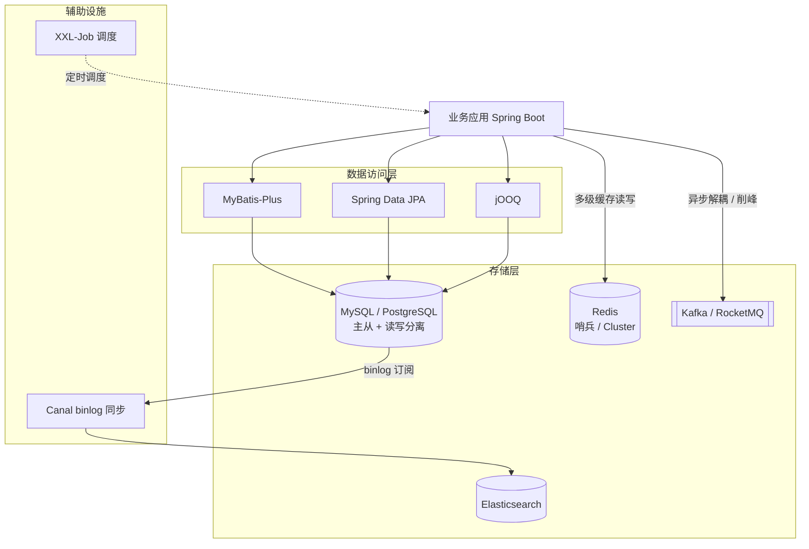
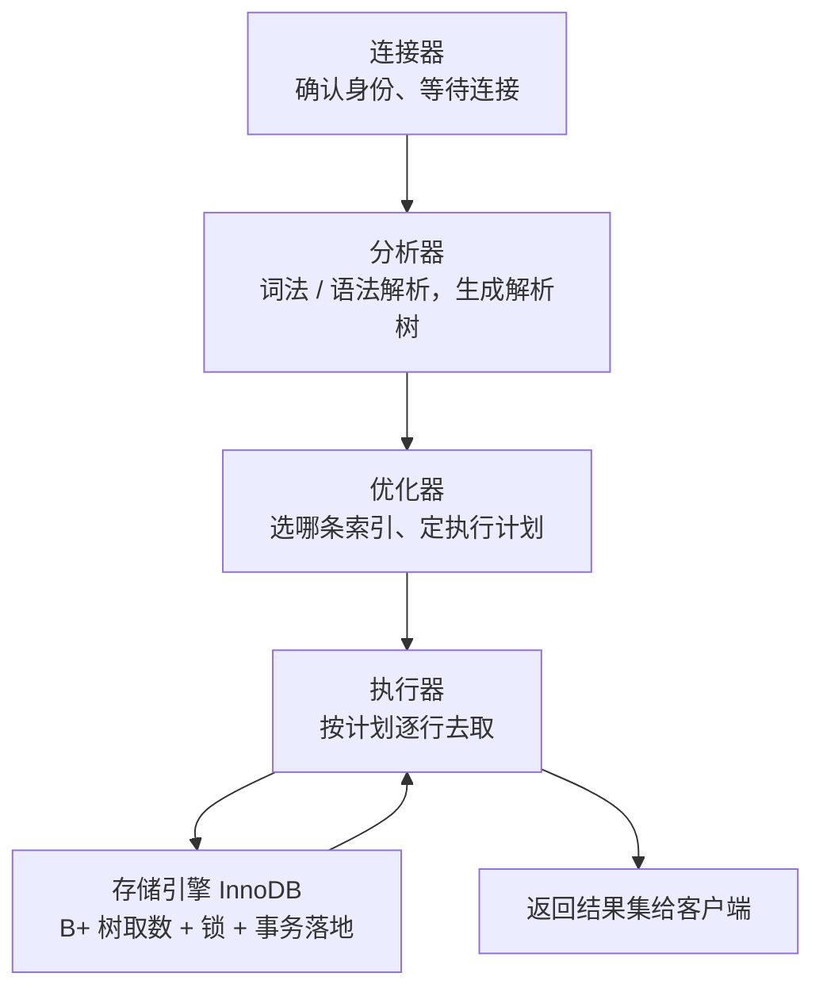
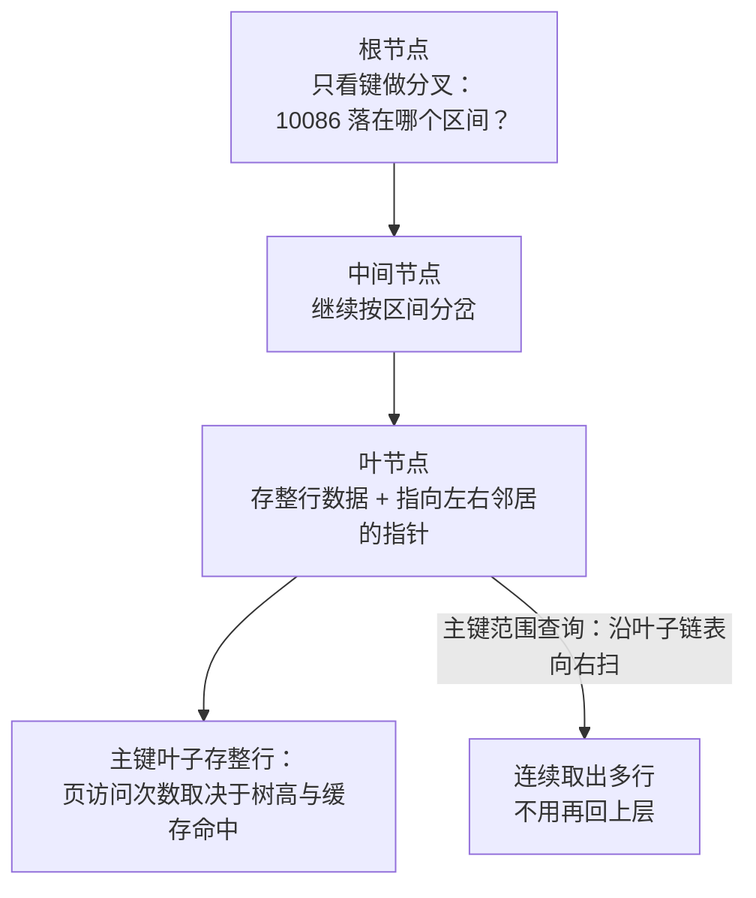
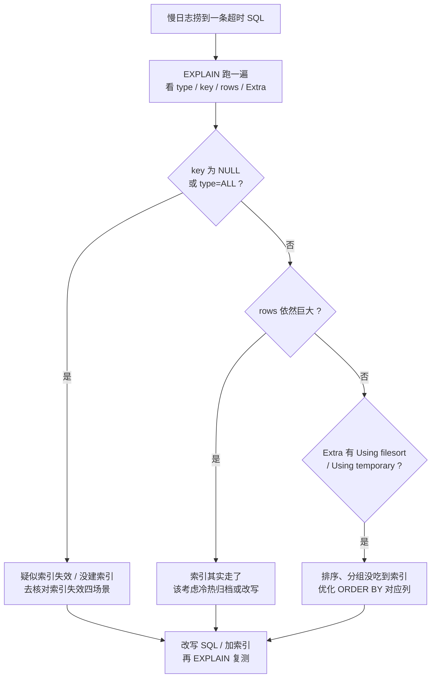
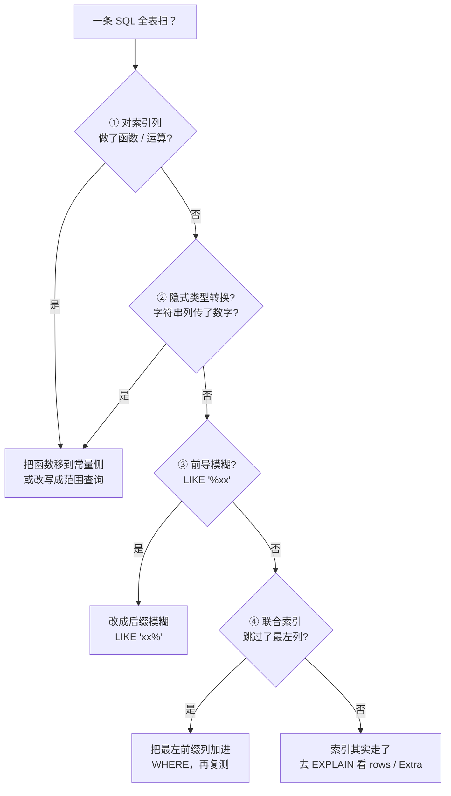

# 阶段三 · 小点 1：MySQL 内核与 SQL 优化

> 所属：阶段三 数据持久化与中间件
> 定位：数据层是后端的基石，前端转后端最容易踩坑的就是「数据库思维」——索引、事务、锁、慢查询在前端几乎不接触。本讲先给阶段三技术栈全景，再进 MySQL 内核：目标是「能看懂执行计划、能排查慢 SQL、能讲清一条 SELECT 背后发生了什么」。

## 快速入门

> 本节为「数据库速览」：先认识后端跟数据库打交道的基本动作；「B+树、MVCC、锁」留在正文提高部分。

### 本讲关键词与概念速查

| 关键词 | 最低解释 | 典型用途或注意点 |
|-|-|-|
| MySQL | 常用的关系型数据库，用表存业务数据 | 订单、用户等业务表 |
| 索引 | 加速定位数据的有序结构 | 按 `user_id` 等条件查询时使用 |
| 主键 | 每条记录的唯一标识 | 常用自增且较短的值，避免无序大键增加维护成本 |
| 聚簇索引 | InnoDB 的主键索引，叶子存整行数据 | 主键查询直接定位整行 |
| 二级索引 | 非主键索引，叶子存索引列和主键值 | 取非索引列时通常要按主键回表 |
| 联合索引 | 多列按既定顺序组成的索引 | `(a,b)` 能支持 `a`、`a,b`，不能只依赖 `b` |
| 回表 | 经二级索引找到主键后，再到聚簇索引取整行 | 查询列都在索引中可避免 |
| 覆盖索引 | 查询所需列全在一个索引中 | 减少回表，常用于优化慢 SQL |
| 事务 | 一组操作要么都成功、要么都回滚，满足 ACID（原子性、一致性、隔离性、持久性） | 下单与扣库存；长事务会占用连接和资源 |
| EXPLAIN | 查看 SQL 的执行计划 | 排查慢 SQL 的起点 |
| HikariCP 连接池 | 复用数据库连接 | 连接数不是越大越好，会占用内存和数据库资源 |
| 慢查询 | 执行时间或扫描成本过高的 SQL | 结合慢查询日志和 `EXPLAIN` 排查 |

### 本讲在解决什么问题

- **问题**：前端几乎不碰数据库，但后端每天都在写 SQL。索引怎么建、为什么慢、事务怎么保证一致性——这些「数据库思维」是前端转后端最大的坎。
- **你需要明确的点**：**索引是加速查询的目录**；`主键索引` 直接存整行（聚簇），`二级索引` 查到主键还要回表。SQL 慢，先看索引没用好、有没有回表。

### 最简形态示意（完整建表与验证见正文 2.1、5.2）

```sql
-- 建表 + 加索引: 让查询变快的常见写法
CREATE TABLE `order` (
    id BIGINT PRIMARY KEY AUTO_INCREMENT,   -- 主键(聚簇索引, 存整行)
    user_id BIGINT NOT NULL,
    status TINYINT,
    created_at DATETIME
);
CREATE INDEX idx_user_status ON `order` (user_id, status);   -- 联合索引, 支持按 user_id 查

-- 用 EXPLAIN 看这条查询怎么执行（是否选择该索引）
EXPLAIN SELECT id, status FROM `order` WHERE user_id = 10086 AND status = 1;
```

> 代码备注（逐行解释）：
> - 这是 MySQL/InnoDB 的结构示意：`order` 是订单表示例，未插入数据，也省略了字符集、迁移脚本和业务约束；不要把它当作可直接上线的建表脚本。
> - `id BIGINT PRIMARY KEY`：主键，默认建一个聚簇索引，存整行数据。
> - `CREATE INDEX idx_user_status`：建一个「user_id + status」的联合索引——按 user_id 查（并带有 status 条件）时能用到。
> - `EXPLAIN ...`：**看这条 SQL 怎么执行**——结果由数据量、数据分布和统计信息决定；预期检查 `key` 是否为 `idx_user_status`，若 `type=ALL` 则进一步判断是否为全表扫描及其成本。
> - 这就是排查慢 SQL 的起点：`EXPLAIN` 看有没有用索引、还是全表扫。

### 常用约定 / 命名提示

- **别用 `SELECT *`**：只取需要的列，尽量覆盖索引、减少回表。
- **字段类型速查**：金额用 `DECIMAL`（禁 FLOAT/DOUBLE）；状态用 `TINYINT`；时间用 `DATETIME`；定长短串选 `CHAR`/`VARCHAR`。
- **慢 SQL 排查三步**：开慢查询日志 → `EXPLAIN` 看执行计划 → 优化索引或改写 SQL。
- **数据库表结构变更用 Flyway**（数据库迁移工具——把每次建表/改表写成一条可回放、带版本号的脚本）：别手工在库上跑 DDL，而是写进迁移脚本（本讲后续展开）。

## 精简大纲

1. 阶段三技术栈全景
2. InnoDB 内核：聚簇索引 / 二级索引 / B+ 树选型论证
3. 回表与覆盖索引
4. MVCC 与 ReadView、四大隔离级别
5. 事务与锁：行锁 / 间隙锁 / Next-Key Lock
6. SQL 优化实战：慢查询日志 → EXPLAIN → 索引失效

## 学习内容详情

### 1. 阶段三技术栈全景



> 先记住一句话认知：**MySQL 是数据库服务器，InnoDB 是它默认的存储引擎**——SQL 语法、连接管理由 MySQL 层负责；数据怎么存、索引怎么建、事务怎么保证，全在 InnoDB 层。类比：MySQL ≈ Node.js 运行时，InnoDB ≈ V8 引擎。

再看从「敲下一条 SELECT」到「拿到结果」，MySQL 层和 InnoDB 层之间要走一整条流水线（引言里说的「讲清一条 SELECT 背后发生了什么」，指的就是这条线）：



> 🧩 前置 30 秒：这条流水线里，**连接器**管「你是谁」，**分析器**管「这句话什么意思」，**优化器**管「怎么查最快」（慢 SQL 排查的大头几乎都在这环），**执行器**管「真的动手查」，最后落进 InnoDB 的 B+ 树取数据。前端对照：类似一个请求从「鉴权中间件 → 路由解析 → 控制器 → Service → 数据库」层层下钻，MySQL 只是把「数据库」这一段又拆细了。

### 2. InnoDB 内核：索引结构

#### 2.1 先建一张贯穿全阶段的订单表

```sql
-- 订单表：阶段三所有 SQL 示例都用这张表，保持业务连贯
CREATE TABLE `order` (
    id           BIGINT UNSIGNED AUTO_INCREMENT PRIMARY KEY,  -- 主键：聚簇索引的锚点
    order_no     VARCHAR(32)  NOT NULL,          -- 业务订单号（对外暴露用，不拿主键当业务号）
    user_id      BIGINT        NOT NULL,         -- 下单用户
    status       TINYINT       NOT NULL DEFAULT 0, -- 0待支付 1已支付 2已发货 3已完成
    amount       DECIMAL(10,2) NOT NULL,         -- 金额用 DECIMAL：浮点数会丢精度，钱不能算错
    created_at   DATETIME      NOT NULL DEFAULT CURRENT_TIMESTAMP,
    updated_at   DATETIME      NOT NULL DEFAULT CURRENT_TIMESTAMP ON UPDATE CURRENT_TIMESTAMP,
    UNIQUE KEY uk_order_no (order_no),           -- 业务唯一约束（幂等的最后防线，见阶段二）
    KEY idx_user_status (user_id, status)        -- 联合索引：最左前缀原则的主角
) ENGINE=InnoDB DEFAULT CHARSET=utf8mb4;
```

**字段类型速查**（建表规范，踩坑高发区）：

| 场景 | 类型 | 一句话理由 |
|-|-|-|
| 金额 | `DECIMAL` | 禁 FLOAT/DOUBLE——浮点丢精度，钱不能算错 |
| 状态/枚举 | `TINYINT` | 1 字节存枚举值，别拿 VARCHAR 存中文状态 |
| 时间 | `DATETIME` | TIMESTAMP 有 2038 上限 + 时区语义问题，按需选 |
| 布尔 | `TINYINT(1)` | MySQL 没有真布尔，约定 0/1 |
| 定长 vs 变长串 | `CHAR(n)` vs `VARCHAR(n)` | 手机号这类定长短串用 CHAR，其余 VARCHAR |
| 长文本 | `TEXT` | 存大段正文；不进主键/聚簇索引的考量 |

#### 2.2 聚簇索引 vs 二级索引

- **聚簇索引**（**Clustered Index**：叶子节点保存整行数据的 B+ 树）：InnoDB 会为每张表选择一个聚簇键——优先使用显式主键；没有主键时选择第一个所有列均为 `NOT NULL` 的唯一索引；再没有才生成隐藏的行 ID。工程上仍应显式设计主键，避免把关键组织方式交给隐式规则。
- **二级索引**（**Secondary Index**：非主键索引，叶子节点存「索引列 + 主键值」而不是整行）：查到主键后还要去聚簇索引再查一次拿整行——这次「再查」就是**回表**（**Bookmark Lookup**）。


- 类比：二级索引像书附录的「术语表」（术语 → 页码），聚簇索引像书正文按页码排——查术语先翻附录拿页码，再翻正文，两次查找。

#### 2.3 为什么是 B+ 树（不是 B 树 / 跳表 / 哈希）（选读：项目实战阶段再深挖，主线记住结论即可）

| 候选结构 | 落选原因 |
|-|-|
| **B 树** | 节点存数据 → 单页装键少、树更高 → 磁盘 IO 多；叶子不连链表，范围扫描要反复回上层 |
| **跳表** | 内存友好、磁盘页不友好；没有高扇出 |
| **哈希** | 内存中的等值定位通常是平均 O(1)，但键无序，不能支持范围扫描或按索引顺序排序；不是 InnoDB 常规索引的替代品 |

> 注：InnoDB 默认页大小是 16KB，页是缓冲池与索引组织的基本单位；实际物理 I/O 还会受缓存命中、预读、文件系统和存储设备影响，不能机械理解成“每次查询只读一个固定 16KB”。一页能容纳的键越多，树通常越矮。跳表适合内存有序结构；哈希键无序，不能按键大小处理 `BETWEEN` 或利用索引顺序完成 `ORDER BY`。复杂度只描述算法的一部分，不能直接推出真实存储查询谁一定更快。

> **B+ 树**（B-Tree 变体：非叶子节点只存键不存完整行、叶子节点按键有序并用双向链表串联）胜在两个理由：在 InnoDB 的**聚簇索引**里，叶子存整行；在**二级索引**里，叶子存「二级索引列 + 主键值」，是否还要回表由查询列决定。
> - **矮胖**：高扇出——非叶子节点不存完整行，默认 16KB 的索引页能装更多键；树高随页大小、键长度、行大小和数据量变化，不能把“3～4 层、千万行”当作固定承诺。
> - **叶子链表**：叶子节点用双向链表串联。以聚簇索引为例，`WHERE id > 100 ORDER BY id` 能沿主键顺序扫叶子，不用回上层重新下降；二级索引也能按其自身索引列顺序扫描，取非覆盖列时仍需回表。

**一条主键查询 `WHERE id = 10086` 怎么在聚簇 B+ 树上定位**——从上往下逐层下潜，最后一层叶子存整行数据：



> **类比：用「导航 App 翻线路册」理解 B+ 树**——生活版：查「某某路公交在哪个站」，你不会把整本线路册从头翻到尾，而是先翻大区的目录页定位到该区，再看该区的线路页，最后一翻就找到对应站号，全程只翻两三页。换成 MySQL：B+ 树「非叶子节点只存键」就相当于那些只有编号的目录页（占地方小、一页能塞很多层分叉，所以树矮）；「叶子链表」相当于每页底部写着「下一页在哪」，范围查询顺着这条链子一路扫出去。

> ⏸️ **短期可以不学**：B+ 树 vs B 树 / 跳表 / 哈希的选型论证属于存储引擎源码级推导，主线记住「高扇出 + 叶子链表」这个结论即可，不用逐条手推。**何时回来学**：需要做存储选型或排查索引失效、面试被问到存储引擎内核时。**面试最低要求**：一句话说出 B+ 树两个胜出理由（矮胖高扇出减少磁盘 IO、叶子链表天然支持范围查询）。

#### 2.4 覆盖索引：省掉回表

```sql
-- 需要回表：SELECT 里有 status 之外的列（amount 不在 idx_user_status 里）
-- 命中索引后还要拿 id 去聚簇索引取 amount
SELECT user_id, status, amount FROM `order` WHERE user_id = 10086 AND status = 1;

-- 覆盖索引：查询列全部落在 idx_user_status(user_id, status) 里
-- 不需要回表，EXPLAIN 的 Extra 会显示 "Using index"
SELECT user_id, status FROM `order` WHERE user_id = 10086 AND status = 1;
```

- **覆盖索引**（**Covering Index**：查询所需的所有列都在索引里，无需回表）：优化高频小查询的常用手段——把 `SELECT` 的列收窄，或把常一起查的列做进联合索引。

### 3. MVCC 与 ReadView

#### 3.1 为什么需要 MVCC

- **MVCC**（**Multi-Version Concurrency Control**，多版本并发控制）：让「读」不加锁——每行数据保留多个历史版本，读事务按规则挑一个「对自己可见」的版本。类比 Git：每行数据有自己的提交历史，不同读者可以 checkout 不同的版本。
- 实现材料：每行隐藏列 `trx_id`（最后修改它的事务 ID）+ `roll_pointer`（指向 undo log 里的上一个版本，形成版本链）。其中 **undo log**（撤销日志）把每行被改前的旧值都留了一版——相当于草稿留档，回滚或读历史版本时翻出来用。

#### 3.2 ReadView：可见性判定器

- **ReadView**（一致性读建立的「可见性快照」）：包含创建者事务 ID、当时活跃事务 ID 列表及其上下界。RR 在事务的**第一次一致性读**建立后复用该视图；RC 通常每次一致性读新建视图。
- **判定规则一句话**：自己的版本可见；早于活跃事务下界的已提交版本可见；晚于视图上界的版本不可见；落在两者之间时，再看它是否仍在活跃列表中。
- **不可见就走版本链**：当前版本不可见时，顺 `roll_pointer` 找较早版本，直到找到可见版本或链结束。

> **类比：会议室门口的占座小本本理解 ReadView**——生活版：你进门时除了抄下「仍在开会的人」名单，还记下本子上的最早和最新编号；名单前已经散会的记录可看，名单中的人先不看，此后新开的会也不看。换成 MySQL：ReadView 用活跃事务列表和上下界判断版本可见性；RR 复用第一次一致性读建立的视图，因此随后提交的其他事务不会进入这个快照。类比只说明可见性筛选，不代表数据库真的保存一份完整表快照。

```sql
-- 演示可重复读（RR）的效果：两个会话，左侧是事务 A，右侧是事务 B
-- A（RR 隔离级别，默认）
START TRANSACTION;
SELECT amount FROM `order` WHERE id = 1;   -- 返回 100.00，生成 ReadView

-- B（另一个会话，独立事务）
UPDATE `order` SET amount = 200.00 WHERE id = 1;
COMMIT;                                    -- B 已提交

-- A 再次读
SELECT amount FROM `order` WHERE id = 1;   -- 仍然 100.00！
-- 原因：RR 下事务 A 全程复用第一个 ReadView，
-- 200.00 那个版本的 trx_id 不在 A 的可见集合里，A 顺版本链读到旧值
```

#### 3.3 四大隔离级别与当前读 / 快照读

| 隔离级别 | 现象 | InnoDB 实现 |
|-|-|-|
| 读未提交（RU） | 脏读（读到别人没提交的） | 基本不用 |
| 读已提交（RC） | 两次一致性读可能不同（不可重复读） | **每次一致性读生成新 ReadView** |
| 可重复读（RR，默认） | 一致性读复用快照；锁定范围读由 Next-Key Lock 防止并发插入造成幻行 | **复用第一次一致性读的 ReadView** |
| 串行化 | 无并发问题 | 读也加锁，性能差 |

- **快照读（Snapshot Read）**：普通 `SELECT` 走 MVCC，不加锁。
- **当前读（Current Read / Locking Read）**：`SELECT ... FOR UPDATE` / `UPDATE` / `DELETE` 必须读最新版本并加锁。
- **边界：一致性读与当前读不能混为一谈**——RR 的普通一致性读稳定地读取同一快照；范围 `FOR UPDATE` 等当前读为阻止并发插入，会使用 Next-Key Lock。若同一事务先快照读、后执行 `UPDATE` 或 `FOR UPDATE`，后者会读取较新的当前版本；这是当前读语义，不是「加锁读仍会幻读」。机制以 [MySQL 8.4 一致性非锁定读说明](https://dev.mysql.com/doc/refman/8.4/en/innodb-consistent-read.html) 和 [Next-Key Lock 说明](https://dev.mysql.com/doc/refman/8.4/en/innodb-next-key-locking.html) 为准。

#### 3.4 Redo log：提交为什么不必等整页数据落盘

- **Redo log（重做日志）**：InnoDB 的 WAL（Write-Ahead Logging，预写日志）记录“对数据页做了哪些可重放修改”。提交时先让提交所需的 redo 满足持久化策略，脏数据页可以稍后由后台刷盘；宕机重启时，用 redo 把“已记录但数据页尚未落盘”的修改重放回来。
- **它与 undo / binlog 的分工**：undo 保留旧版本，用于回滚和 MVCC；binlog 是 MySQL 层的逻辑变更日志，用于复制和按时间点恢复（第 2 讲）；redo 是 InnoDB 页面恢复所需的物理/页级变更记录。三者不能互相替代。
- **最低故障闭环**：已提交、redo 已按策略持久但数据页未刷盘 → 重启时 redo 恢复；未提交事务 → 依据 undo 回滚。磁盘、文件系统或配置失效仍可能超出单机恢复能力，因此备份与 binlog 恢复不可省。这里掌握职责即可；redo 容量、checkpoint、刷盘策略和恢复调优放到阶段八展开。[MySQL 官方：InnoDB redo log](https://dev.mysql.com/doc/refman/8.4/en/innodb-redo-log.html)

### 4. 事务与锁

```sql
-- 事务的基本骨架：转不动就回滚，别让半成品数据留在库里
START TRANSACTION;
UPDATE `order` SET status = 2 WHERE id = 1 AND status = 1;  -- 带旧状态条件：天然的乐观锁（CAS 思想）
-- affected rows = 0 说明状态已被别人改走 → 走补偿逻辑，不能继续发货
COMMIT;
```

- **记录锁**（Record Lock，锁住的是**索引记录**而不只是“表的一行”）：用唯一索引做等值锁定读时，通常只需锁命中的索引记录；一次 `UPDATE` 还可能同时锁到受影响的二级索引和聚簇索引记录。
- **间隙锁**（**Gap Lock**，锁住索引记录之间、首条之前或末条之后的空隙）：它只阻止向该范围插入，常在 RR 的范围/非唯一索引锁定扫描中参与防幻行；RC 下搜索和索引扫描通常关闭间隙锁（外键与重复键检查等例外仍存在）。
- **Next-Key Lock**（记录锁 + 前方间隙锁）：锁定范围取决于**实际使用的索引和扫描到的记录范围**，不是“WHERE 写了几行就锁几行”。InnoDB 不会因扫描很多记录而把行锁“升级”为表锁；但缺少合适索引会扩大扫描与锁定范围，效果上造成大量阻塞。

> **类比：演唱会锁座理解间隙锁**——生活版：演唱会只卖「已编号的座位」，有人想加塞坐在 5 号与 6 号过道之间；主办方干脆把「5 号后面的空位」整段锁住不卖，就不会凭空冒出个「5.5 号」。换成 MySQL：范围/条件查询时 InnoDB 用间隙锁把两条索引记录之间的空隙也锁住，别人的 `INSERT` 插不进这段——幻行（凭空多出来的行）就进不来了。

- 死锁排查：

```sql
-- 两个事务互相持锁等待时，InnoDB 会自动检测并回滚代价小的一方
-- 死锁现场保存在这里（看 LATEST DETECTED DEADLOCK 段：谁持有谁等待）
SHOW ENGINE INNODB STATUS\G

-- 预防纪律：事务内按固定顺序访问资源（如都按 id 升序 UPDATE）、
-- 事务尽量短小、事务里绝不调外部 HTTP / 发 MQ（拖长持锁时间 = 死锁温床）
```

### 5. SQL 优化实战

#### 5.1 慢查询日志：找到要优化的 SQL

```sql
-- 开启慢日志（动态，重启失效；持久化要写 my.cnf）
SET GLOBAL slow_query_log = ON;
SET GLOBAL long_query_time = 0.5;   -- 超过 0.5s 记录；线上建议从 0.5s 起步逐步收紧
SET GLOBAL log_queries_not_using_indexes = ON;  -- 没走索引的查询也记（哪怕很快）
```

```text
# 慢日志文件里的一条记录（mysqldumpslow 可做聚合统计）
# Time: 2026-09-06T10:15:32
# Query_time: 2.318402  Lock_time: 0.000032  Rows_sent: 20  Rows_examined: 5823910
SELECT * FROM `order` WHERE order_no = 'A202609060001';
-- Rows_examined 582 万行才返回 20 行：典型的全表扫描，下一步上 EXPLAIN
```

#### 5.2 EXPLAIN 四看

```sql
EXPLAIN SELECT user_id, status FROM `order` WHERE user_id = 10086 AND status = 1;
```

```text
+----+-------------+-------+------------+------+-----------------+-----------------+---------+-------+------+----------+-------------+
| id | select_type | table | partitions | type | possible_keys   | key             | key_len | ref   | rows | filtered | Extra       |
+----+-------------+-------+------------+------+-----------------+-----------------+---------+-------+------+----------+-------------+
|  1 | SIMPLE      | order | NULL       | ref  | idx_user_status | idx_user_status | 9       | const |  120 |  100.00 | Using index |
+----+-------------+-------+------------+------+-----------------+-----------------+---------+-------+------+----------+-------------+
-- 四个必看列：
-- type=ref       走了非唯一索引的等值匹配（好）；ALL = 全表扫描（要警惕）
-- key            实际使用的索引；NULL = 没走索引
-- rows           预估扫描行数（120 vs 慢日志里的 582 万，这是质变）
-- Extra=Using index  覆盖索引免回表；Using filesort / Using temporary 则要优化排序/分组
```

**EXPLAIN 优化流程：四列看完，按分支做决策**：



#### 5.3 索引失效的四个经典场景

```sql
-- ① 对索引列做函数/运算 → 优化器无法使用索引（要把函数移到常量侧）
SELECT * FROM `order` WHERE DATE(created_at) = '2026-09-06';       -- 失效
SELECT * FROM `order`
WHERE created_at >= '2026-09-06 00:00:00'
  AND created_at <  '2026-09-07 00:00:00';                          -- 改写成范围查询，生效

-- ② 隐式类型转换：order_no 是 VARCHAR，传数字 → 隐式转成数字再比较 → 索引失效
--   本质：对索引列施加了函数/运算，破坏了 B+ 树按原值排序的定位能力，优化器只能放弃索引
SELECT * FROM `order` WHERE order_no = 20260906;                    -- 失效
SELECT * FROM `order` WHERE order_no = '20260906';                  -- 生效

-- ③ 前导模糊：B+ 树按前缀有序，'%xx' 前缀不定 → 无法定位起点
SELECT * FROM `order` WHERE order_no LIKE '%0906';                  -- 失效
SELECT * FROM `order` WHERE order_no LIKE '2026%';                  -- 生效（后缀模糊）

-- ④ 最左前缀被跳过：联合索引 (user_id, status)，user_id 不出现则整条废掉
SELECT * FROM `order` WHERE status = 1;                             -- 失效（跳过了 user_id）
SELECT * FROM `order` WHERE user_id = 10086;                        -- 生效（最左列命中）
```

> **最左前缀原则**（联合索引 `(a, b, c)` 只能按 `a` → `ab` → `abc` 的前缀命中，中间断档后剩余列不参与索引定位）：可以把联合索引类比通讯录——先按姓氏排、同姓氏再按名字排；只给名字不给姓氏，通讯录帮不了你。

**索引失效排查链：一条 SQL 走不上索引，按顺序对号入座**：



#### 5.4 连接池：HikariCP 基础配置

```yaml
spring.datasource.hikari:
  maximum-pool-size: 20        # 示例起步值；按并发、SQL 时延、DB 容量压测调整
  minimum-idle: 5
  connection-timeout: 3000     # 拿不到连接 3s 快速失败, 别用默认 30s 干等
  max-lifetime: 1800000        # 示例值；应短于实际生效的数据库、代理或网络连接回收上限
```

HikariCP 是 Boot 默认连接池，起步配这几项就够。`max-lifetime` 是连接总寿命，在连接归还后才会退役；`wait_timeout` 则只会关闭空闲的非交互 MySQL 连接，二者不能机械地写成固定大小关系。应找出数据库、代理和网络中最短的回收上限，再让连接池提前退役或用 keepalive 保活，并通过压测校准。官方建议 `maxLifetime` 比任何数据库或基础设施的连接上限短数秒；参数语义见 [HikariCP 官方配置说明](https://github.com/brettwooldridge/HikariCP#configuration-knobs-baby)。**连接池不是越大越好**：每个连接在 MySQL 侧都吃内存，池子过大反而上下文切换 + 锁竞争恶化。

## 坑点提醒

- **`SELECT *` 是回表收割机**：能 `SELECT` 指定列就走覆盖索引，高频接口尤其如此。改写示例：``SELECT * FROM `order` WHERE user_id = 10086 AND status = 1`` → ``SELECT id, user_id, status FROM `order` WHERE user_id = 10086 AND status = 1``——后者的列全部落在 `idx_user_status` 里（二级索引叶子天然带主键 id），免回表。
- **隐式类型转换不报错**：MySQL 静默把字符串列转数字再比较，索引失效 + 结果可能全错（`'A1001' = 0` 为真），代码 review 重点盯。
- **加了索引 ≠ 走了索引**：优化器按成本估算选择，统计信息过期会导致选错——`ANALYZE TABLE` 更新统计信息后再看 EXPLAIN。
- **`FOR UPDATE` 要核对访问路径**：InnoDB 没有“行锁自动升级表锁”这一规则；条件未使用合适索引时，锁定读可能扫描并锁住大量索引记录/范围，阻塞效果接近锁住整表。用 `EXPLAIN`、锁等待与实际索引确认范围，而不是只凭 SQL 文本判断。
- **大事务是万恶之源**：一个事务里 UPDATE 十万行 + 调外部接口，等于把锁和 undo log 都拖到最长。

## 本节自检

- [ ] 能回答：为什么 MySQL 用 B+ 树而不是 B 树、跳表或哈希索引？
- [ ] 能画出「二级索引 → 回表 → 聚簇索引」的完整流程图
- [ ] 能说清 RC 与 RR 在**一致性读**创建 ReadView 的时机差异，及 Next-Key Lock 如何防范围锁定读的幻行
- [ ] 能说明 redo、undo、binlog 的职责差异，以及“已提交但数据页未刷盘”与“未提交宕机”分别如何收敛
- [ ] 拿到一条慢 SQL：开慢查询日志 → EXPLAIN → 按 type / key / rows / Extra 四看定位 → 判断是否索引失效
- [ ] 能各举一例说明四种索引失效场景的改写方法
- [ ] **场景判断**：事务 A（RR）第一次普通 `SELECT` 后，事务 B 插入一条满足同一范围条件的记录并提交；A 再普通 `SELECT` 与改用 `SELECT ... FOR UPDATE` 分别会看到什么？为什么？

> 自检答案要点：两次普通一致性读复用同一个 ReadView，第二次仍不看见 B 的新行；`FOR UPDATE` 是当前读，会读当前版本并加锁，因此可能看见 B 已提交的行。若 A 在第一次就执行带范围的 `FOR UPDATE`，Next-Key Lock 会阻止 B 在该锁定范围插入。这三种操作的差别来自读类型与加锁时机。redo 负责将已提交但尚未刷入数据页的修改在重启时重放，undo 负责未提交修改的回滚与旧版本可见性，binlog 则服务复制和时间点恢复；redo 不能替代备份。

## 本节配套思考题

1. 为什么聚簇索引「主键最好自增」？（提示：随机主键如 UUID 会导致插入时页分裂，类比数组中间插值 vs 尾部 append）
2. `idx_user_status (user_id, status)` 索引下，`WHERE status = 1 AND user_id = 10086` 能走索引吗？`ORDER BY user_id` 呢？（提示：优化器会调整条件顺序，但 ORDER BY 依赖索引列顺序）
3. RR 隔离级别下，事务 A 先 `SELECT`（快照读）再 `UPDATE` 同一行，读到的是什么版本？为什么这可能导致「更新了看不见的数据」？

## 常见面试题

### Q1：线上一条 SQL 很慢，你是怎么排查的？

**答**：
**标准结论**：排查三步走——开慢查询日志（`long_query_time` 从 0.5s 起步）捞出慢 SQL → `EXPLAIN` 看执行计划 → 按 type / key / rows / Extra 四列定位并优化。

**底层原理**：先读懂 EXPLAIN 四列的真实含义，再判断病根——
- type 从好到坏是 `const → ref → range → index → ALL`，ALL 就是全表扫描。
- rows 是优化器**估算**的扫描行数，和慢日志里真实的 `Rows_examined` 对得上，才说明真在扫全表。
- Extra 出现 `Using filesort` / `Using temporary`，说明排序、分组没吃到索引。
- 索引失效的四大场景（对索引列做函数运算、隐式类型转换、前导模糊 `%xx`、联合索引跳过最左前缀），本质都是破坏了 B+ 树按列值有序定位的能力。

**工程实践**：留意「加了索引 ≠ 走了索引」——统计信息过期会让优化器选错，先 `ANALYZE TABLE` 再看；也别一上来就加索引，先确认是不是数据量本身该归档（冷热分离，即把不常查的旧数据挪到单独的表或库）。

**常见误区**：只盯 type=ALL，忽略了「明明走了索引，但 rows 依然巨大」的情况。

### Q2：什么是回表？什么是覆盖索引？怎么避免回表？

**答**：
**标准结论**：InnoDB 二级索引的叶子存的是「索引列 + 主键值」。查二级索引拿到主键后，还要再回聚簇索引取整行，这次「再查」就是回表（Bookmark Lookup）。覆盖索引指查询所需的所有列都落在索引里（二级索引叶子天然带主键），不用回表。

**底层原理**：InnoDB 表数据按主键聚簇存放，一次完整查询最坏要访问两棵 B+ 树——
- 先走二级索引定位主键；
- 再走聚簇索引取行。
- 两次都是随机磁盘 IO（不连续读取），成本翻倍。

**工程实践**：高频接口把 `SELECT` 的列收窄到索引覆盖范围，或把常一起查的列做进联合索引；用 EXPLAIN 看 Extra 是 `"Using index"`（覆盖，免回表）还是 `"Using index condition"`（索引下推，可能仍会回表）。

**常见误区**：以为「索引里有这列」就是覆盖——必须查询列**全部**在索引里才叫覆盖；也别为了覆盖索引盲目建超大联合索引，索引不是越宽越好（占空间、写放大）。

### Q3：MySQL 默认隔离级别是什么？MVCC 怎么实现可重复读？幻读怎么解决？

**答**：
**标准结论**：MySQL 默认隔离级别是**可重复读（RR）**。MVCC 靠每行隐藏列 `trx_id` + `roll_pointer` 版本链，配合 ReadView 判定可见性；RR 下事务内复用第一个 ReadView，所以快照读两次结果一致。幻读分两层——
- 快照读（普通 `SELECT`）：RR 复用一致性视图，因此后续快照读不会看见视图建立后提交的新行；它不是把范围物理锁住。
- 加锁读（`FOR UPDATE` / `UPDATE` / `DELETE`）：靠 Next-Key Lock（行锁 + 间隙锁）锁住记录及其前间隙，阻止并发插入。

**底层原理**：ReadView 不只是「未提交事务列表」；它还保存上下界。自己的版本可见；早于活跃事务下界的版本可见；晚于视图上界的版本不可见；处于中间时再以活跃列表判断，否则沿版本链找旧版本。RR 复用第一次一致性读的 ReadView，之后提交的其他事务不进入这个快照。

**工程实践**：注意「快照读看到旧值，但 `UPDATE` / `DELETE` 是当前读」——会出现「更新了看不见的数据」这种隐蔽问题；生产上很多互联网团队用 RC（锁范围小、死锁概率低），MVCC 机制一致，差异只在间隙锁。

**常见误区**：把「普通一致性读」和「锁定当前读」混在一起。RR 下普通一致性读复用快照；范围锁定读依靠 Next-Key Lock 阻止幻行。两种读交替使用时看到的新旧差异是当前读语义，不能概括成「RR 的加锁读仍有幻读」。

### Q4：为什么 InnoDB 用 B+ 树做索引，不用 B 树、哈希或跳表？

**答**：
**标准结论**：B+ 树胜在两点——
- **高扇出**：非叶子节点只存键，单页 16KB 能装更多键，树矮；具体树高取决于键长、页填充率和数据量。
- **叶子链表**：叶子用双向链表串联，范围查询顺着链表扫。

**底层原理**：磁盘 IO 以页（16KB）为单位，树每高一层就多一次页 IO，所以树越矮越省读盘——
- B 树每个节点都存数据 → 单页装的键少、树更高，且叶子不串链表，范围扫描要反复回上层。
- 哈希表在内存中的等值定位通常是平均 O(1)，但键无序，不能支持范围查询或利用索引顺序排序；这不等于真实磁盘场景一定比 B+ 树快。
- 跳表是内存友好结构（Redis ZSet 用），磁盘页利用率差。

**工程实践**：这个结论直接指导建表——主键要小（页能装更多行）、要自增（顺序插入避免页分裂）、要能支撑范围查询。

**常见误区**：回答「B+ 树比哈希快」或「等值查询哈希一定更快」——两者都脱离了存储位置、缓存命中和查询模式。B+ 树的优势在于页结构、高扇出和有序叶子链表的组合；也别背「3 层能存千万行」这类依赖键长和页填充率的示例数字而说不出高扇出的原因。

### Q5：线上遇到死锁，你怎么定位和处理？

**答**：
**标准结论**：死锁是「两个及以上事务互相持有对方需要的锁且都不释放」。InnoDB 用等待图检测，自动回滚代价小的一方释放锁，应用收到 Deadlock 异常。定位看 `SHOW ENGINE INNODB STATUS` 的 LATEST DETECTED DEADLOCK 段——里面写着谁持有谁、谁等待谁。

**底层原理**：死锁四要素是互斥、持有并等待、不可剥夺、循环等待；破坏「循环等待」就能根治。

**工程实践**：四条纪律——
- 事务内按固定顺序访问资源（如都按 id 升序 `UPDATE`）。
- 事务短小。
- 事务里绝不调外部 HTTP / 发 MQ（拖长持锁时间）。
- 合理设置 `innodb_lock_wait_timeout`。

**常见误区**：以为死锁只发生在两个 `UPDATE` 之间——`INSERT` 同样会因为唯一索引冲突、间隙锁而死锁；也别把死锁当事故，捕获异常后重试被回滚的事务即可。
