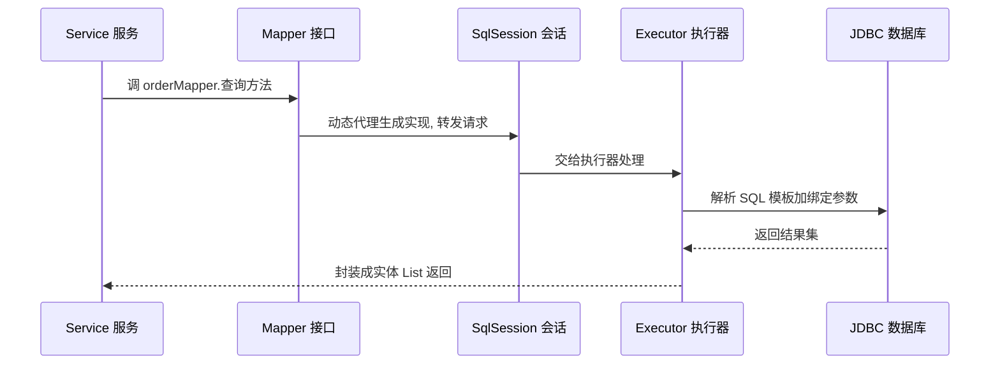
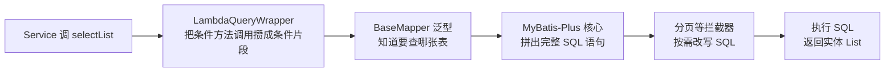
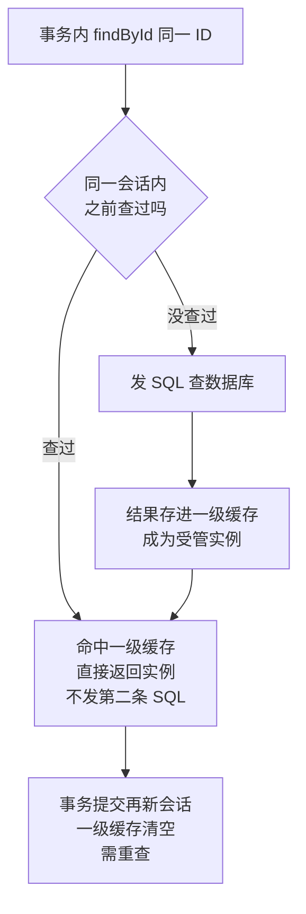
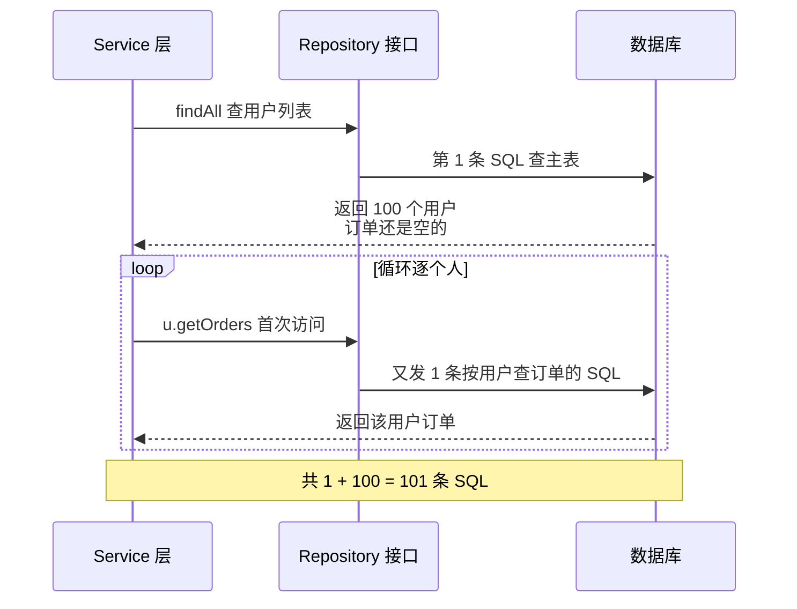

# 阶段三 · 小点 3：ORM 与数据访问（MyBatis / JPA / jOOQ）

> 所属：阶段三 数据持久化与中间件
> 定位：MyBatis-Plus、JPA 与 jOOQ 分别代表「显式 SQL」「对象映射」和「类型化 SQL」三种常见取向；它们的取舍不只由开发效率决定，也受团队 SQL 能力、查询复杂度和既有生态影响。TypeORM / Prisma 的对象映射、迁移和关联加载经验可帮助理解本讲，但注解模型、查询语法、事务边界并不能直接照搬。

## 快速入门

> 本节为「ORM 速览」：先认识 Java 访问数据库的几种方式、各自取舍；「N+1、多数据源」留在正文提高部分。

### 本讲关键词与概念速查

| 关键词 / 概念 | 最低解释 | 典型用途或提醒 |
|-|-|-|
| ORM | 用对象和映射规则访问数据库（对象关系映射） | 减少对象与表行之间的转换样板 |
| MyBatis-Plus | 保留 SQL 控制力的数据访问框架 | 单表 CRUD 可由通用 Mapper 提供 |
| JPA | Java 持久化标准；Hibernate 是常见实现 | 通过 `Repository` 访问数据 |
| jOOQ | 类型化的 SQL DSL | 生成的表、列可参与编译期检查 |
| Entity | 映射数据库表的 Java 类 | MyBatis-Plus 用 `@TableName`，JPA 用 `@Entity`；表名、列名与字段要对应 |
| Mapper | MyBatis 的数据访问接口 | 需被扫描；框架可通过代理提供实现 |
| Repository / `JpaRepository<T, ID>` | JPA 的数据访问与标准 CRUD 接口 | `findById` 等方法；派生查询要遵守方法命名规则 |
| N+1 问题（N+1 Query Problem） | 查 1 次列表后，又为每行查询关联 | 用 `JOIN FETCH` 或 `@EntityGraph` 预加载关联 |
| `@EntityGraph` | 声明 JPA 查询要预加载的关联 | 未按查询场景使用，可能触发 N+1 |
| `ddl-auto` | Hibernate 的 schema 管理选项 | 生产通常用迁移脚本；避免让 `update` 成为唯一变更记录 |

### 本讲在解决什么问题

- **问题**：Java 怎么操作数据库？是手写 SQL（MyBatis）、还是操作对象（JPA）、还是类型安全的 SQL（jOOQ）？三者在「SQL 掌控力 ↔ 开发效率」光谱上各有取舍。
- **你需要明确的点**：MyBatis-Plus 保留 SQL 控制力，JPA 减少常规对象映射样板，jOOQ 让生成后的表与列参与编译期检查。先选一个作为主数据访问方式；只有迁移、报表等边界明确的场景才引入第二种，并统一事务、审计和缓存边界。

### 速览形态示意（不是可直接运行的工程）

> 两段代码只对比调用形态：`User` 是映射用户表的实体，`UserMapper` 是继承 `BaseMapper<User>` 的 MyBatis-Plus 接口，`userMapper` 由 Spring 注入；`JpaRepository` 需要 Spring Data JPA 依赖和实体映射。省略了 import、构造器、Mapper 扫描、数据源和表结构，不能单独复制运行。

```java
// MyBatis-Plus: 用条件构造器查数据(不用手写 SQL)
@Service
public class UserService {
    private final UserMapper userMapper;       // MyBatis 的 Mapper 接口, 无实现类也能跑(动态代理)

    public List<User> findActive() {
        return userMapper.selectList(
            new LambdaQueryWrapper<User>()
                .eq(User::getStatus, 1));        // WHERE status = 1
    }
}
```

```java
// Spring Data JPA: 继承 Repository 接口, 方法名即查询
public interface UserRepository extends JpaRepository<User, Long> {
    List<User> findByStatus(int status);        // 方法名: SELECT * FROM user WHERE status=?
}
```

> 代码备注（逐行解释）：
> - MyBatis-Plus 的 `userMapper`：Mapper 接口**不用写实现类**——框架通过代理在运行时提供实现，这就是「Mapper 能跑」的原因。
> - `new LambdaQueryWrapper<User>().eq(...)`：用条件构造器拼查询条件，比手写 SQL 安全又不失控制。
> - JPA 的 `findByStatus(int)`：**方法名即查询**（Spring Data 按命名规则自动生成 SQL）——这是 JPA 最省事的地方。
> - 二者差异：MyBatis-Plus 显式、SQL 掌控强；JPA 隐式、靠命名规范，省心但底层不透明。

### 常用约定 / 命名提示

- **DTO↔Entity 用 MapStruct**：需要明确字段映射时，编译期生成的映射代码更容易审查；反射拷贝的性能和字段遗漏风险应以项目实测与测试覆盖验证。
- **表结构变更用 Flyway**：团队协作或生产环境以版本化迁移脚本作为可审查记录；`ddl-auto` 是否开启及取值要随环境配置，并用 [Spring Boot 属性文档](https://docs.spring.io/spring-boot/appendix/application-properties/index.html)核对当前版本。
- **选型别混**：一个项目先确定一种主路径；确需并存时，按模块或查询类型划清职责，并让事务、缓存和审计遵循同一约定。

## 精简大纲

1. ORM 心智模型与三家定位光谱
2. MyBatis / MyBatis-Plus：显式 SQL 与通用 CRUD
3. Spring Data JPA：Repository 抽象与 N+1 问题
4. jOOQ：类型安全的 SQL DSL
5. 多数据源与读写分离落地

## 学习内容详情

> 除非明确标为「可运行」，本讲 Java、XML 与配置代码均为讲解片段：会省略 import、注解扫描、实体完整字段、数据源、事务和依赖声明。阅读时先用注释确认它说明的机制，再到项目中补齐版本相关配置并验证。

### 1. ORM 心智模型与选型光谱

- **ORM**（**Object-Relational Mapping**，对象关系映射：把「Java 对象 ↔ 数据库表行」的转换自动化，让你以对象和映射规则访问数据）：它与 TypeORM / Prisma 都要面对实体映射、关联加载和迁移，但 Java 中的持久化上下文、注解及查询方式各有约束，不能把 API 当作一一对应。

**生活版——货架 vs 名片夹**：仓库每件货都躺在一个货架格位（= 数据库的一行），而你办公桌上有一叠「货品名片」（= Java 对象），名片上印着「编号、品名、库存」。名片和货架之间有一套对照规则，按规则登记或更新时才会同步——不是改了纸上的字就天然改掉货架。**换成 Java**：JPA 通常用 `@Entity` / `@Table` 描述映射，受管实体在持久化上下文 `flush` 时可由脏检查写回；MyBatis-Plus 用 `@TableName` 描述映射，仍须显式调用 Mapper 的新增或更新方法。ORM 减少转换样板，但复杂查询和写入边界仍要看清实际 SQL。
- 三家定位：

```text
SQL 掌控力 ←—————————————————————→ 开发效率
  MyBatis(-Plus)      jOOQ            JPA/Hibernate
  SQL 自己写           SQL 类型安全生成    方法名自动生成 SQL
  显式 SQL、易审查      生成类型化 SQL       标准化对象映射
```

选型决策表：

| 你的情况 | 选 |
|-|-|
| 团队 SQL 文化强、要可控 SQL | MyBatis-Plus |
| 领域建模、标准 CRUD 为主 | Spring Data JPA |
| 类型安全 + 复杂查询编译期校验 | jOOQ |
| 同一项目需并存多种访问方式 | 先指定主路径；仅为迁移、只读报表或遗留模块保留例外，并约定事务、缓存、审计的共同边界 |

### 2. MyBatis / MyBatis-Plus

**生活版——餐厅点单，你不进后厨**：你（Service）对着菜单（Mapper 接口）选菜下单，服务员（MyBatis 动态代理）记下菜单，交给后厨（SqlSession + Executor）按菜单做菜，最后菜端到你面前——**你从没见过后厨里锅铲怎么挥**。同理，MyBatis 里你只写接口 + SQL，中间链路由框架接管。

**换成 Java**：一次 `orderMapper.xxx()` 调用的完整链路是「Mapper 接口（动态代理）→ SqlSession → Executor → JDBC → 数据库」，每一步各司其职，SQL 越早确定越省事。



- **Mapper 接口（无实现类也能跑的替代方案）**：MyBatis 用 JDK 动态代理（阶段一第 3 讲）在运行时为接口生成实现类——在餐厅场景里就是那张看不见的「服务员」。
- **SqlSession（一次数据库会话的门面）**：打开一次「与数据库的对话」，事务、缓存都挂在它身上。
- **Executor（真正干活的执行器）**：把 SQL 模板和参数拼好，指挥 JDBC 干活。

#### 2.1 MyBatis 本体：SQL 写在 XML 里

```xml
<!-- OrderMapper.xml：SQL 与 Java 分离，动态 SQL 是它的灵魂 -->
<mapper namespace="com.demo.mapper.OrderMapper">

    <!-- ${} vs #{} 是安全分界线:
         #{} → 预编译参数占位符(PreparedStatement 的 ?)，防 SQL 注入，默认永远用它
         ${} → 字符串原样拼接，仅限"排序字段名"这类白名单值 -->
    <select id="selectByUser" resultType="Order">
        SELECT id, order_no, user_id, status, amount
        FROM `order`
        WHERE user_id = #{userId}
        <!-- 动态 SQL: 条件成立才拼进语句 —— 前端表单多条件筛选的标配 -->
        <if test="status != null">
            AND status = #{status}
        </if>
        <!-- foreach: 批量 IN 查询, 大量 ID 时比 OR 高效得多 -->
        <if test="orderNos != null and orderNos.size() > 0">
            AND order_no IN
            <foreach collection="orderNos" item="no" open="(" separator="," close=")">
                #{no}
            </foreach>
        </if>
    </select>
</mapper>
```

#### 2.2 MyBatis-Plus：把单表 CRUD 从 XML 里解放出来

```java
import com.baomidou.mybatisplus.annotation.*;
import com.baomidou.mybatisplus.core.mapper.BaseMapper;

// 实体：注解映射表结构（对应第 1 讲建好的 order 表）
@TableName("`order`")                        // order 是 SQL 关键字, 要反引号转义
public class Order {
    @TableId(type = IdType.ASSIGN_ID)        // ASSIGN_ID = 内置雪花算法生成分布式 ID
    private Long id;                         // (分库分表场景自增 ID 会撞, 雪花是标配)
    private String orderNo;
    private Long userId;
    private Integer status;
    private BigDecimal amount;

    @TableLogic                              // 逻辑删除: DELETE 变 UPDATE deleted=1
    private Integer deleted;                 // 查询自动拼 AND deleted=0, 业务无感

    @TableField(fill = FieldFill.INSERT)     // 自动填充: 创建时间交给框架, 不在每个方法里手写
    private LocalDateTime createdAt;
}
```

```java
// Mapper：继承 BaseMapper 即获得全部单表 CRUD，零 XML
public interface OrderMapper extends BaseMapper<Order> {}

// Service 里直接用条件构造器（类型安全的 Lambda 版，列名写错编译期就报错）
@Service
public class OrderQueryService {
    private final OrderMapper orderMapper;
    public OrderQueryService(OrderMapper orderMapper) { this.orderMapper = orderMapper; }

    public List<Order> paidOrdersOf(Long userId) {
        return orderMapper.selectList(
            new LambdaQueryWrapper<Order>()
                .eq(Order::getUserId, userId)          // WHERE user_id = ?
                .eq(Order::getStatus, 1)               // AND status = 1 —— 已支付
                .orderByDesc(Order::getCreatedAt)      // ORDER BY created_at DESC
                .last("LIMIT 20"));                    // last() 原样拼接: 只能放无注入风险的常量
    }
}
```

这一行代码背后的完整链路——「条件构造器 → 生成 SQL → 拦截器改 SQL → 执行」，每一步都由框架帮你兜底：



- **BaseMapper 泛型**：`extends BaseMapper<Order>` 的泛型参数 `Order` 就是「要操作哪张表」的定心丸——增删改查方法全部由框架按实体注解现拼。
- **LambdaQueryWrapper（把方法引用当列名用）**：`Order::getUserId` 不写字符串列名，规避拼写错误，还规避 SQL 注入。

```java
// 分页插件：物理分页(自动改写成 LIMIT offset,size)而非内存分页
@Configuration
public class MybatisPlusConfig {
    @Bean
    public MybatisPlusInterceptor mybatisPlusInterceptor() {
        var interceptor = new MybatisPlusInterceptor();
        interceptor.addInnerInterceptor(
            new PaginationInnerInterceptor(DbType.MYSQL));  // 拦截分页语句改写 SQL
        return interceptor;
    }
}
// 用法: orderMapper.selectPage(new Page<>(2, 20), wrapper) → 第2页每页20条
```

```java
// 自动填充：MetaObjectHandler 在 INSERT/UPDATE 时统一塞审计字段
@Component
public class AuditFillHandler implements MetaObjectHandler {
    @Override
    public void insertFill(MetaObject meta) {
        this.strictInsertFill(meta, "createdAt", LocalDateTime.class, LocalDateTime.now());
    }
    @Override
    public void updateFill(MetaObject meta) {
        this.strictUpdateFill(meta, "updatedAt", LocalDateTime.class, LocalDateTime.now());
    }
}
```

#### 2.3 MyBatis 缓存：会话复用不是全局缓存

- **一级缓存（local cache）**属于一个 `SqlSession`：默认 `localCacheScope=SESSION`，同一会话里“相同语句 + 相同参数”的再次查询可复用结果；`update`、`commit`、`rollback`、`close` 会清空它。MyBatis-Spring 常把 `SqlSession` 与 Spring 事务绑定，但不能因此把它理解为跨请求或跨事务缓存。
- 若嵌套查询的对象引用或陈旧结果风险比会话内复用更值得优先控制，可设 `localCacheScope=STATEMENT`，让缓存只在单条语句执行期间使用；它仍保留解决循环引用所需的最小能力。
- **二级缓存**是 Mapper namespace 级别的可选缓存，不是“打开 MyBatis 就全局共享”。需显式配置 `<cache/>`（并受 `cacheEnabled` 控制）；该 namespace 的新增、修改、删除会刷新缓存。多实例部署时它默认不会替你完成跨节点失效，热点、可变数据和权限相关查询更应先证明一致性与失效策略可控。官方语义见 [MyBatis Local Cache](https://mybatis.org/mybatis-3/java-api.html#local-cache) 与 [MyBatis 二级缓存](https://mybatis.org/mybatis-3/sqlmap-xml.html#cache)。

### 3. Spring Data JPA

#### 3.1 Repository：方法名即查询

```java
// Spring Data JPA：接口方法名派生查询 —— 不写 SQL，框架按方法名生成
public interface OrderRepository extends JpaRepository<Order, Long> {

    // 方法名就是查询语义: SELECT ... WHERE user_id = ? AND status = ?
    List<Order> findByUserIdAndStatus(Long userId, Integer status);

    // 复杂查询用 @Query(JPQL, 面向实体不是表)
    @Query("SELECT o FROM Order o WHERE o.amount > :min ORDER BY o.amount DESC")
    List<Order> findBigOrders(@Param("min") BigDecimal min);
}
```

- **JPA / Hibernate 关系**（**JPA** 是 Java 持久化 API **标准**，**Hibernate** 是常见**实现**）：类比 SLF4J（门面）与 Logback（实现）；前端视角可理解为「ORM 规范 + 具体 driver」，JPA 管接口约定，Hibernate 负责具体持久化工作。
- 好处：常规对象映射可以减少与数据库方言耦合；代价：迁移数据库仍要验证 SQL 方言、索引、事务与分页差异，复杂查询常需显式 JPQL、原生 SQL 或投影。
- **实体生命周期**（一句话：实体不是静态的 Java 对象，它在持久化上下文里换状态）——四态一行表：

| new / transient | managed | detached | removed |
|-|-|-|-|
| 刚 new 出来，未关联上下文 | 受管：在 `flush` 时由脏检查同步 DB | 上下文关闭后脱管 | 标记删除，flush 时发 DELETE |

- **一级缓存（First-Level Cache，本质就是持久化上下文本身）**：同一 `EntityManager` / 持久化上下文里同 ID 只有一个受管实例——在同一上下文重复 `findById` 通常不打第二条 SQL，脏检查（Dirty Checking）才能把修改统一写回。Spring 默认把上下文与事务配合使用是常见模式，但缓存边界本身是持久化上下文，不是“任何一次方法调用”。
- **Hibernate 默认只开一级缓存**；二级缓存（Second-Level Cache，跨会话共享的缓存）默认关闭——这点常被误解为「JPA 自带缓存」而忽略集群失效问题。

**生活版——开会时把发言稿揣兜里**：同一场会里，有人反复问你「刚才那个数字是多少」，你直接掏兜里的稿子念，不用再回办公室翻档案（= 一级缓存命中，不发第二条 SQL）；会议一散，稿子收起来（= 上下文关闭）。**换成 Java**：同一持久化上下文内 `findById` 同 ID 第二次调用直接返回受管实例；在典型 Spring 事务中它常与事务同进退，但不要把这个常见配置误当作规范定义。



#### 3.2 N+1 问题：JPA 的头号坑

```java
// 假设场景: 查 100 个用户, 再逐个取他们的订单（集合关联配置为 LAZY 懒加载 Lazy Loading）
List<User> users = userRepository.findAll();      // ① 1 条 SQL: SELECT * FROM user
for (User u : users) {
    u.getOrders().size();                          // ② 每个用户首次访问订单 → 再发 1 条 SQL!
}
// 在这个假设下结果为 1 + 100 = 101 条 SQL —— 就是 N+1 问题；实际条数要以 SQL 日志或监控验证
// (TypeORM/Prisma 一样有, 前端同学 migration 时最容易带进来的坑)
```

**生活版——点名报到，每叫一人再打一次电话**：先喊「全班集合」拿到 100 人名单（= 第 1 条 SQL），然后逐个点名、每点到一个人再单独给他家人打个电话问联系方式（= 循环里每人 1 条 SQL）。100 人 → 打了 101 个电话。**换成 Java**：`findAll()` 先回主列表，`for` 循环里每个实体首次访问 `getOrders()` 又各自触发 1 条 SQL——电话费（网络往返）从 1 通涨成 101 通。



- **根因**：本例的集合关联配置为 **LAZY（懒加载，Lazy Loading）**——查主表时不带关联，等代码逐个访问 `u.getOrders()` 才逐条发 SQL。不同关联类型和注解默认值不同，不能把「所有关联默认 LAZY」当作规则；ORM 越隐藏 SQL，N+1 越容易被悄悄带进来。

```java
// 解法一: @EntityGraph —— 一条 JOIN SQL 把关联一起取出来(前端类比: include/with 预加载)
public interface OrderRepository extends JpaRepository<Order, Long> {

    @EntityGraph(attributePaths = "items")          // 声明本次需要 items；具体 SQL 形态由 JPA 提供方决定
    List<Order> findByUserId(Long userId);
}

// 解法二: DTO 投影 —— 直接 SELECT 需要的列, 不加载实体(最彻底, 报表类查询首选)
@Query("SELECT new com.demo.dto.OrderBrief(o.id, o.orderNo, o.amount) FROM Order o WHERE o.userId = :uid")
List<OrderBrief> findBriefByUserId(@Param("uid") Long uid);
```

#### 3.3 数据库变更管理：Flyway

- **为什么需要**：多人协作或生产环境应把 DDL 纳入版本化迁移，以满足三性——
  - **可审查**：SQL 进代码评审，改动有人把关。
  - **可重复**：新环境跑一遍脚本就能一键建到最新结构。
  - **可追溯**：每个版本改了什么有记录、回滚有据。
- **约定**：Flyway 的默认位置和命名规则由配置与版本决定；示例可放在 `src/main/resources/db/migration`，如 `V1__init.sql`、`V2__add_order_status.sql`。迁移历史记录在 `flyway_schema_history`，以 [Flyway 迁移文档](https://documentation.red-gate.com/flyway/flyway-concepts/migrations)为准。
- **Boot 集成**：确认所用 Spring Boot 与 Flyway 版本的依赖和开关后再启用自动迁移，不把「加一个依赖」当成跨版本不变的承诺。
- **与 JPA 的关系**：生产环境通常以迁移脚本为表结构事实来源；实体负责映射。`ddl-auto` 应按环境显式配置，避免 `update` 产生未审查的结构变化。

### 4. jOOQ：类型安全的 SQL DSL

```java
// jOOQ: 代码生成器按表结构生成强类型对象(ORDER 表、ORDER.USER_ID 列都是类型安全的常量)
// 写错列名 → 编译报错; 重命名列 → 重新生成后编译报错 —— "SQL 的 TypeScript"
Result<Record> rows = dsl
    .select(ORDER.ID, ORDER.ORDER_NO, ORDER.AMOUNT)
    .from(ORDER)
    .where(ORDER.USER_ID.eq(uid))                  // .eq 只接受 Long, 传 String 编译不过
    .and(ORDER.STATUS.eq(1))
    .orderBy(ORDER.CREATED_AT.desc())
    .limit(20)
    .fetch();                                      // 生成的 SQL 与手写等价, 无魔法
```

- 心智迁移：与 Prisma 的「schema 生成客户端」相似，都是让数据库结构参与编译期检查；是否采用还要看查询复杂度、许可证、团队经验及现有生态。

> ⏸️ **短期可以不学**：暂缓的是 jOOQ 的代码生成配置、方言与业务落地细节；本讲仍要掌握它以生成类型化表、列对象辅助 SQL 编写的定位。**何时回来学**：团队引入类型安全 SQL，或你主导复杂报表查询选型时。**面试最低要求**：一句话说出 jOOQ 解决什么问题（SQL 编译期类型校验）及它在光谱上的位置。

### 5. 多数据源与读写分离落地

```java
// 动态数据源路由: AbstractRoutingDataSource 按 ThreadLocal 标记决定本次连接走主库还是从库
public class DynamicDataSource extends AbstractRoutingDataSource {
    public static final ThreadLocal<String> HOLDER = new ThreadLocal<>();

    @Override
    protected Object determineCurrentLookupKey() {
        return HOLDER.get();        // "master" / "slave" —— 拿连接时调用
    }
}

// AOP 切面: 标了 @ReadOnly 的方法自动切从库
@Aspect
@Component
public class ReadOnlyAspect {
    @Around("@annotation(readOnly)")
    public Object route(ProceedingJoinPoint pjp, ReadOnly readOnly) throws Throwable {
        DynamicDataSource.HOLDER.set("slave");      // 读标记 → 从库
        try {
            return pjp.proceed();
        } finally {
            DynamicDataSource.HOLDER.remove();      // 必须 remove! 线程池复用, 泄漏标记会污染下一请求
        }
    }
}
// 写方法不标 → 默认 master。第 2 讲「写后读主」= 写完短窗口 set("master") + 最后 remove
```

整条路由的决策链——「读方法打标 → 切面塞标记 → 拿连接时按标记选库 → 用完必清」，一张图串起来：

```mermaid
flowchart TD
    A["Controller 调 Service 方法"] --> B{方法标了<br/>@ReadOnly 吗}
    B -->|是| C["AOP 切面<br/>ThreadLocal 塞入 slave 标记"]
    B -->|否| D["不标标记<br/>默认走 master 主库"]
    C --> E["拿连接时<br/>determineCurrentLookupKey 读标记"]
    D --> E
    E --> F{"HOLDER 读到的值"}
    F -->|slave| G["走从库读<br/>分担主库压力"]
    F -->|master| H["走主库写<br/>保证读到最新"]
    G --> I["finally 里 remove 标记<br/>防线程池复用污染下一请求"]
    H --> I
```

## 坑点提醒

- **`${}` 只准出现在排序字段这类白名单**：任何来自用户的值过 `${}` 都是注入入口；页面排序字段用枚举白名单映射。
- **MyBatis-Plus 的 `last()`**：拼什么进什么，等价 `${}` 纪律。
- **LAZY 关联在 Controller 里访问**：事务已关闭后再触发加载，可能出现 `LazyInitializationException`（session 已关闭）。OSIV（Open Session/EntityManager in View）开启时，Controller/序列化阶段**能**继续触发查询，但这不表示**应该**这样做：SQL 会逃出 Service 的事务边界，N+1、响应延迟和错误处理都更难观察。推荐关闭 `spring.jpa.open-in-view`，在 Service 事务内按查询场景用 `@EntityGraph`、JOIN FETCH 或 DTO 投影装配响应；OSIV 仅是兼容性取舍，不是懒加载解药。[Spring Boot：Open EntityManager in View](https://docs.spring.io/spring-boot/reference/data/sql.html)
- **逻辑删除的盲区**：唯一索引会被「已删数据」占坑（删了又建同 order_no 冲突）——唯一索引要包含 deleted 列或用「删除时间戳」当 deleted 值。
- **自动填充只对 MP 自己的 INSERT/UPDATE 生效**：手写 XML 的原生 SQL 不会触发填充，混用时要留心。
- **DTO↔Entity 转换用 MapStruct**（编译期生成转换代码）：别用 `BeanUtils.copyProperties` 反射拷贝——慢，且字段改名不报错、悄悄丢值。

## 本节自检

- [ ] 能用 MyBatis-Plus 完成单表 CRUD + 分页 + 逻辑删除 + 自动填充，并说清分页拦截器与 `MetaObjectHandler` 各解决什么问题
- [ ] 能解释 N+1 问题怎么产生，并能选择 `@EntityGraph`、DTO 投影或批量抓取之一；用 SQL 日志或监控核对查询次数
- [ ] 能说明 MyBatis 一级缓存的 `SqlSession` 范围、何时失效，以及为什么二级缓存必须单独评估跨节点失效与数据陈旧
- [ ] 能说出三者（MyBatis-Plus / JPA / jOOQ）的主要取舍，并给出一个「主路径 + 有边界例外」的选型理由
- [ ] 能描述动态数据源路由的实现思路（`AbstractRoutingDataSource` + `ThreadLocal` + AOP）以及 `finally remove` 的原因
- [ ] 场景题：订单列表既要展示 20 条订单和每单商品数，又不能让 Controller 触发额外查询；写出你的查询方案与验证方法

**核对要点**：场景题可以用 DTO 投影直接返回列表字段，或在事务内用明确的抓取计划一次加载所需关联；不能仅靠把关联改成 `EAGER`，也不能用 OSIV 掩盖 Controller/序列化阶段的懒加载。验收时查看 SQL 日志或指标，确认不会随订单数增加而线性增加查询次数。MyBatis local cache 只在 `SqlSession` 内有效，写入、提交、回滚和关闭都会清空；二级缓存需要显式启用并验证失效。动态数据源的标记必须在连接取得前写入，并在请求结束前清理，写后读还需根据业务一致性要求决定是否强制走主库。

## 本节配套思考题

1. 团队已有 DBA 审核、复杂报表和遗留 XML SQL 时，为什么可能偏向 MyBatis；若以标准 CRUD 与领域对象为主，JPA 又解决了什么？请按团队能力、查询形态和已有资产说明，不把地区当成结论。
2. `@TableLogic` 逻辑删除后，「订单号唯一」的语义怎么保证？给出至少两种方案并说明取舍。
3. 如果项目 80% 是简单 CRUD、20% 是复杂报表，你会怎么组合这两讲里的工具？（提示：MP 走日常 + jOOQ/原生 SQL 走报表）

## 常见面试题

### Q1：MyBatis 里 `#{}` 和 `${}` 有什么区别？怎么防 SQL 注入？

**答**：

**标准结论**：`#{}` 是预编译参数占位符，生成 PreparedStatement 的 `?`，值不参与 SQL 语法解析，天然免疫注入；`${}` 是字符串原样拼接进 SQL，用户输入可能变成 SQL 的一部分，有注入风险。

**底层原理**：
- `#{}`：预编译让 SQL 骨架先编译一次，参数通过绑定传递，数据库不会把参数内容当 SQL 解析。
- `${}`：拼接后整个字符串重新解析，`' or '1'='1` 这类输入就变成查询条件的一部分。

**工程实践**：
- 能选 `#{}` 永远选 `#{}`。
- `${}` 只准用于排序字段名、表名这类白名单值，且必须用枚举映射校验。
- MyBatis-Plus 的 `last()` 等价 `${}` 纪律，只拼无注入风险的常量。

**常见误区**：
- 以为过滤引号就安全——注入绕过方式很多（编码、注释符），预编译才是唯一正解。
- 也别把所有动态排序都禁掉，白名单映射是两全方案。

### Q2：什么是 N+1 问题？怎么解决？

**答**：

**标准结论**：N+1 是 1 条主查询再加 N 条关联查询；例如本讲假设的 100 行列表最多可能观察到 101 条 SQL。集合关联常配置为懒加载，循环访问未加载关联时容易触发该问题；解法包括 `@EntityGraph`、JOIN FETCH、DTO 投影和 `@BatchSize`，效果要以 SQL 日志验证。

**底层原理**：
- 懒加载是「用到才查」，本身没错——问题在循环里每个实体都触发一次查询，把网络往返放大 N 倍。
- `@EntityGraph`：声明本次抓取计划；是否形成 JOIN 及最终 SQL 由 JPA 提供方决定。
- DTO 投影：根本不加载实体、只查需要的列。

**工程实践**：
- 列表查询先估算需要的字段和关联，再选择投影、抓取计划或批量抓取。
- 想保留懒加载，就靠批量抓取控住 SQL 条数。
- 排查靠日志里数 SQL 条数。

**常见误区**：
- 以为 N+1 只发生在 JPA——MyBatis 手写 SQL 循环查、TypeORM / Prisma 的 relation 加载一样会有。
- 「先取列表再循环」的代码模式在哪都可能踩。

### Q3：什么时候偏向 MyBatis-Plus，什么时候偏向 JPA？

**答**：

**标准结论**：需要显式 SQL 审查、复杂报表或遗留 SQL 资产时，MyBatis-Plus 往往更合适；以常规 CRUD 和对象映射为主时，JPA 可减少样板代码。二者都能写复杂查询，选择取决于团队能力、查询形态与已有资产。

**底层原理**：
- 有 DBA 审核或 SQL 评审流程的团队，常要求 SQL 显式可见、可独立调优；MyBatis 把 SQL 写在 XML / 注解里，适配这种协作方式。
- JPA 的实体生命周期、懒加载、一级缓存等概念对团队约束要求高，用不好容易出 N+1、长事务、意外加载等隐性问题。

**工程实践**：
- 纯 CRUD 密集 + 领域模型复杂 → 选 JPA，开发效率高。
- 团队 SQL 文化强、复杂报表多 → 选 MyBatis-Plus（BaseMapper + LambdaQueryWrapper 已把单表 CRUD 解放，不需要手写）。

**常见误区**：
- 以为 MyBatis 只能手写 SQL——MyBatis-Plus 的单表 CRUD、分页、逻辑删除都是开箱即用。
- 并存两套访问方式不等于一定失败，但要为迁移、报表或遗留模块划清边界，并统一事务、缓存和审计约定。

### Q4：LazyInitializationException 是什么？怎么避免？

**答**：

**标准结论**：JPA 的懒加载关联在事务 / 会话关闭之后被访问，Hibernate 抛出的运行时异常——「session 已经没了，还去查数据」。

**底层原理**：
- 懒加载的关联只有在持久化上下文（Session / EntityManager）存活时才能触发查询。
- 事务提交后上下文关闭，实体进入 detached（脱管）状态——再访问未加载的关联属性，Hibernate 找不到 session 执行 SQL。

**工程实践**：
- Controller 层不要碰实体的关联属性——要么在 Service 事务内用 `@EntityGraph` 预加载，要么用 DTO 投影返回。
- 把 `open-in-view: true` 当解药是错的：OSIV 延长的是 EntityManager / Session 可用范围，不等于把业务事务本身延长到视图渲染；它会允许 Controller 或 JSON 序列化阶段继续发 SQL，使访问模式和 N+1 更隐蔽。关闭后在 Service 事务内完成 DTO 装配，能把查询边界和失败路径留在可测试的位置。

**常见误区**：以为加了 `fetch = EAGER` 就一劳永逸——急加载会让不需要关联的查询也带 JOIN，SQL 膨胀；正确做法是按查询场景决定加载策略。

### Q5：逻辑删除 + 唯一索引会踩什么坑？怎么解？

**答**：

**标准结论**：逻辑删除（DELETE 变 UPDATE deleted=1）后，被删数据仍占着唯一索引的位置——删了再建同 order_no 直接唯一键冲突。

**底层原理**：
- 唯一索引约束的是「当前存在的数据行」；逻辑删除不删行，唯一值就一直在。
- 要让「已删数据」不占坑，必须让唯一键随删除变化。

**工程实践**：
- **方案一**：唯一索引包含 deleted 列——deleted 默认 0、删除时写「删除时间戳」，每次删除值不同，历史删除互不冲突。
- **方案二**：对「可重建」的业务键，把删除时间戳直接拼进唯一键。

**常见误区**：以为唯一索引加 deleted 列就万事大吉——deleted 只有 0/1 时，删两条同 order_no 的数据照样冲突，要用「时间戳」当 deleted 值才能让每次删除唯一。
