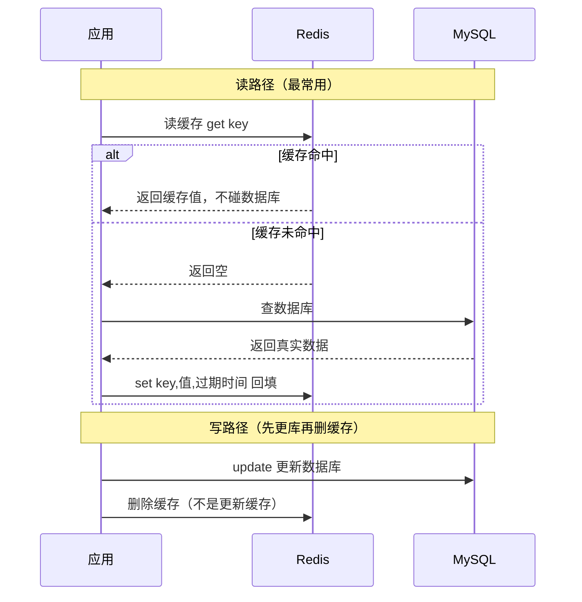
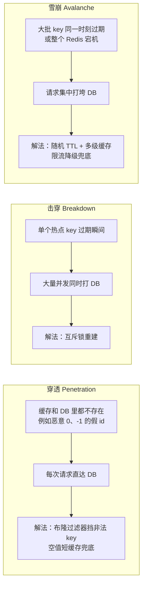
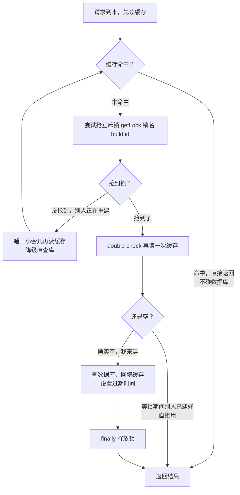
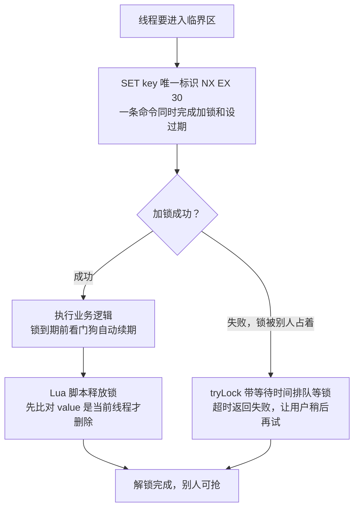
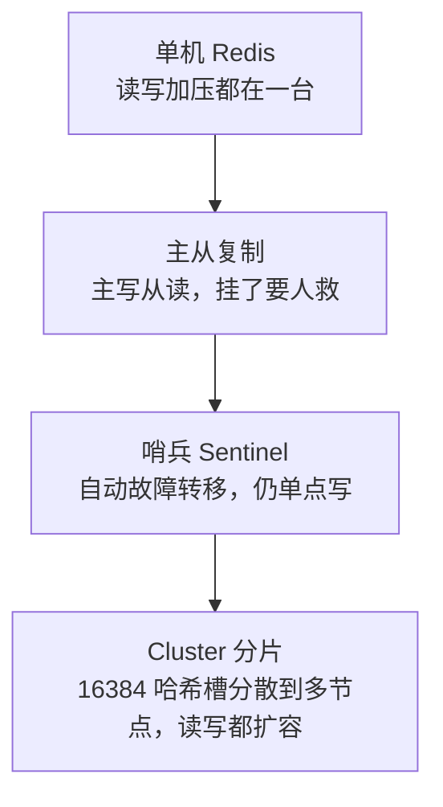

# 阶段三 · 小点 4：Redis 缓存体系

> 所属：阶段三 数据持久化与中间件
> 定位：从「会 set / get」到「能设计缓存架构」：数据结构选型、双写一致性、三大经典问题、分布式锁、高可用演进、多级缓存。**缓存的难从来不是用法，是一致性与失效设计。**

## 快速入门

> 本节为「缓存速览」：先认识 Redis 是什么、存什么、怎么用；「双写一致性、三大经典问题」留在正文提高部分。

### 本讲关键词与概念速查

| 关键词 / 概念 | 最低解释 | 典型用途或提醒 |
|-|-|-|
| Redis | 高性能的「内存数据库」，常用作缓存 | 存热点数据加快读取 |
| String（字符串） | 存单值的数据结构 | 计数或缓存单值 |
| Hash（哈希） | 存多个字段的数据结构 | 如购物车 `{skuId: cnt}` |
| ZSet（有序集合） | 按 score 排序的数据结构 | 排行榜或延时队列 |
| 缓存 | 把热点数据放内存，减少数据库读取 | 用户信息缓存 |
| 过期时间（TTL） | 到期后缓存项可被删除 | `SET k v EX 60`；需与主动删除或事件失效一起设计 |
| 穿透 / 击穿 / 雪崩 | 缓存三大问题 | 分别考虑布隆过滤器、互斥重建与错开过期时间 |
| 分布式锁（Distributed Lock） | 跨实例竞争同一资源时的互斥手段 | 必须 `finally` 释放；不替代库存事务 |
| 缓存一致性 / Cache-Aside | 缓存与数据库同步的设计问题 | 对可容忍最终一致的读取，常用先更 DB 再删缓存 |
| 布隆过滤器 | 概率性判断 key 是否不在集合中 | 挡缓存穿透；可能有假阳性 |

### 本讲在解决什么问题

- **问题**：数据库扛不住频繁读，把热点数据放 Redis 缓存。但「缓存怎么失效」「怎么保证和数据库一致」「怎么防缓存击穿打垮数据库」才是真难点。
- **你需要明确的点**：缓存 = 把热点数据放内存免查库。**更新时先改数据库、再删缓存**（Cache-Aside）；三大经典问题（穿透/击穿/雪崩）各有对策。

### 速览形态示意（不是可直接运行的工程）

> `User` 是用户数据对象，`userRepo` 表示数据库访问入口，`parse` / `toJson` 表示序列化与反序列化；代码省略了构造器注入、空值语义、序列化配置、依赖和 Redis 连接。30 分钟 TTL 只是便于阅读的假设，应按允许陈旧时间、数据量与访问量设置。

```java
// 缓存读取的标准流程: 先查缓存, 没有再查库并回填
@Service
public class UserService {
    private final StringRedisTemplate redis;    // Redis 操作模板

    public User getById(Long id) {
        String key = "user:" + id;
        // ① 先查缓存
        String json = redis.opsForValue().get(key);
        if (json != null) return parse(json);            // 命中: 直接返回, 不碰 DB

        // ② 没命中, 查数据库
        User user = userRepo.findById(id);                 // 此处假设找不到时返回 null
        if (user == null) return null;                     // 空值缓存策略见正文，不能把 null 直接序列化回填

        // ③ 回填缓存, 设过期时间(防止永远缓存)
        redis.opsForValue().set(key, toJson(user),
                Duration.ofMinutes(30));
        return user;
    }
}
```

> 代码备注（逐行解释）：
> - `redis.opsForValue().get(key)`：先查缓存。
> - 命中（`json != null`）直接返回，**不查数据库**——这就是缓存提速的原理。
> - 未命中再去查库，`userRepo.findById(id)`。
> - 查到数据后**回填缓存**并设置失效策略；这里的 `Duration.ofMinutes(30)` 只是示意。对允许短暂陈旧的缓存常用 TTL，并可为同类 key 加扰动分散集中失效。
> - 这是一种 Cache-Aside（旁路缓存）读路径：先读缓存、未命中再查库并回填。它适合可容忍最终一致的读取，不能替代数据库事务或强一致读。

### 常用约定 / 命名提示

- **缓存 key 规范**：`业务:对象:id`（如 `user:profile:123`），便于清缓存。
- **更新策略**：对允许最终一致的 Cache-Aside，常用「先更数据库、再删缓存」；删除失败要有重试或消息补偿，强一致读走数据库或其他专门方案。
- **失效策略要明确**：缓存可用 TTL、主动删除或事件失效；对大量相近 TTL 的 key，再考虑随机扰动防止集中失效。
- **分布式锁**：它只解决多实例间的互斥。库存扣减还需要数据库约束、幂等键、事务或可靠消息等完整业务设计；使用 Redisson 时记得 `try/finally` 释放。

## 精简大纲

1. 数据结构与典型场景（含命令会话）
2. 缓存模式与双写一致性方案
3. 三大经典问题：穿透 / 击穿 / 雪崩
4. 分布式锁（Redisson 实战）
5. 持久化与高可用：RDB / AOF、主从 → 哨兵 → Cluster
6. 多级缓存与大 key / 热 key

## 学习内容详情

> 除非明确标为「可运行」，本讲命令、Java 和配置代码都只说明一个机制：会省略 import、Bean 注入、序列化、异常处理、监控、容量参数和版本相关配置。把它迁入项目之前，要补齐这些前提并用压测、故障演练或监控验证。

### 1. 数据结构与典型场景

```bash
# String: 缓存对象 / 计数器 / 分布式 session
SET user:1001 '{"name":"Alice"}' EX 300     # EX 设过期, 永不过期的缓存都是未来的内存炸弹
INCR uv:2026-09-06                            # 原子计数(日 UV 统计)

# Hash: 对象部分字段读写 —— 只改价格不用序列化整个商品
HSET item:9:stock cnt 100
HINCRBY item:9:stock cnt -1                   # 库存扣减的原子雏形

# ZSet: 排行榜(score 排序) / 延迟队列(到期时间戳做 score)
ZADD rank:daily 120 "user:1" 80 "user:2"
ZRANGE rank:daily 0 9 REV WITHSCORES           # Top 10（REV 倒序，分数高的在前）

# Set: 交并差(共同关注) / Bitmap: 签到 / HyperLogLog: 海量基数
SADD follow:1 2 3 5
SINTER follow:1 follow:2                       # 共同关注
PFADD uv:2026-09 "u1" "u2"                     # 0.81% 误差换 12KB 内存统计亿级 UV
```

- 选型直觉：**「按字段读写」用 Hash，「按序取范围」用 ZSet，「去重判存在」用 Set / Bitmap**——别什么都塞 String JSON。

### 2. 缓存模式与双写一致性

**Cache-Aside（旁路缓存，最常用）**：

```java
public Order get(Long id) {
    var cached = redis.get("order:" + id);
    if (cached != null) return parse(cached);               // 命中: 不碰 DB

    var order = orderRepo.find(id);                          // 未命中: 查 DB
    redis.set("order:" + id, json(order), Duration.ofMinutes(30));  // 回填
    return order;
}

// 假设业务允许最终一致：先更新 DB, 再删缓存。
// “删”通常比“更新缓存”更容易收敛并发旧值覆盖；但删除失败或读回填竞争仍需重试、消息补偿与过期策略。
public void update(Order o) {
    orderRepo.save(o);
    redis.delete("order:" + o.getId());                      // ⚠️ 这步失败 = 脏数据窗口, 靠下面兜底
}
```

> 🧩 **为什么写路径是「先更 DB 再删缓存」，而不是「先删缓存」或「更新缓存」？**
>
> **生活版**：照片底片存在相册（数据库），墙上挂着洗好的照片（缓存）。要换新照片，正确顺序是：**先把相册里的底片换成新的（先更 DB），再顺手把墙上旧照片摘下来扔掉（删缓存）**——之后有人发现墙上没有，去相册拿新底片重新挂上即可。若反过来先摘旧照片、再换底片，这个间隙想看的人会去相册翻到旧底片重新洗一张挂上——等底片换成新的，墙上挂的已是旧照（旧数据放回缓存）；更糟的是你拿新底片先洗一张挂上去（更新缓存），别人同时拿旧底片也洗了一张再一挂，就把你的新照片盖掉了（旧值覆盖新值）。
>
> **换成 Redis**：对于允许最终一致的读路径，常用「先更 DB、再删缓存」，而不是直接更新缓存。它能降低旧值覆盖新值的概率，但不消除删除失败、数据库提交后应用宕机、并发读回填等窗口；这些要靠重试、消息补偿、过期策略和业务容忍度共同决定。要求强一致的关键读应直接读数据库或采用专门的一致性方案。

**Cache-Aside 读写全流程（一张时序图看穿「缓存怎么提速」「脏窗口从哪来」）：**



| 方案 | 一致性窗口 | 代价 |
|-|-|-|
| 先更 DB 再删缓存 | 删除失败或并发回填时可能陈旧，窗口取决于重试与 TTL | 需重试或事件补偿 |
| 延迟双删 | 前后各删一次，试图缩小旧值回填竞态 | 延迟应以实际读链路、复制延迟和压测为依据 |
| **订阅 binlog（Canal）** | 事件送达前可能陈旧，延迟取决于链路 | 增加组件；消费者仍需幂等、重试和监控 |

> **结论**：这里比较的是缓存与数据库的双操作，不存在天然原子性；先确认业务能容忍多长陈旧窗口，再以测量的链路延迟和故障恢复能力选择方案。

### 3. 三大经典问题

**先认人再动手——把三个「捣乱分子」放一张图对比（穿透 / 击穿 / 雪崩）：**



**一句话区别**：穿透是「查的东西根本不存在」，击穿是「单个热点刚好过期」，雪崩是「一大批一起失效或整个 Redis 倒掉」——三者对策不同，别混着背。

```java
// 穿透(Cache Penetration): 查的 key「缓存和 DB 里都不存在」——如恶意 0 / -1 / 超大随机 id
//   每次请求都穿缓存直达 DB, 即便没有并发也在持续浪费 DB 资源
// 解法一: 布隆过滤器先筛“明确不在已登记集合中的 key”。下面 1 000 万、1% 仅为容量假设，
// 位数和哈希函数数量要按预计 key 数量与可接受假阳性率计算；实现可选进程内或 Redis 模块。
var bloom = com.google.common.hash.BloomFilter.create(Funnels.stringFunnel(UTF_8), 10_000_000, 0.01);
bloom.put("order:1"); /* 初始化全部合法 key */
public Order getGuarded(Long id) {
    if (!bloom.mightContain("order:" + id)) return null;   // 对已正确构建且未漏录的集合，可判定“不在集合中”
    return get(id);                                        // "可能存在" 才走正常流程(含空值缓存兜底)
}
// 解法二: 空值也缓存短 TTL("order:999" → "" , 60s) —— 简单, 但攻击者换 key 就绕

// 击穿(Cache Breakdown): 单个热点 key 在过期瞬间, 大量并发同时打到 DB → 互斥重建
//   与穿透的区别: 穿透是"查的数据根本不存在", 击穿是"数据存在、只是恰好过期", 别混淆
public Order getWithMutex(Long id) {
    var cached = redis.get(k(id));
    if (cached != null) return parse(cached);
    RLock lock = redisson.getLock("build:" + id);          // 谁拿到锁谁重建
    if (lock.tryLock()) {
        try {
            var fresh = redis.get(k(id));
            if (fresh != null) return parse(fresh);        // double check: 等锁期间别人可能已建好
            var order = orderRepo.find(id);
            redis.set(k(id), json(order), Duration.ofMinutes(30));
            return order;
        } finally { lock.unlock(); }
    }
    sleepThenRetry();                                      // 没抢到锁: 稍等再读缓存(或降级直查)
}

// 雪崩(Cache Avalanche): 大量 key 在同一时刻过期 / Redis 整体宕机 → 请求集中打向 DB
//   与击穿的区别: 击穿是"单个 key", 雪崩是"一大批 key 或整个 Redis"
// 解法: TTL 加随机扰动 set(key, v, base + RANDOM.nextInt(60)); 多级缓存 + 限流降级兜底 Redis 宕机
```

> 🧩 **布隆过滤器（Bloom Filter）——一个只肯说「可能」的查重神器。**
>
> **生活版**：小区前台登记访客，人太多记不全。改用一张大格子表：每个访客来了，在对应好几格里各打个勾（位数组里把几个位置置 1）。新访客到，先查他那几格——**只要有一格没勾，就能断言「这人肯定没登记过」**（一定不存在）；几格全勾呢？只能说「可能登记过」（还有假阳性的可能）。占的地方极小，代价是会误认。
>
> **换成 Redis**：缓存穿透防护里，把已登记的合法 key（如 `order:1`）打散进布隆过滤器的位数组。若过滤器正确构建且新增、删除同步维护，`mightContain` 返回 false 表示 key 不在这份集合中，可直接走业务的「不存在」分支；返回 true 只表示「可能存在」，仍要走正常缓存与数据库流程。它对自身维护完整的集合**有假阳性、无假阴性**；漏录或延迟更新会破坏这个前提。

**击穿防护「互斥锁重建」的完整流程**（谁抢到锁谁查库回填，其余人等一等再读）：



### 4. 分布式锁（Distributed Lock，Redisson 实战）

```java
RLock lock = redisson.getLock("order:lock:" + orderId);   // 锁粒度: 按订单 ID, 别锁全局
try {
    // waitTime=3s 等锁；leaseTime=-1 使用 Redisson 看门狗。默认时长与版本、配置有关，部署时核对官方文档。
    if (lock.tryLock(3, -1, TimeUnit.SECONDS)) {
        doRefund(orderId);                                  // 临界区越短越好
    } else {
        throw new BizException("操作太快, 请稍后");
    }
} finally {
    if (lock.isHeldByCurrentThread()) lock.unlock();       // 必须校验持有者! 防释放了别人的锁
}
```

> 🧩 **看门狗（Watchdog）就是字面意思——一条负责「看门」的狗。**
>
> **生活版**：图书馆自习室座位靠抢占，管理员规定「每个座位给你 30 分钟，到点还坐着就续」。你不是紧盯闹钟，而是让管理员每隔几分钟确认一次「这人还在用吗」——还在用就自动帮忙续时，直到你真离开。这样哪怕你坐很久，座位也不会被没收；可一旦整栋楼停电（Redis 挂了），管理员也联系不上，座位这事就没人管了。
>
> **换成 Redis**：`leaseTime=-1` 时 Redisson 会使用看门狗续期机制；默认时长与续期行为需按当前版本和部署配置核对。它缓解「业务未完成、租约先到期」，却不能把 Redis 锁变成业务正确性的最终裁决：故障转移、网络分区和重复请求仍要由幂等、数据库约束或事务处理。Redis 官方也将分布式锁的正确性与可用性视为需要取舍的问题，可对照[锁模式说明](https://redis.io/docs/latest/develop/clients/patterns/distributed-locks/)。

**加锁 → 执行业务 → 释放，一条完整闭环：**



- **看门狗（Watchdog）**：锁到期前自动续期，解决「业务没跑完锁先过期」——但只保护「Redis 活着」的情形；**主从切换瞬间锁可能丢**（异步复制的固有窗口）。
- **RedLock 争议**：多实例投票方案在时钟跳变、故障恢复等条件下的安全性存在讨论。是否选 Redis、ZooKeeper 或其他协调系统，取决于业务可承受的重复、丢锁与不可用代价；不要把「单实例 + 主从」当作跨场景结论。
- 锁三纪律：粒度小、临界短、finally 释放带持有校验。

> ⏸️ **短期可以不学**：暂缓的是 RedLock 的多实例算法与论文争论细节；本讲仍需掌握 Redis 锁只提供互斥、必须校验持有者并设置过期，以及它不能单独保证业务正确性。**何时回来学**：做跨机房、强正确性分布式锁选型时。**面试最低要求**：一句话说明 RedLock 讨论的是故障和时钟条件下的锁安全性，并能先按业务风险判断是否需要更强的协调方案。

### 5. 持久化与高可用

- **RDB**：按配置生成时间点快照，文件紧凑、恢复通常较快；故障时会丢失最近一次快照后的写入。
- **AOF**：追加记录写命令。`appendfsync everysec` 是 Redis 文档给出的默认策略；在灾难场景下通常可能损失约 1 秒写入，但实际风险仍受磁盘和系统故障影响。
- **RDB + AOF**：可同时启用；Redis 7 起的多段 AOF 中，基础文件可使用 RDB 或 AOF 格式。不要用「Redis 4+ 的固定实现」概括所有当前版本。
- **选择逻辑一句话**：先从可接受的数据损失、恢复时间、数据集大小和备份策略出发选择，再按当前版本配置验证；官方对 RDB、AOF 与组合方式的取舍见 [Redis 持久化文档](https://redis.io/docs/latest/operate/oss_and_stack/management/persistence/)。

> 🧩 **主从 / 哨兵 / Cluster 三个词经常一起出现，一句话拆开：**
> - **主从复制（Master-Slave）**：一个「主」负责写，多个「从」跟着同步数据负责读——就像老板拍板、几个副手跟着执行；老板倒下没人自动顶上，得手动切换。
> - **哨兵（Sentinel）**：在集群边上盯着主从的「值班保安」——主挂了自动选新主并通知客户端，仍是单点写。
> - **Cluster（分片集群）**：把数据按 **16384 个哈希槽**切到多个节点。一般 key 用 `CRC16(key) % 16384` 计算槽位；含 `{...}` 哈希标签时只计算花括号中的部分。槽位再映射到节点，像大仓库按编号分区存放。规则以 [Redis Cluster 规范](https://redis.io/docs/latest/operate/oss_and_stack/reference/cluster-spec/)为准。



```text
高可用演进:
  主从复制   → 读扩展 + 手动切换(挂了要人救)
    → 哨兵 Sentinel → 自动故障转移(选新主+通知客户端), 仍单点写
      → Cluster 分片 → 16384 哈希槽: CRC16(key) % 16384 定位槽, 槽位映射到节点
        客户端请求错节点 → 服务端返回 MOVED <slot> <ip:port> 重定向
        smart client(如 Lettuce) 缓存槽位表 → ASK/MOVED 时本地更新, 下次直达
```

- **哨兵 vs Cluster 怎么选**：如果单个主节点容量和写入能力够用、重点是自动故障转移，可评估主从加哨兵；需要把数据与写入分散到多个分片时评估 Cluster。还要一起验证客户端能力、跨槽多 key 操作和运维成本。

- **大 key 治理**：`redis-cli --bigkeys` 找 → 拆分（Hash 按字段域拆）/ 异步删除（`UNLINK` 不阻塞主线程）。
- **热 key 治理**：单 key 打满单分片——本地缓存挡一层 / 多副本打散（`key#1..N` 随机读）。

### 6. 多级缓存


```text
浏览器缓存 → CDN → 进程内 Caffeine → Redis 集群 → DB
                    ↑ 本地挡"极端热点"(同一商品详情)     ↑ 挡大部分读
```

- 一致性权衡：本地缓存的失效传播是难题（短 TTL、MQ 广播失效等）。层级增加会增加失效传播和观测成本，但不等于必然「弱一分」；是否增加一层，应以热点收益、可接受陈旧时间和失效方案验证。

## 坑点提醒

- **`SETNX` 不设过期**：进程死在 setnx 与 expire 之间可能留下死锁；用单条 `SET key val NX EX <ttl>` 原子设置，并让 `<ttl>` 服从最长业务时间与故障恢复设计。
- **缓存了用户权限又不设短 TTL**：改权限后用户「踢不走」——权限类缓存要主动失效 + 短 TTL 双保险。
- **把 Redis 当唯一存储**：若业务数据只依赖 Redis，要根据 RDB/AOF、复制、淘汰、备份和恢复演练评估数据风险；多数业务把数据库或其他持久化系统作为事实源。
- **`KEYS pattern` 上生产**：它会遍历整个 key 空间，可能阻塞服务；使用 `SCAN` 分批处理也要限速，并评估结果可能重复或遗漏的处理方式。
- **`maxmemory-policy` 上线前必配**：确认当前 Redis 版本的默认策略与写满后的行为，并把淘汰策略、容量告警和压测结果一起纳入上线检查；缓存场景可评估 `allkeys-lru` 等策略，不能只凭名称选择。

## 本节自检

- [ ] 能回答：缓存与数据库双写有哪些方案；其陈旧窗口由哪些实际因素决定，而不是背一个固定秒数
- [ ] 能回答：Redis Cluster 怎么定位一个 key 属于哪个节点、哈希标签何时改变计算对象，以及客户端为什么会收到 `MOVED`
- [ ] 能为穿透 / 击穿 / 雪崩分别设计组合防护，并说明布隆过滤器维护、锁超时和 TTL 参数需要验证什么
- [ ] 能说出看门狗解决的具体问题，以及 Redis 锁为何不能单独保障扣库存、扣款等业务正确性
- [ ] 场景题：商品详情允许最多 5 分钟陈旧，更新后必须尽快可见，且高峰可能出现热点过期。写出读、写、失效和监控方案，并说明一个故障分支

**核对要点**：场景题可采用 Cache-Aside：读缓存未命中后查库回填，写入先提交数据库再删除缓存；TTL 要围绕 5 分钟陈旧上限设置并加适度扰动。删除失败不能只靠“下次过期”，要有可观测重试或事件补偿；热点 key 可在重建时做互斥或逻辑过期，并监控命中率、重建耗时、删除失败与数据库回源量。若业务不容许陈旧，不能以这个方案冒充强一致读。

## 本节配套思考题

1. 「先删缓存再更 DB」和「先更 DB 再删缓存」各在什么竞态下出问题？延迟双删的延迟该根据哪些可测量的链路数据设定？
2. 秒杀库存扣减用 Redis `DECR` 原子扣后，DB 落库失败怎么办？请给出幂等、补偿与防超卖的完整思路，并说明 Redis 锁在其中只解决哪一部分。
3. 布隆过滤器「有假阳性无假阴性」——用在缓存穿透防护上，假阳性多放过去一点请求打 DB 可以接受；反过来它能不能用来做「订单号合法性校验」？边界在哪？

## 常见面试题

### Q1：Redis 有哪些常用数据结构？各自适合什么场景？

**答**：

**标准结论**：五种基本结构——String（字符串）、Hash（哈希）、List（列表）、Set（集合）、ZSet（有序集合）；以及 Bitmap、HyperLogLog、Geo 等扩展结构。

**底层原理**（每种结构适合什么）：
- **String**：计数（`INCR` 原子自增）和单值缓存。
- **Hash**：按字段读写对象——改一个字段不用整个序列化，购物车 `{skuId: cnt}` 是典型。
- **List**：消息队列 / 时间线。
- **Set**：天然去重，交并差算共同关注。
- **ZSet**：以 score 排序，排行榜、延迟队列（到期时间戳做 score）都用它。

**工程实践**（选型直觉）：
- 「按字段读写」用 Hash、「按序取范围」用 ZSet、「去重判存在」用 Set / Bitmap。
- 别什么都塞 String JSON——序列化开销大且不能局部更新。

**常见误区**：
- 把 List 当消息队列却不设计确认、重试和积压处理——业务是否以数据库为事实源，取决于数据类型与系统设计，不能仅由 Redis 的内存特征下结论。
- UV 统计用 HyperLogLog（0.81% 误差换 12KB 内存），别拿 String 硬记。

### Q2：缓存穿透、击穿、雪崩分别是什么？怎么解决？

**答**：

**标准结论**（三个问题及对策）：
- **穿透**（Cache Penetration）：查询的数据缓存和 DB 都不存在，每次请求都打 DB——用布隆过滤器挡非法 key，或空值短缓存兜底。
- **击穿**（Cache Breakdown）：单个热点 key 过期瞬间大量并发同时打 DB——用互斥锁重建。
- **雪崩**（Cache Avalanche）：大量 key 同一时刻过期或 Redis 整体宕机——用随机 TTL + 多级缓存 + 限流降级。

**底层原理**：
- 穿透的本质是「不存在的东西没有正常缓存值」——在集合完整维护的前提下，布隆过滤器可判定 key 不在集合中；它有假阳性、没有由算法本身造成的假阴性。
- 击穿的根因是「重建成本高 + 并发放大」——互斥锁让并发里只有一个线程重建。
- 雪崩的根因是「失效时间同步 + 单点」——随机 TTL 把失效时间打散。

**工程实践**（可组合的防护）：
- 入口参数校验挡非法 id；
- 布隆过滤器挡「不存在」；
- 互斥锁挡热点过期瞬间。

**常见误区**：
- 把空值缓存当穿透万能解——攻击者换 key 就绕过，布隆过滤器才挡「不存在」。
- 把击穿和穿透混为一谈——前者是「存在的热点刚好过期」。

### Q3：缓存和数据库双写一致性怎么保证？

**答**：

**标准结论**：
- 对可容忍最终一致的读取，Cache-Aside 常用：读先查缓存、未命中查库回填；写先更 DB 再删缓存。
- 可用延迟双删或订阅 binlog 的事件链路缩小或修复窗口，但二者都要处理重试、幂等与监控。

**底层原理**：
- 缓存与 DB 的两次操作不具备天然原子性，因此要评估一致性窗口。
- 直接更新缓存可能出现旧值覆盖新值；删缓存往往更容易收敛，但并发回填仍可能产生旧值，需按业务验证。
- 删除失败会扩大陈旧窗口；用重试、事件补偿和过期策略共同兜底。

**工程实践**：
- 删除失败要重试（本地重试表 / 订阅 binlog 兜底）。
- 采用 binlog 订阅时，把消费延迟、重复消费、失败重试和缓存删除结果纳入监控；它并非业务零成本。

**常见误区**：
- 把 Cache-Aside 当强一致事务——它只能在陈旧窗口与实现复杂度间权衡；关键强一致读应采用数据库或专门一致性方案。
- 先问业务能容忍多长陈旧时间、失败后如何恢复，再选方案。

### Q4：Redis 持久化 RDB 和 AOF 的区别？生产怎么选？

**答**：

**标准结论**：
- RDB：定时全量快照，文件紧凑、恢复快，但可能丢最近一次快照之后的数据。
- AOF：追加写命令日志。`everysec` 是 Redis 文档中的默认策略，灾难时通常可能损失约 1 秒写入；文件大小与恢复表现受当前版本和负载影响。
- RDB 与 AOF 可组合使用；Redis 7 起 AOF 的文件组织已有变化，应以当前版本文档核对。

**底层原理**：
- RDB 把内存状态序列化落盘，加载就是反序列化，所以恢复快。
- AOF 记录写命令，恢复时重放；可接受的数据损失窗口取决于 `appendfsync`、操作系统与故障类型。它通常比只做周期 RDB 快照保留得更细，但不是“天然不丢”，恢复速度也受文件组织、重写和版本实现影响。
- 组合持久化会让恢复使用快照基础与后续写入记录；AOF 的文件组织与重写细节随 Redis 版本变化，阅读配置时以当前版本文档为准。

**工程实践**：
- 先根据可接受数据损失、恢复时间和备份策略选择 RDB、AOF 或组合，再用当前版本配置与演练验证。

**常见误区**：
- 以为开了持久化就不丢——AOF everysec 也有 1 秒窗口，主从切换、`maxmemory-policy` 淘汰都可能丢数据。
- 不要在未评估持久化、复制、备份、淘汰与恢复能力前，把 Redis 当作唯一数据副本。

### Q5：如何用 Redis 实现分布式锁？有什么坑？

**答**：

**标准结论**：
- 加锁可用 `SET key value NX EX <ttl>` 一条命令原子地「设置 + 过期」；`<ttl>` 应按业务最长耗时和故障恢复设计。释放时用 Lua 脚本比对持有者后删除。
- 可使用 Redisson 等客户端封装续期与释放，但需核对所用版本、部署和故障语义。

**底层原理**：
- 加锁应原子——`SETNX` 与 `EXPIRE` 分开写，进程死在中间可能留下没有到期时间的锁。
- 释放必须校验持有者（value 存唯一标识）——否则可能释放掉别人刚拿到的锁。
- 看门狗解决「业务没跑完锁先过期」：锁到期前自动续期，业务结束才释放。

**工程实践**：
- 锁粒度要小（按业务 ID，不锁全局）、临界区要短、finally 释放带 `isHeldByCurrentThread` 校验。

**常见误区**：
- 把 Redis 分布式锁当银弹——故障转移、网络分区和重复请求都可能影响互斥语义；扣款等强正确性场景还需幂等、数据库约束或专门协调方案。
- RedLock 的多实例安全性有争议；应根据业务可承受的重复、丢锁和不可用代价评估，而不套用单一结论。
