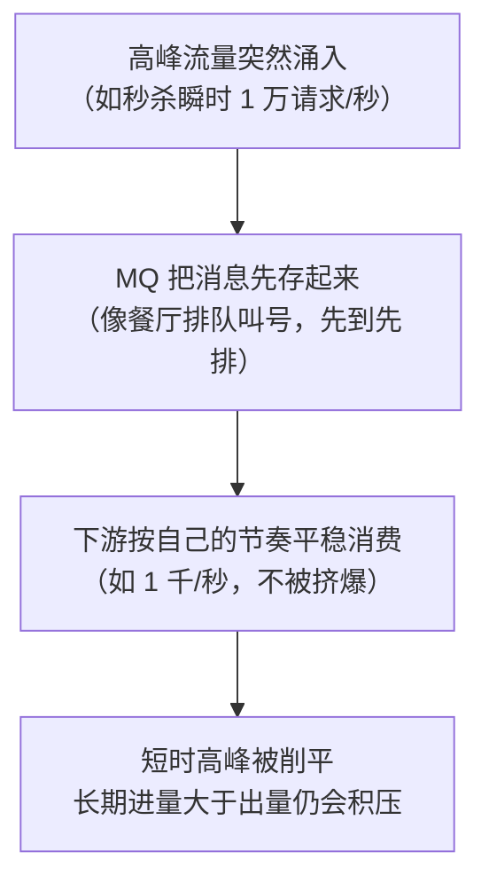
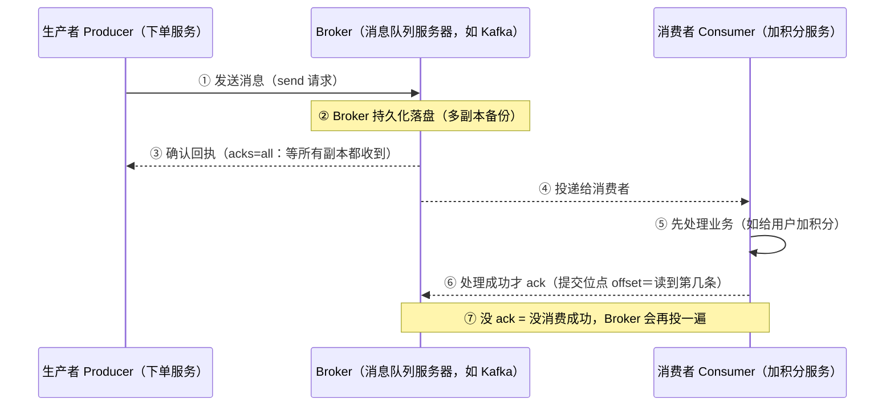
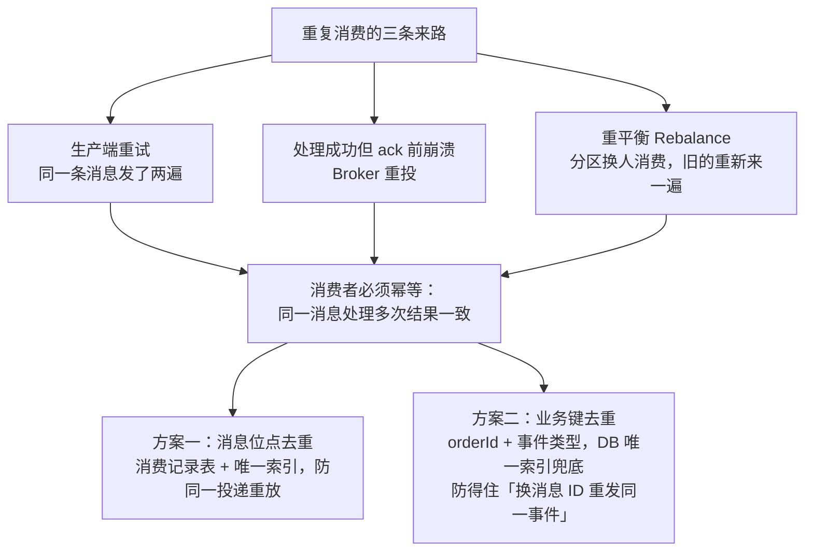
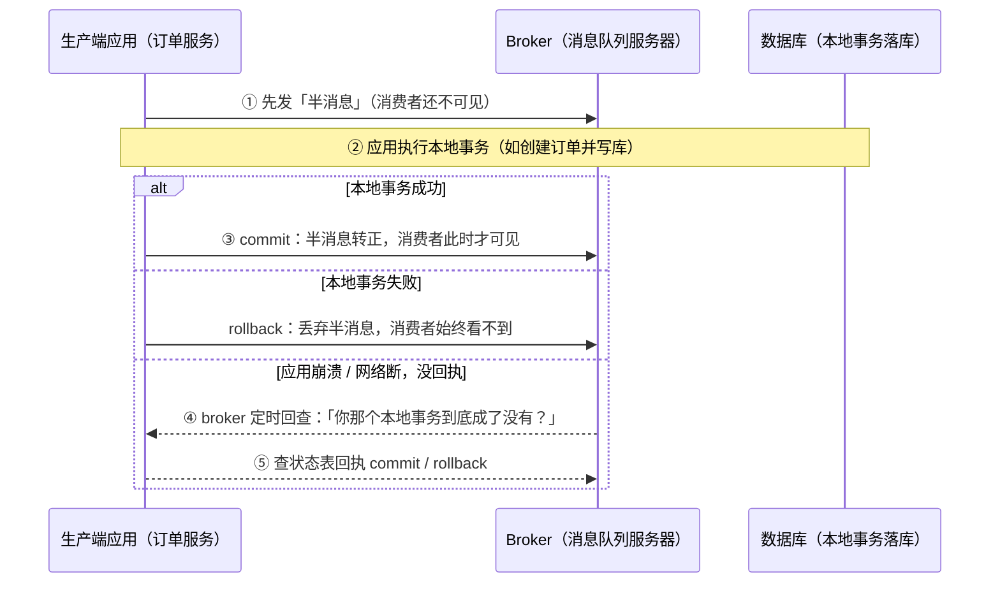
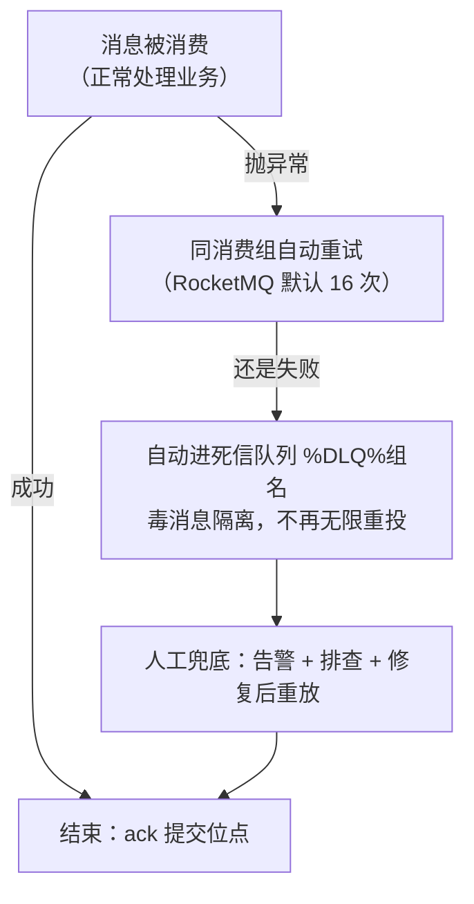
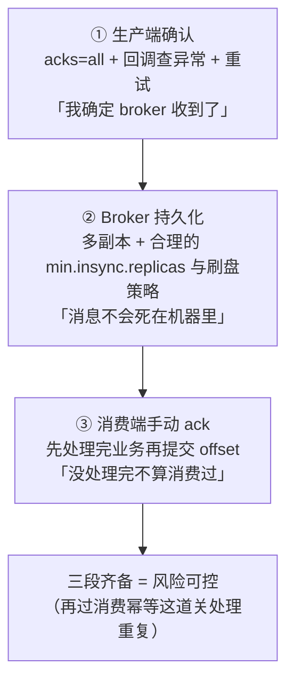

# 阶段三 · 小点 5：消息队列（Kafka / RocketMQ）

> 所属：阶段三 数据持久化与中间件
> 定位：异步解耦、削峰填谷、事件驱动的基石。重点不是背 API，而是掌握消息丢失与重复副作用的防护链，以及两大 MQ 的场景分工——MQ 用得好是架构，用不好是「故障延迟显形器」。

## 快速入门

> 本节为「消息队列速览」：先认识 MQ 解决什么问题、几个核心概念；「可靠性三段论、Exactly-Once」留在正文提高部分。

### 本讲关键词与概念速查

| 关键词与概念 | 一句话说明 | 典型用途或注意点 |
|-|-|-|
| 消息队列（MQ） | 先存消息、由消费者按自身节奏处理的中间件 | 异步发通知、同步 ES |
| 异步解耦 | 发布方发出事件后不必等待或关心每个处理方 | 下单后分别发券、加积分 |
| 削峰填谷 | 高峰暂存消息，消费端平稳处理 | 秒杀下单；长期进量大于出量仍会积压 |
| Topic | 消息的主题或分类 | `order.created` |
| 分区 / Partition | Topic 的并行处理单元 | 分区数决定同一消费者组的并行度上限 |
| 消费者组 | 组内消费者分摊同一 Topic 的分区 | 成员变动会触发重平衡 |
| `acks` | 生产者等待 Broker 确认的级别 | `acks=all` 的延迟还受副本和链路配置影响 |
| 手动 ack | 业务处理成功后再提交消费位点 | 忘记确认会导致重复投递 |
| 幂等消费 | 同一消息重复处理，结果仍保持正确 | 用业务键或唯一索引判重 |
| 死信队列（DLQ） | 多次失败的消息进入隔离区 | 需要告警、排查和重放闭环 |

### 本讲在解决什么问题

- **问题**：下单后要发短信、同步 ES、加积分……这些是「旁路操作」，如果同步做，用户下单要等半天。用 MQ 把「核心写库」和「旁路操作」解耦，高峰期还能削峰。
- **你要带走的一句话**：MQ = 异步解耦 + 削峰。生产确认、Broker 持久化（Broker＝消息队列的服务器，相当于消息的「快递转运站」）和处理成功后的确认降低丢失风险；消费幂等应对重复投递。用不好它会变成「故障延迟显形器」。

**削峰填谷先看一张图**（高并发下 MQ 最直观的价值）：



> 类比：**生活版**——午饭高峰食堂窗口排长队，先把菜「暂存」在窗口后厨，窗口师傅按自己的速度一份份出餐，高峰不被挤倒、闲时也不用停业。**换成 MQ**——MQ 就是那个「后厨暂存区」，下单等消息先堆进 Topic（分类货架），消费者（处理窗口）按固定速率取走，这就是削峰填谷。

### 速览形态示意（非完整可运行代码）

> 下面只展示「成功处理后确认、失败抛出」的消费形态：`OrderCreatedMessage` 是至少含 `orderId` 的订单事件；`orderProcessingService.processOnce` 表示在一个本地数据库事务中先以唯一键写入消费记录、再完成业务写入，重复消息安全返回，任一步失败则抛出。省略了事件反序列化、`AckMode.MANUAL` 与错误处理器配置、服务实现及必要的 Spring Kafka 依赖；补齐这些前提后才能运行。

```java
// 消费者: 收到消息, 手动 ack + 业务幂等(防重复处理)
@Service
public class OrderConsumer {
    // Acknowledgment 是 Spring Kafka 的方法参数(不是 @Header), 需要配置 AckMode.MANUAL 才生效
    @KafkaListener(topics = "order.created", groupId = "order-group")
    public void onMessage(OrderCreatedMessage msg, Acknowledgment ack) {
        try {
            // ① 幂等: 在同一 DB 事务中用唯一键写消费记录并完成业务写入
            orderProcessingService.processOnce(msg);

            // ② 手动 ack: 处理成功才提交 offset
            ack.acknowledge();
        } catch (Exception e) {
            // ③ 失败不 ack → 触发重试; 但若想交给默认错误处理器统一重试, 这里应 throw 而非只 log
            throw new RuntimeException("处理失败, 交给重试", e);
        }
    }
}
```

> 代码备注（逐行解释）：
> - `@KafkaListener(topics=..., groupId=...)`：监听 `order.created` 主题，属于 `order-group` 消费者组。
> - **Acknowledgment**：Spring Kafka 的方法参数（需 `AckMode.MANUAL`）；不是 `@Header` 注解——照抄 `@Header Acknowledgment` 会编译/运行出错。
> - ① **幂等**：`processOnce` 用业务键写消费记录并完成业务写入；消费记录的唯一索引负责原子判重，重复消息安全返回。它与业务写入必须在同一数据库事务中，不能用「先 `exists` 再处理」代替；方法正常返回后才确认本次投递。
> - ② **手动 ack**：处理成功才 `acknowledge()` 提交偏移量——否则 Broker 认为没成功会重投。
> - ③ **失败要 throw**：只 `log` 而不抛，默认错误处理器的重试/DLQ 逻辑不会介入；抛异常才能交给 `DefaultErrorHandler` 统一重试 + 进死信。
> - 这三点构成主要防护链：生产确认、Broker 持久化和晚于业务结果的确认降低丢失窗口，幂等降低重复副作用；跨 DB、第三方服务等边界仍需业务幂等与对账，不能把它们当成端到端保证。

### 常用约定 / 命名提示

- **选型**：日志流/数据管道用 Kafka；业务事务消息/延时消息用 RocketMQ；轻量点对点用 RabbitMQ。
- **消息积压处理顺序**：先看消费能力（加消费者，上限=分区数）→ 扩分区 → 业务批量化。先算清速率再动手。
- **DLQ 必须有闭环**：重试上限进死信后，要告警 + 人工排查 + 重放——没有闭环的 DLQ 是黑洞。

## 精简大纲

1. Kafka 核心：Topic / 分区 / 副本 / ISR / 消费者组
2. 顺序性与存储设计（高吞吐的秘密）
3. Exactly-Once 语义与消费幂等
4. RocketMQ 特色：事务消息 / 延时消息 / 死信
5. 选型场景与「不丢三段论」
6. 消息积压处理

## 学习内容详情

先把全链路在脑中过一次——**生产 → 存储 → 消费 → 确认**，后面每一节都在这条链上：



> 类比：**生活版**——你把快递交给驿站（生产者→Broker），驿站盖章签收（③ 回执），收件人取到货、扫码确认收货（⑤⑥），驿站看到「已收货」才划掉这件货（⑦）。**换成 MQ**——Broker 就是消息中间件的「驿站」，它不光看你有没有「甩给我」，还要你确认收到才放心（这就是 ack）。

### 1. Kafka 核心概念

```bash
# 建 topic: 3 分区 2 副本 —— 分区数定消费并行度上限, 副本数定可用性
kafka-topics.sh --create --topic order-events \
  --partitions 3 --replication-factor 2 --bootstrap-server localhost:9092

kafka-console-consumer.sh --topic order-events --from-beginning \
  --property print.partition=true --property print.offset=true
# 输出示例: Partition: 1  Offset: 42  {"orderId":1001,"type":"CREATED"}
```

- **Topic / 分区（Partition）**：Topic 是逻辑队列，**分区是并行的物理单位**——同一 Topic 的消息按分区键哈希落到某分区；分区数 = 消费者组内并行度的天花板。
- **副本与 ISR**：
  - **分工**：每分区多副本，leader 接读写、follower 同步。
  - **ISR（In-Sync Replicas）**：「跟得上」的副本集合——`acks=all` 就是等 ISR 全部确认。
  - **为什么可靠**：leader 自己收到不代表数据在别的副本上，leader 一宕机就丢；等 ISR 全确认才返回，任何一台 ISR 副本手里都有这份数据——这是「不丢三段论」第一段的生产端基础。
- **消费者组（Consumer Group）与重平衡（Rebalance）**：组内均分分区（一个分区同组只一个消费者）；成员增减 / 处理超时（`max.poll.interval.ms` 超期被视为死亡）会触发重平衡。传统 eager 协议会先撤销全部分区，因而全组会有消费空窗；cooperative 协议只渐进撤销需迁移的分区，其余分区可继续消费。排查「集体卡顿」时先确认所用分配器与实际 revoke/poll 间隔，而不是一概归因于全组暂停。[Kafka KIP-429：增量协作式重平衡](https://cwiki.apache.org/confluence/display/KAFKA/KIP-429%3A+Incremental+Cooperative+Rebalancing+in+the+Consumer)

> 类比：**生活版**——一个桌号对应一张火锅位，说好 6 人一桌均分；中途加人/走人，就得重新分菜。**换成 MQ**——消费者组增减成员时会重新分配分区；传统方式像所有人先停下来再分，协作式方式只让需要换座的人交接。类比不能推出固定的暂停时长，实际影响取决于分配器、处理耗时和超时配置。

### 2. 顺序性与存储设计

- **分区内天然有序，跨分区无序**——顺序性靠**分区键**：同一订单的事件用 `orderId` 做 key 哈希到同一分区，天然保序。
  ```java
  producer.send(new ProducerRecord<>("order-events",
          String.valueOf(order.getId()),        // ← key=订单ID: 它的 CREATED/PAID/SHIPPED 永远同分区同序
          json(event)));
  ```
  代价：分区键越细越并行，同一键必须独占一个分区才有序——「全局严格有序」只有 1 分区，即放弃并行。
- **高吞吐的秘密**：**顺序写磁盘**（追加，不随机）+ **零拷贝 sendfile**（阶段一第 9 讲的回收：数据从 page cache 直达网卡不经用户态）+ 分区并行 + 批量压缩。

> ⏸️ **短期可以不学**：Kafka 存储引擎的底层细节（页缓存、mmap、sendfile 的 OS 层机制、日志段 segment 结构）主线记住「顺序写 + 零拷贝 + 分区并行 + 批量压缩」这个结论即可。**何时回来学**：做 Kafka 性能调优 / 容量规划，或面试被深挖高吞吐原理时。**面试最低要求**：一句话说出 Kafka 高吞吐的四个来源。

### 3. Exactly-Once 与消费幂等

- **生产端**：`enable.idempotence=true`——broker 按「生产者 ID + 分区 + 序列号」识别重试，避免同一生产者对同一分区的重试写出重复记录。
- **事务**：`transactional.id` + `commitTransaction()` 可让「一批跨分区写入 + 消费位点提交」原子；下游须以 `read_committed` 读取，才不会看到未提交或已中止的事务记录。[Kafka 官方：消息语义](https://kafka.apache.org/documentation/#semantics)

> ⏸️ **短期可以不学**：Kafka 的 transactional.id + EOS 事务机制多数业务用不到——工程上「至少一次 + 消费幂等」已覆盖绝大多数场景。**何时回来学**：需要「跨分区原子写入」，或做流处理端到端一致性时。**面试最低要求**：知道 Kafka 事务解决「读-处理-写」的原子性，但端到端 Exactly-Once 仍需业务幂等。
- **工程真相**：投递语义可分为至多一次（At-Most-Once）、至少一次（At-Least-Once）与恰好一次（Exactly-Once）。Kafka 事务能约束 Kafka 内的读—处理—写链路，却不能把外部 DB 写入或第三方调用纳入同一个原子事务；这类跨系统场景仍以「至少一次投递 + 业务幂等 + 对账补偿」为默认工程方案。

```java
@KafkaListener(topics = "order-events", groupId = "point-service")
@Transactional
public void onOrderPaid(ConsumerRecord<String, String> record) {
    String messageId = record.topic() + ":" + record.partition() + ":" + record.offset();
    // tryInsert 由 consumed_event.message_id 唯一索引保证原子性；重复时返回 false
    if (!consumedEventRepo.tryInsert(messageId)) {
        return;
    }
    pointService.addPoints(parse(record.value()));    // 与去重记录同一 DB 事务，任一步失败一起回滚
}
```

- 上例的消息位点去重适合阻止同一次投递重放；更稳的去重键是**业务键**（`orderId + 事件类型`，DB 唯一索引兜底），它能防住「生产者换消息 ID 重发同一业务事件」。`@Transactional` 只覆盖本地 DB，不会让 Kafka 与 DB 自动成为一个事务；监听器仍要在 DB 提交成功后再提交 offset。

重复从哪来、在哪堵，一张图串起来：



### 4. RocketMQ 特色（国内金融电商常用）

```java
// 事务消息：解决"本地事务执行"与"消息发送"的原子性 —— 下单成功才发扣库存消息, 反之不发
// 注: 不同 RocketMQ 版本的"事务监听器"类名不同 —— 4.x 用 LocalTransactionExecuter, 5.x 用 TransactionListener
//     下文按 4.x 写法示意, 用 5.x 时换成 TransactionListener(以你所用版本为准)
TransactionSendResult r = producer.sendMessageInTransaction(msg, new LocalTransactionExecuter() {
    @Override
    public LocalTransactionState execute(Message msg, Object arg) {
        try {
            orderService.create(...);                       // ② 执行本地事务
            return LocalTransactionState.COMMIT_MESSAGE;    // ③ 成功 → 半消息转正, 消费者才可见
        } catch (Exception e) {
            return LocalTransactionState.ROLLBACK_MESSAGE;  //    失败 → 丢弃半消息
        }
    }
}, null);
// ① 先发"半消息"(对消费者不可见); ③ 若应用崩溃/网络断没回执 → broker 定时**回查**本地事务状态决定 commit/rollback
```

两阶段用时间线看更清楚：



- **延时消息**：`setDelayTimeLevel`（固定级别 1s/5s/10s/30s/1m…）——**订单 30 分钟未支付自动取消**的标配实现：下单即发延时消息，到期检查状态决定取消或忽略。
- **死信队列（Dead Letter Queue，DLQ）**：同消费组重试 16 次仍失败 → 自动进 `%DLQ%组名`——**人工兜底 / 告警的入口**，别让毒消息无限重投堵死正常消息。进 DLQ 后必须有人管：**告警 + 人工排查 + 修复后重放**——没有闭环的 DLQ 就是黑洞。

流转过程一张图：



> 类比：**生活版**——食堂有个菜反复做不好（重试 16 次），师傅不再给你上这道菜，而是把它放进「问题菜品回收区」，等主厨（人工）看看到底配方错在哪，修好再重新上。**换成 MQ**——重试到上限仍失败的消息进 DLQ 就是进「问题区」；必须配告警 + 人工排查 + 修复后重放（闭环），否则没人管的 DLQ 会静默堆成黑洞。

### 5. 选型与「不丢三段论」

- **场景分工**：日志流 / 大数据管道 / 超高吞吐 → **Kafka**；业务消息（事务 / 延时 / 顺序消息特性齐全）→ **RocketMQ**；引入时机：同步链路太长、流量尖峰打垮下游、需要事件驱动解耦。
- **选型决策三行**：

| 需求特征 | 选 |
|-|-|
| 日志流 / 数据管道 | Kafka |
| 业务事务消息 / 延时消息 | RocketMQ |
| 轻量点对点、复杂路由、中小流量 | RabbitMQ |

**不丢三段论**可当「防护链」记：三段分别覆盖发送、Broker 和消费侧的主要丢失窗口，缺少其中一段会留下对应风险。



```text
消息不丢三段论（背下来, 面试与架构评审通用）:
  ① 生产端 confirm   : acks=all(-1) + 发送回调查异常 + 重试 —— "我确定 broker 收到了"
  ② Broker 持久化    : 多副本 + 与副本数、可用性目标匹配的 min.insync.replicas + 刷盘策略 —— "消息不会死在机器里"
  ③ 消费端手动 ack   : 先处理业务、成功再提交 offset —— "没处理完不算消费过"
     + 消费幂等兜底"至少一次"必然带来的重复投递

三段都具备才能降低链路丢失风险；其中最容易遗漏的是 ③ 的「处理完才提交」。自动提交若发生在业务完成前，进程崩溃会留下丢失窗口；是否使用它取决于处理模型，关键是让位点提交晚于可恢复的业务结果。
```

### 6. 消息积压处理

处理顺序（别乱）：

1. **先看消费能力**：加消费者——注意并行度上限 = 分区数，加超了也是闲着。
2. **再扩分区**：新分区只分流**新消息**，存量积压不动，得等消费追平。
3. **业务侧批量化 / 并行化**：攒批写库、消费逻辑内并行 IO。

积压千万级时，先算清**消费速率 vs 生产速率**再动手——追不平速率，加多少机器积压都只会更厚。

> 类比：**生活版**——浴缸同时开着大水龙头放水、排水口又小，水只会越积越深，错在「进大于出」。**换成 MQ**——生产者持续投消息就是「进水」，消费者处理速度就是「下水」；削峰的本质是让高峰的水先存在 MQ 里慢慢排，但若长期进 > 出（追不平速率），加再多排水管（消费者）也排不完存量，积压只会更厚。

## 坑点提醒

- **自动提交早于业务结果**：`enable.auto.commit=true` 可能在业务尚未完成时推进位点，进程崩溃就会留下丢失窗口；选择手动提交或明确的批处理提交策略，使提交晚于可恢复的业务结果。
- **消费逻辑里同步调慢接口**：单条超时拉长整批、触发 rebalance 风暴——**消费端也要超时 + 快失败进重试 / DLQ**。
- **重试队列没上限**：异常消息无限重投，毒消息堵死正常流程——RocketMQ DLQ / Kafka 死信 topic 要有。
- **把 MQ 当「解耦万金油」**：强一致同步场景硬上异步 = 用户看到「下单成功但查不到」——先问「这个依赖能不能最终一致」。

## 本节自检

- [ ] 能回答：Kafka 从生产到消费全链路，怎么保证消息不丢、不重？
- [ ] 能解释分区键怎么保证顺序性，以及分区数与消费者数的关系
- [ ] 能说清 RocketMQ 事务消息「半消息 + 回查」的完整流程
- [ ] 能解释「至少一次 + 幂等消费」如何让业务结果在重复投递时保持一次效果，并写出消息位点键与业务键两种幂等方案
- [ ] 能默写不丢三段论并指出自动提交位点破坏的是哪一段
- [ ] 场景判断：订单积分消费者已写库、但提交 offset 前宕机。能说明为何会重投，并给出以业务键 + 唯一索引兜底的处理方式。

### 自检答案要点

- 「不丢」要同时覆盖发送确认、Broker 持久化和晚于业务结果的位点提交；它降低的是消息丢失风险，不能替代消费幂等。
- 同一业务键必须稳定路由到同一分区才有键内顺序；消费者数超过分区数不会提高该组并行度。
- 事务消息的失败闭环是半消息不可见、提交或回滚、无回执时由 broker 回查本地事务状态。
- 写库后宕机前未提交 offset 时会重投；用 `orderId + 事件类型` 等业务键配合数据库唯一索引，在重复写入时得到已处理结果或唯一键冲突，再安全确认该消息。

## 本节配套思考题

1. 「消息积压 1000 万条」的现场处置：能直接加消费者吗（提示：并行度 ≤ 分区数）？扩分区的代价与生效时机？
2. Kafka 的 offset 是「已消费到哪里」的位点，RocketMQ 是 broker 侧进度——两种模型在「消费者组扩容 / 回溯重放」时的能力差异是什么？
3. 订单状态变更既发 MQ 又写 ES（Canal 链路），怎么保证「消费端看到的 ES 已就绪」？（提示：最终一致 + 读自己的写两种解法）

## 常见面试题

### Q1：消息队列怎么保证消息不丢失？

**答**：

**标准结论**：「不丢三段论」——生产端确认（acks=all + 发送回调查异常 + 重试）、Broker 持久化（多副本 + min.insync.replicas≥2）、消费端手动 ack（先处理业务、成功再提交 offset），**三段全对才不丢**。

**底层原理**：
- 生产端 `acks=all` 等 ISR 全副本确认才返回——leader 自己收到不代表数据在别的副本上，leader 一宕机就丢。
- Broker 多副本保证单机故障数据仍在。
- 消费端自动提交（enable.auto.commit）会在业务没处理完、消费崩溃时直接丢消息，所以必须「处理完才提交」。

**工程实践**：
- 三段里最容易被忽略的是第三段。
- 消费逻辑里同步调慢接口、超时拖长 rebalance，都会造成假死和消息重投。

**常见误区**：
- 以为开了 acks=all 就万事大吉——单副本部署、自动提交、慢消费，任何一个都会让前面的努力白费。
- 消息「不丢」是整条链路的合取，不是某一个配置。

### Q2：消息重复消费怎么解决？

**答**：

**标准结论**：MQ 默认至少一次投递，重复不可避免，必须消费端幂等——同一消息处理多次结果一致。

**底层原理**：
- 重复的三个来源：生产端重试导致同一条消息发两次、消费端处理成功但 ack 前崩溃导致重投、重平衡导致分区被重新分配后的重新消费。
- MQ 无法替你把「写 DB / 调外部」变成原子，只能在消费侧去重。

**工程实践**：
- 两种幂等键：用消息位点（topic+partition+offset）做 Redis `setIfAbsent` 去重；更好用业务键（orderId + 事件类型）做 DB 唯一索引兜底。
- 业务键方案防得住「生产者换 key 重发同一业务事件」。

**常见误区**：
- 只用 offset 做幂等键——换 key 重发就漏了。
- 唯一索引方案要注意「先查后插」的并发，直接靠唯一索引冲突捕获才算原子。

### Q3：消息积压了 1000 万条，现场怎么处理？

**答**：

**标准结论**：先看消费能力（能否加消费者，但并行度上限 = 分区数）→ 扩分区（只分流新消息，存量积压不受影响）→ 业务侧批量化 / 并行化；动手前先算清消费速率 vs 生产速率。

**底层原理**：
- 一个分区的消息同一时刻只能被消费者组内的一个消费者处理，所以并行度上限 = 分区数，加人超过分区数等于白加。
- 积压是「生产速率 > 消费速率」持续积累的结果，追不平速率，加多少机器积压只会更厚。

**工程实践**：
- 紧急处置先定位是「生产太快」还是「消费太慢」——慢接口超时、DB 慢查询、单条消息处理重都常见。
- 消费逻辑里慢调用要超时 + 快速失败进重试 / DLQ，别让单条拖死整批触发 rebalance 风暴。

**常见误区**：
- 一上来就扩分区——扩容只对新消息生效，存量要等消费追平。
- 也别不加分析就无限加消费者。

### Q4：Kafka 怎么保证消息顺序？

**答**：

**标准结论**：Kafka 只保证分区内有序、跨分区无序；要顺序就用分区键（key），把同一业务的消息（如一个订单的 CREATED / PAID / SHIPPED）路由到同一分区。

**底层原理**：
- 发送时指定 key，broker 按 key 哈希到同一分区，消息按写入顺序追加存储。
- 一个分区同一消费者组只有一个消费者在消费，天然串行，所以不会并发乱序。

**工程实践**：
- 分区键越细并行度越高，但同一键必须独占一个分区才有序——「全局严格有序」只有 1 个分区，等于放弃并行。
- 绝大多数业务用「按订单 / 按用户」的键级有序就够。

**常见误区**：
- 以为设置重试就能保序——重试可能让消息乱序，要配合 `enable.idempotence`。
- 跨分区的「全局顺序」是伪需求，消费端按 key 聚合即可，不要用单分区换全局有序。

### Q5：RocketMQ 事务消息的原理是什么？

**答**：

**标准结论**：先发「半消息」（消费者不可见）→ 执行本地事务 → 返回 COMMIT_MESSAGE / ROLLBACK_MESSAGE → 应用崩溃没回执时 broker 定时回查本地事务状态决定 commit / rollback。

**底层原理**：
- 它解决「本地事务执行」与「消息发送」的原子性——下单成功才发扣库存消息，反之不发。
- 半消息阶段消费者不可见，避免了「事务回滚但消息已发出」。
- 回查机制兜底应用崩溃、网络断等「没回执」的情况——broker 会回调应用问「你那个事务到底成了没有」。

**工程实践**：
- 回查要能查到本地事务的真实结果（比如状态表记录），所以本地事务里要落一条可查询的记录。
- 回查是异步的，消费者可能稍晚才看到消息，业务要容忍最终一致。

**常见误区**：
- 以为事务消息 = 消费端也自动回滚——它只保证「本地事务和发消息」的原子性，消费端处理失败要靠重试和幂等兜底，不是消息自动撤销。
