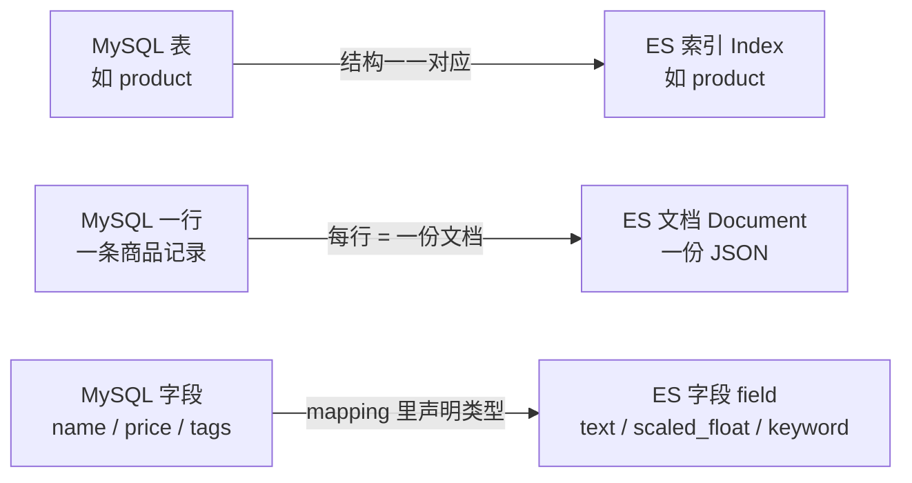
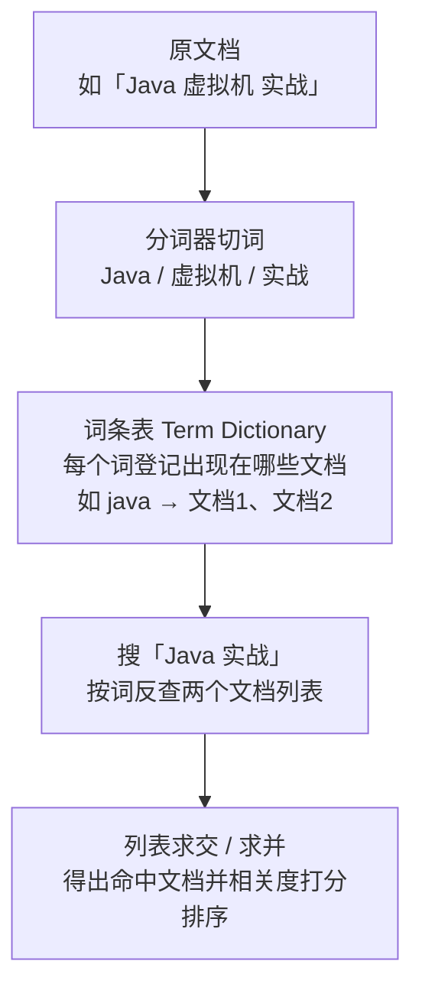
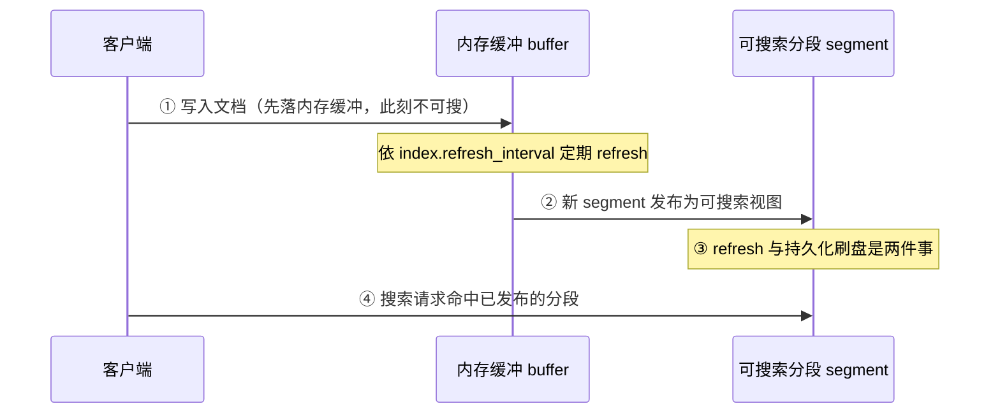
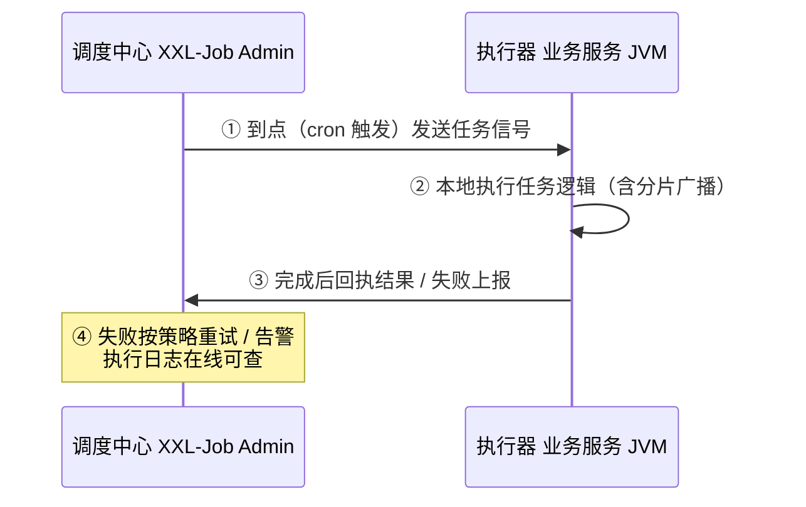
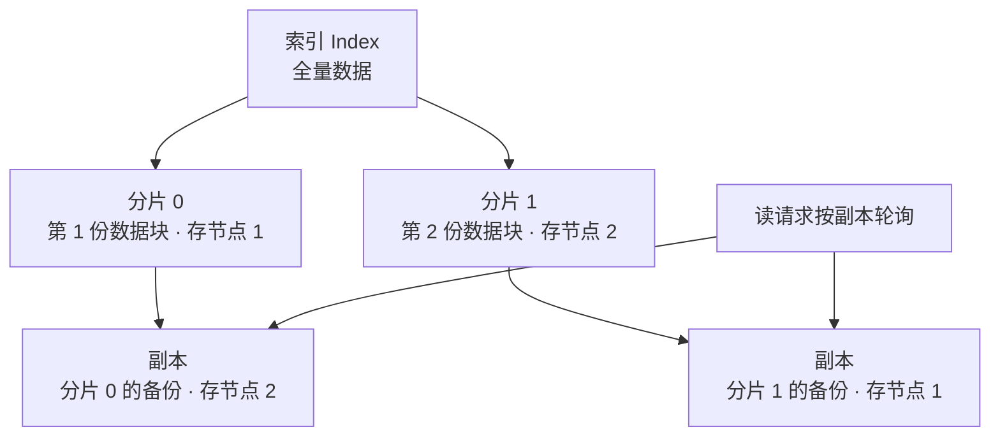

# 阶段三 · 小点 6：Elasticsearch 与定时任务

> 所属：阶段三 数据持久化与中间件
> 定位：搜索与调度是数据层的「最后一公里」——复杂检索从 DB 卸载到 ES，周期任务从单点脚本升级到调度平台。两者都是「看起来简单、上线才见真章」的组件。

## 快速入门

> 本节为「搜索与调度速览」：先认识 ES 解决什么问题、XXL-Job 解决什么问题；「倒排索引、数据同步」留在正文提高部分。

### 本讲关键词与概念速查

| 关键词与概念 | 一句话说明 | 典型用途或注意点 |
|-|-|-|
| Elasticsearch（ES） | 面向全文检索、相关性排序和聚合的搜索引擎 | 商品搜索；通常作为可重建的检索视图 |
| 倒排索引 | 按「词 → 文档」组织的索引结构 | 全文检索的基础，分词质量会影响结果 |
| 分词 | 把文本分析成可检索的词条 | 中文可用 `ik` 等分析器 |
| 索引（Index） | ES 中存放同类文档的逻辑集合 | 可类比数据库表；日志索引常按时间滚动 |
| DSL | ES 的 JSON 查询语法 | `match`、`bool` 等查询 |
| bool 查询 | 组合多个检索与过滤条件的查询 | `must` 算分，`filter` 不算分 |
| 深分页 | 用 offset 翻到很深页面时成本升高的问题 | 别硬翻，用 `search_after` |
| 数据同步 | 让 MySQL 与 ES 的检索视图保持可接受的一致性 | 双写、MQ 或 Canal；需要对账补偿 |
| 定时任务 | 按固定周期或时间执行的任务 | 每晚清理数据、生成日报 |
| XXL-Job | 提供分布式调度与执行治理的平台 | 分片广播、失败重试、告警 |
| 集群角色 | 节点承担管理、存储或协调查询等职责 | 大集群再按负载评估是否物理分离 |

### 本讲在解决什么问题

- **问题**：① 复杂搜索、全文检索或聚合超过关系型数据库可承受的查询成本时，如何引入检索层；② 周期任务出现多实例协调、执行追踪或失败恢复需求时，如何选择调度方式。
- **你要带走的一句话**：ES 用倒排索引和分词解决检索问题，但要付出同步与运维成本；Spring `@Scheduled` 适合简单任务，XXL-Job 等平台解决分片、追踪和告警。先按需求选，不按组件名套答案。

### 速览形态示意（非完整可运行代码）

> 下面只展示 Java Client 的查询构造形态：`client` 是已配置地址、认证和 JSON 映射的 `ElasticsearchClient`，`Doc` 是与 `products` 索引 mapping 对应的文档模型。省略了客户端创建、依赖版本、索引 mapping 与异常处理；补齐后才能运行，字段类型将在正文说明。

```java
// ES 查询: 用 bool 查询组合条件(与 SQL WHERE 对应)
import co.elastic.clients.elasticsearch.ElasticsearchClient;

SearchResponse<Doc> resp = client.search(s -> s
    .index("products")                    // 查哪个索引(≈ 表)
    .query(q -> q.bool(b -> b             // bool 查询: 组合多个条件(≈ WHERE)
        .must(m -> m.match(mq -> mq.field("name").query("手机")))   // 名称含"手机"(≈ LIKE)
        .filter(f -> f.term(t -> t.field("status").value(1)))        // status=1(≈ 精确过滤)
    )),
    Doc.class);
```

> 代码备注（逐行解释）：
> - `client.search(...)`：发起一次搜索请求。
> - `.index("products")`：指定在哪个「索引」（相当于数据库表）里搜。
> - `.bool(...)`：**bool 查询**用来组合多个条件，`must` 必须满足（≈ AND），`filter` 精确过滤（不算分）。
> - `.match(field("name").query("手机"))`：**全文匹配**——按分词在 name 字段找「手机」；它不同于 `LIKE %手机%` 的逐行包含匹配，二者不能直接等同。
> - `.term(field("status").value(1))`：**精确匹配** status=1（≈ `WHERE status=1`）。
> - 对比 SQL：ES 用 JSON DSL 表达「过滤 + 全文检索 + 排序 + 聚合」，在复杂搜索上远比 `LIKE` 强大。

### 常用约定 / 命名提示

- **什么情况才上 ES**：有分词、相关性排序、复杂聚合或查询成本目标无法由关系型数据库满足时再评估；数据量小且仅需精确、前缀或简单条件查询时，MySQL 的普通索引或全文索引可能已够用，别为「显得专业」上 ES。
- **ES ≠ 数据库**：在「MySQL/PG 是交易数据源、ES 负责检索」的架构中，业务真相写入 MySQL/PG，ES 是可重建的检索视图；不要把这条经验泛化为所有产品的数据源设计。
- **定时任务的选型**：单实例、轻量且有独立监控时可用 Spring `@Scheduled`；多实例协调、分片、执行记录和统一告警需求明确时，再评估 XXL-Job 等调度平台。

## 精简大纲

1. 倒排索引原理与中文分词
2. DSL 查询与聚合分析
3. 与 MySQL 的数据同步、深分页问题
4. 定时任务：Spring Scheduler 的局限与 XXL-Job

## 学习内容详情

### 1. 倒排索引与分词

先对齐 ES 的概念坐标系——它把「数据库那套」换了个名字（索引≈表、文档≈行、字段≈列、mapping≈建表语句），对照起来读正文不迷路：

> **生活版——同一个东西两套叫法**：前端项目里「路由表 / 页面 / 组件树」是同一套东西的不同角度；ES 与 MySQL 也是「同一份数据、两套命名」——存的内容一样，服务的目标完全不同（MySQL 管事务真相，ES 管检索速度）。
>
> **换成 ES**：MySQL 的表（table）对应 ES 的**索引（Index）**，一行记录对应一个**文档（Document）**，字段（column）对应**字段（field）**，`CREATE TABLE` 对应 **mapping（字段类型映射）**。索引（Index）、文档（Document）都是术语首现，先记这一层对应，后面细看。



**倒排索引**（**Inverted Index**）：正排是「文档 → 词」，倒排是「词 → 文档列表」——全文检索的本质是**从词反查文档**。

> **生活版——日历索引 vs 逐页翻书**：你手上一本电话簿，两种找人的方式：① **正排**=从第 1 页往后一页页扫，眼睛扫过每个名字找「张医生」（= 逐行全文扫，慢）；② **倒排**=书末先做好一张「关键词 → 页码」表（「张 → p8、p120」），查的时候直接翻开对应几页（= 顺着词查文档列表，快）。ES 用第 ② 种，MySQL 的 `LIKE '%xx%'` 只能是第 ① 种——这就是两者速度差的直观来源。
>
> **换成 ES**：写入文档时分析器先把文本切碎成**词条（Term）**，登记「每个词出现在哪些文档」；查询时按词直接反查这张「词 → 文档 ID」表，再求交 / 求并组合多词条件——复杂度从「扫全部行」（O(行数)）降到「按词查表求交」（O(词条数)）。



```json
// 文档: {"id":1, "title":"Java 虚拟机 实战"}   {"id":2, "title":"Java 编程思想"}
// 分词后建倒排:
{
  "java":        [1, 2],
  "虚拟机":      [1],
  "实战":        [1],
  "编程":        [1, 2],
  "思想":        [2]
}
// 搜 "Java 实战": 两个词 Posting List 求交/并 → 命中 1(两词都有) 与 2(仅 java), 按相关性打分排序
```

- 结构三层：Term Dictionary（词表，FST 压缩前缀树）→ Posting List（文档 ID + 词频 + 位置）→ Skip List 加速求交。

> ⏸️ **短期可以不学**：倒排索引的底层实现细节（Term Dictionary 的 FST 压缩前缀树、Posting List 的 Skip List 加速求交）属于引擎源码级推导，主线记住「词 → 文档列表」和三层结构名即可。**何时回来学**：ES 性能调优、面试深挖倒排索引实现时。**面试最低要求**：能画出「词 → 文档 ID 列表」的倒排结构，并解释为什么全文检索比 LIKE 快。
- **中文必须分词**（**Tokenization**，由分析器 Analyzer 完成）：不先分词，中文句子就是无法匹配的整串——**分词器（Analyzer）= 把一句话切成词的小工具**，英文按空格切就行，中文要靠词典 / 规则，所以要用专门的 IK 分析器。
  - `ik_max_word`：最细粒度，**建索引用**——尽量切出全部词元，倒排表覆盖面广。
  - `ik_smart`：粗粒度，**查询用**——按最合理的词切，query 更精准。
  - **铁律：索引与查询用同一套分词体系**——否则 query 词元与索引词元对不上，就会出现「明明有却搜不到」。

```bash
curl -X PUT "localhost:9200/product" -H 'Content-Type: application/json' -d '{
  "mappings": {
    "properties": {
      "title":   { "type": "text", "analyzer": "ik_max_word", "search_analyzer": "ik_smart" },
      "price":   { "type": "scaled_float", "scaling_factor": 100 },
      "tags":    { "type": "keyword" },              // ⚠️ 精确过滤/聚合用 keyword, text 会被分词毁掉
      "createdAt": { "type": "date" }
    }
  }
}'
```

> 此命令依赖已安装并与 ES 版本兼容的 IK 分词插件；示例用于说明 mapping，不保证在裸 ES 环境直接执行。若没有该插件，先用 ES 内置分析器验证流程，再按插件文档部署。

写入流程与「近实时」——理解了它，后面坑点里的「ES 当主存储用」才有依据：

> **生活版——草稿纸攒一会儿再誊写**：你写日记先写在草稿纸上，攒到固定间隔一次性誊进正式笔记本；正式本里的内容别人才能「翻阅查到」——誊写那一刻算起才可查，攒着的这 1 秒新内容查不到。
>
> **换成 ES**：文档写入先进入**内存缓冲（buffer）**；refresh 会把缓冲生成并发布新的**分段（Segment，倒排索引的存储单元）**，发布后才可被搜索。`index.refresh_interval` 的默认值为 1 秒且可配置；但默认只会自动刷新最近 30 秒内被搜索过的索引，搜索空闲索引会等到下一次搜索才触发刷新。refresh 也不等于把数据持久刷盘；这就是 ES「近实时（NRT）」：写入后不保证立刻可搜，也不能把 refresh 当成事务或持久化确认。[Elastic 官方：近实时搜索](https://www.elastic.co/guide/en/elasticsearch/reference/current/near-real-time.html)



- **索引生命周期**：日志 / 订单类搜索数据按天或按月建索引，配 ILM（索引生命周期管理）做冷热分层与定期删除——无限增长的单一大索引是事故源。

### 2. DSL 查询与聚合

```json
// bool 组合: must(参与打分) / filter(不算分+可缓存) / should(或) / must_not
GET /product/_search
{
  "query": {
    "bool": {
      "must":   [ { "match": { "title": "Java 实战" } } ],          // 分词匹配
      "filter": [                                                    // 结构化条件一律放 filter —— 免打分, 可缓存
        { "range": { "price": { "gte": 30, "lte": 100 } } },
        { "term":  { "tags": "编程" } }                             // keyword 精确值
      ]
    }
  },
  "highlight": { "fields": { "title": {} } }                        // 命中片段高亮
}
```

```json
// 聚合: metrics + bucket 嵌套 —— 类 GROUP BY 但能多层
GET /order/_search
{
  "size": 0,                                                         // 不要命中文档, 只要统计
  "aggs": {
    "per_day": {
      "date_histogram": { "field": "createdAt", "calendar_interval": "day" },   // bucket: 按天分桶
      "aggs": { "amt_p99": { "percentiles": { "values": [50, 99] } } }           // 嵌套 metrics: 每天金额中位/p99
    },
    "avg_all": { "avg": { "field": "amount" } }
  }
}
```

- **相关性打分（BM25，Best Matching 25）**：给命中文档排序的三要素——**词频饱和**（一个词出现很多次后不再无限加分，防关键词堆砌）+ **逆文档频率**（越稀有的词权重越高）+ **字段长度归一**（字段越短越相关）。
  - 默认理解即可；**搜索体验差先查分词与字段权重，不是调 BM25 参数**——按「分词对不对 → 字段权重 / bool 结构 → 最后才是打分公式」的顺序排查。
- **`match` vs `term` 的选型**——**用错是新手第一大坑**：
  - `match`：**分词后匹配**——查询词先被切开、各找各的倒排词项，用于 **text** 字段的模糊全文搜索（≈ `LIKE %xx%`，但更智能）。
  - `term`：**不分词**、按原词精确值匹配，用于 **keyword** 字段的精确过滤（≈ `WHERE status = 1`）。
  - 反直觉点：对 **text** 字段用 `term` 查，拿完整短语去匹配「分词后的词元」往往查不到——**倒排索引里存的是切碎的词，不是原值**。

### 3. 数据同步与深分页

```text
MySQL → ES 同步方案对比:
  双写(DB 写完再写 ES): 简单但强耦合 —— ES 抖动拖慢写链路, 且失败后补写麻烦
  MQ 异步(写 DB 发事件, 消费者写 ES): 解耦可重试 —— 异步最终一致，时延取决于积压与消费能力
  Canal 订阅 binlog: 业务写路径不必主动发同步事件，但仍需维护 binlog 权限、位点、DDL 兼容和下游链路；适合已有 MySQL 数据源且需捕获全部变更时评估，并非所有存量库的最佳解 [Canal 项目说明](https://github.com/alibaba/canal)
  三者共性: 消费端要幂等（以稳定文档 ID 做全量覆盖，或带版本约束以处理乱序）+ 失败进重试/DLQ + 定期对账补偿
```

- **深分页（Deep Pagination）问题**——`from + size` 随页码变深成本上升，默认还有保护上限：
  - **为什么慢**：`from + size` 要先取回「前 from+size 条」再丢弃——第 1000 页（size=10，from=9990）意味着每个分片（**Shard，索引被拆成的小数据块**，摊到集群各节点上，思路类似把大表水平拆成多份）都要取满 `from+size = 10000` 条候选，from 越大浪费越多。
  - **默认保护**：`index.max_result_window` 默认为 10000，`from+size > 10000` 会被拒绝；可调整这个设置，但不会消除分片取候选和归并的成本。[Elastic 官方：搜索分页](https://www.elastic.co/guide/en/elasticsearch/reference/current/paginate-search-results.html)
  - 所以深翻页不适合继续沿用 offset 模式；调大上限只是把风险延后，需改为游标或导出方案。
- 解法——**换成游标式翻页**：
  - `search_after`：游标式，拿上一页最后一条的排序值当起点继续翻，避免成本随 offset 线性增长（仍受查询、分片和排序影响）。
  - 全量导出用 **PIT（Point In Time，时间点快照）** + `search_after`；**scroll 已不推荐**（长期占资源不如游标稳定）：

```json
GET /order/_search
{ "size": 20, "sort": [{"createdAt": "desc"}, {"_id": "asc"}],
  "search_after": ["2026-09-05T10:00:00Z", "cursor-ocid-117"] }
```

### 4. 定时任务

```java
// Spring Scheduler 的适用边界: 单实例、轻量任务
@Component
class ReportTask {
    @Scheduled(cron = "0 30 2 * * ?")       // 每天 02:30 —— cron 表达式(6 段, 多一个秒)
    public void dailyReport() { /* 发日报 */ }
    // Spring cron 为 6 段（含秒）；Unix crontab 常为 5 段，Quartz 还可带可选年份，不能混用

    // 局限暴露点:
    // ① 多实例部署 → 三台机器各跑一遍(重复发日报): 要分布式锁挡
    // ② 上次跑挂/跑超时 → 没有持久执行记录、重试和告警: 要自建这些能力
    // ③ 任务互相抢线程池 → 一个慢任务饿死全部
}
```

- **XXL-Job 补齐**——把定时任务从「脚本」升级成「有运维面的服务」：
  - 管理台**可视化调度**：cron 在线改（不用改代码发版）。
  - **分片广播**：`shardIndex / shardTotal` 把大任务拆到多实例并行（如按用户 ID 取模分片跑对账）。
  - 失败重试 + 告警、手动触发与执行日志。

```java
@Component
public class OrderReconcileJob {
    @XxlJob("orderReconcile")                       // 注册到 XXL-Job 执行器
    public void run() {
        int idx = XxlJobHelper.getShardIndex();    // 我是第几片
        int total = XxlJobHelper.getShardTotal();  // 一共几片
        // 分片广播: 每实例处理 id % total == idx 的订单 —— 水平扩展并行度
        orderService.reconcileByShard(idx, total);
    }
}
```

调度与执行分离的架构——看清这张图，就明白 XXL-Job 比 `@Scheduled` 多出来的「运维面」在哪：

> **生活版——总店派单给分店**：连锁餐饮不在某一家店里管全部门店的排班，而是中央调度台统一把「每天 02:30 出报表」的指令派下去；分店（执行器）收到就干、干完回执给总部。总部只管「什么时间派什么活」，分店只管「干活 + 上报结果」——**调度和执行彻底分开**。
>
> **换成 XXL-Job**：**调度中心（Admin，独立服务）**按 cron 到点发出触发信号；**执行器（Executor）**注册在各业务服务的 JVM 里，收到信号真正执行任务逻辑、把结果回执给调度中心。它把调度和执行分开，方便记录、告警与分片；执行器或调度中心自身的重启、故障仍需按部署方案配置高可用和失败补偿。



- **时间轮**：Netty / Kafka 内部常见的定时结构——环形数组 + 指针按 tick 走动，任务挂在格子里；插入和推进在典型实现中接近 O(1)，代价是精度受 tick 影响，超出一圈的任务还要记录轮次。JDK `DelayQueue` 是优先队列 O(log n) 的对照；原理认知即可。

> ⏸️ **短期可以不学**：时间轮的实现细节属于中间件内部机制，主线知道「它是 Netty / Kafka 内部的高效定时结构」即可。**何时回来学**：面试被问 Netty / Kafka 定时机制，或需要自研定时调度时。**面试最低要求**：一句话说出时间轮是什么（环形数组 + 指针走动的 O(1) 定时结构）。

分片与副本——ES 集群里最能解释「为什么要运维」的两个概念：

> **生活版——一本拆册 + 每册备份**：1 亿条的电话簿一本太厚，拆成几本小册子分柜存放（= **分片 Shard**：索引被横向切开摊到多台机器）；每本小册子再抄一份放别的柜子（= **副本 Replica**：一份数据的冗余拷贝）——某柜烧了，备查的抄本顶上；两柜还能同时接待查询分摊压力。
>
> **换成 ES**：**分片（Shard）**把索引横向切多块、分布到集群各节点，单节点装不下的数据才放得下；**副本（Replica）**是分片的一份冗余拷贝——主分片挂了副本顶上（高可用），读请求也能打到副本（负载分担）。分片数决定写入并行度、副本数决定读吞吐与容错，**上线前就要定好**。



## 坑点提醒

- **mapping 里 text/keyword 用反**：聚合 text 字段直接报错或烧 fielddata（打开就是内存炸弹）——**需要排序 / 聚合的字段一律 keyword（或 multi-field 同时两种）**。
- **Canal 断点不续传**：binlog 位点丢失 = 全量重导或数据空洞——位点持久化 + 定期全量对账兜底。
- **以为 `@Scheduled` 自带运维闭环**：默认错误会被记录，但没有持久执行记录、统一重试或业务告警；配置 `ErrorHandler`、指标与告警，或在需求明确时接入调度平台。不要用空 `catch` 把异常静默吞掉。[Spring 官方：任务调度](https://docs.spring.io/spring-framework/reference/integration/scheduling.html)
- **把 ES 当主存储**：在 MySQL/PG 是业务数据源的架构里，ES 的近实时可见性与缺少跨系统事务意味着它应是可重建检索视图；不要省略源库、同步与恢复链路。
- **用固定数据量阈值选 ES**：没有「百万以下就不用 ES」的通用数字；根据分词/相关性/聚合需求、QPS、延迟目标、数据增长和运维能力评估。ES 换来搜索能力，也引入分片、副本和调优成本。
- **快照备份要有**：snapshot API 定期把索引备到远端仓库——ES 误删 / 索引损坏没有「恢复出厂」，没快照就是真没了。
- **过早拆分集群角色**：master 管元数据、data 存数据、coordinating 负责接查询与归并；是否物理分离取决于规模和负载，先用监控验证瓶颈再调整。

## 本节自检

- [ ] 能解释倒排索引的结构，以及为什么不参与相关性排序的条件通常更适合放在 filter（但不把它当成绝对更快）
- [ ] 能区分 `match` 与 `term`，并说出 text/keyword 的选择依据
- [ ] 能比较双写、MQ 异步、Canal，并按「是否已有存量变更、是否需要业务语义、是否能运维位点」说明选型
- [ ] 能说出深分页为什么慢、search_after 怎么解决
- [ ] 能列举 Spring Scheduler 的三个局限及 XXL-Job 分别怎么补
- [ ] 场景判断：商品刚上架后必须立刻在「我的发布」页可见，但公共搜索页允许延迟。能给出读写策略，并解释 refresh 不能代替事务或持久化确认。

### 自检答案要点

- `filter` 不参与相关性评分，适合结构化条件并可能复用缓存；实际性能仍看查询结构、数据分布与缓存命中。
- 标题用 `text` 配分析器，状态、品牌、排序和聚合字段用 `keyword` 或 multi-field；价格用数值类型。
- 需要业务事件语义时优先评估 MQ 异步；已有 MySQL 且需捕获所有变更时可评估 Canal，前提是能处理 binlog、位点、DDL 和对账。
- 公共搜索可接受近实时延迟；发布者页面可读主库或在写入后使用明确的可见性策略。无论哪种，都不能把 refresh 当成跨系统事务。

## 本节配套思考题

1. 商品搜索要「标题模糊 + 价格区间 + 品牌过滤 + 按销量排序」——哪些字段进 must / filter / sort？mapping 分别定成什么类型？
2. 对账任务用 XXL-Job 分片广播，实例数从 3 扩到 5 的**运行中扩容**会发生什么（分片重分配瞬间）？怎么设计幂等让它不出错？
3. ES 的 refresh_interval（1s 近实时）与「写入后立即可搜」的矛盾——搜索结果页能忍，「我刚发的帖子呢」不能忍；给两种业务分别的读写策略。

## 常见面试题

### Q1：Elasticsearch 的倒排索引是什么？为什么比 MySQL LIKE 快？

**答**：

**标准结论**：倒排索引（Inverted Index）是「词 → 文档列表」的反向映射——建索引时先分词，再为每个词记录它出现在哪些文档里；查询时直接按词反查文档列表，不用全表扫描。

**底层原理**：
- MySQL 的 `LIKE '%xx%'` 无法用 B+ 树的前缀匹配优化，只能全表扫、逐行做字符串匹配。
- ES 在写入时就把文本切成词元、建好「词 → 文档 ID」的倒排表，查询复杂度从 O(行数) 降到 O(词条数)，还能用求交 / 求并组合多词条件。
- 这也是为什么 ES 叫全文检索引擎——**数据结构就是为搜索设计的**。

**工程实践**：
- 前提是**分词正确**（中文用 IK，索引与查询分词器一致）。
- 只对需要搜索的字段建 text 类型，**精确过滤用 keyword**。

**常见误区**：
- 数据量小、无分词需求时上 ES 属于过度设计——MySQL LIKE 加索引够用，别为「显得专业」引入集群运维成本。

### Q2：match 和 term 的区别？text 和 keyword 怎么选？

**答**：

**标准结论**：`match` 是**分词匹配**（用于 text 字段），`term` 是**不分词精确值匹配**（用于 keyword 字段）；需要排序 / 聚合 / 精确过滤的字段用 keyword，需要全文检索的用 text。

**底层原理**：
- ES 对 text 字段建索引时先分词，**倒排索引里存的是「词元」而不是完整原值**。
- 对 text 字段做 `term` 查询，拿完整短语去匹配词元，往往查不到。
- keyword 不分词、原值整体建索引，`term` 才能精确命中。

**工程实践**：
- `tags`、`status`、订单号等用 keyword；标题、描述用 text。
- 一个字段两种需求可以配 **multi-field**（text + keyword 并存）。

**常见误区**：
- 对 text 字段做聚合会报错或烧 fielddata（内存炸弹）——**要排序 / 聚合的字段一律 keyword**。
- mapping 上线后改类型要重建索引，**设计期就要定对**。

### Q3：ES 深分页为什么慢？怎么解决？

**答**：

**标准结论**：`from + size` 翻页要先取前 `from+size` 条候选再丢弃，且默认 `index.max_result_window=10000` 提供保护上限；深翻页应改用 `search_after`，全量导出用 PIT + `search_after`（scroll 已不推荐）。

**底层原理**：
- ES 是分布式的，一次查询要广播到全部分片——每个分片都要取满「from + size」条候选，归并后再丢弃前 from 条。
- from 越大，每个分片取回的候选越多，网络与内存开销随 offset 增长；调大保护上限不会消除这部分成本。

**工程实践**：
- C 端列表用「加载更多」+ `search_after`（传上一页最后一条的排序值）。
- 后台全量导出用 **PIT 时间点快照** 保证游标稳定。

**常见误区**：
- 把 `max_result_window` 调大或加大 size 只是治标——分片归并的成本仍在。
- scroll 快照会长期占用资源；按 Elastic 的当前建议，深分页优先使用 PIT + `search_after`。

### Q4：MySQL 的数据怎么同步到 Elasticsearch？怎么保证一致性？

**答**：

**标准结论**：三种方案——**双写**（写 DB 后再写 ES，简单但强耦合）、**MQ 异步**（写 DB 发事件，消费者写 ES，解耦可重试）、**Canal 订阅 binlog**（伪装成从库拉 binlog，业务写路径不必主动发同步事件）。已有 MySQL 且需捕获全部变更时可评估 Canal；需要表达业务语义时，MQ 异步通常更直接。共性是幂等、失败重试 / DLQ 和定期对账补偿。

**底层原理**：
- ES 是检索加速层不是 OLTP 真相，**同步可靠性要靠消息链路保证**。
- Canal 订阅的是 binlog 变更日志，能捕获已开启 binlog 且权限、位点、DDL 兼容均正确的改动；存量库仍要补齐这些运维条件。
- 使用稳定文档 ID 做全量覆盖，或配合外部版本控制处理乱序时，写 ES 可以做到幂等；部分更新或事件乱序不能自动视为安全。

**工程实践**：
- Canal 断点要持久化（binlog 位点丢失 = 数据空洞），**定期全量对账兜底**。
- 「对账 + 补偿」是同步链路的**最后防线**。

**常见误区**：
- 以为双写最简单就双写——ES 抖动会拖慢写链路，失败补写麻烦。
- 当 MySQL/PG 是业务数据源时，不让 ES 成为唯一存储：它是近实时检索视图，仍需源库、同步和恢复链路。

### Q5：定时任务为什么用 XXL-Job 而不用 Spring @Scheduled？

**答**：

**标准结论**：`@Scheduled` 适合单实例或已自行处理幂等、锁、监控的轻量任务；多实例协调、可视化调度、分片、执行记录、失败重试和统一告警需求出现时，评估 XXL-Job 等调度平台。

**底层原理**：
- `@Scheduled` 的常见缺口——多实例各跑一遍（重复发日报）、执行记录/重试/告警要自建、任务共用线程池可能互相拖累。
- XXL-Job 用「**调度中心 + 执行器**」架构，调度与执行分离，支持 cron 在线修改、手动触发、分片广播（`shardIndex / shardTotal` 按取模把大任务拆到多实例并行）。

**工程实践**：
- 分布式下要么用**分布式锁**挡重复执行，要么直接上 XXL-Job 分片广播。
- `@Scheduled` 的默认错误日志不等于可运维闭环；用 `ErrorHandler`、指标和告警观测失败，避免空 `catch` 吞掉异常。

**常见误区**：
- 以为加个分布式锁就能用 `@Scheduled` 硬扛——日志、重试、告警都要自建，成本比接入 XXL-Job 高得多。
- 别把「cron 表达式」当难点，XXL-Job 管理台在线改 cron 才是生产常态。
