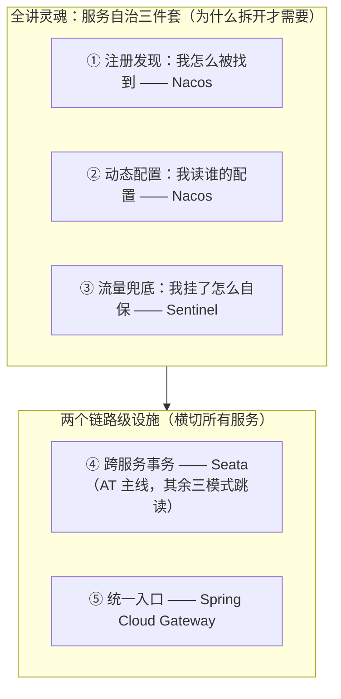
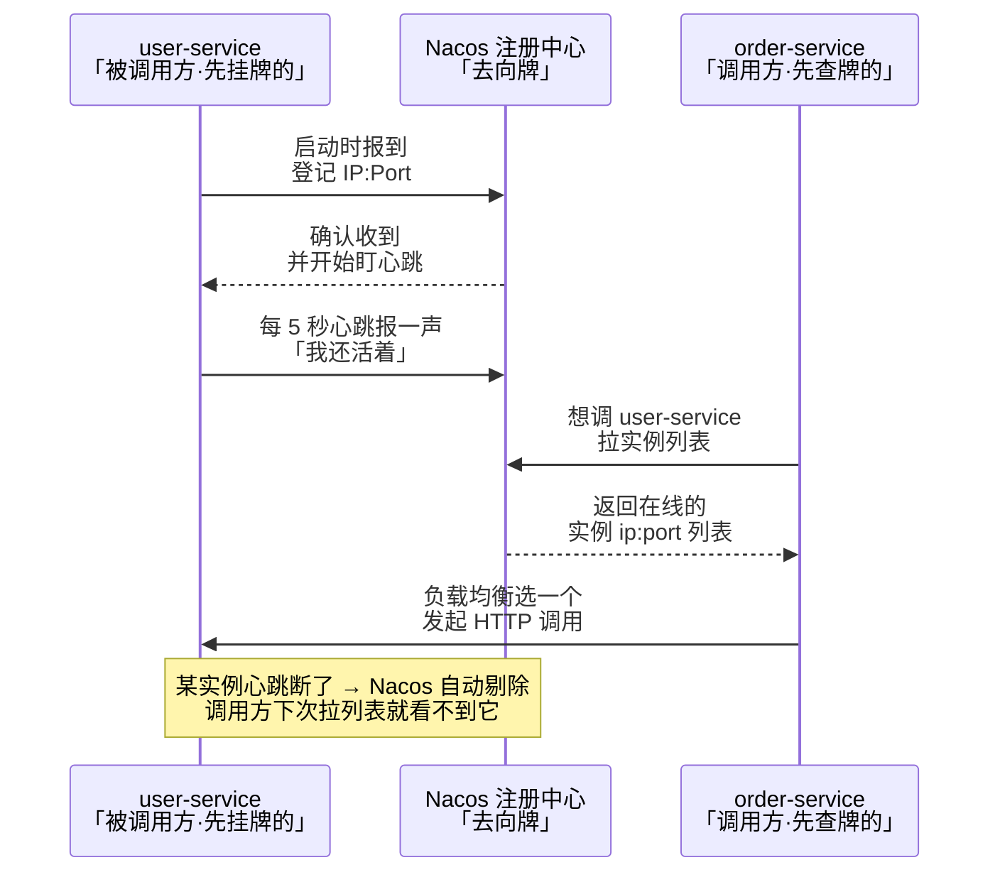
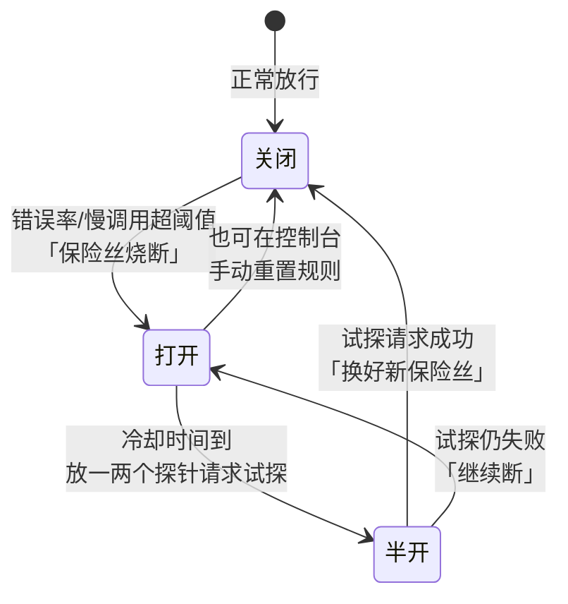
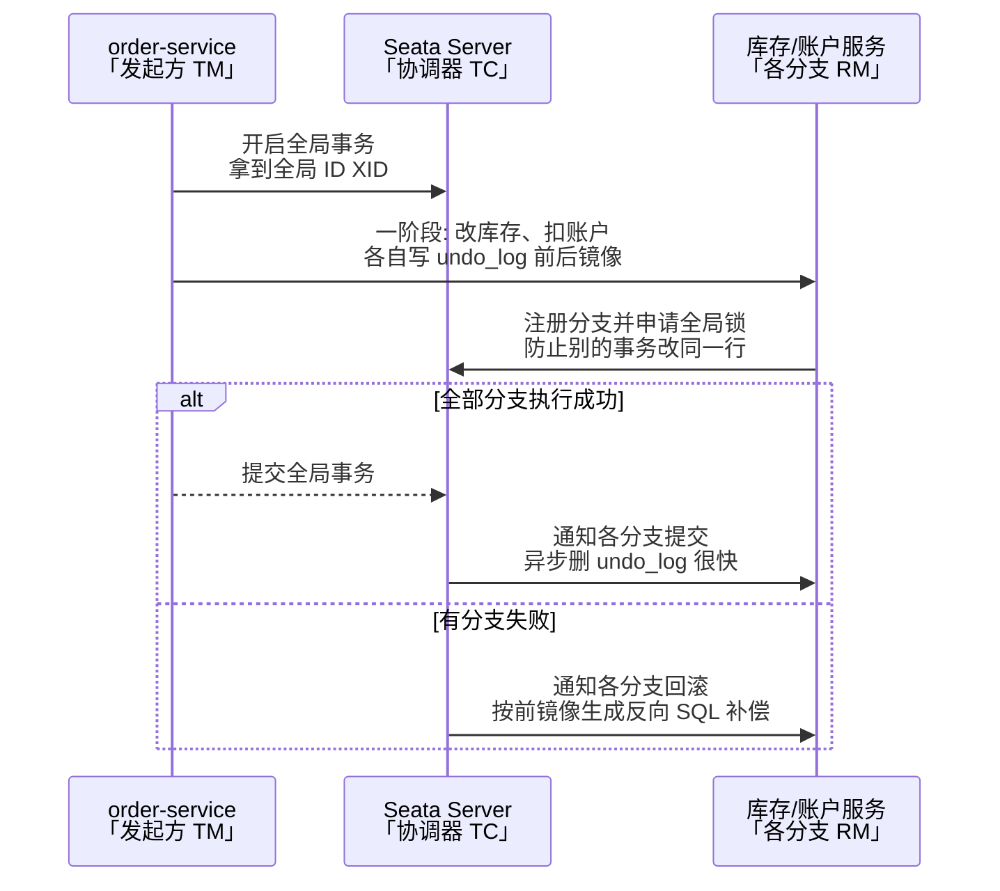
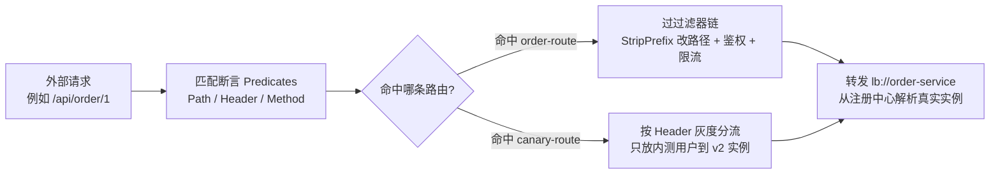

# 阶段四 · 小点 2：Spring Cloud Alibaba（Nacos / Sentinel / Seata / Gateway）

> 所属：阶段四 微服务架构与分布式系统
> 定位：国内企业主流的微服务治理全家桶。拆成微服务后，「找到彼此」「读配置」「扛流量」成了每个服务自己的事（服务自治三件套），再加上两个链路级设施（统一入口、跨服务事务）——本讲把四个组件各管什么讲透，以最小可用的配置 + 代码建立手感。

> **版本红线**：Spring Cloud Alibaba / Seata / Spring Cloud / Boot 四者版本强耦合，动手前先对官方兼容矩阵；Seata 当前主线 2.x、存量项目多 1.x，undo_log 等表结构以所用版本的官方 DDL 为准——照抄博客配置前先核版本。

## 快速入门

> 本节为「微服务治理速览」：先认识四个组件各管什么、解决什么问题、一段代码长什么样；「服务自治三件套」的推演、Seata 四种模式、限流算法、AP/CP 取舍留在正文。

### 本讲在解决什么问题

- **问题**：拆成微服务后，服务怎么互相发现（Nacos）、配置怎么统一管理（Nacos）、流量太猛怎么限流熔断（Sentinel）、跨服务事务怎么保证（Seata）、所有请求怎么统一入口（Gateway）。
- **难点不在「记住组件名」**：四个组件容易「背了名字不会选」。真正的难点是「为什么拆开后就需要它们了」——单体里这些事进程内天然解决，拆开后变成每个服务自己的事。本讲先立住这个心智，再看每个组件怎么干。
- **你要带走的一句话**：拆开后的服务自治三件套——**注册发现**（我怎么被找到）、**动态配置**（我读谁的配置）、**流量兜底**（我挂了怎么保护自己），由 Nacos 和 Sentinel 各管一段；再加上两个链路级设施——**统一入口**（Gateway）与**跨服务事务**（Seata），就是本讲全家桶的全貌。

### 本讲关键词速查

| 关键词 | 一句话大白话 | 最易踩的坑 |
|-|-|-|
| Nacos | 服务注册 + 配置（一体化） | 命名空间 / 分组配串，两边互相找不到 |
| Sentinel | 流量兜底（限流、熔断） | 规则默认存内存，重启丢——生产要接 Nacos 持久化 |
| Seata | 分布式事务 | AT/TCC/SAGA/XA 四种模式选错复杂度高；事务组配不一致加不进事务 |
| Gateway | 网关（统一入口） | 是 WebFlux 栈（响应式、事件驱动），过滤器里**禁止阻塞调用** |
| 注册中心 | 服务互相发现（服务名 → 地址表） | 临时实例 AP / 持久实例 CP 可切换；版本强耦合 |
| 服务自治 | 拆开后每个服务自己解决的事 | 把「自治」误当成「每个服务自己造轮子」 |
| QPS | 每秒请求数（限流的计量单位） | 阈值拍脑袋——要按 RT 预算反推（阶段四第 5 讲） |
| 命名空间 / 分组 | 多环境 / 多业务线的两级隔离 | 服务注册在 dev、调用方查 prod，找不到实例 |
| 服务雪崩 | 一个服务变慢 → 连锁拖垮一片 | 不配熔断，故障从单点滚成全站 |
| undo_log | Seata 回滚日志（前后镜像） | 表结构以官方 DDL 为准，别凭记忆建表 |
| 灰度发布 | 流量渐进切新版本 | 灰度路由要放通用路由**之前**，否则永远不生效 |

### 最简示例：Sentinel 限流长什么样

```java
// Sentinel 限流: 给一个方法加流控保护
@RestController
public class OrderController {

    @GetMapping("/seckill/{skuId}")
    @SentinelResource(value = "seckill", blockHandler = "seckillBlocked")   // 限流保护
    public String seckill(@PathVariable String skuId) {
        return "抢购成功:" + skuId;
    }

    // 兜底: 被限流时执行(签名 = 原方法参数 + BlockException 末尾)
    public String seckillBlocked(String skuId, BlockException e) {
        return "排队中, 请稍后重试";
    }
}
```

> 代码备注（逐行解释）：
> - `@SentinelResource(value="seckill", blockHandler="seckillBlocked")`：给 `seckill` 方法加 Sentinel 流控保护——Sentinel 把这个方法标记为「资源」，规则（阈值、统计窗口）由控制台 / 代码配好后作用在它身上。
> - 触发限流时，不执行原方法，而是调用 `seckillBlocked` 兜底返回「排队中」——超过阈值不崩，而是优雅返回，这就是「流量兜底」。
> - `blockHandler` 方法签名要求：**原方法参数 + 末尾加 `BlockException`**，返回值类型一致——参数对不上会在触发时直接报错。
> - 这是教学示意，只展示「长什么样」：怎么配规则、怎么启动（依赖 + 控制台 + 规则来源）见正文第 3 节，规则怎么持久化见 3.5。

### 常用约定（先立规矩）

- **版本先对矩阵**：SCA / Seata / Spring Cloud / Boot 四者强耦合——动手前先查官方兼容矩阵，别照抄博客。
- **组件各管一段，别串门**：Nacos 管「找到彼此 + 读配置」、Sentinel 管「流量兜底」、Seata 管「跨服务事务」、Gateway 管「统一入口」——正文每一节就是其中一个组件的主场。
- **可靠性纪律是第 5 讲的地盘**：超时、重试、幂等、Outbox 的完整纪律在阶段四第 5 讲展开，本讲只在这些组件用到时点到即止并回指，不抢主场。
- **能单体先单体**：boot-server 的 user-service 目前是单体，所以它没有 Nacos、没有网关——不是没学，是「拆开才需要」（第 1 节展开）。别为了「上全家桶」而拆服务。

## 精简大纲

**本讲知识地图**——先立住全讲灵魂（为什么拆开需要自治三件套），再逐个组件看「各管一段」：



1. 服务自治三件套：注册发现 / 配置 / 熔断（主线 · 全讲灵魂）
2. Nacos：注册中心 + 配置中心（主线）
3. Sentinel：流控 / 熔断 / 热点限流 / 系统保护 / 规则持久化（主线）
4. Seata：AT 模式深挖；TCC / SAGA / XA 认识与选型（AT 主线，其余 ⏸️ 跳读）
5. Spring Cloud Gateway：路由断言 / 全局鉴权 / 灰度发布（主线）

## 学习内容详情

### 1. 服务自治三件套：注册发现 / 配置 / 熔断（全讲灵魂）

**这一节是全讲的灵魂**：四个组件为什么是这四个、各管什么，答案都从这里长出来。先把「拆开后的服务缺了什么」推演清楚，后面每节就是对症下药。

**先看单体里这三件事为什么不用管**——一个单体服务（如 boot-server 的 user-service）内部：

```text
调用另一个业务：直接 new / 注入 Bean —— 进程内调用，天然知道对方在哪
读配置：读本地 application.yml —— 改完重启生效
自己挂了：整个进程一起挂 —— 不存在「别人还活着、我还得防它」的问题
```

**拆成微服务后，同一件事变成什么样**——每个服务都是独立进程，三件事全部失守：

- **找同伴**：order-service 要调 user-service，不知道它的 IP——写死 IP 的话，扩容、缩容、故障迁移都要改配置。→ 需要**注册发现**：服务启动登记「我在哪」、调用方查「它在哪」。
- **改配置**：一个配置要改，N 个实例要改 N 份、重启 N 次——改漏一个就出现「同一套代码、不同配置」的幽灵 Bug。→ 需要**配置中心**：配置集中存放、动态推送，改一次全部生效。
- **保自己**：一个下游变慢，占住自己的线程不还——雪崩从这里开始。→ 需要**流量兜底**：限流挡住超额流量、熔断在故障时快速失败（雪崩推演在 3.1）。

**这三件套就是本讲的主角**：Nacos 管前两件（注册发现 + 动态配置），Sentinel 管第三件（流量兜底）。另外两个组件不在三件套里，它们是**链路级设施**——不是每个服务自己的事，而是横切整条调用链：**Gateway** 管所有请求的统一入口（第 5 节），**Seata** 管跨服务的全局事务（第 4 节）。

> **前端对照**：这就是**微前端**拆开后的同款账单——拆成多个微应用后，「路由怎么收敛到入口」（≈ Gateway）、「登录态 / 公共配置放哪」（≈ 配置中心）、「公共组件加载失败怎么兜底」（≈ 熔断）都要自己解决；单体页面时代这些问题根本不存在。拆与不拆的权衡，前后端是同一道题。

> **能单体先单体（锚点）**：boot-server 的 user-service 目前是单体——所以它的代码里没有 Nacos、没有网关。这不是「没学」，是**拆开才需要**：单体里进程内调用天然解决三件套。这也呼应阶段四第 1 讲的结论——先单体跑通业务、按信号再拆。

### 2. Nacos：注册中心 + 配置中心

- **Nacos**：一个组件同时干注册中心（Service Registry & Discovery——服务地址登记与发现）与配置中心（Configuration Center——配置集中管理与动态推送）两件事——对比 Eureka（曾经的 Netflix 注册中心标准件）+ Spring Cloud Config 的组合，运维面小一半。

#### 2.1 注册发现：服务上线即登记

**生活版**：公司前台有块「员工去向牌」，每个员工到岗就把名牌挂上、离岗取下；你要找人时先看牌子，就知道该打哪个电话、人还在不在——牌子与真人脱节（人走了牌没摘）会被行政纠正。

**换回技术**：这就是服务发现——服务启动时「挂牌」注册、调用方「查牌」拿实例列表、实例失联（心跳断了）自动「摘牌」剔除。Nacos 就是那块「去向牌」，`lb://` 前缀相当于「先查牌、再拨号」。



**一个实例的完整生命周期**（面试要能按顺序背出）：

1. **上线注册**：服务启动时向 Nacos 报到，登记服务名 + IP:Port。
2. **心跳续约**：默认每 5 秒发一次心跳——「我还活着」（默认值以所用版本为准）。
3. **不健康 → 剔除**：约 15 秒没收到心跳先标记不健康、约 30 秒没收到就剔除实例——对应生活版里「人走了牌没摘，行政纠正」。
4. **摘除生效**：调用方下次拉列表就看不到它，负载均衡自动绕开。

> **前端对照**：这就是后端的 **DNS**——浏览器输入 `www.shop.com`，DNS 把域名翻成 IP，所以你写代码不用记 IP；服务调用同理：写死 `192.168.1.10:8080` 的代码，扩容 / 迁移就得改代码，用服务名 + 注册中心，地址怎么变都行。**域名是给前端用的「服务名」，服务名是给后端用的「域名」。**

```yaml
# order-service 的 application.yml
spring:
  application:
    name: order-service        # 服务名 = 其他服务调用时用的「域名」
  cloud:
    nacos:
      discovery:
        server-addr: nacos.example.com:8848
        namespace: dev         # 环境隔离: dev 空间看不到 prod 的实例
```

```java
// 调用方不用写 IP: 从注册中心拿实例列表 + 客户端负载均衡
// pom 引入 spring-cloud-starter-loadbalancer 后, 直接用服务名发起 HTTP 调用
@RestController
class OrderController {
    private final RestClient restClient;   // Boot 3.2+ 的 HTTP 客户端

    OrderController(RestClient.Builder builder) {
        // lb:// 前缀 = 走负载均衡器解析, "user-service" 被翻译成某个真实实例的 ip:port
        // ⚠️ 注意: 这个 Builder 必须是 @LoadBalanced 修饰的 Bean 才能让 lb:// 生效, 否则只会当普通 URL 处理
        this.restClient = builder.baseUrl("lb://user-service").build();
    }

    @GetMapping("/order/{id}/user")
    String orderUser(@PathVariable Long id) {
        // 每次调用都会在多个 user-service 实例间轮询 —— 一个实例挂了, 列表自动剔除
        return restClient.get().uri("/user/" + id).retrieve().body(String.class);
    }
}
```

**AP / CP 模式切换**（一致性取舍的地基在阶段四第 3 讲的 CAP 定理）：注册中心支持两种实例类型，对应两种一致性取向——

- **临时实例**（默认）走 **AP**（Distro 协议：Nacos 自研的异步复制协议）：节点间异步同步，网络分区时宁可返回过期地址也要可用——「查到过期地址」比「查不到服务」危害小；下线靠心跳超时自动剔除。
- **持久实例**走 **CP**（Raft 多数派共识算法，阶段四第 3 讲第 4 节）：强一致、不丢数据，代价是少数派节点不可写；下线靠客户端显式注销。
- **配置数据与实例类型无关**：配置中心的数据存储走 Nacos 自己的 Raft 集群，天然强一致。「配置不能丢」是配置中心的要求（CP），「注册表可短暂过期」是注册中心的要求（AP）——Nacos 一个组件两头都满足，是它的核心卖点。
- 一句话选型：**注册中心要 AP、配置要 CP**；互联网服务默认临时实例（AP），按场景选，别一刀切。

#### 2.2 配置动态刷新：长轮询

**生活版**：你问食堂「今天有没有红烧肉」，师傅不直接说没有，而是让你在窗口**等着**，红烧肉一出锅就立刻喊你——这比「你每隔 1 分钟跑来问一次」（纯拉取）更及时，也比「师傅同时盯着每个窗口的客人」（纯推送）省力得多。

**换回技术**：这就是长轮询——HTTP 请求「挂 30 秒」模拟出推送效果，改配置后 30s 内感知、秒级生效。

- **长轮询（long polling）**：客户端发起请求后，服务端「挂着不答」（默认 30s）——配置一变立刻返回通知，客户端再拉新配置。这是「推」与「拉」的平衡点。
- **为什么不用纯推送**：服务端要为每个客户端维护长连接，连接数随实例数线性膨胀、断线恢复也难。
- **为什么不用纯拉取**：做不到秒级生效。
- **长轮询的精髓**：连接用完即断、实现简单，配变更在 30s 内感知。**代价**：每个客户端至多一个挂起连接，对实例数可控的系统完全够用。

> **前端对照**：长轮询你在前端也写过——老式聊天室 / 通知栏用「请求挂着、有变化再返回」模拟实时，就是长轮询；你更熟悉的 setInterval 轮询是「纯拉取」，WebSocket 是「纯推送」——Nacos 选了中间态：实现最简单还够实时。

```yaml
spring:
  config:
    import: nacos:order-service.yaml     # 从 Nacos 拉取配置(优先级高于本地 application.yml)
  cloud:
    nacos:
      config:
        server-addr: nacos.example.com:8848
        file-extension: yaml
```

```java
@RestController
@RefreshScope        // 配置变更时, 这个 Bean 会被销毁重建以注入新值 —— 没它改了也不生效
class BannerController {
    @Value("${banner.text:默认横幅}")    // :后面是兜底值, 配置中心没有也不启动失败
    private String bannerText;

    @GetMapping("/banner")
    String banner() { return bannerText; }  // Nacos 控制台改 banner.text → 秒级生效, 无需重启
}
```


#### 2.3 命名空间与分组：环境隔离的两个旋钮

**命名空间（namespace）**：环境隔离——dev / staging / prod 各一个 namespace，互不可见：服务注册进 dev 空间，prod 的调用方查不到它。**分组（group）**：同一环境内再按业务线 / 团队隔离——同是 dev，A 业务线和 B 业务线各用一组，避免同名配置互相覆盖。

**默认值**：不配时都在 public 命名空间 + DEFAULT_GROUP——新手最常见的「两边都配了却互相找不到」，九成是 namespace 配串了（服务注册进 dev、调用方查 prod）。

> **前端对照**：命名空间 ≈ 你的 `.env.development` / `.env.production`（环境级隔离）；分组 ≈ monorepo 里包名的 scope（`@shop/order`、`@shop/pay` 同名不打架）。前端把「环境」和「业务域」分开管，Nacos 也这样。

| 旋钮 | 隔离的是 | 典型用法 | 不配时 |
|-|-|-|-|
| 命名空间 namespace | 环境 | dev / staging / prod 各一套 | 全在 public |
| 分组 group | 同一环境内的业务线 | A 业务线一组、B 业务线一组 | 全在 DEFAULT_GROUP |

#### 2.4 注册中心 vs 配置中心：一职两岗的分工

Nacos 一体两职，容易把两个角色混着说——分工一张表说清（面试常被追问的点）：

| 维度 | 注册中心（Service Registry） | 配置中心（Config Center） |
|-|-|-|
| 管什么 | 服务名 → IP:Port 列表的登记簿 | key → value 的配置项 |
| 谁用 | 服务与调用方（服务发现） | 服务与运维（统一改配置） |
| 数据特征 | 高频变化、可短暂过期（实例上下线） | 低频变化、不能丢（配置错了全链路错） |
| 一致性取向 | AP（查到过期地址比查不到好） | CP（数据强一致） |
| 类比 | DNS / 电话簿 | .env 文件 / 环境变量表 |

> 一句话分工：**注册中心回答「它在哪」，配置中心回答「它该听谁的」**——一个管地址、一个管参数，Nacos 把两者放进同一套控制台和 SDK。

### 3. Sentinel：流量兜底

- **Sentinel**：阿里开源的流量防卫兵（流量兜底工具），能挡四类异常情况：
  - **流控**：挡超额流量——**QPS**（Queries Per Second，每秒请求数）超过阈值就拒绝新请求，保护自己不被大促打垮。
  - **熔断降级**（Circuit Breaking & Degradation）：故障隔离——下游已挂就别再打，快速失败腾出线程。
  - **热点限流**：对参数值精准限流，如只对某个 skuId 单独限。
  - **系统自适应保护**：整体兜底——把系统整体负载当做一个资源，Load / CPU 过高就全局限流，防止「限了单个接口但整体还是被打垮」。

#### 3.1 从雪崩说起：熔断为什么重要

> **生活版——熔断为什么重要**：家里总闸的保险丝，电流一超大就自己烧断，宁可这屋断电，也别把全楼电路烧了。等故障排除，换根新保险丝重新通电。

**雪崩（服务雪崩）是什么——推演一遍**：服务 A 调下游 B，B 变慢（一次请求从 50ms 变成 5s）。A 的线程池（Tomcat 默认约 200 个线程）里，每个线程都堵在等 B 的响应上：

```text
B 变慢 → A 的 200 个线程全被占用 → 新请求进不来、排队等待 → 排队的请求等更久
→ 用户刷新重试 → 请求更多 → A 的线程池被打满 → A 也跟着变慢
→ 调用 A 的上游 C 也被拖慢 → 连锁反应，故障从单个服务滚成全站 —— 这就是雪崩
```

**雪崩的起点是「线程被占着不放」，不是「B 挂了」**——B 还活着，只是慢。**熔断**就是在这个出口装一个开关：连续失败 / 慢调用超过阈值就「断开」（快速失败、不再空耗线程），给 B 喘息时间；过一会儿「试探性放少量请求」，好了就恢复、没好继续断（触发推演见 3.4）。

**三个易混词先立住**（面试高频，正文与面试题同一套口径）：

- **限流**：挡超额流量——QPS 或并发数超阈值就拒绝新请求，保护自己不被打垮（防的是「来太多」）。
- **熔断**：下游故障时快速失败——错误率 / 慢调用率超阈值就打开开关，一段时间内不再调用下游，让它喘息（防的是「下游不行了」）。
- **降级**：系统压力大时主动舍弃非核心功能——大促时把「积分明细」降级成「稍后可见」，保住下单主链路（防的是「资源不够，保主干」）。
- 口诀：**限流防自己被打垮，熔断防被下游拖垮，降级是主动取舍**——三者常组合出现，但管的事不同。

#### 3.2 资源定义与兜底处理（blockHandler）

```java
import com.alibaba.csp.sentinel.annotation.SentinelResource;
import com.alibaba.csp.sentinel.slots.block.BlockException;

@RestController
class SeckillController {
    // @SentinelResource 把这个方法标记为"资源", Sentinel 的规则(控制台配)作用在它身上
    @GetMapping("/seckill/{skuId}")
    @SentinelResource(value = "seckill", blockHandler = "seckillBlocked")
    String seckill(@PathVariable String skuId) {
        return doSeckill(skuId);           // 正常业务逻辑
    }

    // blockHandler: 被流控/熔断拦下时走这里 —— 兜底而不是把异常抛给用户
    public String seckillBlocked(String skuId, BlockException e) {
        return "当前抢购人数过多, 请稍后再试";   // 有损服务的标准姿势: 明确提示, 不报 500
    }
}
```

- **blockHandler 签名要求**：方法签名 = 原方法参数 + 末尾追加 `BlockException`，返回值类型与原方法一致——参数对不上会在触发时直接抛异常，这是最常见的手滑。

#### 3.3 四种限流算法（Sentinel 的底层武器）

先推演「为什么默认不是固定窗口」——**临界突刺**：

```text
固定窗口：每 1 秒一个计数器，阈值 100 QPS
0.0s~1.0s 的窗口①放满 100 个（0.9s 时已满，之后的请求被拒）
1.0s 整切到窗口②，计数器归零 —— 又能放 100 个
→ 0.9s~1.1s 这 0.2 秒里实际放进约 200 个请求 —— 窗口交界处突破阈值的 2 倍
滑动窗口：把 1 秒切成 N 个格子滚动统计 —— 交界处的流量被前后两个窗口共同统计，突刺被摊平
格子越多越精确，代价是内存与计算越重（N 倍计数开销）
```

| 算法 | 原理 | 优点 | 缺点 |
|-|-|-|-|
| 固定窗口 | 每 N 秒一个计数器 | 实现最简单 | **临界突刺**：窗口交界处可放进 2 倍流量 |
| 滑动窗口 | 窗口切成小格子滚动统计 | 消除临界突刺（Sentinel 默认） | 内存与计算略重 |
| 令牌桶 | 匀速发令牌，桶满丢弃 | **允许突发**（攒的令牌一次用完），网关常用 | 需要稳定的发令牌时钟 |
| 漏桶 | 恒定速率流出 | 输出绝对匀速，保护脆弱下游 | 无法应对合理突发 |

> 选型口诀：**网关挡总量用令牌桶，业务资源保护用滑动窗口，保护第三方脆弱接口用漏桶**。四算法的完整对比在阶段六高可用（03 讲）还会从 SLO（Service Level Objective，服务等级目标）视角再过一遍。

#### 3.4 熔断的触发推演：阈值从哪来、半开怎么试

**触发推演**（不是背状态机，是推导它为什么这样设计）：

```text
连续失败 / 慢调用达到阈值 →「跳闸」：一段时间内直接拒绝请求、快速失败，不再打向下游
→ 问题：跳闸时间到了，下游好了吗？不知道 —— 直接恢复放全量，可能再次被打崩
→ 于是加「半开」状态：跳闸冷却结束后只放 1 个试探请求（探针）
   → 试探成功 → 恢复全量放行；试探失败 → 继续跳闸（冷却时间重新计）
→ 恢复不是「到点就开」，而是「试过才开」——这就是「半开」存在的理由
```



**阈值怎么定——不是拍脑袋**：错误率 / 慢调用 RT（Response Time，响应时间）的阈值，来自你的 **RT 预算**——调用链每一层能花多少时间（网关 5s → A 调 B 3s → …），「慢」的定义 = 超过预算给这一层的配额。Sentinel 还要求统计周期内请求数达到最小请求数（默认 5 个）才开始判定，避免零星抖动就误触发。RT 预算的完整推演在阶段四第 5 讲。

**与重试的分工**：重试治「偶发失败」（值得一试），熔断治「持续故障」（别再试了）——完整版在阶段四第 5 讲 2.5。

**对比 Resilience4j**（节末横向对比）：Spring Cloud 官方推荐的 Resilience4j 更轻、函数式、无控制台依赖；Sentinel 强在**控制台可视化规则**与**热点参数限流**——国内业务治理用 Sentinel，轻量内嵌用 Resilience4j。

#### 3.5 规则持久化：为什么默认内存、生产怎么接

**为什么默认存内存**：Sentinel 的规则默认存在内存里（控制台配置后下发到客户端内存）——单机演示零成本、控制台改规则秒级生效。**代价**：规则跟着进程走——重启即丢、多实例各自一套内存规则。

**生产必须接持久化——在什么条件下**：只要你有**多个实例**、或**发布频率高**，内存规则就是隐患：发布一次，限流规则跟着旧进程一起消失，新进程裸奔上线——大促限流没了，等于没上 Sentinel。**标准做法**：把规则存进 Nacos（Sentinel 的数据源接 Nacos 配置，即「推模式」：Nacos 配置一变，Sentinel 客户端收到推送立即生效；具体数据源配置以官方文档为准）——规则与代码一起走配置中心，改规则不改代码、发布不丢规则。

**为什么不默认就接**：多一个依赖、多一条配置。教学 / 单机演示先内存，生产上多实例时再上持久化——**先学会跑，再学会接**。

> 注意「规则持久化」和「配置持久化」是两件事：Sentinel 的**规则**存进 Nacos（本节），Nacos 自己的**配置数据**存在 Nacos 服务端（2.4 的 CP 部分）——别混。

### 4. Seata：跨服务事务

- **Seata**：分布式事务协调框架。三个角色——**TC（Transaction Coordinator，事务协调器）**：独立部署的协调进程；**TM（Transaction Manager，事务管理器）**：发起全局事务的一端；**RM（Resource Manager，资源管理器）**：各参与服务的数据库代理。记忆线：**TM 发起、TC 协调、RM 干活**。

#### 4.1 先认识四种模式：机制与代价

先纵向把四个模式各自认识清楚（机制是什么、代价是什么），4.4 再横向谈怎么选：

| 模式 | 机制 | 侵入性 | 适用 |
|-|-|-|-|
| **AT**（默认） | 代理数据源自动记录 undo_log，回滚时反向补偿 | **零侵入** | 大部分短事务 |
| **TCC** | 业务手写 Try（预留）/ Confirm（提交）/ Cancel（释放） | 高（每接口三方法） | 精细控制资源预留（金融扣款） |
| **SAGA** | 长流程编排，每个正向步骤配一个补偿 | 中 | 长事务、跨企业调用 |
| **XA** | 数据库原生两阶段提交（2PC，Two-Phase Commit） | 低 | 强一致要求、并发低 |

> ⏸️ **短期可以不学**：XA 模式——它靠数据库原生两阶段提交保强一致，代价是全程持有数据库锁、并发极低，工程里实际使用率很低，Seata 的 XA 方案也不推荐优先考虑。**何时回来学**：业务真要求数据库级强一致短事务、又接受低并发时。**面试最低要求**：知道 XA 是「数据库原生 2PC」、Seata 只做协调方，以及它为什么并发低。
>
> ⏸️ **短期可以不学**：TCC 的手写实现（每个接口拆 Try/Confirm/Cancel 三方法）——侵入性高、心智负担重，没有资金级资源预留需求时用不上。**何时回来学**：要处理「热点行扣减、SQL 无法自动回滚」这类 AT 覆盖不了的资金场景时。**面试最低要求**：说出 TCC 三阶段机制（预留/确认/释放）与适用场景，能放进方案对比里选型即可。

**配置红线（先立规矩）**：同一业务链路的所有服务，`tx-service-group` 必须配同一个组名、`vgroup-mapping` 指向同一个 TC 集群——配串了下游服务加入不了全局事务，回滚时它纹丝不动（坑点段有完整症状）。

#### 4.2 AT 模式实战

```yaml
# order-service 的 application.yml
seata:
  enabled: true
  application-id: order-service
  tx-service-group: shop_tx_group     # 事务组: 同一业务链路的服务配同一个组名
  service:
    vgroup-mapping:
      shop_tx_group: default          # 组 → TC 集群的映射
  # AT 模式下每个参与库都要建 undo_log 表(见下方 DDL)
```

```sql
-- 每个参与 AT 事务的数据库都需要这张表: 一阶段执行 SQL 时同步写入前后镜像(官方结构)
CREATE TABLE undo_log (
    id            BIGINT       NOT NULL AUTO_INCREMENT,   -- 自增主键
    branch_id     BIGINT       NOT NULL,                  -- 分支事务 ID
    xid           VARCHAR(100) NOT NULL,                  -- 全局事务 ID(由发起方生成, 跨服务透传)
    context       VARCHAR(128) NOT NULL,                  -- 回滚上下文(如序列化器)
    rollback_info LONGBLOB     NOT NULL,                  -- 前后镜像: 回滚时按它生成反向 SQL
    log_status    INT          NOT NULL,                  -- 0 正常 1 全局已完成
    log_created   DATETIME(6),                            -- 创建时间
    log_modified  DATETIME(6),                            -- 修改时间
    PRIMARY KEY (id),
    UNIQUE KEY ux_undo_log (xid, branch_id)               -- 唯一键: 一事务分支一条
);
```
> **注意**：`undo_log` 表结构以 Seata 官方为准（`id` 自增主键 + `UNIQUE(xid, branch_id)`，并含 `context`/`log_created`/`log_modified` 列）；别凭记忆建表。

```java
@Service
class OrderService {
    // @GlobalTransactional: 开启全局事务 —— 跨服务的 @Transactional
    // 下游服务(库存/账户)通过 XID 透传自动加入同一全局事务
    @GlobalTransactional(rollbackFor = Exception.class)
    public void placeOrder(Long skuId, int count) {
        orderMapper.insert(buildOrder(skuId, count));      // 本地事务①: 订单库
        inventoryClient.deduct(skuId, count);              // 远程调用②: 库存服务(也是分支事务)
        accountClient.charge(currentUserId(), price(count)); // 远程调用③: 账户服务
        // 任何一步抛异常 → TC 通知所有分支按 undo_log 反向补偿回滚
    }
}
```

#### 4.3 AT 的原理与边界（面试高频）



> **生活版——回滚像「撤销记账」**：Excel 里改账目前先按 Ctrl+Z 前存一份快照，后面算错了按快照把数改回去。AT 的 undo_log 就是这份「可撤销的快照」。
>
> **换回技术**：一阶段写前后镜像 = 记快照；二阶段失败时按前镜像生成反向 SQL = 执行撤销。

- **一阶段**：代理数据源拦截业务 SQL → 解析出「前镜像 / 后镜像」写入 undo_log → 执行 SQL → **注册分支到 TC 并申请全局锁** → 本地事务提交。
- **二阶段**：全局提交 → 异步删 undo_log（很快）；全局回滚 → 按前镜像生成反向 SQL 补偿 + 校验后镜像（防别人改过，校验失败告警人工处理）。
- **为什么一阶段就要申请全局锁——推演**：

```text
两个全局事务同时扣同一个库存行:
事务A 扣 100→90（未提交）; 事务B 扣 90→80（未提交）
A 提交 → 库存 = 90; B 提交 → 库存 = 80 —— 结果正确
但若 A 回滚: A 按前镜像把库存恢复成 100 —— 覆盖了 B 的修改, B 白扣 —— 脏写!
undo_log 只能撤销「自己的变更」, 撤销不了「别人的变更」
→ 所以分支改行前必须向 TC 申请该行的全局锁: 同一行同一时刻只允许一个全局事务修改
```

- **全局锁**：分支事务修改行前要向 TC 申请该行的全局锁，防止**另一个全局事务**同时改同一行造成脏写。
- **AT 的已知边界：悬挂与超时**（思考题 1 的正文伏笔）：
  - 全局事务有默认超时（约 60 秒），超时后 TC 直接发起全局回滚——对**已注册**的分支有效。
  - 「本地事务已提交、但分支注册的确认没到 TC」（宕机 / 网络丢失）——TC 不知道这个分支存在，全局回滚时不会补偿它。这是 AT 的固有边界，靠接口幂等、对账（阶段四第 5 讲的消费幂等 / 阶段四第 3 讲的本地消息表思路）兜底。
- **AT 不适用的场景（换 TCC）**：全局锁竞争激烈的热点行（秒杀库存单行）；SQL 无法自动回滚的操作（DDL、存储过程、事务里夹外部 RPC）。

#### 4.4 怎么选：先问「是否真的需要全局事务」

**选型的起点不是四种模式，而是先问一个问题**——「这单业务真的需要跨服务强一致吗」：

```text
场景: 下单 → 扣库存
同库: 一个本地事务搞定 —— 不需要 Seata(04 讲思考题的答案伏笔: 同库多聚合, 事务天然一致)
分库分服务: 需要跨库一致
   → 要「强一致 + 短事务」→ AT(低侵入, 先试它)
   → 热点行竞争激烈 / SQL 无法自动回滚 → TCC(手写三段, 资源预留)
   → 长流程、跨团队编排 → SAGA(每步配补偿)
   → 只要最终一致、能接受延迟 → 本地消息表(阶段四第 3 讲)——成本比 Seata 低一个量级
```

**什么时候「同库」也诱惑人**（04 讲思考题 3 的另一半）：把强关联的数据故意放同一个库、用一个本地事务——确实最简单；代价是库成为单点、垂直扩展受限、锁冲突面变大（聚合边界被破坏的完整讨论在阶段四第 4 讲）。**先算清楚一致性强度的真实要求，再决定要不要把事务拆出去**。

### 5. Spring Cloud Gateway：统一入口

> **生活版**：写字楼只有一个大堂前台——所有访客都先到这报到，前台先看工牌（鉴权）、再按「约了谁」帮你转语音（路由），还能把「老熟人」直接带去新装修的楼层（灰度）。

> **换回技术**：Gateway 就是一个应用层「前台」——所有外部流量从它进，先匹配断言（约了谁）、再按顺序过过滤器链（鉴权/限流/改写），最后转发到对应服务。



- **Gateway**：基于 **WebFlux**（响应式技术栈，用少量事件循环线程处理高并发；完整纪律在阶段二第 4 讲）的 API 网关（API Gateway）——所有外部流量统一入口，做路由、鉴权、限流、灰度发布（Canary Release，流量渐进切到新版本，错了能立刻切回）。

#### 5.1 路由 = 断言 + 过滤器

```yaml
spring:
  cloud:
    gateway:
      routes:
        - id: order-route                    # 路由 ID(唯一)
          uri: lb://order-service            # lb:// = 从注册中心解析并负载均衡
          predicates:
            - Path=/api/order/**             # 断言: 什么请求匹配这条路由
          filters:
            - StripPrefix=1                  # 过滤器: 去掉路径第 1 段(/api/order/x → /order/x)
        - id: canary-route                   # 灰度路由: 按 header 把内测流量切到 v2 实例
          uri: lb://order-service-v2
          predicates:
            - Path=/api/order/**
            - Header=X-Gray, true            # 带这个 Header 的请求才走 v2
```

- **断言与过滤器的分工**（两个词一起出现容易混）：**断言**决定「这个请求走哪条路由」（匹配条件），**过滤器**决定「这条路由上做什么」（改路径、鉴权、限流）——先问「归谁管」，再问「管什么」。

#### 5.2 全局鉴权过滤器

```java
import org.springframework.cloud.gateway.filter.*;
import org.springframework.stereotype.Component;
import reactor.core.publisher.Mono;

@Component
class AuthFilter implements GlobalFilter, org.springframework.core.Ordered {
    // GlobalFilter 对所有路由生效 —— 网关统一验 token, 下游服务信任网关透传的身份头
    @Override
    public Mono<Void> filter(ServerWebExchange exchange, GatewayFilterChain chain) {
        String token = exchange.getRequest().getHeaders().getFirst("Authorization");
        if (token == null || !verifyJwt(token)) {           // 验签失败 → 401, 请求到此为止
            exchange.getResponse().setStatusCode(org.springframework.http.HttpStatus.UNAUTHORIZED);
            return exchange.getResponse().setComplete();
        }
        // 验签通过: 把解析出的用户身份塞进 Header 传给下游(下游不再重复验签)
        var mutated = exchange.mutate()
            .request(r -> r.headers(h -> h.set("X-User-Id", parseUserId(token))))
            .build();
        return chain.filter(mutated);                       // 放行到匹配的路由
    }

    @Override public int getOrder() { return -1; }          // 数字越小越先执行(要在路由转发前)
    private boolean verifyJwt(String t) { return t.startsWith("Bearer "); } // 演示用占位验签
    private String parseUserId(String t) { return "u-1001"; }
}
```

> 代码备注：
> - `Mono<Void>` 是 WebFlux 的返回值容器（响应式版「返回 void」），`chain.filter(mutated)` 表示放行到下一环——响应式里没有「return 走人」，只有「返回一个完成的信号」。
> - `JWT`（JSON Web Token）= 登录态令牌，阶段三已讲；`verifyJwt` 这里只是占位演示，生产要接真正的验签逻辑。

**信任边界**（思考题 2 的正文伏笔）：网关验完 token、把 `X-User-Id` 透传给下游的前提是——**所有流量都必经网关**。一旦服务能被内网直连（如 K8s 集群内其他 Pod 绕过网关直接调它），这个信任模型就破了：伪造 `X-User-Id` 头等于伪造身份。补法：内网流量也走网关，或服务间做双向认证（mTLS，阶段四第 5 讲服务网格节）——「内网 ≠ 免认证」。

#### 5.3 网关、注册中心、Nginx 的分工

**网关和注册中心怎么配合**（面试常问，也是 05 讲回指本讲的点）：网关配置里写的 `uri: lb://order-service` 不是 IP——`lb://` 前缀让网关在转发时向注册中心（Nacos）查「order-service 有哪些实例」，再负载均衡选一台。**注册中心是「表」，网关是「查表的人」**——服务实例上下线，网关下一次转发自动感知，不用改配置。

**与 Nginx 的分工**（各管一层，配合不替代）：

| | Nginx | Gateway |
|-|-|-|
| 层 | 流量入口的 L4/L7 转发（L4 = TCP 传输层、L7 = HTTP 应用层）、静态资源、最外层防护（基础设施） | 应用层业务处理：JWT 鉴权、灰度路由、按服务路由 |
| 数据 | 不知道业务、不读注册中心 | 能读注册中心，按服务名转发 |
| 类比 | 大楼的保安 + 快递分拣 | 前台：认人（鉴权）、带路（路由） |

## 坑点提醒

- **Nacos 命名空间配串**：服务注册进 dev、调用方查 prod——表现为「找不到服务 / 实例列表为空」，而且**不报配置错误**。排查第一步：核两边的 namespace 与 group 是否一致（2.3）。
- **Seata 事务组配串**：同一业务链路各服务的 `tx-service-group` / `vgroup-mapping` 不一致——下游服务加不进全局事务，回滚时它纹丝不动，表现为「单侧回滚」的数据不一致（4.1 配置红线）。
- **AT 的中间态可见**：一阶段本地事务已提交、全局事务尚未提交——别的请求此刻能读到这笔数据，而它可能被回滚。对中间态敏感的读（如库存查询）要加全局锁（`@GlobalLock`）或接受最终一致（4.3）。
- **`@RefreshScope` 忘加**：Nacos 配置改了但 Bean 不重建，值永远停在启动时刻——新值只对**新创建**的 Bean 生效（2.2）。
- **灰度路由的断言顺序**：具体规则（灰度）要放在通用路由**之前**，否则通用路由先匹配走，灰度永远不生效（5.1）。
- **Gateway 是 WebFlux 技术栈**：**过滤器里禁止任何阻塞调用**（JDBC / 同步 HTTP），一处阻塞全网关卡死——这呼应阶段二第 4 讲的响应式纪律（第 5 节）。

## 本节自检

- [ ] 能说出「服务自治三件套」是哪三件、为什么拆开后每个服务都需要，以及「能单体先单体」的含义（锚点：boot-server 为什么还没接 Nacos）？
- [ ] 能说清 Nacos 两个角色（注册中心 / 配置中心）的分工，以及命名空间与分组各隔离什么？
- [ ] 能画出服务注册的完整生命周期（上线注册 → 心跳 → 不健康 → 剔除 → 摘除），并解释临时实例（AP）与持久实例（CP）的选择依据？
- [ ] 能说出 Nacos 长轮询动态刷新的机制，以及为什么不用纯推送 / 纯拉取？
- [ ] 能区分熔断、限流、降级三个词，并推演雪崩是怎么从「一个下游变慢」滚成全站的？
- [ ] 能对比四种限流算法并解释固定窗口的临界突刺；能说出 Sentinel 规则为什么默认存内存、生产在什么条件下必须持久化？
- [ ] 能推演 Seata AT 模式的一阶段 → 二阶段回滚全链路（undo_log 前后镜像、全局锁、反向 SQL），并说出 AT 不适用要换 TCC 的条件？
- [ ] 能写出带鉴权与灰度路由的 Gateway 配置；能说出网关和注册中心怎么配合、与 Nginx 的分工？
- [ ] 能说出 AT 的一个已知边界（悬挂 / 中间态），并指出用什么兜底？

## 本节配套思考题

1. `@GlobalTransactional` 的回滚依赖下游分支事务注册——如果下游服务在远程调用后、注册前就宕机了，这条「悬挂」的本地事务怎么办？提示：从 TC 的全局超时回滚与 undo_log 校验想（正文 4.3 的边界段）。
2. 网关鉴权把用户身份透传给下游，下游完全信任 `X-User-Id` 头——如果有人绕过网关直接访问服务实例（K8s 内网），这个信任模型就破了。你会怎么补这个洞？（正文 5.2 的信任边界段）
3. Sentinel 的滑动窗口把 1 秒切成 2 个 500ms 格子，临界突刺真的完全消除了吗？格子数越多越精确，代价是什么？（正文 3.3 的推演）

## 常见面试题

### Q1：Nacos 注册中心的工作原理是什么？为什么它能在 AP 和 CP 之间切换？
**答**：
**标准结论**：注册中心解决「服务怎么互相发现」——服务启动时把 IP:Port 注册到 Nacos，下线时注销；调用方通过服务名从 Nacos 拉实例列表，配合客户端负载均衡（lb://）选一个实例调用，实例挂了会被剔除。

**原理层**：Nacos 分两类实例——
- 临时实例走 **AP**（Distro 协议，节点间异步同步，分区时宁可返回过期地址也要可用）——适合注册中心：「查到过期地址」比「查不到服务」危害小。
- 持久实例走 **CP**（Raft 多数派，保证强一致）——适合配置这类必须不丢的数据。

**工程层**：互联网服务默认用临时实例（AP）；选型时记住 CAP——注册中心要 AP，协调器（选举/锁）要 CP，Nacos 一个组件两头通吃是它的核心卖点。

### Q2：Sentinel 的限流、熔断、降级有什么区别？Sentinel 和 Hystrix / Resilience4j 怎么选？
**答**：
**标准结论**：三个词解决不同问题——
- **限流**：「挡超额流量」——QPS 或并发数超阈值就拒绝新请求，保护自己不被打垮。
- **熔断**：「下游故障时快速失败」——错误率/慢调用率超阈值就打开开关，一段时间内不再调用下游，让它喘息（类似家里的保险丝）。
- **降级**：「系统压力大时主动舍弃非核心功能」——比如大促时把「积分明细」降级成「稍后可见」，保住下单主链路。

**原理层**：选型要分清阵营——
- Hystrix 已停更，不要用。
- **Sentinel** 强在控制台可视化规则、热点参数限流、规则持久化，国内业务治理首选。
- **Resilience4j** 更轻、函数式、无控制台依赖，适合轻量内嵌。

**工程层**：生产上规则必须持久化到 Nacos / Apollo（Apollo = 携程开源的配置中心，Nacos 同类），否则重启即丢——前提是系统有多实例或发布频繁；单机演示先内存即可（正文 3.5）。

### Q3：Seata 的四种分布式事务模式怎么选？为什么很多场景优先选本地消息表？
**答**：
**标准结论**：四种模式按「一致性强度 vs 侵入性」排——
- **AT**：零侵入、靠 undo_log 前后镜像自动回滚，适合大部分短事务，但热点行有全局锁竞争。
- **TCC**：手写 Try/Confirm/Cancel 三方法，侵入高但能精细控制资源预留（资金扣减）。
- **SAGA**：适合长流程、每步配补偿。
- **XA**：数据库原生 2PC、强一致但并发极低。

**原理层**：AT 用「数据库代理 + 全局锁」把回滚变成自动的，本质仍是补偿思想；一阶段本地提交后到二阶段之间数据可见但未定，这是它和 XA 的关键差异（XA 全程持锁不可见）。

**工程层**：很多跨服务场景要的只是最终一致——本地消息表（业务表+消息表同库同事务+MQ 异步投递）成本比 Seata 低一个量级、不引入 TC 和全局锁。先问「是否真的需要全局事务」，再谈 Seata 选型（正文 4.4 的推演树）。

### Q4：Spring Cloud Gateway 的工作原理是什么？它和 Nginx 有什么分工？
**答**：
**标准结论**：Gateway 基于 WebFlux 响应式栈，核心模型是「路由 = 断言 + 过滤器」——请求进来，先被一组断言匹配（Path、Header、Method 等），命中后按顺序过过滤器链（StripPrefix 改写路径、鉴权、限流），最后转发到 lb:// 解析出的真实实例。

**原理层**：过滤器分两条线——
- **GatewayFilter**（路由级）与 **GlobalFilter**（全局级），用 `Order` 控制执行顺序。

**工程层**：与 Nginx 的分工——
- Nginx 在流量入口做 L4/L7 转发、静态资源、最外层防护，属于基础设施。
- Gateway 在应用层做业务相关的统一处理（JWT 鉴权、灰度路由、按服务路由），能直接读注册中心。
- **工程铁律**：Gateway 是响应式线程模型，过滤器里禁止任何阻塞调用（JDBC/同步 HTTP），否则一个阻塞就卡死全网。
