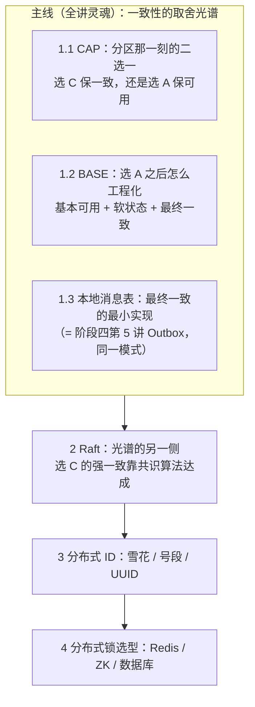
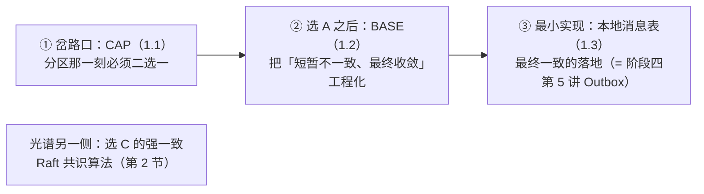
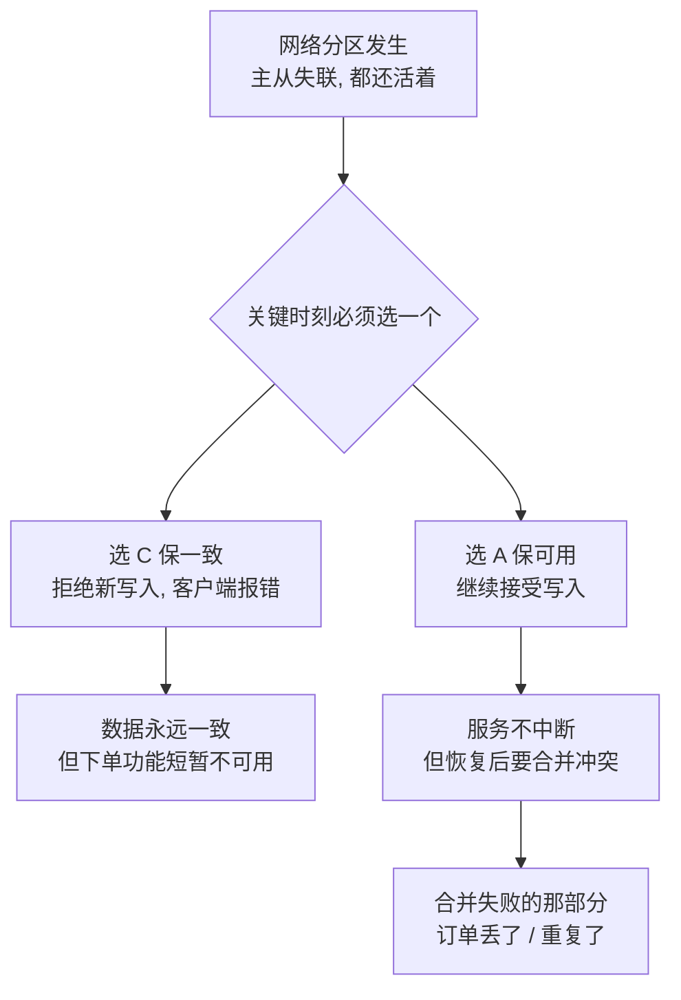
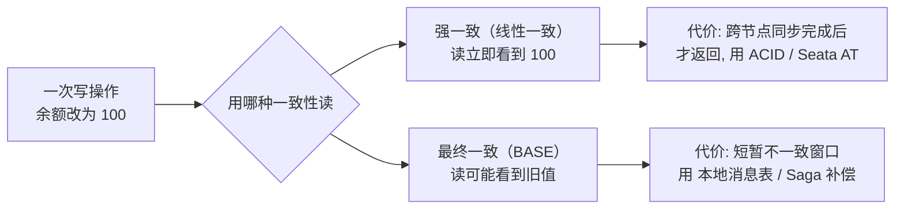
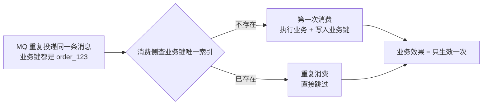
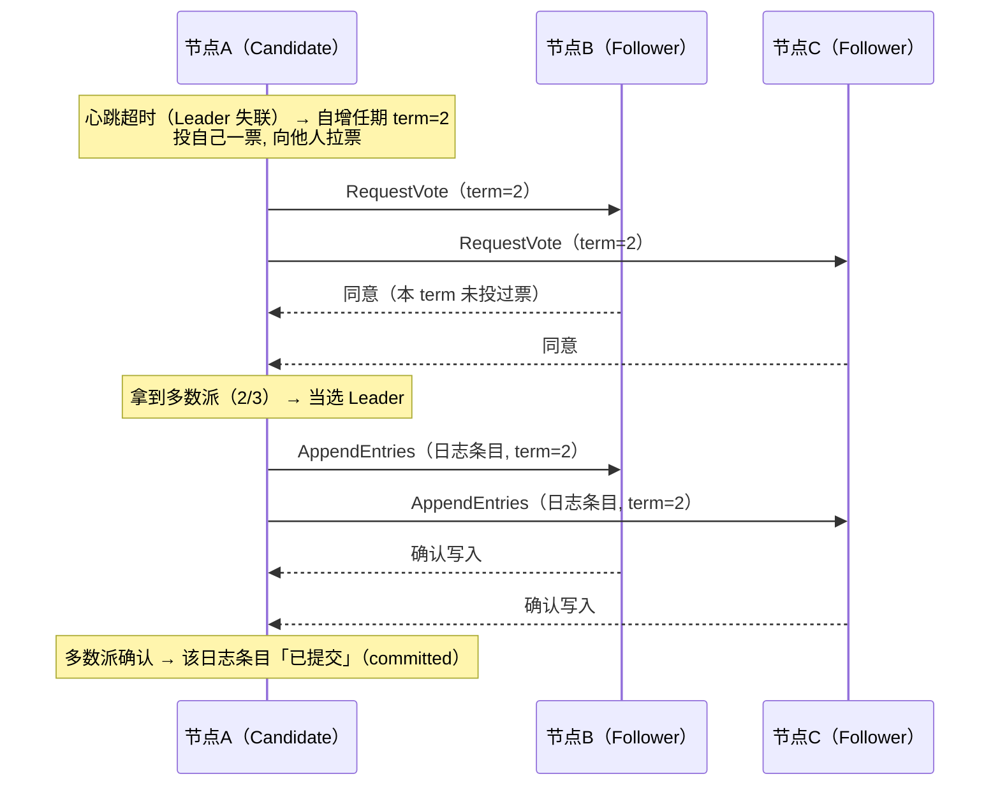
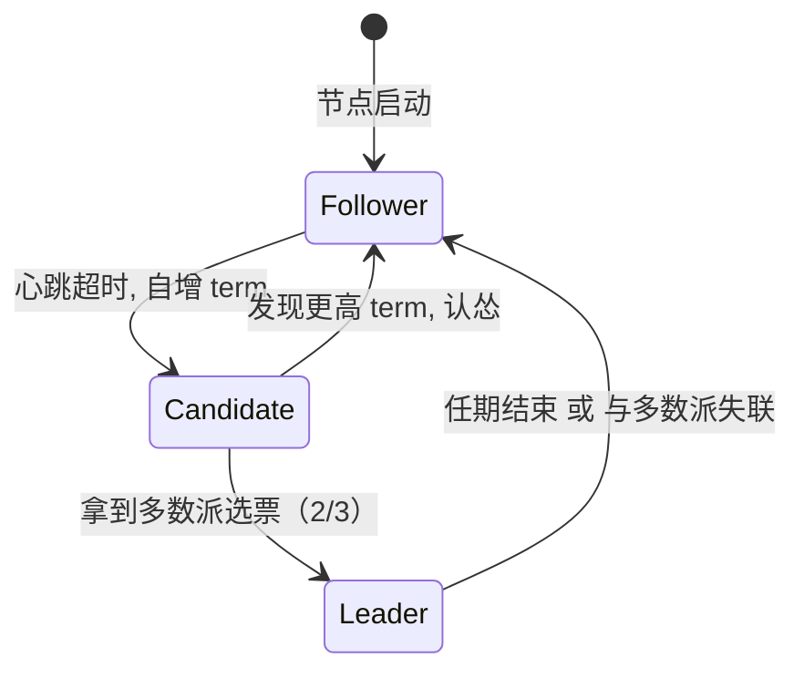
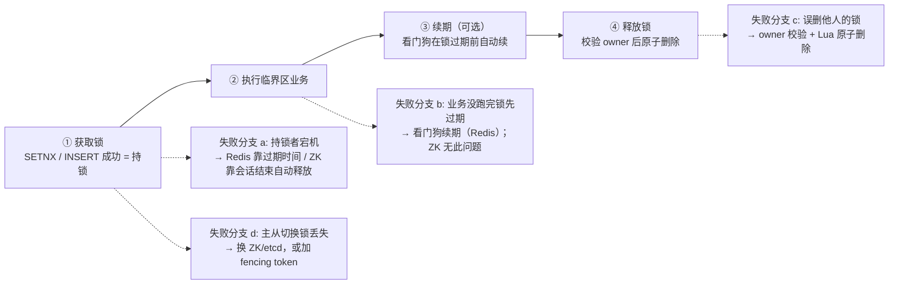
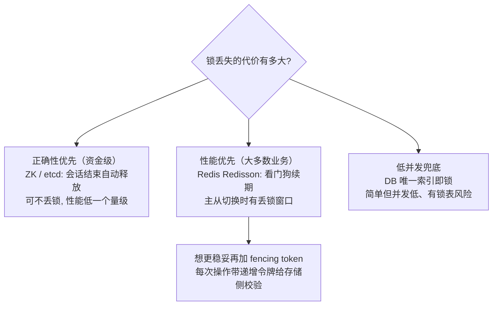

# 阶段四 · 小点 3：分布式核心理论（CAP / BASE / Raft / ID / 锁）

> 所属：阶段四 微服务架构与分布式系统
> 定位：组件会过时，理论不会。这一讲是后面所有分布式组件（注册中心 / 配置中心 / 分布式事务 / 分布式锁）选型的「为什么」。本讲以推演和代码为主——CAP 用一次「两节点脑裂」的完整推演讲透，Raft 用选举时序图讲清。

## 快速入门

> 本节为「分布式理论速览」：先认识几个高频词在说什么；「CAP 推演、Raft 选举」留在正文。

### 本讲在解决什么问题

- **问题**：分布式系统里，网络可能分区、节点可能挂。怎么选一致性、怎么生成唯一 ID、怎么加分布式锁？这些是选型背后的「为什么」。
- **你要带走的一句话**：**CAP** 是「网络分区时要在一致性和可用性之间取舍」；**BASE** 是最终一致的工程化。真实业务多用最终一致（本地消息表 / 事务消息），别迷信「强一致」。

### 本讲关键词速查

| 关键词 | 一句话大白话 | 最易踩的坑 |
|-|-|-|
| CAP | 一致性 C / 可用性 A / 分区容错 P 的取舍 | 分区必发生，只能 C 或 A 二选一 |
| BASE | 最终一致（AP 路线的工程化） | 大多数业务够用，别迷信强一致 |
| 最终一致 | 停止写入后数据收敛一致 | 和「弱一致」不是一回事（正文 1.2 展开） |
| 脑裂 | 节点失联分裂，两边各说各话 | 靠 quorum（多数派）机制防御 |
| Raft | 一致性算法（选主 + 日志复制） | etcd / Nacos(CP) / Kafka 的底座 |
| 本地消息表 | 最终一致的最小可行方案 | 比 Seata 更轻（有 MQ 就能用）；与阶段四第 5 讲 Outbox 是同一模式 |
| 分布式事务 | 跨节点保证一致（2PC / TCC / Saga / Seata AT） | 能接受不一致窗口就别上全局事务（阶段四第 2 讲） |
| 雪花算法 | 分布式唯一 ID：时间戳 + 机器 ID + 序列号 | **团队 EPOCH 必须统一**，两套必撞 |
| UUID 主键 | 128 位随机字符串 | 页分裂 + 索引体积大，别做主键 |
| 分布式锁 | 跨节点互斥 | 资金级用 ZK/etcd，普通用 Redis |

### 常用约定（先立规矩）

- **主键别用 UUID**：无序（页分裂）+ 太长（索引体积大）——用雪花算法或号段（论证在正文第 3 节；Spring Cloud Alibaba 的 ID 生成器见阶段四第 2 讲）。
- **分布式锁选型**：性能优先用 Redis（Redisson），正确性优先（资金）用 ZK/etcd 或加 fencing token（正文第 4 节）。
- **最终一致优先**：跨服务业务能用「本地消息表」就别上 Seata——成本低一个量级（正文 1.3 的选型对比表）。

### 最小示例：雪花 ID 长什么样

```java
// 雪花算法：本地生成 64 位唯一 ID，不依赖中心服务
// 64 位 = 1 位符号 + 41 位时间戳 + 10 位机器 ID + 12 位序列号
public class SnowflakeIdGenerator {
    private final long machineId = 1L;        // 机器/实例 ID（多实例各不同）
    private long lastTimestamp = -1L;
    private long sequence = 0L;

    public synchronized long nextId() {
        long ts = System.currentTimeMillis();
        if (ts == lastTimestamp) {            // 同一毫秒内：序列号 +1（每毫秒最多 4096 个）
            sequence = (sequence + 1) & 4095;
        } else {
            sequence = 0;                     // 新的一毫秒：序列号归零
        }
        lastTimestamp = ts;
        return ((ts - 1_735_689_600_000L) << 22) | (machineId << 12) | sequence;
        //        ↑ 距 2025-01-01 的毫秒数(41 位)   ↑ 机器 ID(10 位)   ↑ 序列(12 位)
    }
}
```

> 代码备注（这一版只回答「长什么样」）：
> - 核心就三块拼一个 long：**时间戳（趋势递增）+ 机器 ID（跨机器不撞）+ 序列号（同毫秒内不撞）**——本地生成、全局唯一、趋势递增，不依赖中心服务。
> - 这是教学示意：省略了「序列号用尽等下一毫秒」和**时钟回拨**处理。完整实现 + 回拨应对 + 为什么 UUID 不适合做主键，见正文第 3 节。

## 精简大纲

**本讲知识地图**——一条主线（一致性的取舍光谱）串起前三节，第 2 节是光谱另一侧的强一致路线，后两节是两个工程专题：



1. 一致性的取舍光谱：CAP → BASE → 最终一致（主线 · 全讲灵魂）
   - 1.1 CAP：分区那一刻的二选一（含两节点脑裂推演）
   - 1.2 BASE：选 A 之后的工程化（含一致性强度的四级阶梯）
   - 1.3 本地消息表：最终一致的最小可行方案（与阶段四第 5 讲 Outbox 同一模式）
2. Raft：强一致路线的工业标准（选举 + 日志复制 + 多数派）
3. 分布式 ID：全局唯一但不靠中心（雪花 / 号段 / UUID）
4. 分布式锁选型：跨节点互斥怎么选（Redis / ZK / 数据库）

## 学习内容详情

### 1. 一致性的取舍光谱：CAP → BASE → 最终一致（全讲灵魂）

**这一节是全讲的灵魂**：后面所有专题（第 2 节的强一致、第 3 / 4 节的 ID 与锁选型）都从这一节的问题出发——**网络分区那一刻，你保一致还是保可用？** 三个小节正好走完一条「取舍光谱」：



- 光谱的一侧是**强一致**（线性一致，达成手段见第 2 节 Raft）；另一侧是**最终一致**（BASE + 本地消息表）。中间的「岔路口」就是 CAP——**只有网络分区那一刻才需要表态**，平时不需要二选一。
- 前置知识提醒：本节的「事务」「MQ」都来自阶段三（第 1 讲 ACID、第 5 讲消息队列）；「Seata / AT / TCC / Saga」是阶段四第 2 讲的专题，这里只用结论不展开。

#### 1.1 CAP：分区那一刻的二选一

> **类比 生活版**：一家店铺的左右两个收银台其实是同一台收银机，中间的对讲机突然坏了，两边都不知道对方有没有收过这笔钱。这时你只能选一条路：是让两个台都继续收（可能当晚对账对不上），还是先都停机等对讲机修好（营业额暂时归零）？——「账目可能对不上」和「暂时不能收银」总得接受一个。
>
> **换回技术**：对讲机断线 = 网络分区（脑裂，节点间失联）；两个台继续收 = 选 A（保可用，事后合并冲突）；停机等修 = 选 C（保一致，宁可拒单）。CAP 就是逼你在分区那一刻做这个二选一。

- **CAP**：分布式系统在一致性（Consistency）、可用性（Availability）、分区容忍性（Partition tolerance）三者中最多同时满足两个。
- **P 为什么不可放弃**：网络分区在分布式系统里**必然发生**——网线会断、交换机会重启、跨机房光缆会被挖断。P 不是「选项」，是物理世界的既定事实；所以真正的取舍只在 **C 与 A 之间**。
- **关键澄清（面试高频误区）**：C 与 A 的取舍**只在分区发生的时刻存在**。网络正常时「既一致又可用」是同时满足的——主从同步正常、读写都成功，C 和 A 都兑现了。CAP 不是让系统平时在 C/A 间二选一，而是「分区那一刻」你选择保哪一个：宁可拒服务保一致（C），还是继续响应保可用（A）。

**两节点脑裂推演**

```text
设定：订单库主从两个节点，用户正在下单。

T0  正常状态: 主(M)接受写入, 从(S)同步复制, 读写都正常
T1  网络分区发生: M 和 S 互相失联(但都活着, 都能被部分客户端访问)

    分区后必须立刻做选择 ——

    选 C(拒绝部分写): M 检测到 S 失联 → 拒绝新写入 → 客户端收到报错
        → 数据永远一致, 但分区期间下单功能不可用

    选 A(继续写): M 继续接受写入, S 也可能被提升为新主接受写入
        → 服务不中断, 但分区恢复后两边数据有冲突要合并
        → 合并失败的那部分订单 = 丢了 / 重复了
```

上面的推演画成一张图（每步带白话标注）：



**业务怎么选**

- **选 C（宁可拒绝服务）**：账务、库存扣减——「返回旧数据 / 丢单」比「暂时下不了单」更危险。库存超卖一个的代价 >> 页面报错一次。
- **选 A（继续响应）**：缓存、推荐、内容——短暂不一致可接受，完全不可用不可接受。
- **组件定位**：**CP 组件适合做协调器、不适合做注册中心**——ZooKeeper（开源分布式协调服务，第 4 节还会见到它做锁）是 **CP**，代价是分区时少数派整体不可用，做选举 / 配置没问题，做注册中心则「查不到服务」（结论常被记成口诀，但要知道为什么）。
- **两条路线的具体组件**：Eureka（Netflix 开源的注册中心，Spring Cloud 生态默认）是 **AP**（宁可返回过期地址）；Nacos（阿里开源的注册中心 + 配置中心，阶段四第 2 讲的主场）可切换（临时实例 AP / 持久实例 CP，切换细节在阶段四第 2 讲）。

> **前端对照（脑裂 ≈ 协同编辑的冲突合并）**：你和同事离线各改各的文档，联网后 merge——能自动合并的保留，冲突解决不了的丢改动或让用户选。选 A 的分区恢复后干的就是这件事；选 C 则相当于「发现网络不好就先锁住文档、不让别人继续改」。

#### 1.2 BASE：选 A 之后的工程化

> **类比 生活版**：你在银行转账，机器先显示「扣款成功」，但对方账户要过几分钟才到账——你这边已经扣了、那边还没进账，界面没卡住（基本可用），中间有个「两边对不上的时刻」（软状态），只要不出错，两边最终会平账（最终一致）。
>
> **换回技术**：这就像前端的乐观更新（先渲染新值让界面不卡，后台请求失败再回滚）。BASE 是把「短暂不一致、最终收敛」这件事工程化：**基本可用 + 软状态 + 最终一致**——它是 CAP 选 A 之后不失控的关键。

- **BASE**：**基本可用**（Basically Available，降级而非不可用）＋**软状态**（Soft state，允许中间态）＋**最终一致性**（Eventually consistent，停止写入后一段时间达成一致）——它是 CAP 中选 A 之后的工程补全：放弃强一致，但把「不一致的窗口和补偿」管理起来。
- **与 ACID 的关系**：不是对立而是分工——单库事务用 ACID（阶段三第 1 讲），跨服务用 BASE + 补偿。BASE 的实现形态：**Seata AT**（Seata = 分布式事务框架，阶段四第 2 讲的主场；AT = 它的自动补偿模式）、本地消息表（1.3 小节展开）、Saga——细节见阶段四第 2 讲与阶段四第 5 讲。
- **一致性强度的分级**（从强到弱，面试常考）：
  - **线性一致性**（Linearizability）：所有操作像在单机上按真实时间序执行——etcd（云原生标准键值存储 + 共识组件，Kubernetes 的元数据底座）/ ZooKeeper 写路径是这个级别。**面试说「强一致」默认指它**。
  - **顺序一致性**（Sequential Consistency）：所有进程看到同一操作顺序，但不要求贴合真实时间。
  - **因果一致性**（Causal Consistency）：只保证有因果关系的操作有序。
  - **最终一致性**（Eventually Consistent）：停止写入后收敛。
  - **怎么记**：四级递减的是「对顺序的承诺」——从「完全贴合真实时间」一步步松到「只保证最终收敛」；面试把这根递减轴讲清楚，比背四个定义有用。
- **选型的落点**：多数跨服务场景其实只需要最终一致——先问业务能不能接受短暂不一致窗口，别一上来就上强一致方案。

同一次「写余额 =100」，强一致和 BASE 的读者看到的东西完全不同：



**三个易混词（面试高频，一次点破）**：

- **BASE 与最终一致是「手段 vs 目标」**：基本可用 + 软状态是手段，最终一致是目标——BASE 是「怎么走到最终一致」的方法论，不是与最终一致并列的另一种选择。
- **最终一致 vs 弱一致**：最终一致**承诺**「停止写入后一定收敛」（有保证，如本地消息表）；弱一致（weak consistency）**不承诺收敛**——最大努力通知就属于弱一致，靠对账兜底。别把两者混成一个词。
- **CAP 的 C vs ACID 的 C**：CAP 的 C（Consistency）是「多副本读到最新值」的读承诺；ACID 的 C（Consistency）是「事务不破坏业务约束」（单库内，阶段三第 1 讲）。两个 C 不是一回事——ACID 的 C 是单机事务的属性，CAP 的 C 是分布式读的承诺。

#### 1.3 本地消息表：最终一致的最小可行方案

> **与 Outbox 是同一个模式**：本讲从「最终一致理论」角度讲它；阶段四第 5 讲「服务间通信」的 Outbox 一节是从「落地代码」角度讲——两者是同一套东西的不同叫法（业务表 + 消息表同事务 + 异步投递）。**不需要学两遍**：理论看这里、落地代码看阶段四第 5 讲。

- **动机**：不引入 TC 组件与全局锁，只依赖「本地事务 + MQ」——中小企业使用率最高的最终一致方案，学它优先于学 Seata（阶段四第 2 讲）。
- **做法（4 步）**：

```text
① 业务表与消息表同库同事务写入 —— 原子性交给本地事务, 要么都在要么都没
② 事务提交后立即尝试投递 MQ; 定时任务轮询消息表兜底(status / retry_count 字段驱动)
③ 消费方以业务键幂等 —— 业务键唯一索引 / 去重表, 扛住「至少一次」投递
④ 投递成功更新状态; 失败按 next_retry_at 退避重试, 超过阈值转死信并告警
```

- **表结构 sketch**（一行式）：`msg_id`（主键）｜`biz_type`（业务类型）｜`payload`（JSON 消息体）｜`status`（0 待投 / 1 已投）｜`retry_count`（已重试次数）｜`next_retry_at`（下次重试时间）
- **幂等 ≠ 去重**（面试高频辨析；幂等的完整三板斧见阶段二第 3 讲）：
  - **去重**：同一条消息只被消费一次（消费侧记 offset——消息消费位置，阶段三第 5 讲的回收 / 处理记录）。
  - **幂等**：同一条消息被消费 N 次，业务效果与消费 1 次相同（靠业务键唯一索引 / 状态机）。
- **为什么必须配幂等**：MQ 只保证「至少一次投递」，重复投递是常态不是异常——所以标准组合是「至少一次投递 + 消费端幂等」，靠消费方按幂等处理，而不是指望 MQ 帮你去重。
- **两张表别混**：outbox / 消息表管「投递状态」；业务侧的业务键唯一索引管「效果幂等」。

> **类比 生活版**：快递同一件货送了两趟（MQ 重复投递是常态），你收两次没关系——重要的是「收货」只生效一次：第二次签收时一查签收记录（业务键）已经签过，直接按已收货处理（幂等跳过）。
>
> **换回技术**：业务表里给业务键建唯一索引 = 那张签收单；重复消费去 INSERT 时撞了唯一键就直接跳过，业务效果与消费一次相同——「幂等」二字落到哪就是这。



**三种失败场景，各由哪一步兜底**（推演而不是背结论）：

```text
场景一：① 之后、② 之前进程崩溃 —— 消息已写入但没投出, status 还是"待投"
        → 由 ② 的定时轮询兜底: 重启后继续投, 事件不会丢

场景二：投递 MQ 失败(网络抖动 / MQ 不可用) —— status 没更新
        → 由 ④ 的退避重试兜底: 按 next_retry_at 重试, 超阈值转死信并告警

场景三：投递成功但被消费了两次(至少一次投递) —— 业务重复执行
        → 由 ③ 的消费幂等兜底: 业务键唯一索引挡住第二次

结论: 三步兜底各管一类失败 —— 轮询管「没发」, 重试管「发失败」, 幂等管「多发」
```

> **前端对照（本地消息表 ≈ PWA 离线队列）**：断网时先把请求写进 IndexedDB，联网后重放同步——「先落本地存储、再异步投递」，这就是前端的本地消息表。落地代码 + 更完整的失败闭环（死信 / 毒事件）在阶段四第 5 讲的 Outbox 一节。

- **与其他方案选型对比**：

| 方案 | 一致性 | 侵入性 | 成本 | 适用 |
|-|-|-|-|-|
| **本地消息表** | 最终一致 | 低 | 低 | 有 MQ 就能用——大多数跨服务业务 |
| Seata AT（阶段四第 2 讲） | 偏强 | 低 | 高——TC 运维 + 全局锁 | 短事务 |
| TCC（阶段四第 2 讲） | 强 | 高——三接口 | 高 | 资金级精细控制 |
| Saga（阶段四第 2 讲） | 最终一致 | 中 | 中 | 长流程、跨企业 |
| 最大努力通知 | 弱 | 低 | 低 | 通知类（短信 / 对账回调） |

### 2. Raft：强一致路线的工业标准

**先回答「为什么要学它」**：1.1 选了 C 的那一侧，靠什么达成强一致？答案是**共识算法（Consensus）**——让一组节点对「同一份日志」达成一致的机制，前端可类比多人协同时的「合并策略」。Raft 是它的工业标准实现：注册中心、配置中心、协调器的底层依赖。只干两件事：**选 Leader** 和 **复制日志**。



**先认两个词**（后面推演都靠它们）：
- **心跳（heartbeat）**：Leader 定期发给 Follower 的「我还活着」信号——Follower 超过心跳超时没收到，就认为 Leader 失联。
- **日志复制（log replication）**：Leader 把新日志条目发给所有 Follower、等多数派确认后提交——「日志」就是一组有序的操作记录（如「订单 1 支付」），各节点对同一份日志达成一致，重放日志就得到相同状态。

- **任期（term）**：Raft 的逻辑时钟，单调递增；看到更高 term 的消息立刻认怂（更新自己的 term 并转为 Follower）——这是防止旧 Leader 复活后捣乱的机制。
- **多数派（quorum）**：`N/2 + 1`——3 节点容忍 1 台故障，5 节点容忍 2 台。**脑裂时少数派无法凑够多数派确认，永远不会提交脏数据**——这就是共识算法对脑裂的防御。数学直觉：**两个「过半集合」必有交集**（一半以上 ∩ 一半以上 ≠ 空集），所以「提交过」与「再投票」之间不可能冲突——这是整个安全性的地基。
- 各组件实现：ZooKeeper 用 **ZAB**（ZooKeeper Atomic Broadcast，ZooKeeper 自己的原子广播协议，Raft 同族、同属多数派思想）、etcd / Nacos CP 模式 / Kafka（消息队列，阶段三第 5 讲的回收）KRaft（Kafka 的 Raft 模式）用 **Raft**——记住「共识算法（Consensus）的事实标准就是 Raft 系」即可，能讲清选举 + 复制就够了。

> **类比 生活版**：小区要定修水管决议，规则是「至少一半业主签字才算数」。物业把一栋楼的对讲线拉黑（网络分区）后，那半边永远凑不够「一半业主」，任何决议都定不下来——不是有人反对，而是**永远差几张票**。
>
> **换回技术**：quorum（多数派）= `N/2 + 1`，凑够多数票提交才算成功。脑裂时少数派既选不出新 Leader、也提交不了日志——**永远不会产生脏数据**，这就是共识算法对脑裂的防御；3 节点容忍 1 台故障、5 节点容忍 2 台，所以服务要选奇数节点。
>
> **前端对照（quorum ≈ 多人审批过半、term ≈ 换届期号）**：多人审批流里「超过半数审批人同意才算通过」——你把「通过」定成「过半票」而不是「全票」，正因为人可能缺席；Raft 的多数派提交是同一思想。term 则像「第几届学生会」：新届号一出来旧届号作废——Raft 里看到更高 term 就认怂，同理。

一个节点的角色切换生命周期（补充上面的选举时序图）：



> **易混词辨析：Raft 的日志复制 vs 消息队列**：两者都涉及「把一条记录发给多个节点」，但目标相反——Raft 日志复制要**所有节点达成完全一致的日志**（多数派确认、有序、强一致，供状态机重放）；消息队列要**解耦与吞吐**（异步投递、至少一次、最终一致，供服务解耦）。一个是「追求一致」，一个是「接受不一致」，别混。

**选举失败的推演：票数分裂怎么办**（面试常追问）：

```text
5 节点里 Leader 挂了 → 5 个 Follower 的心跳超时可能几乎同时到
→ 若 2 个节点同时变 Candidate 拉票: 各得 2 票(自己 + 对方阵营), 谁也凑不够 3/5
→ 这一轮选举失败(term 又 +1) —— 但不会死循环:
   每个 Follower 的心跳超时是随机化的(通常 150~300ms 区间), 总有一个先到点
   → 它先发起选举, 其他人把票投给它 → 收敛出唯一 Leader
结论: 随机化打破「平票僵局」—— 这是 Raft 能收敛出唯一 Leader 的关键设计
```

**分区恢复后少数派怎么回归**（补全「选举 → 日志复制 → 提交 → 恢复」全链路）：

```text
分区期间: 少数派既选不出 Leader 也提交不了日志(凑不够多数派), 只能提供只读
恢复后: 少数派节点发现对方 term 更高 → 转为 Follower → 从 Leader 补齐缺失的日志
       → 状态追平多数派 —— 「恢复」这一环闭合, 整个生命周期才完整
```

> ⏸️ **短期可以不学**：Raft 的工程深水区——日志压缩（snapshot）、成员变更（joint consensus）、PreVote 防抖、分区场景下的选主细节。这些是共识算法的实现细节，主线学习把「选举 + 日志复制 + 多数派」讲透即可。**何时回来学**：要读 etcd / Nacos CP 源码，或系统性地排查一致性故障时。**面试最低要求**：能讲清选举流程、任期（term）机制、多数派提交，并解释脑裂时少数派为什么自动失效。

### 3. 分布式 ID：全局唯一但不靠中心

分库分表后自增主键会重复（每个分片都有自己的自增序列），需要全局唯一 ID。

#### 3.1 雪花算法（Snowflake）

- **雪花算法**：64 位整数 = 时间戳 + 机器 ID + 序列号的组合——本地生成（不依赖中心服务）、趋势递增（对 B+ 树友好——B+ 树是数据库索引的底层结构，阶段三第 1 讲的回收）。最大的坑是**时钟回拨**（网络校时协议 NTP（Network Time Protocol）校时把机器时间往回调 → 可能生成重复 ID）。

```java
/**
 * 雪花算法最小实现：理解 64 位怎么分配比背代码重要。
 * 0 | 41 位时间戳 | 10 位机器ID | 12 位序列号
 *   41 位毫秒 ≈ 69 年；10 位 = 1024 台机器；12 位 = 每毫秒 4096 个 ID/台
 * 理论上限: 1024 台 × 4096/ms ≈ 4.19 亿 ID/秒 —— 对绝大多数系统绰绰有余
 */
public class Snowflake {
    private static final long EPOCH = 1_735_689_600_000L; // 2025-01-01 起算, 减小时间戳数值
    private static final long MACHINE_ID_BITS = 10L;      // 机器位宽度
    private static final long SEQUENCE_BITS = 12L;        // 序列号位宽度

    private static final long MAX_MACHINE_ID = ~(-1L << MACHINE_ID_BITS); // 1023
    private static final long SEQUENCE_MASK  = ~(-1L << SEQUENCE_BITS);   // 4095

    private final long machineId;
    private long sequence = 0L;
    private long lastTimestamp = -1L;                     // 上次生成时间: 检测时钟回拨的关键

    public Snowflake(long machineId) {
        if (machineId < 0 || machineId > MAX_MACHINE_ID)
            throw new IllegalArgumentException("machineId 必须在 0~" + MAX_MACHINE_ID);
        this.machineId = machineId;                       // 机器 ID 由部署平台分配(K8s StatefulSet 序号)
    }

    public synchronized long nextId() {
        long now = System.currentTimeMillis();

        if (now < lastTimestamp) {                        // ← 时钟回拨! 最危险的分支
            // 务实做法: 回拨小(如 <5ms)就自旋等待时钟追上; 回拨大就抛异常报警
            throw new IllegalStateException("时钟回拨 " + (lastTimestamp - now) + "ms, 拒绝发号");
        }

        if (now == lastTimestamp) {
            sequence = (sequence + 1) & SEQUENCE_MASK;    // 同一毫秒内递增序列号
            if (sequence == 0)                            // 4096 个用完了 → 等下一毫秒
                now = waitNextMillis(lastTimestamp);
        } else {
            sequence = 0L;                                // 新毫秒, 序列号归零
        }
        lastTimestamp = now;

        return ((now - EPOCH) << (MACHINE_ID_BITS + SEQUENCE_BITS))  // 时间戳放高位
             | (machineId << SEQUENCE_BITS)                          // 机器 ID 放中段
             | sequence;                                             // 序列号放低位
    }

    private long waitNextMillis(long last) {
        long now = System.currentTimeMillis();
        while (now <= last) now = System.currentTimeMillis();  // 自旋到下一毫秒
        return now;
    }
}
```

- **EPOCH 纪元**：选近期固定日期（如 2025-01-01）只是让时间戳位数值小一点，关键是**团队必须统一 EPOCH**——两套 EPOCH 的服务混在一起必撞 ID。
- **为什么时间戳放高位**：ID 的数值大小随生成时间递增——插入数据库时永远追加到 B+ 树最右页（对比 UUID 的随机落点，见 3.2），「趋势递增」的工程价值就在这里。
- **号段模式（Leaf）**：发号服务一次从 DB 批量取一个号段（如 1~1000）缓存在本地慢慢发——DB 挂时也扛得住（发号频次骤降千倍），但 DB 仍是指望，只是压力小一个数量级。

#### 3.2 UUID 为什么不适合做主键

```sql
-- UUID 是 128 位随机字符串(如 550e8400-e29b-...), 做主键有两个结构性问题:
-- ① 无序 → 每次插入的 B+ 树落点随机 → 频繁页分裂(数据页不满就被劈开)
--    反之自增 ID 永远追加到最右页, 页写满才开新页 —— 这就是"对 B+ 树友好"
-- ② 36 字符字符串 → 索引体积大(所有二级索引的叶子都存主键) → 内存能缓存的页变少
-- 工程结论: 全局唯一交给雪花算法; UUID 只用于无序要求场景(如追踪 ID)
```

**三个方案怎么选（节末横向对比）**：

| 方案 | 生成位置 | 唯一性 | 有序性 | 适用 |
|-|-|-|-|-|
| 雪花算法 | 本地（不依赖中心） | 全局唯一 | 趋势递增（B+ 树友好） | 分库分表主键的默认选择 |
| 号段模式（Leaf） | 中心发号 + 本地缓存 | 全局唯一 | 严格递增 | 需要严格递增、或不想管时钟回拨时 |
| UUID | 本地 | 全局唯一 | 无序（页分裂） | 只做追踪标识，不做数据库主键 |

> **boot-server 现状对照（理论联系实际）**：当前工程是单体 + H2 单库，主键用数据库自增就够——**为什么还不需要雪花 / 号段**：没有分库分表（阶段三第 2 讲的 ShardingSphere 路线），就没有「每个分片自增重复」的问题；等真到分库分表那天，再换成全局唯一 ID——这个决策点现在就种下。

### 4. 分布式锁选型：跨节点互斥怎么选

#### 4.1 为什么需要「跨节点」的锁

单机里 `synchronized` / `ReentrantLock` 只挡**本进程内**的并发；服务部署成**多个实例**后，两个实例同时改同一份共享资源（库存、余额），本机锁就互相看不见了——需要一把**所有实例都认**的锁，这就是分布式锁。

> **易混词辨析：分布式锁 vs 数据库乐观锁**：都是并发控制，但粒度与机制不同——乐观锁（boot-server 的 `@Version`，阶段四前置实操卡片）是「同一条记录」的写冲突检测：更新时带版本号，版本对不上就失败重试，**不阻塞**；分布式锁是「跨节点、跨资源」的互斥：拿不到就等或放弃，**阻塞式**。两者不冲突——冲突少、重试成本低的更新用乐观锁，必须互斥执行的临界区用分布式锁。

> **前端对照（分布式锁 ≈ 多标签页互斥）**：你早就在浏览器里做过「多个标签页只允许一个执行定时同步」——用 localStorage / BroadcastChannel 做跨标签页互斥，就是单页版的分布式锁；后端只是把「标签页」换成了「服务实例」。

> **boot-server 现状对照（理论联系实际）**：当前工程是单体 + H2 单库，并发写靠 `@Version` 乐观锁（如 SKU 改价）就够——**为什么还不需要分布式锁**：只有一个实例，进程内锁就能互斥；等部署成多实例、多实例并发写同一份资源的那天，才轮到它上场。

#### 4.2 三条路：先认识各自，再谈选型

**Redis（Redisson）——性能路线**：
- 机制：`SETNX`（SET if Not eXists，不存在才写入）成功 = 抢到锁，配合过期时间兜底；释放时校验属主再删。
- Redisson（Redis 官方的 Java 客户端，内置分布式锁与「看门狗」）自动做续期——**看门狗** = 后台线程在锁快过期时自动续期的机制（默认锁有效期 30 秒、每 10 秒续一次），解决「业务没跑完、锁先过期」。
- 代价：主从切换瞬间锁可能丢（旧主上的锁没同步到新主）——正确性敏感场景要往下看。

**ZooKeeper / etcd —— 正确性路线**：
- 机制：**临时节点 + 会话**——持锁者与集群的会话结束（宕机 / 断连超时）锁自动释放，不丢锁。
- 代价：写路径要走多数派（ZAB / Raft），性能低一个量级。

**数据库 —— 低并发兜底**：

```sql
-- 数据库锁的最小实现: 唯一索引即锁(插入成功 = 抢到锁)
CREATE TABLE dist_lock (
    lock_key  VARCHAR(64) PRIMARY KEY,   -- 锁名: 主键冲突 = 别人持有
    owner     VARCHAR(64) NOT NULL,      -- 持有者标识(释放前校验, 防误删他人的锁)
    expires_at DATETIME NOT NULL         -- 过期时间: 持有者宕机后锁能自动"腐朽"
);
-- 拿锁: INSERT 成功即持有; 释放: DELETE WHERE lock_key=? AND owner=?(校验属主)
-- 任务结束必须删, 且删之前校验 owner —— 和 Redis SETNX + Lua 脚本校验属主是同一个模式
--   (Lua = 一种轻量脚本语言; 用脚本把「校验属主 + 删除」合并成原子操作, 防止删到别人的锁)
```

#### 4.3 锁的完整生命周期（含失败分支）



- **获取**：`SETNX` / INSERT 成功即持锁；拿不到就按业务决定等还是放弃。
- **续期**：Redisson 看门狗默认锁有效期 30 秒、每 10 秒续一次——业务没跑完，锁就不会提前过期。
- **释放**：必须校验 `owner` 是自己的再删，且「校验 + 删除」要原子（Lua 脚本 / 条件 DELETE）——否则可能误删别人刚拿到的锁。
- **四条失败分支**：
  - **a 持锁者宕机** → 过期时间（Redis）/ 会话结束（ZK）自动释放——这是所有方案都会有的底线。
  - **b 业务没跑完锁先过期** → 看门狗续期（Redis）；ZK 的锁跟会话走，不存在这个问题。
  - **c 误删他人的锁** → owner 校验 + 原子删除。
  - **d 主从切换锁丢失** → 锁层面无解，换 ZK / etcd，或给业务加 **fencing token**（每次操作带一个递增令牌，存储侧校验：锁丢了之后，旧持有者拿着旧令牌继续写也会被拒——「锁」层面防不住，就从「操作」层面防）。

#### 4.4 选型：锁丢失的代价有多大（节末小结）

选型只看一个问题（配下面的表一起读）：



| 方案 | 优势 | 劣势 | 场景 |
|-|-|-|-|
| Redis（Redisson） | 性能高 | 主从切换瞬间可能丢锁（RedLock（Redis 官方提出的多节点锁算法）有争议，阶段三第 4 讲展开过结论） | 性能优先的大多数业务 |
| Zookeeper | 可靠（临时节点 + 会话：持锁者宕机会话结束，锁自动释放） | 性能低一个量级（写走 ZAB 多数派） | 正确性优先 |
| 数据库 | 简单、无新组件 | 并发低、锁表风险 | 低并发兜底（如防重复初始化） |

> 选型口诀：**性能优先用 Redis、正确性优先用 ZK、低并发偷懒用 DB**——多数业务场景 Redisson 单实例够用；资金级强一致（锁丢失 = 直接资损）要上 ZK / etcd 或加 fencing token 兜底（结论沿用阶段三第 4 讲，此处不重复展开 RedLock 争议）。
>
> **「Redis 锁不够安全」在什么条件下成立**：两个条件**同时**成立才成立——① 恰好赶上主从切换（锁没同步到新主），且 ② 锁丢失的代价是资损级（丢了就出事故，重试 / 幂等都兜不住）。多数业务（丢了锁最多多执行一次，有幂等兜底）单实例 Redisson + 看门狗够用——别因为「听说不安全」就放弃性能，也别在资金级场景省这一步。

> ⏸️ **短期可以不学**：RedLock 争议的再深挖——结论阶段三已给（单实例 + 看门狗续期对绝大多数业务够用；分布式红锁实现复杂、业界不推荐）。**何时回来学**：系统真到了「锁丢失 = 直接资损」的级别，要自己设计锁方案时。**面试最低要求**：一句话说出 Redis 分布式锁的两大隐患（主从切换可能丢锁、持锁时间需续期），以及 Redisson 看门狗的思路。

## 坑点提醒

- **把 ZK / etcd 当高可用注册中心**：它们是 CP——网络分区时少数派节点不可用，注册中心「查不到服务」比「查到过期地址」更致命，所以 Eureka / Nacos(AP) 才是注册中心的常态选择。
- **雪花算法机器 ID 手工配置**：两台机器配了同一个 ID → 大规模 ID 重复。机器 ID 必须由部署平台统一分配（K8s（Kubernetes，容器编排平台）的 StatefulSet 会给每个副本固定序号，可拿来当机器 ID；或由注册中心自动领号）。
- **时钟回拨只处理「抛异常」**：抛异常等于发号服务不可用——至少对小回拨做自旋等待 + 对大回拨做告警降级（切备用号段）。
- **用 UUID 做主键还怪索引慢**：先查主键类型，随机写入的页分裂是结构性问题，调参数救不了。

## 本节自检

- [ ] 能推演为什么 CAP 只能三选二；能说清 C/A 取舍为什么只在分区时刻存在
- [ ] 能复述两节点脑裂推演，说出选 C 与选 A 各自的业务代价与组件例子（ZK vs Eureka）
- [ ] 能说清 BASE 与最终一致的关系（手段 vs 目标）、最终一致 ≠ 弱一致、CAP 的 C ≠ ACID 的 C
- [ ] 能画出本地消息表的 4 步流程与三种失败场景的兜底机制；能说出它与阶段四第 5 讲 Outbox 的关系
- [ ] 能讲清 Raft 选举 + 日志复制 + 多数派提交；能画出「票数分裂 → 随机超时重选」与「分区恢复后少数派回归」两个流程
- [ ] 能说出 Raft 日志复制与消息队列的分工差异
- [ ] 能画出雪花算法的 64 位分配图，说出时钟回拨的应对、EPOCH 必须统一、时间戳放高位的理由
- [ ] 能解释 UUID 为什么不适合做主键（页分裂 + 索引体积两个结构性理由）
- [ ] 能画出分布式锁的完整生命周期（获取 → 续期 → 释放 → 失效）并说出每条失败分支的兜底机制
- [ ] 能说出三种锁的适用条件与口诀；能解释分布式锁与乐观锁的分工，以及 fencing token 解决什么问题

## 本节配套思考题

1. Kafka 的 ISR（副本同步集合）和 Raft 的多数派提交，都是「凑够 N 个确认才算成功」——它们各自牺牲了什么换来了什么？提示：ISR 允许动态成员，多数派要求固定多数。
2. 如果让你给「用户头像 CDN 地址」设计 ID，用雪花还是 UUID？给「订单号」呢？判断依据是什么？
3. 数据库锁的 `expires_at` 过期后没人清理，这把「僵尸锁」怎么破？提示：谁抢到谁清理 + 事务化「检查 + 夺锁」。

## 常见面试题

### Q1：请完整讲一下 CAP 定理，为什么 P 不能放弃？分区发生时你的系统选 C 还是 A？
**答**：**标准结论**：CAP 说分布式系统在一致性（Consistency）、可用性（Availability）、分区容错性（Partition tolerance）中最多同时满足两个。

**原理层**：
- **P 不是可选项**：网络分区是物理世界的既定事实（网线断、交换机重启、跨机房光缆被挖），只要系统跨节点就一定可能分区，所以真实取舍只在 C 与 A 之间。
- **误区澄清**：C/A 的取舍只发生在分区时刻，网络正常时两者同时满足。
- **分区后的机制**：选 C 意味着少数派拒绝服务（宁可报错也不给旧数据）；选 A 意味着继续响应但数据可能冲突要合并。

**工程层**：
- 业务方向：账务、库存扣减选 C（返回旧数据比暂时报错更危险）；缓存、推荐选 A。
- 组件定位同理：ZooKeeper 是 CP 适合做协调器；Eureka 是 AP 适合做注册中心——「查不到服务」比「查到过期地址」更致命。

### Q2：分布式事务有哪些主流方案？各自的适用场景和取舍是什么？
**答**：**标准结论**：按一致性强度排，主流方案是 **2PC/XA、TCC、Saga、Seata AT、本地消息表/事务消息** 五类——先按「业务能否接受短暂不一致窗口」分层再选。

**原理层**（各方案按一致性强度从强到弱）：
- **2PC/XA**：数据库原生**两阶段提交**——先问所有节点「你那边能提交吗」，全票通过才真正提交，强一致但全程持锁、并发极低，几乎不用。
- **TCC**：业务手写 Try / Confirm / Cancel 三方法，强、侵入高，适合资金级资源预留（如扣减热点行）。
- **Saga**：长流程编排，每步配补偿，最终一致，适合跨企业长事务。
- **Seata AT**：代理数据源自动记录 undo_log 反向补偿，零侵入、偏强，但有全局锁，热点行竞争激烈时不适用。
- **本地消息表 / 事务消息**：业务表 + 消息表同库同事务 + MQ 异步投递，最终一致、成本最低，有 MQ 就能用。

**工程层**：
- 选型逻辑：先问「这个业务能不能接受短暂不一致窗口」——能接受就别上全局事务，本地消息表成本低一个量级；不能接受再看并发与侵入性，在 AT / TCC 里选。
- 面试加分：能说出 AT 一阶段写前后镜像 + 全局锁、二阶段按镜像反向补偿的原理。

### Q3：Redis、Zookeeper、数据库三种分布式锁怎么选？Redis 锁有什么隐患？
**答**：**标准结论**：选型口诀——性能优先用 Redis（Redisson）、正确性优先用 ZK / etcd、低并发兜底用数据库唯一索引。三者的根本差异在「锁丢失时谁兜底」。

**原理层**：
- **Redis 锁两大隐患**：① 主从切换瞬间锁数据可能丢（旧主上的锁没同步到新主，两个客户端同时持锁）；② 持锁时间超过业务执行时间——所以 Redisson 用看门狗自动续期。
- **ZK 锁**：临时节点 + 会话，持锁者宕机会话结束锁自动释放，不丢锁但性能低一个量级（写要走 ZAB 多数派）。
- **数据库锁**：唯一索引主键冲突即抢到，简单但并发低、有锁表风险。

**工程层**：
- 资金级强一致场景（锁丢失 = 直接资损）上 ZK / etcd，或给业务加 fencing token（每次操作带递增令牌，存储侧校验）兜底。
- 面试加分：能说出「Redis 不够安全」的前提是两个条件同时成立（主从切换 + 资损级代价）——多数业务丢了锁最多多执行一次、有幂等兜底，单实例 Redisson + 看门狗够用；RedLock 争议大、业界不推荐。

### Q4：Raft 是怎么防止脑裂的？为什么网络分区时少数派会自动失效？
**答**：**标准结论**：Raft 防脑裂靠「多数派（quorum，`N/2 + 1`）机制」——日志条目必须被多数派确认才算提交，Leader 必须拿到多数派选票才能当选。

**原理层**：
- **少数派为什么自动失效**：脑裂时集群被分成两半，少数派凑不够多数派——选不出新 Leader（缺多数票），也提交不了日志，所以永远不会产生脏数据；等分区恢复，少数派节点发现对方任期（term）更高，自动认怂转为 Follower 并同步日志。
- **安全性的来源**：多数派保证任意两个 quorum 必然有交集，所以「提交过」和「再投票」之间不可能出现冲突——这是共识算法安全性的来源。

**工程层**：
- 3 节点容忍 1 台故障、5 节点容忍 2 台，选奇数节点就是这个原因。
- 面试加分：能说出 term 单调递增、看到更高 term 立刻转 Follower 的「认怂」机制，是防止旧 Leader 复活捣乱的关键。
