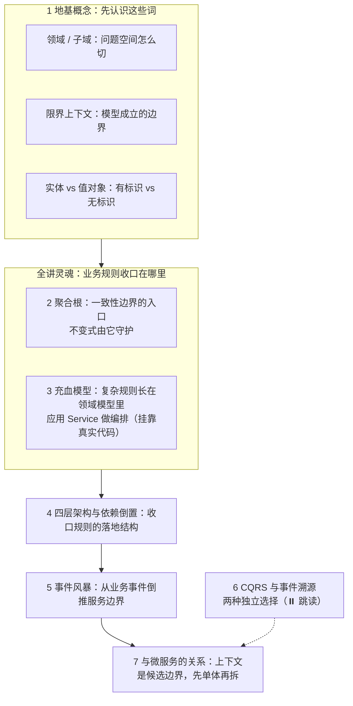
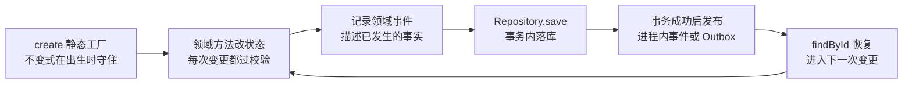
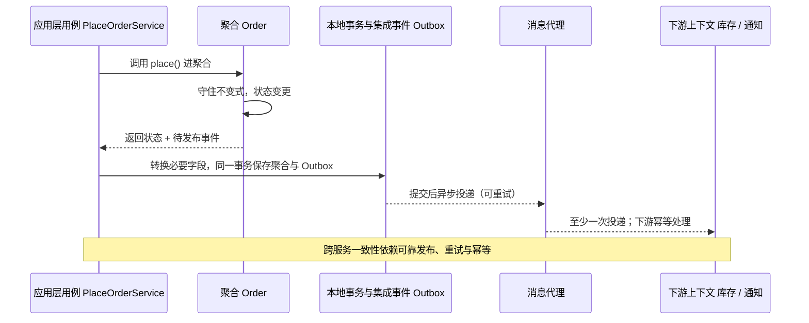
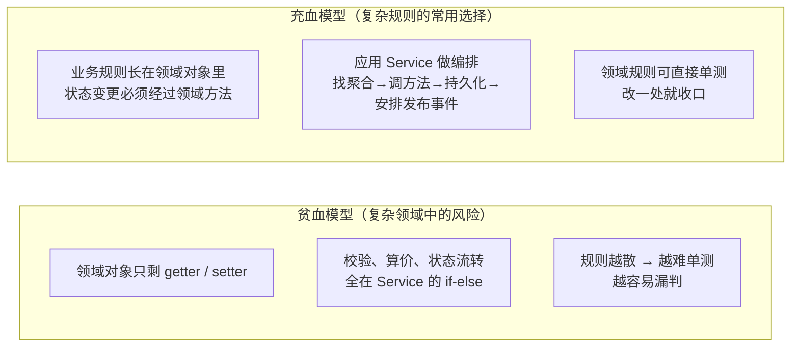
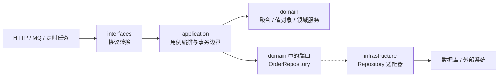
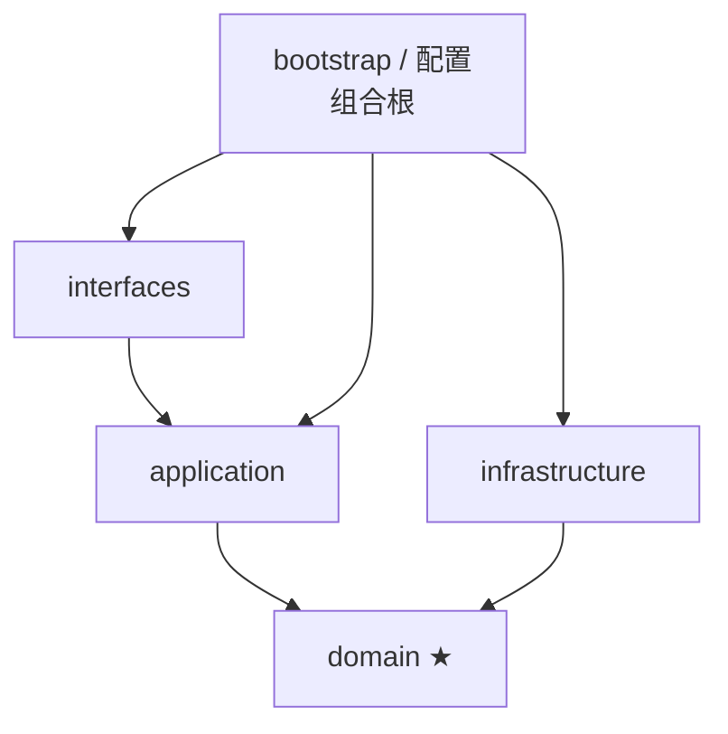
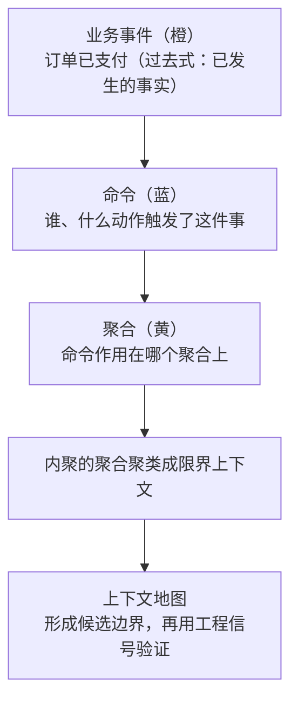

# 阶段四 · 小点 4：DDD 领域驱动设计

> 所属：阶段四 微服务架构与分布式系统
> 定位：DDD 帮助我们处理微服务最贵的问题之一——**业务边界怎么划**（拆错了要还很久的债）。它不只服务于微服务，也能指导模块化单体：逻辑边界与物理部署是两项不同决策。

> 学习顺序提示：先完成本讲，建立「模型边界」与「一致性边界」的基本认识；第 5 讲再展开限界上下文之间如何通过同步 RPC、异步消息可靠协作。第 5 讲是深化内容，不是本讲的前置知识。

## 快速入门

> 本节为「DDD 速览」：本讲概念密度是全路线最高的一讲，但别被吓到——本节先认识 DDD 解决什么问题、几个核心词、一段代码；「聚合根、充血模型、四层架构、事件风暴」留在正文。

### 本讲在解决什么问题

- **问题**：微服务最贵的问题是「服务边界怎么划」——拆错了要还很久的债。DDD 教你怎么按业务领域建模、划边界。
- **难点不是「记住概念」**：限界上下文、聚合根、实体、值对象、领域事件、防腐层、贫血模型……这些词互相依赖——不懂聚合根就读不懂充血模型，不懂限界上下文就读不懂防腐层。所以本讲刻意把每个概念都挂到 boot-server 的真实代码上：先看「长什么样」，再讲「为什么好」。
- **你需要明确的点**：限界上下文是划分模块或服务边界的重要依据；复杂且易变的业务规则优先收进领域模型，**应用服务**负责用例编排。边界设计与是否物理拆成微服务是两项不同决策：先把边界划清，再决定部署形态。
- **常用约定（先立规矩）**：
  - **边界思维 ≠ 物理拆服务**：先划清边界，再决定拆不拆，别上来就拆微服务。
  - **别把 CQRS 和事件溯源绑在一起**：CQRS 解决读写模型或负载差异；事件溯源解决以事件重建状态和保留完整历史。两者可以独立采用，也都不是默认选项。
  - **按复杂度选建模方式**：复杂、易变且需要守住不变式的规则，应收进聚合、值对象或领域服务；简单 CRUD 用事务脚本往往更直接，不必为了“像 DDD”强行充血化。

### 本讲关键词速查

| 关键词 | 一句话大白话 | 最易踩的坑 |
|-|-|-|
| DDD | 领域驱动设计：先按业务建模，再决定怎么写代码 | 把 DDD 当「拆微服务工具」，跳过建模直接拆服务 |
| 统一语言 | 业务与研发在同一上下文内使用同一套术语 | 追求全公司只有一套模型，抹掉上下文差异 |
| 限界上下文 | 一个业务模型成立的边界——同一个词在不同上下文含义不同 | 一个子域强行对应一个上下文（两者不一一对应） |
| 聚合根 | 一致性边界的入口对象，外部只能通过它改内部 | 绕过根直接改内部对象；把聚合当查询模型用 |
| 实体 | 有唯一标识、生命周期内会变化（订单） | 以为「长得像对象」就是实体 |
| 值对象 | 无标识、不可变、按值判等（金额、地址） | 用可变类实现金额 / 地址 |
| 领域事件 | 领域里已经发生、值得其他对象关注的事实（OrderPaid） | 把命令写成事件；把“记录事件”误当成“已经可靠投递” |
| 防腐层 | 上下文之间的模型转换层，隔离外部模型 | 防腐层里直接复用对方 DTO——转换没发生（ACL 见正文第 5 节） |
| 贫血模型 | 领域对象只有数据，规则主要写在 Service 中 | 在复杂领域里让规则四散；或在简单 CRUD 中反过度设计 |
| CQRS | 命令与查询使用不同模型，必要时再分存储 | 误以为必须两套数据库、必须搭配事件溯源 |
| Event Sourcing | 以事件流作为事实来源，由事件重建状态 | 只需要审计日志，却承担事件演进、回放和投影成本 |

### 最小示例：聚合根长什么样

```java
// 聚合根: 一致性边界的入口, 业务规则都从这里收口
public class Order {
    private Long id;
    private List<OrderItem> items;                       // 订单项（子实体）
    private OrderStatus status;                          // 订单状态（枚举）
    private final List<DomainEvent> domainEvents = new ArrayList<>();   // 待发布的事件

    // 业务规则收在聚合根里, 而不是散在 Service —— 这是 DDD 的关键
    public void cancel(String reason) {
        if (status != OrderStatus.CREATED) {
            throw new IllegalStateException("只有待支付订单能取消");   // 不变式守护
        }
        this.status = OrderStatus.CANCELLED;
        // 先记录领域事件；何时、如何可靠投递由应用层和基础设施处理
        domainEvents.add(new OrderCancelled(id, reason));
    }
}
```

> 代码备注（逐行解释）：
> - `Order` 是**聚合根**：一致性边界的入口，包含 `items` 等子对象。
> - `cancel()` 里判断「只有待支付能取消」——这叫**不变式守护**（不变式 = 业务上无论何时都必须成立的约束，如「待支付才能取消」）：业务规则收在聚合根内，不散在 Service。
> - `domainEvents.add(new OrderCancelled(...))`：这里只是把已经发生的事实记录到待发布列表，**不等于事件已可靠投递**；发布时机、事务提交与失败重试见正文 2.5 和阶段四第 5 讲。
> - 对比贫血模型：如果 `Order` 只有 getter/setter、`cancel` 判断散在多个 Service 里，就是「贫血模型」。在规则复杂的领域中，这会让不变式越来越难守；简单 CRUD 则不必强行改造成富领域模型。
> - 这个 Order 是教学示意（没写全构造与字段）；**boot-server 仓库里的真实样例**（SKU 的价格不变式 `changePrice`）在正文第 3 节。

## 精简大纲

**本讲知识地图**——地基概念 → 全讲灵魂（业务规则收口在哪）→ 落地结构 → 倒推边界的方法：



1. 核心概念：领域 / 子域 / 限界上下文 / 实体 / 值对象（主线 · 地基）
2. 聚合根：一致性边界与不变式守护（主线 · 灵魂）
3. 充血模型：贫血 → 充血的改造（主线 · 灵魂，挂靠 boot-server 真实代码）
4. 四层架构与依赖倒置（主线）
5. 事件风暴：从业务事件到服务边界
6. CQRS 与 Event Sourcing：收益与成本（⏸️ 跳读）
7. 与微服务的关系：限界上下文是候选边界；Modulith（模块化单体扩展）是第一步

## 学习内容详情

### 1. 核心概念：领域 / 子域 / 限界上下文 / 实体 / 值对象

先分两对词：**问题空间**（业务要解决什么）与**解决方案空间**（模型在哪成立）——1.1 讲问题空间，1.2 讲解决方案空间，1.3 讲模型里最小的两种对象。

#### 1.1 领域与子域：问题空间怎么切

**领域（Domain）**：你要解决的业务问题空间——电商的领域是「卖货」，医疗的领域是「看病」。领域太大，先切子域，并按重要性分三类：

- **核心子域（Core Domain）**：公司的竞争力所在，最值得投入建模——电商的订单履约。
- **支撑子域（Supporting Domain）**：支撑核心业务、但不构成差异化——库存。
- **通用子域（Generic Domain）**：所有行业都用，可买可租可外包——权限、消息通知。

> **前端对照**：产品拆域——「用户、订单、支付」的模块划分就是域拆解，前端团队早就做过；DDD 只是把它讲得更严谨：核心子域自己建模、通用子域用现成的。

#### 1.2 限界上下文：模型成立的边界

**统一语言（Ubiquitous Language）**：业务专家和研发围绕同一业务模型共同使用的术语，并让这些词进入讨论、文档、代码和测试。它不是追求全公司只有一种叫法，而是要求**在同一个限界上下文内含义稳定**。

**限界上下文（Bounded Context）**：一个模型成立、一套术语自洽的边界。**为什么需要边界**——同一个“客户”，销售关心买没买、财务关心欠不欠款、客服关心满不满意：三套说法不能混用，混了模型就塌。限界上下文给统一语言划定了适用范围。

> **类比双段式（限界上下文：同一位「客户」在不同部门）**：生活版——技术部、财务部、销售部嘴里的「客户」是完全不同的账：销售关心买没买、财务关心欠不欠款、客服关心满不满意——同一家公司的同一个人，每个部门各有自己的一套说法和台账。落回 DDD——**每个限界上下文是一套自洽的模型与术语**：「订单」在交易上下文里关心金额与支付状态、在物流上下文里关心地址与承运商，同一个子域可以在不同上下文里各有各的模型。

> 概念辨析（面试高频）：**子域是问题空间，限界上下文是解决方案空间**——「把业务拆成核心 / 支撑 / 通用子域」是分析（业务要解决什么）；「为每个子域设计一个或多个限界上下文」是设计（模型在哪成立）。两者不一一对应：一个子域可能拆成多个上下文，一个上下文也可能横跨多个子域。

> **前端对照**：BFF（Backend For Frontend，为特定前端提供接口适配的后端层）常会把同一个用户投影成 App 端模型和管理端模型，这能帮助理解“同一个概念可以有不同表示”。但**一个端或一个接口并不会自动成为限界上下文**；只有当它拥有相对独立的业务语言、规则和模型边界时，才可能构成限界上下文。

#### 1.3 实体与值对象：有标识 vs 无标识

**实体（Entity）**：有唯一标识、生命周期内会变化的对象——订单 id 不变、状态从待支付变成已支付，说「这个订单」靠的是 id 而不是它的当前值。
**值对象（Value Object）**：无标识、不可变、按值判等——两张一百元不区分「哪一张」；金额从 100 变 200，不是修改旧对象，而是换成新对象。

```java
// 值对象：record 天生就是它该成为的样子（阶段一第 2 讲伏笔回收）
public record Money(long cents, Currency currency) {
    public Money add(Money other) {                      // 不可变: "修改"返回新对象
        if (!currency.equals(other.currency)) throw new IllegalArgumentException("币种不同不可相加");
        return new Money(cents + other.cents, currency); // 校验长在类型里 —— 非法状态根本表达不出来
    }
}
// 对比"传统做法": BigDecimal + String 散落各处校验 —— 同样的规则, DDD 把它关进了类型的笼子
```

> **类比双段式（值对象：两张一百元）**：生活版——你手里的两张一百元纸币不需要编号，两张长得一样就是同一笔钱、可互换，说「钱」的时候没人关心是「哪一张」。落回 DDD——**值对象（金额、地址）无唯一标识、不可变、按值判等**，修改金额不是改旧对象、而是换成新对象（`record` 天生如此）；有唯一标识、生命周期内会变化的是**实体**（如订单：id 不变、状态会变）。

> **前端对照**：不可变 props / 不可变状态更新——你把 props 当只读、更新状态时创建新对象而不是改旧对象，这正是值对象的使用纪律；「有 id、会变」的订单则对应「有稳定 key、可更新」的列表项。

**一对词怎么分（横向对比）**：

| 维度 | 实体（Entity） | 值对象（Value Object） |
|-|-|-|
| 标识 | 有唯一标识（订单 id） | 无标识（两张一百元不区分） |
| 可变性 | 生命周期内可变（状态流转） | 不可变，修改 = 换成新对象 |
| 判等依据 | 标识相等 | 所有属性值相等 |
| Java 形态 | 普通 class + id | `record`（阶段一第 2 讲） |
| 典型例子 | 订单、用户、SKU | 金额、地址、日期区间 |

### 2. 聚合根：一致性边界与不变式守护

#### 2.1 聚合与聚合根：一组内聚对象 + 一个入口

**聚合（Aggregate）**：一组「要么一起变、要么都不变」的内聚对象——订单 + 订单项 + 收货地址是一组：改明细影响总额，两者必须在一个事务里一起变。
**聚合根（Aggregate Root）**：聚合的**入口对象**——外部只能通过根操作聚合内部，根守住整组对象的**不变式**（业务上无论何时都必须成立的约束，如「订单总金额 = Σ 明细」）。

> 概念辨析：**聚合是「一组对象」这个集合，聚合根是这组对象的「大门」**——「聚合要小」说的是集合大小，「外部只能通过根操作」说的是入口唯一，两者是「组」与「门」的关系，别混为一谈。

> **类比双段式（聚合根：会所的迎宾门）**：生活版——私人会所只有一个迎宾门（聚合根）：客人想见包间里的人，必须从大门走，不能翻墙；点多少菜、谁来买单这类规矩（不变式）由门口统一把关。落回 DDD——**聚合根是「一致性边界」的唯一入口**，业务规则由它收口。设计时通常不让一个业务不变式依赖多个聚合的原子修改；跨聚合协作根据业务要求选择最终一致，或明确承担同库事务等更强耦合方案的成本。

> **前端对照**：受控组件 / Store——子组件通过受控入口请求修改状态，有助于理解“统一入口”和“规则收口”。类比到此为止：前端 Store 管的是界面状态，聚合根守的是**业务不变式与事务一致性边界**，二者不能按目录结构直接一一映射。

#### 2.2 不变式守护：为什么规则必须收在聚合里

推演而不是背结论——先看规则**不收在聚合里**会发生什么。假设「价格不能为负数」这条不变式写在 Service 里：

```text
场景：改价格有两个入口 —— ① 后台管理改价（HTTP）② 定时任务按市场价批量调价
规则写在 Service 里：两个入口各写一份「if (price < 0) throw ...」
结果：① 写了校验、② 忘了写 —— 负价格就从 ② 进来了
新增第三个入口（MQ 消费改价）→ 还要再抄一遍，抄漏了又破一次
```

**推演结论**：不变式应放在所有状态修改入口的必经之地。属于单个聚合的规则通常由聚合根、实体或值对象守护；跨多个领域对象且不自然属于某个实体的规则，可以放进领域服务。**入口会越来越多（HTTP / MQ / 定时任务 / 测试代码），应用层应让它们最终调用同一套领域规则**。

反过来说，这也是「不变式守护」的完整含义：**不是「写一个校验方法」，而是「让校验方法成为唯一入口」**。

#### 2.3 聚合的大小：怎么定才不后悔

大小不是拍脑袋，推演一遍：

```text
聚合越大
→ 一次业务操作可能加载、校验和写回更多状态
→ 多个请求更容易修改同一个聚合版本，乐观锁冲突概率上升
→ 使用悲观锁时，也更容易触碰更多行、拉长持锁时间
→ 因此只把“必须同时保持一致”的对象放进同一聚合
```

> **机制边界**：DDD 不会让数据库“自动锁住整棵聚合”。真正锁哪些行，由实际 SQL、事务隔离级别以及乐观锁 / 悲观锁策略决定。聚合大带来的是更大的加载、校验、更新和冲突范围，而不是一种固定的数据库锁行为。

**判断标准**：从业务不变式反推边界——**哪些对象必须在一次原子修改中保持一致，哪些就属于同一聚合的候选范围**。「改订单明细必须同步重算订单总额」说明明细和总额通常同属一个聚合；支付和物流若允许通过明确状态机异步衔接，则可以分属不同聚合。

**具体反例**：把「订单 + 全部历史操作记录（几千行）」都装进一个聚合。一次改收货地址也要恢复大量无关历史，增加内存、SQL 和并发版本冲突成本；列表页若只需要摘要，更应查询专用投影，而不是加载完整聚合。**只读查询本身并不会天然锁住整个聚合**。

**边界条件**：大聚合的代价在高频写、多并发或对象图庞大时最明显；低频写场景未必需要为了“小”而拆散天然内聚的对象。聚合设计优先服从业务一致性，再结合真实的访问模式和冲突数据调整。

#### 2.4 聚合的生命周期：从出生到持久化

聚合不是静态模型，它有完整的一生：



- **出生**：静态工厂 `Order.create(...)`——不变式在构造处就守住（「创建时价格必须非负」这类规则，构造时校验一次，非法对象根本生不出来）。
- **变更**：只能走领域方法，每次变更都过一遍不变式。
- **记事件**：聚合在状态变更时记录领域事实；记录到内存列表不等于已经对外发布。
- **持久化 / 发布 / 恢复**：`Repository.save` 在本地事务中落库；事务成功后再发布事件。跨进程可靠投递通常用 Outbox，下一次请求再由 `Repository.findById` 恢复聚合。
- 这套生命周期的每一环都有明确的「家」：create 与事件事实在领域模型里，save / findById 在 Repository 契约里，可靠投递机制在基础设施层——**哪一环该放哪，就是四层架构（第 4 节）要解决的**。

#### 2.5 跨聚合的协作：领域事件与可靠发布

**领域事件（Domain Event）**：领域里已经发生的事实（如 `OrderPlaced`）。它首先服务于领域建模；是否跨聚合、跨进程传播，是后续的架构决策。跨服务时通常由发送方提交本地事务，再通过 Outbox / 消息队列可靠发布，接收方在自己的事务中处理并保证幂等，形成最终一致。

> **领域事件 ≠ 集成事件**：领域事件用领域语言表达内部事实；真正发给其他上下文时，应用层 / 基础设施层可以把它转换成更稳定、只暴露必要字段的集成事件。不要为了省一个映射类，就让内部领域对象变成跨服务共享模型。



> **前端对照**：EventBus 的 payload 可以帮助理解“发布事实、订阅方自行响应”。边界是：浏览器内 EventBus 通常不负责事务、持久化和重试；跨服务领域事件必须考虑提交时机、重复投递、乱序和消费幂等。另外，Spring 应用事件**默认同步执行**，只有显式配置异步执行器或接入消息代理后才是异步。

### 3. 充血模型：贫血 → 充血的改造（全讲灵魂）

**这一节是全讲的灵魂**：前两节讲了「复杂规则要有明确归属」，这一节回答——规则散落会怎样、收回来长什么样。它也是你动手改造代码时很常用的能力：**判断当前业务复杂度是否需要富领域模型，以及需要时怎么改**。下面借 boot-server 的 SKU 改价代码说明“把规则移近数据”的方向；它是渐进式示例，不是完整 DDD 聚合模板。

**判据一句话**：在复杂领域中，**业务规则离领域模型越远，模型越贫血**——校验、算价、状态流转等规则放在聚合、值对象或领域服务里，属于**充血模型（Rich Domain Model）**；如果领域对象只剩 getter/setter，规则主要堆在 Service 的过程式代码中，则属于**贫血模型（Anemic Domain Model）**。但事务脚本不是天然错误：对规则少、以 CRUD 为主的模块，它可能是成本更低、更清楚的选择；问题在于业务已经复杂，代码仍让规则四处复制。

> **类比双段式（传菜员 vs 大厨）**：生活版——餐厅让传菜员端盘子，厨师位却只留一扇「快进快出」的取餐窗：每道菜油炸几分钟、放不放辣全记在传菜员的随身小本上（if-else），改一次菜谱要翻遍每个传菜员的本子。反过来，做法写进大厨（领域对象），传菜员只负责「端盘子」（编排）。落回 DDD——**业务规则长在领域对象里是充血模型，全散在 Service 里是贫血模型**，后者改一处业务要改一堆 Service、还测不动。



#### 3.2 真实代码：boot-server 的 SKU 是怎么充血的

仓库里的 `Sku` 展示了“把价格不变式从 Service 收进实体方法”的渐进式改造（只读参照）：

```java
// boot-server/services/user-service/src/main/java/com/example/bootserver/entity/Sku.java（节选）
@Data
@TableName("t_sku")
public class Sku {
    private Long id;
    private Long productId;
    private String skuCode;
    private BigDecimal price;
    @Version private Integer version;    // 乐观锁版本号（阶段四前置卡片）
    @TableLogic private Integer deleted;

    /** 创建初始 SKU：价格不变式在构造处守住，version 从 0 起步。 */
    public static Sku create(Long productId, String skuCode, BigDecimal price) {
        Sku sku = new Sku();
        sku.setProductId(productId);
        sku.setSkuCode(skuCode);
        sku.changePrice(price);          // 构造也走领域方法 —— 不变式在出生时就守住
        sku.setVersion(0);
        return sku;
    }

    /** 价格非负是 SKU 的不变式：任何入口（HTTP / 未来的 MQ、定时任务）改价都必须经过这里。 */
    public void changePrice(BigDecimal newPrice) {
        if (newPrice == null || newPrice.signum() < 0) {
            throw new BusinessException(ErrorCode.PARAMETER_ERROR, "价格不能为负数");
        }
        this.price = newPrice;
    }
}
```

三个「充血」证据，一条条对照：

- **静态工厂 `create`**：价格校验在**构造时就守住**——对应 2.4 的「出生」环节。
- **领域方法 `changePrice`**：价格非负的校验长在实体里，规则就在字段旁边、跟着 `Sku` 走，不散在调用方。
- **注释把纪律写明白**：「任何入口（HTTP / 未来的 MQ、定时任务）改价都必须经过这里」——这条注释的边界，见 3.6。

> **示例边界**：`Sku` 仍带有 MyBatis-Plus、Lombok 注解，并开放了 setter，因此它是“带领域行为的持久化实体”，不是第 4 节所说的纯领域模型。这个例子只演示规则收口；若要严格分层，还需隔离持久化模型与领域模型，或至少移除可绕过规则的公开 setter。

#### 3.3 应用 Service 主要做编排：找实体 → 调方法 → 存

同一仓库的管理端写入服务，对照着看「编排」长什么样：

```java
// boot-server/services/user-service/src/main/java/com/example/bootserver/service/ProductManagementService.java（节选）
@Transactional
public SkuPriceResponse updateSkuPrice(Long id, UpdateSkuPriceRequest request) {
    Sku existing = skuMapper.selectById(id);              // ① 找实体
    if (existing == null) {
        throw new BusinessException(ErrorCode.NOT_FOUND, "SKU 不存在");
    }
    Sku update = new Sku();
    update.setId(id);
    update.changePrice(request.price());                  // ② 调领域方法 —— 校验不在 Service
    update.setVersion(request.version());
    update.setUpdateTime(LocalDateTime.now());
    if (skuMapper.updateById(update) == 0) {              // ③ 存（乐观锁冲突由数据库兜底）
        throw new BusinessException(ErrorCode.CONFLICT, "SKU 价格版本已变化");
    }
    return new SkuPriceResponse(id, update.getPrice(), update.getVersion());
}
```

注意「价格非负」只在 `changePrice` 中定义，Service 里没有第二份 `if (price < 0)`。这正是 2.2 推演的落地：**领域校验收口在领域方法，应用 Service 负责用例顺序、事务与依赖协作**。但由于当前 `Sku` 仍有公开 `setPrice`，这里只实现了“规则定义唯一”，尚未实现“修改入口唯一”，3.6 会继续说明。

#### 3.4 领域规则可单测：不依赖 Spring 的测试

把规则放进普通 Java 方法的直接红利是：**这条规则不需要启动 Spring 上下文、不需要数据库就能测**：

```java
// boot-server/services/user-service/src/test/java/com/example/bootserver/entity/SkuTest.java（节选）
class SkuTest {
    @Test
    void changePriceRejectsNegativePrice() {
        Sku sku = new Sku();
        BusinessException exception = assertThrows(BusinessException.class,
                () -> sku.changePrice(new BigDecimal("-0.01")));   // 负价格被拒
        assertEquals(ErrorCode.PARAMETER_ERROR, exception.getErrorCode());
    }

    @Test
    void createBuildsSkuWithValidatedPriceAndZeroVersion() {
        Sku sku = Sku.create(1L, "SKU-A", new BigDecimal("19.90"));
        assertEquals(new BigDecimal("19.90"), sku.getPrice());
        assertEquals(0, sku.getVersion());                        // 出生时 version 从 0 起步
    }
}
```

对比一下：如果校验和一组外部依赖编排混在 Service 里，单测通常需要构造或 Mock 更多依赖；收在实体里，`new Sku()` 就能直接断言。这里的测试虽是快速单元测试，但 `Sku` 本身仍引用框架注解和项目异常类型，因此还不是“纯领域层零框架依赖”的完整示范。

#### 3.5 重构前后对照：一次真实的贫血 → 充血

同一个「改价」用例，贫血版 vs 充血版：

```java
// before：贫血 —— 规则散在 Service
@Transactional
public void updatePrice(Long skuId, BigDecimal price) {
    if (price == null || price.signum() < 0) {                    // 校验在 Service 里
        throw new BusinessException(ErrorCode.PARAMETER_ERROR, "价格不能为负数");
    }
    Sku sku = skuMapper.selectById(skuId);
    sku.setPrice(price);                                          // setter 直改，没有第二条路径守护
    skuMapper.updateById(sku);
}
// 问题：换一个入口（定时任务改价、MQ 消费改价）就要再抄一遍校验 —— 漏一处，负价格就进来了

// after：充血 —— 规则收进 Sku.changePrice
@Transactional
public void updatePrice(Long skuId, BigDecimal price) {
    Sku sku = skuMapper.selectById(skuId);
    sku.changePrice(price);      // 校验只此一处，任何入口都绕不开
    skuMapper.updateById(sku);
}
```

把两个版本并排看，收益就一句话：**before 的规则是「复制粘贴进每个入口」的，after 的规则是「长在实体上被每个入口共用」的**——前者漏一个入口就破，后者天然全覆盖。

#### 3.6 诚实的边界：不变式守护在什么条件下才成立

3.2 的 `Sku` 有个坦白的问题：类上挂着 Lombok 的 `@Data`——它**生成了公开的 `setPrice` setter**。也就是说，「任何入口都必须经过 `changePrice`」目前是靠**注释纪律**维持的：写的人自觉遵守，`setPrice` 依然能绕过校验。

DDD 把守护分成两种强度：

- **纪律性守护**：注释 / 团队约定——「请走 changePrice」。
- **结构性守护**：代码上**只有一条路**——setter 不公开（`@Data` 换成手写、setter 设 `private`），结构上想绕过也绕不过。

**判断标准**：注释管得住单团队小改动，管不住多人并发演进。**充血模型追求的是结构性守护**——如果 `setPrice` 的存在会让 `changePrice` 形同虚设，那是守护没做彻底，不是「充血模型没用」。仓库当前为教学简化保留 `@Data`；想在工程里做彻底的话，在自己的代码里把 setter 收成私有即可（本讲对仓库代码只读参照，不改）。

### 4. 四层架构与依赖倒置

先分清两种箭头：**运行时调用方向**描述一次请求经过谁；**编译期依赖方向**描述源码中的 `import` 和接口归属。调用最终会进入数据库适配器，但领域层源码不需要反向依赖数据库框架。

#### 4.1 运行时：一次请求怎样协作



运行时可以概括为：接口层接收输入 → 应用层组织用例 → 领域模型执行规则 → 通过抽象端口调用基础设施。Spring 只负责在启动时把 `OrderRepositoryImpl` 注入 `OrderRepository` 的使用方。

#### 4.2 编译期：源码依赖指向哪里



这张图只表达源码依赖：

- `interfaces` 依赖 `application`，负责 DTO 与命令 / 查询对象之间的转换。
- `application` 依赖 `domain`，负责事务边界、权限等用例级策略和协作顺序，不复制领域不变式。
- `infrastructure` 依赖领域端口并实现它；`domain` 不导入 JPA、MQ 或 HTTP 客户端。
- `bootstrap`（组合根）同时看见各层，只负责配置和装配。这是允许的“最外层依赖”，不能把业务规则写进去。

> **最易误读的边界**：运行时是“应用层调用 Repository 实现”，编译期却是“基础设施实现 domain 定义的接口”。两者不矛盾：多态让调用方向和源码依赖方向可以不同，这就是依赖倒置。

> 注：两个容易望文生义的术语——**领域服务** = 不自然属于某个实体或值对象的业务规则（如基于多个候选订单计算拆单方案），放在 domain 层；**Repository 接口** = 面向聚合的“取 / 存”契约，像图书馆的借阅目录，只声明能借什么书。书在哪个楼层、怎么找（JPA、表结构）是基础设施层的事。把 Repository 端口放在 domain 是本教程采用的分层方式；有些架构会把用例专属端口放在 application，关键仍是抽象留在内层、技术实现留在外层。

> **白话补课——三个层间术语**：**ORM**（Object-Relational Mapping，对象关系映射）= 把 Java 对象和数据库表自动互转的框架层；**JPA**（Java Persistence API）= Java 官方的 ORM 标准接口，Spring Data JPA 是它的常见实现——仓库实操用的 MyBatis-Plus 也是 ORM 这一路的工具，DDD 讨论里出现 JPA 指的都是「infrastructure 层里替你把对象存进数据库的东西」。**DTO**（Data Transfer Object，数据传输对象）= 只有字段没有行为的搬运结构，interfaces 层用它对外收发数据；**Cmd / Query** = 应用层的命令 / 查询对象（「我要做什么」），DTO 是「数据长什么样」。

```java
// 依赖倒置的具体形态：本例把聚合仓储接口放在 domain，实现放在 infrastructure
// domain/order/OrderRepository.java
public interface OrderRepository {
    Order findById(OrderId id);
    void save(Order order);
}

// infrastructure/order/OrderRepositoryImpl.java —— Spring 装配时替换接口
@Repository
public class OrderRepositoryImpl implements OrderRepository {
    private final OrderJpa entityDao;                      // JPA 细节只出现在这一层
    public Order findById(OrderId id) {
        return entityDao.findById(id.value()).map(OrderMapper::toDomain).orElseThrow();
    }
    /* ... */
}

// application/PlaceOrderService.java —— 用例负责事务与协作顺序
@Service
class PlaceOrderService {
    private final OrderRepository orderRepo;
    private final DomainEventPublisher eventPublisher;

    @Transactional
    public OrderId place(PlaceOrderCmd cmd) {
        var order = Order.create(cmd.userId(), cmd.items());   // 聚合根静态工厂: 不变式在构造处守住
        orderRepo.save(order);
        // 概念端口：适配器应保证事务成功后发布；跨进程可靠投递通常改用 Outbox
        eventPublisher.publishAfterCommit(order.releaseEvents());
        return order.id();
    }
}
```

- **判断逻辑放哪**：领域术语能描述、需要始终成立的业务规则 → domain；“怎么存 / 怎么发 / 怎么调用外部系统” → infrastructure；用例顺序、事务边界、用例级权限 → application；协议解析和响应转换 → interfaces。
- **本教程的推荐约束**：domain 层保持纯 Java，不使用 JPA / Spring 注解。这不是 DDD 的定义本身，而是为了让领域模型更容易单测，并避免业务规则被具体框架绑住。

**两个「服务」的分工（易混词成对辨析）**——「领域服务」和「应用服务」都有「服务」二字，归属完全不同：

| | 领域服务（domain 层） | 应用服务（application 层） |
|-|-|-|
| 归属 | domain 层 | application 层 |
| 职责 | 不自然属于单个实体 / 值对象的业务规则（拆单方案、运费策略） | 用例编排：鉴权 → 找聚合 → 调领域方法 → 持久化 → 安排事件发布 |
| 业务规则 | 有——它和聚合一样是领域规则的所在地 | 不放领域不变式；可以有事务、权限等用例级策略 |
| 类比 | 大厨之间商量「这桌怎么配菜」 | 传菜员「端哪盘到哪桌」 |

判断口诀：**领域规则进领域模型，用例流程进应用服务**。不要因为一个方法涉及两个对象，就机械地创建领域服务；先判断它表达的是领域规则，还是单纯的技术编排。

### 5. 事件风暴

**事件风暴（Event Storming）**：跨职能工作坊——把业务专家和开发请到一起，按时间线把“已发生的事实”铺成便利贴，再倒推谁触发了它、作用在哪个聚合上，并形成候选限界上下文。它用业务语言和事件流提出**边界假设**，随后还要结合团队职责、变化频率、数据一致性和实际代码验证，而不是一次工作坊就直接决定服务拆分。

```text
流程: 业务事件(橙) → 谁触发命令(蓝) → 命令作用于哪个聚合(黄)
      → 聚合聚类成限界上下文 → 上下文间映射(上下游/ACL/共享内核)

产出物: 事件流时间线 + 候选聚合 + 上下文地图 —— 用业务事实提出边界假设
```



- 做法：跨职能工作坊，便利贴墙上贴——**业务方参与**是重点；先铺“已发生的事实”（过去式：订单已支付），再反推命令与聚合，最后把结果当作边界候选继续验证。
- 一个信号：如果一种「订单」便利贴被两类团队同时用不同字段描述——限界上下文在这里，拆点就在这。

> **前端对照**：事件风暴 ≈ 你开过的**产品需求梳理会 / 用户故事地图**——先把用户要经历的事按时间线铺开（注册 → 下单 → 支付），再逐个环节讨论「谁触发、系统要做什么」。事件风暴是同一件事的后端完整版，只是把「环节」换成了「业务事实 → 命令 → 聚合」。
- 上下文之间的协作模式叫**上下文映射（Context Mapping）**——其中**防腐层（ACL，Anti-Corruption Layer）**是最常用的一种：当两个上下文要协作、但模型差异太大时，在自己这一侧放一个**翻译层**，把对方的模型翻译成自己的模型——「对方怎么变都行，翻译层负责挡」，保护领域模型不被外部污染。它的形态你在前端见过：API adapter / mapper 层（后端接口的数据结构 ≠ 页面组件要的数据结构，中间那层转换就是防腐层）。

> ⏸️ **短期可以不学**：上下文映射（Context Mapping）的全套协作模式（Customer/Supplier 客户供应商、Conformist 跟随者、Open Host Service 开放主机服务、Published Language 发布语言、Shared Kernel 共享内核）——这些是多个团队/多个系统之间约定协作契约的术语，个人学习阶段知道「存在这套分类」即可。**何时回来学**：公司做多团队、多系统集成设计评审时。**面试最低要求**：能说出上下文之间两种协作方式（同步 RPC / 异步事件）与防腐层的作用。

### 6. CQRS 与 Event Sourcing

> 注意缩写撞车：**阶段三第 6 讲的 ES = Elasticsearch**（全文检索引擎），**本节的 ES = Event Sourcing**（事件溯源）——同一个缩写两个意思，面试容易被绕晕，阅读时按上下文分辨。

- **CQRS（Command Query Responsibility Segregation，命令查询职责分离）**：修改状态的命令模型与读取数据的查询模型分开设计。写侧可通过聚合守住不变式；读侧可按页面 / 报表需要直接生成 DTO 或投影，不必恢复完整聚合。
  - **不等于两套数据库**：最小形态可以仍用同一个数据库，只分代码路径和模型；当容量、性能或团队边界真的需要时，才进一步拆存储。
  - **适用信号**：读写模型差异明显、查询形态多且频繁变化、读写负载差距大。若只是普通 CRUD，一套模型更简单。
  - **主要成本**：重复模型、投影同步；一旦拆成不同存储，还要接受延迟、失败补偿和最终一致。
- **Event Sourcing（事件溯源）**：以不可变的**事件序列**作为事实来源（`OrderPlaced → ItemAdded → Paid`），当前状态由事件回放得到。可以保存快照和读投影来提速，但它们不是权威事实来源。
  - **收益**：能够重建任意时点状态，保留完整业务历史，并可从同一事件流生成不同投影。
  - **成本**：事件版本演进、历史事件兼容、回放性能、投影重建、删除 / 隐私合规，以及更高的排障和运维门槛。事件结构不是简单“只能加字段”；常见做法还包括向上转换（upcasting）或让处理器兼容多个版本。
  - **适用信号**：业务确实要求从历史事实重建状态、回溯决策过程，且团队愿意长期治理事件契约。只有审计需求时，审计日志或状态流水通常更合适。

> **两者关系**：CQRS 与事件溯源是两项独立决策。可以“CQRS + 普通状态表”，也可以使用事件溯源并建立读投影；采用其中一个不强制采用另一个。

**三选一怎么选（节末横向对比）**：

| 方案 | 解决什么 | 收益 | 成本 | 什么时候才值得 |
|-|-|-|-|-|
| 审计日志 / 状态流水 | “谁在什么时候做了什么” | 实现和查询成本较低 | 通常不能作为唯一依据重建完整状态 | 只需要追责、审计或查看状态变化（默认先考虑） |
| Event Sourcing | 从历史事实重建状态 | 完整业务历史、任意时点回放、多种投影 | 事件演进、回放、投影和合规治理 | 状态重建本身就是核心业务能力 |
| CQRS | 读写模型或负载分化 | 读侧按场景建模，写侧专注不变式 | 模型重复；分存储后还有同步与一致性成本 | 查询形态与写模型差异明显，可局部采用 |

> ⏸️ **短期可以不学**：CQRS / Event Sourcing 的完整实现细节（快照、事件版本演进、投影重建、读写同步机制）——本篇只要求懂收益、成本与二者的独立关系。**何时回来学**：查询模型已经明显拖累写模型，或业务真的要求依据历史事件重建状态时。**面试最低要求**：能分别说出两者解决什么问题、是否必须搭配，以及为什么事件溯源要慎用。

### 7. 与微服务的关系

- **限界上下文是微服务的候选边界，不是自动映射规则**：它先定义模型和语言的边界；是否独立部署，还要看团队自治、发布节奏、故障隔离、数据所有权与容量需求。一个上下文可以先作为单体内模块，部署单元也可能暂时承载多个边界清晰的上下文。
- **模块化单体（Spring Modulith）是 DDD 的一种务实起步形态**：Spring Modulith 是 Spring 生态中支持模块化单体的工具——单体内按上下文分模块，模块间通过显式接口 / 事件协作，再用架构测试守边界（`ApplicationModules` 测试验证模块依赖，违规即失败）。DDD 本身并不要求必须使用它。
- **验证边界成熟后再拆出独立服务**——呼应阶段四第 1 讲「能单体的先单体」，拆分从赌注变成水到渠成。

> **前端对照**：Monorepo 的 package 边界 + ESLint 的 `no-restricted-imports` 规则——你早就用 lint 拦过「业务组件不许 import 工具内部模块」；**ArchUnit**（把依赖方向断言写成单元测试的库，如「controller 不许 import infrastructure」）就是 Java 版的 `no-restricted-imports`：规则写成测试，CI 上违规就红。

## 坑点提醒

- **聚合当查询模型用**：为了列表页把全表装进聚合——聚合是一致性边界不是 ORM 实体；读走查询侧（CQRS 思维，第 6 节）。
- **把“聚合是一致性边界”理解成“ORM 自动锁整棵对象树”**：DDD 不规定数据库锁；必须回到 SQL、隔离级别和乐观锁 / 悲观锁机制判断并发行为。
- **把记录领域事件当成可靠投递**：内存列表、Spring 进程内事件和消息代理不是一回事；跨服务事件要补齐提交时机、Outbox、重试与幂等。
- **防腐层双向渗透**：ACL 里直接复用对方的 DTO 当自己的模型——转换没发生，外部模型照样入侵。
- **微服务粒度过早对齐「一个聚合一个服务」**：上下文 ≠ 部署单元——先逻辑分模块，物理拆分按团队与流量信号（阶段四第 1 讲的触发信号）。

## 本节自检

- [ ] 能用自己的话解释限界上下文与聚合根，并各举一个业务例子
- [ ] 能区分实体与值对象（判等依据、可变性），并各举一个例子
- [ ] 能从业务不变式判断聚合边界，并说明聚合大小不等于数据库锁粒度
- [ ] 能画出聚合生命周期（create → 领域方法 → 记录事件 → 落库 → 提交后发布 → 恢复），并区分“记录事件”和“可靠投递”
- [ ] 能区分领域服务与应用服务，能说出防腐层的作用
- [ ] 能分别画出 DDD 四层的运行时调用方向与编译期依赖方向，并说明 Repository 接口 / 实现如何完成依赖倒置
- [ ] 能描述事件风暴的流程，以及它为什么能让「服务边界由业务事实决定」
- [ ] 能说出 CQRS 与 Event Sourcing 各自解决的问题、收益和成本，并说明二者为什么可以独立采用
- [ ] 能根据业务复杂度选择事务脚本或充血模型，并说清“不变式守护”在什么条件下才成立

## 本节配套思考题

1. 电商「商品」在商品上下文与交易上下文里的模型差异是什么？复制字段还是共享引用？决策依据？
2. 你的中后台项目（阶段七项目一）用 Modulith 分模块，ArchUnit（把依赖方向断言写成单元测试的库，见第 7 节）测试该断言哪三条依赖规则才算守住边界？
3. 「一个聚合一次事务，跨聚合靠事件最终一致」——下单扣库存同库时还需要 Seata（分布式事务框架，见阶段四第 2 讲）吗？什么时候「同库多聚合」的诱惑会让一致性变脆？

> **核对要点（不是唯一答案）**：
> 1. 商品上下文关注编辑、类目和规格，交易上下文关注下单时的名称、成交价与 SKU 快照；跨上下文通常复制业务所需快照并通过 ID / 事件同步，而不是共享同一个可变实体。
> 2. 至少检查：外层模块只能经公开 API 访问目标模块；领域层不依赖接口层 / 基础设施层；模块之间不存在环依赖。若采用本讲分层，还应检查 `interfaces → application → domain` 以及 `infrastructure → domain` 的方向。
> 3. 同库且确需原子提交时，本地事务已经足够，不需要 Seata。真正的风险是把越来越多聚合绑进同一事务，使边界和发布自治性消失；应先判断业务是否真的要求强一致，再选择本地事务、最终一致或分布式事务。

## 常见面试题

### Q1：限界上下文（Bounded Context）和子域（Subdomain）有什么关系？两者有什么区别？
**答**：**标准结论**：一句话——**子域是问题空间，限界上下文是解决方案空间**。子域是对业务领域「要解决什么问题」的切分；限界上下文是「模型在哪里成立」的设计单元。

**原理层**：差异在「分析 vs 设计」的层次上，进一步拆开——
- **子域三种类型**：核心子域（公司的竞争力所在，如电商的订单履约）、支撑子域（支撑核心但不构成差异，如库存）、通用子域（所有行业都用，如权限）。
- **限界上下文的作用**：边界内模型自洽、术语统一，边界间通过事件或显式接口协作。
- **层次区别**：子域是分析产物（业务视角），限界上下文是设计产物（模型视角），两者**不一一对应**——一个子域可能对应多个上下文。

**工程层**（**面试加分**）：用「订单」举例——在交易上下文里它关心金额与支付状态，在物流上下文里关心发货地址与承运商，同一个词在不同上下文含义不同，这正是限界上下文存在的原因。

### Q2：什么是聚合根？为什么说它是「一致性边界」？聚合的大小怎么把握？
**答**：**标准结论**：聚合根（Aggregate Root）是**聚合（一组内聚对象的集合）的入口对象**——外部通过它修改聚合内部，由聚合内的实体、值对象和领域服务共同守住相关不变式。聚合是建模上的一致性边界：设计时让一次原子修改优先落在一个聚合内。

**原理层**：三个「为什么」——
- **为什么是边界**：同一业务不变式需要原子维护的对象，被放进同一个聚合；跨聚合默认不建立这种强约束，但可根据业务做明确取舍。
- **为什么聚合通常要小**：聚合越大，一次操作可能加载和更新的状态越多，乐观锁冲突或悲观锁持有时间也可能增加。DDD 不会自动锁住整棵聚合，具体并发行为取决于 SQL 与锁策略。
- **怎么把握大小**：从不变式反推“一次原子修改必须覆盖哪些对象”，再结合访问模式验证；跨聚合常用事件实现最终一致，但同库且确需强一致时也可以显式使用本地事务。

**工程层**（**面试加分**）：能说出「订单总金额 = Σ 明细」这类不变式必须收在聚合根内，外部绕过根直接改内部对象就是边界破坏。

### Q3：什么是贫血模型？它一定是反模式吗？怎么判断和重构？
**答**：**标准结论**：贫血模型（Anemic Domain Model）指领域对象主要承载数据、业务规则主要位于 Service 的模型。它在复杂领域中容易让规则散落，但在简单 CRUD 场景中，事务脚本可能比富领域模型更直接，因此不能脱离复杂度一概而论。

**原理层**：三个要点——
- **什么时候成为问题**：当状态校验、金额计算、状态流转等规则复杂且持续变化时，Service 里堆满 if-else，规则越散越难测试、越容易漏判。
- **根因**：领域知识没有收口——任何一个业务变更都要在多个 Service 里改，且无法对领域规则做单元测试。
- **判断标准**：业务规则离 domain 层越远越贫血。

**工程层**：两条落地——
- **重构方向**：把需要始终成立、会随业务变化的规则收进合适的聚合、值对象或领域服务；应用 Service 负责找聚合、调用领域行为、持久化和安排事件发布。不要只因为一段判断出现两次，就机械地下沉到聚合根。
- **面试加分**：能举充血模型反例——状态校验写在 Controller 里、金额计算写在工具类里，都是贫血的变体。

### Q4：DDD 和微服务拆分是什么关系？「一个聚合一个服务」对吗？
**答**：**标准结论**：一句话——**限界上下文是微服务边界的重要候选，而不是一对一部署规则**。它先划定模型和语言边界，再由团队自治、发布节奏、故障隔离、数据所有权与容量需求决定是否独立部署。

**原理层**：三句关键——
- **限界上下文提供逻辑边界，微服务提供物理部署边界**；两者相关，但不是自动一一对应。
- **落地遵循「能单体的先单体」**：先在单体内按上下文分模块（Spring Modulith + 架构测试守边界），边界验证成熟后再按硬信号（发布阻塞、故障隔离、资源争用）逐个拆出独立服务。
- **「一个聚合一个服务」是常见误区**：上下文不等于部署单元，聚合更不等于服务——把一个上下文拆成十几个「聚合服务」只会得到碎片化微服务，跨聚合调用链拉满变成分布式单体（分布式单体：物理上拆了服务、调用上却像单体一样强耦合的假微服务）。

**工程层**：模块化单体是 DDD 的第一步落地形态——先守住边界，拆分从赌注变成水到渠成。

### Q5：CQRS 和 Event Sourcing 有什么区别？必须一起使用吗？
**答**：**标准结论**：不必须。CQRS 分离命令模型与查询模型，解决读写模型或负载差异；Event Sourcing 以事件流作为事实来源，解决依据历史事实重建状态的问题。

**原理层**：CQRS 最小形态可以共用一个数据库，只把读写代码路径和模型分开；事件溯源通常需要投影来支持查询，因此经常搭配 CQRS，但这只是常见组合，不是定义上的绑定。强审计也不是采用 CQRS 的前提。

**工程层**：普通后台列表若查询模型与写模型差异大，可以局部采用 CQRS，同时继续使用状态表；只有当“从完整历史重建状态”本身有业务价值，并能承担事件版本、回放、投影和合规治理时，才考虑事件溯源。
