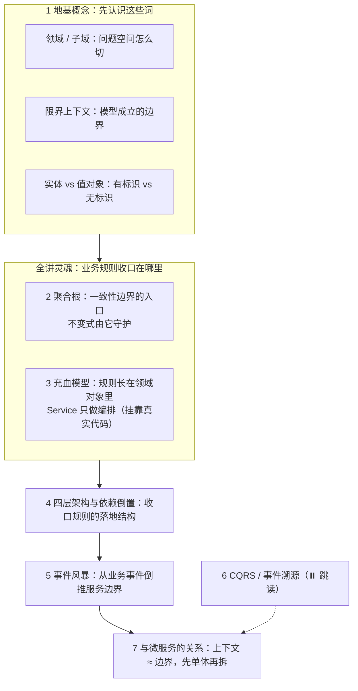
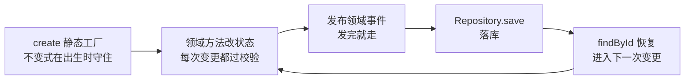
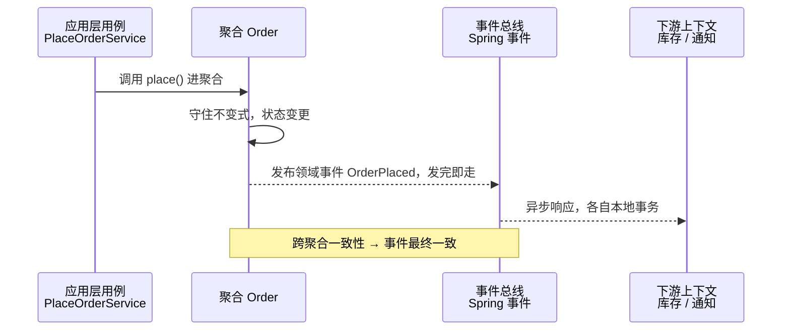
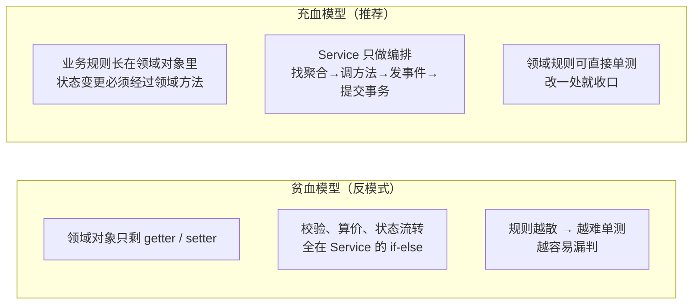
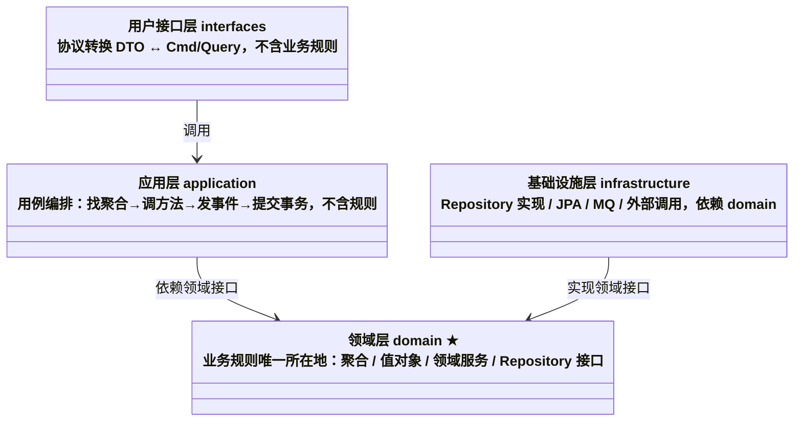
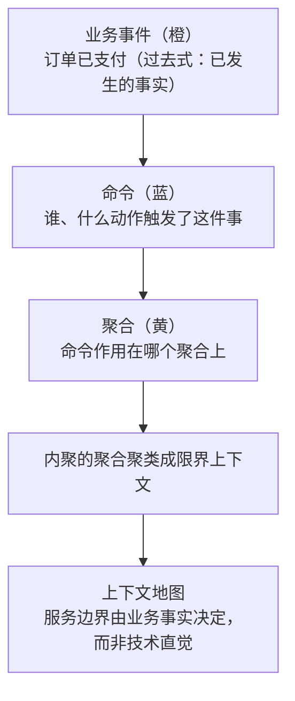

# 阶段四 · 小点 4：DDD 领域驱动设计

> 所属：阶段四 微服务架构与分布式系统
> 定位：DDD 回答的是微服务最贵的问题——**服务边界怎么划**（拆错了要还很久的债）。它同时也是模块化单体的设计方法论：边界思维与拆不拆物理服务无关。

> 学习顺序提示：限界上下文之间怎么协作（同步 RPC / 异步事件）在第 5 讲展开——建议先把第 5 讲的通信小节扫一遍再回读本讲，边界感会更实。

## 快速入门

> 本节为「DDD 速览」：本讲概念密度是全路线最高的一讲，但别被吓到——本节先认识 DDD 解决什么问题、几个核心词、一段代码；「聚合根、充血模型、四层架构、事件风暴」留在正文。

### 本讲在解决什么问题

- **问题**：微服务最贵的问题是「服务边界怎么划」——拆错了要还很久的债。DDD 教你怎么按业务领域建模、划边界。
- **难点不是「记住概念」**：限界上下文、聚合根、实体、值对象、领域事件、防腐层、贫血模型……这些词互相依赖——不懂聚合根就读不懂充血模型，不懂限界上下文就读不懂防腐层。所以本讲刻意把每个概念都挂到 boot-server 的真实代码上：先看「长什么样」，再讲「为什么好」。
- **你要带走的一句话**：DDD 的**限界上下文** ≈ 服务边界；**业务规则收在领域对象里（充血模型），Service 只做编排**。它同时也是模块化单体的方法论——**边界思维与拆不拆物理服务无关**：先把边界划清，再决定要不要物理拆。
- **常用约定（先立规矩）**：
  - **边界思维 ≠ 物理拆服务**：先划清边界，再决定拆不拆，别上来就拆微服务。
  - **别过度设计**：CQRS / Event Sourcing（事件溯源）只在「强审计、需要历史回放」时才用，一般先问「操作日志表够不够」。
  - **贫血模型是反模式**：业务规则（状态校验、金额计算）应收进聚合根，而不是散在 Service 的 if-else 里。

### 本讲关键词速查

| 关键词 | 一句话大白话 | 最易踩的坑 |
|-|-|-|
| DDD | 领域驱动设计：先按业务建模，再决定怎么写代码 | 把 DDD 当「拆微服务工具」，跳过建模直接拆服务 |
| 限界上下文 | 一个业务模型成立的边界——同一个词在不同上下文含义不同 | 一个子域强行对应一个上下文（两者不一一对应） |
| 聚合根 | 一致性边界的入口对象，外部只能通过它改内部 | 绕过根直接改内部对象；把聚合当查询模型用 |
| 实体 | 有唯一标识、生命周期内会变化（订单） | 以为「长得像对象」就是实体 |
| 值对象 | 无标识、不可变、按值判等（金额、地址） | 用可变类实现金额 / 地址 |
| 领域事件 | 领域里发生的事实（OrderPaid），发完就走 | 把事件当「通知消息」塞处理逻辑 |
| 防腐层 | 上下文之间的模型转换层，隔离外部模型 | 防腐层里直接复用对方 DTO——转换没发生（ACL 见正文第 5 节） |
| 贫血模型 | 只有字段没有行为的模型（反模式） | 业务规则全散在 Service 的 if-else 里 |
| CQRS / ES | 读写分离 / 事件溯源（不存状态存事件） | 强审计才值得，复杂度高，别当默认选项 |

### 最小示例：聚合根长什么样

```java
// 聚合根: 一致性边界的入口, 业务规则都从这里收口
public class Order {
    private Long id;
    private List<OrderItem> items;                       // 订单项（子实体）
    private OrderStatus status;                          // 订单状态（枚举）
    private final List<DomainEvent> domainEvents = new ArrayList<>();   // 待发布的事件

    // 业务规则收在聚合根里, 而不是散在 Service —— 这是 DDD 的关键
    public void cancel(String reason) {
        if (status != OrderStatus.CREATED) {
            throw new IllegalStateException("只有待支付订单能取消");   // 不变式守护
        }
        this.status = OrderStatus.CANCELLED;
        // 领域事件: 取消后发出去(让别的上下文响应)
        domainEvents.add(new OrderCancelled(id, reason));
    }
}
```

> 代码备注（逐行解释）：
> - `Order` 是**聚合根**：一致性边界的入口，包含 `items` 等子对象。
> - `cancel()` 里判断「只有待支付能取消」——这叫**不变式守护**（不变式 = 业务上无论何时都必须成立的约束，如「待支付才能取消」）：业务规则收在聚合根内，不散在 Service。
> - `domainEvents.add(new OrderCancelled(...))`：**领域事件**——取消后发出，让别的上下文（库存、通知）响应，发完就走。
> - 对比贫血模型：如果 Order 只有 getter/setter、`cancel` 判断写在 service 里，就是「贫血模型」——业务规则离领域越来越远（反模式，正文第 3 节展开）。
> - 这个 Order 是教学示意（没写全构造与字段）；**boot-server 仓库里的真实样例**（SKU 的价格不变式 `changePrice`）在正文第 3 节。

## 精简大纲

**本讲知识地图**——地基概念 → 全讲灵魂（业务规则收口在哪）→ 落地结构 → 倒推边界的方法：



1. 核心概念：领域 / 子域 / 限界上下文 / 实体 / 值对象（主线 · 地基）
2. 聚合根：一致性边界与不变式守护（主线 · 灵魂）
3. 充血模型：贫血 → 充血的改造（主线 · 灵魂，挂靠 boot-server 真实代码）
4. 四层架构与依赖倒置（主线）
5. 事件风暴：从业务事件到服务边界
6. CQRS 与 Event Sourcing：收益与成本（⏸️ 跳读）
7. 与微服务的关系：限界上下文 ≈ 边界；Modulith（模块化单体扩展）是第一步

## 学习内容详情

### 1. 核心概念：领域 / 子域 / 限界上下文 / 实体 / 值对象

先分两对词：**问题空间**（业务要解决什么）与**解决方案空间**（模型在哪成立）——1.1 讲问题空间，1.2 讲解决方案空间，1.3 讲模型里最小的两种对象。

#### 1.1 领域与子域：问题空间怎么切

**领域（Domain）**：你要解决的业务问题空间——电商的领域是「卖货」，医疗的领域是「看病」。领域太大，先切子域，并按重要性分三类：

- **核心子域（Core Domain）**：公司的竞争力所在，最值得投入建模——电商的订单履约。
- **支撑子域（Supporting Domain）**：支撑核心业务、但不构成差异化——库存。
- **通用子域（Generic Domain）**：所有行业都用，可买可租可外包——权限、消息通知。

> **前端对照**：产品拆域——「用户、订单、支付」的模块划分就是域拆解，前端团队早就做过；DDD 只是把它讲得更严谨：核心子域自己建模、通用子域用现成的。

#### 1.2 限界上下文：模型成立的边界

**限界上下文（Bounded Context）**：一个模型成立、一套术语自洽的边界。**为什么需要边界**——同一个「客户」，销售关心买没买、财务关心欠不欠款、客服关心满不满意：三套说法不能混用，混了模型就塌。

> **类比双段式（限界上下文：同一位「客户」在不同部门）**：生活版——技术部、财务部、销售部嘴里的「客户」是完全不同的账：销售关心买没买、财务关心欠不欠款、客服关心满不满意——同一家公司的同一个人，每个部门各有自己的一套说法和台账。落回 DDD——**每个限界上下文是一套自洽的模型与术语**：「订单」在交易上下文里关心金额与支付状态、在物流上下文里关心地址与承运商，同一个子域可以在不同上下文里各有各的模型。

> 概念辨析（面试高频）：**子域是问题空间，限界上下文是解决方案空间**——「把业务拆成核心 / 支撑 / 通用子域」是分析（业务要解决什么）；「为每个子域设计一个或多个限界上下文」是设计（模型在哪成立）。两者不一一对应：一个子域可能拆成多个上下文，一个上下文也可能横跨多个子域。

> **前端对照**：BFF（Backend For Frontend，为前端服务的后端聚合层）的领域分界——你在 BFF 里见过「同一个用户，App 端和网页端各有一份不同的模型」；每个端就是一个「上下文」。

#### 1.3 实体与值对象：有标识 vs 无标识

**实体（Entity）**：有唯一标识、生命周期内会变化的对象——订单 id 不变、状态从待支付变成已支付，说「这个订单」靠的是 id 而不是它的当前值。
**值对象（Value Object）**：无标识、不可变、按值判等——两张一百元不区分「哪一张」；金额从 100 变 200，不是修改旧对象，而是换成新对象。

```java
// 值对象：record 天生就是它该成为的样子（阶段一第 2 讲伏笔回收）
public record Money(long cents, Currency currency) {
    public Money add(Money other) {                      // 不可变: "修改"返回新对象
        if (!currency.equals(other.currency)) throw new IllegalArgumentException("币种不同不可相加");
        return new Money(cents + other.cents, currency); // 校验长在类型里 —— 非法状态根本表达不出来
    }
}
// 对比"传统做法": BigDecimal + String 散落各处校验 —— 同样的规则, DDD 把它关进了类型的笼子
```

> **类比双段式（值对象：两张一百元）**：生活版——你手里的两张一百元纸币不需要编号，两张长得一样就是同一笔钱、可互换，说「钱」的时候没人关心是「哪一张」。落回 DDD——**值对象（金额、地址）无唯一标识、不可变、按值判等**，修改金额不是改旧对象、而是换成新对象（`record` 天生如此）；有唯一标识、生命周期内会变化的是**实体**（如订单：id 不变、状态会变）。

> **前端对照**：不可变 props / 不可变状态更新——你把 props 当只读、更新状态时创建新对象而不是改旧对象，这正是值对象的使用纪律；「有 id、会变」的订单则对应「有稳定 key、可更新」的列表项。

**一对词怎么分（横向对比）**：

| 维度 | 实体（Entity） | 值对象（Value Object） |
|-|-|-|
| 标识 | 有唯一标识（订单 id） | 无标识（两张一百元不区分） |
| 可变性 | 生命周期内可变（状态流转） | 不可变，修改 = 换成新对象 |
| 判等依据 | 标识相等 | 所有属性值相等 |
| Java 形态 | 普通 class + id | `record`（阶段一第 2 讲） |
| 典型例子 | 订单、用户、SKU | 金额、地址、日期区间 |

### 2. 聚合根：一致性边界与不变式守护

#### 2.1 聚合与聚合根：一组内聚对象 + 一个入口

**聚合（Aggregate）**：一组「要么一起变、要么都不变」的内聚对象——订单 + 订单项 + 收货地址是一组：改明细影响总额，两者必须在一个事务里一起变。
**聚合根（Aggregate Root）**：聚合的**入口对象**——外部只能通过根操作聚合内部，根守住整组对象的**不变式**（业务上无论何时都必须成立的约束，如「订单总金额 = Σ 明细」）。

> 概念辨析：**聚合是「一组对象」这个集合，聚合根是这组对象的「大门」**——「聚合要小」说的是集合大小，「外部只能通过根操作」说的是入口唯一，两者是「组」与「门」的关系，别混为一谈。

> **类比双段式（聚合根：会所的迎宾门）**：生活版——私人会所只有一个迎宾门（聚合根）：客人想见包间里的人，必须从大门走，不能翻墙；点多少菜、谁来买单这类规矩（不变式）由门口统一把关。落回 DDD——**聚合根是「一致性边界」的唯一入口**，业务规则由它收口；跨聚合的改动不共享一个事务，改完通过**领域事件**通知对方、各自最终一致。

> **前端对照**：受控组件 / Store——组件树里只有顶层容器能改状态，子组件必须通过回调改；「金额必须为正」这类规则收在容器里、不散在叶子组件。聚合根是 Java 版同一思想，只是把「状态」换成了「领域对象」。

#### 2.2 不变式守护：为什么规则必须收在聚合里

推演而不是背结论——先看规则**不收在聚合里**会发生什么。假设「价格不能为负数」这条不变式写在 Service 里：

```text
场景：改价格有两个入口 —— ① 后台管理改价（HTTP）② 定时任务按市场价批量调价
规则写在 Service 里：两个入口各写一份「if (price < 0) throw ...」
结果：① 写了校验、② 忘了写 —— 负价格就从 ② 进来了
新增第三个入口（MQ 消费改价）→ 还要再抄一遍，抄漏了又破一次
```

**推演结论**：不变式必须放在「所有入口的必经之地」，而这个必经之地只能是领域对象本身——**入口会越来越多（HTTP / MQ / 定时任务 / 测试代码），聚合根是它们唯一的汇合点**。规则收在聚合里，写一次，所有入口自动生效。

反过来说，这也是「不变式守护」的完整含义：**不是「写一个校验方法」，而是「让校验方法成为唯一入口」**。

#### 2.3 聚合的大小：怎么定才不后悔

大小不是拍脑袋，推演一遍：

```text
前提：事务以聚合为单位 —— 一次事务要锁住聚合内的所有行
→ 聚合越大 = 一次操作锁的行越多 = 并发冲突面越大
   （两个请求改同一聚合的「不同部分」也要互相等待 —— 锁是整棵聚合的）
→ 所以聚合要小：一致性边界内收，跨聚合的一致性交给领域事件最终一致
```

**判断标准**：**能在一个事务里完成的一致性范围，就是聚合的边界**——「改明细必然要重算总额」说明明细和总额同属一个聚合；「支付状态」和「物流发货」没有这种强约束，就各归各的聚合。

**具体反例**：把「订单 + 全部历史明细（几千行）」装进一个聚合——列表页只是只读查询，也被迫背上整棵聚合的锁；两个只改不同明细的请求也会互相阻塞。

**边界条件（大聚合的代价在什么场景才显现）**：上面的推理建立在「高频写、多并发」上——如果业务是读多写少、写频率极低，锁冲突率本来就低，大聚合的危害有限，**别为了「小」而拆散天然内聚的一组对象**。

#### 2.4 聚合的生命周期：从出生到持久化

聚合不是静态模型，它有完整的一生：



- **出生**：静态工厂 `Order.create(...)`——不变式在构造处就守住（「创建时价格必须非负」这类规则，构造时校验一次，非法对象根本生不出来）。
- **变更**：只能走领域方法，每次变更都过一遍不变式。
- **发事件**：变更完成后发布领域事件，发完就走。
- **持久化 / 恢复**：`Repository.save` 落库；下一次请求 `Repository.findById` 恢复——恢复回来的对象，不变式由领域方法继续守护。
- 这套生命周期的每一环都有明确的「家」：create 在聚合里、save / findById 在 Repository 契约里、事件在事件总线上——**哪一环该放哪，就是四层架构（第 4 节）要解决的**。

#### 2.5 跨聚合的协作：领域事件，发完就走

**领域事件（Domain Event）**：领域里发生的事实（OrderPlaced），发完就走——跨聚合的一致性**不共享一个事务**：改完发事件通知对方，各自在本地事务里响应，最终一致。这套协作的可靠性纪律（Outbox、消费幂等）在阶段四第 5 讲展开，这里先立住「事件是跨边界协作的默认手段」。



> **前端对照**：EventBus 的 payload——组件 A 广播 `order-placed`，多个不认识的组件各自订阅响应，发方不点名。领域事件是后端版 EventBus，只是要多守一条纪律：**发完就走**，不在事件里塞处理逻辑。

### 3. 充血模型：贫血 → 充血的改造（全讲灵魂）

**这一节是全讲的灵魂**：前两节讲了「规则收在聚合里」，这一节回答——不收会怎样、收回来长什么样。它也是你动手改造代码时最常用的能力：**判断一段代码是贫血还是充血，并知道怎么改**。挂靠的是 boot-server 仓库刚完成的 SKU 充血化改造（只读参照）。

**判据一句话**：**业务规则离 domain 层越远越贫血**——校验、算价、状态流转这类规则，长在领域对象里是**充血模型（Rich Domain Model）**；全散在 Service 的 if-else 里是**贫血模型（Anemic Domain Model）**（领域对象只剩 getter/setter，本质是「用 DDD 的名号干事务脚本」——事务脚本（Transaction Script）是面向过程式写法：每个用例一个方法、规则散在方法的过程里，对象只是数据的容器）。

> **类比双段式（传菜员 vs 大厨）**：生活版——餐厅让传菜员端盘子，厨师位却只留一扇「快进快出」的取餐窗：每道菜油炸几分钟、放不放辣全记在传菜员的随身小本上（if-else），改一次菜谱要翻遍每个传菜员的本子。反过来，做法写进大厨（领域对象），传菜员只负责「端盘子」（编排）。落回 DDD——**业务规则长在领域对象里是充血模型，全散在 Service 里是贫血模型**，后者改一处业务要改一堆 Service、还测不动。



#### 3.2 真实代码：boot-server 的 SKU 是怎么充血的

仓库刚完成商品 / SKU 的充血化改造（阶段四前置实操），`Sku` 是现成的活例子（只读参照）：

```java
// boot-server/services/user-service/src/main/java/com/example/bootserver/entity/Sku.java（节选）
@Data
@TableName("t_sku")
public class Sku {
    private Long id;
    private Long productId;
    private String skuCode;
    private BigDecimal price;
    @Version private Integer version;    // 乐观锁版本号（阶段四前置卡片）
    @TableLogic private Integer deleted;

    /** 创建初始 SKU：价格不变式在构造处守住，version 从 0 起步。 */
    public static Sku create(Long productId, String skuCode, BigDecimal price) {
        Sku sku = new Sku();
        sku.setProductId(productId);
        sku.setSkuCode(skuCode);
        sku.changePrice(price);          // 构造也走领域方法 —— 不变式在出生时就守住
        sku.setVersion(0);
        return sku;
    }

    /** 价格非负是 SKU 的不变式：任何入口（HTTP / 未来的 MQ、定时任务）改价都必须经过这里。 */
    public void changePrice(BigDecimal newPrice) {
        if (newPrice == null || newPrice.signum() < 0) {
            throw new BusinessException(ErrorCode.PARAMETER_ERROR, "价格不能为负数");
        }
        this.price = newPrice;
    }
}
```

三个「充血」证据，一条条对照：

- **静态工厂 `create`**：价格校验在**构造时就守住**——对应 2.4 的「出生」环节。
- **领域方法 `changePrice`**：价格非负的校验长在实体里，规则就在字段旁边、跟着 `Sku` 走，不散在调用方。
- **注释把纪律写明白**：「任何入口（HTTP / 未来的 MQ、定时任务）改价都必须经过这里」——这条注释的边界，见 3.6。

#### 3.3 Service 只做编排：找实体 → 调方法 → 存

同一仓库的管理端写入服务，对照着看「编排」长什么样：

```java
// boot-server/services/user-service/src/main/java/com/example/bootserver/service/ProductManagementService.java（节选）
@Transactional
public SkuPriceResponse updateSkuPrice(Long id, UpdateSkuPriceRequest request) {
    Sku existing = skuMapper.selectById(id);              // ① 找实体
    if (existing == null) {
        throw new BusinessException(ErrorCode.NOT_FOUND, "SKU 不存在");
    }
    Sku update = new Sku();
    update.setId(id);
    update.changePrice(request.price());                  // ② 调领域方法 —— 校验不在 Service
    update.setVersion(request.version());
    update.setUpdateTime(LocalDateTime.now());
    if (skuMapper.updateById(update) == 0) {              // ③ 存（乐观锁冲突由数据库兜底）
        throw new BusinessException(ErrorCode.CONFLICT, "SKU 价格版本已变化");
    }
    return new SkuPriceResponse(id, update.getPrice(), update.getVersion());
}
```

注意 `changePrice` 是**唯一**处理「价格非负」的地方——Service 里没有第二份 `if (price < 0)`。这正是 2.2 推演的落地：**校验收口在领域方法，Service 只负责顺序**。

#### 3.4 领域规则可单测：不依赖 Spring 的测试

充血模型的直接红利——**领域规则不需要 Spring 上下文、不需要数据库就能测**（仓库里的纯单测）：

```java
// boot-server/services/user-service/src/test/java/com/example/bootserver/entity/SkuTest.java（节选）
class SkuTest {
    @Test
    void changePriceRejectsNegativePrice() {
        Sku sku = new Sku();
        BusinessException exception = assertThrows(BusinessException.class,
                () -> sku.changePrice(new BigDecimal("-0.01")));   // 负价格被拒
        assertEquals(ErrorCode.PARAMETER_ERROR, exception.getErrorCode());
    }

    @Test
    void createBuildsSkuWithValidatedPriceAndZeroVersion() {
        Sku sku = Sku.create(1L, "SKU-A", new BigDecimal("19.90"));
        assertEquals(new BigDecimal("19.90"), sku.getPrice());
        assertEquals(0, sku.getVersion());                        // 出生时 version 从 0 起步
    }
}
```

对比一下：如果校验写在 Service 里，测它就得启动 Spring、造数据库、Mock 一堆依赖；收在实体里，`new Sku()` 直接断言。**「领域可单测」是第 4 节红线（domain 层零框架依赖）在测试里的兑现**。

#### 3.5 重构前后对照：一次真实的贫血 → 充血

同一个「改价」用例，贫血版 vs 充血版：

```java
// before：贫血 —— 规则散在 Service
@Transactional
public void updatePrice(Long skuId, BigDecimal price) {
    if (price == null || price.signum() < 0) {                    // 校验在 Service 里
        throw new BusinessException(ErrorCode.PARAMETER_ERROR, "价格不能为负数");
    }
    Sku sku = skuMapper.selectById(skuId);
    sku.setPrice(price);                                          // setter 直改，没有第二条路径守护
    skuMapper.updateById(sku);
}
// 问题：换一个入口（定时任务改价、MQ 消费改价）就要再抄一遍校验 —— 漏一处，负价格就进来了

// after：充血 —— 规则收进 Sku.changePrice
@Transactional
public void updatePrice(Long skuId, BigDecimal price) {
    Sku sku = skuMapper.selectById(skuId);
    sku.changePrice(price);      // 校验只此一处，任何入口都绕不开
    skuMapper.updateById(sku);
}
```

把两个版本并排看，收益就一句话：**before 的规则是「复制粘贴进每个入口」的，after 的规则是「长在实体上被每个入口共用」的**——前者漏一个入口就破，后者天然全覆盖。

#### 3.6 诚实的边界：不变式守护在什么条件下才成立

3.2 的 `Sku` 有个坦白的问题：类上挂着 Lombok 的 `@Data`——它**生成了公开的 `setPrice` setter**。也就是说，「任何入口都必须经过 `changePrice`」目前是靠**注释纪律**维持的：写的人自觉遵守，`setPrice` 依然能绕过校验。

DDD 把守护分成两种强度：

- **纪律性守护**：注释 / 团队约定——「请走 changePrice」。
- **结构性守护**：代码上**只有一条路**——setter 不公开（`@Data` 换成手写、setter 设 `private`），结构上想绕过也绕不过。

**判断标准**：注释管得住单团队小改动，管不住多人并发演进。**充血模型追求的是结构性守护**——如果 `setPrice` 的存在会让 `changePrice` 形同虚设，那是守护没做彻底，不是「充血模型没用」。仓库当前为教学简化保留 `@Data`；想在工程里做彻底的话，在自己的代码里把 setter 收成私有即可（本讲对仓库代码只读参照，不改）。

### 4. 四层架构与依赖倒置



```text
interfaces/    ← 协议转换(DTO ↔ Cmd/Query), 不含规则
application/   ← 用例编排(找聚合 → 调方法 → 发事件 → 提交事务), 不含规则
domain/        ← 业务规则唯一所在地(聚合/值对象/领域服务/Repository 接口) ★
infrastructure/← 技术实现(Repository 实现/JPA/MQ/外部调用), 依赖 domain
```

> 注：两个容易望文生义的术语——**领域服务** = 不属于某个实体的跨对象业务动作（如「拆单」），照样放 domain 层；**Repository 接口** = 领域定下的「取 / 存聚合」的契约，像图书馆的**借阅目录**——只声明能借什么书（方法签名），书在哪个楼层、怎么找（JPA、表结构）是基础设施层的事。

> **白话补课——三个层间术语**：**ORM**（Object-Relational Mapping，对象关系映射）= 把 Java 对象和数据库表自动互转的框架层；**JPA**（Java Persistence API）= Java 官方的 ORM 标准接口，Spring Data JPA 是它的常见实现——仓库实操用的 MyBatis-Plus 也是 ORM 这一路的工具，DDD 讨论里出现 JPA 指的都是「infrastructure 层里替你把对象存进数据库的东西」。**DTO**（Data Transfer Object，数据传输对象）= 只有字段没有行为的搬运结构，interfaces 层用它对外收发数据；**Cmd / Query** = 应用层的命令 / 查询对象（「我要做什么」），DTO 是「数据长什么样」。

```java
// 依赖倒置的具体形态: 接口在 domain, 实现在 infrastructure —— 箭头全部指向 domain
// domain/order/OrderRepository.java
public interface OrderRepository {
    Order findById(OrderId id);
    void save(Order order);
}

// infrastructure/order/OrderRepositoryImpl.java —— Spring 装配时替换接口
@Repository
public class OrderRepositoryImpl implements OrderRepository {
    private final OrderJpa entityDao;                      // JPA 细节只出现在这一层
    public Order findById(OrderId id) {
        return entityDao.findById(id.value()).map(OrderMapper::toDomain).orElseThrow();
    }
    /* ... */
}

// application/PlaceOrderService.java —— 用例只做编排
@Service
class PlaceOrderService {
    @Transactional
    public OrderId place(PlaceOrderCmd cmd) {
        var order = Order.create(cmd.userId(), cmd.items());   // 聚合根静态工厂: 不变式在构造处守住
        orderRepo.save(order);
        eventPublisher.publishEvent(new OrderPlacedEvent(order.id(), order.total()));
        return order.id();
    }
}
```

- **判断业务规则放哪**：出现在两个用例里的规则、会随业务变化的规则 → domain；「怎么存 / 怎么发」→ infrastructure；「先做什么后做什么」→ application。
- 红线：**domain 层零框架依赖**（没有 JPA / Spring 注解）——这是「领域可单测、可换存储」的前提。

**两个「服务」的分工（易混词成对辨析）**——「领域服务」和「应用服务」都有「服务」二字，归属完全不同：

| | 领域服务（domain 层） | 应用服务（application 层） |
|-|-|-|
| 归属 | domain 层 | application 层 |
| 职责 | 不属于单个对象的**跨对象业务动作**（拆单、算运费） | 用例**编排**：找聚合 → 调方法 → 发事件 → 提交事务 |
| 业务规则 | 有——它和聚合一样是规则的所在地 | 无——只安排「先做什么后做什么」 |
| 类比 | 大厨之间商量「这桌怎么配菜」 | 传菜员「端哪盘到哪桌」 |

判断口诀：**规则在领域服务里，流程在应用服务里**。

### 5. 事件风暴

**事件风暴（Event Storming）**：跨职能工作坊——把业务专家和开发请到一起，按时间线把「已发生的事实」铺成便利贴，再倒推谁触发了它、作用在哪个聚合上，聚合聚成上下文——**服务边界由业务事实决定，而非技术直觉**。

```text
流程: 业务事件(橙) → 谁触发命令(蓝) → 命令作用于哪个聚合(黄)
      → 聚合聚类成限界上下文 → 上下文间映射(上下游/ACL/共享内核)

产出物: 事件流时间线 + 上下文地图 —— 服务边界由业务事实决定, 而非技术直觉
```



- 做法：跨职能工作坊，便利贴墙上贴——**业务方参与**是重点（不是架构师自嗨）；先铺「已发生的事实」（过去式：订单已支付），再反推命令与聚合。
- 一个信号：如果一种「订单」便利贴被两类团队同时用不同字段描述——限界上下文在这里，拆点就在这。

> **前端对照**：事件风暴 ≈ 你开过的**产品需求梳理会 / 用户故事地图**——先把用户要经历的事按时间线铺开（注册 → 下单 → 支付），再逐个环节讨论「谁触发、系统要做什么」。事件风暴是同一件事的后端完整版，只是把「环节」换成了「业务事实 → 命令 → 聚合」。
- 上下文之间的协作模式叫**上下文映射（Context Mapping）**——其中**防腐层（ACL，Anti-Corruption Layer）**是最常用的一种：当两个上下文要协作、但模型差异太大时，在自己这一侧放一个**翻译层**，把对方的模型翻译成自己的模型——「对方怎么变都行，翻译层负责挡」，保护领域模型不被外部污染。它的形态你在前端见过：API adapter / mapper 层（后端接口的数据结构 ≠ 页面组件要的数据结构，中间那层转换就是防腐层）。

> ⏸️ **短期可以不学**：上下文映射（Context Mapping）的全套协作模式（Customer/Supplier 客户供应商、Conformist 跟随者、Open Host Service 开放主机服务、Published Language 发布语言、Shared Kernel 共享内核）——这些是多个团队/多个系统之间约定协作契约的术语，个人学习阶段知道「存在这套分类」即可。**何时回来学**：公司做多团队、多系统集成设计评审时。**面试最低要求**：能说出上下文之间两种协作方式（同步 RPC / 异步事件）与防腐层的作用。

### 6. CQRS 与 Event Sourcing

> 注意缩写撞车：**阶段三第 6 讲的 ES = Elasticsearch**（全文检索引擎），**本节的 ES = Event Sourcing**（事件溯源）——同一个缩写两个意思，面试容易被绕晕，阅读时按上下文分辨。

- **CQRS（命令查询职责分离）**：写侧走聚合 + 事务保不变式；读侧绕开聚合直接查宽表 / Elasticsearch（阶段三第 6 讲）——**读写负载与模型需求分化**时收益明显；查询要求高的报表 / 列表是主战场。
- **Event Sourcing（事件溯源）**：不存当前状态，存**事件序列**（OrderPlaced → ItemAdded → Paid），状态 = 回放。
  - **收益**：完整审计、时间旅行（任意时点重放）、事件即集成。
  - **成本**：快照优化（快照 = 定期把当前状态存一份，回放时从最近的快照开始、省得从头重放所有事件）、事件 schema 演进（schema = 事件的结构定义；老事件永远要能解，所以只能加字段、不能改字段）、查询必须另建读模型（通常配 CQRS）。
  - **正向适用场景**：强审计合规（金融、医疗）、需要完整历史回放与状态回滚时才值得上——不是越核心越该用。
- 务实建议：**CQRS 可以局部用**（某个读重模块）；**ES 慎用**。事件溯源 vs 操作日志表：先问要的是「审计证据」还是「状态重建能力」——只要审计，操作日志表（+ 状态流水）成本低一个量级。

**三选一怎么选（节末横向对比）**：

| 方案 | 解决什么 | 收益 | 成本 | 什么时候才值得 |
|-|-|-|-|-|
| 操作日志表 | 「谁在什么时候改了什么」 | 成本低一个量级 | 只能看历史，不能重建状态 | 只要审计证据（默认选项） |
| Event Sourcing | 完整状态重建 + 任意时点回放 | 完整审计、时间旅行、事件即集成 | 快照、schema 演进、另建读模型 | 强审计合规 / 需要历史回放（金融、医疗） |
| CQRS | 读写负载 / 模型需求分化 | 读侧自由建模、查询不被写模型绑架 | 读写两份模型 + 同步机制 | 读重、查询形态与写模型差异大——可局部用 |

> ⏸️ **短期可以不学**：CQRS / Event Sourcing 的完整实现细节（事件快照、事件 schema 演进、读模型投影重建、CQRS 读写同步机制）——本篇只要求懂收益与成本，会选型。**何时回来学**：业务真到「强审计 / 历史回放」需求的量级、要落地时。**面试最低要求**：能说出两者各自解决什么问题、成本在哪里，以及「ES 慎用」的理由。

### 7. 与微服务的关系

- **限界上下文 ≈ 微服务边界**：上下文间只通过事件 / 显式接口协作——这正是「微服务自治」的定义来源。
- **模块化单体（Spring Modulith）是 DDD 的第一步落地形态**：Spring Modulith = Spring 官方的「模块化单体」扩展——单体内按上下文分模块，模块间只通过显式接口 / 事件通信，再用架构测试守边界（`ApplicationModules` 单测验证依赖方向，违规即失败）。
- **验证边界成熟后再拆出独立服务**——呼应阶段四第 1 讲「能单体的先单体」，拆分从赌注变成水到渠成。

> **前端对照**：Monorepo 的 package 边界 + ESLint 的 `no-restricted-imports` 规则——你早就用 lint 拦过「业务组件不许 import 工具内部模块」；**ArchUnit**（把依赖方向断言写成单元测试的库，如「controller 不许 import infrastructure」）就是 Java 版的 `no-restricted-imports`：规则写成测试，CI 上违规就红。

## 坑点提醒

- **聚合当查询模型用**：为了列表页把全表装进聚合——聚合是一致性边界不是 ORM 实体；读走查询侧（CQRS 思维，第 6 节）。
- **防腐层双向渗透**：ACL 里直接复用对方的 DTO 当自己的模型——转换没发生，外部模型照样入侵。
- **微服务粒度过早对齐「一个聚合一个服务」**：上下文 ≠ 部署单元——先逻辑分模块，物理拆分按团队与流量信号（阶段四第 1 讲的触发信号）。

## 本节自检

- [ ] 能用自己的话解释限界上下文与聚合根，并各举一个业务例子
- [ ] 能区分实体与值对象（判等依据、可变性），并各举一个例子
- [ ] 能说出聚合大小的判断标准，并解释「大聚合的代价在什么条件下才显现」
- [ ] 能画出聚合的生命周期（create → 领域方法 → 事件 → 落库 → 恢复），并说清领域事件从发出到订阅的完整闭环
- [ ] 能区分领域服务与应用服务，能说出防腐层的作用
- [ ] 能画出 DDD 四层并说明依赖倒置在 Repository 接口 / 实现上怎么落地
- [ ] 能描述事件风暴的流程，以及它为什么能让「服务边界由业务事实决定」
- [ ] 能说出 CQRS 与 ES 各自的收益与成本，以及为什么 ES 要慎用
- [ ] 能判断一段代码是贫血还是充血模型并给出重构方向，能说清「不变式守护」在什么条件下才成立

## 本节配套思考题

1. 电商「商品」在商品上下文与交易上下文里的模型差异是什么？复制字段还是共享引用？决策依据？
2. 你的中后台项目（阶段七项目一）用 Modulith 分模块，ArchUnit（把依赖方向断言写成单元测试的库，见第 7 节）测试该断言哪三条依赖规则才算守住边界？
3. 「一个聚合一次事务，跨聚合靠事件最终一致」——下单扣库存同库时还需要 Seata（分布式事务框架，见阶段四第 2 讲）吗？什么时候「同库多聚合」的诱惑会让一致性变脆？

## 常见面试题

### Q1：限界上下文（Bounded Context）和子域（Subdomain）有什么关系？两者有什么区别？
**答**：**标准结论**：一句话——**子域是问题空间，限界上下文是解决方案空间**。子域是对业务领域「要解决什么问题」的切分；限界上下文是「模型在哪里成立」的设计单元。

**原理层**：差异在「分析 vs 设计」的层次上，进一步拆开——
- **子域三种类型**：核心子域（公司的竞争力所在，如电商的订单履约）、支撑子域（支撑核心但不构成差异，如库存）、通用子域（所有行业都用，如权限）。
- **限界上下文的作用**：边界内模型自洽、术语统一，边界间通过事件或显式接口协作。
- **层次区别**：子域是分析产物（业务视角），限界上下文是设计产物（模型视角），两者**不一一对应**——一个子域可能对应多个上下文。

**工程层**（**面试加分**）：用「订单」举例——在交易上下文里它关心金额与支付状态，在物流上下文里关心发货地址与承运商，同一个词在不同上下文含义不同，这正是限界上下文存在的原因。

### Q2：什么是聚合根？为什么说它是「一致性边界」？聚合的大小怎么把握？
**答**：**标准结论**：聚合根（Aggregate Root）是**聚合（一组内聚对象的集合）的入口对象**——外部只能通过它操作聚合内部，所有业务规则（不变式）由它守护；它就是**「一致性边界」**：一个聚合内部的修改要么全部成功、要么全部失败。

**原理层**：三个「为什么」——
- **为什么是边界**：事务粒度以聚合为单位——聚合之外的修改属于另一个事务。
- **为什么聚合要小**：聚合越大，锁粒度越大、并发越差；大聚合在单体里就是一把大锁，拆成微服务后还会被迫跨服务同步调用。
- **怎么把握大小**：能「一个事务」完成的一致性范围就是聚合边界；跨聚合的一致性交给领域事件最终一致。

**工程层**（**面试加分**）：能说出「订单总金额 = Σ 明细」这类不变式必须收在聚合根内，外部绕过根直接改内部对象就是边界破坏。

### Q3：什么是贫血模型？为什么它是反模式？怎么判断和重构？
**答**：**标准结论**：贫血模型（Anemic Domain Model）指**领域对象只剩 getter/setter、业务规则全部散落在 Service 里**的情况——本质是「用 DDD 的名号干事务脚本」的活。

**原理层**：三个要点——
- **为什么是反模式**：状态校验、金额计算、状态流转这些业务规则离开领域对象，Service 里堆满 if-else，规则越散越难测试、越容易漏判。
- **根因**：领域知识没有收口——任何一个业务变更都要在多个 Service 里改，且无法对领域规则做单元测试。
- **判断标准**：业务规则离 domain 层越远越贫血。

**工程层**：两条落地——
- **重构方向**：把「出现在两个用例里的规则」「会随业务变化的规则」下沉进聚合根作为领域方法，Service 只做编排（找聚合 → 调方法 → 发事件 → 提交事务）。
- **面试加分**：能举充血模型反例——状态校验写在 Controller 里、金额计算写在工具类里，都是贫血的变体。

### Q4：DDD 和微服务拆分是什么关系？「一个聚合一个服务」对吗？
**答**：**标准结论**：一句话——**限界上下文是微服务边界的划分依据**：上下文间只通过事件 / 显式接口协作，这正是「服务自治」的定义来源。

**原理层**：三句关键——
- **「限界上下文 ≈ 微服务边界」是上限而非强制**。
- **落地遵循「能单体的先单体」**：先在单体内按上下文分模块（Spring Modulith + 架构测试守边界），边界验证成熟后再按硬信号（发布阻塞、故障隔离、资源争用）逐个拆出独立服务。
- **「一个聚合一个服务」是常见误区**：上下文不等于部署单元，聚合更不等于服务——把一个上下文拆成十几个「聚合服务」只会得到碎片化微服务，跨聚合调用链拉满变成分布式单体（分布式单体：物理上拆了服务、调用上却像单体一样强耦合的假微服务）。

**工程层**：模块化单体是 DDD 的第一步落地形态——先守住边界，拆分从赌注变成水到渠成。
