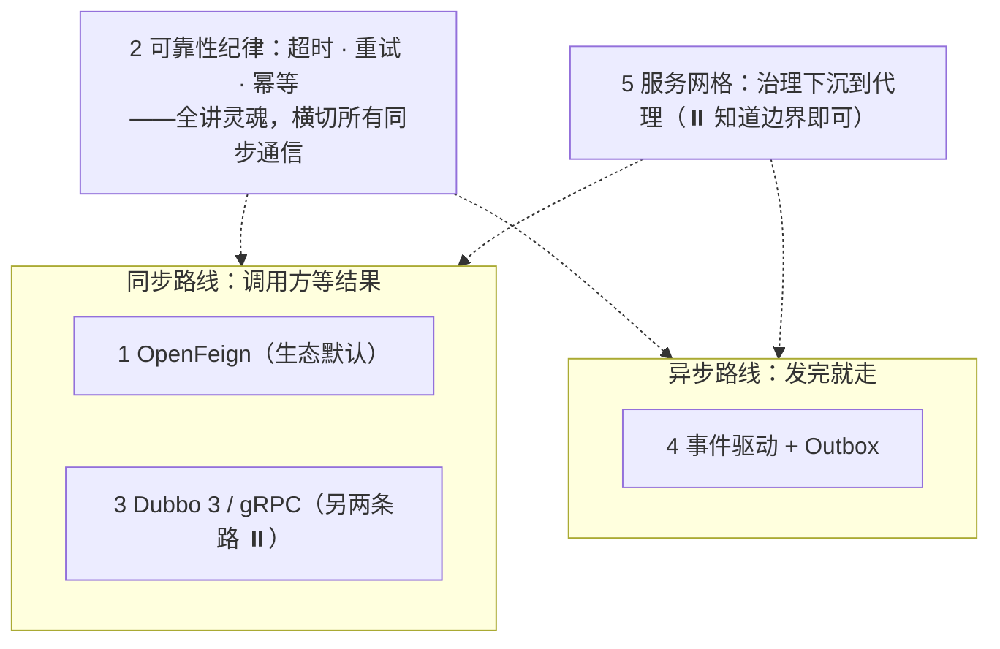
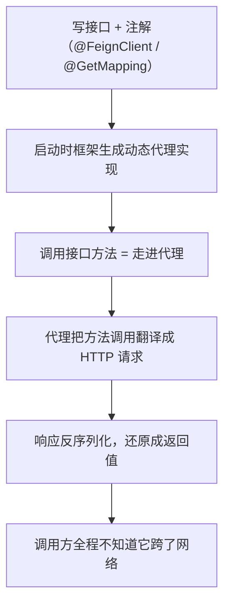
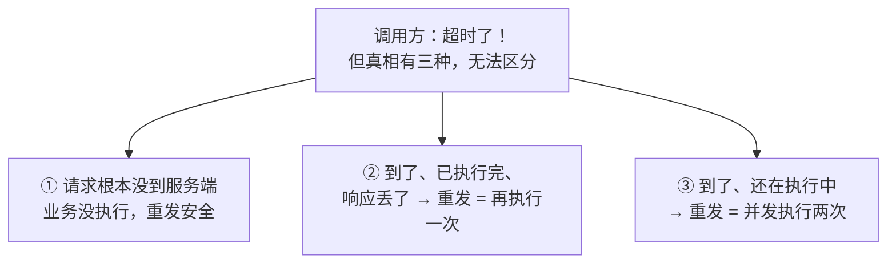
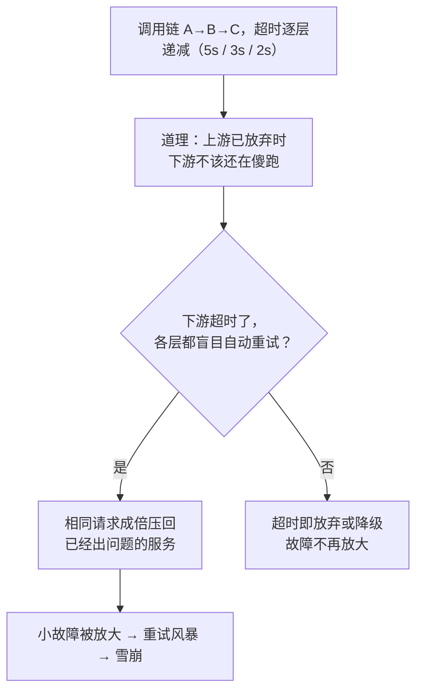
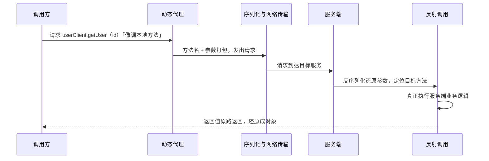
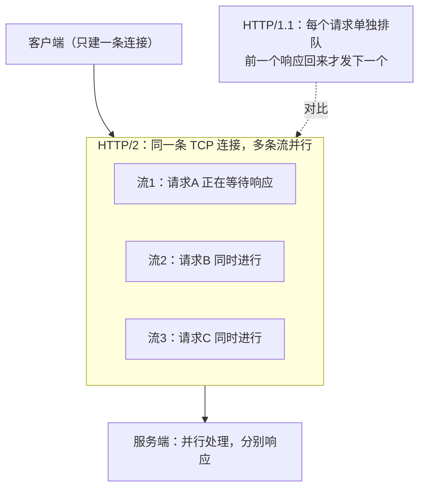
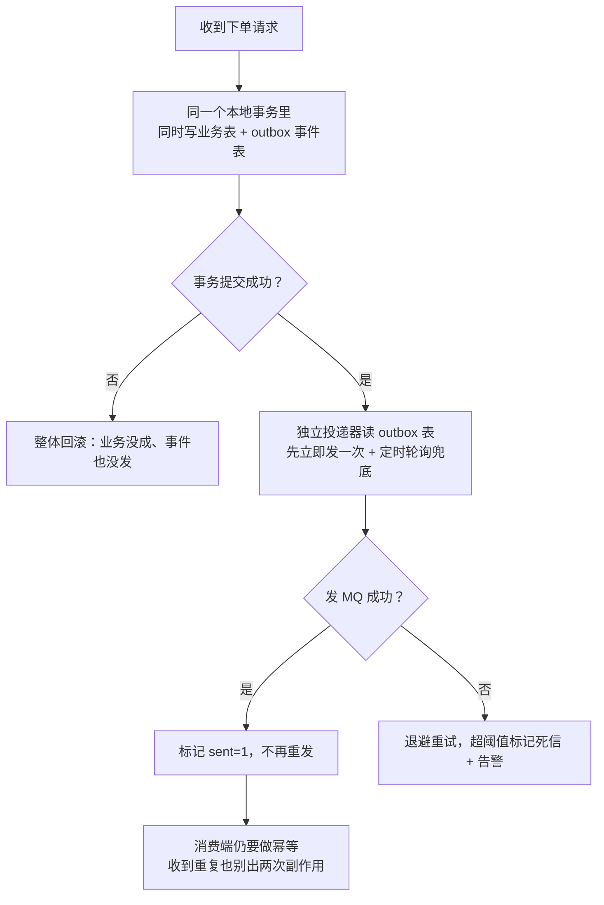

# 阶段四 · 小点 5：服务间通信与 RPC

> 所属：阶段四 微服务架构与分布式系统
> 定位：上一讲（DDD）划清了限界上下文的边界，这一讲回答**边界之间怎么说话**。同步（HTTP / RPC）与异步（事件）两条路线，加上各自的可靠性纪律——**通信的坑不在「怎么发」，在「超时了怎么办、重试了会不会重」**。

## 快速入门

> 本节为「服务通信速览」：一段代码看懂同步调用的样子；可靠性纪律、Outbox、Dubbo / gRPC 细节与服务网格留给正文。

### 本讲在解决什么问题

- **问题**：拆成微服务后，服务 A 怎么调服务 B？两条路线——同步（HTTP / RPC，调用方等结果）和异步（事件，发完就走）。
- **难点不在「怎么发」**：发一个 HTTP 请求人人都会。难在失败语义——超时了怎么办？自动重试会不会把一单下成两单？异步消息发一半崩溃了算不算发出去？
- **你要带走的一句话**：同步调用要配**超时 + 重试 + 幂等**三件套；异步通信用 **Outbox** 保证「落库与发事件原子」。**通信的可靠性纪律比通信方式更重要。**

### 本讲关键词速查

| 关键词 | 一句话大白话 | 最易踩的坑 |
|-|-|-|
| 同步调用 | A 调 B，等结果回来才能继续（HTTP / RPC） | 默认超时 60 秒 + 无熔断，慢下游拖死上游 |
| 异步通信 | A 发消息就返回，不等结果（事件 / MQ） | 发得出去 ≠ 对方收到：要 Outbox + 消费幂等 |
| OpenFeign | 写接口加注解 = HTTP 客户端，像调本地方法 | 注解要与对方 Controller 一字不差，否则 404 |
| RPC | 像调本地方法一样调远程（Dubbo / gRPC） | 远程 ≠ 本地：会超时、会重、会丢 |
| gRPC | 高性能跨语言 RPC（HTTP/2 + Protobuf） | 调试不如 HTTP 直观，契约变更要重新生成代码 |
| Protobuf | Google 的跨语言「数据结构定义 + 序列化」，.proto 即契约 | 字段编号改了 = 新旧代码互不兼容 |
| 幂等 | 同一请求执行 N 次，效果与执行 1 次相同 | 配了重试不做幂等 = 两笔订单 |
| Outbox | 落库与发事件放进同一个本地事务 | 裸写「存库 + 发消息」，一崩溃就丢事件 |
| 事件驱动 | 发事实、谁关心谁订阅（如 OrderPaid） | 事件可能重复到达，消费端仍要幂等 |
| Dubbo 3 | 国内存量 RPC，协议 Triple（兼容 gRPC） | 深度治理特性，学习阶段不用碰 |
| 服务网格 | 通信治理下沉到 Sidecar 代理，应用零改造 | 中小团队上它是背运维债 |

### 最简示例：OpenFeign 长什么样

```java
// order-service（调用方）：声明一个接口，它就是 HTTP 客户端
@FeignClient(name = "user-service")
public interface UserClient {
    @GetMapping("/user/{id}")                      // 路径、参数名与对方 Controller 一字不差
    UserDTO getUser(@PathVariable("id") Long id);
}

// 使用：像调本地方法一样发起远程调用
@Service
public class OrderService {
    private final UserClient userClient;          // 注入即用

    public OrderVO detail(Long orderId) {
        var order = orderRepo.find(orderId);
        return new OrderVO(order, userClient.getUser(order.userId()));   // 远程调用
    }
}
```

> 代码备注：
> - `@FeignClient(name = "user-service")`：声明调用哪个服务——按**服务名**，由注册中心（一张「服务名 → 地址列表」的登记簿，详见阶段四第 2 讲）翻译成实际地址。
> - `@GetMapping` 的路径、参数名**必须与对方 Controller 一致**——不一致就是 404 / 400，这不是 Bug，是机制（心智模型：**Feign 接口 = 对方 Controller 的客户端侧抄写**）。
> - `userClient.getUser(...)` 背后是网络调用，会失败 / 超时——所以必须配**超时、重试、幂等**（第 2 节展开）。
> - 怎么跑起来（依赖、开关、被调方长什么样）见正文第 1 节。

> **前端对照**：你一定封装过 `userApi.getUser(id)`——把 axios 藏进模块，让组件不摸 URL。Feign 做的是同一件事，只是连 `userApi.ts` 这层封装都由框架从接口注解**生成**。

## 精简大纲

**本讲知识地图**——同步与异步两条路；可靠性纪律横切所有同步通信；服务网格把治理下沉（两种路线通用）：



1. OpenFeign：声明式 HTTP 客户端（主线）
2. 同步调用的可靠性纪律：超时、重试、幂等（主线 · 全讲灵魂）
3. Dubbo 3 与 gRPC：RPC 的另外两条路（⏸️ 跳读）
4. 异步通信：事件驱动与 Outbox（主线）
5. 服务网格：把治理下沉到代理（⏸️ 知道边界即可）

## 学习内容详情

### 1. OpenFeign：声明式 HTTP 客户端

**OpenFeign**：写一个接口 + 注解，框架生成 HTTP 客户端——本质是**动态代理**（阶段一第 3 讲的回收：接口方法调用被 InvocationHandler 翻译成 HTTP 请求）。

> **生活版类比——「跑腿助理」**：你只要开口「要一份宫保鸡丁」，助理替你排队、点单、取餐、端回来。换成 Java：你只要调用 `userClient.getUser(id)`，动态代理就替你序列化参数、打包 HTTP 请求、发出、收响应、反序列化还原成对象——调用方全程摸不到「网线」。

**先补齐「能跑」的前提**——依赖与开关（新手最常见的卡点）：

```xml
<dependency>
    <groupId>org.springframework.cloud</groupId>
    <artifactId>spring-cloud-starter-openfeign</artifactId>
</dependency>
```

```java
@SpringBootApplication
@EnableFeignClients   // 打开开关：带 @FeignClient 的接口被生成代理、注册为 Bean
public class OrderApplication { }
```

**再对照着看「两页代码」**——Feign 接口 = 对方 Controller 的客户端侧抄写：

```java
// 第 1 页：被调方（user-service）的 Controller —— 它先存在，没有任何配合 Feign 的代码
@RestController
public class UserController {
    @GetMapping("/user/{id}")
    public UserDTO getUser(@PathVariable("id") Long id) { /* ... */ }
}

// 第 2 页：调用方（order-service）的 Feign 接口 —— 注解是从第 1 页「抄」过来的
@FeignClient(name = "user-service")
public interface UserClient {
    @GetMapping("/user/{id}")
    UserDTO getUser(@PathVariable("id") Long id);
}
```

> **注册中心在这个链路里的角色**：`name = "user-service"` 只是个名字——所有服务上线时向**注册中心**（「服务名 → 地址列表」的登记簿）登记，调用方按名查询拿到实例地址，再由负载均衡选一台发出去。细节在阶段四第 2 讲，本讲只需要知道「名字是这样被翻译成地址的」。

**先看「没有 Feign 的日子」**——before / after 对照，才知道「声明式」省了什么：

```java
// before：手拼 URL、手动反序列化 —— 路径是字符串，改接口靠全局搜索
// （Spring 家族的另外两个选择：RestTemplate 同步老牌、WebClient 响应式——本讲不展开）
String url = "http://user-service/user/" + order.getUserId();
UserDTO user = restTemplate.getForObject(url, UserDTO.class);

// after：声明接口，注解即契约 —— IDE 能跳转、能重构、能搜引用
UserDTO user = userClient.getUser(order.getUserId());
```



### 2. 同步调用的可靠性纪律：超时、重试、幂等

**这一节是全讲的灵魂**：「怎么发」上一节已经会了，而服务间调用的事故，八成出在本节这三个词上。gRPC 的 deadline、网关的超时，全是同一套纪律的变体。

#### 2.1 超时的本质：结果不确定

超时发生的那一刻，真相只有三种，而你**无法区分**是哪一种：



- 情形① 重发无害；情形②③ 重发会把「一次下单」变成「两笔订单」。
- **角色分工由此而来**：发送方管**重试**（超时 / 失败后重发），接收方管**幂等**（Idempotency：同一请求执行 N 次，效果与执行 1 次相同）——**两个动作一起做才闭环**，缺哪一边都不成立。

> **前端对照**：表单防重复提交——提交后 disable 按钮、后端 token 校验。你早就在处理「用户手速版」的重复请求，本节处理的是「网络超时版」。

**幂等的实现三板斧**（阶段二第 3 讲的回收）：

- **业务键唯一索引**：请求带业务键（如订单号），插入时靠唯一约束兜底，冲突即重复——最简单可靠，创建类操作首选。
- **防重 token**：进页面先向服务端领一个一次性 token → 提交时带上 → 服务端校验并**用后即删**（如 Redis `del` 成功才放行）——重复提交带的是同一个 token，第二次删不到、被拒。适合防表单重复提交。
- **状态机**：订单只能「待支付→已支付→已发货」单向流转，重复操作因状态不匹配被拒绝——适合有明确生命周期的业务。

**幂等 vs 去重**（一对易混词）：去重是「同一条消息只处理一次」（MQ 消费侧 / 网关层做）；幂等是「同一请求处理 N 次，效果等于处理 1 次」（业务侧保证）。前者要求识别「是不是同一条」，后者要求效果收敛。

#### 2.2 配置落地：默认值全是坑

先分清**两种超时**——它们管的阶段不一样，2.3 的整个推理都建立在这个区别上：

- **连接超时（connectTimeout）**：管「还没连上」的阶段——TCP 建连的最大等待，建连慢说明网络或对方已经不对，**此时请求还没发出去**。
- **读超时（readTimeout）**：管「连上了、请求已发出」的阶段——等响应回来的最大等待，一旦超时就进入「结果不确定」（回到 2.1 的三种情形）。

Feign 的默认超时与重试都不可依赖，必须显式配：

```yaml
feign:
  client:
    config:
      user-service:
        connectTimeout: 1000      # 连接超时 1s：建连慢说明网络/对方已不对
        readTimeout: 3000         # 读超时 3s：上限 = 调用方自己的 RT 预算(网关 5s 就不能给对方 6s)
        loggerLevel: basic
  httpclient:
    enabled: true                 # 换 Apache HttpClient 连接池(默认 URLConnection 无复用)
    max-connections: 200
spring:
  cloud:
    loadbalancer:
      retry:
        enabled: true             # 打开实例级重试(详见 2.3 的边界澄清)
        max-retries-on-same-service-instance: 0     # 坏机器不恋战
        max-retries-on-next-service-instance: 1     # 换一台试一次
```

> **红线（必答）**：配了重试的接口，设计上必须配合**幂等**（防重 token / 唯一索引 / 状态机，阶段二第 3 讲的三板斧）——一次超时重试就是两笔订单。

> **为什么要换连接池**：每次 HTTP 调用都要先建连——TCP 握手（HTTPS 还要再叠 TLS 握手），这是真实的时间成本。连接池让连接建完不销毁、留着复用；默认的 URLConnection 无复用，高并发下每次调用都重新握手。

**默认值的坑有多具体**：Feign 默认读超时 60 秒起步且无熔断——你的**网关**（Gateway：系统统一入口，外部请求先进网关，由它做路由、鉴权、限流——也是 RT 总预算的持有者）对外承诺 5 秒，内部却允许傻等 60 秒：用户早就刷新重试了，僵尸请求还在占用线程，**一个慢下游就这样拖死上游整个线程池**（雪崩的标准起点）。

#### 2.3 「换一台重试就安全」吗——一个容易形成的错误心智

先补一个部署常识：**一个服务通常部署多份**（多实例——比如 user-service 跑 3 个容器共同提供服务），负载均衡器把请求在实例之间分配——YAML 里说的「换一台」，换的就是实例。负载均衡层的重试常被注释成「实例级重试（换一台）安全」，这句话**有边界**：

- **连接失败**（请求没发出去，如连接被拒、机器已挂）：换一台重发，业务不会重复执行——这才是「安全」的完整语义。
- **读超时**（请求已发出、对方可能已处理，只是响应没回来）：换一台重试 = 重发一次业务请求，和同机重试**一样危险**，照样可能两笔订单。
- 所以严谨的纪律是：**连接失败重试安全；读超时重试，无论换不换机器，都以「操作幂等」为前提**。GET 只读、天然幂等，所以很多默认策略对 GET 宽松、对 POST 保守。

#### 2.4 RT 预算：超时逐层递减

先定义缩写：**RT（Response Time，响应时间）**= 一次请求从发出到收到响应的总耗时；**RT 预算** = 这条链路允许花掉的时间总量。「5s / 3s / 2s」这些数字从哪来？不是拍脑袋——**每一层都是给上游留出来的缓冲**：

```text
用户体感：页面几秒没反应就开始烦躁，业界经验 3~5 秒是忍耐带
→ 网关层对外承诺 5s（整条链路的总预算）
→ A 调 B 时给 B 3s：自己留 2s 处理业务 + 网络往返
→ B 调 C 时给 C 2s：同理再留缓冲
规则：下一层超时 ≤ 上一层超时 −（本层处理时间 + 网络往返）
```

反过来配（网关 5s、A 却给 B 6s）会发生什么：**上游都超时放弃了，下游还在傻跑**——用户已经看到错误页，请求却在路上继续消耗资源；用户一重试，新旧请求叠加，把故障滚大。

> **生活版类比——「接力赛」**：第一棒 5 秒内交付、第二棒 3 秒、第三棒 2 秒，接不到就放弃，别傻等到底，否则整队卡死。换成服务调用：上游先放弃，下游若还在白耗，故障就会滚起来。



#### 2.5 重试风暴：三层重试 = 27 倍流量

**重试风暴（Retry Storm）**：每一层都超时重试、层层放大，故障时流量反而成倍涌向已经出问题的服务。放大是乘法不是加法——设每层超时后各重试 2 次（每层实际发起 3 份请求）：

```text
用户 1 次请求
→ 网关层重试后 3 份打到 A
→ A 层各自重试后 9 份打到 B
→ B 层各自重试后 27 份打到 C
故障时 27 倍流量全部涌向已经出问题的服务——小故障滚成雪崩
```

**止血阀一：每层限重试 1 次**（放大从 27 倍降到 8 倍）。

**止血阀二：熔断（Circuit Breaker——主场在阶段四第 2 讲的 Sentinel，这里先立住概念）**——电路保险丝的思想：

```text
连续失败达到阈值 →「跳闸」：一段时间内直接拒绝请求、快速失败，不再打向下游
→ 冷却期过后「半开」：放一个试探请求进去
   → 成功 → 恢复（正常放行）；失败 → 继续跳闸
```

与重试的分工：**重试治「偶发失败」（值得一试），熔断治「持续故障」（别再试了）**。跳闸期间配合**降级（fallback）**——返回兜底结果（默认值 / 缓存 / 友好提示）而不是直接报错，用户至少还能用。

**治本是那个角色分工**——重试配幂等，让「多发」不等于「多执行」。

### 3. Dubbo 3 与 gRPC：RPC 的另外两条路

**RPC（Remote Procedure Call，远程过程调用）**：让调用方像调本地方法一样调远程服务。框架代劳的事：方法名与参数的序列化、网络传输、对端反序列化、定位方法、执行、返回值还原——调用方只看到「接口方法」这一头。

**gRPC**：Google 开源的 RPC 框架，两大底座——**HTTP/2**（传输）+ **Protobuf**（序列化格式）。

**两者不是并列关系**：RPC 是「像调本地方法一样调远程」这个**模式**，gRPC 是这个模式下的**一个具体框架实现**——不是同一层的两个选项。

> **前端对照**：RPC 之于 gRPC，如同「组件化」思想之于 React——前者是解法的心智，后者是拿来即用的产品。问「RPC 和 gRPC 有什么区别」，相当于问「组件化和 React 有什么区别」。

**三者关系**：OpenFeign 本质也是一种 RPC（HTTP + JSON 协议版），只是把「描述接口」做成了声明式注解；Dubbo 与 gRPC 则在这个方向上做到更强的性能与契约治理。

> **白话补课——序列化**：把对象「打包」成能上网络的字节串，到对端再按格式「拆箱」还原成对象。类比寄快递：装箱寄出、拆箱收货，两头是同一个物件，中间只是箱子。下图的每一棒都由框架代劳。



**gRPC 的三大卖点**——每一条都能对应到下面的展开：

**卖点一：Protobuf 二进制序列化**——先认识 Protobuf 本身，再看它为什么省。

**Protobuf 是什么**：Google 出的语言无关「数据结构定义 + 序列化」机制——.proto 文件里定义数据（message）与服务（service），编译器据此生成各语言代码：

```proto
syntax = "proto3";

message User {                 // message：定义数据长什么样
  int64 id = 1;                // = 1 是字段编号（tag），不是默认值 —— 省流量的秘密
  string name = 2;
}

message DeductReq {            // service 方法用的请求/响应类型，也都由 message 定义
  string sku_id = 1;
  int64 quantity = 2;
}

service Inventory {            // service：定义服务有哪些方法（四种流的完整示例见卖点三）
  rpc Deduct(DeductReq) returns (DeductRes);
}
```

> **前端对照**：`message User` ≈ 你写 TS 的 `interface User { id: number; name: string }`——差别只是每个字段带编号。

**工作流**：.proto（唯一契约）→ protoc 编译器 / Maven 插件 → 生成 Java / Go / TS 的类与桩代码 → 双方都引用生成的代码，谁也不会手写出「和对方不一致」的客户端。

**那它为什么「更省更快」**：

```text
JSON：     {"userId":42}    → 13 字节，其中 "userId" 这个字段名每次都全量传输
Protobuf： 字段 1 = 42      → 2 字节：1 个 tag 字节（「这是 1 号字段，整数类型」）+ 1 个变长整数
省的根源：双方各持同一份 .proto —— 字段名不上网络，用编号（tag）指代；数字用变长编码
变长整数（varint）：小数字 1 个字节装下、大数字才多用几个字节 —— 42 一个字节就够
```

**卖点二：HTTP/2 多路复用**（阶段一第 10 讲的回收）：单 TCP 连接多请求并行，应用层不再队头阻塞——高吞吐的物理基础。

> 但注意「TCP 层除外」这个尾巴，它值得展开：HTTP/2 只消除了**应用层**的排队，多条流仍然共享**同一条 TCP 连接**——一旦丢包，TCP 必须等重传补齐才能继续交付数据，**所有流一起停**（TCP 层的队头阻塞）。这个尾巴正是 HTTP/3 改用 QUIC（基于 UDP 重造的传输层，丢包只影响对应的流）的动机——知识在这里有出口，后续阶段再展开。

> **生活版类比——「一条宽车道」**：HTTP/1.1 像单车道收费站，一辆车（一个请求）过完、下一辆才能上——这就是队头阻塞；HTTP/2 像一条多车道高速，多辆车（多个请求）并排上路互不挡道。换成服务调用：客户端与服务端只建一条 TCP 连接，多个请求的「流」在上面并行跑。



**卖点三：IDL 契约先行**——.proto 文件即契约，工具生成各语言强类型客户端与服务端**桩代码**（stub：按契约生成的接口壳——序列化与网络细节齐全，业务逻辑留空等你填），多语言团队不会出现「接口文档和实现不一致」：

```proto
// gRPC: 契约即 .proto, 代码生成强类型客户端 —— 与 tRPC 契约思想同宗(阶段七回收)
// 下面 DeductReq / StockEvent 等类型的定义方式见卖点一的 message 语法
syntax = "proto3";   // proto3 是当前主流语法版本
service Inventory {
  rpc Deduct(DeductReq) returns (DeductRes);            // 一元调用
  rpc Watch(WatchReq) returns (stream StockEvent);       // 服务端流: 库存变更推送
  rpc BatchSync(stream StockItem) returns (SyncAck);     // 客户端流: 批量上报
  rpc Chat(stream OrderMsg) returns (stream OrderMsg);   // 双向流
}
```

**四种流模式 × 前端对应物**——gRPC 把「流」做进了类型系统：

| 流模式 | 是什么 | 前端对应物 |
|-|-|-|
| 一元（Unary） | 一次请求、一次响应 | 普通 fetch / axios |
| 服务端流 | 一次请求、持续多条响应 | SSE（概念接近，但协议与连接模型不同，心智别直接平移） |
| 客户端流 | 持续多条请求、一次汇总响应 | 文件分片上传：一片片发、最后一次确认 |
| 双向流 | 两边随时互发 | WebSocket 聊天 |

> **deadline**：gRPC 的超时叫 deadline（整条调用最晚完成时间，超了强制放弃），客户端 `withDeadlineAfter` 当纪律用——同一套 RT 预算思想（第 2 节），换了个名字。

**三框架怎么选**——学完三个卖点，现在可以横向比了：

| 维度 | OpenFeign | Dubbo 3 | gRPC |
|-|-|-|-|
| 协议 | HTTP/1.1 + JSON | Triple（**兼容 gRPC**）+ 自有 TCP | HTTP/2 + Protobuf |
| 定位 | 生态默认、上手即会 | 国内老牌企业大量存量、高性能 | 跨语言 / 云原生标准 |
| 服务发现 | 复用注册中心（如 Nacos） | **应用级服务发现**（注册数据量降一个数量级） | 需自配（K8s Service 等） |
| 选型依据 | 简单性 | 性能 + 治理能力 | 多语言 + IDL 契约 |

> 注：**Nacos** = 阿里开源的「注册中心 + 配置中心」产品，Spring Cloud Alibaba 全家桶成员；**Triple** = Dubbo 3 的默认协议，基于 HTTP/2、能与 gRPC 生态互通；**应用级服务发现** = 注册信息从「接口级」改为「应用级」，注册数据量降一个数量级；**K8s Service** = K8s 内置的「服务名 → 一组 Pod」寻址与负载均衡机制；**IDL**（Interface Definition Language，接口描述语言）= 先写一份各语言都能读懂的服务合同，再由工具生成各语言的强类型代码。

> ⏸️ **短期可以不学**：Dubbo 3 的深度治理特性——SPI 扩展机制（JDK 内置的服务发现接口，知道存在即可）、**泛化调用**（不依赖服务方接口包、直接以方法名字符串发起调用，网关与测试平台这么用）、分组路由、多注册中心。**何时回来学**：公司技术栈是 Dubbo（国内老牌企业常见存量），你要在生产里用它的治理能力时。**面试最低要求**：知道 Dubbo 3 协议是 Triple（兼容 gRPC）、有应用级服务发现、性能强，选型时能说出它与 Feign 的分工。

> ⏸️ **短期可以不学**：gRPC 的工程深水区——拦截器（Interceptor，**前端对照：axios interceptor 同款位置**，请求 / 响应管道上的横切钩子）、流式**背压**（backpressure：下游处理不过来时反向通知上游「慢点发」）、负载均衡策略、deadline 传播细节。**何时回来学**：公司真用 gRPC 做跨语言高性能通信、你要上手写服务时。**面试最低要求**：说出「HTTP/2 + Protobuf 强类型契约 + 四种流模式」三大卖点，以及它适合跨语言的原因。

### 4. 异步通信：事件驱动与 Outbox

**事件驱动（Event-Driven）**：服务间不点名调用，而是「发事实、谁关心谁订阅」——积分 / 物流 / 通知各自监听 `OrderPaid`，新增订阅方零侵入（依赖方向反转：新增接收方时，发送方一行代码不用改）。**异步化还能削峰**——瞬时高峰先落进队列，消费端按自己的节奏慢慢消化，主链路不被打爆。

**先问「该不该异步」**——同步改异步决策清单：

| 判定 | 场景 |
|-|-|
| **必须同步**（用户在等） | 支付结果确认、库存最终判定 |
| **可异步** | 通知、积分、日志、报表统计 |
| **拿不准** | 先同步——异步化引入的对账成本别低估 |

> 注：「对账」= 定期核对两边数据是否一致（如「已支付订单数」对「积分流水数」），发现差异后补偿——它是异步「最终一致」的安全网，异步化越深、对账越重要。

#### 4.1 发送侧：Outbox 模式

**问题**：「本地事务成功」与「事件发出」怎么原子？裸写 `save(); publish();`——publish 前崩溃 = 事件丢；publish 后崩溃 = 状态不一致。标准答案是 **Outbox（事务性发件箱，Transactional Outbox）模式**：把「发消息」降级成「写一张表」，原子性交给数据库。

> **生活版类比——「草稿箱」**：你编辑邮件但没点发送，内容先存进草稿箱，确认真正发出后再删草稿。换成 Outbox：业务落库时把「要发的事件」一起写进 outbox 表，同库同事务——要么业务和事件都成、要么都回滚；投递器再把草稿（待发事件）慢慢发出，发完标记已发。

```java
// Outbox 模式: 把"发消息"降级成"写一张表" —— 与业务同一个本地事务, 原子性由 DB 保证
@Transactional
public void placeOrder(OrderCmd cmd) {
    orderRepo.save(cmd.toOrder());
    outboxRepo.save(new OutboxEvent("OrderPlaced", cmd.id(), json(cmd)));  // 同库同事务: 要么都在要么都没
}

// 独立投递器(定时轮询 / 事务提交后触发): 读 outbox → 发 MQ → 成功标记 sent
@Scheduled(fixedDelay = 5000)
public void relay() {
    outboxRepo.findUnsent(100).forEach(e -> {          // 批量限流防放大
        try { mq.send(e.topic(), e.payload()); e.markSent(); }
        catch (Exception ex) { e.retryCount++; if (e.retryCount > 10) e.markDead(); }  // 毒事件见下
    });
}
```

```sql
CREATE TABLE outbox_event (
    id          BIGINT PRIMARY KEY,
    topic       VARCHAR(64)  NOT NULL,
    payload     JSON         NOT NULL,
    status      TINYINT      NOT NULL DEFAULT 0,     -- 0 待发 1 已发 2 死信
    retry_count INT          NOT NULL DEFAULT 0,
    created_at  DATETIME     NOT NULL,
    INDEX idx_status_created (status, created_at)     -- 轮询走索引, 别全表扫
);
```

**毒事件的闭环**（poison message，一处理就报错、永远发不出去的事件）：重试超阈值后**不能无限重试**——标记为**死信**（dead letter，无法成功处理的消息；MQ 里专门存放死信的地方叫死信队列 DLQ）并告警，人工排查修复后重放。Outbox 的优势在这里兑现：事件都躺在表里，**可重放**——重放只是把 status 改回待发。

**投递节奏**：事务提交后先立即投递一次（毫秒级可见），轮询只做兜底（秒级）——间隔太密只是白给 DB 加压。这个「立即 + 兜底」的混合方案，就是思考题 2 的答案伏笔。

**失败重试要「退避」（backoff）**：每次失败后等待时间指数拉长（1s → 2s → 4s…）再重试，而不是立刻猛重——给正在恢复的下游留出喘息时间，否则重试本身就演一场小型重试风暴。

**事件顺序的暗坑**（进阶，知道即可）：outbox 表按写入顺序天然有序，但消费端并行处理时，同一订单的「已创建」可能晚于「已取消」被处理——需要让同一业务键的事件总由同一个消费者按序处理，或业务上容忍乱序。

#### 4.2 接收侧：订阅与消费幂等

事件驱动的另一半——**订阅方怎么收**（以 RocketMQ 为示意，注解形式随所选 MQ 而异）：

```java
// 消费端: 谁关心谁订阅 —— 新增订阅方对发送方零侵入(这是事件驱动的核心收益)
@Component
@RocketMQMessageListener(topic = "order-paid", consumerGroup = "points-service")
public class OrderPaidListener implements RocketMQListener<OrderPaidEvent> {

    @Override
    public void onMessage(OrderPaidEvent event) {
        // 消费幂等: 业务键唯一索引兜底 —— orderId 撞唯一索引 = 处理过, 忽略即可
        pointsRepo.save(new PointsRecord(event.orderId(), event.userId(), 100));
    }
}
```

> **为什么消费端必须幂等——「至少一次投递」（at-least-once）**：投递器为了保证「不丢」，失败会重发——所以同一事件**至少**到达一次，也可能多次。分布式下「投不丢」与「只投一次」不可兼得：要做到「恰好一次」（exactly-once）需要跨系统的全局协调，代价极高。工程标准解就是「**至少一次 + 消费端幂等**」——与阶段三第 5 讲（消息队列）的 MQ 幂等是同款纪律。

**`consumerGroup` 是什么——消费组（consumer group）**：**同组分摊**（一条消息只投给组内一个消费者）、**异组各投一遍**（每个组都完整收到）。套进上面代码：积分服务（points-service）和通知服务是**两个组**——各自都要收到 `order-paid`；而积分服务部署 2 台实例时，这 2 台是**同一个组**——一条消息只被其中一台消费，不会加两次积分。

**事件 schema 演进**（半句纪律）：事件要加字段时，消费端必须能容忍**未知字段**（向前兼容）——纪律是「只加、不改、不删字段」；老消费端一收到新字段就炸，通常是容错没做好。

> **前端对照**：PWA 离线队列——断网时先把请求写进 IndexedDB，联网后重放同步。「先落本地存储、再异步投递」，这就是前端的 Outbox。

#### 4.3 同一问题的另一种解：RocketMQ 事务消息

- **半消息** = 先发一条对方暂不可见的中间消息，本地事务成功 commit 后才对消费者可见；**回查** = MQ 主动反问「你那个本地事务到底成没成」。
- **选型对比**：

| 维度 | Outbox | RocketMQ 事务消息 |
|-|-|-|
| 投递延迟 | 立即投递毫秒级 + 轮询兜底秒级 | 实时 |
| MQ 绑定 | 不绑定任何厂商 | 强耦合 RocketMQ |
| 可重放 | 事件在表里，天然可重放 | 依赖 MQ 自身机制 |
| 额外成本 | 一张表 + 一个投递器 | 学习半消息 / 回查机制 |



### 5. 服务网格：把治理下沉到代理

- **Istio / Envoy 的 Sidecar 模式**：每个 Pod 旁挂一个代理，接管进出流量——mTLS（双向 TLS 认证：客户端与服务端互验证书，防中间人。**内网 ≠ 免认证**——服务之间也要验对方身份，mTLS 是它平台化的答案）、重试 / 熔断 / 超时、流量镜像（复制一份影子流量打新版本）、全链路追踪都从「代码配置」变成「平台能力」，**应用零改造**。
- **适用边界**：收益出现在「多语言 / 大组织统一治理」；代价是每个 Pod 多一个代理（资源 + 延迟 + 运维复杂度）。**中小团队优先 Spring Cloud Gateway + K8s 原生能力**——别为了「先进」背 Sidecar 的运维债。

> **前端对照**：Service Worker 拦截页面所有请求做缓存、重试——应用代码零感知。「能力下沉到代理层」这件事，在浏览器里你已经见过一次。

> ⏸️ **短期可以不学**：服务网格（Service Mesh）的深入——Istio / Envoy 的 Sidecar 配置、VirtualService / DestinationRule 规则、mTLS 与流量镜像的落地。本讲只需理解「把通信能力下沉到代理、应用零改造」的边界。**何时回来学**：公司真有多语言、大组织统一治理的诉求要上服务网格时。**面试最低要求**：一句话说出 Sidecar 模式是什么、收益（治理能力平台化、应用零改造）与代价（资源 + 运维复杂度）。

## 坑点提醒

- **循环依赖调用**：A→B→A（Feign 互调）= 分布式死锁（A 在等 B 的响应、B 同时也在等 A——互相卡死还各占着超时窗口）+ 超时嵌套——用事件解耦或下沉公共依赖。
- **事件回环**：A 发的事件触发 B 的处理，B 处理完又发事件触发 A——异步世界的循环依赖，比同步版更隐蔽（没有明显的调用栈可看）。防法：事件携带来源标识 / 处理方记录「已处理过」。
- **服务名与路径前缀对不上**：被调方若配置了 MVC 前缀（如 `spring.mvc.servlet.path=/api`），Feign 的 URL 或路径声明必须带上——本地能调通、上环境 404，先查两边的路径前缀和服务名。
- **跨服务超时难排查**：两个服务各自的日志没有关联就是黑盒——**trace id**（请求在入口生成、沿途每跳携带传递的关联 ID）把整条链路的日志串起来，配合各跳耗时打点，才能定位慢在哪一段（链路追踪的展开在阶段五第 4 讲·可观测性体系）。

## 本节自检

- [ ] 能推演「超时的三种情形」，并说清「发送方配重试、接收方配幂等」为什么缺一不可
- [ ] 能说出 Feign 接口与被调方 Controller 的「抄写」关系；调不通时知道先查两边的注解与路径前缀
- [ ] 能对比 OpenFeign / Dubbo 3 / gRPC 的协议与选型依据
- [ ] 能画出 Outbox 模式的完整流程，说清它用什么机制保证了什么原子性、为什么消费端还要幂等
- [ ] 能说出服务网格的能力清单与「中小团队不用它」的两个理由
- [ ] 能解释 gRPC 为什么适合跨语言，说出 .proto → 生成代码的工作流，四种流模式各对应前端的什么交互
- [ ] 能说出熔断的生命周期（跳闸 → 冷却 → 半开 → 恢复）、它与重试的分工、降级在其中的角色

## 本节配套思考题

1. 「同步 RPC 改异步事件」的决策清单：哪些调用可以异步化（下单后发通知），哪些必须同步拿结果（支付要等回执）？依据是什么？
2. Outbox 轮询间隔设 1s——对「用户体感」意味着什么？为什么「事务提交后立即尝试发一次 + 轮询兜底」的混合方案更常见？
3. 你的服务间调用链里，「超时预算递减」怎么在网关 / Feign / DB 三层各设一个具体数字（给出你项目的接口场景）？

## 常见面试题

### Q1：接口幂等性为什么必须做？常见的三种实现方式怎么选？

**标准结论**：网络超时的本质是「结果不确定」——请求可能没到、也可能到了但响应丢了（超时的三种情形），自动重试会把同一个操作执行多次。对「创建 / 扣减」类非幂等操作，重试两次就是两笔订单、扣两次款，所以配了重试就必须配幂等。

**底层原理**：幂等是「效果等价」，不是「执行一次」——靠业务侧的状态与唯一性约束，把重复执行的效果收敛成一次。
- 唯一索引（防重表）：请求带业务键（如订单号），插入时靠唯一约束兜底，冲突即重复——最简单可靠，适合创建类。
- token 机制：前端先取 token，提交时校验并消费——适合防止表单重复提交。
- 状态机：订单只能「待支付→已支付→已发货」单向流转，重复操作因状态不匹配被拒绝——适合有明确生命周期的业务。

**工程实践**：三种实现可以组合，唯一索引是最通用的底座。

### Q2：同步调用和异步消息怎么选？哪些场景必须同步？

**标准结论**：判断标准只有一个——**用户是否在等这个结果**。
- **必须同步**：支付结果确认、库存最终判定、登录鉴权——业务下一步依赖这个结果，异步会把不确定性抛给用户。
- **可异步**：通知、积分、日志、报表统计——主链路之外、结果可延迟，异步化还能削峰、解耦、让主链路更快。

**底层原理**：同步是「强依赖」——调用方必须拿到结果才能继续，链路上任何一个服务慢都会放大成用户等待；异步是「弱依赖」——发完事件就返回，接收方各干各的，代价是从「强一致」退化为「最终一致」，需要补对账。

**工程实践**：拿不准就先同步——异步化引入的对账成本、事件丢失排查成本别低估；已上异步的系统，投递可靠性用 Outbox 保证「落库与发事件原子」。

### Q3：Outbox 模式解决什么问题？和 RocketMQ 事务消息怎么选？

**标准结论**：Outbox（事务性发件箱）解决「本地事务成功」与「事件发出」的原子性问题——业务表和 outbox 事件表**同库同事务**写入，原子性交给数据库。
- 独立投递器（事务提交后立即投一次 + 定时轮询兜底）读事件表发 MQ：成功标记 sent，失败退避重试、超阈值标记死信等人工重放。
- 为什么不裸写 `save(); publish();`：publish 前崩溃事件丢，publish 后崩溃状态不一致。

**底层原理**：
- 数据库同事务保证：业务与事件「要么都在、要么都没」，原子性不依赖网络。
- RocketMQ 事务消息是同一问题的另一种解：先发半消息（对方暂不可见），本地事务成功后 commit，MQ 通过「回查」确认本地事务结果。

**工程实践（选型）**：
- Outbox：不绑定 MQ 厂商、事件可重放、实现与理解成本低；代价是多一张表和轮询延迟（秒级）。
- 事务消息：实时、无轮询；但强耦合 RocketMQ。
- 中小企业、已有 MQ 的场景优先 Outbox；注意消费端仍要做幂等（至少一次投递）——Outbox 保证的是「投递不丢」，不是「消费一次」。

### Q4：gRPC 为什么适合跨语言高性能通信？和 HTTP/REST、Feign 有什么区别？

**标准结论**：gRPC 的三大卖点——二进制、多路复用、契约先行。
- **Protobuf 二进制序列化**：比 JSON 更紧凑、编解码更快（字段名不上网络，用编号指代）。
- **HTTP/2 多路复用**：单条 TCP 连接并行多个请求，省去频繁建连——高吞吐的物理基础。
- **IDL 先行**：.proto 文件即契约，用工具生成各语言的强类型客户端与服务端桩代码，多语言团队不会出现「接口文档和实现不一致」。

**底层原理（与 Feign/REST 的区别）**：REST 面向资源、用 JSON、可读性好、调试方便，适合对外 API 和对内简单调用；gRPC 面向方法、强类型、性能好，适合内部服务间高吞吐通信和多语言场景，代价是契约变更要重新生成代码、调试工具不如 HTTP 直观。

**工程实践**：Java 生态内部服务间默认 Feign + 注册中心即可，gRPC 用在性能敏感或跨语言（如 Go/Java 混部——不同语言的服务跑在同一集群）的场景。
