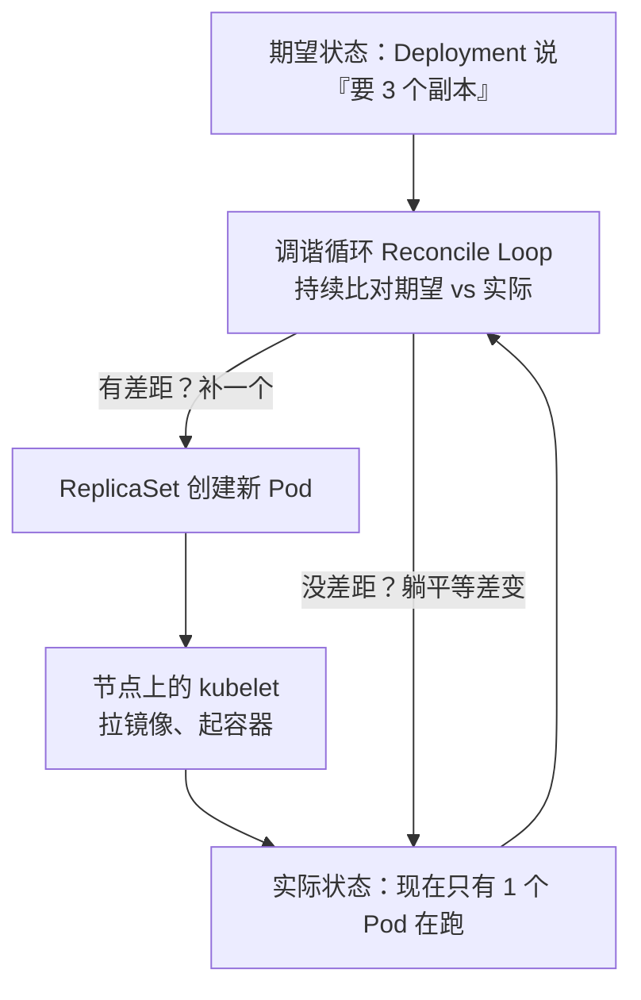
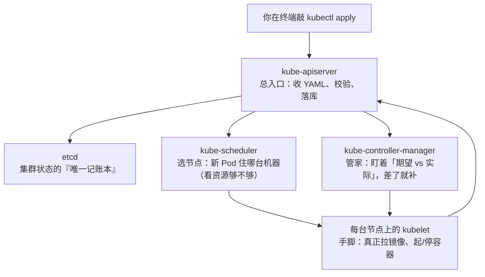
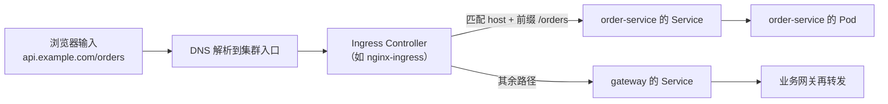
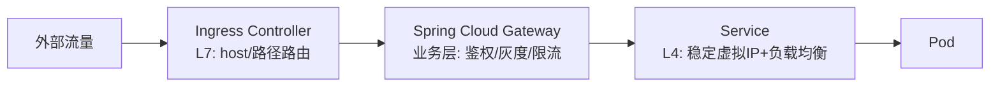
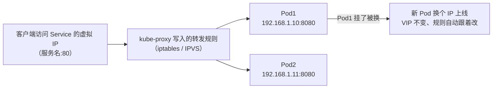
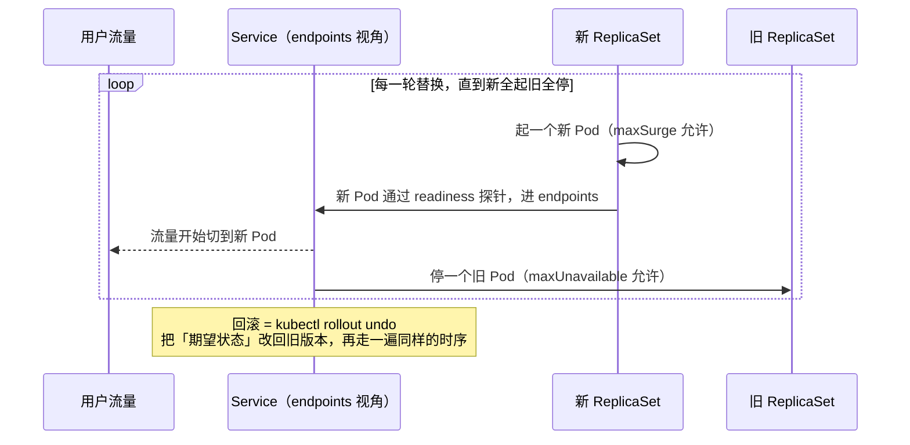

# 阶段五 · 小点 2：Kubernetes

> 所属：阶段五 云原生与运维工程
> 定位：常见的容器编排平台。目标不是「会背对象清单」，而是掌握三件事：核心对象的心智模型、Spring Boot 上 K8s 的适配点、以及一套可复用的故障排查路径。

## 快速入门

> 本节为「K8s 速览」：先认识 K8s 是什么、解决什么问题、几个核心对象；「网络边界、发布策略」留在正文提高部分。

### 本讲关键词与概念速查

| 关键词 | 一句话大白话 | 例子 |
|-|-|-|
| Kubernetes（K8s） | 容器编排平台（管理大量容器） | 自动部署、扩缩、自愈 |
| Pod | K8s 最小运行单元（一个或多个容器） | 一个应用实例 |
| Deployment | 管理 Pod 副本（部署清单） | 声明要几个副本 |
| Service | 稳定的访问入口 | 负载均衡到 Pod |
| Ingress | 外部访问的入口（L7 路由） | 域名→Service |
| 探针 | 健康检查（liveness/readiness/startup） | 判断容器活没活/就绪没 |
| 滚动发布 | 逐个替换 Pod 更新 | 不中断服务升级 |
| HPA | 自动扩缩容 | 按 CPU 加副本 |
| Ingress Controller | 读取 Ingress 规则并实际转发流量的控制器 | 仅创建 Ingress 资源不会自动产生入口能力 |
| Pod phase | Pod 生命周期的高层摘要 | `Pending` / `Running`，不是完整故障状态机 |
| 容器状态与条件 | 单容器状态及 Pod 是否可接流量 | `Waiting` 原因、`Terminated` 退出码、`Ready` 条件 |

### 本讲在解决什么问题

- **问题**：容器多了不好管——谁来调度、扩缩、自愈、更新？K8s 负责编排：声明「要什么」，它自动让集群变成那个样子。
- **你需要明确的点**：**Pod** 是最小运行单元，**Deployment** 管副本，**Service** 提供稳定入口，**Ingress** 对外路由。核心是「声明期望状态，K8s 自动收敛」——你写 YAML 描述"要什么"，K8s 负责"变成那样"。

### 速览形态示意（非完整可部署清单）

> 示例只展示 Deployment、镜像与三类探针的关系；`registry/my-app:1.0` 是占位镜像，探针路径还依赖 Spring Boot Actuator 的依赖、暴露配置和健康分组。资源请求/限制、Service、权限与优雅停机均被省略，补齐并通过集群校验后才能部署。

```yaml
# Deployment: 声明这个应用要有 3 个副本, 用哪个镜像, 探针怎么探
apiVersion: apps/v1
kind: Deployment
metadata:
  name: my-app
spec:
  replicas: 3                       # 期望 3 个副本
  selector: { matchLabels: { app: my-app } }
  template:
    metadata: { labels: { app: my-app } }
    spec:
      containers:
        - name: app
          image: registry/my-app:1.0
          ports: [ { containerPort: 8080 } ]
          startupProbe:   # 慢启动保护: 启动期别掐
            httpGet: { path: /actuator/health, port: 8080 }
            initialDelaySeconds: 15
          readinessProbe: # 就绪才接流量
            httpGet: { path: /actuator/health, port: 8080 }
          livenessProbe:  # 挂了重启容器
            httpGet: { path: /actuator/health, port: 8080 }
```

> 代码备注（逐行解释）：
> - `replicas: 3`：期望 3 个副本，K8s 会保证始终有这么多个在跑。
> - `template`：定义每个 Pod 用哪个镜像、端口、探针。
> - **三种探针**：`startupProbe`（慢启动保护）、`readinessProbe`（就绪才接流量）、`livenessProbe`（挂了重启）——这是 Spring Boot 上 K8s 最关键的适配点（用 Actuator 的 `/actuator/health`）。
> - **声明式**：你只写"要 3 个、健康才接流量、挂了重启"，剩下的 K8s 自动调度——这就是「编排」的核心。

### 常用约定 / 命名提示

- **Spring Boot on K8s 适配**：探针用 Actuator 的 `/actuator/health`；优雅停机配 `preStop` + `gracePeriodSeconds`；容器资源写 request/limit。
- **故障排查三步**：先看状态（`kubectl get pods`）→ 看事件和日志（`describe`/`logs`）→ 定位是 CrashLoopBackOff/Pending/Service 不通。
- **安全基线**：K8s 网络默认全通，东西向要显式声明 NetworkPolicy；生产用 Pod Security（restricted）。

## 精简大纲

1. 从 Compose 到 K8s：为什么需要「编排」
2. 核心对象与第一个完整部署（Deployment + Service YAML 精读）
3. 网络三层边界：Service / Ingress / Gateway
4. 发布策略：滚动 / 蓝绿 / 金丝雀
5. Spring Boot on K8s 适配清单：探针 / 优雅停机 / 资源 / HPA
6. Helm 与故障排查路径
7. 安全基线：NetworkPolicy / PSS / 资源配额

## 学习内容详情

### 1. 从 Compose 到 K8s：为什么需要「编排」

- **Compose 管「一台机器上的多容器」**；**K8s 管「一堆机器上的大量容器」**：谁挂在哪台机器、挂了谁顶上、流量怎么找到它、发布怎么不中断——这四件事就是「编排」。

> 🧩 前置 30 秒：**声明式 vs 命令式**——生活版：你是来「点菜」还是来「给厨师一步步下指令」？点菜只说要什么结果，后厨自己切配、下锅、装盘；回到 K8s：你 `kubectl apply` 提交一张「订单」（YAML 期望状态），编排系统自己让集群变成那个样子。前端心智锚点就是 React：声明 UI 长什么样，框架负责 diff 并更新 DOM。

- **声明式 API**：你提交「期望状态」（YAML），K8s 的**控制器（Controller）**通过**调谐循环（Reconcile Loop）**持续把实际状态向期望收敛——类比 React 的 `setState`。控制回路长这样：



- **排障心法**：别问「我改了什么」，问「期望状态和实际状态差在哪」。
- **控制器是「带眼睛的循环」而不是一次性执行**：Pod 被杀它再拉起、节点挂了它把副本调度到别处——这就是「自愈」的底层机制。

### 2. 核心对象与第一个完整部署

> **先看全景：一个 K8s 集群由谁组成？** 分「控制面」（做决策的大脑）与「数据面」（干活的节点），各组件各司其职：



| 类别 | 对象 | 职责 |
|-|-|-|
| 工作负载 | Pod / Deployment / StatefulSet / DaemonSet / Job / CronJob | 运行单元与副本管理 |
| 服务发现 | Service / Ingress | 稳定访问入口 / 七层路由 |
| 配置存储 | ConfigMap / Secret / PV / PVC | 配置注入与持久卷 |

- **Pod**：最小调度单元 = 一个或一组共生容器（共享网络与存储）——生活版：一个 Pod 就像「合租的一套房」，里面的容器共享水电（网络）和楼道门禁（探针），要么一起住、要么一起搬。
- **Deployment → ReplicaSet → Pod**：Deployment 不直接管 Pod——副本数量交给它创建的 **ReplicaSet（副本控制器）** 去保证，Deployment 只负责版本演进（这三层关系是面试高频）。
- **StatefulSet**：管有状态服务（数据库类，稳定网络标识 + 顺序伸缩）。
- **DaemonSet**：每节点跑一个（日志采集器）。
- **Job / CronJob**：跑一次性 / 周期任务。
>
> ⏸️ **短期可以不学**：StatefulSet 的深入运维（扩缩容、备份恢复）只在自运维数据库 / 中间件时才需要——多数公司直接用云托管（RDS 等），主线理解概念即可。**何时回来学**：你需要自运维有状态服务、或面试目标岗位明确做中间件自研时。**面试最低要求**：能说出 StatefulSet 与 Deployment 的三个差异（稳定网络标识 / 顺序伸缩 / 独立持久卷）。

```yaml
# deployment.yaml：Spring Boot 服务的完整生产级声明（逐段注释）
apiVersion: apps/v1
kind: Deployment
metadata:
  name: order-service
  labels: { app: order-service }        # 标签是 K8s 一切"选中"机制的基础
spec:
  replicas: 3                            # 期望副本数（HPA 会改这个字段）
  selector:
    matchLabels: { app: order-service }  # Deployment 认领 Pod 的方式：按标签匹配
  strategy:
    rollingUpdate:
      maxSurge: 1                        # 滚动时最多多起 1 个新 Pod（控制峰值资源）
      maxUnavailable: 0                  # 滚动时最少可用数不减（零中断发布的关键）
  template:                              # Pod 模板：从这里开始描述"每个 Pod 长什么样"
    metadata:
      labels: { app: order-service }     # 必须匹配上面的 selector，否则认领失败
    spec:
      containers:
        - name: order
          image: harbor.local/apps/order-service@sha256:abc123   # 用 digest 锁定版本
          ports: [ { containerPort: 8080 } ]
          env:
            - name: SPRING_PROFILES_ACTIVE
              value: "prod"
            - name: DB_PASSWORD
              valueFrom:
                secretKeyRef:            # 密钥从 Secret 注入，不进镜像也不进 YAML 明文
                  name: order-db-cred
                  key: password
          resources:
            requests:                    # 调度依据：声明"我至少要多少"，调度器按此选节点
              cpu: 500m                  # 500m = 0.5 核
              memory: 1Gi
            limits:                      # 上限：超内存 → OOM Kill；超 CPU → 限流(不杀)
              cpu: "1"
              memory: 1536Mi
          startupProbe:                  # 启动保护：Java 启动慢，先等它起来再谈存活
            httpGet: { path: /actuator/health/liveness, port: 8080 }
            failureThreshold: 30         # 最多容忍 30 次失败(30×2s=60s 启动窗口)
            periodSeconds: 2
          livenessProbe:                 # 存活：失败就重启容器（治"假死"，如死锁）
            httpGet: { path: /actuator/health/liveness, port: 8080 }
            periodSeconds: 10
          readinessProbe:                # 就绪：失败就摘流量（治"忙不过来/依赖故障"）
            httpGet: { path: /actuator/health/readiness, port: 8080 }
            periodSeconds: 5
          lifecycle:
            preStop:                     # 优雅停机前半段：见第 5 节详解
              exec: { command: ["sleep", "10"] }
```

```yaml
# service.yaml：给这组 Pod 一个稳定入口
apiVersion: v1
kind: Service
metadata:
  name: order-service
spec:
  selector:
    app: order-service                   # 按标签选中所有同名 Pod，流量自动负载均衡
  ports:
    - port: 80                           # 集群内访问端口
      targetPort: 8080                   # 转发到容器端口
---
# ingress.yaml：让集群外部的 HTTP 流量进来（七层路由）
apiVersion: networking.k8s.io/v1
kind: Ingress
metadata:
  name: app-ingress
spec:
  ingressClassName: nginx               # nginx 只是常见选项之一（traefik、contour 等）——ingressClassName 指向的是集群里装的控制器
  rules:
    - host: api.example.com
      http:
        paths:
          - path: /orders                # 路径级路由：订单流量 → order-service
            pathType: Prefix
            backend: { service: { name: order-service, port: { number: 80 } } }
          - path: /                      # 其余 → 网关
            pathType: Prefix
            backend: { service: { name: gateway, port: { number: 80 } } }
```

> 上面的规则最终由「Ingress Controller」执行：它运行在集群里、监听 Ingress 资源并生成代理配置，请求按 host / 路径命中哪条规则就转到对应的 Service：



### 3. 网络三层边界（高频考点）



| 层 | 解决的问题 | 不解决的问题 |
|-|-|-|
| **Service** | 「集群内怎么找到一组会生会死的 Pod」——稳定虚拟 IP + 自动负载均衡 | 不懂 HTTP 路径/Header |
| **Ingress** | 「外部 HTTP(S) 流量怎么路由到哪个 Service」——七层规则、TLS 终止 | 不做业务鉴权、不做灰度策略 |
| **Gateway** | 「业务级路由」——统一鉴权、按 Header/权重灰度、业务限流 | 不直接暴露给公网（通常藏在 Ingress 后面） |

> 🧩 前置 30 秒：**Service 发现 = 公司前台总机**——生活版：你找某个人不记他手机号，拨「总机」转接，人换了工位总机号不变；回到 K8s：Pod 生生死死、IP 换来换去，Service 在自身生命周期内提供稳定的名字和虚拟地址，其他服务只需使用 Service 名。

- Service 三种类型：`ClusterIP`（默认，仅集群内）/ `NodePort`（每节点开一个端口）/ `LoadBalancer`（云厂商 SLB）。
- **为什么 Service 的 IP 是「虚拟」的**：它通常不挂在普通网卡上，由 kube-proxy 的 iptables/IPVS 模式或其他数据面实现转发规则。Pod IP 会变化，ClusterIP 在 Service 生命周期内保持稳定；删除并重建 Service 后不能假定仍是原地址。转发链路：



> ⏸️ **短期可以不学**：Gateway API（Ingress 的下一代标准，由 Kubernetes SIG 维护，按角色分层、支持多集群与策略组合）已进入主流视野，但存量集群迁移需要时间。**何时回来学**：团队开始引入 Gateway API、或你要做多集群统一入口时。**面试最低要求**：一句话——「Gateway API 是 Ingress 的继任标准，解决 Ingress 的资源角色混杂与扩展性瓶颈」。

### 4. 发布策略

- **滚动更新**：默认策略——新 Pod 逐个起、旧 Pod 逐个停，`maxSurge/maxUnavailable` 控制节奏；`kubectl rollout undo` 一键回滚。
- **蓝绿**：新旧两套全量并存，流量一次性切换——回滚最快、资源翻倍。
- **金丝雀**：Argo Rollouts 按流量比例渐进（1% → 10% → 50% → 100%），每一步自动分析指标，异常自动回退——「滚动 + 权重 + 自动分析」的组合体。

> 其中滚动更新是默认策略，`maxSurge / maxUnavailable` 就是它的「保险丝」。「新起旧停、逐个替换」的时序如下：



### 5. Spring Boot on K8s 适配清单

#### 5.1 Pod phase、容器状态与探针：三类“状态”别混

`kubectl get pods` 的 `STATUS` 适合快速发现问题，却不能替代 API 中的 `status.phase`、`containerStatuses` 和 `conditions`。排障时至少分三层读：

| 观察对象 | 回答的问题 | 典型值/证据 | 不能推出什么 |
|-|-|-|-|
| Pod phase | Pod 生命周期的高层摘要 | `Pending`、`Running`、`Succeeded`、`Failed`、`Unknown` | `Running` 不等于每个容器健康，更不等于已接流量 |
| 容器状态 | 某个容器正在做什么/为何失败 | `Waiting` 的 `ImagePullBackOff`、`Running`、`Terminated` 的退出码与原因 | 单个容器启动不等于整个 Pod Ready |
| Pod conditions / 探针 | 能否调度、容器是否就绪、是否进入 Service 后端 | `PodScheduled`、`ContainersReady`、`Ready`；readiness/liveness/startup 结果 | `Ready=False` 通常是摘流量，不必然重启 |

例如 `CrashLoopBackOff`、`Terminating` 经常显示在 `kubectl` 的友好 `STATUS` 列中，并不是 Pod phase；遇到它们应执行 `kubectl describe pod <pod>`，看 `State`、`Last State`、`Reason`、退出码和 Events。`Running` 但 `READY` 为 `0/1` 时，优先查 readiness 与依赖，而不是误判为调度失败。[Kubernetes Pod 生命周期文档](https://kubernetes.io/docs/concepts/workloads/pods/pod-lifecycle/) 明确将 phase 定义为高层摘要，而非完整状态机。

#### 5.2 探针语义差异（配错就是事故）

> 🧩 前置 30 秒：**探针（Probe）= 定时体检**——生活版：保安看「工牌」判断你这秒能不能进大厦（readiness），但工牌过期不该把大楼拆了重盖，只有急救医生摸「脉搏」没了才抢救（liveness）；回到 K8s：kubelet 定时向 `/actuator/health` 发 HTTP「问一句」——问诊失败，处理力度完全不同，见下。

- **liveness = 「要不要重启你」**：只该检查进程自身健康（死锁、假死）。
- **readiness = 「要不要给你流量」**：可以检查依赖（DB / 下游），依赖抖动 → 摘流量等恢复，进程不该被重启。
- **startup = 「启动慢的应用先别测我」**：Java 应用冷启动 + 预热期的保护。

> **经典事故**：liveness 探针配到了依赖下游的接口上——下游抖动 → liveness 失败 → K8s 认为「进程坏了」**把容器反复重启** → 重启期间服务全不可用 → 把「下游部分故障」放大成「本服务全灭」。依赖检查只能给 readiness。

#### 5.3 优雅停机：让摘流量、信号和在途请求协同

Pod 终止涉及端点更新、生命周期 hook、停止信号和应用退出，具体传播时序还会受 Service 数据面、Ingress/网格影响。可靠的核心不是固定“睡 10 秒”，而是：应用收到终止信号后不再接新请求且处理可完成的在途请求；必要时用 `preStop` 给上游摘流量留缓冲，并在真实链路压测验证。

```yaml
# 可选缓冲：仅在实测确认上游摘流量传播需要时使用。
# 它占用 terminationGracePeriodSeconds 的总时间预算，不是通用的“睡 10 秒即零丢包”。
lifecycle:
  preStop:
    exec: { command: ["sleep", "10"] }
```

```yaml
# 保单二（应用侧）：graceful shutdown —— 收到 SIGTERM 后，处理完在途请求再退出
# application.yml
server:
  shutdown: graceful                      # SIGTERM 后不再接新请求，等存量请求完成
spring:
  lifecycle:
    timeout-per-shutdown-phase: 30s       # 最多等 30s，超过强制退出
```

- **规则**：graceful shutdown 与足够的 `terminationGracePeriodSeconds` 是应用侧基础；`preStop` 是按实际入口传播延迟决定的附加缓冲，并非所有集群都必须配置。
- **失败路径**：`preStop` 在 `SIGTERM` 前执行，但 grace period 在 hook 开始前已经计时；hook 过长会挤占应用优雅退出时间，最终仍会被强制终止。只配 sleep 而应用不能优雅退出，或只依赖应用退出却未验证入口摘流量，都可能造成连接中断。发布时观察 5xx、在途请求、连接关闭与终止耗时。

#### 5.4 资源对齐与 HPA

```yaml
# hpa.yaml：按 CPU 自动扩缩（指标来自 Metrics Server）
apiVersion: autoscaling/v2
kind: HorizontalPodAutoscaler
metadata:
  name: order-service
spec:
  scaleTargetRef: { apiVersion: apps/v1, kind: Deployment, name: order-service }
  minReplicas: 3
  maxReplicas: 20                         # 上限 = 容量规划结论(阶段六第 6 讲)
  metrics:
    - type: Resource
      resource:
        name: cpu
        target: { type: Utilization, averageUtilization: 65 }  # 均值超 65% 扩容
  behavior:
    scaleDown:
      stabilizationWindowSeconds: 300     # 缩容保守：5 分钟窗口内不连续缩，防抖动
```

- JVM 内存与 cgroup 对齐：容器 limit 给 1536Mi，JVM 可先用 `-XX:MaxRAMPercentage=75.0`（最大堆约 1152Mi）作为**压测起点**，其余预算留给元空间、代码缓存、线程栈、直接/本地内存与页缓存。现代 JDK 通常读取 cgroup limit，而不是默认按宿主机内存分堆；真正的风险是总 RSS 超过 limit，或老旧/不兼容的 JDK-cgroup 组合读错上限。发布前在目标镜像验证容器感知和峰值 RSS。

### 6. Helm 与故障排查路径

**Helm**：K8s manifest 的模板引擎——`{{ .Values.image.tag }}` 占位 + values 文件分环境注入，类比前端的「同一套组件、不同环境变量构建不同产物」。

```yaml
# values-prod.yaml：只覆盖与默认值不同的键
image:
  tag: "1.4.2"
replicas: 5
resources:
  limits: { cpu: "1", memory: 1536Mi }

# 用法：helm upgrade --install order ./charts/order -f values-prod.yaml -n prod
```

**故障排查路径**（三个场景背下来）：

```bash
# 场景一：Pod 一直 Pending（调度失败 —— 资源不足 / 亲和性 / PV 未绑定）
kubectl describe pod order-service-7d9f-xyz | tail -20
# Events 输出示例（注释即预期）：
#   Warning  FailedScheduling  ...  0/5 nodes are available:
#   5 Insufficient cpu.                     ← requests 加起来没有节点能满足 → 扩节点或降 requests
#   (或) 1 node(s) had untolerated taint... ← 污点（Taint）/ 容忍（Toleration）、亲和性（Affinity）问题 → 检查 nodeSelector/tolerations
#   (或) 2 pod has unbound immediate PersistentVolumeClaims  ← PVC 没绑上 PV

# 场景二：CrashLoopBackOff（容器反复崩溃）
kubectl logs order-service-7d9f-xyz --previous      # --previous: 看上一次崩溃的日志(关键!)
kubectl logs order-service-7d9f-xyz --previous | tail -30
# 常见结局: ① 启动报连接 DB 失败(配置/Secret) ② OOMKilled(见 describe 里 Reason) ③ 抛异常退出
kubectl get pod order-service-7d9f-xyz -o jsonpath='{.lastState.terminated.reason}'
# > OOMKilled   ← cgroup limit 小于进程总内存峰值（不只看 JVM 堆）

# 场景三：Service 不通（Pod 活着但访问 502/超时）
kubectl get endpoints order-service
# > order-service   <none>       ← endpoints 为空! Service 的 selector 与 Pod label 不匹配
kubectl get pod -l app=order-service --show-labels    # 核对 Pod 实际标签拼写
# endpoints 非空仍不通 → 检查 targetPort(8080) 是否等于容器真实端口
```

### 7. 安全基线

- **NetworkPolicy**：K8s 网络默认全通，东西向流量（服务间）要显式声明放行——别裸奔。
- **Pod Security Standards**：privileged / baseline / restricted 三档，生产用 restricted。
- **ResourceQuota / LimitRange**：命名空间（Namespace）的资源配额与默认 request/limit——防单个服务吃光集群。

> ⏸️ **短期可以不学**：Operator 开发（用自定义控制器 + CRD 把「运维专家的操作经验」编码成自动化，如 etcd-operator / prometheus-operator）是平台工程方向的能力，业务开发主线不碰。**何时回来学**：你开始做平台工程、或要自研中间件管理时。**面试最低要求**：一句话——「Operator = 自定义控制器 + CRD，把人工运维动作自动化」。

## 坑点提醒

- **liveness 探依赖接口**：下游故障被放大成自我重启风暴（见 5.1，生产事故 Top 级）。
- **镜像用 `latest`**：无法回滚到「上一个真正跑过的版本」，且缓存导致「改了不生效」的错觉。
- **requests 与 limits 不设**：BestEffort 调度 → 资源争抢时最先被驱逐的就是你。
- **把固定 `preStop: sleep 10` 当成零丢包保证**：它会消耗总终止宽限期，且不证明入口已停止转发；以 readiness、应用 graceful shutdown、足够 grace period 和真实流量验证为准。
- **HPA 缩容太快**：流量抖动引发「扩了又缩、缩了又扩」，务必配 `stabilizationWindowSeconds`。

## 本节自检

- [ ] Pod 一直 Pending，你的排查步骤是什么？（describe → events → 三类原因定位）
- [ ] liveness 探针配到了一个依赖下游的接口上，会发生什么事故？能完整讲一遍放大链路
- [ ] Service、Ingress、Spring Cloud Gateway 三层各自解决什么问题？
- [ ] 能区分 Pod phase、容器状态和 `Ready` 条件；解释为什么 `Running` 仍可能是 `0/1 Ready`
- [ ] 滚动更新时怎么降低在途请求中断？能说明 graceful shutdown 是基础、`preStop` 是经实测决定的缓冲，并说出总终止宽限期约束
- [ ] 能解释 requests 与 limits 的差异（调度依据 vs 运行上限）以及 OOMKilled 的由来
- [ ] **场景判断**：新版本 Pod 能启动但尚未完成缓存预热，发布时却立即接流量并大量超时；能判断该调整哪类探针，并说明为什么不能用 liveness 代替

> 自检答案要点：用 startup 探针保护启动阶段，用 readiness 探针表达“是否可以接流量”；liveness 只判断是否需要重启，配置过严会把仍在启动或暂时依赖异常的进程反复杀掉。`phase=Running` 只说明 Pod 处于运行生命周期，不证明 Ready；结合 `describe` 中的容器状态、conditions、滚动更新参数、入口传播与优雅停机验证完整切流过程。

## 本节配套思考题

1. 你的 Deployment replicas=3，但 `kubectl get endpoints` 显示只有 2 个地址，列出至少 3 种可能原因。
2. 为什么「liveness 失败 → 重启容器」在分布式系统里是危险操作？什么情况下重启反而是唯一解药？
3. 金丝雀发布相比蓝绿，牺牲了什么换来了什么？什么业务绝不能上金丝雀？

## 常见面试题

### Q1：Kubernetes 的核心组件有哪些？一个新 Pod 从提交到运行的完整流程？
**答**：
- **标准结论**：
  - 控制面四件套：kube-apiserver（所有操作的入口与唯一事实源）、etcd（存储集群状态）、kube-scheduler（选节点）、kube-controller-manager（运行各类控制器）。
  - 数据面：每台节点上的 kubelet（Pod 生命周期的执行者）与 kube-proxy（Service 转发规则）。
  - 流程：`kubectl apply` → apiserver 校验并写入 etcd → scheduler 按资源 / 亲和性选出节点 → kubelet 拉镜像起容器 → 探针与就绪状态回写。
- **底层原理**：
  - 核心是声明式 + 调谐循环——Deployment 控制器发现「期望 3 副本、实际 1 个」→ 创建 ReplicaSet → ReplicaSet 创建 Pod → scheduler 绑定节点 → kubelet 干活，每层只关心「期望 vs 实际差多少」。
  - 一致性基础：etcd 是唯一事实源、apiserver 是唯一入口、组件间不直接通信——这是集群一致性与可扩展性的根基。
- **工程实践**：
  - 排障按链分层看：`kubectl get events` 看调度、`logs` 看容器、`describe` 看生命周期。
  - Pod 卡 Pending 大概率调度层（资源不足 / 污点 / PV 未绑）；CrashLoopBackOff 大概率应用层（配置、依赖、OOM）。
  - 加分：能说出 controller-manager 里住着 Deployment / ReplicaSet / Endpoint 等一堆控制器。

### Q2：Service 和 Ingress 有什么区别？
**答**：
- **标准结论**：
  - Service 是集群内部的稳定访问入口——用标签选择器选中一组 Pod，提供虚拟 IP + 负载均衡。
  - Ingress 是集群外部 HTTP(S) 流量进集群的入口，按域名 / 路径把请求路由到不同 Service。注意 Ingress 只是规则，真正干活的是 Ingress Controller。
- **底层原理**：
  - 各层机制：Service 的虚拟 IP 由 kube-proxy 通过 iptables / IPVS 写入每台节点，本质是 L4 转发（不解析 HTTP）；Ingress Controller（如 nginx-ingress）是跑在集群里的反向代理，监听 Ingress 资源并生成代理配置，做 L7 路由与 TLS 终止。
  - 为什么分两层：Pod IP 会生会死，需要 Service 兜底；外部流量形态多样（域名、路径、TLS），需要 L7 层接住。
- **工程实践**：
  - 集群内调用（如 Gateway → 业务服务）用 Service（ClusterIP）；对外只暴露一层 Ingress，别为每个服务开 NodePort / LoadBalancer。
  - 业务鉴权、灰度放业务网关（Spring Cloud Gateway），Ingress 只做流量入口。
  - 加分：说出 Service 三种类型 +「Ingress 是 L7、Service 默认 L4」的分层结论。

### Q3：Deployment 滚动更新是怎么实现的？如何回滚？
**答**：
- **标准结论**：
  - 滚动更新是默认发布策略——新 ReplicaSet 逐步扩容、旧 ReplicaSet 逐步缩容，`maxSurge` / `maxUnavailable` 控制节奏。
  - 回滚用 `kubectl rollout undo`，Deployment 回到上一个 ReplicaSet。
- **底层原理**：
  - 机制：Deployment 不直接管 Pod，每次更新它创建一个新 ReplicaSet，通过两个「保险丝」控制速度——`maxSurge` = 最多多起几个新 Pod（峰值资源上限），`maxUnavailable` = 最多允许几个旧 Pod 不可用（可用性下限）。
  - 切换过程：滚动时新旧 ReplicaSet 并存，Service 的 endpoints 同时挂着新旧 Pod，流量按 readiness 探针逐渐切换。
  - 回滚本质 = 把期望状态改回旧版本，控制器自动收敛，镜像换回去同样走滚动。
- **工程实践**：
  - 零中断发布先配 readinessProbe（新 Pod 就绪才接流量）+ 应用 graceful shutdown；若实测入口摘流量传播仍需缓冲，再增加 `preStop`，并让三者共同落在足够的终止宽限期内。
  - 发布前看 `rollout status`；出问题 `rollout undo` 比重新构建发布快得多。
  - 加分：回滚不是秒级——它也是一个滚动过程，旧镜像要重新拉取。

### Q4：liveness、readiness、startup 探针有什么区别？配置错了会怎样？
**答**：
- **标准结论**：
  - startup 保护慢启动应用（启动期不参与存活判定）；liveness 决定「要不要重启你」（进程自身健康）；readiness 决定「要不要给你流量」（依赖与就绪状态）。
  - 三者都支持 httpGet / tcpSocket / exec 三种探测方式。
- **底层原理**：
  - 失败动作三张表：liveness 失败 → kubelet 按 restartPolicy 重启容器；readiness 失败 → 从 Service endpoints 摘除（只摘流量不重启）；startup 失败 → 容器被重启。
  - 设计动机：重启与摘流量是两种完全不同的「治疗」——摘流量等恢复代价小、重启丢状态代价大，所以只有「进程死了 / 假死」才该走 liveness。
- **工程实践**：
  - 经典事故是 liveness 探依赖接口——下游抖动 → liveness 失败 → 容器反复重启 → 把「下游部分故障」放大成「本服务全灭」。
  - 原则：liveness 只探进程自身，依赖检查一律放 readiness；Java 应用必须配 startupProbe 给足冷启动时间，否则启动期就被 liveness 误杀。
  - 加分：探针路径要分开（liveness 与 readiness 用不同端点）。

### Q5：requests 和 limits 有什么区别？OOMKilled 是怎么来的？
**答**：
- **标准结论**：
  - requests 是调度依据——声明「至少需要多少」，scheduler 按它选节点；limits 是运行上限——超过即被节流或杀死。
  - CPU 超限被节流（throttling），内存超限直接 OOM Kill。
- **底层原理**：
  - requests 参与节点容量计算与 QoS 分级——Pod 按 requests/limits 被分为 Guaranteed（requests=limits）/ Burstable / BestEffort 三档，资源紧张时 kubelet 按 QoS 优先驱逐 BestEffort。
  - limits 由运行时实现：CPU 用 CFS 配额进行节流；内存限制由 Linux cgroup 记账，内存压力下内核 OOM 机制通常终止容器中的进程，Pod 可显示 `OOMKilled`，`lastState.terminated.reason` 可查。内存超限的终止是反应式的，进程不一定在超限瞬间被杀。
- **工程实践**：
  - requests 按稳态用量估（别拍脑袋）；limit 与 JVM 参数必须一起预算。例如 limit=1536Mi、`MaxRAMPercentage=75` 时堆上限约 1152Mi，但约 384Mi 的剩余空间还要由线程数、直接内存、元空间、代码缓存和页缓存的压测峰值证明足够。1.2–1.5 倍不是通用公式，不能替代观测。
  - 全部不设 = BestEffort，集群资源紧张第一个被驱逐；limits 太小 = OOMKilled 循环崩溃。
  - 加分：`OOMKilled` 与 Java 抛 `OutOfMemoryError` 不是一回事——前者可能在 JVM 来不及抛异常前终止进程，且 Java 堆未满时也会发生；排查要同时看 cgroup limit、容器 RSS、线程数和直接内存。

### Q6：`kubectl get pods` 显示 Running，为什么服务仍可能没有流量？
**答**：
- **标准结论**：`Running` 是 Pod phase 的高层生命周期摘要，不等于容器已 Ready。容器可能在运行但 readiness 失败，`READY` 显示 `0/1`，Service 不会把新流量导向它；也可能是容器 `Waiting`/`Terminated` 的原因导致显示 `CrashLoopBackOff` 等友好状态。
- **底层原理**：Pod phase、每个容器的 `Waiting`/`Running`/`Terminated` 状态、以及 `PodScheduled`/`ContainersReady`/`Ready` conditions 是不同粒度的 API 字段。`kubectl` 的 `STATUS` 列只为快速阅读而设计，不能替代对 `describe` 和 status 字段的判断。
- **工程实践**：先看 `kubectl get pod` 的 `READY` 与重启次数，再用 `kubectl describe pod` 查 readiness 事件、容器 `State`/`Last State`、退出码和镜像拉取原因；随后核对 Service selector 与 endpoints。不要因为看到 `Running` 就跳过探针、依赖或 Service 排查。

> 官方依据：[Kubernetes：Pod 与容器资源管理](https://kubernetes.io/docs/concepts/configuration/manage-resources-containers/)；[Kubernetes：Pod 生命周期](https://kubernetes.io/docs/concepts/workloads/pods/pod-lifecycle/)；[Kubernetes：容器生命周期 Hook](https://kubernetes.io/docs/concepts/containers/container-lifecycle-hooks/)；[Oracle `java` 命令参考：`MaxRAMPercentage`](https://docs.oracle.com/en/java/javase/25/docs/specs/man/java.html)。
