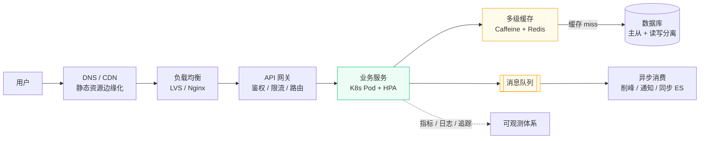
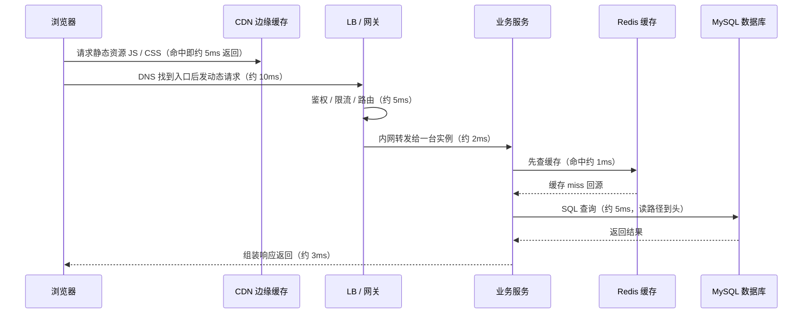
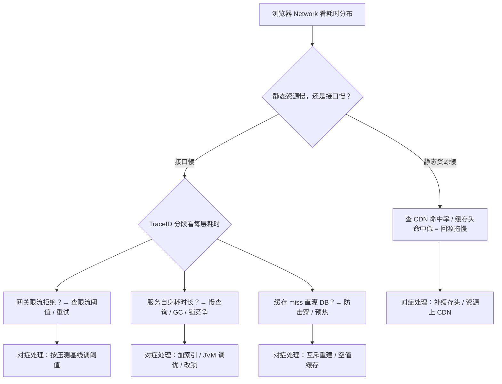
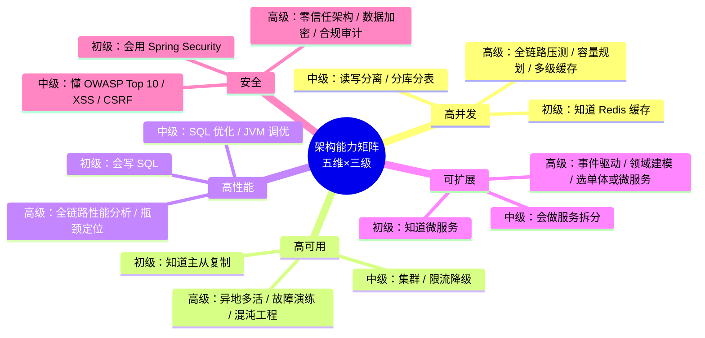
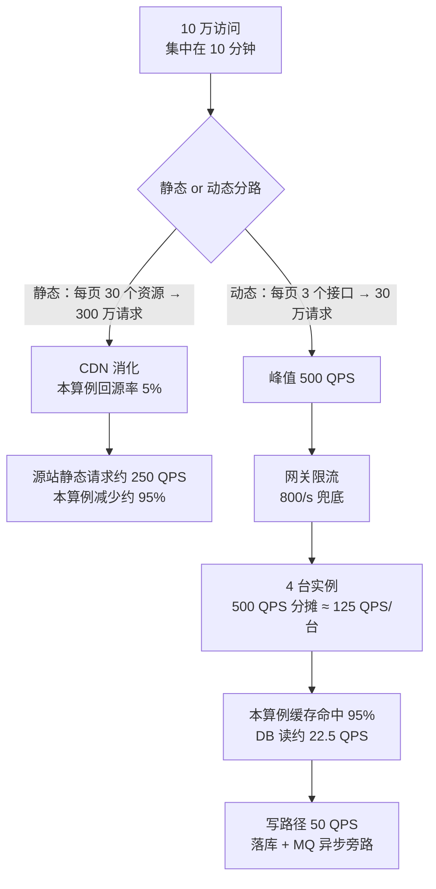

# 阶段六 · 小点 1：架构能力矩阵与一次典型请求的完整链路

> 所属：阶段六 架构设计与服务端思维
> 定位：技术栈可以速成，但架构思维需要沉淀——这是区分「会用 Spring Boot 的前端」和「真正的后端架构师」的分水岭。本讲给你两件工具：一张**能力自评矩阵**（知道自己在哪、往哪走）和一条**完整请求链路**的心智模型（把「我的接口」放进「整条链路」里看）。

## 快速入门

> 本节为「架构思维速览」：先认识一次请求从浏览器到数据库经过哪些层；「能力矩阵、容量推演」留在正文提高部分。

### 本讲关键词与概念速查

| 关键词 | 一句话大白话 | 典型用途与边界 |
|-|-|-|
| 请求链路 | 一次请求经过的层层环节 | 浏览器→CDN→网关→服务→DB；按层定位瓶颈 |
| CDN（Content Delivery Network，内容分发网络） | 静态资源边缘缓存 | 图片/JS 就近返回；回源率必须实测 |
| 负载均衡（Load Balancing，LB） | 把请求分到多台机器 | LVS 看 IP:端口；Nginx 可解析 HTTP |
| 网关（API Gateway） | 统一入口（鉴权/限流/路由） | Spring Cloud Gateway；集中治理不替代业务校验 |
| 应用层 | 你的业务服务 | Controller → Service → DAO |
| 缓存 | 热点数据放内存 | Redis；要处理 Cache Aside 一致性 |
| 数据库 | 最终事实存储 | MySQL；容量取决于查询、索引和压测基线 |
| 消息队列（MQ） | 异步削峰、解耦 | 核心写路径仍要同步成功或可补偿 |
| QPS（Queries Per Second） | 某个边界每秒处理的请求/操作数 | 必须标明网关、接口、RPC、DB 或缓存等计数边界 |
| TPS（Transactions Per Second） | 每秒完成的业务事务数 | 先定义“下单成功”等业务结果；不等同于 HTTP 请求或数据库事务 |

### 本讲在解决什么问题

- **问题**：你写的接口只是「整条链路的一小段」。真正的架构师会问：这个请求从哪里来、经过哪些层、每一层扛多少、崩了会怎样。
- **你需要明确的点**：把「我的接口」放进**整条链路**里看——浏览器 → CDN → LB → 网关 → 服务 → 缓存 → DB。每学一个新组件，问一句「它在链路的哪一层、扛什么」。

### 完整链路速览（正文展开更细）

```text
浏览器 → CDN(静态资源) → 负载均衡(分机器) → 网关(鉴权/限流/路由)
        → 应用服务(你的业务) → 缓存(Redis) → 数据库(MySQL) → (异步)消息队列
```

> 说明（逐行解释）：
> - **CDN**：静态资源（图片/JS）边缘缓存，用户就近获取，减少回源。
> - **负载均衡（Load Balancing，LB）**：把请求分到多台机器——`LVS` 四层转发（只看 IP:端口，传输层）、`Nginx` 七层反代（解析 HTTP 头，应用层）。
> - **网关**：统一入口，做鉴权、限流、路由（阶段四 Spring Cloud Gateway）。
> - **应用服务**：你的业务代码（Controller → Service → DAO）。
> - **缓存（Redis）**：挡读压力（阶段三第 4 讲）。
> - **数据库（MySQL）**：最终事实（阶段三）。
> - **消息队列（MQ）**：异步削峰、解耦（阶段三第 5 讲）。
> - 这就是把「我的接口」放进产业链的起点——每层有各自治理手段。

### 常用约定 / 命名提示

- **链路口诀**：每学一个新组件，问一句「它在链路的哪一层、扛什么」——这是架构思维的训练。
- **容量推演**：从 QPS 出发，一层层算每层要扛多少（正文 1000 QPS 从 CDN 到 DB 的推演）——知道哪里不用做，和知道哪里要做一样值钱。
- **别迷信「加机器」**：先看瓶颈在哪层，再针对性扩容。

## 精简大纲

1. 服务端思维的核心：把请求放进整个链路里看
2. 架构能力矩阵（五维三级）与自评方法
3. 一次典型请求的完整链路：每一层扛什么、怎么治理
4. 一层层加机器的算例：1000 QPS 从 CDN 到 DB 的流量衰减推演

## 学习内容详情

### 1. 服务端思维的核心

#### 1.1 从「Controller 视角」到「链路视角」

前端出身最熟悉的调试路径是：请求 → 接口 → 响应，慢了就去看接口实现——这是典型的「Controller 视角」。

后端要换成**「链路视角」**：「我的代码没问题」≠「请求会快」。一个请求从用户手指按下到数据返回，要经过 **DNS**（域名解析——把网址翻译成服务器 IP 的「电话簿」）、CDN、负载均衡、网关、服务、缓存、数据库、MQ 十几个环节，每一层都可能成为瓶颈：



> **生活版：寄一个贵重包裹**。从家门口到外省收件人，要过菜鸟驿站 → 同城分拨中心 → 干线货车 → 外省分拨中心 → 末端驿站 → 上门派送。任何一站爆仓或爆胎，包裹就慢；你催快递员（服务端）没用，他只能告诉你「卡在前一站了」。
>
> **换成 Java/Spring**：驿站和分拨中心就是 CDN、负载均衡、网关、服务、缓存、数据库这些层；催快递员看不见前面的站，等于前端只盯接口实现、看不到链路每一层。架构师心里装的不是「这一个服务」，而是这条「接力棒赛道」——每一站都可能掉棒。

对照前端的 **Network 面板**瀑布流心智：里面每一根横条 / 每一段的耗时，就对应这里的某一层——后端架构师要做的，是把「这层 5ms、那层 30ms」拆开看。下图的耗时仅用于说明分段观测，真实链路以 Trace 和监控为准：



> **每学一个新组件，问一句：它在这条链路的哪一层？它把压力从哪一层挪到了哪一层？**（例：缓存把「DB 的读压力」挪到「缓存层自身」；MQ 把「同步写压力」变成「异步消费」。）这是贯穿阶段六的口诀。

#### 1.2 链路层的职责与治理对照

| 层 | 扛什么 | 治理手段 | 慢了看哪里 |
|-|-|-|-|
| CDN 层 | 静态流量边缘化 | 资源上 CDN、缓存头策略 | 静态资源 RT、CDN 命中率 |
| 负载均衡层 | 流量分发 | LVS / Nginx 分级转发、健康摘除 | 后端连接数分布是否均匀 |
| 网关层 | 第一道限流 | 令牌桶 / 黑白名单 / 熔断 | 网关自身的限流计数与拒绝率 |
| 缓存层 | 挡住读压力 | 多级缓存、防穿透击穿雪崩（阶段三第 4 讲） | 命中率、大 key / 热 key |
| 数据库层 | 最终事实 | 主从读写分离、分库分表（阶段三第 2 讲） | 慢查询、连接池等待 |
| MQ 层 | 写流量变异步 | 削峰、消费幂等（阶段三第 5 讲） | 堆积量、消费延迟 |
| 可观测层 | 在用户报障前发现 | 黄金信号、TraceID 链路（阶段五第 4 讲） | 告警是否先于客诉 |

> 注：**LVS** 是四层负载均衡——只看 IP:端口做转发（传输层，性能高）；**Nginx** 是七层反向代理——看得懂 HTTP 头，能做路由、限流、静态资源（应用层，更「懂业务」）。
> 注：**令牌桶**=按固定速率往桶里放「放行券」、有券才放行的限流方式；**黄金信号**=延迟 / 流量 / 错误 / 饱和度四类核心指标；**TraceID**=一次请求贯穿全链路的唯一编号（像快递单号，各层日志都带它）。

「慢了看哪里」这列是排查入口，完整的分段定位法见下——按图索骥，别一层层瞎试：



### 2. 架构能力矩阵（五维三级）

先看全景：五个维度都能从「知道」长到「能设计」，下面表格是每个格子的展开——



| 维度 | 初级 | 中级 | 高级 |
|------|------|------|------|
| **高并发** | 知道 Redis 缓存 | 会做读写分离、分库分表 | 能设计全链路压测、容量规划、多级缓存体系 |
| **高可用** | 知道主从复制 | 会做集群、限流降级 | 能设计异地多活、故障演练、混沌工程 |
| **高性能** | 会写 SQL | 会做 SQL 优化、JVM 调优 | 能做全链路性能分析、瓶颈定位、架构级优化 |
| **可扩展** | 知道微服务 | 会做服务拆分 | 能设计事件驱动架构、领域建模、合理选单体或微服务 |
| **安全** | 会用 Spring Security | 懂 OWASP Top 10、XSS / CSRF | 能设计零信任架构、数据加密、合规审计 |

> **用法**：每完成本阶段一个小点，回这张表自评一次。目标是把每一维推到「中级」，并在 1-2 个维度（建议：可扩展 + 高并发，发挥你的全栈优势）冲高级。
>
> 前端类比：这张表就像前端的「会切图 → 会做组件 → 会定设计系统」职级阶梯——维度独立、各自由项目证据支撑，不是「背题就能升」。

### 3. 一层层加机器的算例（本讲的「代码」）

#### 3.0 先约定计数对象：请求、业务事务和数据库事务不是同一个词

性能术语先写清计数边界，否则同一个“1000 TPS”无法用于扩容。**请求**是经过某个协议边界的一次调用，例如网关收到一次 HTTP 请求、服务发起一次 RPC，分别可以有自己的 QPS；**业务事务**是一个可向业务方交付的结果单位，例如“一个订单创建成功”，TPS 必须说明成功/尝试、同步/异步及统计窗口；**数据库事务**是数据库的 ACID 提交边界，可能只实现一部分业务事务，也可能一次批处理包含多个业务结果。

| 场景 | HTTP/RPC 请求数 | 业务事务数 | 数据库事务数 |
|-|-|-|-|
| `POST /orders` 同步完成建单 | 通常 1 个入口请求 | 通常 1 个“建单”业务事务 | 可能 1 个本地事务 |
| 下单后异步扣积分、发通知 | 至少有建单请求和 MQ 消费 | 业务上可视为一个订单流程，也可拆为多个可核对结果 | 每个服务各有本地事务 |
| 批量导入 100 条订单 | 1 个上传请求 | 最多 100 个订单结果，需定义部分成功语义 | 可按批次多次提交 |

> 因此，`QPS = TPS` 只在“一个入口请求稳定对应一个已完成业务结果”的**特定指标口径**下成立。容量规划应分别记录入口 QPS、下游调用 QPS、消息消费速率和关键业务 TPS；不能把“一个下单包含查库存、扣库存、建订单”这些内部步骤误说成多个客户端请求。

架构师嘴上的「扛住 1000 QPS」背后是一道算术题。下面把「一条营销活动链接」的容量设计完整推演一遍。

#### 3.1 需求到入口流量

```
业务输入
  活动日消息发送量      = 100w 条
  点击率（CTR）        = 10%      → 10w 次落地页访问，集中在 10 分钟内
  落地页静态资源请求数  = 每页 30 个（JS/CSS/图片）

静态资源流量（CDN 层消化）
  10w × 30 = 300w 静态请求 ÷ 600 秒 = 5000 QPS
  → 【本算例假设】CDN 回源率 5%，源站静态请求约 250 QPS

动态 API 流量（打到后端链路）
  10w 访问 × 每页 3 个接口 = 30w 请求 ÷ 600 秒 = 500 QPS（峰值）
```

把上面这笔账画成一张「流量衰减瀑布」，一眼看出每层砍掉多少：



> **这组数字是算例假设，不是通用容量基线**：5% 回源率、95% 缓存命中率、读写比、单实例基线和冗余比例都必须以业务流量、CDN/缓存指标和压测结果替换。推演用假设，落地看实测。
>
> **本算例的结论**：静态与动态分离后，动态后端链路约承受 500 QPS；静态回源量取决于实际命中率。CDN 是否是优先优化项，要由静态流量占比、回源带宽和成本共同判断。
>
> **生活版：演唱会开场前**在体育场外摆几个临时取票摊位（CDN），观众就近领票进场；真正挤到安检口（后端源站）的只是零头，安检队伍短了 90%。**换成 Java/Spring**：临时摊位=CDN 边缘节点，领走的票=缓存命中的静态流量，挤进安检口=回源到源站——CDN 就是后端的第一道「取票分流」。

#### 3.2 入口到服务层

```yaml
# 网关层配置形态：假定已启用 Spring Cloud Gateway、Redis RateLimiter 与对应 Redis 连接
spring:
  cloud:
    gateway:
      default-filters:
        - name: RequestRateLimiter          # 网关令牌桶限流
          args:
            redis-rate-limiter.replenishRate: 800   # 令牌生成速率 800/s —— 略高于预期峰值，留缓冲
            redis-rate-limiter.burstCapacity: 1600  # 桶容量 1600 —— 允许短突发 2 倍
```

> 这是容量算例中的配置形态，省略了依赖版本、Redis 连接、路由与 KeyResolver。`800/s`、`1600` 等值来自本算例，部署时应替换为压测和线上观测得出的阈值。

```
服务层实例数推演
  目标峰值              = 500 QPS
  单实例压测基线（p99<300ms 约束下）= 200 QPS   ← 来自压测，不是拍的（第 6 讲）
  理论实例数            = 500 / 200 = 2.5 → 向上取整 3
  在理论值上加约 30% 数量余量        → 3 × 1.3 = 3.9 → 向上取整 4 实例
  K8s HPA：min=4, max=10, 目标 CPU 60%     ← 流量再涨自动扩，上限兜住成本
```

#### 3.3 服务层到数据层

> **生活版：办公桌抽屉里常备一整包抽纸**（Redis 缓存），顺手抽一张；只有抽屉空了才跑去楼下便利店（MySQL）补货。**换成 Java/Spring**：抽纸=热点数据缓存，便利店=数据库；缓存命中率就是「开抽屉就有纸」的概率，抽屉的补货节奏 = 缓存的淘汰 / 预热策略。

```
读路径（假设读:写 = 9:1，450 QPS 读）
  【本算例】缓存命中率 95% → DB 读压力 = 450 × 5% = 22.5 QPS
  缓存命中率 80%（没预热/设计差）→ DB 读压力 = 90 QPS，叠加每查询 5ms → 0.45 并发连接，
  依然不大——为什么还要慌？因为「热点 key 击穿」是瞬时全部 miss，等于 450 QPS 直灌 DB（第 3 讲）

写路径（50 QPS 写订单）
  直接落库：50 QPS 是否可承受，要以表结构、索引、事务、磁盘和 p99 压测结果确认
  本算例的候选方案：先验证单库单表的延迟、连接和增长预估；满足目标再维持简单设计，
       不满足时再评估索引、缓存、读写分离或分片
  需要的是：下单后的积分/通知/ES 同步走 MQ 异步（削峰 + 解耦），写链路只留 DB 一个同步点
```

> **异步的边界**：异步只用于旁路；核心写路径（订单本身落库）必须同步成功或显式补偿——别把「都丢给 MQ」当万金油。
>
> **结论 2**：容量推演最常见的产出不是「加机器」，而是「**这一层其实不用动**」——知道哪里不用做，和知道哪里要做一样值钱（防过度设计）。

## 坑点提醒

- **只算应用层不算全链路**：500 QPS 打到 4 个实例很轻松，但每个请求查一次 Redis + 一次 DB，连接池没配对照样雪崩——容量是全链路的（第 6 讲展开）。
- **拿平均值当容量基线**：「平均 80ms」里可能藏着 p99 = 2s，以 p99 做约束推演才安全（第 2 讲）。
- **把算例比例当通用结论**：5% 回源、95% 命中和实例数只服务于本题；生产要用监控和压测数据替换后再决策。
- **矩阵自评只涨不降**：半年没碰过的事务脚本维度还标「中级」——自评要绑定最近的**项目证据**，证据过期就降级。

## 本节自检

- [ ] 能脱稿画出完整链路图，并说出每层的治理手段与「慢了看哪里」
- [ ] 能自评五维能力矩阵，每个档位都能举出对应的项目证据
- [ ] 拿自己项目的一个真实接口，能指出它的流量经过链路图的哪几层、瓶颈最可能在哪层
- [ ] 给一个业务目标（日消息量），能独立完成「CDN 衰减 → 网关限流 → 实例数 → 缓存命中率 → DB 压力」的完整推演

> **场景核对要点**：为真实接口列出静态/动态比例、时间窗口、回源率、命中率、单实例压测基线和可用性余量；每个数字标明来源（监控、压测或假设）。只有下游延迟、错误率和资源余量都满足目标，才可得出“暂不扩容”的结论。

## 本节配套思考题

1. 你的活动页突发 10 倍流量，CDN、网关、服务、缓存、DB 五层各自的第一反应应该是什么？哪一层最应该「主动拒绝」流量？
2. 「我的服务 500 QPS 没问题」这句话缺了哪三个限定词才严谨？（提示：什么约束下的什么指标、多长时间、哪个环境）
3. 为什么「这一层不用动」的结论比「这一层要扩容」更难下、也更有价值？

## 常见面试题

### Q1：请描述一次 HTTP 请求从浏览器到数据库的完整链路，每一层各承担什么职责？

**答**：**标准结论**：链路是「浏览器 → DNS 解析 → CDN → 负载均衡 → API 网关 → 业务服务 → 缓存（Redis）→ 数据库」，旁路还有消息队列做异步化、可观测体系做追踪。各层一句话分工：
- **CDN**：静态资源就近返回，消化静态流量。
- **负载均衡（LB）**：把请求分发到多台实例，解决单机能力上限。
- **API 网关**：鉴权 / 限流 / 路由，做统一入口治理。
- **缓存（Redis）**：挡读压力。
- **数据库**：最终事实。

**底层原理**：流量可在各层被缓存、限流或异步化而改变形状；例如回源率为 5% 时，该静态请求的源站量约为原来的 5%。实际比例由资源缓存策略和访问行为决定。

**工程实践**：
- 面试加分点是「治理手段与层的对应」——哪层崩了怎么兜底：CDN 回源兜底、LB 健康摘除、网关熔断、缓存击穿防护、DB 主从切换。
- 切忌背完链路就停，要能说出「我的服务卡了，先看哪一层」。

### Q2：QPS、TPS、RT、并发数这几个指标怎么区分？容量规划时该用哪个？

**答**：**标准结论**：四个指标口径不同，报数前先写清“数的是什么”——
- **QPS**（每秒请求/操作数）：衡量指定边界的吞吐，例如网关 HTTP QPS、某 RPC 方法 QPS 或 Redis 命令 QPS。
- **TPS**（每秒业务事务数）：衡量已定义的业务结果，例如“每秒成功创建订单数”；一个业务事务可由一个同步请求完成，也可能跨多个请求、消息消费和本地事务。
- **RT**：单次请求耗时。
- **并发数**：在系统处于稳定状态、入/出流量长期平衡且单位一致时，可用 Little's Law 近似推得：**并发数 = QPS × RT**（RT 2s、QPS 100 时，平均约有 200 个请求在系统中）。突发、排队和多类请求混合时，要按实际监控和队列长度校验。

**底层原理**：容量规划要用与目标资源同边界的**峰值 QPS**（平均会被低谷稀释，峰值才是要扛的压力）和**分位数延迟**（平均 80ms 可能藏着 p99 = 2s 的长尾）。入口 QPS 不能直接当成数据库 QPS；TPS 也不能在未定义业务结果时和请求数互换。

**工程实践**：
- 先压测拿到「单实例在 p99 < 300ms 约束下能扛多少 QPS」这条基线。
- 再算「目标 QPS ÷ 单实例基线」向上取整，加冗余（发布 / 故障摘机余量）。
- 最后配 HPA，让流量再涨时自动扩。
- 常见误区：用平均 QPS 规划导致大促被打穿；或用单机理论极限当基线导致扩容过度。

### Q3：给一个「活动页日消息量 100 万」的需求，如何做容量推演？

**答**：**标准结论**：容量推演是「一层层算账」，从入口流量往下衰减——
- ① 入口：100 万条消息 × 点击率 10% = 10 万访问，集中在 10 分钟 → 页面峰值约 166 QPS。
- ② 静态资源：按本题假设，每页 30 个资源 = 300 万请求，CDN 回源率 5% 时源站静态请求约为 250 QPS；上线前以 CDN 日志验证。
- ③ 动态接口：每页 3 个接口 → 峰值 500 QPS。
- ④ 服务层：单实例压测基线 200 QPS → 理论值 3 台；本算例在实例数量上加约 30% 余量后向上取整为 4 台，HPA min=4 / max=10。若要求任意失去一台后仍满足容量目标，还要单独做 N+1 校验。
- ⑤ 数据层：按本题读写比与 95% 命中假设，DB 读压力约 22.5 QPS；是否维持单库，要结合表规模、事务、索引和压测 p99 判断。

**底层原理**：每一层都在做流量衰减，缓存命中率、回源率就是衰减系数。

**工程实践**：
- 推演里每个数字都要标注来源（假设 or 压测）。
- 「回源率 5%」这类假设落地必须以实测为准。
- 推演最重要的产出往往是「这层不用动」——防过度设计。

### Q4：CDN、负载均衡、网关都是「挡流量」的，它们有什么区别？限流应该做在哪几层？

**答**：**标准结论**：三者都是「挡流量」，但粒度完全不同——
- **CDN**：内容分发——把静态资源复制到离用户最近的边缘节点，解决网络延迟和带宽。
- **负载均衡**：连接分发——把请求按策略分到多台实例，解决单机能力上限。
- **网关**：入口治理——在业务入口统一做鉴权、限流、路由、黑白名单。

**底层原理**：
- 四层 LB 只看 IP:端口（传输层转发，性能高）；七层（Nginx）解析 HTTP 头（应用层，能做路由和重写）；网关在更靠内一层，能看到业务语义。
- 限流应分层配合：CDN/WAF 挡恶意与超大流量；网关做第一道**令牌桶**限流（兜底总量、成本最低——流量在入口被拦截最省资源）；应用层针对热点参数 / 单用户做精细化限流。

**工程实践**：
- 限流阈值必须来自压测基线而非拍脑袋——设太高形同虚设，设太低在大促误伤正常用户。
- 网关限流与业务限流要设不同的阈值与拒绝策略（网关 429 快速失败，应用层可配合降级兜底）。

### Q5：为什么有时候「加机器」解决不了问题？什么情况下扩容无效？

**答**：**标准结论**：加机器只对「无状态、可水平扩展」的层有效。扩容无效的典型场景——
- ① **DB 是单点**：应用扩到 100 台，连接池先打满（5 实例 × 池 10 = 50 连接，DB max_connections=100 时第 10 个实例就耗尽）。要先做缓存 / 读写分离 / 分库分表。
- ② **瓶颈在磁盘 IO 或带宽**：日志写盘、大文件传输，加 CPU 无用。
- ③ **缓存穿透 / 击穿**：流量直灌 DB，加实例只会让 DB 更快被打穿。要先防穿透（布隆过滤器（Bloom Filter）/ 空值缓存）和击穿（互斥重建 / 逻辑过期）。
- ④ **应用自身问题**：锁竞争、GC 停顿，加实例后共享锁冲突反而加剧。

**底层原理**：系统吞吐由最弱链路决定（木桶效应），扩容必须对准「当前瓶颈层」。

**工程实践**：
- 先看监控确认瓶颈层（链路追踪看每段耗时），再选扩容手段。
- 「扩容」可以是加实例，也可以是加索引、加缓存、调连接池、改限流阈值——扩容对象 ≠ 加机器。
