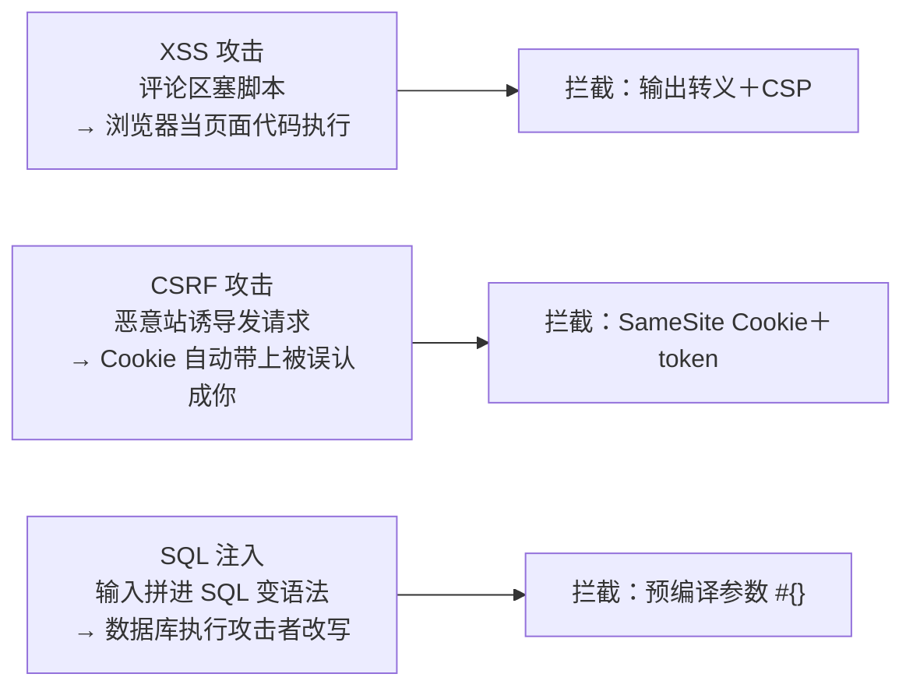
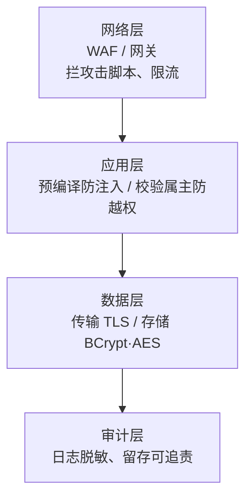
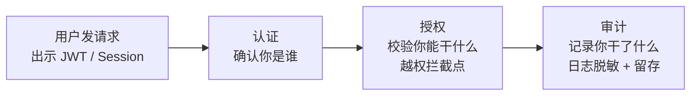
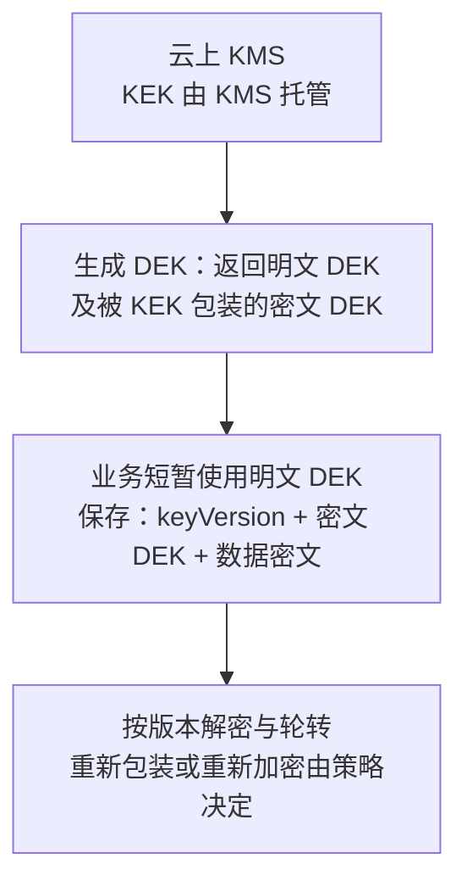

# 阶段六 · 小点 5：安全架构与合规

> 所属：阶段六 架构设计与服务端思维
> 定位：安全的特殊在于「不出事时零存在感、出事时一票否决」。按 OWASP 清单建防线，按合规清单守底线——不需要成为安全专家，但必须知道**自己的代码会死在哪十条里**。

## 快速入门

> 本节为「安全速览」：先认识最常见的安全风险、几个守住的底线；「OWASP、合规」留在正文提高部分。

### 本讲关键词与概念速查

| 关键词 | 一句话大白话 | 常见防线或坑 |
|-|-|-|
| 注入 | 把用户输入拼进命令或 SQL | 用预编译参数；动态标识符走白名单 |
| 越权（Broken Access Control / IDOR） | 不该访问的资源被访问 | 校验当前主体与资源归属、角色或策略 |
| SSRF（Server-Side Request Forgery） | 诱导后端访问内网或受限地址 | 外呼地址白名单、解析后校验 IP、限制重定向 |
| 反序列化（Deserialization） | 不可信负载触发意外类型或行为 | 不启用不可信类型信息，控制依赖与白名单 |
| JWT 算法混淆 | 算法或密钥类型被错误混用而验签 | 验签端限定允许的算法与密钥用途 |
| OAuth 2.0 | 让客户端获得“访问某个受保护资源”的授权框架 | access token 给资源服务器，不是登录身份证明 |
| OIDC / ID Token | 建在 OAuth 之上的身份层 / 给客户端的认证结果 | 客户端校验 `iss`、`aud`、签名、有效期与 `nonce` |
| AES-GCM（AEAD） | 同时提供机密性和篡改检测的加密模式 | 同一密钥下 nonce 必须唯一；认证标签校验失败必须拒绝 |
| 零信任（Zero Trust） | 内网也不全信 | mTLS、最小权限 |
| 等保 2.0 | 国内安全合规制度 | 日志留存、审计 |
| 数据脱敏 | 敏感信息打码 | 手机号 138**** |
| 密钥管理 | 加密密钥的生成、使用和轮转 | 密钥不进代码、Git 或日志；由 KMS 等托管 |

### 本讲在解决什么问题

- **问题**：安全不出事时没存在感、出事时一票否决。你的代码会「死在哪十条里」？按 OWASP 清单建防线 + 按合规守底线。
- **你需要明确的点**：越权、注入与敏感信息泄露都是后端必须优先排查的风险。守住几条底线：预编译防注入、每个资源校验属主（防越权）、密钥进 KMS、日志脱敏。

### 最简防护示例（形态示意，非完整可运行）

```java
// ① 防 SQL 注入: 用预编译占位符, 别拼字符串
String sql = "SELECT * FROM user WHERE id = ?";        // ? 占位符
// PreparedStatement / MyBatis 的 #{id} 会自动预编译 —— 永远别用 ${id} 拼接

// ② 防越权(水平越权): 每个资源校验属主
@PreAuthorize("#userId == authentication.principal.userId")   // 只能看自己的
public User getProfile(@PathVariable Long userId) { ... }
```

> 代码备注（逐行解释）：
> - ① **SQL 注入**：用预编译参数（`?` / `#{}`），别用字符串拼接（`${}`）——用户输入永远不会变成 SQL 语法。
> - ② **越权**：`@PreAuthorize("#userId == authentication.principal.userId")`——校验「只能访问自己的资源」，不是「登录了就放行」。
> - 省略了 `User`、`authentication.principal` 的自定义类型、Spring Security 配置、异常映射与测试；实际项目须让认证主体暴露稳定的用户标识，并在服务层或策略层覆盖资源归属校验。
> - 这两条展示的是防线形态，仍要用「用户 A 的凭证访问用户 B 的资源」和注入负载测试来验证。

### 常用约定 / 命名提示

- **OWASP 最常踩的三条**：注入、越权、加密失败（明文/弱加密）——优先守这三条。
- **密钥进 KMS**：不进代码、不进 Git、不进日志——密钥管理难点不在算法在治理。
- **等保/个保法**：上线前过合规清单（收集字段 × 目的 × 留存期 × 删除路径）——合规是架构输入，不是上线后补丁。

## 精简大纲

1. OWASP Top 10 与 Java 重灾区（反序列化）
2. 认证授权最佳实践与误区（JWT 算法混淆 / 越权）
3. 数据安全：传输 / 存储 / 脱敏
4. 零信任与最小权限
5. 国内合规：等保 2.0 / 数安法 / 个保法

## 学习内容详情

### 1. OWASP Top 10 与 Java 重灾区

| 风险 | 攻击形态 | 防线 |
|-|-|-|
| 注入（SQL / 命令） | 拼字符串把输入变成语法 | 预编译参数（`#{}` / PreparedStatement，阶段三第 3 讲已埋）；动态列名走白名单映射 |
| 失效的访问控制（Broken Access Control） | 水平越权（Horizontal）：改 URL 里的 orderId 看别人订单；垂直越权（Vertical）：普通用户调管理员接口 | **每个资源访问校验属主**（阶段二第 6 讲 @PreAuthorize 数据归属）——不是「登录了就放行」 |
| 加密失败 | 明文传 / 存密码 | 全站 TLS + BCrypt 存储 |
| SSRF | 传 `url=http://169.254.169.254/`（云元数据）让服务端去 fetch | 外呼 URL 白名单 + 禁内网网段 + 不走重定向 |
| 反序列化 | 恶意字节流 → RCE | 见下 |
| 未保护的 API | 认证 / 限流 / 审计缺位的端点成攻击入口 | 网关统一鉴权 + 限流 + 审计——别裸奔 |

**XSS / CSRF / SQL 注入对照**：这三个是前端最容易感知的攻击——XSS（Cross-Site Scripting，跨站脚本，恶意内容被浏览器当页面代码执行）、CSRF（Cross-Site Request Forgery，跨站请求伪造，借浏览器「自动携带 Cookie」让服务端误认成你本人）。看「攻击路径 → 拦截点」：



```java
// 反序列化是 Java 重灾区：Fastjson 历史 autoType 系列漏洞 = 传 {"@type":"恶意类"} 触发构造链 RCE
// 三纪律：
// ① 不可信来源数据不做「类型信息在负载里」的解析(autoType / Jackson enableDefaultTyping 同类风险)
// ② 依赖版本进 SCA 扫描（Dependabot/OWASP dependency-check），Fastjson 等高危库锁最低安全版本
// ③ 反序列化白名单：ObjectInputStream 重写 resolveClass 只放行已知业务类 —— 或者干脆用 JSON/Protobuf
```

- 越权占实际线上事故的比重最高——功能测试全绿不代表权限对：**测试用例要带「用户 A 的 token 请求用户 B 的资源」矩阵**。
- **水平 vs 垂直，两类都要防**：水平越权（Horizontal Privilege Escalation）＝同级用户互看数据（改 orderId）；垂直越权（Vertical Privilege Escalation）＝低权限用户调用高权限功能（普通用户直呼管理员接口）。前者靠**数据级属主校验**（`resource.ownerId == 当前用户`），后者靠**接口级权限校验**（RBAC / ABAC）——两层缺一不可，别以为「登录了」就万事大吉。
- **检查时间 / 使用时间（TOCTOU，Time of Check to Time of Use，「先查后用的空当」）**：校验属主与真正执行之间如果存在可插队的窗口（先查后改、先校验再读写），攻击者可利用竞态——校验与使用要尽量贴近、同锁或原子化。
- **纵深防御（defense in depth）类比**：生活版——小区有保安、单元楼有门禁、你家门还有锁，小偷要得手得连闯三层；换成 Java/Spring——安全同样不赌「一层防线永远不破」，网络、应用、数据、审计逐层设卡，一层被攻破，下一层仍兜得住（越权、注入就是应用层该守的卡）：



> ⏸️ **短期可以不学**：渗透测试技术栈（扫描器、手工注入、漏洞利用链构造）——你现在是「写代码的人」，先把「自己的代码会死在哪」守住，专职渗透留给安全团队。**何时回来学**：负责安全测试 / 参与红蓝对抗 / 公司要求全员演练。**面试最低要求**：能说清越权矩阵、注入、SSRF 的攻防原理即可。

### 2. 认证授权：最佳实践与误区

```java
// 形态示意：Nimbus 的 JWSObject、RSASSAVerifier、publicKey 均需由项目依赖和密钥加载配置提供
// 验签端只接受本接口配置允许的算法与相应密钥用途，不能按请求头动态挑选验签器
JWSVerifier verifier = new RSASSAVerifier(publicKey);       // 只认 RS256
if (!JWSObject.parse(token).getHeader().getAlgorithm().equals(Algorithm.RS256)) { reject(); }
// 若服务端错误地同时允许 HS256 与 RS256，且把 RSA 公钥误作 HMAC 密钥，才可能出现经典混淆攻击

// Token 撤销: 短寿命(15min) + jti 黑名单(Redis, TTL=剩余寿命) + refresh 轮换检测(旧 refresh 被再次使用 = 泄露, 连坐撤销整条链)
// TTL 怎么定: 敏感系统 15min、常规 30-60min 都常见 —— 短 TTL 不如做好 refresh 轮换 + jti 黑名单
```

- **先分清两件事**：认证（Authentication）回答「你是谁」——登录、JWT、密码属于这一类；授权（Authorization）回答「你能干什么」——权限校验、越权防护属于这一类。本节上半部分（JWT、密码）是认证，下半部分（越权）是授权——**认证做对了、授权没做对，一样被越权**。
- **算法混淆的成立条件**：服务端同时接受不兼容的算法，且按不可信 `alg` 头选择验签器或错误复用密钥；攻击者才可能把 RSA 公钥误当 HMAC 密钥。许多现代库会把验证器与密钥类型绑定，不能把它们默认存在此漏洞；仍应显式配置允许算法与密钥用途，并用负向 token 测试验证。JWT 的算法验证原则见 [RFC 8725 第 3.1 节](https://www.rfc-editor.org/rfc/rfc8725#section-3.1)。
- **防御**：验签端从服务端配置选择允许算法与密钥，拒绝不在允许列表的 token；不要把 `alg` 头当成切换验签策略的指令。
- 对照阶段二第 6 讲：OAuth 2.1 / PKCE / OIDC 的「怎么做」在那；这里记“令牌给谁、用来做什么”——**误区**：
  - **把 OAuth 当登录，或把 access token 当 ID Token 用**——OAuth 定义的是访问受保护资源的授权；资源服务器应按 token 类型验证它（本地校验签名声明或向授权服务器 introspection），并核对有效期、签发者、受众与 scope，只把它用于自己的资源。需要让客户端确认“本次谁完成了认证”，使用 OIDC 的 **ID Token**，并验证 `iss`、`aud`、签名、有效期及请求中发出的 `nonce`。ID Token 的受众是客户端，不应拿去调用 API。
  - **redirect_uri 不白名单**——授权码会被人截走
  - **scope 全量授予**——第三方应用一进来就拿到全部权限
- 前端能感知到的误区同样要堵：把 JWT 存 localStorage 被 XSS 一次偷走（HttpOnly Cookie + CSRF token 或短 token + 内存保管）。

| 令牌 / 协议 | 发给谁 | 主要用途 | 不能替代什么 |
|-|-|-|-|
| OAuth 2.0 access token | 客户端持有、**资源服务器**验证 | 调用其 `aud` 与 scope 允许的 API | 不是给客户端展示或判断“用户已登录”的通用身份证 |
| OIDC ID Token | **客户端（RP）**验证 | 表达 OP 已认证的终端用户及认证上下文 | 不是 API 调用凭证；资源服务器不应以它替代 access token |
| JWT | 一种紧凑的 JSON 声明表示；可作为 JWS 签名或 JWE 加密的载体 | 可承载 access token、ID Token 或自定义断言 | 不是认证或授权协议本身，也不天然“无状态、安全” |

> 官方依据：[OAuth 2.0（RFC 6749）](https://www.rfc-editor.org/rfc/rfc6749)；[OpenID Connect Core：ID Token](https://openid.net/specs/openid-connect-core-1_0.html#IDToken)。

> 🔰 **认证 / 授权 / 审计一条链**：认证只回答「你是谁」，授权回答「你能干什么」，审计记录「你干了什么」——三段缺一段，安全事故都难定位：



### 3. 数据安全

```java
// 分级：密码(不可逆) / 身份证·银行卡(AES 加密存储) / 手机号(加密或脱敏列) / 昵称(明文)
// 密码：BCrypt 的 work factor 由当前密码策略、实测认证延迟和硬件能力共同校准；"找回密码"=重置而非查询
// 为什么是 BCrypt: ① 内置随机盐(salt) → 相同密码两次注册哈希不同, 彩虹表(rainbow table)直接失效
//                   ② 慢哈希(work factor 每 +1 计算量翻倍) → 暴力/字典破解单条密码的成本被放大到不可接受
// 字段加密（AES-GCM 示意，省略：从 KMS 取 DEK、版本化、持久化与轮转策略）
// nonce 通常为 12 字节；nonceGenerator 必须在同一 DEK 下保证唯一（可用持久计数器/分片前缀等方案）。
// 仅“每次随机生成”仍有碰撞概率，吞吐很高或长期使用同一 DEK 时必须做每密钥的碰撞预算或改用确定性唯一方案。
byte[] nonce = nonceGenerator.nextUnique(dekKeyVersion);
Cipher c = Cipher.getInstance("AES/GCM/NoPadding");
c.init(ENCRYPT_MODE, dek, new GCMParameterSpec(128, nonce));
byte[] ciphertextAndTag = c.doFinal(idCard.getBytes(UTF_8)); // 输出含认证标签；保存 keyVersion + nonce + 该输出
// 解密时使用同一 keyVersion/nonce；若 doFinal 抛 AEADBadTagException，说明密文、AAD、nonce 或密钥不匹配，必须拒绝，不能返回部分数据。
// 展示脱敏(注解式, Jackson 序列化时生效): 138****5678 —— 前端永远拿不到明文, 日志同规则
// 日志脱敏: logback 正则替换 / 序列化前掩码 —— "把整条 DO 打进日志"是最常见的隐性泄露
```

> 代码边界：`dek` 是受控密钥服务提供的 `SecretKey`，`nonceGenerator` 表示按 `dekKeyVersion` 生成唯一 nonce 的组件；示例只说明字段加密形态，不能直接作为生产实现复制。需补齐密文格式的长度校验、AAD 约定、`AEADBadTagException` 到统一拒绝响应的映射，以及密钥获取失败时“拒绝读写 / 可观测告警”的失败路径；不能生成固定或可能复用的 nonce，也不能吞掉标签校验异常后继续返回数据。

- **传输**：对外流量和含敏感数据的服务间流量使用 TLS；内部 mTLS 的覆盖范围要结合服务身份、网络边界和平台能力确定。
- **AES-GCM 的前提**：它是 AEAD（Authenticated Encryption with Associated Data，带附加数据认证的加密），同时保密并检测篡改。认证标签不是可选装饰；解密校验失败必须整体失败。最危险的错误是同一密钥下重复 nonce：这会破坏机密性，也会破坏该密钥下的完整性保护。把 `keyVersion`、nonce、密文和认证标签作为一组保存；需要绑定不可替换的上下文时，用 AAD 绑定如“表名 + 字段名 + 记录 ID”。[RFC 5116：AEAD 与 nonce 要求](https://www.rfc-editor.org/rfc/rfc5116.html)
- **存储**：加密的难点不在算法在**密钥管理**（KMS / 信封加密 Envelope Encryption）。**为什么用两层密钥**——KMS 调用有成本与限流，业务数据不能每次都上云取密钥：
  - 主密钥（KEK）由 KMS 托管，应用通常只请求“生成数据密钥”：得到短暂的明文 DEK 与被 KEK 包装的密文 DEK。
  - 业务用明文 DEK 加解密后尽快清除；密文 DEK 与数据保存。是否短时缓存明文 DEK、缓存多久，要按进程隔离、吞吐和威胁模型决定，不能把“长期常驻”当默认。
  - 轮转时先支持按 `keyVersion` 解密旧数据；具体是只重新包装 DEK，还是重新加密数据，取决于 KMS 能力、泄露风险和合规策略。
- **信封加密类比**（英文指「大信封套小信封」）：生活版——金库钥匙（KEK）留在银行；你拿到一个当天使用的钱箱钥匙（明文 DEK）和它的密封副本（密文 DEK），用完把前者收好/销毁，后者随资料归档。换成 Java/Spring——KMS 保管 KEK，应用仅在受控内存中短暂使用 DEK，数据库保存密文数据和密文 DEK，性能不依赖每条数据都调用 KMS：



- **加密分工（为什么）**：对称算法通常用于高吞吐数据加密；RSA / ECC 常用于签名、身份认证或密钥协商。具体协议应交给成熟 TLS/JWT 库和组织密码策略配置，避免自行拼装算法流程。

> ⏸️ **短期可以不学**：密码学底层实现（TLS 握手逐字节细节、AES 各模式数学原理、BCrypt 内部算法）——安全事故几乎都出在「用错 / 配错」而非「实现不了」。**何时回来学**：需要自研安全协议或做等保等合规资质、证明算法强度。**面试最低要求**：分清对称 / 非对称的用途、知道 BCrypt 加盐和慢哈希防什么即可。

### 4. 零信任与最小权限

> 🧩 **类比·零信任**：生活版——以前进了公司大门就默认「里面的人都是安全的」，现在进大门后，每个房间门还要单独刷卡验人；换成 Java/Spring——零信任（Zero Trust）= 不因「在内网」就信任，每个请求都重新验证一次身份与权限。

- **零信任**：不因「在内网」就信任——每个请求都验证身份与权限。落地形态：
  - 服务间 mTLS（Mutual TLS，双向 TLS——服务间互相查验对方证书；可理解为阶段四 Istio 能力的平台化版本）
  - 身份从网关透传，但**下游仍可独立校验**（内部 token / JWT audience 限定）
- **最小权限**（Principle of Least Privilege，只给干活所需的最小权力）类比：生活版——办公室只发你这一层的门卡，别说整栋楼，隔壁房间也进不去；换成 Java/Spring——每个账号 / 服务只授刚够用的权限，出问题时能爆发的破坏面最小。落地三处：
  - **DB 账号**：按服务只授所需库表——业务账号不给 DDL（迁移账号另设）
  - **K8s RBAC**：按 namespace + 操作动词收敛权限
  - **云 IAM**：按角色不按人发 AK，且**权限会过期**（临时凭证 STS）

### 5. 国内合规（业务必须了解）

| 法规 / 标准 | 对架构的硬约束 |
|-|-|
| 等保 2.0（二级 / 三级） | 访问审计、入侵防范、身份鉴别与数据保护等要求；具体控制项与留存期限按定级、测评范围和适用标准确认 |
| 数据安全法 | 数据分类分级——先有「哪些数据敏感」的清单，才谈得上加密与权限设计 |
| 个人信息保护法 | 收集要知情同意 + 最小必要；**可撤回同意、可要求删除**（注销接口不是摆设，要级联真删）；跨境传输评估 |
| 数据出境评估 | 跨境 / 多云场景先过数据出境评估——字段级脱敏、本地化存储方案 |

- 双因素落地 = 密码 + 第二因子（短信 OTP / TOTP 动态口令（Time-based One-Time Password）/ WebAuthn）三选一，国内短信 OTP 最常见。
- 落地方式：产品上线前过合规清单（收集字段 × 目的 × 同意文案 × 留存期 × 删除路径）——**合规是架构输入，不是上线后补丁**。

## 坑点提醒

- **「改 URL 就能看别人的数据」**：越权是最便宜的渗透——自动化测试里跑一遍「资源级权限矩阵」比任何扫描器都管用。
- **日志是泄露重灾区**：Token / 密码 / 全量身份证进日志 = 日志平台成了影子数据库——脱敏规则在**日志框架层**统一配，不靠程序员自觉。
- **内部接口「反正内网没人知道」**：SSRF / 元数据窃取证明内网早该假设有贼——内部服务同样鉴权 + 最小暴露（零信任的真正成本是治理，不是 TLS）。
- **安全组件自己成攻击面**：网关 / WAF / 鉴权中间件的版本漏洞（如某年 Fastjson 修复版引入绕过）——安全组件进升级计划，不是装完不管。

## 本节自检

- [ ] 能说出 OWASP Top 10 中至少五项，并解释 Java 反序列化为什么是重灾区
- [ ] 能说明 JWT 算法混淆成立的配置条件，并设计一条错误算法或错误密钥类型的拒绝测试
- [ ] 能给一张用户表设计分级方案（哪些 BCrypt / 哪些 AES / 哪些脱敏展示）
- [ ] 能画出 TLS 1.3 的 ECDHE 协商、证书认证和 AEAD 数据保护三种分工，并说明证书校验或 `Finished` 校验失败为何必须中止
- [ ] 能说明同一 DEK 下复用 AES-GCM nonce 的后果，并给出“密文 + 认证标签 + nonce + keyVersion”的存储与失败处理方案
- [ ] 能区分 OAuth access token 与 OIDC ID Token 的验证方、受众和用途
- [ ] 能说出等保 / 个保法对自己项目的三条硬约束
- [ ] 能解释「零信任」与传统「边界防御」的差异点在哪一层

**场景核对**：订单详情接口只校验「已登录」，用户 A 把 URL 中的 `orderId` 改成用户 B 的订单号后得到数据。修复要点是服务端把当前认证主体与订单属主或授权策略一起校验，并补充 A/B 交叉访问的自动化测试；隐藏前端按钮不构成防线。

**新增核对要点**：TLS 1.3 用临时 ECDHE 协商共享秘密、用证书签名认证身份、用 AEAD 保护记录；三者不是同一件事。AES-GCM 解密的标签校验失败应拒绝数据，nonce 需在同一 DEK 下唯一。access token 面向资源服务器与其 API；ID Token 面向客户端的认证结果，不能互换使用。

## 本节配套思考题

1. 「功能权限 RBAC + 数据权限 ABAC」在项目一的部门管理场景怎么落地？给出表设计与 @PreAuthorize 表达式。
2. 密钥进 KMS 的「信封加密」流程：为什么数据密钥也要密文 + 明文双形态存在？各用在哪一步？
3. 用户要求「注销并删除我所有数据」——你的 Outbox / binlog / 数仓备份链路会让这件事有多难？怎么设计留存策略既合规又可运维？

## 常见面试题

### Q1：常见的 Web 安全漏洞有哪些？分别怎么防御？
**答**：
**标准结论**：注入（以 SQL 注入为主）、失效的访问控制（越权）、加密失败、SSRF、XSS、CSRF 是最高频的几类——SQL 注入的防线是预编译参数（PreparedStatement / `#{}`）。

**底层原理**（看本质：这类漏洞都是「数据被错误地当成了什么」）：
- 注入：「数据被当成了语法」——预编译让输入永远停留在数据位
- XSS：「数据被当成了 HTML / JS 执行」——输出转义 + CSP，让尖括号变纯文本
- CSRF：「浏览器自动携带 Cookie」这个机制被利用——SameSite Cookie + token 校验，让服务端确认请求是用户本意发起
- SSRF：「服务端持有内网 / 云元数据的高权限通道」——外呼白名单 + 禁内网网段 + 禁重定向，别让它替攻击者访问

**工程实践**：
- 漏洞在编码层防，别指望 WAF 兜底
- 上线前过一遍「注入 / 越权 / SSRF」自查清单
- 安全组件版本跟进升级计划
- **面试加分**：越权要区分水平 / 垂直，测试带「用户 A 的 token 访问用户 B 的资源」矩阵

### Q2：用户密码怎么安全存储？为什么用 BCrypt？盐的作用？
**答**：
**标准结论**：不能明文、也不能用 MD5 / SHA 直接哈希；使用经评估的 BCrypt、scrypt 或 Argon2，并按组织策略、当前硬件和可接受认证延迟校准参数；「找回密码」只能重置、不能查询。参数选型可参照 [OWASP Password Storage Cheat Sheet](https://cheatsheetseries.owasp.org/cheatsheets/Password_Storage_Cheat_Sheet.html)。

**底层原理**——BCrypt 做了三件事：
- ① **内置随机盐（salt）**：同一密码两次注册哈希不同，预计算好的彩虹表（rainbow table，提前把所有常见密码的哈希算一遍的对照表）直接失效
- ② **慢哈希**：work factor 每 +1 计算量翻倍，攻击者跑字典 / 暴力破解的成本被指数放大
- ③ **输出自带盐与版本**：无需另存
- MD5 / SHA 的问题是「快」——每秒能算上亿次，GPU 集群轻松破解，加不加盐都只是时间问题

**工程实践**：
- 哈希值直接入库，密码永不进日志
- 登录用库的 compare 函数比对（防时序侧信道），别自己拼字符串
- 忘记密码走重置链接而非明文返回
- **面试补充**：登录频率远低于注册，BCrypt 的慢完全可接受

### Q3：什么是水平越权和垂直越权？怎么防御？
**答**：
**标准结论**：
- **水平越权**（Horizontal Privilege Escalation）：同级别用户访问他人数据，如改 URL 里的 orderId 看别人的订单
- **垂直越权**（Vertical Privilege Escalation）：低权限用户调用高权限功能，如普通用户直接调管理员接口

**底层原理**——两者的本质都是「授权缺失」：
- 系统只验证了「你登录了」（认证），没验证「你能不能动这个数据 / 这个接口」（授权）
- 水平越权发生在数据维度；垂直越权发生在功能 / 接口维度

**工程实践**：
- **水平越权**：靠数据级属主校验——每个资源接口校验 `resource.ownerId == 当前用户`，测试跑「用户 A 的 token 请求用户 B 的资源」矩阵
- **垂直越权**：靠接口级 RBAC / ABAC——`@PreAuthorize("hasRole('ADMIN')")`
- 前端「按钮隐藏」不等于后端防护，接口必须独立校验
- 多租户场景的「强制隔离」就是在架构层消灭水平越权
- **面试补充**：认证与授权是两层，都要做

### Q4：HTTPS 与 TLS 握手的过程是怎样的？
**答**：
**标准结论**——HTTPS = HTTP + TLS。以现代的 TLS 1.3 为主线：它用**临时 ECDHE 密钥交换**派生共享秘密，用证书签名认证服务器身份，用 AEAD（如 AES-GCM）保护握手后与应用数据；TLS 1.3 不再支持“RSA 加密预主密钥”的静态 RSA 密钥交换。

**TLS 1.3 全握手（通常 1-RTT）**：
- ① 客户端发 `ClientHello`：支持的 TLS 版本、密码套件、随机数，以及一个或多个 ECDHE `key_share`。
- ② 服务端选定版本/套件与自己的 ECDHE `key_share`，回 `ServerHello`；双方由各自临时私钥和对方公钥**各自计算**同一共享秘密，再通过 HKDF 派生握手密钥。
- ③ 服务端在加密的握手消息中发送证书、`CertificateVerify` 签名和 `Finished`。客户端验证域名、证书链、签名与 `Finished`；失败必须中止连接，不能“忽略证书错误继续访问”。
- ④ 客户端回 `Finished`，双方从同一密钥日程派生应用数据密钥；之后每条记录使用 AEAD 加密并认证。恢复会话的 0-RTT 虽更快，但可被重放，不能承载写操作或任何非幂等动作。

**底层原理**——三种角色不要混淆：
- ECDHE 解决“如何协商临时共享秘密”，并提供前向保密：以后服务器证书私钥泄露，攻击者通常不能解开此前录下的 TLS 1.3 会话。
- 证书与 `CertificateVerify` 解决“你连的是不是目标服务器”：CA 链、域名与签名验证共同防中间人；RSA 或 ECDSA 可以作为**签名**算法，并不表示 RSA 用来加密会话密钥。
- AEAD 解决“数据怎么保密且防篡改”：AES-GCM 的认证标签校验失败就丢弃记录。不要手写 TLS 握手或自行拼装密码学流程。

**工程实践**：
- 证书走正规 CA 签发、配 HSTS 强制 HTTPS、内部服务用 mTLS 双向验证
- **面试补充**：TLS 1.3 的 0-RTT 有重放风险，别用于写操作

> 官方依据：[RFC 8446：TLS 1.3](https://www.rfc-editor.org/rfc/rfc8446)（密钥交换、握手与 AEAD 记录保护）。

### Q5：JWT 和 Session 怎么选？JWT 有哪些常见攻击？
**答**：
**标准结论**：
- Session 是“服务端保存会话状态 + 浏览器保存会话标识”；JWT 是紧凑的 JSON 声明表示，可配合 JWS/JWE 使用，既可承载 access token、ID Token，也可承载自定义断言，不能简单等同于“无状态登录”。
- JWT 常见问题：算法混淆（algorithm confusion）、过长有效期或撤销设计缺失、密钥泄露、XSS 窃取可被 JavaScript 读取的 token。先明确 token 的受众和用途：access token 给资源服务器，OIDC ID Token 给客户端确认认证结果。

**底层原理**：
- JWT 三段 header.payload.signature；在服务端正确校验签名、允许算法、密钥用途以及 `iss`、`aud`、有效期等声明后，才能信任 token 的签发者与内容
- 算法混淆只在服务端同时接受不兼容算法，并按不可信 `alg` 选择验签器或错误复用密钥时成立；不能把所有现代 JWT 库默认当作存在该漏洞
- **防御**＝由服务端配置限定允许算法和密钥用途，并为错误算法、错误密钥类型和错误声明写负向测试

**工程实践**：
- **选型**：有刷新/撤销需求、敏感操作多时，服务端 Session 往往更直观；若使用 JWT access token，则由资源服务器验证 `iss`、`aud`、有效期、scope 与签名；若是 opaque token，则调用授权服务器的 introspection 或等价机制。两类方案都要设计短生命周期、撤销或 refresh 轮换。ID Token 仅在客户端完成 OIDC 登录回调时校验，不能作为 API Bearer token。
- token 放 HttpOnly Cookie 或内存，别放 localStorage
- 密钥进 KMS、定期轮换
- **面试补充**：浏览器/原生应用需要第三方登录时，用 OIDC 授权码流 + PKCE；不要因为 token 长得像 JWT，就忽略它是 access token、ID Token 还是自定义 token。
