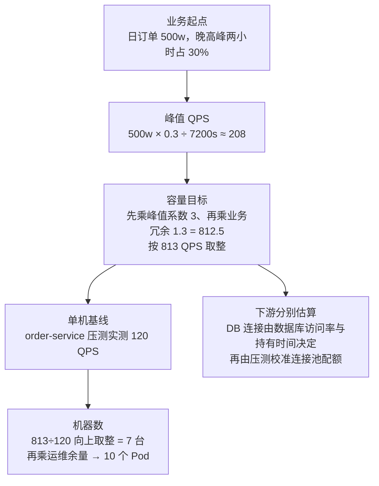
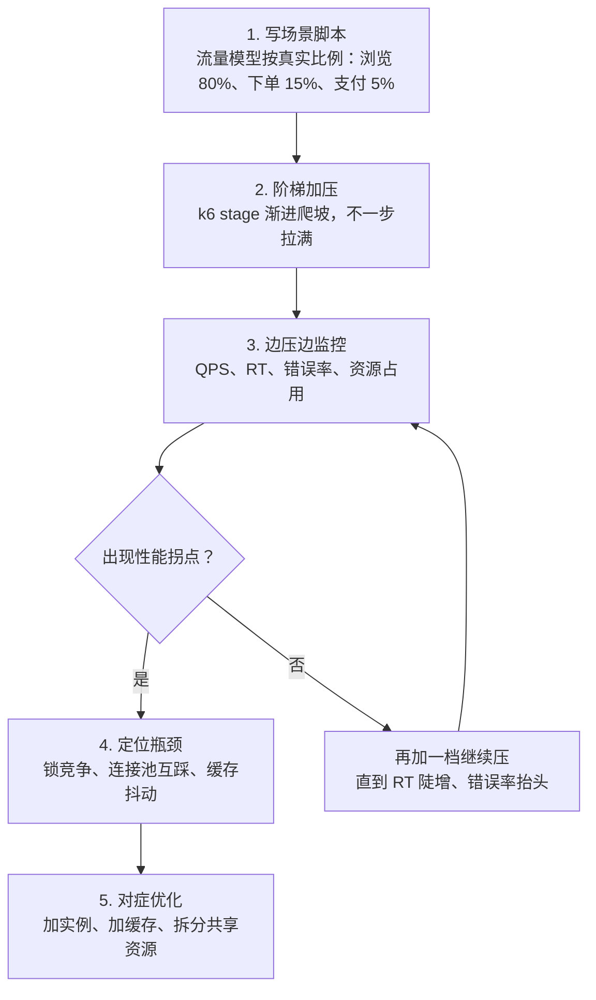
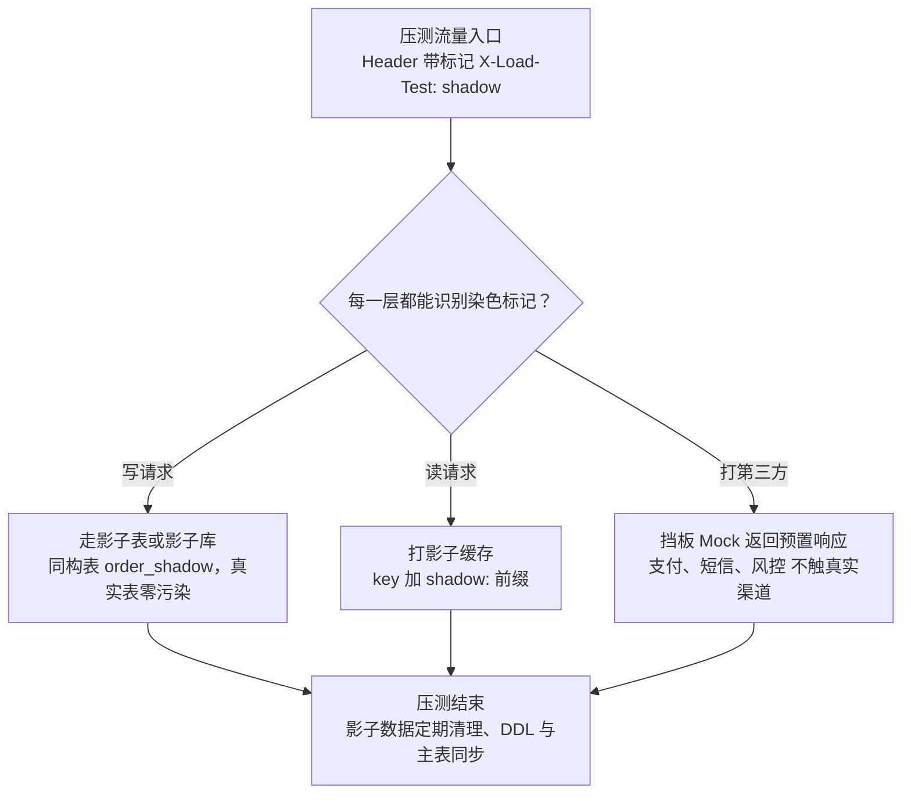

# 阶段六 · 小点 6：容量规划与压测

> 所属：阶段六 架构设计与服务端思维
> 定位：容量是**算**出来的，不是猜出来的；压测的终点不是报告，是**水位线 + 扩容预案 + 降级预案**三件套。本讲把「从业务目标到机器数量」的算术链走通。
>
> ⚠️ **阅读顺序建议**：本讲是 01/02/03 的「度量前置」（高性能、高可用的阈值都来自这里的容量推演，正文多处前向引用「第 6 讲」）。为保持编号稳定它排在 6，但**建议你在学完 01 后、进 02 之前先读本讲的「1. 容量评估」小节**，后续 02/03 的理解会顺很多。

## 快速入门

> 本节为「容量压测速览」：先认识容量怎么估算、压测是干嘛的；「Little's Law、全链路压测」留在正文提高部分。

### 本讲关键词与概念速查

| 关键词 | 一句话大白话 | 使用边界 |
|-|-|-|
| QPS（Queries Per Second） | 每秒请求数 | 先明确是网关、接口还是下游资源的口径 |
| TPS（Transactions Per Second） | 每秒完成的业务事务数 | 先定义业务结果；它不天然等于 HTTP 请求或数据库事务 |
| RT（Response Time） | 单次请求耗时 | 以目标场景的 p50/p95/p99 与 SLO 判断 |
| Little's Law（利特尔定律） | 稳态下在途量 = 到达率 × 平均停留时间 | 单位一致，且不能直接替代数据库连接数估算 |
| 峰值系数（Peak Factor） | 高峰相对基线的放大倍数 | 由历史流量与活动方案推导 |
| 压测（Load Testing） | 模拟目标场景测系统水位 | 流量配比、数据与拓扑应接近目标环境 |
| 容量水位 | 在既定 SLO 和场景下可承受的负载区间 | 由压测、扩容时延与风险预算共同确定 |
| 扩容预案 | 到什么条件扩什么资源 | 与扩容时延和降级策略一起验证 |
| 降级预案 | 极限流量时保留哪些能力 | 由业务优先级决定 |

### 本讲在解决什么问题

- **问题**：大促前系统能扛多少？不是猜，而是**算 + 压**——从业务目标推导各边界 QPS/TPS，再用 Little's Law 估算在途量，用同场景压测校准单机与下游水位，最后产出「水位 + 扩容 + 降级」三件套。
- **你需要明确的点**：Little's Law 只负责把**同一边界**的到达率和平均停留时间换成在途量；容量结论还必须有业务口径、下游放大和压测基线。压测不是验证完就结束，三件套才是最终交付物。

### 最简推演（假设示意，非生产结论）

```text
日订单 500w → 假设 20:00-22:00 占全天 30% → 峰值 QPS ≈ 500w × 0.3 / 7200s ≈ 208
→ 单请求 RT 假设 100ms → 并发 ≈ 208 × 0.1 = 21
→ 假设单台在目标 SLO 下实测可承受 100 QPS → 需约 3 台，再留出故障与扩容余量
```

> 说明（逐行解释）：
> - 从业务目标出发：日单 500w，**假设**高峰时段集中全天 30% 订单，算出峰值 QPS。
> - 用 **Little's Law**：并发 = QPS × RT（208 × 0.1s ≈ 21 个并发）。
> - 再除以在相同场景、相同 SLO 下压测得到的单机基线；100 QPS 仅为本例假设。
> - 省略了真实流量分布、失败重试、下游调用比例、部署拓扑和扩容时延；这些都必须由业务数据和压测补齐。

### 常用约定 / 命名提示

- **压测工具**：k6（前端友好）、Gatling、JMeter——前端出身首选 k6（JS 写脚本）。
- **三件套才是交付**：水位报告（能扛到哪）+ 扩容预案（到水位扩什么）+ 降级预案（极限砍什么）——不是一份报告就完。
- **压测数据要隔离**：全链路压测用影子表 + 挡板，别污染生产数据；影子表要定期清理。

## 精简大纲

1. 容量评估：Little's Law 与峰值系数
2. 单接口 vs 场景压测：为什么只做前者危险
3. 全链路压测：流量染色 + 影子表 + 挡板
4. 产出：水位报告 / 扩容预案 / 降级预案

## 学习内容详情

### 1. 容量评估的算术链

**Little's Law**：`并发数 = QPS × RT（秒）`——系统内「在途请求」（in-flight requests）的恒定关系。

#### 1.1 先统一指标口径

`请求`、`业务事务`和`数据库事务`可能一一对应，也可能完全不是同一数量级：

| 名称 | 计数对象 | 常见例子 | 容量使用方式 |
|-|-|-|-|
| 请求 / QPS | 某协议或资源边界的一次调用 | 网关 HTTP、服务 RPC、Redis 命令 | 计算该边界的线程、连接、带宽或限流预算 |
| 业务事务 / TPS | 一个明确的业务结果 | 成功建单、成功支付、成功导入一条记录 | 评估产品吞吐、订单/支付等业务目标 |
| 数据库事务 | 一次 ACID 提交/回滚边界 | 建单本地事务、MQ 消费落库 | 评估锁、连接、日志与提交成本 |

同一个 `POST /orders` 若同步完成建单，可以近似为 1 请求 = 1 建单业务事务 = 1 本地数据库事务；下单后异步发券和通知时，同一订单流程会产生额外消息与数据库事务；批量导入 100 条订单则可能是 1 请求对应多个业务结果。**所以 Little's Law 中的 QPS 和 RT 必须取自同一边界**：网关 QPS 配端到端 RT，数据库 QPS 配连接持有时间；不能拿总接口 QPS 与整条接口 RT 直接计算 DB 连接数。

> **为什么成立**：稳态（steady state）下，系统里同时「在途」的请求数 = 每秒进来的请求 × 每个请求平均停留多久（L = λ × W）。它是守恒关系不是拍脑袋——并发不是独立调出来的参数，而是 QPS 和 RT 的乘积：想降并发，要么降 QPS（削峰、限流），要么降 RT（优化单请求、加缓存）。

> 🏠 **类比双段式（奶茶店的在店人数）**：生活版——奶茶店平均每分钟进来 10 位顾客、每人从排队到取餐离店共 6 分钟，那店里任何时候同时存在的人数 ≈ 10 × 6 = 60：这不是店主想放多少人进来，而是「进店速度 × 停留时间」乘出来的数。落回容量——**并发在途请求 = QPS × RT（Little's Law）**：跟奶茶店一样，系统里同时在途的请求数由「每秒进来多少 × 平均待多久」决定，调不了「并发」这个结果本身，只能动乘积的两个因子——降 QPS 或降 RT。

```text
从业务目标反推机器数的完整链路:

  日订单 500w, 20:00-22:00 两小时内集中全天 30% 的订单
  → 峰值请求速率 = 5,000,000×0.3 / 7200s = 208.33... QPS
  × 假设峰值系数 3(热点活动突发) × 假设业务余量 1.3 = 演示容量目标 = 812.5 → 按 813 QPS 取整

  压测基线: 单实例(order-service, 4C8G) p99 达标下最大 120 QPS
  → 按容量目标需实例数 = ⌈813/120⌉ = 7 台
  → 再 × 1.3(运维高可用余量: 滚动发布 + 单机故障兜底) = 9.1 → 10 个 Pod

  (注意: 上面两个 1.3 不是重复计——前者是"业务增长余量", 后者是"运维高可用余量", 口径不同)

  下游资源分别算：
  → DB：按实际数据库访问率 × 连接持有时间估算，并以压测校准；不能直接用总接口 QPS × 接口 RT 代替
  → Redis: 读放大 813×3(每请求3次缓存) = 2439 QPS；是否单分片足够仍以压测、数据大小与热 key 分布判断
  → MQ: 峰值写入 + 重放预算(积压 2 小时要 3 倍消费能力追回)
```

容量估算漏斗（业务量 → 峰值 → 目标 → 机器数，每一层都是乘一个系数或除以一个基线）：



- **为什么乘峰值系数**：容量要覆盖目标场景中的高负载时段，日均 QPS 往往会掩盖峰值。突发系数和业务余量应由历史流量、活动方案、故障预算和扩容时延推导；本节数字只演示算术链，不能直接复用。

> 🏠 **类比双段式（年夜饭备菜 vs 平日备料）**：生活版——平时 20 桌的馆子，年夜饭那天 300 桌：按平日的 20 桌备料，除夕必全场断供，所以大厨备菜都得乘一个「大节系数」。落回容量——**峰值系数**就是把「最坏时段」的放大倍数乘进容量目标：容量要覆盖的是高峰期这个「最坏时段」，拿日均 QPS 配容量，等于拿平日备料应付年夜饭——大促当天必挂。

- 两个易错点，拆开看：
  - **平均值陷阱**：Little's Law 的数学口径是「平均 RT」——拿 p99（99% 的请求耗时都小于它的那条线）代入会高估在途请求；但工程上又不能只看 p50，平均值会掩盖尾延迟，长尾请求会把线程池拖满——所以容量场景 p90 / p99 双算取保守。
  - **下游放大**：重试 ×2、缓存击穿瞬时全打 DB——容量是全链路的，不只是应用层。

> ⏸️ **短期可以不学**：容量估算的精确数学模型（排队论 M/M/1、尾延迟统计建模）——本讲先掌握 Little's Law、峰值流量与压测校准的基础链路；排队论用于复杂排队与尾延迟问题的进一步分析。**何时回来学**：负责大规模系统容量预算、转 SRE / 性能方向。**面试最低要求**：能讲清 Little's Law 和平均值陷阱即可。

### 2. 单接口 vs 场景压测

| 维度 | 单接口压测 | 场景压测 |
|-|-|-|
| 流量 | 打一个接口猛压 | 按真实混合比例（80% 浏览 + 15% 下单 + 5% 支付） |
| 能发现 | 单点瓶颈（SQL / 代码热点） | 共享资源竞争：连接池互踩、缓存淘汰互挤、下游雪崩 |
| 结论可靠性 | 「这个接口能扛 X」 | 「系统能扛 X」 |

- 只做单接口压测会得出危险结论：查询接口单独能扛 5000 QPS，混入 20% 写流量后锁竞争 + 缓存抖动，3000 就崩。
- **为什么「单独能扛、混起来就崩」**：不同接口共享同一份资源（连接池、线程池、锁、缓存、DB 行锁）——单接口压测时资源独占，混流量时互相挤占，这正是场景压测（Scenario-based Load Testing，按真实流量比例混合施压的压测法）存在的根本原因。
- 工具选择：**k6**（JS 脚本——你的主场，声明式 stage 渐进加压）、Gatling（代码化场景报告好）、JMeter（老牌全功能、GUI 录制）。一句话推荐：k6 对前端背景最友好（JS 写脚本，上手即用）；Gatling 适合深度定制的团队。

```javascript
// k6 场景压测脚本：流量模型 + 阶段 + 阈值(SLO 即代码, 压测与线上目标同一份定义)
import http from 'k6/http';
export const options = {
  stages: [ { duration: '2m', target: 200 },   // 爬坡到稳态
            { duration: '10m', target: 813 },  // 容量目标(第1节的数)
            { duration: '5m', target: 0 } ],
  thresholds: {
    'http_req_duration{ep:order_create}': ['p(99)<500'],   // 各接口 SLO
    'http_req_failed': ['rate<0.001'],                      // 错误率 0.1%
  },
};
export default function () {
  const r = Math.random();
  if (r < 0.8) http.get(`${BASE}/goods/list`);       // 浏览流量 80%
  else if (r < 0.95) http.post(`${BASE}/order/create`, body, { headers });
  else http.post(`${BASE}/pay/notify`, body);          // 支付回调 5%
}
```

场景压测的完整执行流程（脚本 → 阶梯加压 → 边压边监控 → 拐点定位）：



### 3. 全链路压测：不污染线上数据

```text
压测流量与真实流量同走生产链路 —— 三个隔离装置:
① 流量染色(Traffic Coloring): 压测请求打标记(Header X-Load-Test: shadow), 全链路透传(MQ 消息属性也要带)
② 影子表/影子库(Shadow Table): 染色写请求改写落到 order_shadow(同构表) —— 真实表零污染
③ 挡板(Mock): 下游第三方(支付/短信/风控)返回预置响应, 不打真实渠道
   + 影子缓存 key 前缀(shadow:) / 影子 topic(Shadow-order-events)
```

三个隔离装置配合示意（染色标记怎么流到每一层、各自不碰真实数据）：



- 落地形态（全链路压测 Full-link Load Testing，即压测流量与真实流量同走生产全链路、靠标记分流的一种压测方式），一条链分四步——
  - **入口网关染色**：给压测请求打标记
  - **中间件 SDK 统一识别**上下文标记
  - **DB 路由层**按标记切影子表
  - **消费端同样分流**，避免影子数据进真实业务
- **影子表 DDL 必须与主表同步变更**——纳入发布检查清单：主表加列忘改影子表，压测结果直接失真。
- **影子数据定期清理**——影子表也是真磁盘，别让压测流量把存储吃爆。

> 🏠 **类比双段式（消防演习 vs 实战）**：生活版——消防演习划指定场地、放模拟烟雾，不真点大楼；真需要练「被困者」动作时，用替身演员演，真人一根头发都不碰火。落回压测——**影子表**是「指定场地的假数据」：压测流量打在同构的影子上，真实表零污染；**挡板（Mock）**是「替身演员」：支付、短信、风控这类第三方按预置响应给出「演练结局」，不真打电话、不发真短信。
- 注意施压端自身：单机 k6 的网卡 / CPU 先成瓶颈会误判——大流量分布式施压，**压测前先压施压机**。

> ⏸️ **短期可以不学**：全链路压测平台自建（流量染色基础设施、影子链路调度、压测任务编排）——大厂这套是平台团队几年的产出，多数公司直接买商业方案或复用已有平台；你的职责是「会用 + 看懂结果 + 推动落地」。**何时回来学**：公司要自建全链路压测能力、你负责稳定性 / 可观测性平台。**面试最低要求**：能说清染色 / 影子表 / 挡板三件套为何能做到「不污染生产」。

### 4. 三份产出（压测不是跑完就结束）

```text
① 容量水位报告: 各接口/各资源当前水位与极限容量(QPS-RT-错误率拐点曲线)
   → 例: createOrder 拐点 4200 QPS, 当前水位 813，约为 19%（仅示意，仍须结合错误预算与余量）; stock-query 单实例瓶颈在 Redis 带宽非 CPU
② 扩容预案: 水位到多少触发扩什么(实例数/DB连接/分片) —— 与 HPA 阈值对齐(阶段五第2讲)
   → 例（示意，非通用阈值）：应用水位接近预留余量时触发扩容；DB 连接接近经压测确认的上限时，执行扩展或降级预案
③ 降级预案: 极限流量下的取舍清单(保下单/砍推荐/砍评论, 兜底数据 + 有损服务, 阶段六第3讲)
   → 每条带触发条件（由 SLO、错误预算与水位确定）与执行人，并完成演练
```

- **降级预案不是电商专属**：中后台系统的降级取舍——保核心 CRUD、砍实时报表与操作日志采集。每个系统都有自己的「保下单」。
- **数据单表 5000w、日增 100w 的六个月演进**（大纲自选题的算术示范）：半年后累计 = 5000w + (100w×180) ≈ 2.3 亿。此时「归档能续命」优先于「分库分表一步到位」，策略按「先续命、后分片」排序：
  - ① 冷数据归档：把 6 个月以前的订单迁历史表，主表回落到千万级
  - ② 读写分离 + 覆盖索引：压慢查询
  - ③ **例外（前置触发的后手）**：只有日增仍 >100w 且查询持续恶化 → 再按 user_id 分片（分片键选最高频查询维度）
- 核心心法：**归档能续命，就先续命；真到归档也压不住，才分库分表**。

## 坑点提醒

- **拿低峰基线扛大促**：缓存命中率、锁竞争、连接池行为在流量模型下完全不同——容量基线必须在**目标场景模型**下压测得出。
- **压测数据不隔离就撤挡板**：一次全链路压测打穿生产 = 千万假订单 + 真实短信轰炸——影子链路与挡板开关要有双重确认。
- **只看通过/失败不看拐点**：SLO 达标区间、性能拐点、崩溃斜率三个特征点都画进报告——「3000 能跑」和「3500 开始崩、3800 雪崩」是两个决策。
- **HPA 阈值拍脑袋**：扩容触发线应结合目标 SLO、容量水位、扩容时延和可观测指标确定；70% 水位或 80% CPU 都只是可能的起点，须以本系统压测验证。

## 本节自检

- [ ] 能先区分请求 QPS、业务 TPS 与数据库事务，再用同一边界的 Little's Law 推算在途量、实例数和 DB 连接配额（完整算链）
- [ ] 能解释全链路压测怎么保证不污染线上数据（染色 + 影子表 + 挡板）
- [ ] 能解释为什么单接口压测结论不可靠，场景压测流量模型从哪来
- [ ] 能给出压测三份产出的目录，并说出降级预案「演练过」为什么是硬要求
- [ ] 数据库单表 5000w、日增 100w，给出 6 个月演进方案（结合阶段三第 2 讲决策树）

**场景核对**：活动预计两小时内完成 30% 的日请求量，接口 p99 目标为 300ms。先写清该比例是预测还是历史数据，再按业务链路换算入口 QPS 与在途请求；单机能力、数据库连接和 HPA 阈值必须从相同流量配比的压测与扩容时延得出。只拿日均 QPS 或总接口 RT 去配数据库连接，均不能作为上线结论。

## 本节配套思考题

1. 「p99 在 400ms 以内」是接口 SLO——大促当天怎么执行它：超了多久、超到什么程度触发降级？SLO 与「一次抖动」的判定边界怎么设计（错误预算）？
2. 影子表的 DDL 变更要和主表同步——半年后它们不一致导致压测结果失真。把「影子链路一致性」纳入哪类日常流程（发布 checklist / CI）才算根治？
3. 你的场景压测发现「下单 + 查询混合时性能骤降，单独都不差」——列三种共享资源竞争假设与各自验证方法（连接池 / 缓存 / 锁）。

## 常见面试题

### Q1：QPS、TPS、RT、并发数之间是什么关系？怎么换算？
**答**：**标准结论**：四个指标有关联，但不是可直接互换的一组数字——
- **QPS（每秒请求/操作数）**：必须说明边界，例如网关入口、某接口、RPC 或数据库/缓存调用。
- **TPS（每秒完成业务事务数）**：先定义业务结果，例如成功建单；一个业务流程可跨请求、消息与多个本地数据库事务，批量请求也可能承载多个业务结果。
- **RT（单次请求响应时间）**：时延口径，单请求耗时
- **并发数（在途请求）= QPS × RT**：这是 Little's Law（利特尔定律）

**底层原理**：Little's Law（L = λ × W）说稳态下系统内同时处理中的请求数 = 到达率 × 平均停留时间——
- 它不是估算公式而是守恒关系：并发不是「压出来的数字」，而是 QPS 和 RT 的乘积
- 想降并发：要么降 QPS，要么降 RT
- 这也解释了为什么「加机器」不一定降并发：如果瓶颈在 RT（比如慢 SQL），机器加再多，单请求还是慢

**工程实践**：
- Little's Law 中的 RT 必须使用与吞吐同一统计边界内的平均停留时间。p90 / p99 用来约束尾延迟 SLO、估算超时与资源风险，不能替代平均值后仍称为 Little's Law；若用 p99 粗算压力上界，应明确它只是保守情景，不是平均在途量。
- 算容量用峰值 QPS，不用日均值
- 例：日单 500w、高峰两小时占 30% → 若“一个成功订单对应一次入口请求”这一口径成立，则入口峰值约 208 QPS，RT 100ms → 平均在途约 21；若下游每次请求 3 次 Redis，则 Redis 还需单独按约 624 QPS 起算。
- 面试补充：线程池可结合在途请求估算；DB 连接还要看数据库访问率、连接持有时间和连接池策略，不能直接套接口级公式

### Q2：系统容量怎么估算？怎么从业务目标算到机器数量？
**答**：标准结论——链路是「业务目标 → 峰值 QPS → 并发 → 单机基线 → 机器数」：峰值 QPS = 日单量 × 高峰占比 ÷ 高峰秒数；再乘峰值系数与业务冗余得到容量目标；机器数 = 容量目标 ÷ 单机压测基线，最后再乘运维高可用余量。
底层原理——容量是「算 + 压」两层结合的：先用 Little's Law 把业务量换算成在途请求，再按各下游的访问率、持有时间和消费模型估算资源需求，最后用压测基线校准。
工程实践——注意系数口径别重复；数值应由历史、活动计划、故障预算和扩容时延给出依据。下游资源不能简单套总接口 `QPS × RT`；最终交付是「水位报告 + 扩容预案 + 降级预案」三件套，单机基线必须用目标场景模型压测得出。

### Q3：压测怎么做才有效？为什么单接口压测不够？
**答**：标准结论——有效压测 = 场景压测（按真实比例的混合流量模型）+ 压测数据隔离 + 结果三件套解读；单接口压测只能定位单点瓶颈，不能回答「系统能扛多少」。
底层原理——不同接口共享同一份资源：连接池、线程池、锁、缓存、DB 行锁。单接口压测时资源独占，得出「这个接口能扛 5000」；混入写流量后锁竞争、缓存抖动、连接池互踩，3000 就崩——「系统容量」本质上是一个共享资源问题，只能由混合流量回答。
工程实践——流量模型按真实比例（浏览 80% / 下单 15% / 支付 5%），用 k6 的 stages 渐进加压并设 SLO 阈值（p99、错误率）；压测数据必须隔离（影子表 + 挡板），否则一次压测打穿生产；报告要画 QPS-RT-错误率拐点曲线，区分「3000 能跑」和「3500 开始崩、3800 雪崩」。面试补充：施压端自己别先成瓶颈，大流量要分布式施压。

### Q4：什么是全链路压测？怎么保证不污染线上数据？
**答**：**标准结论**：全链路压测（Full-link Load Testing）让压测流量和真实流量同走生产链路，通过「流量染色 + 影子表 + 挡板」三个隔离装置做到不污染生产。

**底层原理**：为什么值得做——只有走真实链路才能暴露网关、中间件、DB、MQ 全链路的真实瓶颈和共享资源竞争；污染生产是它最大的代价，所以配套装置必须齐——
- **染色**（Header 打标记全链路透传，MQ 消息属性也要带）：让每一层都能识别压测流量
- **影子表**（同构表）：让写请求落到影子存储
- **挡板（Mock）**：让支付 / 短信等第三方返回预置响应、不打真实渠道

**工程实践**：
- 影子表 DDL 必须与主表同步变更（纳入发布检查清单），影子数据定期清理
- 挡板与影子开关双重确认，防止一次误操作打穿生产（千万假订单 + 真实短信轰炸）
- 消费端也要按标记分流，否则影子数据进真实业务
- 面试补充：入口网关染色 → 中间件 SDK 识别 → DB 路由层切影子表，是标准落地链路

### Q5：压测报告里要关注哪些指标？什么是性能拐点？
**答**：标准结论——三类指标：容量类（QPS、并发数）、质量类（RT 的 p50 / p90 / p99、错误率）、资源类（CPU、内存、DB 连接、GC）；报告核心是 QPS-RT-错误率的「拐点曲线」。
底层原理——性能不是一条直线：低负载时 RT 平缓，到达某个点后资源耗尽（线程池打满、锁竞争加剧、GC 频繁），RT 开始陡增、错误率抬头——这个「RT 开始快速恶化的点」就是拐点（Knee Point），拐点之后的容量是不可用容量。只看「通过 / 失败」会漏掉系统真正的水位。
工程实践——报告画三样：SLO 达标区间（如 p99 < 500ms 时能扛到多少）、拐点、恶化斜率；扩容阈值和降级触发线要从压测水位、SLO、扩容时延与错误预算共同推导。面试补充：HPA 阈值应与压测水位对齐，不能照搬 CPU 默认值。
