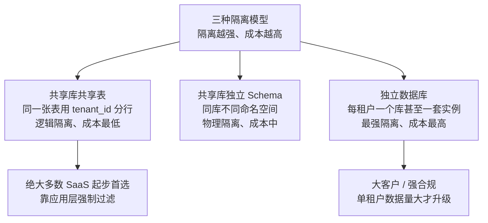
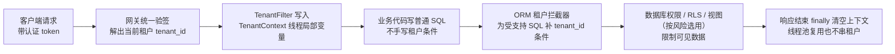

# 阶段六 · 小点 7：多租户设计（SaaS 数据隔离）

> 所属：阶段六 架构设计与服务端思维
> 定位：多租户是 SaaS 产品的第一道架构题——**不同租户的数据怎么隔离、隔离到什么代价**。核心不是背三种模型，而是建立「租户规模 → 隔离方案」的决策树：什么时候一行 `tenant_id` 就够，什么时候必须物理隔离。本讲把「租户隔离」这条从设计到落地的链路走通。

## 快速入门

> 本节为「多租户速览」：先认识多租户是什么、三种隔离模型；「强制隔离、噪邻」留在正文提高部分。

### 本讲关键词与概念速查

| 关键词 | 一句话大白话 | 设计边界 |
|-|-|-|
| 多租户（Multi-tenancy） | 一套系统服务多个租户（客户） | SaaS 平台 |
| 租户 | 一个独立的客户或组织 | 公司 A、公司 B |
| tenant_id | 标识数据属于哪个租户的字段 | 租户作用域的表、缓存键和唯一约束才需要它 |
| 共享表 | 所有租户共用同一张表 | 行级隔离需要应用与数据库防线配合 |
| 独立 Schema | 同一数据库实例内的不同命名空间 | 隔离程度取决于数据库权限、连接和运维边界，并非独立实例 |
| 独立库 | 每个租户使用独立数据库或实例 | 隔离更强，迁移、连接和运维成本更高 |
| 租户上下文 | 当前请求或任务的可信租户身份 | `ThreadLocal` 只适合受控同步调用，异步需显式传递 |
| 租户拦截器 | 为受支持 SQL 自动附加租户条件 | 不能替代原生 SQL、后台任务和直连数据库的防护 |
| 噪邻（Noisy Neighbor） | 一个租户拖慢共享资源 | 配额、限流、分片或独立资源隔离 |

### 本讲在解决什么问题

- **问题**：SaaS 平台有多个租户（客户），它们的数据必须隔离——不能让公司 A 看到公司 B 的数据。隔离程度不同，成本也不同。
- **你要带走的一句话**：共享表、独立 Schema 和独立库是在隔离、运维成本与租户规模间取舍的工具；具体选型还取决于数据库权限模型、合规、噪邻风险、备份恢复和迁移能力。

### 最简示例（形态示意，非完整可运行）

```java
// 共享表 + tenant_id: 最常用的隔离方式(成本最低)
// ① 租户作用域的业务表带 tenant_id 字段
//    CREATE TABLE `order` (id, tenant_id, order_no, ...);
//    唯一索引要带租户: UNIQUE(tenant_id, order_no) —— 不同租户可重复, 同租户唯一

// ② 受支持的 ORM 查询可由租户拦截器补 tenant_id；原生 SQL、任务和直连路径仍须单独覆盖
public class TenantLineHandlerImpl implements TenantLineHandler {
    @Override public Expression getTenantId() {
        return new LongValue(TenantContext.get());      // 从上下文取当前租户
    }
    @Override public String getTenantIdColumn() { return "tenant_id"; }
}
```

> 代码备注（逐行解释）：
> - ① **表带 tenant_id**：租户作用域的业务表加 `tenant_id`；若 `order_no` 的唯一性只在租户内成立，唯一索引写为 `(tenant_id, order_no)`。
> - ② **自动带租户**：MyBatis-Plus 的 `TenantLineInnerInterceptor` 可给其支持的 SQL 补充租户条件；须针对 join、原生 SQL、数据修复脚本、异步任务和直连数据库另设防线与测试。
> - ③ **租户上下文**：请求进来时，从 token/网关透传的 `X-Tenant-Id` 塞进 `TenantContext`（ThreadLocal），业务层统一取。
> - 关键：租户 ID 必须绑定到已认证且受信任的工作负载身份，不能直接信任客户端 body 或可伪造 header。
> - 省略了 `TenantContext`、MyBatis-Plus 依赖、认证身份校验、全局表白名单及异常处理；示例只解释隔离链路，不可直接复制到生产。

### 常用约定 / 命名提示

- **先共享表起步**：多数 SaaS 用共享表 + tenant_id（成本最低），别急着「每租户一个库」——那是过度的。
- **租户 ID 只能来自身份**：由网关/认证解析，禁止从请求 body 取。
- **缓存 key 要带租户**：`user:profile:{tenantId}:{userId}`——否则两个租户同 userId 会串缓存。
- **索引按查询设计**：高频查询若总以 `tenant_id` 等值过滤，常以它作为联合索引前缀；还要结合其他过滤列、排序列、选择性与执行计划验证，不能把它当作所有查询的固定布局。

## 精简大纲

1. 三种租户模型：共享表 / 共享库独立 Schema / 独立库
2. 选型决策树：租户规模与合规约束
3. 租户上下文：请求里怎么带 tenant_id
4. 强制隔离：防「跨租户越权」的工程手段
5. 多租户的坑：连接数 / 索引 / 迁移 / 噪邻

## 学习内容详情

### 1. 三种租户模型：从共享到独立

| 模型 | 数据存放 | 隔离强度 | 成本 | 适用 |
|-|-|-|-|-|
| **共享库共享表（Pool Model）** | 同一张表，用 `tenant_id` 区分行 | 逻辑隔离（应用层保证） | 最低 | 大量中小租户、单租户数据量小（绝大多数 SaaS 起步） |
| **共享库独立 Schema（Schema-per-tenant）** | 同库不同 Schema（`tenant_a.order`） | 命名空间与权限边界；仍共享实例资源 | 中 | 租户量中等、需要一定隔离、数据可控 |
| **独立数据库（Database-per-tenant）** | 每租户一个库（甚至一套实例） | 最强隔离 | 最高 | 大客户、合规/安全要求高、单租户数据量大或写入强 |



> 🧩 **类比（生活版）**：三种隔离模型 ≈ 三种合租方式——
> - 生活版：一套房子三家合租、各住一屋、共用客厅和厨房（**共享表**：同表不同行）；手头宽裕就换"每户独门独户、还在同一栋楼"（**独立 Schema**：同库不同命名空间）；再有钱就各家单独一栋楼（**独立库**）。隔离越彻底，物业费越高——独立门禁、独立水电表、独立门锁都是钱。
> - 换成技术：隔离级别越高，运维成本越高。**共享表**只有一份 schema，加列、备份、发版一次搞定；换成**独立库**后，每个租户都要独立备份、独立监控、独立升级，运维动作全部乘上租户数。

> **直觉前提（成本账）**：
> - 三种模型不是「技术高低」，而是一笔**成本账**——隔离越强，运维和成本越高。
> - 大多数 SaaS 用「共享表 + tenant_id」起步，靠**应用层强制过滤**做到逻辑隔离。
> - 只有真到「单租户数据量大 / 强合规 / 大客户定制」，才升级物理隔离。

### 2. 选型决策树：先问四个问题

```text
租户数多吗? 单租户数据量大吗? 有强合规/大客户吗? 租户间需要差异化 schema 吗?
├─ 租户多 + 单租户数据小 + 无硬合规   →  共享表 + tenant_id（首选，横着走）
├─ 租户有一定数量 + 需要 db 级隔离     →  共享库独立 Schema（schema_per_tenant）
├─ 单租户数据大 + 合规敏感 + 大客户     →  独立库（database_per_tenant）
└─ 租户间 schema 差异大(定制字段)      →  独立库 或 行级 + 动态列(慎, 复杂)
```

> **反过度设计**：别一上来就「每个租户一个库」——那是为「未来的大客户」付今天的运维成本，和「给 3 页官网配 SSR」一个道理（呼应第 4 讲反模式）。先用共享表把业务跑通，数据真大了再按「租户规模迁移」逐步升级。

> ⏸️ **短期可以不学**：复杂 SaaS 多租户高级特性（租户级动态 schema / 动态列、每租户加密密钥与 KMS 多租户编排、万级租户自助迁移平台）——这是 Salesforce 级多租户平台的专属复杂度，绝大多数业务用共享表 + tenant_id 或独立 schema 就能交付。**何时回来学**：真正做 toB SaaS，出现大客户定制 / 强合规 / 万级租户时才需要。**面试最低要求**：能对比三种模型并说出升级触发条件即可。

### 3. 租户上下文：请求里怎么带 tenant_id

```java
// 租户上下文用 ThreadLocal 传递(阶段一第5讲) —— 为什么不用传参: tenant_id 在 Mapper/Service/缓存层到处要用,
// 传参会污染所有方法签名; ThreadLocal 让请求线程内"隐式全局可见", 用完即清(线程池复用必须 remove, 同 MDC)
public final class TenantContext {
    private static final ThreadLocal<Long> TENANT = new ThreadLocal<>();
    public static void set(Long tenantId) { TENANT.set(tenantId); }
    public static Long get() { return TENANT.get(); }
    public static void clear() { TENANT.remove(); }      // 线程池复用必须清理(同 MDC)
}
```

```java
// 拦截器: 从 JWT/Header 解析 tenant_id → 塞进 TenantContext → 进业务层统一用
@Component
public class TenantFilter extends OncePerRequestFilter {
    @Override
    protected void doFilterInternal(HttpServletRequest req, HttpServletResponse resp, FilterChain chain)
            throws ServletException, IOException {
        try {
            String tenant = req.getHeader("X-Tenant-Id");
            if (tenant == null || tenant.isBlank()) throw new ForbiddenException("缺少租户");
            TenantContext.set(Long.parseLong(tenant));          // 上游网关透传; 验签由网关完成
            chain.doFilter(req, resp);
        } finally {
            TenantContext.clear();                              // 必须清, 否则线程池复用串租户
        }
    }
}
```

- **租户 ID 从哪来**：由已认证身份的声明或网关签发的内部凭据派生。若下游收到 `X-Tenant-Id`，必须确保客户端不能直连伪造该 header，并通过网关身份、服务间认证或签名等机制证明来源；仅靠「内网」或一个裸 header 不是身份校验。
- **禁止直接信任请求 body 的 tenant_id**：客户端传入的租户号只能作为业务筛选条件，不能决定调用者的租户身份；真实身份由认证结果决定。

### 4. 强制隔离：防「跨租户越权」的工程手段

```text
原则: 隔离不是"记得 + WHERE tenant_id=?", 而是"默认就带上, 忘了就报错"
```

**为什么需要多层「强制」**：租户拦截器能把常规 ORM 路径从「每个接口记得写条件」收敛为默认隔离，但应用通常不是唯一数据入口：原生 SQL、数据修复脚本、后台任务、ETL、管理后台和数据库直连都可能绕过它。根据风险选择数据库角色/视图、行级安全（RLS）、受限运维账号、任务身份传递和跨租户测试；拦截器是其中一层，不是安全证明。



> **一句话理解**：多租户的越权本质是**水平越权**（横向改权限对象——改成看别人家的数据，而不是纵向提权当管理员）的多租户形态：攻击者只需改一个 `tenant_id` 就能看别家数据。所以隔离不是可选项，是默认项。

**① 自动注入 tenant_id（MyBatis 拦截器 / JPA 全局过滤器）**

```java
// 形态示意：MyBatis-Plus 的 TenantLineInnerInterceptor 只覆盖其支持的 SQL 路径；需用版本文档和测试确认覆盖面
@Bean
public MybatisPlusInterceptor tenantInterceptor() {
    MybatisPlusInterceptor interceptor = new MybatisPlusInterceptor();
    interceptor.addInnerInterceptor(new TenantLineInnerInterceptor(         // 租户行级拦截器
        new TenantLineHandler() {
            @Override public Expression getTenantId() {
                return new LongValue(TenantContext.get());                  // 从上下文取
            }
            @Override public String getTenantIdColumn() { return "tenant_id"; }
            @Override public boolean ignoreTable(String tableName) {
                return tableName.startsWith("sys_");                        // 平台级全局表不拦
            }
        }));
    return interceptor;
}
```

**② 唯一索引带租户**（防跨租户业务键冲突）

```sql
-- 同一租户下 order_no 唯一, 但不同租户可以重复 —— 联合唯一, 别只做单列
CREATE UNIQUE INDEX uk_tenant_order ON `order` (tenant_id, order_no);
```

**③ 查询/缓存 key 都要带租户**

```java
// 缓存 key 必须含 tenant_id —— 否则两个租户用同一 user_id 会缓存串数据
String cacheKey = "user:profile:" + tenantId + ":" + userId;
```

### 5. 多租户的坑：连接数 / 索引 / 迁移 / 噪邻

- **连接数爆炸**（独立库模型）：每租户一个库，连接数随租户数线性增长。
  - **为什么是问题**：连接数 × 租户数线性涨，而 DB 的 `max_connections` 是硬上限，且每条连接还占内存与文件句柄。
  - **怎么配额度**（租户级资源配额的一种）：连接池必须设上限 + 用 HikariCP（阶段三第 1 讲）按租户池化——小租户共享池、大租户独享池。

  ```mermaid
  flowchart TB
      A["独立库模型<br/>每租户一个库"] --> B["连接数随租户数<br/>线性猛涨"]
      B --> C["撞到数据库连接数硬上限<br/>max_connections"]
      C --> D["新租户请求排队超时<br/>大面积拖慢"]
      B -. 对策 .-> E["连接池设上限<br/>用 HikariCP 按租户管控"]
      E --> F["小租户共享连接池<br/>大租户独享池"]
  ```
- **索引要带租户前缀**：
- **规则**：若主查询稳定地以 `tenant_id` 等值过滤，可把它置于联合索引前缀（如 `(tenant_id, user_id, created_at)`）；若查询首先按时间范围、全局运营检索或其他高选择性条件过滤，则需按真实 SQL 设计索引。
- **原因**：B+ 树的最左前缀会影响可用索引列，但 `tenant_id` 不在最左并不必然全表扫描或 filesort；使用 `EXPLAIN`、数据分布和排序需求验证索引，而不是套固定顺序。
- **迁移是重活**：从「共享表」升级「独立库」= 老数据按租户分批导出导入 + 对账。
  - **时机**：规划好在租户数还没爆炸时做，别等到几万个租户再动（呼应分库分表「分片数一次定够」，第 3 讲的思路同源）。

> ⏸️ **短期可以不学**：大规模租户迁移的自动化平台（迁移编排、双写对账工具链）——一次性的「共享表 → 独立库」迁移用「分批导出导入 + 对账脚本」就能完成，自动化平台是为「频繁迁移 / 万级租户」准备的。**何时回来学**：平台化输出迁移能力、租户上千且持续有迁移需求时。**面试最低要求**：能说出迁移步骤与对账思路即可。
> 🧩 **类比（生活版）**：噪邻问题 ≈ 合租房里的吵闹室友——
> - 生活版：合租房里一个室友整晚打游戏下大文件，把公用带宽占满，你连网页都打不开——一个租户把大家的房子拖垮了。
> - 换成技术：共享表共用一台实例时，一个大租户的慢查询 / 大事务占满 IO 和连接，其他租户的请求全部变慢甚至超时，这就是噪邻（Noisy Neighbor）。

- **噪邻问题**（共享表共用实例）：
  - **规则**：一个大租户的慢查询 / 大事务可能拖累整台实例——共享表对「租户方差大」的场景不友好。
  - **对策**：大租户就独立库，或至少独立实例 / 独立 schema，把噪声关进单独的房间里。
- **测试不能只测单租户**：多租户最经典的 bug 是「单租户测试全绿、双租户一跑就串数据」——用例必带「租户 A 的 token 查租户 B 的资源」矩阵（呼应阶段六第 5 讲越权矩阵）。
- **审计/合规**：多租户的日志、审计表、加密密钥都要能按租户追溯——尤其独立库的加密主密钥可按租户分（租户密钥隔离，KMS 多租户支持）。

## 坑点提醒

- **忽略租户上下文清理**：`TenantContext` 忘了 `clear()`，线程池复用时下一个请求可能拿到上一个租户的 ID；用 `try-finally` 清理，并为异步任务显式传递或重新建立上下文。
- **缓存不带租户**：`user:profile:123` 被两个租户共用——缓存击穿后第一个租户把数据写进去，第二个租户读到错数据。
- **全局表误拦**：把 `sys_dict` / `sys_config` 这类平台级表也加了 tenant 拦截，导致全租户共享的字典被拆成 N 份——用 `ignoreTable` 放行平台表（呼应分库分表的广播表 Broadcast Table 概念）。
- **租户 ID 来自请求体**：把 `tenant_id` 当参数传，等于给攻击者一张「换租户通行证」——必须来自认证过的身份。
- **旁路绕过拦截器**：原生 SQL、数据修复、ETL、后台任务和管理后台若没有租户身份与数据库权限约束，可能绕过 ORM 防线；把它们纳入设计评审与跨租户测试。

## 本节自检

- [ ] 能说清三种租户模型的隔离强度、成本差与适用场景
- [ ] 能给一张「租户数 / 数据量 / 合规」→ 选型决策表，并说出为什么多数 SaaS 先从共享表起步
- [ ] 能设计「网关解析 → TenantContext 传递 → 业务统一取」的租户上下文链路
- [ ] 能用拦截器自动注入 `tenant_id`，并说清 `ignoreTable` 放行平台表的必要性
- [ ] 能列出多租户最容易踩的 4 个坑（上下文清理 / 缓存串 / 连接数 / join 漏租户）

**场景核对**：某报表由凌晨任务直接执行原生 SQL，未经过 Web 过滤器和 ORM 拦截器。不能因为白天接口已注入 `tenant_id` 就判定安全；任务需要可信租户身份、显式过滤或受限数据库视图/RLS，并用租户 A 的任务无法读取租户 B 数据的集成测试验证。索引是否以 `tenant_id` 开头，再用该报表的实际 SQL 和 `EXPLAIN` 判断。

## 本节配套思考题

1. 「共享表 + tenant_id」起步后，某大客户要求数据独立——迁移路径怎么规划？先迁库还是先迁 schema？对账与停机窗口怎么做？
2. 平台级全局表（字典/配置）在多租户下怎么处理？跟「分库分表的广播表」是同一种思路吗？（提示：一个不拆、一个全库副本）
3. 多租户的索引设计：在什么查询模式下应把 `tenant_id` 放在联合索引前缀？如果主查询还按 `created_at` 排序，如何结合真实 SQL、选择性与 `EXPLAIN` 决定索引？
4. 连接池怎么按租户隔离？小租户共享池、大租户独享池的取舍依据是什么？

## 常见面试题

### Q1：多租户数据隔离的三种方案怎么对比？怎么选型？
**答**：

**标准结论**：三种模型的隔离和成本通常递增，但具体效果取决于数据库权限、实例资源和运维边界——
- 共享库共享表 + tenant_id：逻辑隔离、成本最低。
- 共享库独立 Schema：同库命名空间和权限边界，仍共享实例资源，成本中。
- 独立数据库：最强隔离、成本最高。
- 多数 SaaS 用共享表起步；大客户 / 强合规 / 单租户数据量大才升级物理隔离。

**原理层**：本质是一笔成本账——
- 共享表只有一份 schema，加列、备份、发版一次搞定。
- 独立库后每租户独立备份、监控、升级，运维动作全部乘上租户数。
- 隔离越强，成本线性涨；选型不是「技术高低」，是用运维成本换数据安全。

**工程层**：决策树看四个问题——租户数多吗、单租户数据量大吗、有强合规 / 大客户吗、租户间需要差异化 schema 吗。
- 先用共享表把业务跑通，数据真大了再按「租户规模迁移」逐步升级。
- 别为「未来的大客户」付今天的运维成本。
- **面试加分**：能说出每种方案的升级触发条件，比背三种模型更能体现理解。

### Q2：共享表方案怎么保证一个租户看不到另一个租户的数据？
**答**：标准结论——「多层隔离」：受支持 SQL 的自动租户条件 + 租户作用域的唯一索引和缓存键 + 来自认证身份的租户 ID；对原生 SQL、后台任务和直连数据库再叠加数据库权限、视图或 RLS 等防线。
**原理层**：
- ORM 租户拦截器可把常规路径收敛为默认隔离，但它不是唯一数据入口，也不是对所有 SQL 的自动证明；原生 SQL、运维脚本、ETL 和异步任务都要被显式覆盖。
- 多租户的越权本质是水平越权的多租户形态：攻击者只需改一个 `tenant_id` 就能看别家数据。
- 所以租户 ID 只能来自网关验签后的身份，绝不能信请求 body。

**工程层**：
- 全局表（字典 / 配置）用 `ignoreTable` 放行。
- 缓存 key 统一模板 `user:profile:{tenantId}:{userId}`。
- 测试必带「租户 A 的 token 查租户 B 的资源」矩阵。
- join 多表时所有表都要有租户过滤，只加主表 = 跨表串租户。
- **面试补充**：ThreadLocal 上下文请求结束必须 `clear`，线程池复用会串租户。

### Q3：多租户的 TenantContext（ThreadLocal）为什么会串租户？怎么避免？
**答**：标准结论——TenantContext 用 ThreadLocal 存当前租户 ID，线程池复用线程时若忘记清理，下一个请求会读到上一个租户的 ID——功能正常、数据悄悄错位，是多租户最隐蔽的高频事故。
**原理层**：
- ThreadLocal 是「每线程一份变量」，请求线程处理完归还线程池时变量还留在线程上。
- 下个请求复用到同一线程，不 `remove()` 就读到旧值——功能正常、数据悄悄串位。
- 为什么比越权还难排查：接口不报错、数据是「错」的而不是「没有」。

**工程层**：
- 拦截器 / 过滤器用 try-finally 保证 `TenantContext.clear()`（和 MDC 清理同一个道理）。
- 禁止在子线程（@Async / 线程池）里直接读 TenantContext——要么显式透传、要么在子线程里重新 `set`。
- 测试必带双租户并发用例。
- **面试加分**：能说出「为什么用 ThreadLocal 而不用传参」——tenant_id 在 Mapper / Service / 缓存层到处要用，传参污染所有方法签名，ThreadLocal 让请求线程内隐式可见。

### Q4：多租户下缓存、唯一索引、连接池分别要注意什么？
**答**：

**标准结论**：
- 租户作用域的缓存 key 必须带 `tenantId`；平台级共享缓存按其自身作用域设计。
- 当业务号只要求租户内唯一时，唯一索引使用 `(tenant_id, order_no)`；全局唯一业务号则按全局约束设计。
- 连接池要按租户隔离，小租户共享池、大租户独享池。

**原理层**：三个问题的根因不同——
- 缓存串数据：两个租户的 userId 相同（都是 1），不带租户的 key 互相覆盖。
- 唯一索引：不同租户的业务号允许重复、同一租户内才唯一，单列唯一索引会误伤别的租户。
- 连接数是硬资源：独立库模型下连接数 × 租户数线性涨，而 DB 的 `max_connections` 是上限、每条连接还占内存与文件句柄。

**工程层**：
- 租户作用域的缓存 key 可统一为 `user:profile:{tenantId}:{userId}`；共享数据使用独立命名空间。
- 高频查询若以 `tenant_id` 等值过滤，常把它放在联合索引前缀；最终根据真实 SQL、选择性和 `EXPLAIN` 决定，不能机械套用。
- 连接池总量与租户配额需设上限；是否独享连接池取决于数据源数量、连接预算和噪邻风险。
- **面试加分**：大租户独立实例是噪邻问题（Noisy Neighbor）的兜底——一个租户的慢查询 / 大事务不该拖垮所有人。
