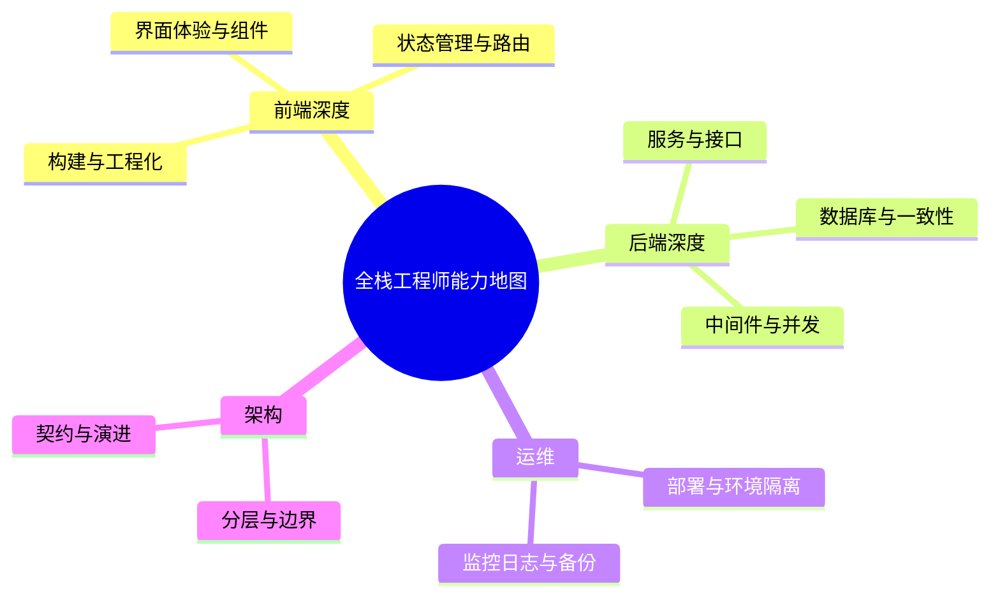
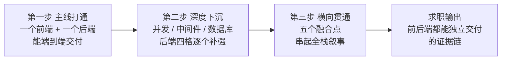
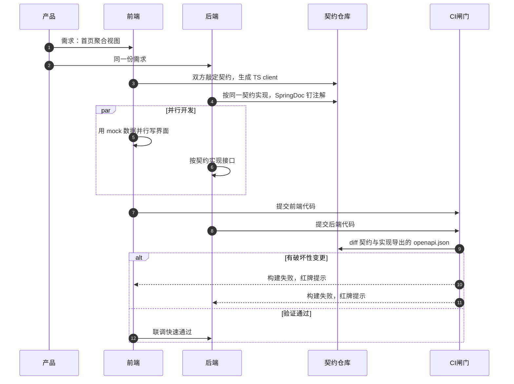

# 阶段七 · 小点 1：全栈能力模型

> 所属：阶段七 全栈融合与项目实战
> 定位：把前端能力和后端能力真正打通，形成「全栈架构」思维。你最大的优势是前端底子厚——不要丢，要把它变成差异化竞争力。本讲给出五个「前后端都要深才有竞争力」的融合点，每个都配可落地的代码骨架。

## 快速入门

> 本节为「全栈能力速览」：先认识全栈融合的五个点是什么、各自解决什么问题；「BFF、契约管理」留在正文提高部分。

### 本讲关键词与概念速查

| 关键词 | 一句话大白话 | 例子 |
|-|-|-|
| 全栈 | 前后端都能搞定 | 既写 React 又写 Java |
| BFF | 为某类前端聚合接口的中间层 | 聚合订单/用户/积分 |
| 契约先行 | 先定接口契约再开发 | OpenAPI |
| OpenAPI | 接口描述标准 | `openapi.yaml` |
| 契约测试 | 校验实现与契约一致 | 前后端不漂移 |
| SSR | 服务端渲染 | 快首屏 + SEO |
| 前后端协同规范 | 统一的响应/错误码约定 | `{code,message,data}` |
| 一体化部署 | 前后端一起交付 | nginx + 后端 |

### 本讲在解决什么问题

- **问题**：纯前端做不了、纯后端做不好的交叉地带，恰恰是你的差异化竞争力。五个融合点：BFF、API 契约、SSR、一体化部署、协同规范。
- **你需要明确的点**：**BFF**（聚合页面的中间层）+ **契约先行**（OpenAPI 定接口，双方从契约生成代码）是你最能体现全栈价值的两块——把「前端底子厚」变成「前后端都深」的差异化优势。

### 最简形态示意（OpenAPI 片段）

> 这段 YAML 只展示契约的关键形态，不能单独运行：`HomePageView` 是首页聚合视图的数据结构；其完整 schema、鉴权、错误响应和生成/校验插件配置均在正文补齐。

```yaml
# OpenAPI 契约: 接口的唯一事实源(契约先行)
openapi: 3.0.3
info: { title: 首页 BFF API, version: 1.0.0 }
paths:
  /api/app/home/{userId}:
    get:
      operationId: getHomePage        # 生成的 TS client 方法名来自它
      parameters:
        - { name: userId, in: path, required: true, schema: { type: integer } }
      responses:
        "200":
          content:
            application/json:
              schema: { $ref: "#/components/schemas/HomePageView" }
```

> 说明（逐行解释）：
> - 先定义**接口契约**（OpenAPI YAML）——前端和后端都从它出发。
> - 前端：用 `openapi-typescript` 从契约生成强类型 client（后端改字段 → 前端编译期报错）。
> - 后端：用 SpringDoc（把 Java 接口自动翻译成 OpenAPI 描述的库）注解「钉」在契约上（启动后 `/v3/api-docs` 自动生成）。
> - CI 里做**契约测试**：校验实现和契约没漂移（删字段/改类型会让构建失败）。
> - 这就是「契约先行」：把「前后端不一致」从联调期提前到提交时——这是全栈工程师的核心竞争力。

### 常用约定 / 命名提示

- **统一响应体**：`{code, message, data}`——成功是 HTTP 200 + `code=0`；失败也保留同一 JSON 形状，但必须使用与失败语义一致的 HTTP 状态，不能把所有失败塞进 200。
  - **本项目当前契约**：未认证是 **HTTP 401 + `code=40100`**，无权限是 HTTP 403 + `code=40300`，参数错误是 HTTP 400 + `code=40000`，冲突是 HTTP 409 + `code=40900`，未预期异常是 HTTP 500 + `code=50000`。`code` 用来细分前端动作，HTTP 状态供浏览器、网关、监控与缓存基础设施判断；两者不能互相替代。
  - **不要混用 `40101`**：它可以是其他团队自定义的“登录态失效”业务码，但不是本仓库 `ErrorCode` 的现有值。若产品决定采用它，应同时修改共享错误码枚举、接口契约与集成测试，而不是只改前端判断。
- **BFF 的纪律**：不写业务规则、不直连数据库、按端一份（Web-BFF / App-BFF 分开），别膨胀成第二个业务层。
  - **为什么不能写业务规则**：BFF 一旦出现 if-else 业务判断，同一规则就在领域服务和 BFF 各存一份，改一处漏一处。
  - **BFF 的价值只在「视图适配」**：把领域数据裁成这个端要的形状，规则永远下沉到拥有数据的地方。
- **契约先行配 CI 契约校验**：否则 YAML 没人更新、生成的类型全是 `any`，形同虚设。

## 精简大纲

1. 全栈能力模型总图：前端深度 × 后端深度 → 五个融合点
2. BFF 层设计：为多端裁剪聚合的视图适配层
3. API 契约管理：OpenAPI 契约先行 + 类型生成 + 契约测试
4. SSR / 同构渲染与一体化部署
5. 前后端协同规范：错误码 / 分页 / 版本化的统一约定

## 学习内容详情

### 1. 全栈能力模型

```mermaid
flowchart LR
    subgraph 前端深度
        FE1[React / Vue 架构设计]
        FE2[微前端]
        FE3[性能优化]
        FE4[工程化与构建]
    end

    subgraph 后端深度
        BE1[Spring 生态]
        BE2[分布式架构]
        BE3[数据库设计]
        BE4[中间件能力]
    end

    subgraph 全栈融合
        FS1[BFF 层设计]
        FS2[API 契约管理<br/>OpenAPI / tRPC 思想]
        FS3[SSR / 同构渲染]
        FS4[一体化部署]
        FS5[前后端协同规范]
    end

    FE1 --> FS1
    FE2 --> FS1
    FE3 --> FS3
    FE4 --> FS5
    BE1 --> FS1
    BE2 --> FS2
    BE3 --> FS2
    BE4 --> FS4

    style FS1 fill:#fef3c7,stroke:#f59e0b
    style FS2 fill:#fef3c7,stroke:#f59e0b
    style FS3 fill:#fef3c7,stroke:#f59e0b
    style FS4 fill:#fef3c7,stroke:#f59e0b
    style FS5 fill:#fef3c7,stroke:#f59e0b
```



> 用法：五个融合点是「纯前端工程师做不了、纯后端工程师做不好」的交叉地带——求职叙事里它们就是你的差异化标签。

> 把镜头拉远一点：上面的图是**本讲的课程模型**（前端深度 × 后端深度 → 五个融合点）；下面这张是**一个合格全栈工程师的完整能力地图**——除了前后端，还要常年带着运维与架构两片水域，至少知道位子在哪。前端是你的主场（左上象限直接复用），增量主要在后端深度、运维、架构这三片。



> 路再长，也有一条走得通的进阶路径——**不是一次铺满，而是「先打通一条主线 → 再往下沉 → 最后横向贯通」**：



> ⏸️ **短期可以不学**：模型图「前端深度」一列（React/Vue 架构、微前端、性能优化、工程化）本来就是你的主场——这本来就是你的强项，直接复用，主线零投入。别在重复强化前端上花时间，本阶段的增量全在后端四格（Spring 生态 / 分布式 / 数据库设计 / 中间件）。**何时回来学**：不用回来，这列是你求职叙事里「差异化标签」的现成素材。**面试最低要求**：能把这列与后端深度并列，讲出五个融合点的交叉地带即可。

### 2. BFF 层设计

**BFF（Backend For Frontend）**：为某一类前端（Web / App / 小程序）专门服务的后端薄层——把多个领域服务的接口按「这个端需要的视图」裁剪聚合。它不是第二个网关：**网关管流量（路由 / 限流 / 鉴权），BFF 管视图（聚合 / 裁剪 / 适配）**。

- **生活版**：去饭店吃饭，你不会分别跑向后厨、采购部、收银台各点一遍——对服务员说一句「这桌来一份套餐」就行，剩下怎么串起来是服务员的事。
- **换成 BFF（技术结论）**：客户端也不用为了一屏数据分别直连一堆服务来回拼装——把「聚合」这件事从浏览器挪到服务端来做，就是 BFF 这一层。
- 为什么需要：App 首页要「用户 + 订单 + 积分 + 通知」四个域的数据，让 App 直调四个微服务 = 四次移动网络往返 + 客户端拼装逻辑；BFF 一次聚合返回。
- 类比你熟悉的东西：BFF ≈ 前端的「容器组件」——容器负责取数与拼装，展示组件保持纯粹；BFF 把这层从浏览器挪到了服务端。

```java
// BFF 聚合接口：一个请求组装一个「页面」
// 此处 user/order 是强依赖：失败时页面应明确失败；point 是弱依赖：才允许降级为空态。
// 省略：各 Client、DTO、异常映射和线程池 Bean 的定义。
@RestController
@RequestMapping("/api/app/home")
public class HomePageBffController {

    private final UserClient userClient;        // 领域服务的 HTTP 客户端(OpenFeign)
    private final OrderClient orderClient;
    private final PointClient pointClient;
    private final Executor bffExecutor;         // 专用线程池: BFF 的聚合 IO 不许占用别处的池

    public HomePageBffController(UserClient u, OrderClient o, PointClient p, Executor e) {
        this.userClient = u; this.orderClient = o; this.pointClient = p; this.bffExecutor = e;
    }

    @GetMapping("/{userId}")
    public ApiResponse<HomePageView> home(@PathVariable Long userId) {
        // 三路并发拉取——串行调用会把三段 RT 加起来，并发后总 RT 约为最慢的一路。
        var user  = CompletableFuture.supplyAsync(() -> userClient.getProfile(userId), bffExecutor)
                                     .orTimeout(800, TimeUnit.MILLISECONDS);   // 强依赖：最多等待 800 ms
        var order = CompletableFuture.supplyAsync(() -> orderClient.latestOrders(userId, 5), bffExecutor)
                                     .orTimeout(800, TimeUnit.MILLISECONDS);
        var point = CompletableFuture.supplyAsync(() -> pointClient.summary(userId), bffExecutor)
                // 仅弱依赖降级：超时或调用异常均返回空态；completeOnTimeout 不能处理已发生的异常，
                // 所以还需要 exceptionally。
                .completeOnTimeout(PointSummary.EMPTY, 800, TimeUnit.MILLISECONDS)
                .exceptionally(ex -> PointSummary.EMPTY);

        try {
            CompletableFuture.allOf(user, order).join();   // 只等待两个强依赖
        } catch (CompletionException ex) {
            throw new UpstreamUnavailableException("首页核心数据暂不可用", ex);
        }
        return ApiResponse.ok(new HomePageView(user.join(), order.join(), point.join()));
    }
}
```

```java
// 视图 DTO：按「端的渲染需要」裁剪，用 record 表达不可变（阶段一第 2 讲）
// 注意它不等于领域模型——领域服务的 User 有 30 个字段, App 首页只需要 3 个
public record HomePageView(
    UserProfileBrief user,        // 昵称/头像, 不带手机号等敏感字段
    List<OrderBrief> orders,      // 最近 5 单, 只要编号/状态/金额
    PointSummary point            // 可能为 EMPTY(降级), 前端按空态渲染
) {}
```

- **BFF 的纪律**：不写业务规则（编排归应用层）、不直连数据库（只调领域服务）、按端一份（Web-BFF / App-BFF 分开部署，避免互相污染）。
- **先分强弱依赖再谈降级**：用户资料、订单等页面无法正确表达时属于强依赖，超时后返回受控错误；积分、推荐、广告等可缺省字段才是弱依赖，可带默认值返回。`orTimeout` 只限制等待时间，不会自动让失败变成成功；每一条允许降级的分支都要显式给出空态语义和前端渲染策略。

### 3. API 契约管理：契约先行的工作流

**契约先行（Contract-First）**：先定义接口契约（OpenAPI 文档），前端 mock 并行开发、后端按契约实现，最后用契约测试验证两边没漂——对比「代码先行 + 联调对字段」的传统模式，它把「发现不一致」从联调期提前到提交时。

**生活版**：装修前先出设计图纸，水电工、木工各自照图施工，最后验工拿图逐条对——而不是各自先干完，再让设计师补一张「大概长这样」的图。
**换成契约先行（技术结论）**：OpenAPI 文档就是前后端之间那张「设计图纸」——前端照着生成类型、后端照着实现接口、CI 用契约测试「验工」，把不一致从联调期提前到提交时。

> 把「契约先行」画成时间线：**契约是唯一的事实源，前后端从它并行出发**，联调只是最后对上，而不是互相等对方：



```yaml
# openapi/home-api.yaml —— 契约是唯一事实源, 双方都从它生成代码
openapi: 3.0.3
info: { title: 首页 BFF API, version: 1.0.0 }
paths:
  /api/app/home/{userId}:
    get:
      operationId: getHomePage          # 生成的 TS client 方法名就来自它
      parameters:
        - { name: userId, in: path, required: true, schema: { type: integer, format: int64 } }
      responses:
        "200":
          content:
            application/json:
              schema: { $ref: "#/components/schemas/HomePageView" }
components:
  schemas:
    HomePageView:
      type: object
      required: [user, orders, point]
      properties:
        user:  { $ref: "#/components/schemas/UserProfileBrief" }
        orders: { type: array, items: { $ref: "#/components/schemas/OrderBrief" } }
        point: { $ref: "#/components/schemas/PointSummary" }
```

后端用 SpringDoc 把实现「钉」在契约上（注解即文档，启动后 `/v3/api-docs` 自动生成）：

```java
@Operation(summary = "App 首页聚合视图", tags = "home-bff")
@ApiResponses(@ApiResponse(responseCode = "200", description = "聚合成功; point 可能为降级空值"))
@GetMapping("/{userId}")
public ApiResponse<HomePageView> home(
    @Parameter(description = "用户 ID") @PathVariable Long userId) { ... }
```

前端从契约生成强类型 client——这是 **tRPC「端到端类型安全」思想在 Java 生态的等价物**（tRPC 依赖 TS 类型系统跨界，Java 做不到，就用「契约 → 代码生成」达到同样效果）：

```bash
# 前端工程里: 从 OpenAPI 契约生成 TS client(每次契约变更重新生成)
npx openapi-typescript ./openapi/home-api.yaml -o ./src/api/schema.d.ts
```

```typescript
// 生成的类型 + 轻封装的 client —— 后端改字段名/改类型, 这里编译期直接报红
import type { components } from "@/api/schema";

type HomePageView = components["schemas"]["HomePageView"];   // 与后端 record 一一对应

export async function getHomePage(userId: number): Promise<HomePageView> {
  const res = await fetch(`/api/app/home/${userId}`);
  const body = await res.json();
  return body.data;   // 统一响应体的 data 字段(见第 5 节约定)
}
```

```xml
<!-- 契约测试: CI 里 diff 实现(springdoc 导出的 openapi.json)与契约(home-api.yaml)
     破坏性变更(删字段/改类型)会让构建失败——这就是"防漂移"的执行者 -->
<!-- 注意: 做"实现与契约 diff"应该用 openapi-diff/springdoc 对比, 而 openapi-style-validator
     是"风格规范校验"(判断字段命名/描述是否符合规范), 两者不是一回事, 别混用 -->
<plugin>
    <groupId>org.openapitools.openapidiff</groupId>
    <artifactId>openapi-diff-maven-plugin</artifactId>
    <executions>
        <execution>
            <phase>verify</phase>
            <goals><goal>diff</goal></goals>
            <configuration>
                <oldSpec>${project.basedir}/openapi/home-api.yaml</oldSpec>
                <newSpec>${project.build.directory}/openapi.json</newSpec>
                <failOnIncompatible>true</failOnIncompatible>  <!-- 不兼容变更让构建失败 -->
            </configuration>
        </execution>
    </executions>
</plugin>
```

### 4. SSR / 同构渲染与一体化部署

先把两个经常被混用的概念拆开：**SSR（服务端渲染）**只描述“HTML 在服务端先产出”；**同构渲染**则特指同一套 React/Vue 组件先在服务端渲染，浏览器再对相同组件树 hydration（把静态 HTML 接上事件与状态）来恢复交互。它们都可改善首屏/SEO，但不是同一种实现。

| 承载形态 | 服务端产出什么 | 浏览器后续做什么 | 边界 |
|-|-|-|-|
| Spring Boot + Thymeleaf | Java 模板根据模型数据直接输出 HTML | 普通页面跳转或少量独立 JS 增强 | 是传统服务端模板渲染，**不是** React 组件同构/hydration |
| Next.js / React SSR | React 组件在 Node/边缘运行时预渲染 HTML，并传递组件所需数据 | React hydration Client Components，接管交互 | 同一组件树跨服务端和浏览器；不能在服务端组件直接使用 `window`、事件处理等浏览器能力 |
| Spring Boot JSON API + Next.js | Java 提供 BFF/API 数据 | Next.js 负责 React 服务端渲染与 hydration | Java 是数据服务，不是 React 渲染运行时 |

- **React/Next.js 同构路径**：首屏 HTML 由服务端预渲染；浏览器收到 HTML 后先展示非交互预览，再由 JavaScript hydration 客户端组件。Next.js App Router 默认以 Server Components 产出服务端内容，把需状态、事件或浏览器 API 的部分放到 Client Components。
- **Java 模板路径**：Nginx 反代 + Spring Boot 返回 Thymeleaf HTML，也是 SSR，但模板由 Java 填充，不存在“同一 React 组件在浏览器 hydration”的过程。
- **Java 侧的支撑点**：无论选择哪一种，页面需要的数据都应经 BFF/API 在受控网络内获取；缓存按页面/CDN 与数据/Redis 分层设计。不要因为 Next.js 能在服务端取数，就绕过 Java 的鉴权、领域规则或数据边界。

> 前端对照：Thymeleaf 更接近服务端把页面模板一次性渲染完；Next.js 更接近 React 组件树被分到服务端与客户端协作运行。两者都能给首屏 HTML，但“有 HTML”不等于“同构”。[Thymeleaf 官方教程](https://www.thymeleaf.org/doc/tutorials/3.1/usingthymeleaf.pdf)将其定义为服务端 Java 模板引擎；[Next.js 的 Server/Client Components 文档](https://nextjs.org/docs/app/getting-started/server-and-client-components)说明 HTML、RSC Payload 与 hydration 的分工。

> ⏸️ **短期可以不学**：SSR/同构渲染的深度实现（Thymeleaf 模板语法、React hydration 调优）主线不用投入——但必须区分“传统模板 SSR”与“React 同构”。**何时回来学**：真要做 Java 直出首屏、或 SEO 敏感的 Next.js 页面时。**面试最低要求**：说出 SSR 解决首屏与 SEO；Thymeleaf 是 Java 模板 SSR，Next.js 同构还要 hydration；Java 后端也可以只出 JSON 给前端 SSR 层。
- **一体化部署**：前端静态资源与后端服务统一交付。典型形态——前端构建产物打进 nginx 镜像，nginx 同时做静态托管与 API 反代：

```dockerfile
# 一体化镜像: 前端产物 + nginx 反代, 后端单独一个 Spring Boot 镜像
FROM node:20-alpine AS fe-build
WORKDIR /fe
COPY frontend/package*.json ./
RUN npm ci
COPY frontend/ .
RUN npm run build                        # 产物 dist/

FROM nginx:1.26-alpine                   # 以 Docker Hub 当前稳定 tag 为准
COPY --from=fe-build /fe/dist /usr/share/nginx/html
COPY deploy/nginx.conf /etc/nginx/conf.d/default.conf
# nginx.conf 两段: / → 静态文件(index.html 回退支持前端路由);
#                 /api/ → proxy_pass http://backend:8000 (K8s Service 名)
```

> 部署形态选择：中小项目用上面的「nginx + 后端双镜像」；规模上来后静态资源上 CDN、后端只暴露 API——但「前端构建产物如何随版本发布」的命题不变。

### 5. 前后端协同规范

统一约定一次，联调成本降一半——这些约定要在项目第一周就定下来（对应 NestJS 项目里的 interceptor / filter 规范，Java 侧用 `@RestControllerAdvice` 实现，阶段二第 3 讲）：

**生活版**：两个仓库长期互相传件，一个用「包」、一个用「箱」，每次交接都要临时重新约定——真正省时间的是第一周就把装箱标准定下来。
**换成协同规范（技术结论）**：统一响应体 `{code, message, data}`、错误码分段、分页、版本化，就是全栈团队之间的「装箱标准」——第一周定死，后面每天省下的都是反复解释的联调时间。

| 约定项 | 规范 | 说明 |
|-|-|-|
| 响应体 | `{code, message, data}` 三段式 | 成功为 HTTP 200 + code=0；失败仍返回该形状，但 HTTP 状态与 `code` 均按错误分类返回 |
| 错误码 | `40000 / 40100 / 40300 / 40400 / 40900 / 50000` | 当前工程依次表示参数、未认证、无权限、资源不存在、冲突、未预期异常；前端按 HTTP 状态和 code 联合决策 |
| 分页 | `{list, total, page, size}` | 游标翻页用 `nextCursor` 字段 |
| 版本化 | URL 路径 `/api/v1/` | 网关友好，调试直观 |

> 注：认证、授权、参数、资源不存在、冲突和服务端异常都必须回真实 HTTP 状态码，别把任何失败统一塞进 200。HTTP 状态让网关、监控、CDN 识别协议结果；`code` 再告诉前端具体该跳登录、提示、重试还是展示错误页。

```typescript
// 前端统一的响应处理: 所有接口走这一个入口, 错误策略集中在一处
async function request<T>(url: string, init?: RequestInit): Promise<T> {
  const res = await fetch(url, { ...init, headers: { "Content-Type": "application/json", ...init?.headers } });
  const body = await res.json();                    // {code, message, data}

  // 当前工程：认证失败必须同时满足 HTTP 401 与 code=40100，避免仅凭一个可变业务码误跳转。
  if (res.status === 401 && body.code === 40100) {
    location.assign("/login");
    throw new Error("redirecting to login");
  }
  if (!res.ok || body.code !== 0) {
    throw new BizError(body.code, body.message, res.status); // 如 400/403/404/409/500
  }

  return body.data as T;                            // 正常路径: 调用方拿到的就是纯数据
}
```

## 坑点提醒

- **BFF 膨胀成「第二个业务层」**：聚合逻辑里悄悄写了 if-else 业务规则——BFF 只做裁剪与编排，规则一律下沉领域服务。
- **契约文档与实现两张皮**：SpringDoc 注解不写、YAML 契约没人更新，生成的类型全是 any——契约先行必须配「CI 契约校验」否则形同虚设。
- **把所有下游都当成可降级**：当前示例只有积分是弱依赖；用户与订单仍是强依赖，超时会在 800 ms 后让页面返回受控失败。先写清页面的最小可用数据，再为弱依赖设置 `completeOnTimeout` 加 `exceptionally`，不能承诺“任一路慢都不拖垮整页”。
- **一体化镜像里嵌环境变量**：前端构建时把 API 地址打包进 JS（`VITE_API_URL`），换个环境就得重新构建——应该运行时注入或走相对路径 + nginx 反代。

## 本节自检

- [ ] 能画出全栈能力模型图，并标注自己五个融合点的当前水平
- [ ] 能说清 BFF 与网关 / 领域服务的边界（BFF 是视图聚合层，不是第二个网关）
- [ ] 能描述「契约先行」在 Java + React 项目里的完整落地链路（OpenAPI → 代码生成 → 契约测试）
- [ ] 能为 BFF 下游划分强依赖与弱依赖，并用 CompletableFuture 分别实现受控失败与超时降级
- [ ] 场景：积分服务连续超时而用户、订单服务正常时，首页应返回核心数据和积分空态；用户或订单超时则在预算时间后返回受控失败。核对要点是专用线程池、单路超时、仅弱依赖降级，以及前端能识别空态。

## 本节配套思考题

1. BFF 按端拆分（Web-BFF / App-BFF）与共用一个聚合层，各自的代价是什么？什么规模下值得拆？
2. 如果契约测试在 CI 里报「后端删了 `PointSummary.expiredAt` 字段」，这个流水线失败保护了谁？绕过它强行合并会发生什么？
3. tRPC 的类型安全不需要代码生成步骤，而 OpenAPI 方案需要——这多出来的一步除了类型，还给团队带来了什么流程资产？

## 常见面试题

### Q1：你们项目里的 BFF 层是干什么的？它和网关、和普通后端服务有什么区别？

**答**：**标准结论**：BFF（Backend For Frontend）是为某一类前端（Web/App/小程序）专门服务的**视图适配层**，核心职责是「聚合 + 裁剪 + 适配」——把多个领域服务的接口按这个端要的视图拼成一次请求返回。

**原理层**（职责边界：两个对照）：
- **与网关**：网关管流量（路由/限流/鉴权/负载均衡），BFF 管视图（聚合/裁剪/按强弱依赖处理失败）；网关在 BFF 前面，二者不冲突也不可互相替代。
- **与领域服务**：BFF 不写业务规则、不直连数据库，规则必须下沉到拥有数据的领域服务——否则同一规则在两处实现，改一处漏一处。

**工程层**（三个要点 + 选型时机）：
- 按端拆分：Web-BFF / App-BFF 分开部署，避免互相污染。
- 并发与兜底：聚合接口并发调用下游（CompletableFuture + 专用线程池），加单路超时；只有不影响页面正确表达的弱依赖可降级，强依赖失败应返回受控错误。
- 别膨胀成「第二个业务层」。
- 什么时候值得上：多端、多领域服务、客户端确实需要聚合视图时；单体单端直接调后端即可。

### Q2：OpenAPI 契约管理怎么落地？怎么保证前后端不「漂移」？

**答**：**标准结论**：契约先行（Contract-First）的核心是让 OpenAPI 文档成为**接口的唯一事实源**，前后端都从契约出发，把「发现不一致」从联调期提前到提交时。

**原理层**（契约怎么同时约束两边）：
- **后端**：用 SpringDoc 注解把实现「钉」在契约上，启动后 `/v3/api-docs` 自动导出 openapi.json。
- **前端**：用 openapi-typescript 从契约生成强类型 client——后端改字段/改类型，前端编译期直接报红。
- **防漂移的执行者**：CI 里的契约测试，用 openapi-diff 对比契约 YAML 与实现导出的 openapi.json，破坏性变更（删字段/改类型）让构建失败。

**工程层**（三个常见误区 + 收尾）：
- **误区一**：把「实现与契约 diff」（openapi-diff）和「风格校验」（openapi-style-validator）混为一谈——前者查不兼容、后者查命名规范，不是一回事。
- **误区二**：契约更新了但没人重新生成 client，类型退化成 any。
- **误区三**：破坏性变更没走评审，只靠构建失败硬拦——更好的是在 MR 阶段就约定「向后兼容优先」。
- 工程上还要有版本化（`/api/v1/`）与变更评审，契约测试只是最后一道闸。

### Q3：后端统一响应体怎么设计？业务失败该回 HTTP 200 还是对应状态码？

**答**：**标准结论**：统一响应体 `{code, message, data}` 的价值在「**前端只有一个解析入口、错误策略集中一处**」。当前工程约定成功为 HTTP 200 + `code=0`；失败使用真实 HTTP 状态并保留非零 `code` 细分原因。

**原理层**（两种失败的信号该由谁承载）：
- **成功**：HTTP 200 + `code=0`。
- **预期失败**：参数、未认证、无权限、不存在和冲突分别回 400、401、403、404、409；响应中的 `40000`、`40100`、`40300`、`40400`、`40900` 让前端进一步决定表单提示、跳登录或错误页。认证失败不是普通业务 toast，必须真实 HTTP 401。
- **未预期失败**：HTTP 500 + `code=50000`，不能把堆栈、SQL 或令牌验签细节泄露给客户端。

**工程层**：
- 以共享 `ErrorCode` 枚举、OpenAPI 错误响应与前端拦截器作为同一份契约；新增或重编号（例如把 40100 改为 40101）必须同步三处并有集成测试。
- 分页、时间格式等约定也应在项目第一周定死。

### Q4：Java 后端怎么做 SSR？SSR 和 CSR 怎么选？

**答**：**标准结论**：SSR（Server-Side Rendering，服务端渲染）解决两个问题——**首屏快**（HTML 由服务端产出，不用等 JS 下载执行）和 **SEO**（爬虫能直接读到内容）。

**原理层**（先分 SSR 与同构，再选承载形态）：
- **形态一：传统模板 SSR**：Nginx 反代 + Spring Boot 返回 Thymeleaf HTML，适合偏传统、交互少的页面；HTML 是 Java 模板渲染的结果，不是 React 同构。
- **形态二：React 同构 SSR**：Next.js/Nuxt 在其服务端运行时预渲染组件，浏览器再 hydration 交互组件；Java 后端只出 JSON/BFF 数据，仍负责认证、领域规则与数据边界。

**工程层**（选型 + 缓存 + 面试口径）：
- **选型判断**：交互重、用户态强、强登录的页面（如中后台）用 CSR 更划算——SSR 的收益（SEO）用不上，还多一套渲染集群的成本与故障面；内容型、强 SEO 的页面才值得上 SSR。
- **缓存是 SSR 的关键**：页面级 CDN 缓存 + 数据级 Redis 缓存分层失效。
- **面试口径**：说出「SSR 解决首屏与 SEO、Thymeleaf 是模板 SSR、Next.js 同构还包含 hydration、按页面类型选型」四点就够。
