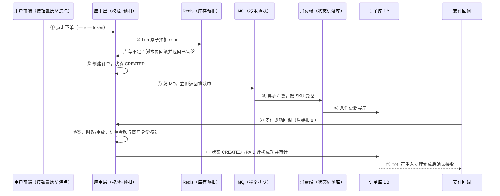
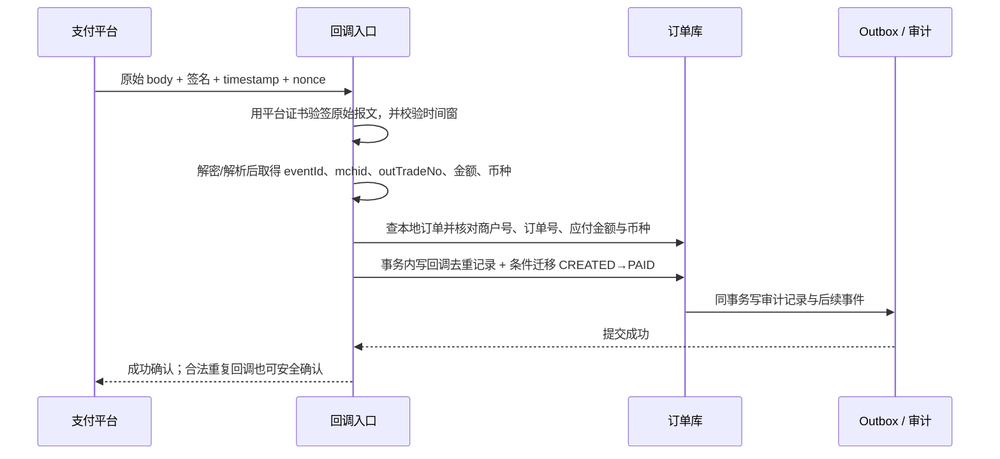
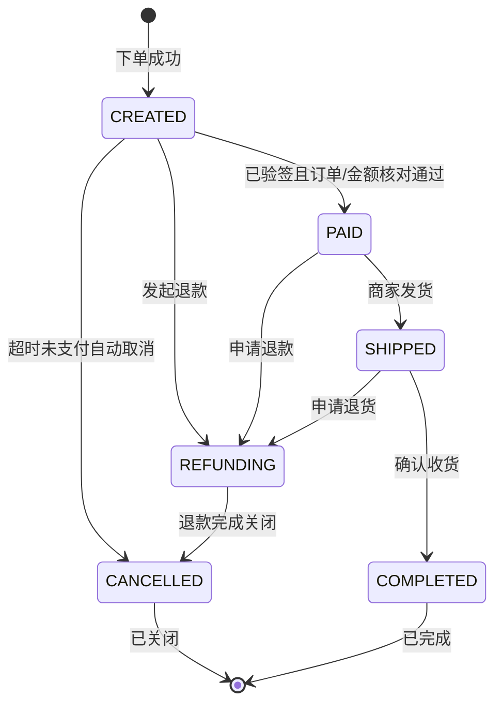
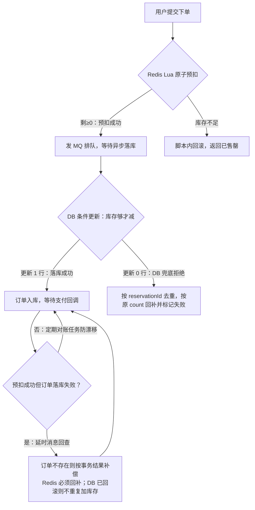
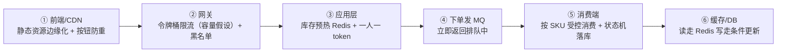

# 阶段七 · 小点 3：项目 2 —— 电商订单系统（高并发方向，阶段 6 后启动）

> 所属：阶段七 全栈融合与项目实战
> 定位：高并发方向的毕业项目——把阶段 3-6 的**核心**技术（缓存 / 状态机 / 限流降级 / 压测 / MQ）串成一个真实业务系统，并产出压测报告。检验标准不是「功能能跑」，是**每个技术选型都能说出它挡住了哪个问题**。
>
> ⚠️ **容量口径先对齐**：本项目不以“500 万日单 / 1 万 DAU”这类没有转化率、峰值窗口和请求边界的组合下结论。[阶段六第 6 讲：容量规划与压测](../06-阶段六-架构设计与服务端思维/06-容量规划与压测.md)中的 500 万日订单只是演算输入：`5,000,000 × 30% ÷ 7200 = 208.33` 入口 QPS，再按峰值系数、余量和压测基线推容量；它不推导 DAU，也不自动得出是否分库分表。本项目以较小、可复现的演练流量学习削峰；是否分片仍由真实数据量、写入/查询水位和压测结果决定。分库分表、SkyWalking、K8s 一律放到「延后扩展」——先把一条核心链路做透，别 45 天摊 7 个组件每个都浅尝辄止。

## 快速入门

> 本节为「项目二速览」：先认识这个项目做什么、技术栈怎么分档、要先跑通什么；「状态机/库存扣减细节」留在正文提高部分。

### 本讲关键词与概念速查

| 关键词 | 一句话大白话 | 例子 |
|-|-|-|
| 电商订单 | 下单/支付/库存的核心链路 | 秒杀、抢购 |
| 状态机 | 订单状态流转（枚举+迁移表） | CREATED→PAID |
| 库存扣减 | 减库存的并发正确性 | 不超卖 |
| 幂等（Idempotency） | 重复请求结果一致 | 防重复下单 |
| 秒杀 | 高并发抢购 | 削峰填谷 |
| 限流降级 | 控制流量/快速失败 | 保住核心 |
| 压测 | 模拟高并发 | k6 测水位 |
| 消峰 | 高峰暂存平稳消费 | MQ 排队 |

### 项目二做什么（三阶段递进）

- **定位**：高并发方向的毕业项目——把阶段 3-6 的**核心**技术（缓存/状态机/限流降级/压测/MQ）串成一个真实业务系统，产出压测报告。
- **检验标准**：不是「功能能跑」，是**每个技术选型都能说出它挡住了哪个问题**。
- **分三档推进**（别一次全上，会浅尝辄止）：
  - **核心链路（必做）**：Spring Boot + MyBatis-Plus + Redis 预扣库存 + 订单状态机 + 限流降级 + k6 压测。
  - **扩展链路（选做）**：RocketMQ 异步化 + 延时消息 + 分段库存。
  - **延后扩展（可选）**：ShardingSphere、SkyWalking、K8s——学完阶段 5 再回来做「架构升级」练习。

### 核心难点速览（正文展开更细）

```text
难点① 订单状态机 + 幂等:  枚举 + 合法迁移表 + WHERE status=? 防重复/乱序
难点② 库存扣减并发正确性:  Redis 原子预扣 + DB 条件更新 + 回补对账 + 分段
难点③ 秒杀全链路削峰:     CDN→网关限流→应用令牌→MQ排队→消费端匀速→DB
```

> 说明（逐行解释）：
> - **状态机**：订单状态用枚举 + 合法迁移表，「非法迁移（`WHERE status=?`）」天然拒绝重复/乱序请求——这就是幂等三板斧之三。
> - **库存扣减**：Redis 原子预扣挡掉绝大多数必失败请求，DB 条件更新做最终一致防线，再加回补 + 对账。
> - **秒杀削峰**：从 CDN 到数据库，每一层都比上一层挡掉更多流量，把「洪峰」变成「长队」。
> - 压测验收：演练流量必须先写清时间窗和计数边界；正文第 4 节以“60 秒 5 万点击”推导入口 QPS、网关放行 QPS 和消费者 TPS。数字只是练习输入，最终阈值必须由目标容量和实测水位反推。

### 关键功能说明

| 功能 | 干什么 | 最易踩的坑 |
|-|-|-|
| 订单状态机 | 状态流转 + 幂等 | 迁移表收进枚举 + 测试 |
| 库存扣减 | 不超卖 | 预扣成功但落库失败要回补对账 |
| 秒杀 | 高并发抢购 | 热点 key 要分段 |
| 压测报告 | 验证水位 | 单接口压测危险，要做场景压测 |
| 高可用演练 | 手动断依赖 | 别上 Chaos Mesh，脚本即可 |

### 常用约定 / 命名提示

- **先做透核心档**：核心链路（下单+库存+状态机+限流+压测）做透，再往扩展档走——别 45 天摊 7 个组件。
- **异步只用于旁路**：核心写路径（订单落库）必须同步成功或显式补偿，别把「都丢给 MQ」当万金油。
- **状态机要画图再写**：CREATED→{PAID,CANCELLED}；PAID→SHIPPED→COMPLETED；所有迁移边落进枚举测试。

## 精简大纲

1. 技术栈与功能清单（三阶段递进）
2. 核心难点 1：订单状态机与幂等
3. 核心难点 2：库存扣减的并发正确性
4. 重点场景：秒杀全链路（每层削峰手段）
5. 工程产出：压测报告 + 演练

## 学习内容详情

### 1. 技术栈与功能清单（三阶段递进）

按「核心跑通 → 扩展渐进 → 可选加餐」分三档，**先做透核心档**：

- **核心链路（必做）**：Spring Boot + MyBatis-Plus + Redis（库存预扣）+ 订单状态机 + 限流降级 + k6 压测。
- **扩展链路（选做）**：RocketMQ 异步化 + 延时消息取消 + 分段库存。
- **延后扩展（可选，阶段 5 学完后回来）**：ShardingSphere 分库分表、SkyWalking 链路追踪、K8s 部署——对已有项目做「架构升级」练习，而不是一开始就上。

> ⏸️ **短期可以不学**：ShardingSphere 分库分表、SkyWalking、K8s 属于「架构升级练习」——主线阶段五之前别碰，它们对「把核心链路做透」没有增量。**何时回来学**：学完阶段 5 后拿本项目做升级练习，或面试明确要求聊分布式时。**面试最低要求**：能说出分库分表的触发信号（数据量/写入 QPS 超单库水位）与引入成本，比背组件配置更值钱。

- **核心功能**：下单、支付回调、库存扣减、订单状态机流转。（ES 搜索、Redis Hash 购物车标为**扩展/选做**，不进核心链路。）

> ⏸️ **短期可以不学**：ES 商品搜索、Redis Hash 购物车是扩展/选做项——主线把核心链路做透即可，它们不会进压测报告的核心结论。**何时回来学**：核心链路跑通后有余力、或面试要讲搜索方案时。**面试最低要求**：说出 ES 解决什么问题（全文检索/复杂过滤）与「ES 是检索加速层、业务真相在 MySQL」的定位即可。
- 对应关系先摆明：缓存三问 ← 阶段三第 4 讲；削峰 ← 第 5 讲；限流降级 ← 阶段六第 3 讲。（ES 搜索 ← 阶段三第 6 讲、追踪 ← 阶段五第 4 讲属于延后扩展，进了扩展档再用到。）

**先看整条「下单 → 支付 → 库存」链路**：下文每个难点（状态机、库存扣减、秒杀削峰）都是这条链路上的一个环节，先搭骨架再看细节——前端下单页你熟悉的「排队中」提示，就是下面第 ④ 步 MQ 在排队：



### 2. 核心难点 1：订单状态机（State Machine）与幂等（Idempotency）

```java
// 状态机 = 枚举 + 合法迁移表; 非法迁移(WHERE status=from)天然拒绝重复/乱序请求 —— 幂等三板斧之三
public enum OrderStatus { CREATED, PAID, SHIPPED, COMPLETED, CANCELLED, REFUNDING }

@Transactional // 条件更新与 Outbox 待投递记录必须同一事务提交；审计也应明确其事务边界
public boolean transit(Long orderId, OrderStatus from, OrderStatus to) {
    // 一条 SQL 完成"检查+迁移": 并发两个 PAID 回调只有一个能 UPDATE 成功(affected=1)
    int n = orderMapper.update("UPDATE `order` SET status=? WHERE id=? AND status=?",
            to.name(), orderId, from.name());
    if (n == 0) {                                  // 状态已被别人迁过 —— 重复回调/乱序回调
        log.warn("非法状态迁移被拒: order={} expect-from={}", orderId, from);
        return false;                              // 支付对账兜底: 别静默
    }
    outboxRepo.save(event(orderId, to));           // 迁移成功 + 待投递记录同事务保存；relay 另行投递、重试与告警（阶段四第 5 讲）
    return true;
}
// 支付回调入口再叠一层幂等: 支付流水号唯一索引 —— 状态机挡业务, 唯一索引挡重放(token 同)
```

#### 支付回调的可信性：先证明“谁发来的、对应谁、金额对不对”，再谈幂等

支付平台的回调是来自公网的外部输入；**`transactionId` 唯一索引只能识别重复，不能证明请求来自支付平台，更不能证明它对应本订单的金额。**以微信支付 API v3 为例，回调头携带平台证书序列号、签名、时间戳和随机字符串；验签串包含时间戳、随机串和原始请求体。通知还带唯一通知 ID、商户订单号、平台交易号、金额和币种。不同渠道字段名、验签算法、重试窗口不同，实际项目必须以所接渠道的官方文档和 SDK 为准。



下面是教学骨架，省略渠道 SDK、证书轮换、报文解密、DAO 与异常到 HTTP 的映射；重点是处理顺序和同一事务内必须落下的证据。`rawBody` 必须是**验签前未改写的原始字节**，不能先反序列化再重新序列化后拿去验签。

```java
// 渠道无关的回调处理骨架：支付网关字段名、签名算法和 ACK 格式均以其官方 SDK/文档为准。
public CallbackAck onPaymentNotify(PaymentHeaders headers, byte[] rawBody) {
    // 1) 身份与新鲜度：平台证书/公钥按 serial 选择；签名覆盖 timestamp、nonce 与原始 body。
    if (!gatewayVerifier.verify(headers.serial(), headers.timestamp(), headers.nonce(),
            rawBody, headers.signature()) || !clock.isWithinAllowedSkew(headers.timestamp())) {
        auditRepo.recordRejected(headers, sha256(rawBody), "invalid-signature-or-stale");
        return CallbackAck.reject();                 // 不进入订单状态机
    }

    PaymentNotice notice = gatewayDecoder.decryptAndParse(rawBody); // 得到 eventId、transactionId、mchid、outTradeNo、amount、currency、status
    Order order = orderRepo.findByMerchantOrderNo(notice.outTradeNo()).orElse(null);
    if (order == null
            || !config.merchantId().equals(notice.merchantId())
            || order.payableMinorUnit() != notice.amountMinorUnit()
            || !order.currency().equals(notice.currency())
            || notice.status() != PaymentStatus.SUCCESS) {
        auditRepo.recordRejected(notice.eventId(), sha256(rawBody), "merchant/order/amount/currency/status mismatch");
        return CallbackAck.reject();                 // 校验不通过，不让外部输入触发订单迁移
    }

    // 2) 一次本地事务：eventId/平台交易号唯一约束挡重放；状态条件更新挡并发与乱序。
    return transactionTemplate.execute(status -> {
        boolean firstSeen = paymentEventRepo.insertIfAbsent(
                notice.eventId(), notice.transactionId(), order.id(), notice.amountMinorUnit(), notice.currency());
        if (!firstSeen) {
            auditRepo.recordDuplicate(notice.eventId(), order.id());
            return CallbackAck.success();             // 已验签的合法重试：可安全确认，不能再次发货/记账
        }
        int changed = orderMapper.markPaidIfCreated(order.id(), notice.transactionId());
        if (changed == 0 && !orderRepo.isPaidBy(order.id(), notice.transactionId())) {
            auditRepo.recordConflict(notice.eventId(), order.id(), "state-conflict");
            return CallbackAck.success();             // 已持久化异常，停止无意义重试，交给对账处置
        }
        outboxRepo.save(PaymentSucceeded.of(order.id(), notice.transactionId()));
        auditRepo.recordAccepted(notice.eventId(), order.id(), sha256(rawBody));
        return CallbackAck.success();
    });
}
```

最小闭环的每一项都有不同职责：

| 校验/记录 | 防住什么 | 不能替代什么 |
|-|-|-|
| 平台签名 + 平台证书/公钥 | 伪造来源、篡改报文 | 不能确认本地订单金额是否匹配 |
| 已签名的时间戳 + nonce，或平台 `eventId` | 截获后的过期重放；`eventId` 也便于识别同一通知 | 不能替代支付流水和订单状态机 |
| 商户号、商户订单号、金额（最小货币单位）与币种 | 把别的商户、别的订单或不同金额的成功通知错配到本订单 | 不能替代验签 |
| 平台交易号/通知 ID 唯一约束 + `WHERE status=CREATED` | 合法重试、并发和乱序导致的重复记账/发货 | 不能确认回调来源真实 |
| 审计记录 + 对账任务 | 追溯验签结论、重复/冲突与人工补偿 | 不能作为实时放行条件 |

> **渠道事实与工程取舍**：微信支付明确要求使用回调头的证书序列号、签名、时间戳、随机字符串和请求体完成验签；其支付成功通知含通知 ID、商户号、商户订单号、金额和币种。平台可能因未及时成功应答而重试，所以“合法重复”要幂等，而“验签失败、金额不符、状态冲突”要审计和对账，不能静默当作支付成功。[微信支付：支付成功回调通知](https://pay.wechatpay.cn/doc/v3/merchant/4012791861) / [微信支付：回调验签与应答](https://pay.wechatpay.cn/doc/v3/merchant/4012712115)

> **生活版**：电影票只能刷一次进场——闸机扫过一次就作废，拿同一张票重复刷会被拦在门外。商家「先检查票用过没、再放行」这两件事是连在一起的。
>
> **换回技术**：状态机的并发正确性就是这么「一张票只放行一次」——`WHERE status=?` 条件更新 = 闸机验票，「检查当前状态 + 迁移到新状态」原子完成；状态已被别人迁过的订单，重复到来的支付回调第二次 UPDATE 影响 0 行，等于「票已刷过，拒绝放行」（幂等三板斧之三）。

把完整迁移图画出来再写代码，所有迁移边落进枚举测试：



- 超时未支付自动取消：**RocketMQ 延时消息**（下单时配置约 30 分钟延迟；具体 API 与延迟级别要按所用 RocketMQ 版本和部署配置确认）→ 到期消费检查状态，已支付则忽略、未支付则取消。它能避免定期扫描大量尚未到期的订单，但仍要保留可索引的扫表/对账任务补漏；成本取决于订单量、索引、扫描周期和 MQ 的延时实现，不能承诺固定“省一个数量级”。
- 状态图先画再写：CREATED→{PAID, CANCELLED}；PAID→SHIPPED→COMPLETED；PAID/SHIPPED→REFUNDING→…——所有迁移边落进枚举测试表驱动用例（阶段二第 5 讲）。

### 3. 核心难点 2：库存扣减的并发正确性

```java
// 第一道闸：Lua 将“扣 count + 判断余量 + 不足时回滚”合为一次 Redis 原子执行。
// 不能用 DECR 后再 INCR：在两条命令之间，其他请求会看到临时负库存。
private static final DefaultRedisScript<Long> RESERVE_STOCK = new DefaultRedisScript<>();
static {
    RESERVE_STOCK.setScriptText(
        "local left = redis.call('DECRBY', KEYS[1], ARGV[1]); " +
        "if left < 0 then redis.call('INCRBY', KEYS[1], ARGV[1]); return -1 end; " +
        "return left");
    RESERVE_STOCK.setResultType(Long.class);
}

if (count <= 0) return fail("数量必须大于 0");
Long left = redis.execute(RESERVE_STOCK, List.of("stock:" + skuId), String.valueOf(count));
if (left == null || left < 0) return fail("已售罄");

// 第二道闸: DB 条件更新(最终一致防线, Redis 故障/超卖兜底)
int n = stockMapper.updateDeduct(skuId, count);       // UPDATE stock SET cnt=cnt-? WHERE sku_id=? AND cnt>=?
if (n == 0) redis.opsForValue().increment("stock:" + skuId, count); // DB 拒绝 → 按原数量回补

// 一致性：为请求分配 reservationId，消费端与回补记录都按它去重；预扣成功但订单落库失败
// (崩溃/业务拒) → 延时消息回查订单，不存在才执行一次回补，再由对账任务收敛遗漏。
//          Redis 与 DB 定期对账任务(XXL-Job 分片, 阶段三第 6 讲)防漂移
```

把上面两道闸画成一张图（请求走一条道，每一处失败都有回补出口）：



> **生活版**：演唱会放 1000 个座位，官方先按顺序发 1000 张「排队资格券」——先到先得，发完即止，后面的人直接被劝退；真正入座前再验券核销，哪怕有人拿了券没来，也不能把超过座位数的人确认为入场成功（就像前端下单页里的「已抢完」提示，就是这套机制的对外表现）。
>
> **换回技术**：资格券 = **Redis Lua 预扣**，脚本以 `DECRBY count` 预留；不足时在同一次执行中回滚，不让临时负库存暴露给其他请求。验券核销 = **DB 条件更新**确认 `cnt >= ?` 才扣；失约回购 = 以 `reservationId` 去重的**回补 + 对账**。以 DB 条件更新作为最终确认门槛，才能保证不会把超过数据库可用库存的订单确认为成功；Redis 丢失、消息失败和补偿异常仍要靠记录与对账收敛。

- **回补失败兜底**：Lua 只解决「本次预扣不足时的原子回滚」，不能自动解决进程崩溃、消息重投或 Redis 抖动后的业务回补。为每次预扣持久化 `reservationId`、数量和状态：补偿消费者先用该 ID 做条件写/唯一约束，确认未回补才按原 `count` 加回；命令或消息失败则重试，最后由库存与预留记录的对账任务收敛。**别把一条可能重试的 `incr` 当成完整一致性方案。**

- 热点行问题：爆款 SKU 单行 UPDATE 锁排队 → **库存分段**：例如把 1 万库存拆成 10 段（`stock_3_0..stock_3_9`），扣减随机选段、某段耗尽再合并。段数须按热点、锁等待和对账成本压测选择；分段的目的，是摊薄单点行锁竞争。

```java
// 分段库存示意: 大 SKU 拆成 N 段, 扣减时按"用户"或"随机"选段, 摊薄单 SKU 热点
// ⚠️ 注意: 别用 skuId.hashCode() 选段 —— 那是确定性哈希, 同一 SKU 永远落在同一段, 热点没摊开
int seg = ThreadLocalRandom.current().nextInt(segmentCount); // segmentCount 是按压测选定的段数
String key = "stock:" + skuId + ":" + seg;             // stock:skuId:seg
long left = redis.decr(key);                            // 只减一段, 其他段可并行
if (left < 0) { /* 该段售罄, 换下一段或走公共兜底段 */ }
```

> 补充：若希望「同一用户始终走同一段」以便后续核对/退款，可按 `userId % N` 选段（用户维度的确定性 + 多用户摊开）；纯粹为了扛并发，用随机选段即可。


### 4. 重点场景：秒杀全链路（每一层怎么削峰）

#### 4.1 先算清演练流量：点击 QPS、放行 QPS 和订单 TPS 不是一个数

以下数字只服务于本地/测试环境的演练，不代表产品规模，更不能从日订单或 DAU 直接拍出限流阈值。它遵循阶段六第 6 讲的“业务目标 → 指定边界 QPS/TPS → 压测校准”顺序：

| 计数边界 | 演练假设 | 推导/用途 |
|-|-|-|
| 网关入口请求 | 60 秒收到 50,000 次点击 | `50,000 ÷ 60 = 833.33`，约 **833 QPS**；包含重复点击/重试，不等于订单数 |
| 网关放行请求 | 限流后最多 200 请求/秒进入下单链路 | 这是入口 QPS 预算；`200 QPS` 不是“200 笔订单 TPS” |
| 消费端确认订单 | 假定每条已放行消息最终对应一笔成功建单，消费者稳定处理 100 笔/秒 | 此时才可近似为 **100 订单 TPS**；若存在失败、重试或一请求多消息，必须重新按业务结果统计 |
| MQ 积压 | 60 秒内生产 200/s、消费 100/s | `(200 - 100) × 60 = 6,000` 条；活动停止后若仍以 100/s 消费，约需 `6,000 ÷ 100 = 60` 秒清空 |

这个算例的验收不是“网关 200 QPS 就上线”，而是验证：p99、错误率、Redis/DB 水位在目标 SLO 内，MQ 积压按预期收敛；任一项不成立，就下调预算、扩容或降级。单机能力和下游配额仍只能由相同场景的压测取得。

```text
用户点击 → ① CDN/前端: 静态资源边缘化 + 按钮防重(点击即置灰) —— 挡误操作与脚本点击
        → ② 网关: 令牌桶(Token Bucket)限流(本演练放行 200 QPS) + 黑名单 —— 挡超额总流量, 超了直接"排队中"
        → ③ 应用: 库存预热到 Redis + 令牌校验(一人一 token, 防脚本连刷)
        → ④ 下单: 不直写 DB —— 发 MQ 立即返回"排队中", 前端轮询/推送结果   ← 同步写变异步消费
        → ⑤ 消费端: 按 SKU 并行度受控消费, 分段库存扣减 + 状态机落库          ← 匀速写保护 DB
        → ⑥ 缓存/DB: 详情读走 Redis(可选+ES), 下单写走单库条件更新             ← 读写分离
```

把上面这条链画成图——每一层都比上一层挡掉更多流量：



> 注：令牌桶（Token Bucket）——限流用的「蓄水池」：按固定速率往桶里**放 token**，请求拿到 token 才放行，突发流量被常年水位拦住。类比体育馆按出口流量分批放观众入场，再挤也最多挤进桶里的量。（实现见阶段六第 3 讲）

> **生活版**：早高峰地铁站台不会一次性放行所有人——护栏把人群切成一小批一小批放进去，车进站匀速上客。人还是那么多，但「瞬时洪峰」被拉成「匀速长队」，站台不会挤爆。
>
> **换回技术**：秒杀链路里 CDN→网关限流→应用令牌→MQ 排队，每一层都是一道「站台护栏」——**把「洪峰」变成「长队」（削峰填谷）**：用户体感是「排队中」而不是「500 错误」，系统体感是匀速消费而不是瞬时打满。
- 压测验收：用 k6 按业务峰值模型构造点击洪峰，记录网关入口/放行 QPS、消费者订单 TPS、MQ 积压收敛和 DB 水位。本节的 60 秒 5 万点击、200 QPS 放行只是演练样例；报告中的阈值必须来自容量目标和实测数据（[阶段六第 6 讲](../06-阶段六-架构设计与服务端思维/06-容量规划与压测.md)）。

### 5. 工程产出

| 产出 | 内容 | 对应学段 |
|-|-|-|
| 压测报告 | 容量水位 + 拐点曲线 + 扩容/降级预案（k6 场景流量模型） | 阶段六第 6 讲 |
| 高可用演练 | 手动模拟：用脚本 stop 一个实例 / 清空 Redis 缓存 / 重启依赖 → 观察熔断降级是否按预案动作 | 阶段六第 3 讲 |
| （延后）链路追踪 | SkyWalking 拓扑图 + 一次慢请求 trace 分析——进了「延后扩展」再补（阶段五第 4 讲） | 阶段五第 4 讲 |

> 高可用演练不必上 Chaos Mesh——先用脚本手动打断依赖、看系统自愈，成本低一个量级，认知收获足够。

## 坑点提醒

- **Redis 预扣后直接返回成功**：用户看到「下单成功」实际无货——异步链路在预扣成功后只能返回「已受理/排队中」，并通过轮询或推送告知最终结果；只有订单与库存落库确认后才能展示「下单成功」。
- **MQ 削峰但消费端比生产端还慢**：积压曲线不收敛 = 削峰变「延迟显形」——消费能力（分段并行度）要按峰值容量目标反推，不是默认并发数。
- **热点 Key 没做分段**：单 SKU 打满一个 Redis 分片——缓存热点与 DB 热点要一起治理（阶段三第 4/6 讲）。
- **状态机只存在于文档**：代码里散着 `if (status == 2)`——迁移表收进枚举 + 测试，乱序回调当天就能测出来。
- **把支付回调当“可信内网消息”**：仅凭订单号或支付流水号就改成 PAID，攻击者可伪造或错配请求。必须先验平台签名和新鲜度，再核对商户号、订单号、金额、币种；验签失败、金额不符与状态冲突都要留下审计记录并进入对账。

## 本节自检

- [ ] 能画出秒杀场景从 CDN 到数据库每一层的削峰手段（对应阶段六第 1 讲链路图）
- [ ] 库存扣减的并发正确性方案能说清（Redis 预扣 + DB 条件更新 + 回补对账 + 分段）
- [ ] 订单状态机能画出完整迁移图，并解释非法迁移请求如何被 `WHERE status=?` 拒绝
- [ ] 能列出支付回调从“收到 HTTP 请求”到“订单可改为 PAID”的最小闭环：验签、时间窗/事件 ID、商户与订单匹配、金额币种、唯一约束、状态机与审计
- [ ] 压测报告包含：单接口与场景压测对比、容量拐点、扩容与降级预案
- [ ] 场景：Redis 预扣成功后，消费者落库失败。核对要点是用户先看到“排队中”而非成功、延时回查触发回补、对账任务最终发现并收敛遗漏，且报告记录该失败分支。

## 本节配套思考题

1. 「预扣回补」链路里有三个可能失败的点（扣 Redis 后崩溃 / 落库失败回补失败 / 对账任务漏跑）——每个的兜底是什么，最终一致性收敛靠哪个机制？
2. 延时消息取消订单 vs 定时扫表（`WHERE status=CREATED AND created_at < now()-30m`）——两种实现的成本模型各是什么？如果真数据量大到要分库分表（进「延后扩展」），扫表会变成什么问题？
3. 大促当天推荐服务把库存服务的 Feign 线程池打满——用 Bulkhead（舱壁隔离模式：每个依赖独立线程池，一个依赖耗尽不影响其他） + 降级预案各解决这问题的哪一半？

## 常见面试题

### Q1：订单状态机怎么设计？并发下两个支付回调同时进来会不会把状态搞乱？

**答**：**标准结论**：订单状态机的核心是「枚举 + 合法迁移表」——状态定义成枚举，每条合法迁移边落进枚举校验，非法迁移直接拒绝；并发正确性靠一条条件更新 SQL 兜底。为什么它比散落的 `if (status == 2)` 强：迁移规则集中一处、可测试（表驱动用例枚举所有边）、乱序回调当天就能测出来。

**原理层**：
- **枚举即状态全集**：CREATED / PAID / SHIPPED / COMPLETED / CANCELLED / REFUNDING，所有可能状态一次列全，不存在状态间的「野生跳转」。
- **合法迁移表即规则**：CREATED→PAID、PAID→SHIPPED… 每条迁移边都进枚举校验，规则外的迁移直接拒绝。
- **化学作用在 WHERE 子句**：`UPDATE order SET status=? WHERE id=? AND status=?` 把「检查当前状态 + 迁移到新状态」合成一个原子操作——两个并发 PAID 回调只有一个能 affected=1，另一个判定为重复/乱序回调，走对账告警而不是静默吞掉。

**工程层**（三个配套别漏）：
- **本地原子保存，不等于端到端必达**：状态迁移与 Outbox 待投递记录同事务落库，避免“状态已改、待投递记录没写”；relay 需要重试、失败/死信告警，消费端还要按事件 ID 幂等。因此这条链路通常按**至少一次投递 + 幂等消费**设计，不能绝对承诺“不丢事件”。
- **先可信、再幂等**：回调先按渠道规范验平台签名和时间窗，再核对商户号、订单号、金额与币种；随后由支付流水/通知 ID 唯一索引挡合法重放。状态机管业务迁移，唯一约束管重复，二者都不能代替验签。
- **失败不静默**：验签失败、金额不匹配和状态冲突都要记录审计证据并由对账任务兜底，不能装作已支付。

### Q2：库存扣减怎么保证并发不超卖？Redis 预扣和 DB 扣减各是什么角色？

**答**：**标准结论**：三层防线——**预扣挡流量、条件更新保一致、对账收敛最终一致**。

**原理层**（三道防线各司其职）：
- **第一道 · Redis Lua 原子预扣**：把 `DECRBY count`、余量判断和不足时的 `INCRBY count` 写进**一次 Lua 执行**；不足就回滚并返回「已售罄」。这既支持一次购买多件，也避免多条命令之间暴露临时负库存；Redis 因而能挡掉绝大多数「必失败」请求。
- **第二道 · DB 条件更新（最终一致防线）**：`UPDATE stock SET cnt=cnt-? WHERE sku_id=? AND cnt>=?`，条件判断与扣减在一条 SQL 里原子完成，Redis 故障或抖动时兜底。
- **第三道 · 回补与对账**：Redis 预扣成功但订单落库失败时，Redis 预留量必须按 `reservationId` 幂等回补；数据库库存扣减与订单写入应放在同一本地事务中，事务已回滚就不能再手工把 DB 库存加一次。若两者因遗留设计分属不同事务，才按持久化的预留状态执行幂等 DB 补偿。最后用定时对账任务（XXL-Job，分布式定时调度器）核对订单、预留记录与库存，收敛异常。

**工程层**（三个常见误区）：
- 预扣必须把「扣减 + 判断 + 不足回滚」放进 Redis Lua 脚本；后续回补还要按 `reservationId` 去重并按原 `count` 回补，不能把一条可能重试的 `incr` 当成完整一致性方案。
- 别「Redis 预扣后直接返回成功」——可先返回「已受理/排队中」，异步落库确认后再展示成功；落库失败则回补并告知失败。
- 爆款 SKU 单行 UPDATE 锁排队 → 库存分段（1 万拆 10 行随机选段）摊薄热点。

**标准话术**：预扣挡流量、条件更新保一致、对账收敛最终一致。

### Q3：订单超时未支付自动关闭，用延时消息、时间轮还是定时扫表？为什么？

**答**：**标准结论**：没有银弹——按数据量选型：量级不大用**延时消息 + 扫表兜底查漏补缺**；真到海量短延时场景上**时间轮**。

**原理层**（三种方案对比）：
- **定时扫表**：`WHERE status=CREATED AND created_at < now()-30m` 周期执行，实现最简单；但精度差（扫描间隔内不关单），数据量大时全表扫描成本高——扫描间隔和精度互相拉扯。
- **延时消息**：下单即发一条约 30 分钟后到期的消息，到期消费时检查订单状态，已支付就忽略、未支付就取消。它避免反复扫描大量尚未到期的订单，通常比低效扫表更贴近到期事件；但收益没有固定数量级，仍受 MQ 延时能力、消息保留、订单量、扫描索引和周期影响。延时消息可能丢失、重复或延迟，因此要有幂等状态迁移和可索引扫表/对账补漏。
- **时间轮（Timing Wheel）**：内存里「槽位 + 环形队列 + 指针转动」，到期回调——像钟表指针每走一格，就唤醒这一格到期的那批任务（槽位按时长切成 3600 格，指针每秒进一格）。精度高、吞吐大，适合海量短延时场景（如支付 5 分钟过期）；但进程重启会丢任务，要配合持久化兜底（重启后扫表补漏）。

**工程层**：面试要说清「延时消息减少无效扫描的前提」和「没有银弹、要有兜底」的取舍——实现按数据量递增，别一上来就引时间轮的复杂度。

### Q4：设计一个秒杀系统，从用户点击到落库，每一层怎么削峰？

**答**：**标准结论**：核心思想是把「洪峰」变成「长队」——用户体感是「排队中」而不是「500 错误」，系统体感是匀速消费而不是瞬时打满。从用户到 DB 逐层挡流量，每层都比上一层挡掉更多。

**原理层**（六层分层削峰）：
- ① **前端/CDN**：静态资源边缘化 + 按钮点击即置灰，挡误操作与脚本。
- ② **网关**：令牌桶按本节演练的 **200 放行 QPS** 限流 + 黑名单，超了回「排队中」；它只是由第 4 节假设导出的入口阈值，生产限额仍要按下游容量实测设定。
- ③ **应用层**：库存预热进 Redis + 一人一 token 防脚本连刷。
- ④ **下单不直写 DB**：发 MQ 立即返回「排队中」，前端轮询/推送结果——同步写变异步消费。
- ⑤ **消费端**：按 SKU 并行度受控消费，分段库存扣减 + 状态机落库，匀速写保护 DB。
- ⑥ **DB**：单库条件更新。

**工程层**：
- **压测验收记录四类数据**：入口请求 QPS、网关放行 QPS、消费者订单 TPS/MQ 积压收敛曲线、DB 水位。本节“60 秒 5 万点击、200 QPS 放行”的数值只用于演练，实际容量结论以目标场景和实测为准。
- **追问一「MQ 削峰但消费端比生产端还慢怎么办」**：积压不收敛就是削峰变延迟显形——消费并行度要按峰值容量目标反推，不是默认并发数。
- **追问二「热点 key」**：单 SKU 打满一个 Redis 分片——库存分段 + 读缓存分段一起治理。

### Q5：MQ 消息消费怎么保证幂等？重复消费了怎么办？

**答**：**标准结论**：先承认现实——MQ 是「至少一次」投递语义，重复消费是常态，幂等是消费端的责任。三个层次的方案按场景叠加。

**原理层**（防重三招）：
- **天然幂等**：操作本身可重复执行且结果一致（如 UPDATE 把状态设为固定值）。
- **业务唯一键去重**：把业务流水号（支付单号、订单号）做成唯一索引或 Redis SETNX（Set if Not eXists，像「占座」——键不存在才写入，重复消息写不进即视为已处理）；支付回调重放就靠「支付流水号唯一索引」挡。
- **状态机配合**：`WHERE status=?` 条件更新，状态已被迁过的消息自然被拒。

**工程层**：
- **为什么不能只依赖消息本身**：消息可能被消费端处理成功后没来得及 ACK 就崩溃，broker 重投——业务侧必须能识别「这事已经做过了」。
- **选型落点**：落库幂等用唯一索引最稳；Redis 去重要注意 set 的过期时间与并发窗口。
- **加分点**：主动说出「生产端幂等（发消息前先查业务状态）与消费端幂等要一起设计」。
