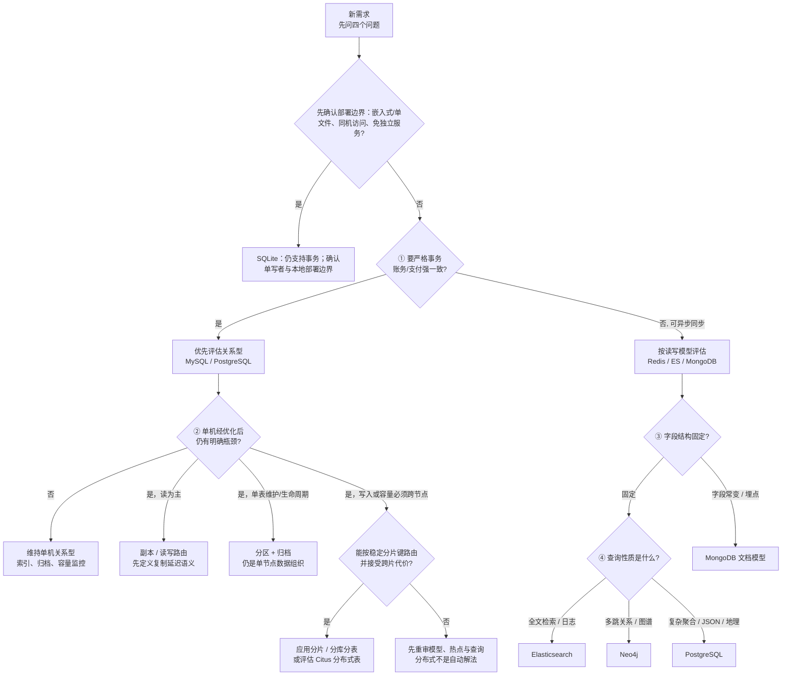

# 阶段八 · 数据库专家（7 种存储 + 选型 + 主从设计）

> 所属：阶段八 数据库专家（全新补充阶段）
> 定位：阶段三讲了 MySQL/Redis/ES 的「会用」，本阶段是「**把一个数据库吃透到能独立选型**」——覆盖 7 种常见数据存储，每种都是从基础到资深的完整进阶教程，并回答三类企业级核心问题：**什么时候用哪种数据库、为什么用、主从/副本怎么设计**。
>
> 前置：建议先完成阶段三（数据持久化与中间件）。本阶段是「横向扩面 + 纵向深挖」，可放在阶段三之后或与阶段四并行学习。

## 本阶段文件清单

| 编号 | 主题 | 定位 |
|-|-|-|
| 00 | 阶段总览与选型决策 | 什么时候用哪种数据库 + 一招看懂选型（本文件） |
| 01 | Redis | 缓存 / 计数 / 分布式锁 / 数据结构选型 |
| 02 | MySQL | 关系型 OLTP 的事实标准、内核与优化 |
| 03 | PostgreSQL | 功能最全的开源关系库（JSON/窗口/扩展） |
| 04 | Elasticsearch | 全文检索 / 日志 / 分析引擎 |
| 05 | MongoDB | 文档型 NoSQL（灵活 schema / 海量写入） |
| 06 | SQLite | 嵌入式轻量数据库（移动端/本地/单机） |
| 07 | Neo4j | 图数据库（关系/推荐/反欺诈） |
| 08 | 主从与副本设计 | 主从 / 读写分离 / 分片 / 多活的核心设计 |
| 09 | 树与图的算法基础 | 数据库背后的数据结构：树家族演进（BST→红黑树→B/B+ 树→跳表→LSM）+ 图遍历/拓扑排序 |

## 本阶段学习方法

- **每种数据库一个文件**：从「快速入门（能跑）」→「核心概念」→「进阶（索引/调优/一致性）」→「场景与红线（怎么做/不该怎么做）」。
- **选型优先**：遇到新需求先读「00-选型决策」，别上来就选一个数据库硬扛。
- **红线意识**：每个文件都标注「该怎么做 / 不该怎么做」——这是企业级的核心能力。

## 为什么要有这一阶段

阶段三你「会用」MySQL/Redis/ES，但面对一个「知识图谱查询」你未必想到 Neo4j、面对「字段频繁变化的埋点/事件数据」你未必想到 MongoDB、面对「本地 App 离线缓存」你未必想到 SQLite。**数据库选型的判断力，是把「会用」升级为「能设计」的分水岭**——这正是本阶段的价值。

## 一句话选型（速查）

| 需求特征 | 第一选择 | 原因 |
|-|-|-|
| 需要关系约束、事务和结构化查询的核心业务 | **MySQL 或 PostgreSQL** | 先按团队能力、查询模型和运维条件选择 |
| 需要 JSON/窗口函数/地理或扩展生态 | **PostgreSQL** | 评估其原生能力与扩展是否能减少额外存储 |
| 热点缓存、计数器、排行榜、分布式锁 | **Redis** | 内存级读写，数据结构丰富，原子操作 |
| 全文检索、日志分析、复杂聚合 | **Elasticsearch** | 倒排索引 + 分词 + 聚合，搜索专用 |
| 本地/移动 App/单机/免部署 | **SQLite** | 嵌入式、零配置、单文件、无需服务器 |
| 灵活 schema、海量写入、文档结构变化快 | **MongoDB** | 文档模型贴近 JSON，水平扩展容易 |
| 关系/推荐/路径/知识图谱 | **Neo4j** | 图模型，多跳关系查询高效 |

> 以上是「一句话速查」，详细的选型决策（4 个前置问题 + 7 库对照 + 场景正反例）在下方展开。

> **几个高频英文原词**（面试与文档通用）：主从复制（Master-Slave Replication）、读写分离（Read-Write Splitting）、分片（Sharding）、冷热分层（Hot-Warm-Cold）、多活（Multi-Active / Active-Active）。
>
> **为什么单主复制通常只解决「读扩展」**：在常见的单主拓扑中，写入集中到当前主库，副本可以分散读流量，所以「读多写少」收益最大。多主、分片或数据库原生的写扩展方案有不同的冲突处理与运维代价；不能把「主从」一概等同于所有复制拓扑。

---

## 详细选型决策：什么时候用哪种数据库

### 一、先问四个问题（选型前置）

在做数据库选型前，先问这 4 个问题，能筛掉一半错误选项：

```text
① 一致性/事务模型: 哪些写入必须原子提交、哪些读必须读到最新值？→ 先看 MySQL/PG；Redis/ES/MongoDB 也各有事务或一致性选项，需再核对其读写确认级别与部署拓扑
② 数据规模/扩展性: 当前瓶颈是单机 CPU/IO、读、单表维护，还是写入/容量？→ 先量化瓶颈，再选副本、分区、应用分片或分布式数据库
③ 查询模式: 结构固定? → 关系型；文档结构多变/字段常变 → MongoDB
④ 查询性质: 搜索/分析/关系/图? → 搜索→ES；关系/图谱→Neo4j；复杂分析→PG/ES
```

> 🧩 前置 30 秒：选型不靠背诵 `什么场景用什么库`，而是按 **四个问题** 一路筛——每个问题的答案都砍掉一批选项，最后剩下的自然落地到对应数据库。把这棵树记住，比背表格快得多：



> 提示：嵌入式/单文件是**部署与写入拓扑**判断，不是「没有严格事务」的同义词。SQLite 也提供 ACID 事务；它更适合本地、同机、单写者和免独立服务的边界，不适合多机共享或高并发写入竞争。[SQLite：事务保证](https://www.sqlite.org/transactional.html)
>
> ① 的「一致性模型」是选型的第一道分水岭——对账务、支付等场景，先明确原子提交、隔离级别、故障恢复与读己之写要求，再选择能满足这些约束的关系型方案；缓存、检索索引和部分埋点常可异步同步。MongoDB 也提供事务与读写关注级别（read/write concern，即客户端要求多少副本确认写入、读取允许看到什么范围的数据），Redis 的持久化和复制策略也会影响数据风险，所以不能简单按「关系型强一致、NoSQL 只能 BASE」分类；ES 仍不适合承担这类资金事实源。

> **关系型扩展决策链（必须分清）**：换成 PostgreSQL 可以因为 JSONB、窗口函数、扩展生态或团队能力而成立，但**普通单节点 PostgreSQL 不会因为换库自动获得水平写扩展**。先确认单机是否真的到瓶颈；读瓶颈优先考虑副本和读路由（同时定义可接受的复制延迟）；大表的维护、冷热和批量删除问题考虑分区/归档；只有容量或写入必须分散到多节点、并且能用稳定分片键路由时，才评估应用分片/分库分表或 Citus 等分布式 PostgreSQL。分区表把一个逻辑大表拆为同一实例中的多个物理分区，Citus 则以分布式表和 worker 节点实现跨节点分片，两者不是同一层级。[PostgreSQL：表分区](https://www.postgresql.org/docs/17/ddl-partitioning.html) / [Citus：分布式表概念](https://docs.citusdata.com/en/latest/get_started/concepts.html)
>
> 🏠 **生活版 → 换成数据库**：装修先问「户型多大 / 预算多少 / 常住几人」再定方案，而不是一上来挑最贵的水龙头；数据库选型同理——先问四个问题筛掉一半选项，再在剩下的候选里挑。**落地**：这把「先问需求再选工具」的习惯，就是本文件反复用的选型姿势。

### 二、七种数据库的「核心 —— 适用 —— 不适用」对照

| 数据库 | 核心数据结构 | 强烈适用 | 不该用它 |
|-|-|-|-|
| **MySQL** | 表（行 + 列，强类型 schema） | 订单、用户、支付等结构化核心业务 | 全文搜索（效率低）、海量日志、灵活 schema |
| **PostgreSQL** | 表 + JSONB + 扩展 | 需要用 JSON/窗口函数/地理/复杂查询的 MySQL 功能更全替代 | 极高频纯追加写日志/超海量写入（专用列存/时序库更省） |
| **Redis** | key-value（字符串/哈希/列表/集合/有序集合） | 缓存、计数器、排行榜、分布式锁、会话 | 当主数据库存核心业务数据（数据可能丢） |
| **Elasticsearch** | 倒排索引（词→文档） | 全文搜索、日志分析、聚合统计 | 当 OLTP 数据库（无事务、准实时） |
| **SQLite** | 单文件表 | 移动 App、本地工具、单机免运维、原型 | 高并发写入、多机共享、需要完整权限 |
| **MongoDB** | 文档（BSON，schema 灵活） | 灵活字段（埋点/事件/JSON 文档）、快速迭代 | 复杂跨文档关联或需要大量关系约束的事务主流程；多文档事务可用，但应评估其成本与查询模型 |
| **Neo4j** | 图（节点 + 边 + 属性） | 社交关系、推荐、反欺诈、知识图谱 | 简单一对多、纯聚合统计（用 PG 更合适） |

### 三、常见场景的「正确打开方式」（怎么做 vs 不该怎么做）

| 场景 | ✅ 该怎么做 | ❌ 不该怎么做 |
|-|-|-|
| 商品详情 + 搜索 | 关系型交易场景：MySQL/PG 存业务事实 + ES 做搜索；文档模型满足约束时也可由 MongoDB 存事实 | 把 ES 当主库，忽略事实源、同步与恢复链路 |
| 计数器 / 点赞数 | Redis `INCR` 原子累加 + 持久增量记录，再幂等异步/定时汇总到事实库并对账 | 只靠 Redis 内存计数或“定时落库”却没有持久增量、幂等与补偿 |
| 用户关系推荐 | Neo4j 存关系图做多跳查询 | 用 MySQL 自关联表 + 递归（查询慢且难写） |
| 埋点 / 事件 / JSON 文档 | MongoDB（schema 灵活，字段常变，结构与文档贴近） | 用强 schema 的 MySQL（每次改字段都要 ALTER，迭代慢） |
| 移动 App 离线缓存 | SQLite 本地存储 | 每次联网查（网络差体验差） |
| 日志检索 | ES 索引 + 冷热分层 | 把日志塞 MySQL（写入和查询都撑不住） |
| 复杂报表聚合 | PostgreSQL + 窗口函数（或 ES 聚合） | 拉全量数据到内存算 |

> **事实源不由产品名决定**：上表的 MySQL/PG 是“关系型交易”这个具体场景的选择，不是所有业务唯一答案。MongoDB 可以在文档模型、事务/读写关注级别、保留、备份和恢复目标都满足时承担自己的事实源；Redis 和 ES 通常是加速或派生索引。无论选谁，都要先写清不变量、留存、可重建性和故障恢复责任。

### 四、一个现实原则

> **「能单体的先单体、先选团队能稳定运维的关系型库」**——这不是保守，而是先控制复杂度。只有出现明确的搜索、缓存、灵活 schema、图关系、日志分析或写入扩展需求，并且现有方案经测量不能满足时，才引入对应存储。多一种数据库通常就多一份备份、监控、升级与数据同步成本。
>
> 🏠 **生活版 → 换成数据库**：家里多一台家电，就多一处要打扫、维修、占地方的地方——没真需求不会为了「显得齐全」去买；数据库同理，每多引入一类库就多一套备份/监控/升级/同步任务。**边界**：类比只说明运维成本，不代表必须从 MySQL 起步；已有 PostgreSQL 或其他受支持存储的团队，应从既有能力和需求约束出发。

### 五、主从/副本：各数据库自己管（不是统一话题）

> **关键认知：主从/副本/高可用是「每个数据库自己的事」**，不是一套通用方案。每种数据库的高可用设计不同，请到**对应数据库自己的文件**里读：
> - MySQL → `02-MySQL.md` 的「主从复制与读写分离」（GTID 主从）
> - PostgreSQL → `03-PostgreSQL.md` 的「流复制 / Patroni 主从」
> - Redis → `01-Redis.md` 的「主从 / 哨兵 / Cluster」
> - Elasticsearch → `04-Elasticsearch.md` 的「分片 / 副本 / ILM」
> - MongoDB → `05-MongoDB.md` 的「副本集 / 分片集群」
> - Neo4j → `07-Neo4j.md` 的「因果集群（core + read-replica）」
> - SQLite → `06-SQLite.md`（单机无主从，讲备份/迁移）

> 每种数据库的主从/副本/高可用设计**各不相同**，请到**对应数据库自己的文件**里读（见上文各文件指引）。各库的**横向对比如下**：跨库主从/故障转移/读扩展/水平扩展的「通用概念 ↔ 各库实现」对照表，见 `08-主从与副本设计.md`，那里有完整汇总——**本章不再重复，避免两处维护不一致**。

> 一个关键提醒（跨库通用，但实现不同）：
> - **水平扩展 ≠ 分区表**：PostgreSQL 的**分区表是「单机内的数据组织」**（大表按范围/哈希拆成小表），它**不跨节点、不提升写入吞吐上限**；PG 的真正的水平分片要靠 **Citus** 或分库中间件。
> - **自动故障转移**：MySQL 传统 **MHA 已停止维护**，现代用 **MGR / InnoDB Cluster / Orchestrator**。

> ⏸️ **短期可以不学**：Citus 水平分片、MGR / InnoDB Cluster / Orchestrator 的深度运维细节——它们只在「分片或自动故障转移真正落地」时才需要动手。**何时回来学**：做存储选型评审、或公司把某库推进到分片/自动故障转移落地时。**面试最低要求**：能说出「分区表是单机内的数据组织、水平分片要跨节点（Citus/分库中间件）」「MySQL 高可用已从 MHA 迁移到 MGR / InnoDB Cluster」这两句即可。

## 详细使用方式

1. 先读「00-选型决策」建立「什么时候用哪种」的全局判断。
2. 按需深入某一种数据库的文件（每种从快速入门 → 核心概念 → 进阶 → 场景与红线）。
3. 每种数据库的高可用/主从设计**都在该库自己的文件里**（见上方「五、主从/副本」指引），不用另外找。
4. 遇到实际需求时，回「00-选型决策」快速定位。

## 常见面试题

### Q1：面试官：你负责的新项目要做数据库选型，你的思路是什么？

**答**：**标准结论**：「先业务、后技术，先默认、后特殊」的四步选型流程——
- ① 锁一致性模型：账务、支付、订单这类强一致、强事务场景直接锁定 MySQL 或 PostgreSQL；只有能接受最终一致的缓存、检索、埋点才考虑 Redis/ES/MongoDB。
- ② 估数据规模与增长：会不会爆炸式增长、是否需要水平扩展。
- ③ 看查询模式：结构固定走关系型，字段常变走文档型，全文搜索走 ES，多跳关系走图库。
- ④ 按「能单体的先单体、能用 MySQL 的先用 MySQL」收敛——搜索、缓存、灵活 schema、图、海量日志、海量写入这 6 类信号没出现就不引入新库。

**底层原理**：选型底层逻辑是——**多一种数据库 = 多一份运维与一致性成本**，所以选型是控制复杂度而不是炫技；每多引入一类库，就多一套备份、监控、升级与跨库同步任务。

**工程实践**：输出「结论 + 风险 + 迁移路径」的评审文档；在数据同步与主从设计上留好兜底。

### Q2：MySQL 和 PostgreSQL 怎么选？

**答**：**标准结论**：绝大多数 OLTP 业务两者都行，关键看场景与团队——
- MySQL 强在**生态与运维成熟**：国内存量最大、DBA 经验最多、配套（ShardingSphere、Canal 等）齐全，是结构化核心业务的默认选择。
- PG 强在**功能天花板**：JSONB、窗口函数、PostGIS、pgvector、丰富扩展，常被当作「MySQL 的功能更全替代」。

**底层原理**：两者 MVCC 实现不同——InnoDB 把旧版本放 undo log，PG 把旧版本留在堆表靠 VACUUM 回收；JSON 上 PG 的 JSONB 是二进制存储、能整列建 GIN 索引，比 MySQL 的生成列兜底更省事。

**工程实践**：团队熟悉哪个用哪个——既想要 JSON/向量/地理等高级能力、又不想多维护一套库，选 PG；想要最稳的生态与招聘池，选 MySQL。**例外**：PG 不是严格超集——简单高频 OLTP 场景 MySQL 的成熟度仍是加分项。

### Q3：什么时候该上 Redis / ES / MongoDB？怎么避免过度设计？

**答**：**标准结论**：按场景引入——出现「热点缓存、计数器、排行榜、分布式锁」上 Redis；「全文检索、日志分析、复杂聚合」且数据量大上 ES；「schema 灵活、字段常变、海量写入」上 MongoDB。

**底层原理**：Redis 和 ES 通常分别承担内存加速与检索索引，不宜作为需要复杂事务与关系约束的唯一事实源；MongoDB 可承担文档主存储并支持多文档事务，但要按读写模型、事务范围和 `read/write concern` 评估。常见组合是「关系型事实源 + Redis/ES 加速层 + 异步同步」，不是唯一架构。

**工程实践**：避免过度设计的关键是反向提问——数据量、延迟目标和增长率是多少？没有分词/聚合需求时，前缀匹配或业务索引是否已经满足？先压测现有单体，再用监控数据决定是否拆分；表容量没有通用阈值，取决于行宽、索引、硬件、查询与写入模式。

### Q4：主从、读写分离、分库分表、多活分别解决什么问题？演进顺序是什么？

**答**：**标准结论**：四者解决不同层级的问题——
- 单主复制：读扩展与高可用（写集中到当前主库）；
- 读写分离：把读流量路由到从库；
- 分库分表：解决单库容量与写扩展瓶颈；
- 多活：解决跨机房容灾。

**底层原理**：单主复制把写入集中到当前主库、读可分散到副本，所以主要改善读扩展；分片按分片键分散数据与写入，但跨分片查询、事务和全局唯一标识都要重新设计。多主或多活还要处理冲突、路由与一致性，不能视为单主复制的自然升级。

**工程实践**：索引、归档、读写分离、分片和检索是可选工具，不构成固定演进顺序；以瓶颈数据和恢复目标决定。真要分片，按主要路由与查询维度选键，同时验证热点、扩容和跨片需求；分片数、容灾形态也要由容量模型、RPO/RTO 与演练结果确定。

## 选型自检

- [ ] 面对「订单必须写后立刻可见，同时商品搜索允许数秒延迟」的需求，能分别列出订单事实源与搜索索引的候选，并说明读路由和失败补偿。
- [ ] 面对「事件字段常变、但运营要按用户聚合」的需求，能比较 MongoDB、PostgreSQL JSONB 与关系表，并写出还需要确认的事务、索引、增长和运维问题。

> **核对要点**：不要用数据库名称直接替代一致性结论。先写出数据事实源、允许的读延迟、原子边界、恢复目标和团队运维条件；再给出候选与拒绝理由。
