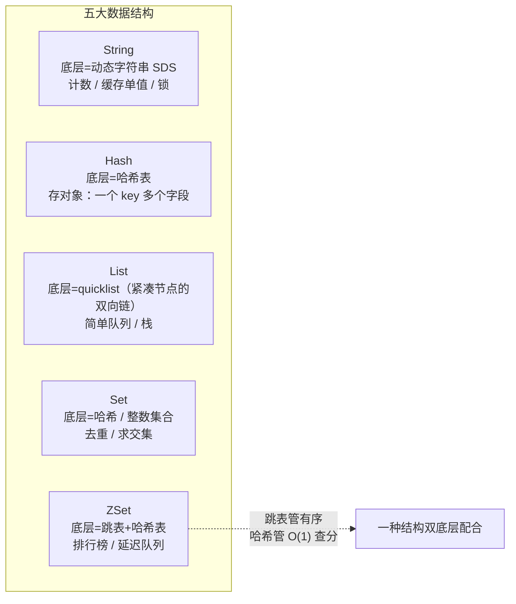
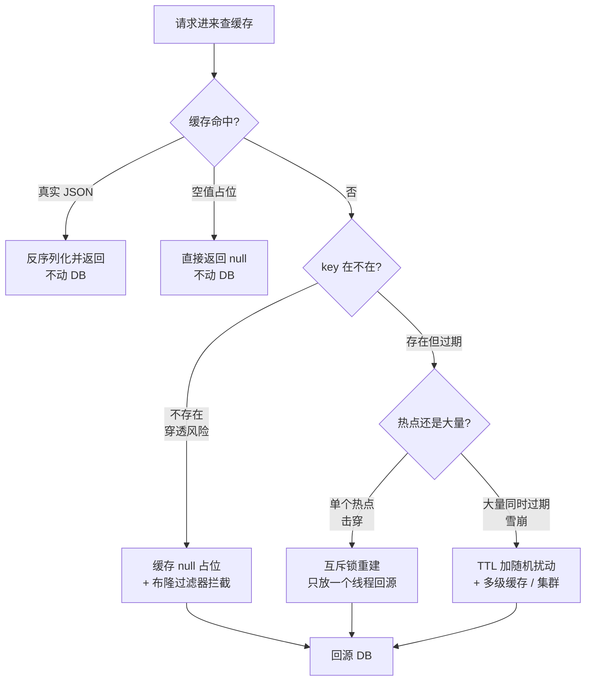
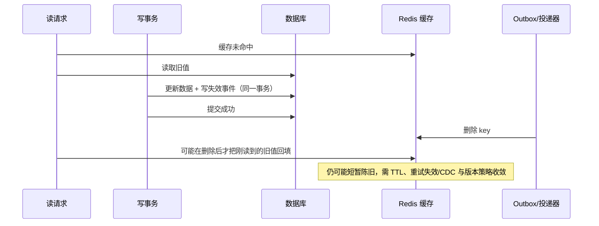
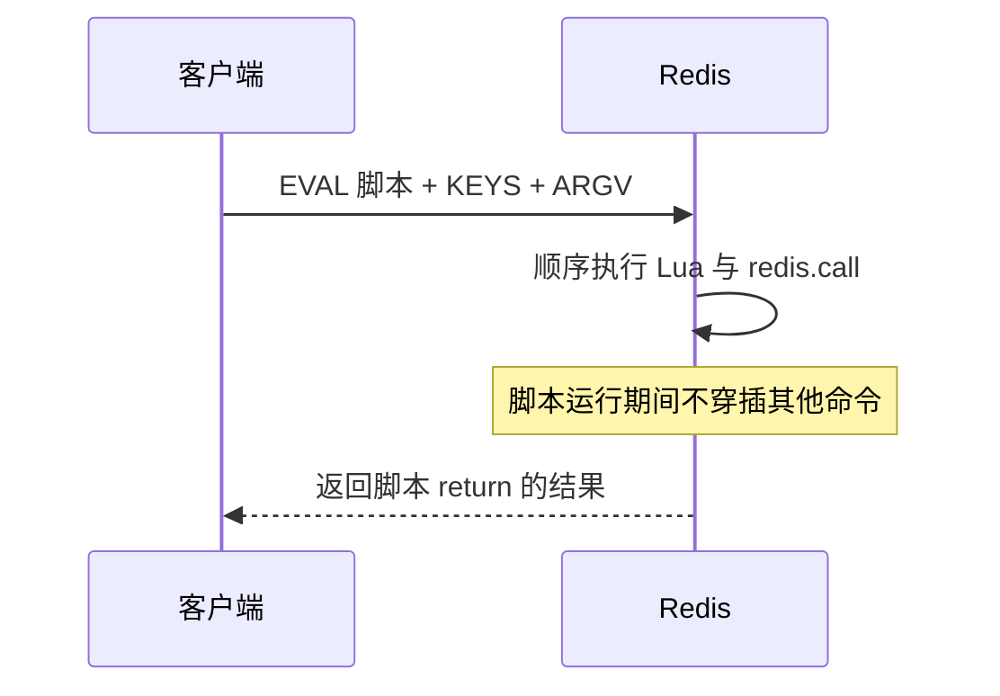
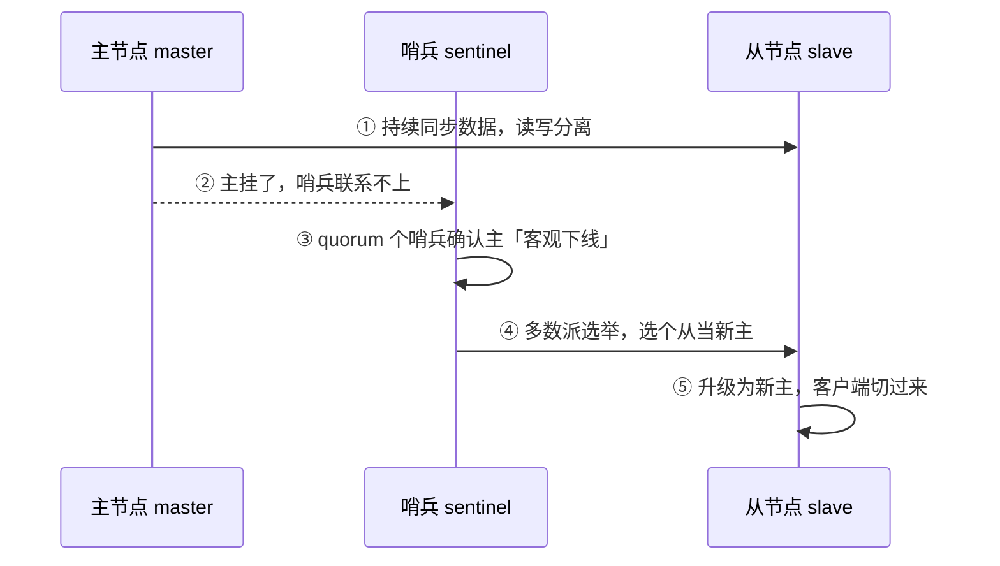
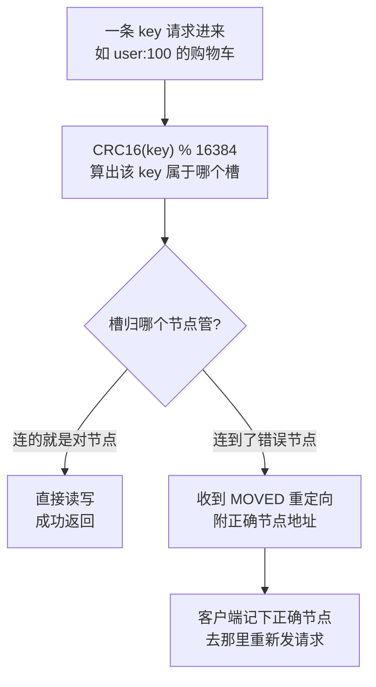

# Redis：从基础到资深进阶

> 所属：阶段八 数据库专家
> 定位：Redis 是「内存级读写 + 丰富数据结构 + 原子操作」的缓存/存储引擎。本教程从「能 set/get」到「数据结构选型、缓存一致性、分布式锁、持久化」，再到「Lua 脚本/管道/事务」等**企业级惯用法**，最后到「主从 + 哨兵 / Cluster」的**高可用与扩展**。**记住一条红线：Redis 是缓存/加速器，不是核心业务数据的唯一事实源。**

## 快速入门（能跑）

### 本讲关键词与概念速查
| 关键词 | 一句话大白话 | 例子 |
|-|-|-|
| key-value | 键值对存储 | `SET user:1 "张三"` |
| 过期时间（TTL） | 数据到时自动消失 | `SET k v EX 60` |
| String（字符串） | 最基础：计数/缓存单值 | `INCR page_view` |
| Hash（哈希） | 存对象（字段:值） | `HSET user:1 name 张三` |
| List（列表） | 有序可重复 | `LPUSH queue msg` |
| Set（集合） | 不重复 | `SADD follow:1 2` |
| ZSet（有序集合） | 带分数的排序集合 | `ZADD rank 100 a` |
| 持久化 | 数据落盘防丢 | RDB / AOF |

### 最简可运行示例
```java
// 用 Spring Data Redis 读写(带详细注释)
import org.springframework.data.redis.core.StringRedisTemplate;
import org.springframework.stereotype.Service;
import java.time.Duration;

@Service
public class CacheService {
    private final StringRedisTemplate redis;   // Redis 操作模板(已自动配置)

    public CacheService(StringRedisTemplate redis) { this.redis = redis; }

    // 写一个值, 60 秒过期
    public void set(String key, String val) {
        redis.opsForValue().set(key, val, Duration.ofSeconds(60));  // set + TTL
    }
    // 读一个值(不存在返回 null)
    public String get(String key) {
        return redis.opsForValue().get(key);   // 读不到返回 null, 不是抛异常
    }
}
```

> **代码备注（逐行解释）**：
> - `StringRedisTemplate`：Spring 提供的 Redis 模板，`key`/`value` 都是 String（最常用），已由 Boot 自动装配。
> - `opsForValue()`：操作 String 结构；相应地有 `opsForHash()`/`opsForList()`/`opsForZSet()` 等。
> - `set(key, val, Duration.ofSeconds(60))`：写入并设置 60 秒 TTL。缓存通常要设置 TTL 或明确的失效机制，避免数据无限滞留；配置、永久会话等少数 key 需按业务定义生命周期。
> - `get(key)`：读不到返回 `null`（不是抛异常），调用方要判空。所以缓存读要配合「空值处理」。
> - **运行前提**：这是完整的 Spring Bean 片段，需引入 `spring-boot-starter-data-redis`、配置 `spring.data.redis.*` 并连接可用 Redis；它只演示字符串缓存，不包含序列化、异常降级或缓存一致性策略。

## 核心概念

### 1. 数据结构与典型场景
| 结构 | 底层 | 典型场景 | 该怎么做 |
|-|-|-|-|
| String | 简单动态字符串 | 计数器、缓存单值、分布式锁 | 计数用 `INCR`（原子） |
| Hash | 哈希表 | 存对象（购物车 `{skuId:cnt}`） | 一个 key 多个字段 |
| List | quicklist（由紧凑 listpack 节点组成的双向链） | 简单队列/栈、消息 | 左右两端 `LPUSH/RPOP` |
| Set | 哈希/整数集合 | 去重、共同关注（交集） | `SINTER` 求交集 |
| ZSet | 跳表+哈希 | 排行榜、延迟队列 | score 决定排序 |


> 把「结构 → 底层 → 典型场景」放到一张图里扫读——左侧 5 种结构，右侧 ZSet 用「跳表+哈希」双结构配合的例子（跳表管排序、哈希表管快速查分）。

> **底层与「为什么」（更通透）**：
> - **String 底层是 SDS（Simple Dynamic String，简单动态字符串）**：比 C 字符串多了长度字段，取长度 O(1)、二进制安全、预分配空间防频繁扩容。
> - **一种结构、多个编码（encoding）**：数据少时可用紧凑编码省内存（Hash/List/ZSet 常见 listpack、Set 可用 intset、String 有 int/embstr 等编码），达到阈值后会切换为更适合操作的数据结构。具体阈值与版本、配置和数据形态有关；仍要用内存监控和大 key 治理评估容量。
> - **ZSet = 跳表（Skip List）+ 哈希表**：跳表管有序与范围查询（O(logN)），哈希表管 O(1) 查分，两者配合。
> - **单线程模型的准确说法**：Redis 的**命令执行是单线程**，但 **6.0+ 引入了 IO 多线程（io-threads）只做网络读写（socket 收发）**，命令解析与执行仍在主线程。
>   - **为什么单线程（生活版类比）**：就像单人柜台：一个人干活不用等别人、不用协调，比多人柜台（多线程）容易把活干完——缺点是一条长业务（大 key / `KEYS`）会把柜台堵死。
>   - **为什么单线程（技术结论）**：省掉锁竞争与上下文切换，纯内存命令本身极快，瓶颈常在网络 IO——所以用 IO 线程把网卡吞吐摊开，命令执行保持单线程的简单与有序。

> **List 不要简化成“纯双向链表”**：当前 Redis 的 List 编码是 quicklist；它把多个紧凑节点串起来，节点内容使用 listpack。旧版本资料会看到 quicklist 中的 ziplist，故排查内存时先确认 Redis 版本和 `OBJECT ENCODING key` 的实际输出。[Redis：OBJECT ENCODING](https://redis.io/docs/latest/commands/object-encoding/)
>
> ⏸️ **短期可以不学**：各编码的「触发切换阈值」与源码级实现（listpack/ziplist/intset 何时升级、阈值多少）。**何时回来学**：做 Redis 内存/大 key 优化评审、或开始读 Redis 源码时。**面试最低要求**：说出「List 用 quicklist 兼顾两端操作与紧凑存储，ZSet 底层是跳表+哈希表」即可。

### 2. 过期与淘汰策略
```java
// 给 key 设置过期(读的时候同步刷新, 顺带延长)
import java.util.concurrent.ThreadLocalRandom;
redis.opsForValue().set(key, val,
        Duration.ofMinutes(30).plusSeconds(ThreadLocalRandom.current().nextInt(60)));  // 随机 +0~59s 防雪崩
```
> **该怎么做**：大多数缓存设置 TTL，并在同批写入、同一热点集中到期时加入随机扰动（`ThreadLocalRandom`）；永久 key 则要定义显式失效和容量上限。
> **不该怎么做**：无生命周期地长期保留会变化的缓存。`maxmemory-policy` 应按可丢弃性选择：默认 `noeviction` 在内存满时拒绝会增加内存的写入，`allkeys-lru` 适合允许淘汰任意缓存的场景。

> **TTL 过期 ≠ 内存淘汰**：带 TTL 的 key 到期后，Redis 会在访问该 key 时被动删除，并周期性主动抽样删除；这是 key 的生命周期，不依赖内存是否已满。淘汰（eviction）只在达到 `maxmemory` 后按策略选择可删 key，是内存压力保护，不能替代业务过期规则。前端类比：浏览器缓存的 `max-age` 像 TTL；设备存储满后清理像 eviction。重要缓存仍应显式设置 TTL，且不能把“到期瞬间一定物理删除”当作语义。[Redis：EXPIRE](https://redis.io/docs/latest/commands/expire/) / [Redis：内存淘汰](https://redis.io/docs/latest/develop/reference/eviction/)

## 进阶：企业级惯用法与专业实践

### 1. 缓存三大经典问题（穿透 / 击穿 / 雪崩）

```java
// 防穿透: 查询不存在的 key, 缓存空值占位(短 TTL), 避免每次都打 DB。
// 注意: StringRedisTemplate 的 value 是 String；NULL_PLACEHOLDER 是保留标记，不能当作 User JSON 反序列化。
private static final String NULL_PLACEHOLDER = "__cache_null__";

public User getUser(Long id) {
    String key = "user:" + id;
    String json = redis.opsForValue().get(key);
    if (NULL_PLACEHOLDER.equals(json)) return null;                      // 命中空值：直接返回，不访问 DB
    if (json != null) return JsonUtil.fromJson(json, User.class);        // 命中真实 JSON：才反序列化

    User u = userRepo.findById(id);
    if (u == null) {
        redis.opsForValue().set(key, NULL_PLACEHOLDER, Duration.ofSeconds(60)); // 查不到才写短 TTL 空标记
    } else {
        redis.opsForValue().set(key, JsonUtil.toJson(u), Duration.ofSeconds(60));
    }
    return u;
}
```

| 问题 | 现象 | 该怎么做 |
|-|-|-|
| 穿透 | 查不存在的 key 一直打 DB | 缓存 null 值 / 布隆过滤器 |
| 击穿 | 某热点 key 过期瞬间大量请求打 DB | 互斥锁重建 / 逻辑过期 |
| 雪崩 | 大量 key 同时过期 | 随机 TTL / 集群多级缓存 |


> 三种问题本质都是「缓存没命中时 DB 被放大」，区别只在**触发面**：穿透是 key 永不存在、击穿是单热点过期、雪崩是大规模过期——对照上图顺着「命中 → 不存在 → 过期」三分支各自看解法。

> **不该怎么做**：缓存穿透用「查询前不加任何判断」——恶意请求会打垮 DB。

### 2. 缓存一致性（数据库提交成功后删缓存）
```java
// 生产骨架：业务数据与失效事件同一 DB 事务提交；提交后由可靠投递器删缓存。
// 省略：Outbox 表结构、分布式抢占/重试退避、监控告警与 dead-letter 处理。
@Transactional
public void update(User u) {
    userRepo.update(u);                                        // ① 更新事实源
    outboxRepo.save(CacheInvalidation.pending("user:" + u.getId())); // ② 同事务写失效事件
} // ③ 此处事务成功提交后，数据与事件才同时可见

@Scheduled(fixedDelayString = "${cache.invalidation.poll-delay-ms:1000}")
public void dispatchInvalidations() {
    for (CacheInvalidation event : outboxRepo.claimPendingBatch(100)) {
        try {
            redis.delete(event.cacheKey());                     // ④ 提交后才删缓存；重复删是幂等的
            outboxRepo.markDelivered(event.id());               // ⑤ 成功后记账；崩溃在两步之间会重试删除
        } catch (RedisConnectionFailureException ex) {
            outboxRepo.scheduleRetry(event.id(), ex.getMessage()); // 留待重试，不能吞掉
        }
    }
}
```
> **顺序为什么必须这样**：如果在事务尚未提交时删缓存，另一个请求可能回源读到旧提交版本，再把旧值写回缓存；事务随后提交，新值反而被旧缓存遮住。上例让“事实源更新”和“待失效事件”同事务提交，投递器只能在提交后删除缓存；投递器崩溃或 Redis 不可用时，未完成事件保留并重试。Redis 的 Cache-Aside 示例也采用写入主库后删除缓存，而不是试图让缓存与主库双写保持同步。[Redis：Java Cache-Aside](https://redis.io/docs/latest/develop/use-cases/cache-aside/java-jedis/)

> **`after-commit` 不是可靠投递的同义词**：单体、低风险场景可在服务内发布事件，再用 `@TransactionalEventListener(phase = AFTER_COMMIT)` 调用 `redis.delete`；Spring 保证监听器在成功提交后才处理。若删除失败、进程在提交后崩溃，单靠监听器仍可能遗漏，需叠加重试记录。跨服务或要求可追溯时，使用上面的 Outbox + 消息投递；也可用数据库 CDC（从已提交的变更日志产生失效事件）做补偿或主链路。Spring 的事务绑定事件阶段见[官方文档](https://docs.spring.io/spring-framework/reference/data-access/transaction/event.html)。



> **并发回填窗口仍存在**：提交后删缓存解决了“先删后写”的典型竞态，却不能保证线性一致。读请求若在写入提交前读到旧值、又在删除后回填旧值，就会留下一个短暂旧缓存。对允许短暂陈旧的详情页，用 TTL + Outbox 重试/CDC 补偿收敛；对热点 key 可评估互斥重建、逻辑过期或版本号校验；对库存、余额等必须读到最新的事实，读写应直接走具备事务语义的事实源，不能靠缓存失效协议兜底。
> **不该怎么做**：先删缓存再更新数据库；也不要把“提交后删缓存”误解成“所有读取立即最新”，更不能在 Redis 删除失败后仅记录日志就丢弃任务。

### 3. Redis 事务 / Lua 脚本（原子性）

> 🧩 前置 30 秒：**Lua 脚本**是一小段用 Lua 语言写的程序文本。客户端把它连同参数发给 **Redis 服务端**，Redis 在自己的命令执行线程里运行脚本；脚本内部再通过 `redis.call(...)` 调用 `GET`、`DECRBY` 等 Redis 命令。它不是把几条命令在 Java 里按顺序发送，也不是把业务逻辑永久存进 Redis——更像把「领库存、核对数量、扣减库存」这一张小工单交给同一个柜台一次办完。



> **技术结论**：Redis 将一整段 Lua 脚本作为一个原子单元执行，其他客户端命令只能在脚本结束后执行。因此「先读库存、判断、再扣减」不会被另一条扣减命令插进中间。原子性只覆盖 **Redis 内部这次脚本执行**，不覆盖 MySQL、HTTP 调用或消息队列；跨系统一致性仍需要事务、消息或补偿方案。

> **参数怎么传**：脚本中只用 `KEYS[1]`、`KEYS[2]` 接收 Redis key，用 `ARGV[1]`、`ARGV[2]` 接收普通参数（如扣减数量）。不要把 key 和参数直接字符串拼进脚本文本：一来容易产生注入和转义错误，二来 Redis Cluster 需要客户端明确知道脚本访问哪些 key，相关 key 还必须落在同一个 slot（可用 Hash Tag）。生产中通常先 `SCRIPT LOAD` 得到脚本 SHA-1，再用 `EVALSHA` 执行以减少反复传输；脚本缓存会在 Redis 重启、切主或被清理后丢失，客户端需要能自动重新加载或回退执行。

> **边界与红线**：Lua 不是数据库事务，没有回滚；脚本执行到一半报错时，前面已成功写入的 Redis 命令不会自动撤销。脚本也不能做慢循环、网络请求或阻塞式工作，因为 Redis 命令执行线程会被整段脚本占住，其他请求都在排队。把脚本控制为短小、确定、只做必要的读写与判断。

```java
// Lua 脚本: 把多个命令做成一个原子操作(如扣库存: 判断+扣减)
String lua = "local c = redis.call('get', KEYS[1]) "
           + "if c and tonumber(c) >= tonumber(ARGV[1]) then "
           + "  redis.call('decrby', KEYS[1], ARGV[1]) return 1 "
           + "else return 0 end";
// 注意: 返回类型要与脚本 RETURN 一致; 用 RedisTemplate<String,Object> 或配好序列化器,
//       否则 StringRedisTemplate 的字符串序列化器对 Long 结果反序列化会出问题
Long r = redis.execute(new DefaultRedisScript<>(lua, Long.class),
        List.of("stock:" + skuId), String.valueOf(count));   // 原子: 判断+扣减一个脚本完成
```
> **该怎么做**：需要「判断 + 操作」的原子性（扣库存、限流）用 **Lua**——Redis 原子执行整个脚本，无需担心并发。
> **不该怎么做**：`GET` → 判断 → `DECR` 三步——并发下会超卖。Redis 事务（MULTI/EXEC）只是「批量执行不被打断」，不支持回滚，慎用。
> **为什么 Redis 事务不支持回滚**：设计者认为命令错误属于「编程错误」，不该在运行时回滚；且回滚需要额外状态与日志，违背 Redis「简单 + 快」的定位——需要「判断 + 操作」的原子性，请用 Lua 一个脚本完成。

### 4. 管道（Pipeline）批量操作
```java
// 管道: 一次网络往返批量执行多条命令(省网络开销)
import java.nio.charset.StandardCharsets;
byte[] valueBytes = val.getBytes(StandardCharsets.UTF_8);   // String 要转成 byte[] 才能传
redis.executePipelined((RedisCallback<Object>) conn -> {
    for (Long id : ids) {
        conn.stringCommands().set(("user:" + id).getBytes(StandardCharsets.UTF_8), valueBytes);
    }
    return null;
});
```
> **该怎么做**：批量 set/get 用管道——把多个命令合并成一次网络往返，吞吐大幅提升（异步批量落库、批量预热缓存）。

### 5. 分布式锁（Redisson）
```java
import org.redisson.api.RLock;
import org.redisson.api.RedissonClient;

public void deductStock(Long skuId) throws InterruptedException {
    RLock lock = redisson.getLock("stock:lock:" + skuId);   // 加锁的 key
    boolean locked = false;
    try {
        // tryLock(waitTime, unit): 不显式传 leaseTime —— 看门狗才会启动自动续期(默认30s)
        // (显式传 leaseTime=10 时看门狗不启动, 锁 10s 后硬性释放, 业务长于10s会锁失效)
        locked = lock.tryLock(3, TimeUnit.SECONDS);          // 等待3s 拿锁, 拿不到返回 false
        if (locked) {
            Stock s = stockRepo.find(skuId);
            if (s.count < 1) throw new BizException("库存不足");
            stockRepo.deduct(skuId);                          // 临界区: 扣库存
        }
    } finally {
        // 必须 finally 释放, 且只释放"当前线程确实持有"的锁
        if (locked && lock.isHeldByCurrentThread()) lock.unlock();
    }
}
```
> **该怎么做**：用 Redisson，**不显式传 leaseTime 才会自动续期（看门狗）**；`finally` 里**先判 `isHeldByCurrentThread()` 再 unlock**（避免 `tryLock` 失败时对未持有锁调用 unlock 抛异常）。
> **不该怎么做**：`setnx+expire` 拆步；显式传 `leaseTime` 却以为会续期；不判持锁直接 unlock。

> ⏸️ **短期可以不学**：Redlock（红锁）与「分布式锁是否该跨多节点加锁」的争议——单机房生产场景 Redisson 基于单 Redis 的锁通常够用。**何时回来学**：公司要跨机房/多副本场景加锁、或面试被追问锁的安全性时。**面试最低要求**：知道「普通 Redisson 锁基于单 Redis、Redlock 是多节点加锁防单点故障、但业界有争议」即可。

## 主从 / 哨兵 / Cluster（Redis 的高可用）

### 1. 主从复制 + 哨兵（自动故障转移）

> 🧩 前置 30 秒：**哨兵（sentinel）**= 专门「放哨盯主从」的独立进程，主挂了它负责发起换届；**quorum**（判定法定人数）= 几个哨兵确认「主真的挂了」才算数——就像集体表决，一半以上举手才算通过。细节在下面两条 Mermaid 里展开。

```yaml
# 哨兵: 自动故障转移(主挂了从顶上) —— 生产标配
sentinel monitor mymaster 10.0.0.11 6379 2   # quorum=2: 2个哨兵确认才判主"客观下线"
# 作用: ① 主从读写分离(分担读) ② 主故障自动选新主(高可用)
# 注意: quorum 只是"下线门槛", 真正完成 failover 还需哨兵之间的多数派(majority)选举新主
```
```bash
# 查看复制状态
redis-cli -h slave -p 6379 info replication   # role:slave, 看 master_link_status 是否 up
```

> 「主挂 → 哨兵确认 → 从变主」三步：quorum 只是**下线门槛**，真正换主还要哨兵**多数派**投票（防一个哨兵误判就乱换主）。

> **该怎么做**：生产用**主从 + 哨兵**（自动切换）；读多写少做主从分摊读压力。
> **不该怎么做**：单机 Redis 裸奔当核心存储——宕机即丢数据（未落盘部分）。

### 2. Cluster（分片，单机内存不够时）
```bash
# 集群: 数据散到多个节点(16384 槽), 客户端连错节点收 MOVED 重定向
# 注意: --cluster-replicas 1 需要"master数×(1+replica数)"个节点, 3主3从用6个节点
redis-cli --cluster create \
 10.0.0.11:6379 10.0.0.12:6379 10.0.0.13:6379 \
 10.0.0.14:6379 10.0.0.15:6379 10.0.0.16:6379 --cluster-replicas 1
```

> 这正是 Cluster 的「路由三步曲」：**算槽 → 查归属 → 不对就 MOVED 重定向**。想让相关 key 进同一槽，用 `Hash Tag`（见下）。

> **该怎么做**：单机内存不够 / 需要横向扩展时用 Cluster（含副本，高可用）。
> **一致性**：多用 `Hash Tag` 把相关 key（如 `{user:1}:cart`）放同一 slot——**槽（slot）**就是把 key 空间均分成 16384 个编号格子的划分，同一用户的 key 放进同一格，才能同 slot 做事务 / 范围操作。
> **注意**：`--cluster-replicas 1` 需要**节点数为 master×2**（本例 3 主 3 从 = 6 节点）；`Hash Tag` 惯用写法是把整个 tag 放 `{}`（如 `{user:1}`，而不是只有 `{1}`），让同一用户的多个 key 落在同一 slot。

### 3. 主从 vs 哨兵 vs Cluster 怎么选
| 方案 | 解决什么 | 适用 |
|-|-|-|
| 主从复制 | 读扩展 | 读多写少 |
| 主从 + 哨兵 | 读写扩展 + 自动切换 | 大多数业务 |
| Cluster | 容量扩展 + 分片 | 单机内存不够 |

## 持久化选型（数据安全）
| 方案 | 机制 | 数据安全 | 该用哪 |
|-|-|-|-|
| RDB | 快照落盘 | 两次快照间的写入可能丢失 | 可容忍按快照策略确定的恢复点 |
| AOF | 追加日志 | 取决于 `appendfsync` 策略 | 需要较小恢复点窗口时评估 |
> **该怎么做**：根据 **RPO（Recovery Point Objective，故障时最多可接受丢失的数据时长）**、恢复时间、磁盘与写入负载选择 RDB、AOF 或混合持久化；`everysec` 通常把窗口控制在约一个刷盘周期，但故障类型和操作系统缓存仍要纳入演练。
> **不该怎么做**：只开 RDB 且不设快照频率——宕机可能丢大量数据。
> **为什么是 RDB / AOF 两种（生活版类比）**：RDB 像「定期整本拍照」——每次拍一张全页快照，恢复快、文件小，但拍照之间新抄的字可能丢；AOF 像「每次动笔都记账的流水账」——一条条补记，丢得少，但日志会越写越长。
> **为什么是 RDB / AOF 两种（技术结论）**：RDB 是全量快照（fork 子进程写临时文件，恢复快、文件小，但两次快照之间的数据可能丢）；AOF（Append-Only File，追加式日志）记录每次写命令，按 `appendfsync` 策略控制刷盘。`everysec` 通常每秒请求一次 fsync，实际恢复窗口仍取决于故障类型、操作系统和持久化状态。
> - **简单取舍**：要「恢复块 + 文件小」选 RDB；要「丢得少」选 AOF；**生产推荐混合持久化**（Redis 4.0+，`aof-use-rdb-preamble`）：AOF 文件头部放一段 RDB 快照做基底 + 尾部追加增量命令——重启加载快、又不会丢太多增量，两全其美。

## 场景与红线（怎么做 / 不该怎么做）

| 场景 | ✅ 该怎么做 | ❌ 不该怎么做 |
|-|-|-|
| 缓存热点数据 | Redis + TTL + 随机扰动 | 缓存当唯一数据源 |
| 计数器/点赞 | `INCR` 原子自增 + 定时落库 | 每次写 MySQL |
| 排行榜 | ZSet（score 排序） | List 手动排序 |
| 分布式锁 | Redisson + finally unlock | `setnx` 拆步 |
| 会话存储 | Redis TTL | 存本地内存（多实例不同步） |
| 扣库存原子性 | Lua 脚本 | `GET`→`DECR` 三步 |
| 大 key | 拆分/分段 | 单 key 巨大（阻塞/内存） |
| 缓存一致性 | DB 提交成功后删缓存 + 可靠重试/补偿 | 先删缓存再更 DB，或删失败只记日志 |

## 红线小结（必背）

1. **Redis 的数据角色要先定义**：缓存通常不作为核心事实源；若承担持久数据，必须按持久化、复制、备份和恢复演练证明可接受风险。
2. **缓存定义 TTL 或失效机制**：同批到期时加随机扰动；配合 `maxmemory-policy`。
3. **原子操作用 Lua**：判断+扣减等一个脚本完成，别 `GET`→`DECR` 三步。
4. **批量用管道**：省网络往返，吞吐大幅提升。
5. **分布式锁要定义失效和释放语义**：Redisson 是常用实现，持锁校验和 `finally` 释放不可省略；还要评估业务幂等与主从切换风险。
6. **高可用按可用性目标设计**：单机、主从加哨兵或 Cluster 的选择取决于容量、故障域和恢复目标。
7. **持久化按 RPO/RTO 选型并演练**：不要只依据「RDB 快、AOF 安全」的口号配置。

## 进阶自测

- [ ] 能说出 String/Hash/List/Set/ZSet 各自最典型的场景与底层结构
- [ ] 能复现并解决缓存穿透 / 击穿 / 雪崩
- [ ] 能写出 Cache-Aside 的正确更新顺序：DB 事务提交成功后删缓存，并说明 Outbox/事务事件、重试或 CDC 各解决什么问题
- [ ] 能用 Lua 脚本实现「判断+扣减」的原子操作
- [ ] 能用管道做批量操作，说明省了什么
- [ ] 能用 Redisson 实现带看门狗 + finally 释放的分布式锁
- [ ] 能说清主从 / 哨兵 / Cluster 的差异，以及 RDB / AOF 的取舍
- [ ] 场景：商品详情缓存允许 5 分钟陈旧，但下单扣库存必须可靠。能说明哪些数据放 Redis、哪些保留为事实源，以及缓存删除失败时的补偿方式。

> **核对要点**：商品详情可用 Cache-Aside 加 TTL、提交后失效和删除重试；库存事实与扣减结果应在可恢复的事务性数据源中确认。读回填可与失效并发，TTL、事件重试/CDC 和必要时的版本策略用于收敛；Lua 只能保证 Redis 内一次脚本原子，不能替代跨系统一致性。

## 常见面试题

### Q1：Redis 为什么快？「单线程」怎么理解？

**答**：

**标准结论**：内存访问极快（微秒级）、单线程省去锁竞争与上下文切换、数据结构为场景定制。但「单线程」要说得准确：Redis 的**命令执行是单线程**，6.0+ 的**网络 IO 是多线程**（io-threads 只做 socket 读写），命令解析与执行仍在主线程。

**原理层**：
- 内存随机读约 100ns 量级，比磁盘快几个数量级。
- 单线程意味着没有锁竞争、没有线程切换开销。
- 配合 IO 多路复用（如 epoll），Redis 可在合适的命令复杂度、网络、CPU 和数据大小下获得很高吞吐；具体 QPS 必须压测，不能由单线程模型直接推出。
- IO 多线程解决的是高吞吐下网卡收发占用的 CPU 时间。

**工程层**：Redis 快的前提是命令本身 O(1)/O(logN)——一个 O(N) 的 `KEYS` 或大 key 操作照样把单线程卡死，所以生产要禁 `KEYS`、监控慢查询与大 key，这是「单线程快」的代价与使用纪律。

### Q2：ZSet 为什么用跳表而不是 B+ 树（或红黑树）？

**答**：

**标准结论**：跳表实现简单、范围查询方便、插入删除与 B+ 树同为 O(logN)，还天然支持按 score 区间遍历。

**原理层**：
- 跳表是多层有序链表，概率性建索引层，实现远比红黑树/平衡树简单、不易出 bug。
- 对比 B+ 树：B+ 树是为磁盘设计（页、扇出高、矮胖），而 Redis 数据全在内存，磁盘扇出不是约束——跳表的链表结构在内存里遍历更直接，还天然支持范围查询与 score 区间删除。
- ZSet 再配一张哈希表，O(1) 查分。

**工程层**：面试高频追问「为什么不用红黑树」——红黑树范围遍历要中序遍历、实现复杂；「为什么不用数组」——插入 O(N) 移动。记住一句话：跳表是「内存场景下简单够用」的务实选择。

### Q3：缓存穿透、击穿、雪崩是什么？怎么解决？

**答**：

**标准结论**：
- 穿透：查不存在的 key 一直打 DB——缓存 null 占位 + 布隆过滤器（Bloom Filter）拦截。
- 击穿：热点 key 过期瞬间并发打 DB——互斥锁重建或逻辑过期。
- 雪崩：大量 key 同时过期或 Redis 宕机——TTL 加随机扰动、多级缓存、集群高可用。

**原理层**：三者本质都是「缓存未命中时 DB 压力被瞬间放大」，区别在触发面——穿透是单 key 永远查不到，击穿是单个热点 key 的过期窗口，雪崩是大规模过期或整体不可用。

**工程层**：
- 穿透：优先用布隆过滤器（存在性判断，误判率可配）。
- 击穿：互斥锁只让一个线程回源、其余等待。
- 雪崩：随机 TTL（已在示例代码里）。
- 兜底：再配合缓存预热与熔断降级，别让 DB 成为第二波压力。

### Q4：RDB 和 AOF 怎么选？会丢数据吗？

**答**：

**标准结论**：RDB 是全量快照，恢复快、文件小，但两次快照之间可能丢数据；AOF（Append-Only File）记录每次写命令，按 `appendfsync` 策略（always/everysec/no）控制刷盘；`everysec` 通常把恢复点窗口控制在约一个刷盘周期，仍要把故障类型与操作系统缓存纳入演练。

**原理层**：
- AOF 本质是 WAL（Write-Ahead Log）思想——先记日志再落数据，`everysec` 由后台线程每秒 fsync，兼顾性能与安全。
- RDB 快照靠 fork 子进程 + COW（Copy-On-Write）：fork 后子进程持内存快照，父进程继续写不影响快照一致性。

**工程层**：
- 生产推荐「AOF + 混合持久化」（aof-use-rdb-preamble：AOF 文件头放 RDB 基底 + 尾部增量），重启加载快又不丢太多数据。
- 更要记住：在本教程的**缓存**用法中，Redis 不是唯一事实源，真数据通常在 MySQL/PG；Redis 也可做持久化存储，但必须另行证明持久化、复制、备份与恢复能满足业务目标，不能把“内存快”误当成数据保证。

### Q5：主从、哨兵、Cluster 的区别？怎么保证高可用？

**答**：

**标准结论**：
- 主从复制解决读扩展（写仍单点）。
- 哨兵在主挂时自动选新主（failover）解决高可用。
- Cluster 用 16384 个哈希槽把数据分片到多节点，解决容量与写扩展，且自带副本。

**原理层**：
- 哨兵是独立进程监控主从，quorum 确认「主观下线」后还要哨兵多数派参与选举新主，避免脑裂。
- Cluster 用 CRC16(key) % 16384 定位数据，客户端连错节点会收到 MOVED 重定向，用 Hash Tag 可让相关 key 落在同一槽。

**工程层**：
- 大多数业务「主从 + 哨兵」即可；单机内存不够再上 Cluster。
- 无论哪种，写仍是单点——高可用靠的是「自动切换 + 持久化」，Redis 宕机后能快速恢复且不丢太多数据。
