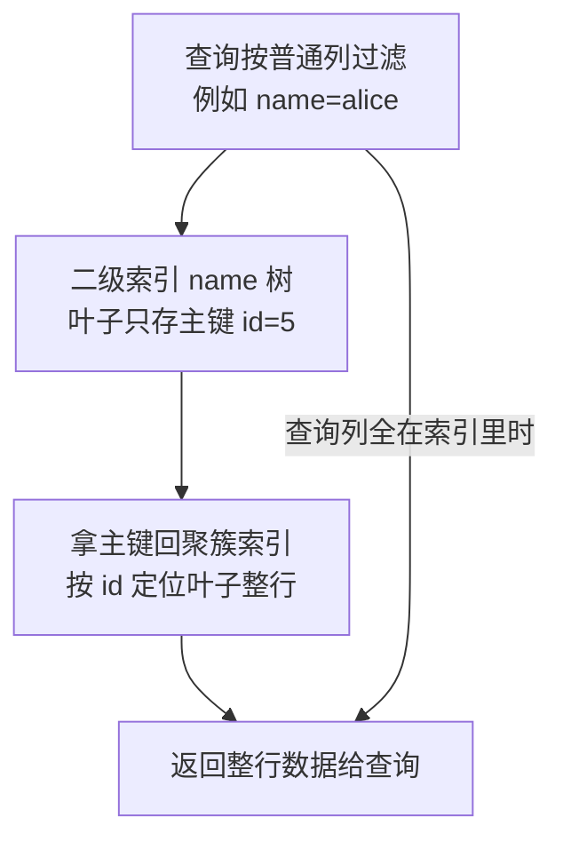
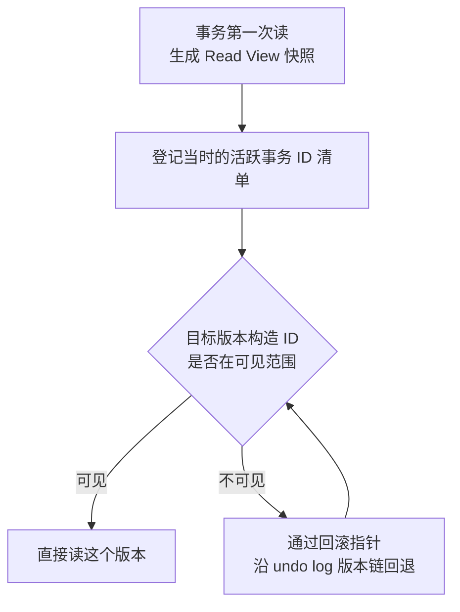
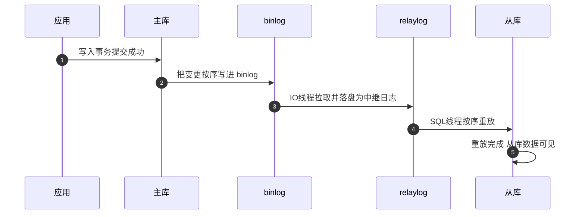

# MySQL：从基础到资深进阶

> 所属：阶段八 数据库专家
> 定位：MySQL 是国内团队常用的关系型数据库之一，适合大量结构化核心业务（订单/用户/支付）。本教程从「建表/CRUD」到「索引/事务/锁/优化」，再到「窗口函数/CTE/分区」等**企业级惯用法**，最后到「主从复制/读写分离/分库分表」的**高可用与扩展**。**记住一条红线：核心业务先明确事务、约束、恢复与查询需求，再在团队能稳定运维的关系型方案中选择。**

## 快速入门（能跑）

### 本讲关键词与概念速查
| 关键词 | 一句话大白话 | 例子 |
|-|-|-|
| 表（Table） | 行 + 列的二维结构 | `CREATE TABLE user` |
| 主键 | 每条记录唯一标识 | `id BIGINT PRIMARY KEY` |
| 索引 | 加速查询的目录 | `CREATE INDEX idx_user_id` |
| 事务 | 一组操作要么全成功要么全回滚 | 下单 + 扣库存 |
| ACID | 原子/一致/隔离/持久 | 事务的四个特性 |
| 窗口函数 | 分组内排名/取最新 | `ROW_NUMBER() OVER(...)` |
| CTE | 一次查询的临时结果集 | `WITH t AS (SELECT...)` |
| 分区 | 按列拆表存储 | `PARTITION BY RANGE(...)` |

### 最简可运行示例
```sql
-- 建表: 用户表(每个字段都要想清楚类型和约束)
CREATE TABLE `user` (
    id       BIGINT PRIMARY KEY AUTO_INCREMENT,  -- 主键, 自增, 唯一
    username VARCHAR(64) NOT NULL UNIQUE,        -- 用户名, 非空, 唯一
    phone    VARCHAR(20) COMMENT '手机号',        -- 带注释, 方便维护
    status   TINYINT NOT NULL DEFAULT 0,         -- 状态: 0正常 1禁用(用TINYINT)
    created_at DATETIME DEFAULT CURRENT_TIMESTAMP  -- 创建时间, 自动填
);

-- 插入 + 查询
INSERT INTO `user` (username, phone) VALUES ('alice', '13800000000');
SELECT id, username, phone FROM `user` WHERE phone = '13800000000';  -- 只取需要的列
```

> **代码备注（逐行解释）**：
> - `PRIMARY KEY AUTO_INCREMENT`：主键自增，保证唯一且插入快；**别用 UUID 做主键**（页分裂 = 叶子节点写满被拆成两半的「搬家」，随机主键会频繁触发 + 索引大）。
> - `VARCHAR(64) NOT NULL UNIQUE`：字符串用 VARCHAR（**变长**，NOT NULL + UNIQUE 防脏数据）；定长才用 `CHAR`。
> - `TINYINT`：状态/布尔用 TINYINT（省空间）；金额用 `DECIMAL`（禁 FLOAT/DOUBLE，精度丢失）。
> - `COMMENT`：给字段写注释——**这是团队协作的基本功**，没人猜字段含义。
> - 查询只取需要的列（`id, username, phone`），**别 `SELECT *`**（多取列=多回表）。

## 核心概念

### 1. 索引：为什么查询慢
```sql
-- 建索引: 加速 WHERE user_id AND status 的查询
CREATE INDEX idx_user_status ON `order` (user_id, status);   -- 联合索引
-- 情形 A：条件匹配联合索引；实际计划仍以当前数据分布和统计信息为准
EXPLAIN SELECT id, status FROM `order` WHERE user_id = 10086 AND status = 1;
-- 可能看到 key=idx_user_status、type=ref；id/status 都在索引中时 Extra 还可能为 Using index

-- 情形 B：假设 users.phone 没有索引，则不能期待它使用 idx_user_status
EXPLAIN SELECT id, username FROM `user` WHERE phone = '13800000000';
-- 常见结果：key=NULL、type=ALL；这是另一个“无合适索引”的查询，需先核对真实执行计划再决定是否建索引
```

| 概念 | 说明 | 该怎么做 |
|-|-|-|
| 聚簇索引 | 主键索引，叶子存整行 | 主键选小的、自增的 |
| 二级索引 | 叶子存主键，查完回表 | 查询列全在索引里可免回表（覆盖索引） |
| 联合索引 | 多列组合 | **最左前缀**：`(a,b)` 能命中 `a` 和 `a,b`，不能只命中 `b` |
| 覆盖索引 | 查询列全在索引里 | 避免回表，快 |

> **解释透一点（为什么索引能加速）**：
> - **B+ 树（B+ Tree）**：InnoDB 的索引是一种「矮胖」的多路搜索树，扇出大，叶子节点有序链接，适合等值与范围访问。树高由页大小、键长度、行格式和记录数共同决定；根页和热点页也可能已在 Buffer Pool 中，所以不要把「三层、几次磁盘 IO」当作容量或性能承诺，应以 `EXPLAIN ANALYZE`、Buffer Pool 命中与压测结果判断。
> - **聚簇索引（Clustered Index）**：主键索引，叶子直接存整行数据。
> - **二级索引（Secondary Index）**：非主键索引，叶子只存主键值，查到主键后还要**回表（table lookup）**再取整行——回表是额外的随机磁盘 IO，这正是**覆盖索引（Covering Index）为什么快**的原因：查询列全在索引里，连回表都省了。

> 🧩 **生活版类比（B+ 树与回表）**：手机通讯录想找「张伟」的电话——先翻「首字母目录」到 Z 页，再翻「张」所在分页，三层就能在几十万条里定位到人；如果目录页只写了「名字+页码」没写手机号，还得再翻「主号码页」才能拿到电话。**换回 MySQL**：目录就是索引，翻页就是磁盘 IO；二级索引只存「条件值+主键」，要拿其他列就得**回表**再翻聚簇索引；覆盖索引则是让目录页就把需要的列都带上，一次翻页全搞定。



**EXPLAIN 四看**（排查慢 SQL 的关键列）：
```text
① type: 访问类型 —— 从好到差: const > eq_ref > ref > range > index > ALL(全表扫)
② key: 实际用到的索引(若 NULL 且 type=ALL 才是全表扫)
③ rows: 预计扫的行数(越大越慢)
④ Extra: 关键提示 —— Using index(覆盖索引免回表) / Using filesort(排序未用索引) / Using temporary(临时表, 大忌)
```

**三种常见索引失效**（写 SQL 时最容易踩）：
```sql
-- ① 函数/运算包住列 → 索引失效
EXPLAIN SELECT * FROM `order` WHERE DATE(created_at) = '2026-09-01';   -- 函数包列
-- 改: WHERE created_at >= '2026-09-01' AND created_at < '2026-09-02'  (范围查询走索引)

-- ② 隐式类型转换(字段是 varchar, 传数字) → 索引失效
-- 改: 传字符串, 或字段用正确类型

-- ③ 前导模糊 %abc → 索引失效(Like 'abc%' 可走, '%abc' 不行)
EXPLAIN SELECT * FROM `user` WHERE name LIKE '张%';    -- ✅ 可走
EXPLAIN SELECT * FROM `user` WHERE name LIKE '%张';    -- ❌ 索引失效
```
> **该怎么做**：高频查询建联合索引，把过滤列放最左，尽量做覆盖索引。
> **不该怎么做**：索引越多越好？**否**——每个索引都占用写开销（INSERT/UPDATE 都要维护索引），索引要精不在多。

### 2. 事务与隔离级别
```java
@Transactional   // 方法级事务: 要么全提交, 要么全回滚
public void transfer(Long fromId, Long toId, BigDecimal amt) {
    accountMapper.updateBalance(fromId, amt.negate());   // 扣款
    accountMapper.updateBalance(toId, amt);              // 加款
    // 任一失败, 两条都回滚 —— ACID 的原子性 + 一致性
}
```
| 隔离级别 | 脏读 | 不可重复读 | 幻读 | 说明 |
|-|-|-|-|-|
| READ UNCOMMITTED | ✅ 有 | ✅ | ✅ | 几乎不用 |
| READ COMMITTED | ❌ | ✅ | ✅ | 避免脏读，但可能不可重复读/幻读 |
| REPEATABLE READ（默认） | ❌ | ❌ | 普通快照读在同一快照内不见新增行；锁定读/范围写入按条件加记录锁或间隙/next-key 锁 | InnoDB 默认；两类读的语义不同 |
| SERIALIZABLE | ❌ | ❌ | ❌ | 完全串行，最慢 |

> **该怎么做**：先区分普通 `SELECT` 的一致性快照读与 `SELECT ... FOR UPDATE/FOR SHARE`、`UPDATE`、`DELETE` 的锁定读；默认 RR 常适合需要同一事务内稳定快照的业务，写冲突和写后语义仍要通过并发测试验证。事务要短（长事务占连接、扩大锁等待并阻碍旧版本清理）。MySQL 对 RR 下锁定读的行为还取决于唯一索引精确匹配还是范围扫描，见 [MySQL 8.4 隔离级别文档](https://dev.mysql.com/doc/refman/8.4/en/innodb-transaction-isolation-levels.html)。
> **不该怎么做**：事务里做远程调用/大文件 IO——连接被占住，高并发下连接池打满。

> **MVCC 与日志（面试高频）**：InnoDB 的 RR 要按读类型理解：**MVCC（Multi-Version Concurrency Control，多版本并发控制）**让普通一致性读按 Read View 取稳定快照；锁定读和范围写入则可能使用记录锁、间隙锁或 next-key 锁来阻止冲突插入，二者不能混成「所有读都靠 next-key 锁」。
> - **MVCC**：一致性读首次建立或使用 Read View（活跃事务快照），按可见性规则从版本链挑版本读——旧版本可由 **undo log**（撤销日志，保留旧版本供回滚与读快照）重建，从而减少读写互相等待。
> - **redo log（重做日志）**：**WAL（Write-Ahead Log，预写日志）**思想——先写 redo 日志再改数据页，崩溃后重放 redo 恢复，保证事务持久性（对应 `innodb_flush_log_at_trx_commit` 的刷盘策略）。
> - **undo log** 还承担回滚：事务失败时按 undo 逆操作恢复。
> - **一句话分工**：redo 保「持久」（崩溃重做）、undo 保「回滚与 MVCC」（撤销版本）、binlog 做「复制与恢复」（逻辑日志，主从复制时从库照着它重放）。
> - **学习回链**：[阶段三的 MySQL 章节](../03-阶段三-数据持久化与中间件/01-MySQL内核与SQL优化.md)已建立 redo / undo / binlog 与崩溃恢复的最低闭环；这里把它们放进 Read View、刷盘策略和复制诊断中深化，避免把同一结论重复背两遍。

> 🧩 **生活版类比（MVCC 快照读）**：出版社开印前给作者发一张「定稿清单」——作者按清单读稿，别人随后改的内容统一看不到；只有改完、登记进清单的版本才可见。**换回 MySQL**：清单就是 **Read View**，「登记在册的活跃事务」相当于「正在改稿的人」；行数据用回滚指针串成一串版本，读的人按清单挑版本、不排队，只有「正在改稿的人」才需要加锁——这就是「读不加锁、读写不互斥」。



## 进阶：企业级惯用法与专业实践

### 1. 窗口函数（MySQL 8+ 的企业级利器）
```sql
-- 取每个用户最近的一笔订单(以前用子查询或 app 循环, 现在一行)
SELECT * FROM (
    SELECT o.*,
           ROW_NUMBER() OVER (PARTITION BY user_id ORDER BY created_at DESC) rn
    FROM `order` o
) t WHERE rn = 1;
```
| 窗口函数 | 作用 | 场景 |
|-|-|-|
| `ROW_NUMBER()` | 组内编号 | 取每组最新一条 |
| `RANK() / DENSE_RANK()` | 排名 | 排行榜（并列处理） |
| `SUM() OVER()` | 组内累计 | 累计销售额 |
> **该怎么做**：分组取最新/排名/累计用窗口函数——比子查询清晰、比 app 循环高效。
> **不该怎么做**：**组内最新一条**用 `LIMIT` 或循环（窗口函数是更优雅解法）；但**深分页**（`offset` 很大）窗口函数解决不了——那要用**游标/键集分页**（`WHERE (created_at,id) > (上一页末行的值) ORDER BY ... LIMIT n`）或延迟关联。

### 2. CTE（Common Table Expression）
```sql
-- WITH 拆分复杂查询, 可读性大幅提升
WITH recent_orders AS (
    SELECT user_id, COUNT(*) cnt FROM `order`
    WHERE created_at > DATE_SUB(NOW(), INTERVAL 7 DAY) GROUP BY user_id
)
SELECT u.id, u.name, COALESCE(r.cnt, 0) AS order_cnt
FROM user u LEFT JOIN recent_orders r ON u.id = r.user_id;
```
> **该怎么做**：复杂查询用 `WITH` 一级级拆，逻辑清晰、好维护。
> **不该怎么做**：大段嵌套子查询堆一起——CTE 是更清晰的替代。

### 3. 分区表（大表按时间/范围拆）
```sql
-- 按月分区: 查询自动只扫对应分区(配合冷热分离)
CREATE TABLE `order_log` (
    id BIGINT, order_id BIGINT, created_at DATETIME
) PARTITION BY RANGE (TO_DAYS(created_at)) (
    PARTITION p202609 VALUES LESS THAN (TO_DAYS('2026-10-01')),
    PARTITION p202610 VALUES LESS THAN (TO_DAYS('2026-11-01')),
    PARTITION p_max VALUES LESS THAN MAXVALUE   -- 必须留 MAXVALUE, 否则未来日期插入会报错
);
```
> **该怎么做**：日志/流水类按时间分区——查询走对应分区，删历史数据直接 `DROP PARTITION`（快）。**务必留 `MAXVALUE` 兜底分区**，或按月滚动预建分区，否则插入超过最后一个分区范围会报错。
> **不该怎么做**：把分区当索引替代——分区是存储组织，索引是加速查询，两者不冲突但要配合好；只建到当前月而未留 MAXVALUE。

### 4. 通用表空间与 InnoDB 红宝书（常见 DB 调优）
```ini
# 连接池(不是越大越好): 活跃连接 ≈ 并发×RT, 超了只会上下文切换
[mysqld]
innodb_buffer_pool_size = 4G        # InnoDB 缓冲池大小(建议占内存 60-70%), 性能核心
innodb_flush_log_at_trx_commit = 1  # 1=每次提交都刷盘(数据最安全); 2=提交只写OS缓存、每秒fsync(性能好，但OS崩溃丢约1秒)
```
> **该怎么做**：`innodb_buffer_pool_size` 是 InnoDB 的关键缓存参数，具体大小要结合同机进程、工作集和压测确定；日志刷盘 `=1` 提供更强的提交持久性，`=2` 在操作系统或主机故障时可能丢失最近一段已提交事务，适用性由 **RPO（故障时最多可接受丢失的数据时长）** 决定。
> **不该怎么做**：盲目调低 `flush_log_at_trx_commit` 换性能——`=0` 会丢更多（MySQL 崩溃也丢最近秒），对资金类业务风险大。

> ⏸️ **短期可以不学**：InnoDB 内核级调优——redo / undo 表空间、doublewrite、`innodb_buffer_pool_instances`、自适应哈希索引等细节。**何时回来学**：线上出现 I/O 或写入瓶颈，需要做 DBA 级调优时。**面试最低要求**：知道 Buffer Pool 是核心缓存，但大小必须为操作系统、连接、排序 / 临时内存和同机进程留余量；“物理内存 60%～70%”只能作为专用数据库机的历史起点，不能套到容器或混部环境。能说明 `innodb_flush_log_at_trx_commit` 各取值的持久性取舍即可。[MySQL 8.4：InnoDB 启动配置](https://dev.mysql.com/doc/refman/8.4/en/innodb-init-startup-configuration.html)

### 5. 表结构变更用 Flyway（生产禁止手工 DDL）
```text
生产数据库表结构变更: Flyway 迁移脚本(V1__init.sql, V2__add_col.sql) —— 版本化、可审查、可追溯
避免: 未经评审、未演练地直接在线 ALTER；回滚通常需要显式编写反向迁移或采用兼容发布，而不是依赖 Flyway 自动回滚
```

## 主从复制与读写分离（MySQL 的高可用）

### 1. 主从复制搭建
```ini
# 主库 my.cnf
[mysqld]
server_id = 1                    # 复制拓扑内唯一(重复会导致复制错乱)
gtid_mode = ON                   # 用 GTID 定位, 切换/续传自动
enforce_gtid_consistency = ON    # GTID 前置要求: 保证事务与 GTID 一一对应
log_bin = mysql-bin              # 开 binlog(8.0 默认开)
```
```sql
-- 从库建复制通道(MySQL 8.0.23+)
CHANGE REPLICATION SOURCE TO SOURCE_HOST='10.0.0.11', SOURCE_USER='repl',
    SOURCE_PASSWORD='***', SOURCE_AUTO_POSITION=1;    -- GTID 自动定位, 不用对位点
START REPLICA;
SHOW REPLICA STATUS\G   -- Replica_IO_Running/Replica_SQL_Running 双 Yes 才健康; Seconds_Behind_Source=延迟秒数
```
> **代码备注（逐行解释）**：
> - `gtid_mode=ON` + `SOURCE_AUTO_POSITION=1`：用 **GTID**（全局事务 ID = Global Transaction ID，像给每个事务贴一张全局唯一的快递单号，主从按单号对账）而不是「文件名+位点」——主从切换、断点续传自动，无需人工对位点。
> - `server_id` 在拓扑内唯一，重复会让复制错乱。
> - `SHOW REPLICA STATUS`：巡检必看——`Replica_IO_Running`/`Replica_SQL_Running` 双 `Yes` 才是健康；`Seconds_Behind_Source` 就是主从延迟秒数。
> - **单主复制通常解决「读扩展 + 故障切换基础」，不直接解决写扩展**——写入仍集中到当前 source；多主或分片是另一组取舍。

**数据流转链路（从主库到从库）**：主库每次提交把变更写进 **binlog（二进制日志，主库的「变更流水账」）**；从库专门的 IO 线程按位置把它拉过来，先在本地落成 **relay log（中继日志，从库账本的一页暂存）**，再交给 SQL 线程**按顺序重放**——重放完成，数据才在从库可见。这正是「写后立刻读」为何可能读到旧值：重放需要时间。



### 2. 读写分离落地（读多写少）
```yaml
# 框架多数据源: 写主读从, 按注解路由
spring.datasource:
  master: { url: jdbc:mysql://10.0.0.11:3306/shop }
  slave:  { url: jdbc:mysql://10.0.0.12:3306/shop }
```
> **该怎么做**：当读负载、延迟和副本延迟指标证明需要时，再让副本分担读压力；读写比没有通用门槛，先压测单库和缓存命中情况。

### 3. 主从延迟是头号坑（写完读不到）
```java
// 对策一: 写后短窗口强制读主库
@Transactional
public Order create(...) {
    Order o = repo.save(dto);
    dynamicDataSource.forceMaster();      // 本请求内的读强制走主库
    return o;
}
// 对策二: 写后只读"刚写入的主键" → 主键查询走主库
// 对策三: 前端"提交成功页"不立刻回查详情, 给 200ms 宽容(产品层)
```
> **该怎么做**：写后强一致的关键操作读主库；普通读走从库——这是最常见的折中。
> **不该怎么做**：所有读都走从库——写后立刻查会读到旧值（`我刚下的订单呢？`）。
> **为什么会有主从延迟**：从库要重放主库的 binlog 才能看到新数据，写压力大时重放速度追不上主库的写入——这正是上节「写后立刻读」读到旧值的根因。
> - **历史原因**：从库曾是单线程重放，8.0 起有**并行复制**缓解。
> - **落后越多，从库读到的数据越旧**。
> - **缓解手段**：并行复制、写后关键读强制走主库、对延迟不敏感的业务走从库。
> - **兜底铁律**：凡是「刚写入就要立刻可见」的数据，默认读主库。

### 4. 分库分表（容量不够时的最后手段）
```text
演进顺序: 索引优化 → 冷热分离 → 读写分离 → 分库分表 → ES
核心心法: 归档能续命就先续命, 真到归档也压不住才分库分表
```
- **分片键**：按最高频查询维度选（C 端订单按 user_id）。
- **跨分片代价**：无法 join、无法单库事务、全局 ID 自己生成（雪花算法）。
> **该怎么做**：先定位瓶颈，再在索引、归档、缓存、读副本、分区和分片中选择；分片前要验证扩容、热点迁移和跨片查询。分片数不必“一次定够”，但需要预留再分片或迁移方案。
> **不该怎么做**：一上来就分库分表——那是过度设计（阶段六反模式）。

> ⏸️ **短期可以不学**：分库分表中间件（ShardingSphere 等）的具体接入与运维。**何时回来学**：真到「归档也压不住、必须分片」落地时再实操。**面试最低要求**：说出演进顺序、分片键怎么选（按最高频查询维度）、跨分片的三大代价（无法 join / 无单库事务 / 全局 ID 自造）即可。

## 场景与红线（怎么做 / 不该怎么做）

| 场景 | ✅ 该怎么做 | ❌ 不该怎么做 |
|-|-|-|
| 结构化核心业务 | 评估 MySQL 或 PostgreSQL 的事务、约束与团队能力 | 因为“非关系型”标签就跳过一致性、事务和恢复评估 |
| 金额计算 | `DECIMAL` + 精确运算 | `FLOAT/DOUBLE` |
| 高并发计数 | Redis `INCR` + 落库 | 每次都写 MySQL |
| 全文搜索 | ES（别用 LIKE 扫全表） | MySQL `LIKE %xx%` 硬扛 |
| 复杂度关联查询 | 窗口函数/JOIN/联合索引 | 嵌套子查询/循环（N+1） |
| 大表优化 | 分区/冷热分离/读写分离/分库分表 | 一上来就分库分表 |
| 表结构变更 | 评审过的 Flyway 迁移 + 兼容发布/回退方案 | 未审查、未演练地在线改表 |
| 读多写少 | 监控和压测后决定是否用副本读 | 未确认瓶颈就强行读写分离 |

## 红线小结（必背）

1. **核心业务先明确约束**：事务、关系约束、恢复与读己之写要求明确后，再在 MySQL、PostgreSQL 或其他已验证方案中选择。
2. **金额用 DECIMAL**：浮点类型精度丢失，线上资损大忌。
3. **索引要精**：不是越多越好，写操作都要维护索引。
4. **扣减用条件更新**：`WHERE cnt>=1` 防超卖，别读-判-写三步。
5. **别 `SELECT *`**：多取列 = 多回表 = 慢。
6. **窗口函数/CTE 是 8.0 新武器**：组内最新/排名/累计优先用它；深分页用游标/延迟关联，别急着上更重架构。
7. **表结构变更可追溯且可回退**：用版本化迁移与兼容发布，避免未演练的在线 DDL。
8. **按瓶颈选择演进手段**：索引、归档、读副本、分片与 ES 没有强制顺序。
9. **单主复制不直接解决写扩展**：写集中到当前主库，读多写少才更容易从副本受益。

## 进阶自测

- [ ] 能说清聚簇索引 / 二级索引 / 覆盖索引的区别，以及回表为什么慢
- [ ] 能画表设计：主键怎么选、不同类型怎么选（DECIMAL/TINYINT/DATETIME）
- [ ] 能复现四种隔离级别下的问题，并说出 MySQL 默认隔离级别
- [ ] 能用 `WHERE cnt>=1` 条件更新防超卖，并解释为什么并发安全
- [ ] 能用窗口函数/CTE 写「每组最新」「累计」这类查询
- [ ] 能排查慢 SQL：EXPLAIN 四看 + 三种索引失效场景
- [ ] 能搭建主从复制（GTID），并处理读写分离的主从延迟问题
- [ ] 能用「索引 → 冷热 → 读写分离 → 分库分表」设计单表 5000w 的演进路线
- [ ] 场景：订单写入后必须立即展示，报表允许延迟 30 秒。能给出读主/读副本的路由规则，并说明触发分片前还要测哪些指标。
- [ ] 场景：事务 T1 先更新订单 A 再更新 B，T2 反过来更新，出现死锁。能先保留 SQL、事务 ID 与 `SHOW ENGINE INNODB STATUS` 中的死锁证据，再只重试被回滚且幂等的事务；修复优先统一加锁顺序、缩短事务，而不是盲目无限重试。

> **核对要点**：订单提交后的关键读应路由到主库或具备读己之写保证的路径；报表可在可监控复制延迟范围内读副本。是否分片要看写入、索引、存储、延迟、热点和扩容演练，而不是单表行数。
>
> **死锁回链与边界**：[阶段三的死锁定位与重试说明](../03-阶段三-数据持久化与中间件/01-MySQL内核与SQL优化.md)讲基础现象；本阶段要求把它变成线上判断：先取证，再确认重试是否幂等，最后从一致加锁顺序和事务范围消除冲突。InnoDB 会检测死锁并回滚其中一个事务，应用仍要处理返回的失败。[MySQL：InnoDB deadlock](https://dev.mysql.com/doc/refman/8.4/en/innodb-deadlocks.html)

## 常见面试题

### Q1：MySQL 索引为什么用 B+ 树？树高一般多少？

**答**：**标准结论**：B+ 树「矮胖」——扇出大、层数少、叶子有序链表适合范围查询，磁盘 IO 次数少。

**底层原理**：
- B+ 树页的扇出较大，因此树通常较矮；但树高受键长度、页填充、行格式和数据量影响，且访问是否触发磁盘 IO 还取决于 Buffer Pool 命中，不能用固定「2000 万行三层」推断性能。
- 对比：红黑树每层两个分支、层数多；哈希索引只能等值、不能范围。

**工程实践**：
- 树高不是调优目标，真正要防的是「回表」和「索引失效」——联合索引按最左前缀设计、高频查询做覆盖索引，比纠结树高更有价值。
- 主键选小且自增，就是为了让聚簇索引更「矮胖」、减少页分裂。

### Q2：什么是回表？什么是覆盖索引？

**答**：**标准结论**：二级索引的叶子只存主键值，查完二级索引再拿主键回聚簇索引取整行叫**回表**；查询列全在索引里、不用回表，就叫**覆盖索引**。

**底层原理**：
- 回表是第二次随机磁盘 IO（按主键到聚簇索引找行），大量回表就是 N 次随机 IO，慢。
- 覆盖索引让一次索引遍历就拿到所有需要的列，连主键都不用再查。

**工程实践**：
- 把高频查询的「WHERE 条件列 + SELECT 的列」一起塞进联合索引，EXPLAIN 的 Extra 出现 `Using index` 即命中覆盖索引。
- 别为覆盖索引无限加列——索引本身是写开销，索引要精不在多。

### Q3：MVCC 是什么？InnoDB 的 RR 怎么防幻读？

**答**：**标准结论**：MVCC 让普通一致性读按快照读取旧版本；InnoDB RR 下，普通快照读与锁定读要分开理解。范围锁定读/写入可能使用 next-key 锁（记录锁 + 间隙锁）阻止冲突插入。

**底层原理**：
- 每行有隐藏字段（事务 ID、回滚指针），更新时旧版本写进 undo log 形成版本链。
- 事务第一次读时生成 Read View，按可见性规则选版本，所以同一事务多次读结果一致（消除不可重复读）。
- 对锁定读或范围写入，InnoDB 会按索引与查询条件使用记录锁、间隙锁或 next-key 锁；唯一索引精确匹配通常只锁记录，范围扫描才可能锁住间隙。普通快照读依赖 Read View 的可见性规则。

**工程实践**：这就是 InnoDB 的 RR 比 SQL 标准更强的本质；事务要短——长事务会拖住 Read View 与锁、阻碍 undo log 清理，并发与性能都受损。

### Q4：redo log、undo log、binlog 有什么区别？

**答**：**标准结论**：
- redo log 是 InnoDB 的物理日志（WAL），崩溃恢复时重放、保证持久性。
- undo log 保存旧版本，供回滚与 MVCC 读快照。
- binlog 是 MySQL Server 层的逻辑日志，做主从复制与数据恢复。

**底层原理**：
- redo 遵循 WAL（Write-Ahead Log）——先写日志再改数据页，页没来得及刷盘也不怕，重启重放即恢复。
- undo 与数据页一起被 redo 保护。
- binlog 记录语句/行级变更逻辑，从库按它重放。

**工程实践**：
- `innodb_flush_log_at_trx_commit=1` 每次提交刷 redo 最安全。
- 对持久性目标较高的链路，常评估「双 1」（`sync_binlog=1` + `innodb_flush_log_at_trx_commit=1`）；它是风险/延迟取舍，不替代备份、恢复演练和业务幂等设计。

### Q5：慢 SQL 怎么排查？EXPLAIN 看哪几列？

**答**：**标准结论**：慢查询日志捞 SQL，EXPLAIN 重点看 type、key、rows、Extra 四列。

**底层原理**：
- type 从好到差 const > eq_ref > ref > range > index > ALL，ALL 就是全表扫。
- rows 是预估扫描行数，越大越慢。
- Extra 出现 `Using filesort`（排序没走索引）、`Using temporary`（临时表）都是性能杀手。

**工程实践**：
- 先排除三类索引失效——函数/运算包列、隐式类型转换、前导 `%` 模糊。
- 再考虑加联合索引/覆盖索引。
- 数据量大时配合深分页优化（延迟关联、键集分页）与冷热归档。
- 「先 EXPLAIN 再动手」是铁律，不要凭感觉加索引。
