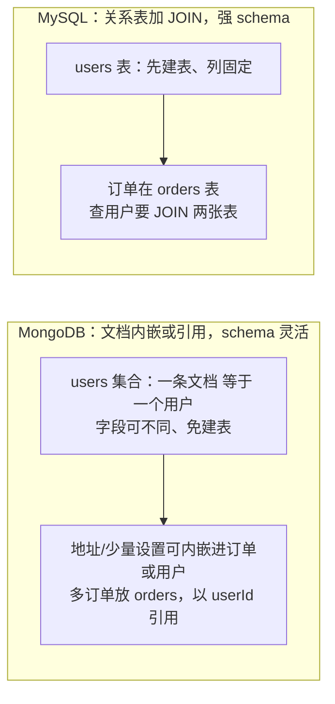
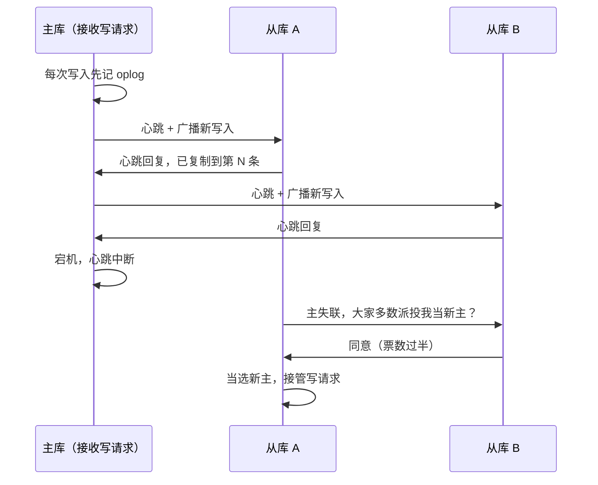
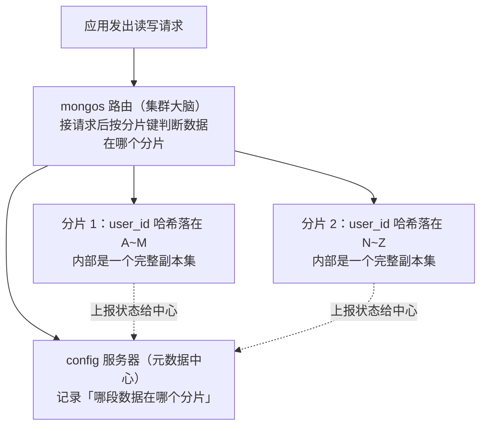

# MongoDB：从基础到资深进阶

> 所属：阶段八 数据库专家
> 定位：MongoDB 是**文档型 NoSQL**——以 JSON 风格的文档存数据，schema 灵活、可通过分片水平扩展。适合「字段常变、以文档聚合读写为主、快速迭代」的场景。它支持多文档事务，但事务、跨文档关联与分布式一致性都有成本；选型前先确认文档模型是否匹配访问模式。

## 快速入门（能跑）

### 本讲关键词与概念速查
| 关键词 | 一句话大白话 | 例子 |
|-|-|-|
| 数据库 | 命名空间 | `shop` |
| 集合（Collection） | ≈ 关系表 | `users` |
| 文档（Document） | ≈ 一行，JSON 格式 | `{name:"张三", age:20}` |
| ObjectId | 自动生成的主键 | `_id` |
| schema 灵活 | 每文档字段可不同 | 一条有 address、一条没有 |
| 索引 | 加速查询 | `{user_id:1}` |
| 副本集 | 高可用 | 主节点故障后自动选举新主 |
| 分片集群 | 水平扩展 | 海量数据 |

### 最简可运行示例
```java
// 用 MongoDB Java Driver 读写(带详细注释)
import com.mongodb.client.MongoClient;
import com.mongodb.client.MongoCollection;
import org.bson.Document;
import org.springframework.stereotype.Service;

@Service
public class UserStore {
    private final MongoCollection<Document> collection;  // 用户集合

    public UserStore(MongoClient mongoClient) {
        this.collection = mongoClient.getDatabase("shop").getCollection("users");
    }

    // 插入: 文档就是 JSON, 字段随意
    public void insert(String name, Integer age) {
        Document doc = new Document("name", name)     // 键值对
                       .append("age", age)             // 可加任意字段
                       .append("created_at", new java.util.Date());
        collection.insertOne(doc);                     // 插入一条
    }

    // 查询: 用 Document 表达条件
    public Document findByName(String name) {
        return collection.find(new Document("name", name)).first();  // 找第一条
    }
}
```

> **运行前提**：这是可嵌入 Spring Boot 应用的 Java 片段，不是独立 `main` 程序。需引入 MongoDB Java Driver、配置可用的 `MongoClient` Bean 和连接串；`@Service` 来自 Spring。代码未展示连接池、超时、索引、schema 校验与异常处理，生产环境应按业务补齐。

> **代码备注（逐行解释）**：
> - `MongoClient`：MongoDB 客户端（自动注入），连接即可用。
> - `getDatabase("shop").getCollection("users")`：定位到「数据库.集合」（≈ 库.表）。
> - `new Document("name", name).append("age", age)`：**文档即 JSON**——字段灵活，不用预先定义 schema。
> - `insertOne(doc)`：插入一条；`find(...).first()`：查第一条；`find(...)` 返回游标可遍历。
> - **`_id` 自动生成**：若不指定，Java Driver 会在发送前生成 ObjectId 作为 `_id`。当前 ObjectId 是 12 字节：4 字节时间戳、5 字节随机值、3 字节递增计数器；它通常按生成时间递增，但不是严格的全局时间顺序，也不应把可读时间当业务排序依据。[官方 BSON 类型文档](https://www.mongodb.com/docs/manual/reference/bson-types/#objectid)
> - 对比 MySQL：**无需先建表**，插入第一条文档就自动建了集合——这是 schema-less 的魅力。

## 核心概念

### 1. 文档模型（Document Model）vs 关系模型（Relational Model）
| 维度 | MongoDB | MySQL |
|-|-|-|
| 结构 | JSON 文档，字段灵活 | 表，强 schema |
| 关联 | 文档内嵌或引用 | JOIN |
| 事务 | 单文档原子；支持多文档事务 | ACID 事务与复杂关联是常见强项 |
| 扩展 | 需要时可用分片扩展，仍要设计分片键与路由 | 主从/分库分表 |
> **该怎么做**：字段常变、一对一内嵌、海量写入用 MongoDB。
> **不该怎么做**：复杂多表关联、强事务（如支付）用 MongoDB——那是 MySQL 的地盘。
> **小知识**：文档底层不是纯 JSON 文本，而是 **BSON（Binary JSON）**——一种带类型的二进制编码，支持日期、二进制、Decimal128 等原生类型。它是否比 JSON 文本更小或更快取决于字段名、值与访问方式；不要因“二进制”就把它当作压缩格式。平时写 `Document` 不用关心编码细节，但“文档即 JSON”只是开发体验，驱动传输的是 BSON。

两种建模方式，一图对照：



### 2. 插入与查询操作符
```javascript
// 插入多条
collection.insertMany(List.of(doc1, doc2));

// 查询操作符: $gt/$in/$regex 等
collection.find(new Document("age", new Document("$gt", 18)))     // age > 18
           .sort(new Document("created_at", -1))                   // 按时间倒序
           .skip(0).limit(10);                                     // 分页

// 更新: 匹配条件 + 更新操作
collection.updateOne(
    new Document("name", "张三"),                       // 条件
    new Document("$set", new Document("age", 30)));     // $set: 只改 age 字段
```

## 进阶

### 1. 索引与查询优化
```javascript
// 建索引: 加速按 user_id 查询
collection.createIndex(new Document("user_id", 1));
// 组合索引 + 排序字段
collection.createIndex(new Document("user_id", 1).append("created_at", -1));
```
> **该怎么做**：高频查询建索引；排序字段放索引里。
> **不该怎么做**：全集合扫（无索引）——数据一多就慢；也别建太多索引（写开销）。

### 2. 聚合管道（Aggregation Pipeline）——MongoDB 的「SQL 增强」
```javascript
// 聚合管道: 一组阶段($match/$group/$project)串成数据处理流水线
import static com.mongodb.client.model.Aggregates.*;   // match/group/sort 等阶段
import static com.mongodb.client.model.Accumulators.*; // avg/sum/push 等累加器(在 Accumulators 类!)
import static com.mongodb.client.model.Sorts.*;        // descending/ascending(在 Sorts 类!)
import static com.mongodb.client.model.Filters.*;

// 需求: 按 status 分组统计 + 求平均金额 + 排序(≈ SQL 的 GROUP BY + AVG + ORDER BY)
var result = collection.aggregate(List.of(
    match(eq("status", 1)),                              // $match: 过滤(≈ WHERE)
    group("$userId",                                    // $group: 分组(≈ GROUP BY)
        avg("avgAmount", "$amount"),                    //   avgAmount = 每组 avg(amount)
        sum("total", "$amount")),                       //   total = 每组 sum(amount)
    sort(descending("avgAmount"))                       // $sort: 排序(≈ ORDER BY)
));
result.forEach(doc -> System.out.println(doc));          // 迭代结果
```
> **代码备注（逐行解释）**：
> - `match(...)`：**$match** 阶段——筛选（≈ `WHERE`），放最前能减少后续处理量。
> - `group("$userId", ...)`：**$group** 阶段——按字段分组（≈ `GROUP BY`），`avg`/`sum` 是累加器。
> - `sort(...)`：**$sort** 阶段——排序（≈ `ORDER BY`）。
> - 聚合管道把「过滤/分组/排序/筛选」串成**一个查询**，在数据库内完成，不拉全量到内存——这是 MongoDB 做统计的核心。
> - 对比 MySQL：相当于一条 `GROUP BY` + 聚合函数；但 MongoDB 的管道更灵活（`$lookup` 关联、`$unwind` 拆数组）。

### 3. 副本集（Replica Set，高可用，生产标配）
```javascript
// 副本集 rs0: 1 主 2 从，主故障后自动选举新主；线上按可用性目标配置
// 连接串: mongodb://host1,host2,host3/?replicaSet=rs0
// 读偏好(readPreference): 让读走从库分担压力
// mongodb://hosts/?replicaSet=rs0&readPreference=secondaryPreferred
```
> **类比：副本集 = 写字楼复印间的多本底稿**——生活版：正门存一本"当日账底稿"，两侧复印间各存一份每日抄好的副本；正门失火，两侧先互相对账（多数分店都确认过的那份才作数），票数过半的那侧升格为总账房——避免两边同时声称"我才是正门"。
> 换成副本集：**主库**把每次写入记进 oplog（操作日志），**从库**异步拉取重放以追赶进度；主库宕机，从库按**多数派投票**选出新主，只有多数派一侧能当选，天然避免双主。

主故障切换的完整链条：



> **该怎么做**：生产拓扑通常至少使用 3 个可投票、承载数据的成员；具体节点数、跨可用区布局与读偏好取决于可用性目标和预算。`secondaryPreferred` 只适合可容忍陈旧数据的读。
> **不该怎么做**：单节点裸奔——宕机即不可用。
> **读写一致性三件套（面试重点）**：副本同步本质是**最终一致性**——主库确认写成功后，从库还在异步"追赶"（拉取并重放 oplog），此刻读从库可能读到旧数据。
> - **读偏好（readPreference）**：只决定"读路由到哪台机器"，**不保证读到最新**。
> - **写关注（Write Concern）**：写操作要求多少节点确认。`w: 1` 是主库本地应用该写后即可确认，**不等于已经写入磁盘**；是否等待 journal 由 `j` 和部署配置决定。`w: "majority"` 等待多数派确认，但 journal 语义还受 `writeConcernMajorityJournalDefault` 和版本/存储引擎配置影响；对明确要求磁盘持久性的写应显式评估 `{ w: "majority", j: true }` 与延迟预算。[官方副本集写关注](https://www.mongodb.com/docs/manual/core/replica-set-write-concern/)
> - **读关注（Read Concern）**：读操作要求的版本。`readConcern: "majority"` 读取多数派已确认的数据；它不等于任意请求的线性一致读，也不能替代正确的读偏好与会话设计。
> 工程上：核心链路根据 RPO/RTO、读写延迟与部署配置选择写关注和读关注；可容忍稍旧的读才用 `secondaryPreferred`。需要读到刚完成写的因果结果时，使用正确的会话/读关注组合或读主库，不能只凭「写完读主」口头保证。

### 4. 分片集群（水平扩展）

> ⏸️ **短期可以不学**：分片集群是"单副本集写入扛不住"才上马的超大流量方案，日常开发基本碰不到（还涉及均衡器、在线 resharding 等运维细节）。**何时回来学**：业务确实达到单副本集写入瓶颈、需要水平扩展时，再系统学分片键设计与集群运维。**面试最低要求**：能说出分片集群解决什么问题、分片键要选"高基数 + 均匀分布"的字段、单调递增键会产生写热点。

> **类比：分片键 = 图书馆按首字母分书架**——生活版：整馆书码成一摊，人多一挤、查书要翻遍全馆；改成按书名首字母散到 26 个书架，先找书架再找书、井井有条——但前提是"分布均匀"：按作者首字母均匀分散；若按出版日期排，新书全堆在门口那格，借阅流量全压一格。
> 换成分片集群：**分片键**就是"按哪个字段把数据散到多台分片"；选**高基数 + 均匀分布**的字段（如 `user_id`）配 **hashed 哈希分片**最均衡；用单调递增的**时间戳**做 **ranged 范围分片**，新数据全打到最后一个分片=写热点。

- **分片键（Shard Key）**：把数据散到多个分片的字段（如 `user_id`），**选高频查询 + 高基数 + 均匀分布**的字段。
- **分片 + 副本集**：每个分片是完整副本集，共同承担海量数据。
```javascript
// 分片方式: ① hashed(哈希) 分片 → 打散均匀, 避免写热点 —— 适合高并发写入
//          ② ranged(范围) 分片 → 利于范围查询, 但单调递增键(时间戳)会产生写热点
// 分片键选择: user_id(高基数均匀) → hashed 好; 时间戳 → ranged 会写热点, 要避免
// 5.0 起支持在线 resharding, 可平滑调整分片键
```
三个角色的分工：



> **该怎么做**：单机扛不住时按高频**高基数且均匀**的字段（user_id）做分片键；高并发写入选 **hashed** 分片避免写热点。
> **不该怎么做**：用单调递增的**时间戳**做范围分片键——写全打到最新分片，该分片成瓶颈。

### 5. 事务（有限）
```javascript
// 副本集支持多文档事务；分片集群的支持版本和限制以当前官方文档为准
try (var session = mongoClient.startSession()) {   // 用注入的 mongoClient 开会话
    session.startTransaction();
    collection1.insertOne(doc1, session);        // 第1个操作: 传 session 进事务
    collection2.updateOne(filter, update, session);  // 第2个操作: 必须也传 session, 否则不进事务!
    session.commitTransaction();                 // 全部成功才提交, 任一失败回滚
}
```
> **该怎么做**：确实需要原子地提交多个文档时，用事务，并设置与业务目标匹配的 transaction options（read concern、write concern、read preference）。事务支持的部署条件与版本限制以[官方事务文档](https://www.mongodb.com/docs/manual/core/transactions/)为准。
> **不该怎么做**：能不用就不用——事务会降低性能；**且事务内每个操作都必须传 `session`**，漏传的操作不在事务里。

## 进阶补充：内嵌 vs 引用建模（文档模型的核心决策）

> MongoDB 建文档时最核心的决策：**数据是内嵌（embedded）还是引用（reference）**，取决于「访问模式 + 数据规模」。

> **类比：内嵌 vs 引用怎么想**——生活版：内嵌像把证件照直接贴在身份证内页，随身带、一次翻开全都有（但补办得换整本）；引用像家谱只需写「第 5 代亲属详情见户口本」，人多就单独维护一本册子，改一处不用重抄整本。
> 换成文档模型：**内嵌**= 把「订单地址」直接写进订单文档，一次查询拿全、读得爽；**引用**= 订单只存 `userId`，用户和订单各自成文档、独立增长，不会把单文档顶到 **16 MiB** 上限。

| 决策 | 该怎么做 | 原由 |
|-|-|-|
| **内嵌（Embed）** | 一对一 / 一对少（如订单内含几个地址、文章含标签数组） | 一次查询拿全，避免跨文档查询 |
| **引用（Reference）** | 一对多 / 多对多（如用户的多条订单、关注关系） | 避免重复、数据独立更新、控制文档大小（16 MiB 上限） |

```java
// import org.bson.Document; import java.util.List; （示例省略其余 import）
// 假设 orders 是 MongoCollection<Document>，userId 是当前用户的稳定标识
// 内嵌: 订单里直接嵌收货地址(一对少)
Document order = new Document("orderNo", "A001")
    .append("items", List.of(/* ... */))
    .append("addr", new Document("city", "上海").append("street", "xx路"));

// 引用: 订单独立增长；不要把所有 orderId 反向累计在 user 文档
Document storedOrder = order.append("userId", userId);
orders.insertOne(storedOrder);
// 应用启动或迁移时一次性建立索引，不在每次下单时重复执行：
orders.createIndex(new Document("userId", 1).append("created_at", -1));
// 查询用户最近订单：orders.find(new Document("userId", userId)).sort(new Document("created_at", -1)).limit(20);
```
> **该怎么做**：内嵌用于「随主文档一起读、变化少且有上界」的数据；引用用于「独立增长、需单独更新」的数据。用户订单列表应以 `orders.userId` 为主查询入口，并建立与排序匹配的索引。
> **不该怎么做**：把用户的所有订单或无限增长的 `orderIds` 数组放进用户文档——二者都会随订单增长逼近 16 MiB 上限，也会放大文档更新与迁移成本。[MongoDB：内嵌与引用](https://www.mongodb.com/docs/manual/data-modeling/concepts/embedding-vs-references/) / [MongoDB：文档大小限制](https://www.mongodb.com/docs/manual/reference/limits/#bson-documents)

## 场景与红线（怎么做 / 不该怎么做）

| 场景 | ✅ 该怎么做 | ❌ 不该怎么做 |
|-|-|-|
| 埋点/事件原文 | 先声明事实源与保留期；字段灵活、按文档查询时可选 MongoDB | 未声明来源与留存，就只把数据塞进某个库 |
| 全文日志/检索 | ES 作为可重建索引；原始事实可在 MongoDB、对象存储或日志平台 | 把 ES 当唯一日志事实源，无法重建时才发现没有原文 |
| 动态字段/灵活 JSON 文档 | MongoDB 文档 | 强 schema 数据库（字段常变改起来痛苦） |
| 用户画像（字段多变） | MongoDB | 频繁 ALTER |
| 复杂关联报表 | MySQL/PG | MongoDB（关联弱） |
| 强事务核心业务（支付） | 选能满足账务、审计与一致性要求的方案 | 仅因 MongoDB 有多文档事务就忽略完整账务设计 |
| 海量写入 + 水平扩展 | MongoDB 分片 | 单机 MySQL 硬扛 |

### 事实源、检索索引与保留策略

> 先问“这条数据要证明什么、保留多久、能否重建”，再选 MongoDB 或 ES：
>
> - **业务/审计事实**：选择能满足不变量、审计与备份恢复目标的事实源；定义不可变记录、留存期与恢复演练。
> - **灵活事件文档**：若 MongoDB 是事实源，先验证其文档模型、事务/读写关注级别以及 TTL/归档/备份策略能否满足该数据的不变量与恢复目标；异步写入 ES 后，ES 只是检索副本。
> - **搜索或日志索引**：ES 可按 ILM 管理热温冷与删除，但应能从事实源或原始归档重建；最终一致的同步延迟也要对产品和排障可见。
>
> 前端迁移时，不要把“页面要全文筛选”误译成“ES 必须保存唯一数据”；它只说明查询目标。事实来源、检索索引和留存策略是三个独立设计决定。

## 红线小结（必背）

1. **schema 灵活是双刃剑**：字段常变时 MongoDB 是候选，不是自动结论；需要强约束、复杂关联或事务主流程时先评估关系型方案。
2. **严格用索引**：否则全集合扫描。
3. **线上需要副本集与备份策略**：单节点只适合作为开发或明确可接受单点风险的场景；`secondaryPreferred` 仅用于可容忍陈旧数据的读。
4. **聚合统计用管道**：`$match/$group/$sort` 在库内完成，别拉全量到内存算。
5. **关联/事务慎重**：Mongo 不强在这——优先 MySQL/PG。
6. **什么时候用 MongoDB**：字段常变 + 海量写入 + 快速迭代——三个特征同时满足才值得。
7. **别为「NoSQL 先进」而上**：用关系型能解决的就别引入 MongoDB——多一种存储多一份运维成本。

## 进阶自测

- [ ] 能说清文档模型 vs 关系模型的差异（schema 灵活 / 关联 / 事务）
- [ ] 能用 Document 写插入/条件查询/`$set` 更新
- [ ] 能用聚合管道（$match/$group/$sort）做分组统计，并解释各阶段
- [ ] 能说清 ObjectId 是什么、为什么自动生成
- [ ] 能设计副本集（1主2从 + 读偏好）与分片键选择
- [ ] 能判断「什么时候该用 MongoDB、什么时候该用 MySQL」（核心判断力）

> **场景迁移核对**：订单创建后必须让同一用户紧接着读取到该订单，同时还要容忍副本节点故障。不能只写「读主库」。
>
> **核对要点**：先明确 RPO/RTO 与延迟目标；写关注至少讨论 `w: "majority"` 和 journal 配置，读取根据需要选择多数派读关注或因果一致会话；若是跨文档不变量，再评估事务及其事务级配置。

## 常见面试题

### Q1：MongoDB 和 MySQL 怎么选？MongoDB 适合什么场景？

**答**：

**标准结论**：
- MongoDB 是文档型 NoSQL（Document Model）：以 BSON 文档存数据，schema 灵活；需要扩展时可设计分片，但并非“天然无代价”的水平扩展。
- MySQL 是关系型数据库：强 schema、强事务、擅长关联查询。
- 选型看三点：字段是否常变、是否需要复杂关联与强事务、写入规模是否巨大。
- 字段常变 + 海量写入 + 快速迭代 → MongoDB；复杂关联、支付等强事务场景 → MySQL。

**底层原理**：
- MongoDB 靠文档内嵌（Embed）建模：一对一/一对少数据一次查询拿全、无需 JOIN；而 MySQL 关联依赖 JOIN，schema 变更要 ALTER 表。
- MongoDB 支持单文档原子写与多文档事务；多文档事务需评估部署条件、事务时长和吞吐代价。是否采用事务取决于不变量与访问模式，不能只因使用 MongoDB 就假定没有事务。
- `$lookup` 关联的心智成本和性能也高于 SQL JOIN。

**工程实践**：
- 主流做法是**混合架构**：核心交易与强一致性数据放 MySQL，用户画像、埋点日志、商品详情等文档型数据放 MongoDB。
- 别"为了 NoSQL 先进"而上：多一种存储就多一份运维成本与跨库一致性问题。
- 面试答出"先确认业务是否需要强事务与复杂关联，再决定选型"，比直接背优缺点得分高。

### Q2：MongoDB 支持事务吗？它的事务和 MySQL 有什么区别？

**答**：

**标准结论**：支持。4.0 起副本集支持多文档事务，4.2 起分片集群也支持；事务内每个操作必须绑定同一个 session，全部成功才提交，任一失败回滚。

**底层原理**：
- MySQL InnoDB 事务靠 redo/undo log + MVCC 多版本（多版本并发控制）。
- MongoDB 事务依赖 WiredTiger 存储引擎的快照，加上副本集 oplog 复制（WiredTiger 是 MongoDB 的默认存储引擎，角色≈InnoDB 之于 MySQL）。
- 事务提交是否等待多数派、是否等待 journal，取决于事务/客户端设置和部署默认值；需要抗回滚的保证时，应显式核对 write concern、journal 与 read concern 的组合。跨节点复制和事务资源占用都会影响延迟与吞吐。

**工程实践**：优先通过「单文档 + 合理内嵌」承载天然原子的不变量；真需要多文档一致再开事务，并测量事务时长、冲突与提交延迟。支付等核心资金场景通常需要更完整的账务、审计和一致性设计，不能仅凭存储类型下结论。

### Q3：BSON 和 JSON 有什么区别？

**答**：

**标准结论**：MongoDB 文档的存储与传输格式是 BSON（Binary JSON），是 JSON 的二进制扩展：支持更多原生类型；体积和解析开销需按实际文档结构测量，不能笼统承诺一定更小或更快。

**底层原理**：
- BSON 在 JSON 基础上增加 Date、Binary、Decimal128、ObjectId 等类型。
- 每个字段带类型标签和长度信息，驱动可按 BSON 规则解码；字段名仍会保留，大小取决于文档结构。
- BSON 的价值首先是类型系统和驱动互操作，不是通用压缩；要压缩应评估存储/传输层策略和真实样本。
- ObjectId 是 BSON 的 12 字节类型（4 字节时间戳 + 5 字节随机值 + 3 字节递增计数器）。它适合作为默认标识，但不应用其生成时间替代业务排序字段。

**工程实践**：
- 日常写代码不用关心 BSON——Java Driver 的 `Document` 自动序列化。
- 但要理解：为什么 Mongo 能存二进制、日期、Decimal128（JSON 文本做不到）。
- 金额字段别用 double 存（用 Decimal128 避免浮点误差）。
- 一句话总结："JSON 是文本格式，BSON 是带类型的二进制格式"。

### Q4：聚合管道是什么？和 SQL 的 GROUP BY 有什么区别？

**答**：

**标准结论**：
- 聚合管道（Aggregation Pipeline）是一组阶段（`$match/$group/$sort/$project/$lookup/$unwind`）串成的数据处理流水线，上一阶段的输出作为下一阶段输入。
- 等价于 SQL 的 WHERE + GROUP BY + HAVING + ORDER BY，但更灵活。

**底层原理**：
- 管道在数据库内流式执行，数据不落应用内存。
- `$match` 前置能大幅减少后续处理量。
- `$group` 用累加器（avg/sum/push）在组内聚合。
- `$lookup` 做跨集合关联（近似 LEFT JOIN）、`$unwind` 把数组拆成多行——这些是 SQL 表达起来很别扭、管道却很自然的能力。

**工程实践**：
- 高频统计先确认 `$match/$sort` 字段有索引。
- `$lookup` 慎用：文档型库里关联成本高，能内嵌建模就别关联。
- 大结果集开 allowDiskUse 防 100MB 内存限制。
- 面试金句："管道是 MongoDB 的查询增强层，SQL 能做的它能做，SQL 难做的它也好做。"

### Q5：MongoDB 副本集如何保证高可用？读写一致性怎么控制？

**答**：

**标准结论**：
- 副本集（Replica Set）= 1 主 + 多从，主故障时从库按多数派投票自动选新主，客户端无感。
- 一致性由三层控制：读偏好（readPreference）决定读去哪台、写关注（Write Concern）决定写确认到几个节点、读关注（Read Concern）决定读到什么版本。

**底层原理**：
- 主库把每次写记录进 oplog，从库拉取重放实现复制——本质是**最终一致性**，从库永远在追赶。
- 选主用类似 Raft 的多数派机制，网络分区下只有多数派一侧能选出主，避免双主。
- `w:1` 在主库本地应用后即可确认，不代表已落盘或已复制；主库故障时未复制的写可能回滚。`w:"majority"` 等待多数派确认，但 journal 语义还要结合 `j` 与 `writeConcernMajorityJournalDefault` 判断。

**工程实践**：
- 生产常用至少 3 个数据承载投票成员；核心写根据 RPO/RTO 明确 `w`、`j` 与默认配置。
- 读用 `secondaryPreferred` 分担流量（可容忍稍旧）；需要因果可见或多数派已确认数据时，设置相应会话与 read concern，必要时读主库。
- 高频追问："读偏好能保证读到最新吗？"——不能，它只管路由，一致性要看写关注 + 读关注。
