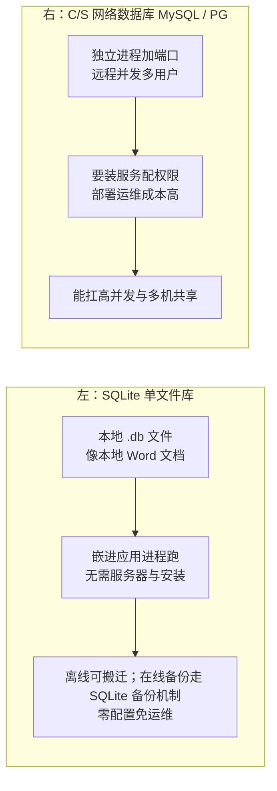
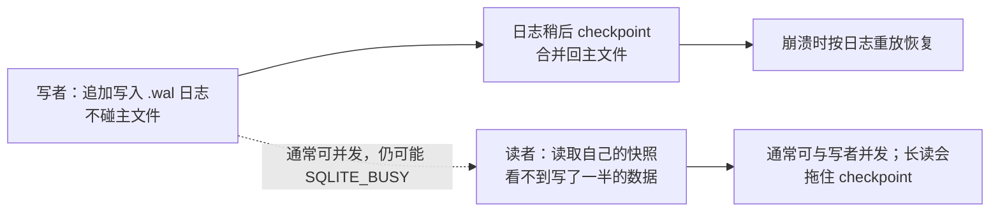

# SQLite：从基础到资深进阶

> 所属：阶段八 数据库专家
> 定位：SQLite 是**嵌入式的关系型数据库**——零配置、主数据库单文件、无需独立服务器。它是移动 App、本地工具、同机嵌入式存储和原型验证的常见候选；同一数据库写入需要串行协调，也没有内置网络服务，因此不适合多机直接共享文件或要求大量并行写事务的服务端场景。

## 快速入门（能跑）

### 本讲关键词与概念速查
| 关键词 | 一句话大白话 | 例子 |
|-|-|-|
| 单文件数据库 | 整个库就是一个文件 | `app.db` |
| 零配置 | 无需服务器/安装 | 直接打开用 |
| 嵌入式 | 嵌进应用进程 | 移动 App 本地库 |
| 事务 | 一组操作原子提交 | `BEGIN/COMMIT` |
| WAL | 写前日志，并发读更好 | `journal_mode=WAL` |
| PRAGMA | 数据库设置指令 | 设置配置 |

### 最简可运行示例
```java
// 用 JDBC 操作 SQLite(带详细注释)
import java.sql.Connection;
import java.sql.DriverManager;
import java.sql.PreparedStatement;
import java.sql.ResultSet;

public class SqliteDemo {
    private Connection conn;   // SQLite 连接(单文件即库)

    public SqliteDemo(String dbFile) throws Exception {
        this.conn = DriverManager.getConnection("jdbc:sqlite:" + dbFile);   // 连接即打开/创建文件
    }

    // 建表
    public void init() throws Exception {
        conn.createStatement().execute(                              // 执行 DDL
            "CREATE TABLE IF NOT EXISTS note (id INTEGER PRIMARY KEY, content TEXT, ts INTEGER)");
    }

    // 插入(用 PreparedStatement 防注入)
    public void add(String content) throws Exception {
        try (PreparedStatement ps = conn.prepareStatement(          // 预编译, 防 SQL 注入
                "INSERT INTO note (content, ts) VALUES (?, ?)")) {
            ps.setString(1, content);                               // 第1个 ? 填 content
            ps.setLong(2, System.currentTimeMillis());              // 第2个 ? 填时间戳
            ps.executeUpdate();                                     // 执行更新(插入/改/删)
        }
    }

    // 查询
    public String query(int id) throws Exception {
        try (PreparedStatement ps = conn.prepareStatement(
                "SELECT content FROM note WHERE id = ?")) {
            ps.setInt(1, id);
            try (ResultSet rs = ps.executeQuery()) {                 // 执行查询
                if (rs.next()) return rs.getString("content");       // 取列 content
            }
        }
        return null;                                                 // 无结果返回 null
    }
}
```

> **运行前提**：该类依赖 Xerial SQLite JDBC 驱动（例如 Maven 坐标 `org.xerial:sqlite-jdbc`），调用方须创建实例后先执行 `init()` 再读写，并在应用退出时关闭 `Connection`。示例省略了连接池、异常分层、建表迁移和 `foreign_keys` 配置；它用于说明 JDBC 形态，不等于生产初始化代码。

> **代码备注（逐行解释）**：
> - `jdbc:sqlite:` + 文件名：连接即「打开或创建」这个 `.db` 文件——**零配置、单文件**。
> - `createStatement().execute(...)`：执行 DDL（建表）。
> - `PreparedStatement` + `?` 占位：**防 SQL 注入**（用 `setString/setLong` 填值，而不是拼接字符串）。
> - `executeUpdate()`：插入/更新/删除；`executeQuery()`：查询返回 `ResultSet`。
> - `rs.next()` + `rs.getString("content")`：游标式读取，`next()` 移到下一行，`getString(列名)` 取值。
> - `try-with-resources`：自动关闭资源（PreparedStatement/ResultSet），避免泄漏。

## 核心概念

### 1. 为什么用 SQLite
| 优势 | 说明 |
|-|-|
| 零配置 | 无服务器、无端口、无权限管理 |
| 单文件 | 主数据库以 `.db` 文件保存；在线备份需使用 SQLite 备份机制 |
| 嵌入式 | 嵌进应用进程，访问极快（无网络开销） |
| 跨平台 | 几乎所有平台支持 |

> 💡 **生活版类比（本地 Word 文档 vs 共享文档服务器）**：SQLite 像**本地 Word 文档**——装了办公软件就能打开，双击编辑、保存即完成，发给同事就是拷贝文件；MySQL/PG 则像**公司共享文档服务器**——要先连内网、登录账号才能改，还要专人运维。「没有服务器也想用数据库」，用文档文件式的 SQLite 就够了。
> **换回 SQLite**：前端 `localStorage`/`IndexedDB` 的心智可直接迁移——`localStorage` 是浏览器里的「单机单值库」，SQLite 是它背后的**完整关系型数据库**；两者的共同决策点都是「**不需要服务器**」。



### 2. 事务（SQLite 的强项）
```java
void batchInsert(List<String> contents) throws Exception {
    conn.setAutoCommit(false);              // 关闭自动提交, 开启事务
    try {
        for (String c : contents) add(c);   // 批量插入
        conn.commit();                      // 全部成功才提交
    } catch (Exception e) {
        conn.rollback();                    // 任一失败, 全部回滚
        throw e;
    } finally {
        conn.setAutoCommit(true);           // 恢复自动提交
    }
}
```
> **该怎么做**：批量写入用事务包裹——否则每条都单独提交，巨慢。为什么慢？每次提交都要把数据**落盘（fsync）**才算数，单条提交 = 每条写都等一次磁盘；包进一个事务，只在结束时落盘一次，性能差几个量级。
> **不该怎么做**：不关自动提交循环插入——每次提交一个事务，性能差几个量级。

> 💡 **生活版类比（只有一支签字笔的签到处）**：SQLite 同一数据库同一时刻只有一个写事务，像签到台只有一支笔；写者持有关键锁阶段时，其他写者须等待，等待策略不合适就可能报 `database is locked`。
> **换回事务与锁**：SQLite 使用文件级锁状态协调访问，但锁的细节会随 rollback journal 与 WAL 模式变化；不变的边界是写者之间不能并行提交。不要把「一把锁」误解为所有读操作始终被完全阻塞。


## 进阶

### 1. WAL 模式（并发读优化）
```java
conn.createStatement().execute("PRAGMA journal_mode=WAL");   // 启用 WAL(写前日志)
```
> **该怎么做**：读多写少且所有进程位于同一主机时，评估后启用 WAL。它通常允许读者与写者并发，但仍只有一个写者，且个别场景仍可能返回 `SQLITE_BUSY`。[官方 WAL 文档](https://www.sqlite.org/wal.html)
> **不该怎么做**：把 WAL 当成多写者并行方案，或将其部署到网络文件系统；WAL 依赖同机进程共享内存，不能用于网络文件系统。
> **为什么 WAL 通常能降低读写阻塞**（分三步看）：
> 1. **写者追加 WAL**：已提交的修改先追加到 `.wal`；主数据库文件稍后由 checkpoint 回填。
> 2. **读者读取自己的快照**：读者根据开始时的 end mark 读取主库和需要的 WAL 页面，不会看到半个事务。
> 3. **并发的边界**：读者与写者通常可同时运行，但每次只有一个写者；长期读者还会阻止 checkpoint 越过其快照，从而让 WAL 文件增长。

> 💡 **生活版类比（记账先生）**：写操作先记在**小便签本**上，顾客看的还是**大账本**，互不耽误；打烊后（checkpoint，把日志合并回主文件）再统一誊进大账本，誊错了就按便签重誊（崩溃时按日志重放恢复）。
> **换回 WAL**：便签本 = `.wal` 日志文件，大账本 = 主库 `.db` 文件，誊写 = checkpoint，按便签重誊 = 日志重放。注意 WAL 是**「一写多读」**——多个读者可并行，写者之间依然互斥（同一时刻只有一个写事务能提交）。



### 2. 索引与优化
```sql
CREATE INDEX idx_note_ts ON note (ts);   -- 按时间查询优化
-- SQLite 优化建议: WAL + 适当索引 + 大批量循环用事务
```
> **该怎么做**：按查询建索引；关联/排序字段放索引。
> **不该怎么做**：全表扫描——数据多了就慢。

### 3. 备份与迁移（在线库使用备份机制）
```bash
# ① 用 SQLite 在线备份（推荐，得到开始时的一致性快照）
sqlite3 app.db ".backup app.db.bak"
# ② 离线迁移：停掉所有访问、关闭数据库并完成 checkpoint 后，再复制数据库文件
# ③ 若使用 WAL，不要只复制 .db；在线备份仍优先用 .backup / Backup API
```
> **该怎么做**：在线库使用 `.backup`、Backup API 或 `VACUUM INTO`，它们能得到一致性快照；离线迁移则先确保全部连接已停止并处理 WAL/checkpoint，再复制相关文件。[官方 Backup API](https://www.sqlite.org/backup.html)
> **不该怎么做**：对活跃数据库直接 `cp app.db`。如果确实采用文件复制，必须由 SQLite 获取适当锁或先完全停库；WAL 模式还涉及 `-wal` 与 `-shm` 辅助文件，不能只凭「没有活动写事务」判断安全。

### 4. 常用 PRAGMA（优化设置）

> ⏸️ **短期可以不学**：`synchronous`、`cache_size` 这类细粒度调参属于嵌入式数据库的调优细节，开发期默认值完全够用，背了不用很快忘。**何时回来学**：产品真遇到读写性能瓶颈、需要压榨 SQLite 时按官方文档逐个调。**面试最低要求**：能说出 WAL、`synchronous`、`busy_timeout` 三个 PRAGMA 各自解决什么问题。

```sql
PRAGMA journal_mode=WAL;            -- WAL 模式(并发读)
PRAGMA synchronous=NORMAL;          -- 性能折中(数据安全=FULL)
PRAGMA foreign_keys=ON;             -- 在每个新连接、事务外显式开启外键约束
PRAGMA busy_timeout=5000;           -- 锁等待 5s, 避免"database is locked"
PRAGMA cache_size=-20000;           -- 缓存 20MB(负数=KB)
```
> **该怎么做**：先按故障模型和压测选择 journal 与 `synchronous`；`WAL + synchronous=NORMAL + busy_timeout` 是常见折中，不是所有业务的固定生产值。若依赖外键，连接创建后、事务开始前为**每个连接**显式设置 `foreign_keys=ON`，不要依赖编译时默认值。[官方 PRAGMA 文档](https://www.sqlite.org/pragma.html#pragma_foreign_keys)
> **不该怎么做**：`synchronous=OFF`（性能极快但有崩溃丢数据风险）；不开 `busy_timeout`（并发写频繁报 locked）。

### 5. 两种典型用法
- **嵌入式 / 移动 App**：本地离线缓存、设置、聊天记录——单文件随 App 一起。
- **本地工具 / 单机**：桌面工具、开发调试、数据导出导入——免部署。
- **原型验证**：SQLite 能快速验证本地业务模型；若未来明确需要多机访问、多写者或服务端权限治理，起步时就应评估 MySQL / PostgreSQL，避免把 SQL 方言、类型和并发模型的迁移成本留到后期。是否迁移应由访问拓扑与压测决定，不只看数据量。

## 场景与红线（怎么做 / 不该怎么做）

| 场景 | ✅ 该怎么做 | ❌ 不该怎么做 |
|-|-|-|
| 移动 App 本地存储 | SQLite（单文件/免运维） | 每次联网查 |
| 桌面/本地工具 | SQLite | 装一套 MySQL |
| 开发原型/调试 | SQLite 快速起 | 一上来就装 MySQL |
| 高并发 Web 后端 | MySQL/PostgreSQL | SQLite（单机无网络） |
| 多机共享读写 | MySQL/PG | SQLite（无内置网络服务；多进程写入会串行争用，网络文件系统还有额外风险） |

## 红线小结（必背）

1. **SQLite 是常见的单机 / 嵌入式方案**：零配置、主库单文件、无独立服务，常用于移动端和本地工具；仍需备份、迁移和并发治理。
2. **写并发受单写者限制**：SQLite 没有内置网络服务器；同一数据库同一时刻只有一个写者，短事务和队列能缓解等待，但高写并发、多机共享通常应选客户端/服务端数据库。
3. **批量写入要开事务**：否则单条提交性能差。
4. **按场景启用 WAL 模式**：它改善读写并发，但仍是单写者，且要求同机访问；配 `busy_timeout` 只能缓解等待。
5. **SQLite 没有内置主从/副本**：单机定位；活库用 `.backup` 等备份机制，离线后才按文件迁移。
6. **什么时候用 SQLite**：单机、免部署、嵌入式、原型——一句话「不需要服务器的时候」。
7. **别用它扛 Web 并发**：那是 MySQL/PG 的活。

## 进阶自测

- [ ] 能说清 SQLite 的四点优势（零配置/单文件/嵌入式/跨平台）
- [ ] 能用 JDBC + PreparedStatement 完成增删查（防注入）
- [ ] 能说清为什么要用事务包裹批量写入
- [ ] 能说清 WAL 模式解决了什么（并发读写）
- [ ] 能列出常用 PRAGMA（WAL/synchronous/busy_timeout）及作用
- [ ] 能说清 SQLite 为什么没有内置主从，以及如何备份（.backup）与离线迁移（停库后按文件复制）
- [ ] 能判断「什么时候用 SQLite、什么时候用 MySQL」（核心判断力）

> **场景迁移核对**：桌面应用开了 WAL，两个线程持续写入，另一个线程执行长时间报表查询。如何降低 `database is locked` 与 WAL 膨胀风险？
>
> **核对要点**：写事务保持短小、将写请求串行化或设合理 `busy_timeout`；长读分页或缩短快照时间，监控 checkpoint/WAL 大小；不要误以为 WAL 允许多写者并行，也不要把数据库放在网络文件系统。

## 常见面试题

### Q1：SQLite 和 MySQL 有什么区别？什么场景选 SQLite？

**答**：**标准结论**：
- SQLite：嵌入式关系型数据库——零配置、以数据库文件保存、无独立服务器，嵌进应用进程跑；WAL 模式下还会有辅助文件。
- MySQL：C/S 架构的网络数据库——独立进程 + 端口 + 权限管理。
- 适用场景：移动 App 本地存储、桌面工具、单机免运维、原型验证；不适用：高并发 Web 后端、多机共享。

**底层原理**（对比两侧）：
- **SQLite 优势**：没有网络层，读写直接走文件系统，少了进程间通信与网络开销，单机小数据量下性能极高。
- **SQLite 代价**：同一数据库只有一个写者；文件级锁状态与读写关系会随 journal 模式变化，多进程同时写会互斥等待或报 `database is locked`。
- **MySQL 定位**：由服务器进程统一管理连接与缓冲池，能支撑大量并发连接，但部署运维成本高得多。

**工程实践**：
- 选型口诀应改成问题清单：是否同机访问、是否接受单写者、是否需要独立账号权限 / 多机访问、备份恢复怎么做；前两项满足且后两项不要求时，再优先评估 SQLite。
- 原型可用 SQLite 快速验证，但如果目标架构确定是多机服务端，直接使用目标数据库往往更省迁移成本。迁移前要核对 SQL 方言、类型、并发模型与备份恢复，不能把“单文件”理解成零迁移成本。
- 面试加分点：别只说「它是个文件」，要说出**嵌入式（in-process）、单写者模型**这两个本质。

### Q2：为什么 SQLite 不适合高并发写入？

**答**：**标准结论**：核心原因是单写者模型：同一数据库同一时刻只有一个写事务，其余写请求等待或在 busy timeout 到期后失败。**本质 = 写提交不能并行。**

**底层原理**（分三点）：
- **锁实现在文件上**：SQLite 通过文件级锁状态协调访问（rollback journal 有 RESERVED/EXCLUSIVE 等状态，WAL 另有自己的共享内存和锁协议）。它不提供关系型服务端常见的多写者行级并发控制。
- **WAL 也救不了写串行**：WAL 模式最多做到「一写多读」——读可并行，写仍串行。
- **文件锁受操作系统限制**：NFS（网络文件系统）等网络场景上锁不可靠；多连接并发写时，`busy_timeout` 到期没拿到锁就抛 `database is locked`。

**工程实践**：
- **若必须多进程写，手段有限**：写请求串行化（单写进程/队列）、缩短事务、设 `busy_timeout`、开 WAL。
- **本质结论**：这不是「调优能解决」的——写并发是 Web 后端的量级，该换 MySQL/PG。
- 面试关键点：不是「慢」，是「**串行**」——并发写场景是锁竞争与超时问题。

### Q3：WAL 模式解决了什么问题？原理是什么？

**答**：**标准结论**：WAL（Write-Ahead Logging，预写日志）通常改善读写并发：读者与写者通常能同时运行，但仍只有一个写者，特殊锁竞争下仍可能出现 `SQLITE_BUSY`。

**底层原理**（对比两种模式）：
- **rollback journal 模式**：写入前会把原始页面写入回滚日志；读写的锁竞争与事务阶段有关，不能笼统理解为全程独占。
- **WAL 模式**：提交的改动追加到 `.wal`，读者按自己的 end mark 读取一致快照，因而通常可与写者同时运行。
- **日志后处理**：checkpoint 将 WAL 内容回填到主文件；活跃读者会限制 checkpoint 的推进，长期读会导致 WAL 增长。
- **边界**：WAL 下写者之间仍互斥（同一时刻仍只有一个写事务）。

**工程实践**：
- 读多写少、所有访问进程同机的场景可评估 `PRAGMA journal_mode=WAL`。
- `synchronous=NORMAL` 是吞吐与断电恢复保证之间的取舍；配合 `busy_timeout` 缓解短暂锁竞争，但不能增加写并发。
- 面试技巧：画一下「写者追加日志、读者读主文件」的画面，比背结论有说服力。

### Q4：SQLite 怎么备份？为什么不能直接 cp 正在写的库文件？

**答**：**标准结论**：
- 推荐在线备份：`sqlite3 app.db ".backup app.db.bak"`。
- 离线库在停止全部连接并完成必要 checkpoint 后可按文件迁移；活跃库优先使用 `.backup`/Backup API。
- WAL 模式不应只复制 `.db` 文件，因为还可能需要 `-wal` 与 `-shm` 辅助文件。

**底层原理**（对比两种拷贝）：
- **直接 cp 的问题**：无锁地复制活库可能拿到不一致视图；在 WAL 模式下只复制主库文件还会遗漏已提交到 WAL 的内容。SQLite 官方的文件复制方案要求先由 SQLite 获取共享锁。
- **`.backup` 好在哪**：由 SQLite 自己执行在线备份协议——逐页拷贝 + **事务快照**保证拷贝期间数据库视图一致，WAL 模式下还正确处理日志合并。

**工程实践**：
- 生产备份用 `.backup`（或编程接口的 online backup API）。
- 拷完后最好开库跑一次 `PRAGMA integrity_check` 验证。
- 面试要点：备份要的是「**一致性视图**」。文件复制不是天然不行，但需要 SQLite 协调锁或停库；在线场景优先使用数据库提供的备份接口。

### Q5：SQLite 报 "database is locked" 是怎么回事？怎么解决？

**答**：**标准结论**：
- **触发条件**：SQLite 是单写者模型——多个连接同时写，或读事务持有时间过长拿不到写锁，就报 `database is locked`。
- **解决三板斧**：设 `busy_timeout`、缩短事务/避免长事务、写操作串行化。

**底层原理**（分三点）：
- **锁在文件上，且默认不等待**：SQLite 的锁是数据库文件上的锁，默认 busy timeout 为 0——拿不到锁**立刻报错**，不会等待。
- **常见触发**：① 两个连接同时写（WAL 下写者仍互斥）；② 一个连接开了事务又不提交，挡住另一个连接的写；③ 长读事务拖住 checkpoint。
- **WAL 的边界**：WAL 能大幅缓解读写互锁，但**写-写竞争依旧存在**。

**工程实践**：
- 设 `PRAGMA busy_timeout=5000` 让写等待而不是立刻报错。
- 事务只包必要语句、尽快提交；写集中到单线程/单连接（如写入队列）。
- 排查是否误用长连接 + 长事务。
- 面试要点：说出「锁等待 + 超时」机制，并区分 `database is locked`（写锁竞争）与 WAL 下读锁相关报错的场景。
