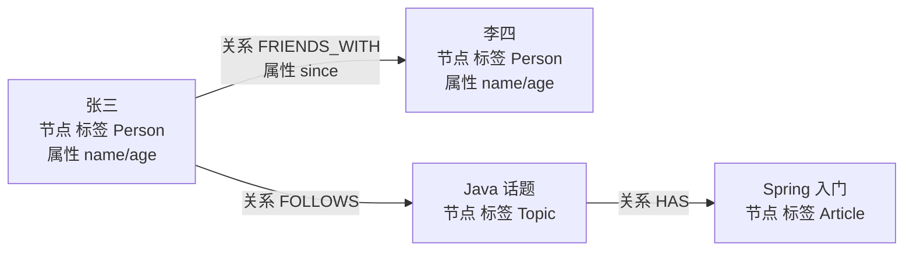
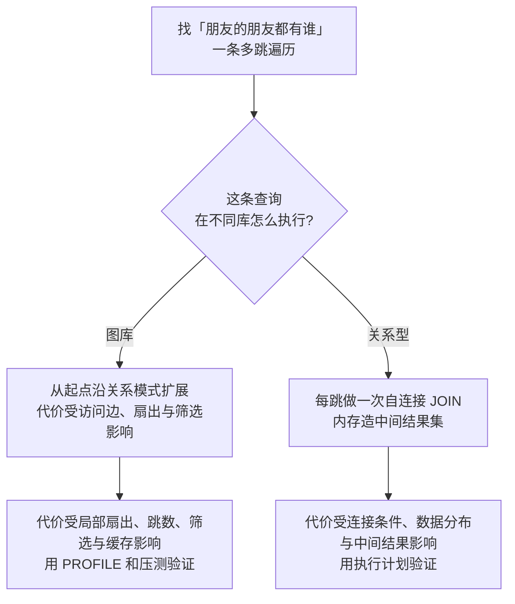
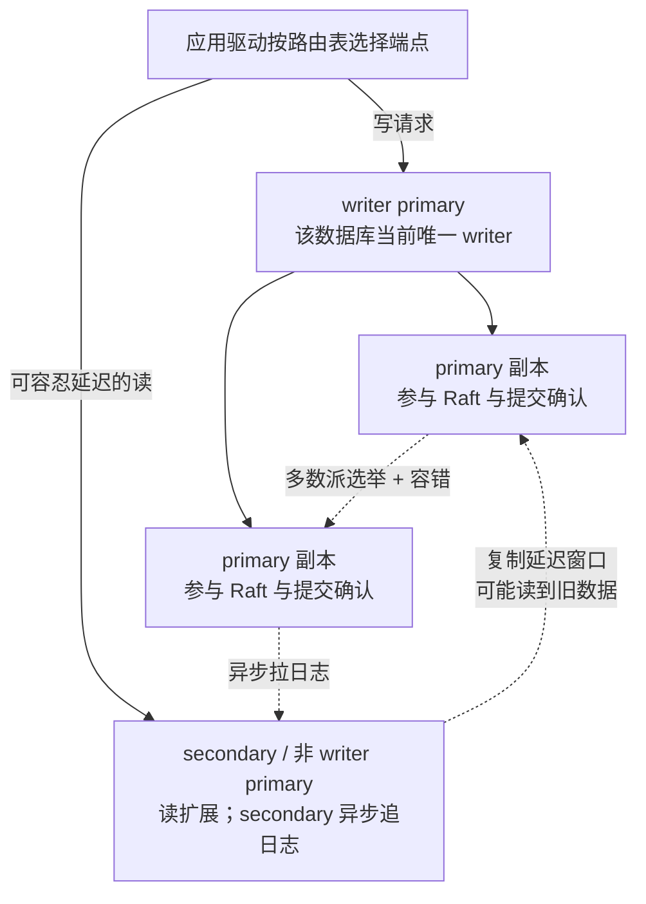

# Neo4j：从基础到资深进阶

> 所属：阶段八 数据库专家
> 定位：Neo4j 是**图数据库**——以「节点 + 关系 + 属性」建模，擅长**多跳关系查询**。适合「社交关系、推荐、反欺诈、知识图谱」场景。**记住：它是「关系」的专用引擎——只有当你需要多跳遍历（如「朋友的朋友的朋友」）时才值得用，简单一对多还是用关系型。**

## 快速入门

### 本讲关键词与概念速查
| 关键词 | 一句话大白话 | 例子 |
|-|-|-|
| 节点（Node） | 一个实体 | 一个用户/一个商品 |
| 关系（Relationship） | 两个节点的连接 | FRIENDS_WITH |
| 属性（Property） | 节点/关系的字段 | name/age |
| 标签（Label） | 节点分类 | `:Person` |
| Cypher | 图查询语言 | `MATCH (n) RETURN n` |
| 路径（Path） | 节点间的连缀 | 多跳关系 |

### 最简可运行示例
```cypher
// 创建节点 + 关系(带详细注释)
CREATE (a:Person {name: '张三', age: 25})     // 创建 Person 节点, 带属性
CREATE (b:Person {name: '李四', age: 24})
CREATE (a)-[:FRIENDS_WITH]->(b)               // 张三 认识 李四(关系)

// 查询: 找"认识李四"的人
MATCH (p:Person {name: '李四'})<-[:FRIENDS_WITH]-(p2)   // 顺着关系反查
RETURN p2.name;
```

> **代码备注（逐行解释）**：
> - `CREATE (a:Person {...})`：创建节点——`a` 是变量名，`:Person` 是标签（类别），`{...}` 是属性。
> - `CREATE (a)-[:FRIENDS_WITH]->(b)`：建关系——箭头方向表示「a → b」是 `FRIENDS_WITH`。
> - `MATCH (p:Person {name:'李四'})`：先匹配到「李四」这个节点。
> - `<-[:FRIENDS_WITH]-(p2)`：顺着「认识」关系反查——找到"指向李四"的节点 `p2`（即认识他/她的人）。箭头方向决定了遍历方向。
> - `RETURN p2.name`：返回结果列。
> - 对比 SQL：这在 SQL 里要自关联表多表 JOIN + 递归——图数据库用 `MATCH` 一行表达多跳关系。

### Java 集成（Spring Data Neo4j，结构示意）
```java
// Spring Data Neo4j: 用注解把实体映射成节点, 像操作普通对象一样查图
import org.springframework.data.neo4j.core.schema.Id;
import org.springframework.data.neo4j.core.schema.Node;
import org.springframework.data.neo4j.repository.Neo4jRepository;

@Node("Person")                            // 映射到 :Person 节点
public class Person {
    @Id private Long id;                    // @Id: 节点主键
    private String name;
    // private String phone;  ... getter/setter 省略, 属性即节点属性字段
}

public interface PersonRepository extends Neo4jRepository<Person, Long> {
    // 方法名即查询: 找 name=xx 的 Person(Spring Data 按命名规则自动生成 Cypher)
    Person findByName(String name);
}
```
> **代码备注（逐行解释）**：
> - `@Node("Person")`：把 Java 类映射成 Cypher 的 `:Person` 节点。
> - `@Id`：节点主键；其余字段自动成为节点属性。
> - `Neo4jRepository<Person, Long>`：Spring Data 的 Neo4j 仓库，`findByName(name)` 方法名即查询（自动生成 `MATCH (p:Person) WHERE p.name=$name RETURN p`）。
> - 这段只展示实体映射和派生查询的形态：运行它还需要 `spring-boot-starter-data-neo4j`、Neo4j 驱动连接配置，以及 `Person` 的构造器/访问器；`@Id` 代表应用自己赋值的标识，若由数据库生成还需按所选策略补充生成配置。
> - **为什么这样好**：Java 后端用 Spring Data Neo4j，可像操作 JPA 一样操作图；复杂路径查询仍应根据查询计划选择派生查询或显式 Cypher。

## 核心概念

### 1. 图模型（Graph Model）vs 关系模型（Relational Model）
| 维度 | Neo4j | MySQL |
|-|-|-|
| 建模 | 节点/关系/属性 | 表外键 |
| 多跳关系 | `MATCH (a)-[*2..3]->(b)` 高效 | 递归 JOIN 又慢又难写 |
| 关系查询 | 顺着边遍历，天然快 | 深度关联 JOIN 爆炸 |
| 强约束 | 弱 | 强 schema/事务 |
> **该怎么做**：多跳关系（社交、推荐、路径）用图数据库。
> **不该怎么做**：简单一对多（如「一个用户多条订单」）用图——那是表/聚合的活，用关系型更合适。



> 怎么看：节点是「实体」、关系是「箭头」、属性是「箭头/实体上的字段」——一条图就是一张有方向的网。

### 2. 节点与关系模型
```cypher
// 更完整的建模: 用户关注话题, 话题含文章
CREATE (u:User {id: 1, name: '张三'})
CREATE (t:Topic {name: 'Java'})
CREATE (a:Article {title: 'Spring 入门'})
CREATE (u)-[:FOLLOWS]->(t)          // 张三 关注 Java 话题
CREATE (t)-[:HAS]->(a)               // Java 话题 包含文章
```
> **该怎么做**：实体建节点（含业务实体），语义连接建关系，都可加属性。
> **不该怎么做**：把关系当节点/属性硬塞——图模型就失去了价值（关系应该是边）。

## 进阶

### 3. 多跳查询（图数据库的灵魂）
```cypher
// 找"朋友的朋友"（2 跳）
MATCH (me:Person {id: 1})-[:FRIENDS_WITH*2..2]-(friend)
RETURN friend.name;

// 找"推荐路径"（1-3 跳）
MATCH (me:Person {id: 1})-[:FRIENDS_WITH*1..3]-(candidate)-[:LIKES]->(product)
WHERE NOT EXISTS((me)-[:LIKES]->(product))
RETURN product, count(*) as score ORDER BY score DESC;
```
> **该怎么做**：多跳（`*2..3`）、路径、推荐用 `MATCH` 加关系模式一行表达——这是图数据库的核心价值。
> **不该怎么做**：用递归 JOIN 硬写多跳——图数据库就是为这个优化的。
> **为什么图库常适合多跳**：关系型将关系表示为表和连接条件，深度和扇出增长时，中间结果与连接代价可能迅速上升；Neo4j 将关系作为存储和查询模型的一部分，遍历通常从已定位的起点沿相关关系扩展。实际代价仍取决于起点选择性、关系扇出、跳数、筛选、索引、缓存和硬件；必须用 `PROFILE` 与真实数据验证，不能由全图节点数或「几跳」单独推断延迟。



> 🏠 **生活版 → 换成图数据库**：你要找「张三的朋友里谁也认识李四」——从张三开始翻通讯录，再翻这些人的通讯录；每多一层，候选人也可能成倍增加。**换成 Neo4j**：从已定位节点沿关系模式遍历，能直接表达这类查询；但高扇出和不设跳数上限仍会扩大搜索空间，所以必须限制路径、筛选和结果数。这里的类比只说明查询形态，不承诺任何固定性能。

### 4. 索引与约束（Neo4j 5.x 语法）
```cypher
// 给 name 建唯一约束(类似主键) —— 注意 5.x 语法: FOR ... REQUIRE (旧 ASSERT 语法已移除)
CREATE CONSTRAINT person_name_unique IF NOT EXISTS FOR (p:Person) REQUIRE p.name IS UNIQUE;

// 建普通索引加速查询 —— 5.x 起统一使用 FOR (n:Person) ON (n.name)(旧 ON :Person(name) 已移除)
CREATE INDEX person_name_index IF NOT EXISTS FOR (n:Person) ON (n.name);

// fulltext 全文索引(图搜索)
CREATE FULLTEXT INDEX person_names IF NOT EXISTS FOR (n:Person) ON EACH [n.name];
```
> **该怎么做**：高频查询/唯一字段建约束或索引。
> **不该怎么做**：无索引全图扫描——数据多了就慢。

### 5. 图算法（GDS 库）

> ⏸️ **短期可以不学**：GDS 算法库（PageRank/Louvain/最短路径等）是图分析工程师的活，日常 CRUD 开发用不到全量算法，逐个学性价比低。**何时回来学**：业务真需要社区发现、重要度排序、路径分析（反欺诈团伙识别、推荐）时，按需学对应算法。**面试最低要求**：知道 GDS 是什么、能说出"先建图投影再跑算法"的流程、会跑一个 PageRank 即可。

> **注意**：运行 GDS 算法**必须先创建图投影**（`gds.graph.project`），否则 `'graph'` 不存在会报错。

> 以下是 GDS 结构示意，不能只把它粘进空白 Neo4j 实例运行：需要安装与 Neo4j 版本兼容的 GDS 库、已有 `Person` / `FRIENDS_WITH` 数据，并在重复执行前处理同名的内存图投影。GDS 当前更推荐使用 Cypher projection；算法参数与可用版本以 [GDS 官方文档](https://neo4j.com/docs/graph-data-science/current/getting-started/basic-workflow/) 为准。

```cypher
// ① 先做图投影: 把 Person 节点 + FRIENDS_WITH 关系投影成一个命名图 'graph'
CALL gds.graph.project('graph', 'Person', 'FRIENDS_WITH');

// ② PageRank 找重要节点(社区发现/推荐)
CALL gds.pageRank.stream('graph') YIELD nodeId, score
RETURN nodeId, score ORDER BY score DESC;

// ③ 最短路径: 找两人之间的最短关系链（sourceNode/targetNodes 可传匹配到的节点）
MATCH (a:Person {name:'张三'}), (b:Person {name:'李四'})
CALL gds.shortestPath.dijkstra.stream('graph',
    { sourceNode: a, targetNodes: [b], relationshipTypes: ['FRIENDS_WITH'] })
YIELD path RETURN path;

// ④ 连通分量: 找独立的社群/团伙
CALL gds.louvain.stream('graph') YIELD nodeId, communityId RETURN nodeId, communityId;
```
> **该怎么做**：社区发现（Louvain）、重要度（PageRank）、最短路径用 GDS 算法库——这些是图数据库独有的能力。
> **不该怎么做**：不先创建图投影就直接跑算法，或不核对 GDS 当前版本的参数类型与算法语义。

### 6. 高可用：集群中的 Primary / Secondary（Neo4j 5 当前术语）

> ⏸️ **短期可以不学**：集群拓扑命令、跨地域部署和 Raft 参数属于部署运维细节。**本讲仍要掌握**：primary / secondary 是数据库副本角色；写由当前 writer primary 处理；secondary 异步复制并用于读扩展；多 primary 用多数派换取写可用性。**何时回来学**：负责 Neo4j 生产部署、扩容或读写路由时。

```cypher
// 架构示意，不是可直接执行的 Cypher 配置：
// 一个数据库可以有多个 primary 副本，其中当前只会选出一个 writer；
// secondary 从 primary 异步接收事务日志，通常承接可容忍延迟的读。
// 实际创建/调整拓扑使用管理员命令和服务器配置，按 Neo4j 当前 Operations Manual 核对。
```
> **该怎么做**：按每个数据库的可用性目标设计 primary 数量；要容忍 1 个 primary 故障仍可写，通常至少需要 3 个 primary（`M = 2F + 1`）。让驱动依据路由表把写送到当前 writer，把可容忍延迟的读分给 secondary 或非 writer primary。
> **不该怎么做**：把旧的 `core / read-replica` 术语当成 Neo4j 5 的唯一模型，或把 secondary 当作最新读的默认保证。单 primary 也可运行，但不具备写故障容忍。
> **机制**：每个数据库的 primary 组成独立 Raft 组，当前会选出一个 writer；writer 对 primary 推送事务，达到所需确认后提交。secondary 通过事务日志异步追赶，因此新提交不一定立刻可见。Raft 同时处理选主、日志顺序与安全性；某次读是否具有读己之写或线性一致语义，还取决于驱动路由和读协议。



> 🏠 **生活版 → 换成 Neo4j 集群**：同一份制度只能由当前负责人签发，几位负责人共同留档；普通查阅员拿到的是稍后同步的副本。**换成 Neo4j**：一个数据库当前只有一个 writer primary 来排定写入顺序，多 primary 提供容错，secondary 承接异步读扩展。它不让同一数据库的多台机器并行成为 writer；若要提升整体写能力，还需结合数据拆分、模型与业务架构评估。

## 场景与红线（怎么做 / 不该怎么做）

| 场景 | ✅ 该怎么做 | ❌ 不该怎么做 |
|-|-|-|
| 社交关系/好友推荐 | Neo4j（多跳遍历） | 自关联表 + 递归 JOIN |
| 反欺诈（资金链路） | Neo4j 查环/路径 | 关系型难查深链 |
| 知识图谱 | Neo4j 节点边 | 表 + 连接表 |
| 权限/依赖关系 | Neo4j 路径推导 | 递归 |
| 简单一对多/聚合 | MySQL/PG | Neo4j（过度） |
| 纯聚合统计 | PG/ES | Neo4j |

## 红线小结（必背）

1. **图数据库是「关系」的专用引擎**：多跳遍历是它的主场。
2. **什么时候用 Neo4j**：明确需要「多跳关系、路径、图算法」——社交/推荐/反欺诈/知识图谱。
3. **别过度用**：简单一对多、纯聚合统计用关系型/PG/ES 更合适（图数据库维护成本高）。
4. **建模用节点 + 关系**：关系是边，不是节点/属性。
5. **集群按目标选拓扑**：3 个 primary 可容忍 1 个 primary 故障仍写；secondary 用于异步读扩展，读写路由由驱动和一致性要求决定。
6. **核心判断**：先问「我的查询是多跳关系吗？」是→Neo4j；不是→关系型。

## 进阶自测

- [ ] 能说清图模型 vs 关系模型的差异（节点/关系/多跳）
- [ ] 能用 Cypher 创建节点 + 关系 + 属性
- [ ] 能写多跳查询（`*2..3`）表达「朋友的朋友」
- [ ] 能用 GDS 算法（PageRank/最短路径/Louvain）做分析
- [ ] 能说清 primary / secondary、writer、Raft 与读写路由各自负责什么
- [ ] 能说出图数据库的核心价值（多跳遍历）与适用场景（社交/推荐/反欺诈）
- [ ] 场景：风控查询必须看到刚写入的黑名单关系，普通推荐允许数秒旧数据。能判断前者不能默认路由到 secondary，后者可由 secondary 分担，并说明还需用驱动路由和压测验证。

> **核对要点**：关键读取应使用写访问模式路由到当前 writer，或正确传递 bookmark，利用驱动会话的因果一致性保证读到已确认的写入；允许旧数据的推荐查询可由 secondary 分担。最终还要结合版本、集群拓扑和真实负载验证路由与延迟。

## 常见面试题

### Q1：图数据库和关系型数据库有什么区别？什么场景选图数据库？

**答**：**标准结论**：图库 vs 关系型的本质差异——
- **图库**：节点（Node）+ 关系（Relationship）+ 属性（Property）建模，关系是「一等公民」被持久化存储，多跳查询天然快。
- **关系型**：表 + 外键建模，关系靠 JOIN 动态计算，深度关联又慢又难写。

适合多跳关系查询的场景——社交网络、反欺诈资金链路、知识图谱、推荐。**例外**：简单一对多、纯聚合统计用关系型更合适。

**底层原理**：关联深度和关系扇出不确定时，关系型的递归 CTE 或多次 JOIN 可能产生较大的中间结果；图模型可以把路径模式直接交给遍历执行。遍历开销受起点、过滤、跳数、关系扇出、索引和缓存共同影响，不能用「超过几跳一定慢」或「与全库规模无关」替代执行计划和压测。

**工程实践**：
- 真实系统常见**混合架构**——主数据在关系型，关系密集的查询面（好友链、团伙识别）放图库并保持同步；
- 建模先问「查询是不是多跳遍历」，是才值得引入；别把简单一对多硬塞图库。
- 面试金句：「关系型在数据规模上横向关联，图库在关系深度上纵向穿透。」

### Q2：为什么多跳查询在图数据库里快，在关系型里慢？

**答**：**标准结论**：图库的多跳遍历是「沿物理指针走」，复杂度只和局部子图相关；关系型多跳靠 JOIN/递归，每跳一层都要扫描、连接、造中间结果，成本随深度**爆炸**。

**底层原理**：图数据库把节点按 ID 聚集存储，每条边存了源节点、目标节点的物理地址，遍历 = 指针跟随，复杂度 O(经过的边数)；关系型要表达「第 N 跳」得做 N 次自连接，中间结果集可能膨胀，且逐跳连接无法靠索引直达。递归 CTE 虽能写，但语义是「反复执行子查询」，本质还是逐跳扫描。

**工程实践**：
- 关系型做 2 跳以内还能忍（用户-角色-权限），3 跳以上（关注链、资金链、推荐）就该考虑图库；
- 图库查询也要**限制跳数上限**（`*1..3`）与结果数（LIMIT），防止全图遍历爆炸。
- 面试答出「指针遍历 vs 连接计算」的对比，就抓住了本质。

### Q3：Cypher 和 SQL 有什么区别？多跳查询各怎么写？

**答**：**标准结论**：Cypher 是图查询语言，用「模式（Pattern）」描述图结构，核心是 `MATCH ... RETURN`；SQL 用 `SELECT ... FROM ... WHERE` 描述表间连接。Cypher 中多跳用关系模式加跳数范围，如 `MATCH (me)-[:FRIENDS_WITH*1..3]->(p) RETURN p`。

**底层原理**：SQL 的建模单位是「行 + 外键」，查询必须先声明表的连接方式；Cypher 的建模单位是「节点 + 关系」，查询直接以**图模式匹配**——把「我想找的结构」写出来，引擎在图里做遍历，方向、跳数、关系类型都在模式里声明。两者都是声明式（描述「要什么」而非「怎么做」），但表达关系的自然度天差地别：递归 CTE 十几行，Cypher 一行。

**工程实践**：
- 写多跳先加**跳数上限**和 WHERE 剪枝（如排除已认识的人）；
- 方向明确的用 `->`/`<-`；需要整条路径时用路径变量（`p = (a)-[*]->(b)`）。
- 面试可以现场把「朋友的朋友」用两种语言各写一遍，直观展示差异。

### Q4：Neo4j 怎么做高可用？为什么写不能横向扩展？

**答**：**标准结论**：Neo4j 当前将数据库副本称为 primary / secondary。多个 primary 可组成多数派以提高该数据库的写可用性；当前只有一个 primary 被选为 writer。secondary 异步复制，通常用于读扩展。要容忍 1 个 primary 故障仍可写，通常使用 3 个 primary；实际拓扑按每个数据库的容错目标确定。

**底层原理**：Raft 为每个数据库的 primary 组维护选主、日志顺序和安全性；writer 对写入排序并等待所需 primary 确认。secondary 异步拉取事务日志，因此可能读到较旧的数据。多 primary 提高容错，并不使同一数据库同时存在多个 writer 来线性增加写吞吐。

**工程实践**：
- 不要把所有数据库都概括为「写单点」：分片、分区、多数据库和不同一致性协议会改变扩展方式；这里仅说明一个 Neo4j 数据库的 writer 语义。
- 生产：使用支持路由的驱动，按读的新鲜度要求选择 writer、非 writer primary 或 secondary，并监控复制延迟。参见 [Neo4j 集群架构](https://neo4j.com/docs/operations-manual/current/clustering/introduction/) 与 [路由说明](https://neo4j.com/docs/operations-manual/current/clustering/setup/routing/)。
- 面试答出「同一数据库当前 writer 排序写入、多 primary 提供容错、secondary 扩展异步读」及其路由取舍即可。
