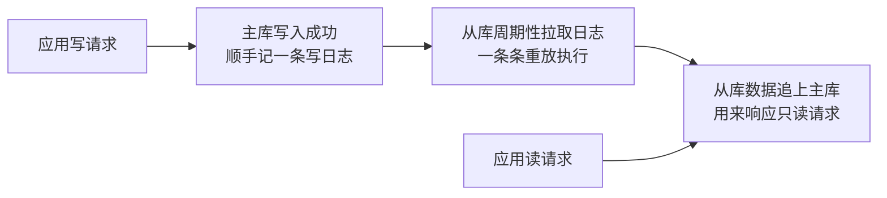
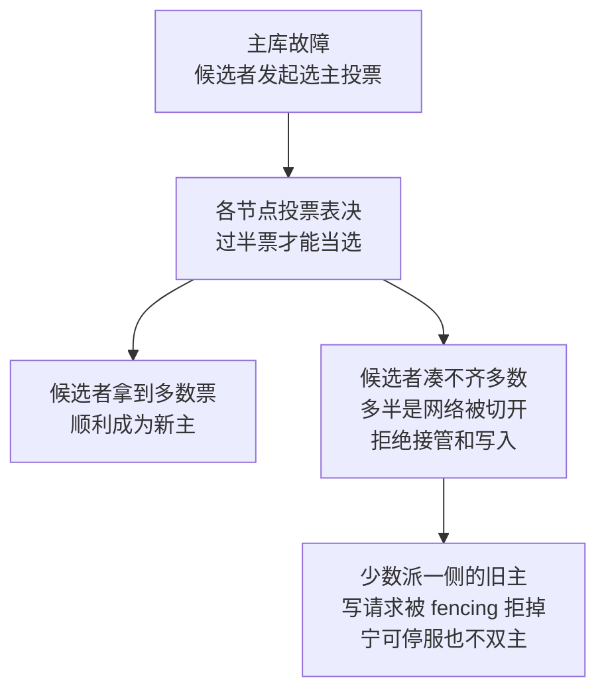

# 数据库主从/副本设计（已拆分到各库）

> 所属：阶段八 数据库专家
> ☝️ **重要说明**：主从/副本/高可用是**每个数据库自己的事**，不是一套通用方案。本文件已**拆分到各数据库自己的教程里**，请直接到对应文件读：
>
> | 数据库 | 去哪里读主从/副本 |
> |-|-|
> | MySQL | [`02-MySQL.md`](02-MySQL.md) → 「主从复制与读写分离」 |
> | PostgreSQL | [`03-PostgreSQL.md`](03-PostgreSQL.md) → 「流复制 / Patroni 主从」 |
> | Redis | [`01-Redis.md`](01-Redis.md) → 「主从 / 哨兵 / Cluster」 |
> | Elasticsearch | [`04-Elasticsearch.md`](04-Elasticsearch.md) → 「分片 / 副本 / ILM」 |
> | MongoDB | [`05-MongoDB.md`](05-MongoDB.md) → 「副本集 / 分片集群」 |
> | Neo4j | [`07-Neo4j.md`](07-Neo4j.md) → 「集群中的 primary / secondary」 |
> | SQLite | [`06-SQLite.md`](06-SQLite.md) → 单机无主从，看「备份 / 迁移」 |

## 阅读目标与前置概念

读完本专题，应能先判断一次读是否允许旧数据，再为它选择主库、同步副本或异步副本；也能把「复制、选主、路由、监控」分开分析，而不把某一数据库的配置当作通用答案。

- **副本**：同一数据的另一份拷贝；是否同步、能否读、是否参与选主都由具体产品决定。
- **多数派（quorum）**：超过半数的投票成员；它常用于选主和提交确认，但「收到多少确认」与「任意读都最新」是两件事。
- **读己之写（read-your-writes）**：一个会话写入后，后续读至少应看到自己的那次写入；这是业务读语义，需要路由、会话或读写协议共同保证。
- **CAP 的 C**：网络分区发生时，系统在一致性与可用性之间的取舍；它不能单凭「用了主从」或某个产品名断定。

## 通用概念速查（各库实现不同，但规律一致）

> ⏸️ **短期可以不学**：各库高可用的完整部署运维细节（Patroni 全套配置、Orchestrator 架构、哨兵调参、副本集选主参数）不是本篇重点。**本篇仍要掌握**：复制确认、读语义、选主和路由是不同问题，且部分数据库或拓扑不提供自动选主或读扩展。**何时回来学**：公司真让你搭建/运维某库的 HA 集群时，再按对应数据库文档逐项学。

| 通用概念 | MySQL | PostgreSQL | Redis | Elasticsearch | MongoDB | Neo4j |
|-|-|-|-|-|-|-|
| 副本/复制形态 | 主从 + GTID | 流复制；Patroni 常用于编排 | 主从 + 哨兵 | 主分片 + 副本分片 | 副本集 | primary + secondary |
| 故障转移 | 取决于 MGR、InnoDB Cluster、Orchestrator 等部署 | Patroni 依赖 DCS 协调 | Sentinel / Cluster 机制 | 集群分片恢复，不等同单主选主 | 副本集自动选主 | primary 多数派与路由 |
| 读扩展与新鲜度 | 可路由到从库，需容忍延迟 | 备库读能力取决于配置 | 副本读需评估一致性 | 副本分片服务搜索读 | `secondaryPreferred` 可读旧数据 | secondary 异步读扩展 |
| 水平扩展 | 分片或分库设计 | Citus 等扩展；分区本身仍可单机 | Cluster 分片 | 分片 | 分片集群 | 需结合多数据库/数据拆分设计 |

> **一句话**：副本可能用于容灾、读扩展或两者兼有；是否自动切换、能否读、读到多新，都要回到具体产品、版本和部署配置。

> **通用原理（面试重点，具体语义仍以产品为准）**：
> - **复制与 CAP**：异步复制常优先降低写延迟与提高可用性，代价是副本可能滞后；但系统在网络分区时究竟选择 C 还是 A，取决于选主、提交确认、读路由和失败处理，不能把所有主从方案直接贴成 AP。
>   - `MongoDB w: "majority"`、MySQL 半同步、Redis `WAIT` 都只描述各自的写确认条件，不能单独推出「后续任意副本读都是强一致」。例如 Redis 官方明确 `WAIT` 不会把 Redis 变成强一致存储；MongoDB 需要结合读关注（read concern）与因果会话等设置决定读语义。
> - **共识（Consensus）≠ 一致性（Consistency）**：这是两个层面的词，别混。
>   - **共识**（Raft / Paxos）对选主、日志顺序和安全性达成一致；具体实现怎样暴露线性一致读，需要看该产品的提交与读协议。
>   - **一致性**是客户端可观察到的读写语义，例如线性一致、因果一致、最终一致；「副本是否恰好同步」只是判断材料之一。
> - **读写分离的读己之写问题**：写完主库立即读异步副本，可能读到旧值。缓解是把关键读路由到能满足语义的端点，或使用产品支持的会话/读关注/等待机制，并监控副本延迟；不要把 `WAIT`、多数派写确认或“写后等 N 秒”视为跨产品通用的强一致方案。

> **三个易踩误区（特别提醒）**：
> - **PG 分区表不是水平扩展**：分区是在**单机内**把大表拆小（按范围/哈希），**不跨节点、不提升写入吞吐**；PG 真正的水平分片要 **Citus** 或分库中间件。
> - **MySQL MHA 已停止维护**：别在文档/方案里再推 MHA，现代用 **MGR / InnoDB Cluster / Orchestrator**。
> - **Neo4j 的 current model**：当前文档采用 primary / secondary；同一数据库当前有一个 writer primary，secondary 异步读扩展。多 primary 改善容错，但不等于该数据库存在多个并行 writer。

> 来源：Neo4j 的 [集群架构与副本角色](https://neo4j.com/docs/operations-manual/current/clustering/introduction/)、Redis 的 [`WAIT` 语义](https://redis.io/docs/latest/commands/wait/)、MongoDB 的 [write concern 与 read concern](https://www.mongodb.com/docs/manual/reference/write-concern/)。

## 常见面试题

### Q1：主从复制的原理是什么？同步复制和异步复制有什么区别？

**答**：

**标准结论**：主从复制的本质是**日志重放**——从库重放主库记下的写日志，复现主库的写入路径。
- 主库把写操作记进**日志**（MySQL binlog、PG WAL、MongoDB oplog），从库拉取日志并重放，实现数据复制。
- 复制同步方式分三档：**异步**——主库写入成功即返回，不等待从库确认；**全同步**——要等全部从库确认；**半同步**——等至少一个从库确认。

**底层原理**：日志是「状态变化的序列」，重放日志等于复现主库的写入路径——这是复制的通用范式。
- 日志复制比传数据文件更高效：增量小、可断点续传。
- 异步的代价是存在**丢数据窗口**：主库已经确认、写入尚未复制到可提升副本时若发生故障切换，这次写入可能丢失；是否丢失还取决于故障和切换策略。
- 同步的代价是**性能**：每次写都要等网络往返，吞吐下降，主库还会被慢从库拖累。

> **类比 · 丢数据窗口**：生活版——前台对客户说「快递已寄出」，其实快递员还没来取件，当晚仓库起火，合同烧没了，客户以为寄到、实际已丢。换回技术——主库写成功就回「成功」，但日志还没同步到从库，此刻主库宕机，这笔写入就永久丢了；「日志从主库传到从库之前」的这段时间，就是丢数据窗口。

**工程实践**：先为业务写清可接受的 RPO、RTO 与读新鲜度，再选择半同步、异步或多数派提交等机制。确认已复制到一台副本会缩小风险窗口，但不等于可以承诺任何故障下绝不丢数据。
- 例如 MySQL 半同步复制仍需结合故障切换、持久化和延迟监控来评估。
- 面试要点：复制的本质是日志重放，异步/同步是「等不等确认」的取舍。

> 主从复制通用链路：写走主库并记日志 → 从库拉日志重放 → 读走从库，这就是「读写分离」的基本盘。

### Q2：主从延迟怎么治理？读写分离后怎么保证读到最新数据？

**答**：

**标准结论**：治理延迟三板斧：**监控、优化、分摊**；需要最新或读己之写语义时，应路由到该产品能满足语义的 writer/读协议，或确认副本已追上后再读。
- 监控：如 MySQL `Seconds_Behind_Master`，掌握从库落后多少。
- 优化：并行复制、合理索引、拆分大事务。
- 分摊：从库只承接可容忍旧数据的请求。

**底层原理**：延迟来自副本接收、持久化与重放能力跟不上写入，也会受大事务、大 DDL、网络和资源争用影响。具体指标与并行复制能力随产品和版本而变，应查所用版本的官方文档。
- 复制延迟导致的典型问题是**读己之写（read-your-writes，写完立刻读自己刚写的数据）**：写完主库立即读从库可能读不到——读请求被路由到了没追上的从库。

**工程实践**：方案分级，容忍度从宽到严：
- ① 业务容忍：从库只服务报表、搜索、feed 流等可旧数据。
- ② 关键路径读主库：如「支付后查余额」。
- ③ 写会话内短时读主：写后 N 秒内该用户读主库。
- ④ 从库延迟超阈值自动摘流量并告警。
- 面试必答「读己之写」四个字，并给出「容忍旧数据 + 关键读主 + 延迟摘流」的三层方案。

### Q3：主库挂了怎么自动选新主？什么是脑裂？怎么避免？

**答**：

**标准结论**：有些部署使用多数派/共识完成自动选主，有些仍需外部协调组件或人工流程；以下是常见组合，不是所有拓扑的默认能力：
- MySQL：MGR / InnoDB Cluster。
- PostgreSQL：Patroni + etcd/Consul/ZooKeeper 等 DCS。
- Redis：Sentinel / Cluster。
- MongoDB：副本集选举。
- Neo4j：primary 集群使用 Raft。
- 多数派常用于选举与提交，但候选资格、投票与旧主隔离的细节由产品实现决定。

**底层原理**：网络分区或旧主未被正确隔离时，可能出现两个端点都被客户端当作可写的风险。多数派、租约、fencing、代理健康检查和旧主隔离都是常见手段，但并非每个数据库都以同一方式实现；部署方案必须按具体产品验证。

> **类比 · fencing token**：生活版——公司门禁每人一张胸牌，老总的胸牌被吊销后，他原来的那张就再也刷不开任何一扇门。换回技术——fencing token 就是一个「不断涨大的版本号」：新主上任后旧主手里的 token 全部作废，它再发写请求都会被节点拒绝，物理上堵死「旧主还在写」的可能。

**工程实践**：若所选系统采用多数派，3 个投票成员通常可容忍 1 个成员故障，5 个可容忍 2 个；节点数之外还要验证跨机架分布、数据副本、旧主隔离和客户端重试。切换的恢复顺序由产品的选主、复制与路由健康检查决定，不能一概而论。

> 选主与防脑裂：多数派投票定新主；网络分区时少数派拒绝服务，配合 fencing 物理封掉旧主的写，双保险。

### Q4：Raft/Paxos 共识和"一致性"是一回事吗？CAP 定理怎么理解？

**答**：

**标准结论**：不是一回事。
- **共识（Consensus）**是协议/算法（Raft、Paxos），解决「多个节点对同一决策（谁是主、日志顺序）达成一致」。
- **一致性（Consistency）**是数据层面「副本间状态是否相同」的性质。
- 一句话：**共识是实现一致性（及选主）的手段，不是一致性本身**。

**底层原理**：
- Raft 把问题拆成选主、日志复制和安全性；在采用它的系统中，多数派和任期帮助约束 leader 与日志顺序。它提供的抽象不等同于应用自动获得线性一致读：实际读路径、提交确认和客户端路由仍由产品实现决定。
- CAP 的准确表述：**只有网络分区（P）发生时**，才需要在一致性（C）与可用性（A）间二选一——没有分区时两者可以兼得。
- 某些系统在特定读写协议下可提供线性一致性（所有并发读写看起来像按一个全局时间点依次发生）；“使用多数派协议”本身不足以推出该结论，也不等于所有副本实时相同。

**工程实践**：被问「MySQL 是 CP 还是 AP」时别贴标签，要分析：
- 纯异步复制通常存在最终一致窗口；是否在分区时拒绝写入或继续服务，要看 MGR、半同步、代理和应用路由的具体配置。
- 准确回答 = 说明「在什么配置下是什么行为」。
- 理解「共识 ≠ 一致性」，还能接住「Raft 选了主但副本仍有延迟」这类追问。

### Q5：如何设计一套数据库高可用 + 读写分离架构？

**答**：

**标准结论**：以 MySQL 为例，一套高可用 + 读写分离架构 = 四件套拼装：
- **一主多从**（1 主 2 从）读写分离。
- **自动选主**：例如 MySQL 可选 MGR / InnoDB Cluster；PostgreSQL 需对应的协调方案，不能直接套用 Patroni 名称到 MySQL。
- **访问层**：VIP/代理故障切换。
- **从库延迟监控**。
- 数据层面：核心写走主，读按「可容忍旧数据程度」分流到从库。

**底层原理**：高可用的目标是「主故障用户无感」，拆开是四件事：
- 复制：按 RPO 目标降低丢失风险，结合确认语义验证，而非笼统承诺“数据不丢”。
- 共识选主：谁接管，多数派。
- 路由切换：流量怎么走，VIP 漂移或代理感知主从变化。
- 防脑裂：fencing。
- 读写分离的目标是「读扩展」，代价是延迟与一致性窗口，所以要分层：强一致读走主，弱一致读走从。

**工程实践**：常见坑——
- ① 只做读写分离不做自动选主，主挂了还是要人工介入。
- ② 从库延迟不监控，读到旧数据无感知。
- ③ 未确认新主可写、复制状态和读路由语义就放流量。
- ④ 应用直连主库地址，切换失效——要接 VIP/代理。
- 面试框架：复制、选主、路由、监控四件套，缺一不可。

## 场景自检

**题目**：支付成功后，用户立刻刷新订单页必须看到“已支付”；商品推荐列表允许短暂旧数据。团队计划把所有读都导向副本，并在写后执行 Redis `WAIT` 或 MongoDB `w: "majority"`。

**核对要点**：订单页属于读己之写/关键读，必须为所选数据库明确 writer 路由、读关注或因果会话等读语义，不能仅凭写确认或 `WAIT` 推断副本读已最新；推荐列表可路由到可容忍延迟的副本，并监控延迟和摘流。还应分别验证故障切换时的 RPO、路由恢复和旧主隔离。
